# A 28 nm Configurable Memory (TCAM/BCAM/SRAM) Using Push-Rule 6T Bit Cell Enabling Logic-in-Memory

今天在阅读“CAPE: A Content-Addressable Processing Engine”这篇论文时，论文中引用的一篇仅使用6T SRAM实现CAM的工作引起了我的兴趣。

由于可以对存储的所有entry进行并行数据搜索\/匹配的优良特性，CAM是高关联性缓存、TLB和寄存器重命名电路中不可或缺的部分。LUT也是IP路由器表的主要功能，如Fig. 1所示，因此CAM是许多路由器芯片的主要组成部分。

<!--  -->

但是传统的CAM存在一个严重的问题就是资源开销很大，无法高密度集成，比如一个BCAM需要10个晶体管，一个TCAM需要16个晶体管，如Fig. 2所示。
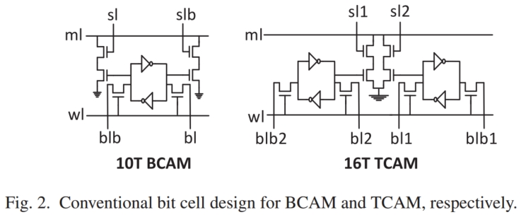

因此本文能够使用6T SRAM紧凑的单元实现CAM的方案就显得非常有意义。同时，该论文在保留SRAM存储功能的基础上还实现了TCAM以及一些基础的逻辑操作（AND和NOR）。该论文不仅提出了实现方案，还通过一些精巧的设计保证了该设计的高性能，而且分析的面面俱到，是一个相当优秀的工作。

在此也先简单总结一下该设计的最终性能：基于6T 28nm FDSOI SRAM工艺，实现了$64\times 64 (4kb)$ BCAM，在1V工作电压下，BCAM的工作频率为370 MHz，能效为$0.5\ fJ/search/bit$，两个64-bit words的逻辑操作的频率达到787 MHz。

接下来开始介绍该工作的细节，受限简单介绍一下传统CAM搜索的原理。如Fig. 3所示，存储单元中的比特与输入的比特进行XNOR操作，然后同一根match line上的所有同或结果进行线与逻辑，最终通过SA输出匹配结果。在很多查找应用中，可能需要匹配多个结果，如果只需要单个地址，也可以对结果进行优先编码。这里对搜索的结果进行优先编码也可能对今后的研究有一些启示，很多时候想用到优先编码，但是还没有遇到合适的场合。

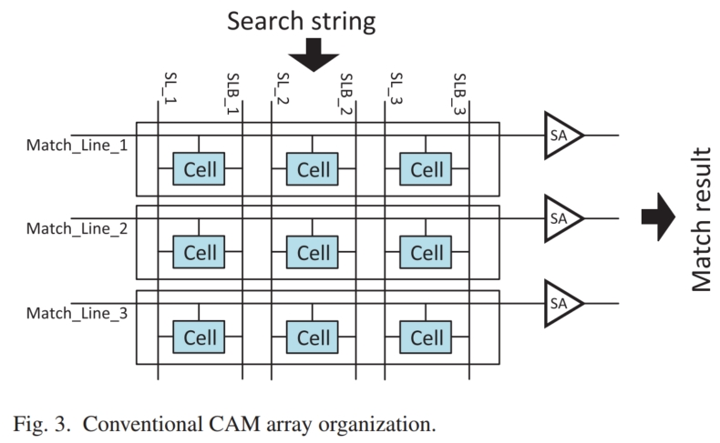

接下来看这篇论文提出的6T BCAM设计，如Fig. 4所示。该设计使用标准SRAM中的位线 作为match lines，使用WL表示搜索序列按列进行搜索匹配。而传统的SRAM存储功能仍然保持，可以动态配置成BCAM/TCAM/Logic/SRAM storage。为此，需要对电路进行一些特殊设计，以兼容多种模式，这些在本文中也一一进行了详细的介绍，之后我也会对一些关键的考虑进行简单的介绍。

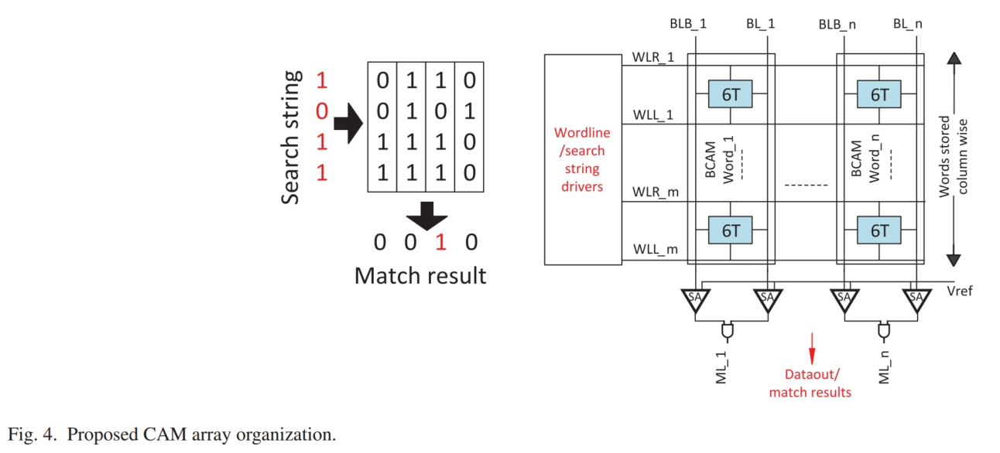

从Fig. 4中，我们可以看到为了兼容CAM的功能，作者在传统的6T SRAM基础上进行了些微的改动，那就是将WL变为两根，WLR和WLL，分别对与BL和BLB相连的晶体管进行门控（这在Fig. 5中可以看得更加清楚）。文中对这一设计的代价总结为:
> "This creates two indeppendent access transistors but incur no area penalty since the push-rule layers are kept intact (i.e., only DRC-compliant metallization changes are made)."

在这里重点指出这一点的原因在于：之前我在和其他人讨论类似的设计的时候，我想通过一根WL改进设计，大家觉得增加这一根线会对面积开销产生很大的影响，这与这边作者的观点相左，暂时看不懂这里为什么面积不会有很大的影响，今后的研究中可能会借鉴这个观点。

废话说完，开始真正介绍三种工作模式：

**1. BCAM**

Fig. 5展示的是该设计实现BCAM搜索的过程，Search string从WLR\/WLL输入，当输入为1时，WLR=1，WLL=0，表明BL对应的门控晶体管开启，BLB对应的门控晶体管截止。如果对应的SRAM cell存的值为1，则BL对应的门控晶体管D\/S端都为高电平，结果是BL和BLB的最终电位都为高，而如果存储的值为0，则BL预充的高电平会通过SRAM cell放电，从而将BL上电位下拉到0，BLB上电位仍然保持高电平。当输入为0时，工作情况类似，只是BLB对应的门控晶体管开启。因此同一条BL对应的SRAM cell只要有任意一比特无法跟search string bit匹配，BL或BLB会被下拉到低电平，最终与门输出为0，否则输出为1，表示完全匹配。

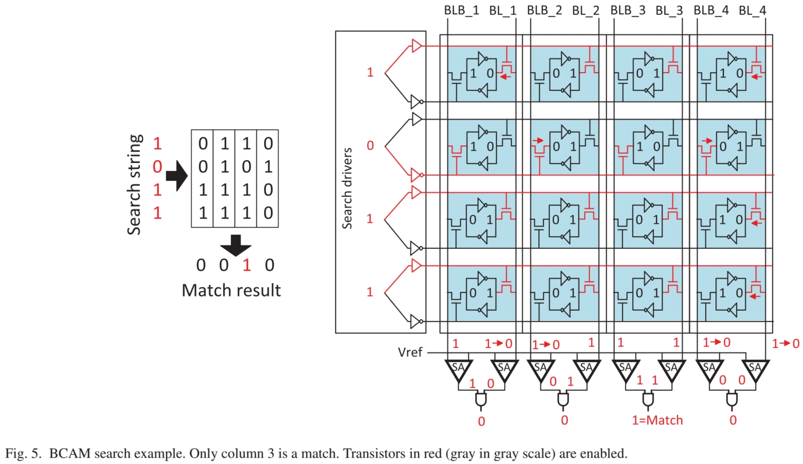

Note:

- 基于SRAM的CAM相对于忆阻器的CAM还有一个有点就是搜索的字长可以做到特别长，因为SRAM的off state可以做到几乎不漏电。
- 针对SRAM的读操作和BCAM的操作，SA的工作机制是不同的，该设计提出了一种SA，可以在不增加面积的基础上，实现可重构的两种功能的SA，如Fig. 6所示。
  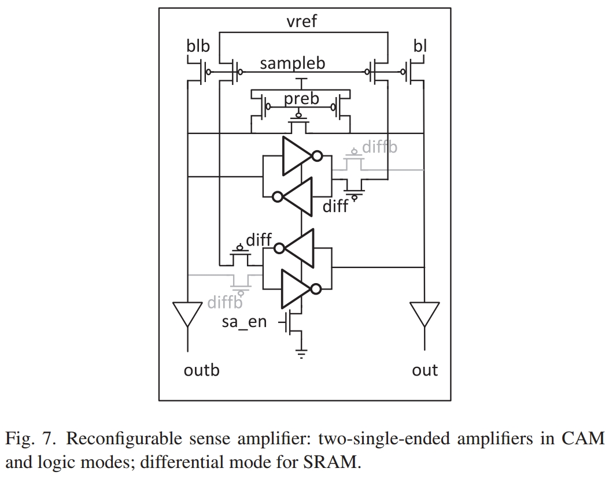
- SRAM是逐行写，CAM是对所有列进行匹配，数据需要逐列写。这要是在我看来就是不可能的，这个方案就放弃了，但是作者可能巧妙地解决了这一问题，不仅是磕盐的态度，对于行和列都要写的方案在今后的设计中也可以参考，毕竟有时候经常需要行/列都进行操作，比如矩阵的转置等等，比如从一个bank中逐行读出，逐列写入另一个bank。之前陈怡然也有一篇工作涉及到行列操作的CAM，也可以一起总结一下。这个按列去写刚好受益于有两根WL，这跟BL是等价的。逐行写数据从BL输入，逐列写数据从WL输入。
- 该工作还考虑了同时开启多行对SRAM cell中数据的破坏进行了分析，并提出了解决方案。

**2. TCAM**

TCAM的工作原理如Fig. 13所示，由于TCAM中存在三种状态"1", "0", "X"，所以需要使用两比特来实现，相邻的两列表示一比特，其中存储"00"表示“0”，存储“11”表示“1”，存储“01”表示“X”，当存储的值为“01”是，左列的BLB对应的SRAM cell输出为“1”，右列的BL对应的SRAM输出也为“1”，因此无论输入是“0”还是“1”，都不会将BL或BLB下拉到低电平。在其他文章中，认为该设计在实现TCAM时，只需要将WLR和WLL都设置为GND，这样使用BCAM同样的电路就可以实现TCAM的功能。而在本文中，作者自己竟然用了两倍的面积来实现TCAM的功能。不仔细看还会以为本文作者犯了一个错误，其实并不是这样子的。这是如何定义TCAM的一个问题。如果对于输入的某些bit进行mask的话，这样输入的这些bit与所有搜索项目的对应bit都不会去比较，个人感觉这种是比较常用的，但是对于优先编码等应用场合，这种就不适用了，需要将对应的某一搜索项的某些bit进行mask，这样就需要用到本文中所提出的方案，也没有去查TCAM的具体定义，可能这中才是真正的TCAM（杨老师Nature Electronics论文中也是实现的这种方式），以后研究过程中可以用这个电路。

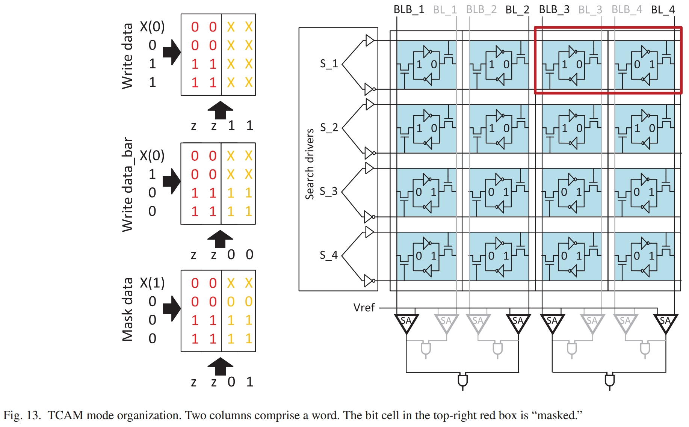

**3. Logic Operations**

该设计实现“AND”逻辑如Fig. 15所示，逻辑操作与存储相同，是以行为单位进行的。要对某两行进行逻辑操作，将对应的WL输入设置为“1”（即WLR=VDD, WLL=GND)，其他行WLL=WLR=GND进行MASK。开启的两行中对应的2个SRAM cell中只要有一个cell存储的值为0，就会将BL下拉到低电平，即实现了“AND”操作。“NOR”操作方式与“AND”类似，TABLE I总结了这两种操作的配置。

该设计的整体架构如Fig. 16所示。

最后，放置一些实验结果，以对该设计的性能有一个更加深入的了解。

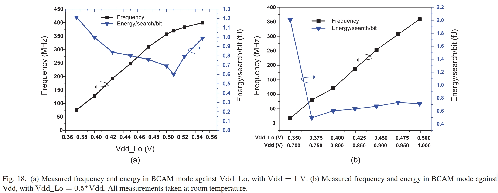

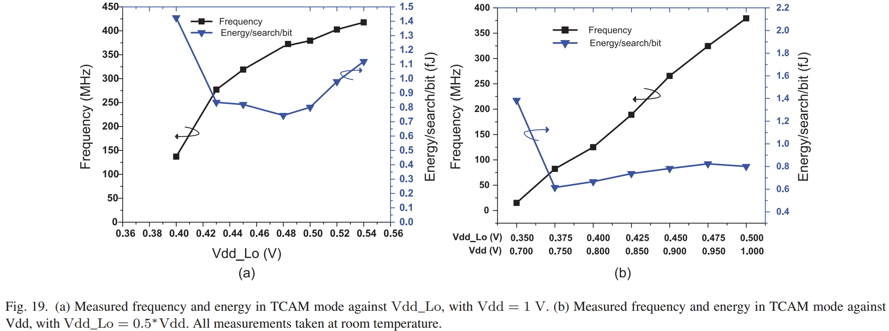

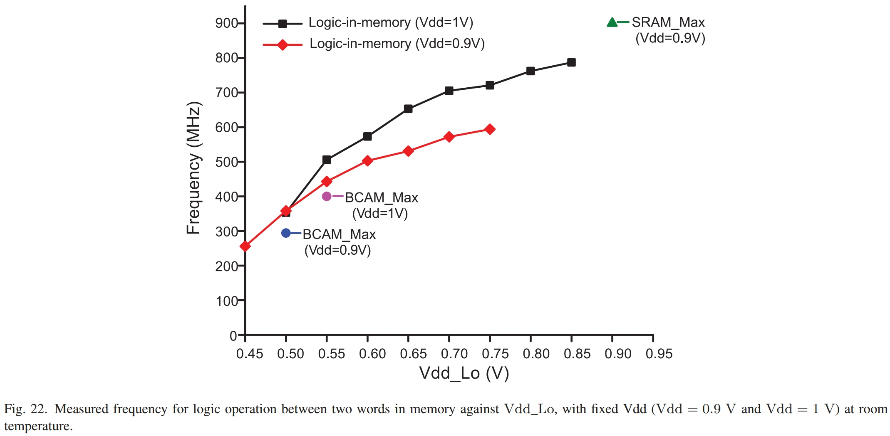

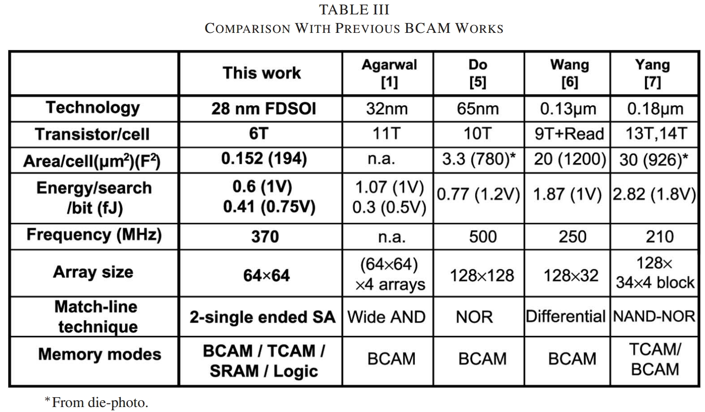

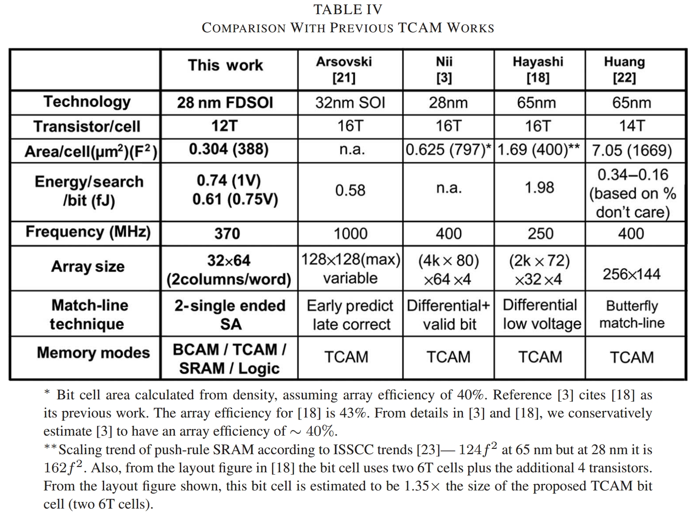