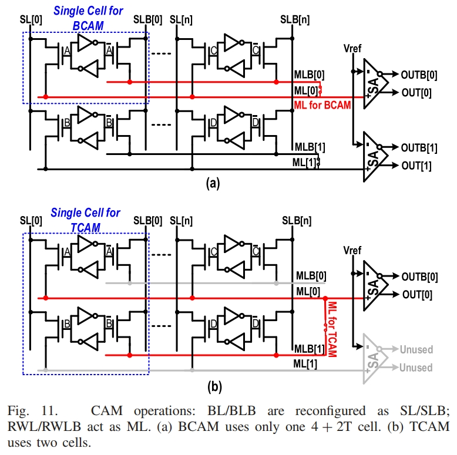
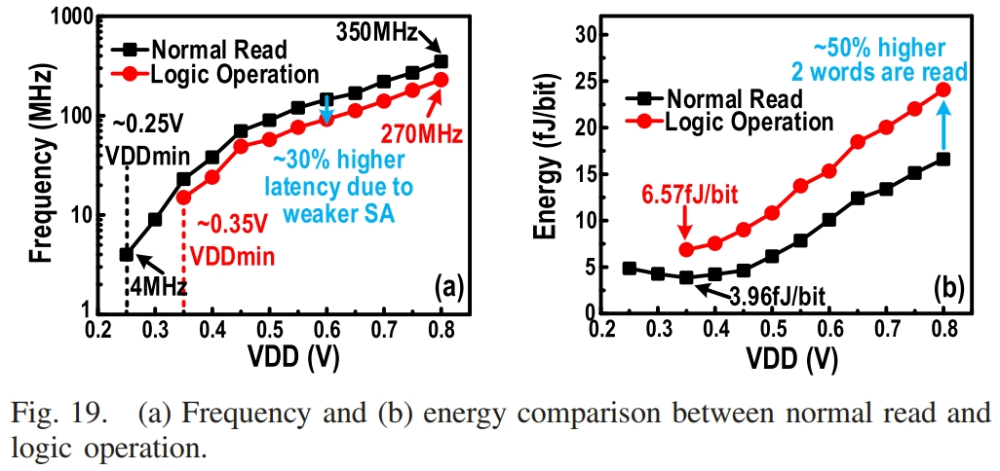

# A 4 + 2T SRAM for Searching and In-Memory Computing With 0.3-V VDDmin

<!-- TOC -->

- [A 4 + 2T SRAM for Searching and In-Memory Computing With 0.3-V VDDmin](#a-4--2t-sram-for-searching-and-in-memory-computing-with-03-v-vddmin)
  - [背景介绍](#背景介绍)
  - [现有工作存在的问题](#现有工作存在的问题)
  - [本文的目标](#本文的目标)
  - [本文工作细节](#本文工作细节)
    - [4 + 2T SRAM Cell 结构](#4--2t-sram-cell-结构)
    - [SRAM支持的操作模式](#sram支持的操作模式)
  - [测试结果](#测试结果)
  - [总结](#总结)

<!-- /TOC -->

## 背景介绍

传统的冯诺依曼 (CVN) 架构在memory bank和计算元素之间持续传输数据，会产生大量的能源和延迟成本，这些成本可能会影响系统功率和性能，如图1所示。为了最小化能耗和延迟，最近提出了IMC(In-Memory Computing)。IMC同时激活多行，直接在BL上进行逻辑操作。IMC不仅减少了数据移动以及操作的延迟，而且受益于memory bank的高带宽，有可能实现高并行计算。

如图2所示，基于6T SRAM的IMC相比于传统冯诺依曼（CVN）显示出比较大的能效和速度优势。

## 现有工作存在的问题

但是SRAM-based IMC仍存在一下问题：

- 当多行同时激活时，传统的6T SRAM的读取噪声容限会降低。因此需要WL欠驱动来改善噪声容限，这会大幅度降低读取速度。此外，由于读取噪声容限下降，$VDD_{min}$被限制在大约0.7V。因此整体功耗很高。（memory access和leakage仍然主导IMC的系统能耗，如图2b所示。）
- 8T SRAM通过隔离SRAM的读取路径和编程路径，能够有效的提高读取的噪声容限，但是面积开销会增加30%。同时由于只有一根BL用于读取，8T SRAM只能实现AND逻辑。
- 10T SRAM能够克服8T SRAM的不足，但是会带来更大的面积开销。

## 本文的目标

因此，本文的目标是：提出4 + 2T SRAM单元的方案，能够实现比传统6T SRAM更好的读取噪声容限，同时带来较小的面积开销，以及以较小的能耗支持更多的计算。

## 本文工作细节

### 4 + 2T SRAM Cell 结构

该论文提出的4 + 2T SRAM结构如图3(a)所示。该SRAM中PU是使用DNW制作的深耗尽PMOS，能够通过体偏效应控制PMOS的阈值电压，从而不需要PG，只需要四个管子即可进行SRAM的编程。同时，读取BL也通过栅控晶体管与SRAM cell进行隔离，cell的电位能够通过栅控晶体管控制BL的放电与否，但是BL上的电压无法反向传播改写SRAM的值，因此可以同时打开多行SRAM进行计算。此外，互补的RBL和RBLB可以实现更多的逻辑操作。

### SRAM支持的操作模式

4 + 2T SRAM支持的所有操作以及各端口电压配置如表1所示。

1. Write

   

   图5展示了对2x2 SRAM阵列进行写操作。在Standby模式下，WBL和WBLB都处于高电平$VDD_H$，其中$VDD_H$高于$VDD$。对SRAM单元进行写操作时，以写"0"为例，先将WBL拉低至GND，此时节点n1从$VDD$降低至$V_{thp}$。然后拉低WWL，以降低PU的阈值电压，n1对应的PU导通，将n1拉低到0，同时n2对应的PU开启，PD关断，n2被上拉到1，WBL/WBLB上的输入会被写入SRAM单元中。

2. Read
   
   

   正常读操作如图9(a)所示，读操作时，某一行对应的RWL/RWLB被拉低到GND以激活读操作，SRAM cell保存的值决定两个栅控晶体管的开关，从而导致RBL或RBLB连通到RWL或RWLB放电，通过两个差分SA可以检测出RBL和RBLB上的电压。这边存在两点考虑：(1) 使用差分SA代替单端反相器，以提高感测速度；(2) 如果未选择行保存的值为1，则会导致RWL向RBL漏电，RBL无法下拉到GND，因此使用差分交叉耦合SA，能够检测RBL上很小的电压下降。

3. In-Memory-Logic operations
   
   如图9(b)所示，该电路支持AND, NOR和XOR逻辑操作，所有的逻辑操作都在一个周期内完成。

4. BCAM
   
   

   BCAM操作如图11(a)所示，此时RBL和RBLB复用为SL和SLB，作为搜索的输入。RWL复用为ML。如果搜索的属于与该行保存的数据完全匹配，则不存在任何的ML不存在任何的放电通路。否则，SL或SLB将ML拉低，行方向的SA用于BCAM的检测。
   该方案于传统的6T SRAM-based BCAM的优势在于：(1) 搜索仍是按行进行，因此保存的数据不需要转置（按列保存）；(2) 多行同时激活，数据不会被改写。图12展示的是一个BCAM搜索的例子。
   

5. TCAM
   
   TCAM操作原理如图11(b)所示，操作于BCAM类似，区别在于使用2个cell保存三种状态。图13展示的是一个TCAM搜索的例子。
   

## 测试结果

图16显示了测量单元的write margin，绿色区域表明超过5$\sigma$的write margin，其中标注的balanced green region至少存在200mV margin。

图17显示：

- 0.8V VDD下，写频率达到600MHz；
- 最小供电电压为VDD/VDDH=0.25/0.30V；
- 最优的写能效为4.02 fJ/bit，对应VDD=0.35V.

图18是在1-bit mismatch下测量，结果表明：

- BCAM操作的$VDD_{min}=0.35V$，此时对应最优的BCAM搜索能效0.13 fJ/bit。
- TCAM和TCAM实现的频率相同，在VDD=0.8V时达到225MHz。
- TCAM的搜索能耗是BCAM的2倍。

图19表明：

- read $VDD_{min}=0.25V$;
- logic operation $VDD_{min}=0.35V$（emploing single-port sensing and half-strength SA）;
- 最优读能效为3.96 fJ/bit，对应VDD=0.35V；
- 最优逻辑操作能效为6.57 fJ/bit，对应VDD=0.35V；
- 最高读频率350 MHz;
- 最高逻辑操作频率270 MHz。

与近存计算相比，总延迟降低35%，总能耗降低25%。

实现最低的访问能耗和比较好的$VDD_{min}$

我们以最小的面积开销实现了可比的$VDD_{min}$和最低的读取能量。

## 总结

4 + 2T SRAM方案：

- 相比于8T SRAM方案，面积节省15%。
- 差分解耦读取路径可实现可靠的多字同时激活以执行布尔逻辑功能。
- 与近内存计算相比，IMC 分别节省了 35% 和 25% 的延迟和能源。
- BCAM 在 0.35 V 下达到 0.13 fJ/search/bit。
- 工艺角仿真实现0.3V读/写$VDD_{min}$。
- 该工作需要额外的电压供电。