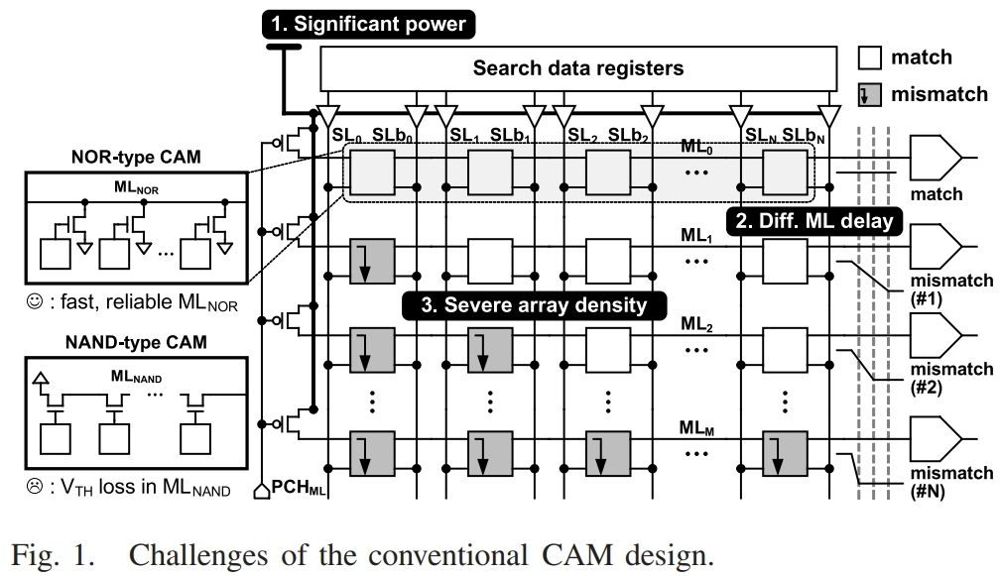

# A 65-nm 0.6-fJ/Bit/Search Ternary Content Addressable Memory Using an Adaptive Match-Line Discharge

## Motivation

用于完全并行搜索操作的匹配线 (ML) 和搜索线 (SL) 的大量切换是以巨大的动态功耗为代价的。此外，随着内存容量和时钟速度的增加，CAM 设计变得更加难以满足功耗和性能预算。

如图1所示，传统的CAM设计存在三点挑战：

1. 多有访问条目每个周期都会改变具有大寄生电容布线的电压，这会导致巨大的功耗并产生大量的热量；
2. 由失配数量的差异，entry之间具有不同的感知延迟，导致搜索性能下降；
3. 由于所有访问entry的搜索操作的行数(ML和SL)多，因此阵列密度低。