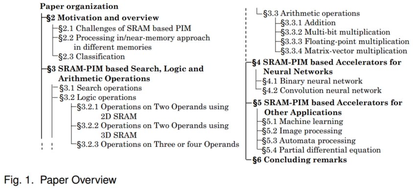
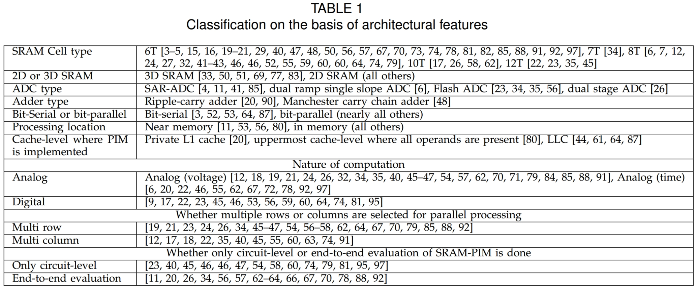
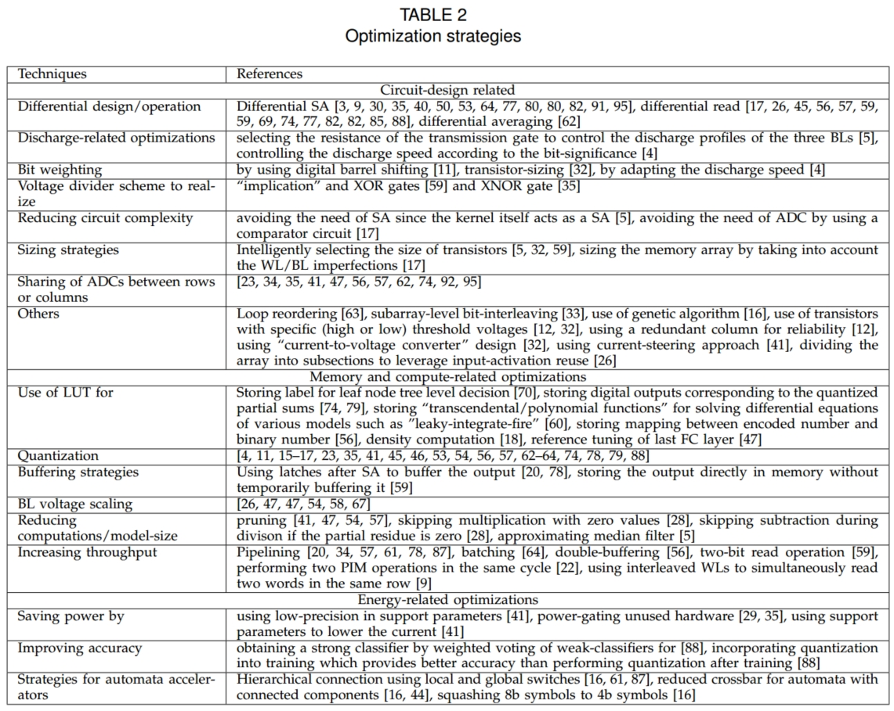
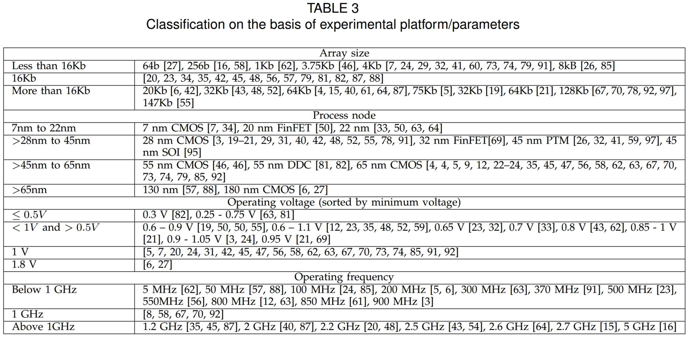
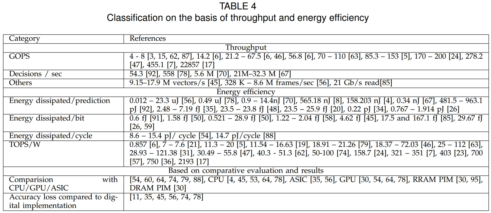
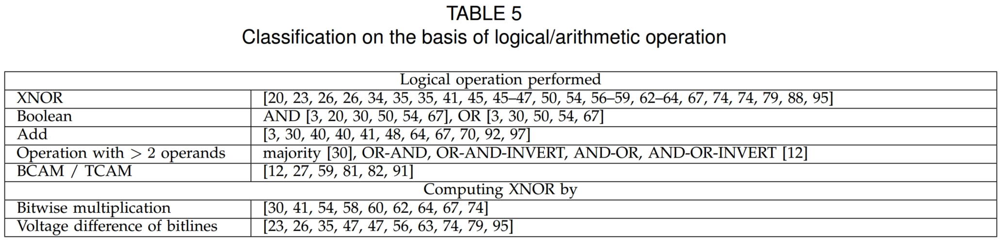
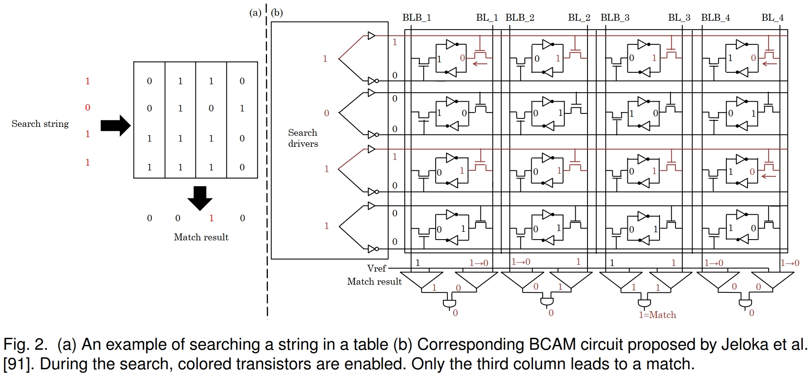
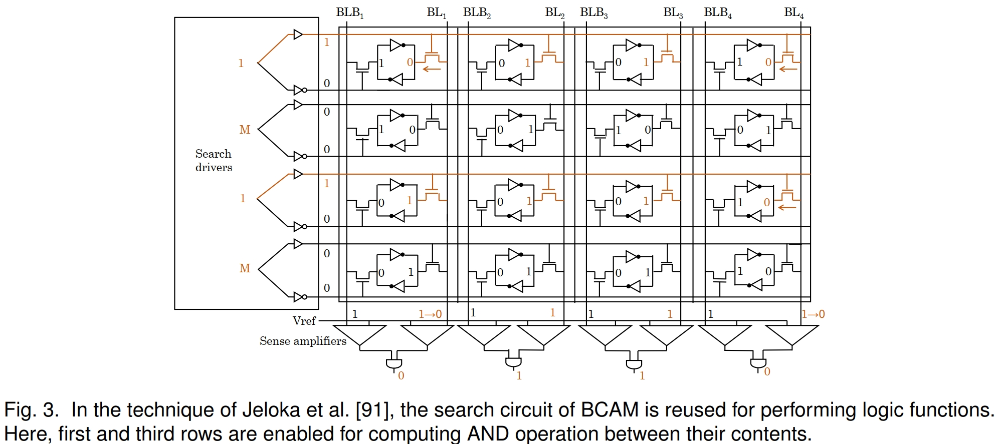
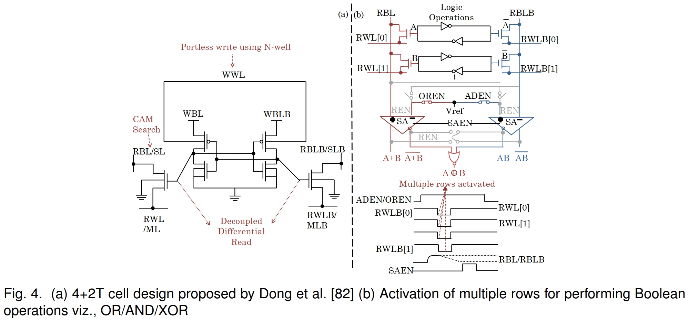
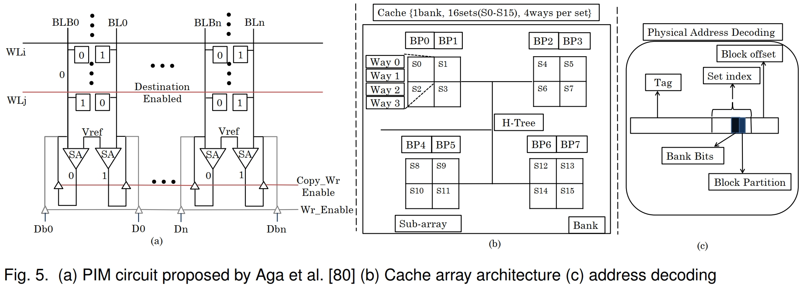

# A Survey of SRAM-based Processing-in-Memory Techniques and Applications

## 摘要

随着冯诺依曼计算架构越来越受到数据移动开销的限制，研究人员开始探索内存处理(PIM)技术来抵消数据移动开销。由于SRAM的广泛使用，用于SRAM的PIM技术有望加速广泛的计算系统和应用程序。在本文中，我们对使用SRAM存储器进行内存处理的技术进行了调查。我们回顾了使用SRAM-PIM来实现布尔运算、搜索和算术运算，以及用于机器学习（尤其是神经网络）和自动机计算的加速器。本文旨在通过向算法和硬件架构领域的研究人员介绍基于SRAM的PIM技术的最新发展来加速协同设计工作。

## 索引词

Review, deep neural networks, SRAM, cache, computing in memory, neural network, automata computing

## 介绍

数据传输产生的能量比算术运算高一百多倍。因此，传统的“冯诺依曼式”以计算为中心的处理器受到数据移动开销的严重限制。“内存处理”（PIM）是一种避免数据移动惩罚的有前途的方法。由于SRAM是一种商业成熟的技术，并且已经可用于各种规模和形状的计算系统，因此SRAM-PIM方法可以对计算行业的格局产生革命性的影响。

要了解SRAM-PIM的潜力，以具有多级缓存的CPU为例。在缓存子系统中，数据移动以两种方式发生。首先，数据传输发生在缓存级别之间。例如，数据从LLC移至L1，然后移至寄存器，最后移至功能单元。启用PIM的LLC可以避免这些开销。此外，共享LLC可以降低两个内核之间共享数据的开销，因为可以避免通过共享LLC在不同内核的私有L1缓存之间传输块。其次，由于H树互连上的数据传输和控制结构，缓存内部会产生延迟。在4GHz频率下，SRAM访问和LLC访问延迟分别为1个周期和30个周期。由于PIM方案仅访问SRAM阵列，因此它们产生的延迟可以忽略不计。

SRAM-PIM可以极大地有益于数据密集型应用，例如神经网络和模式匹配。例如，神经网络训练在大型数据集上运行，推理涉及对不同层的权重的计算。完全在SRAM中执行布尔运算和算术运算可以提高它们的效率。类似地，基因组学和自然语言处理中的许多模式匹配应用程序执行有限自动机式处理。在模式匹配应用中使用SRAM-PIM时，自动机状态转换完全发生在存储器内部。这避免了在基于CPU的处理中产生的分支错误预测和不规则内存访问的开销。此外，使用具有高扇入和扇出的互连可以将输入序列与许多候选序列相匹配。因此，SRAM-PIM可以提供大量的并行性。同样，在内存中执行搜索和比较操作可以提升压缩、编码和搜索引擎的性能。基于PIM的逻辑操作可以加速加密、图形索引和数据库应用程序。

然而，SRAM-PIM的使用也带来了许多挑战。在6T SRAM中，PIM的使用会导致严重的可靠性问题，例如读取干扰和读取噪声容限下降。虽然使用8T或10T单元减轻了这些限制，但它们也会导致更高的面积开销。此外，为大规模DNN设计加速器会带来诸如大列电流等挑战，这会导致供电问题和传感故障。最后，模拟域操作需要消耗大量面积和能量的ADC/DAC。显然，实现SRAM-PIM的全部潜力需要新颖和智能的技术。

在本文中，我们对基于SRAM的PIM技术进行了调研。图1显示了该论文的概述。第2节提供了动机和分类。第3节介绍了基于SRAM-PIM的逻辑、搜索和算术运算的实现。第4节展示了使用SRAM-PIM来加速神经网络应用。第5节展示了它在加速机器学习、自动机处理和偏微分方程求解方面的用途。第6节总结了论文，并简要提及了未来的研究挑战。

本文中经常使用以下缩写词：位线（BL）、位线条（BLB）、二元/-卷积/深度神经网络（BNN/CNN/DNN）、反向传播（BWP）、二元/三元内容可寻址存储器 (BCAM/TCAM)、缓存自动化 (CA)、卷积 (CONV)、数模转换器 (DAC)、双端口互锁存储单元 (DPDICE)、确定性下推自动机 (DPDA)、特征图 (fmap)、完全连接（FC）、指令集架构（ISA）、反相器（INV）、最近邻（kNN）、末级缓存（LLC）、查找表（LUT）、本地位线（LBL）、乘法和累加（MAC）、单片 3 维 (M3D)、矩阵向量乘法 (MVM)、非确定性有限自动机 (NFA)、感测放大器 (SA)、单指令多线程/数据 (SIMT/SIMD)、源代码行 (SL)、“连续-近似寄存器-模数转换器”（SAR-ADC）、支持向量机（SVM）、硅通孔（TSV）、“超大指令字”（VLIW）、字线(WL)、写 WL (WWL)、xnor 和累加 (XAC)

## 动机和概述

在本节中，我们首先讨论实现基于SRAM的PIM（第2.1节）的挑战。为了正确看待事情，我们将SRAM-PIM方法与DRAM和RRAM中的PIM方法进行比较（第2.2节）。然后，我们提供了基于几个类别的研究工作分类（第2.3节）。

### 基于SRAM的PIM的挑战

- **SRAM密度低:** SRAM具有低密度和高泄漏能量。因此，SRAM-PIM更适合小规模数据集。
- **6T SRAM的局限性:** 使用6T SRAM更适合设计最后一级缓存，因为它们已针对该区域进行了优化。在6T SRAM中，激活多行会降低读取噪声容限。它可以创建短路路径，可以随机翻转单元状态。此外，在BL放电后，由于6T SRAM的读写路径是共享的，因此激活下一个WL会导致伪写操作。
为避免数据损坏，可以调整WL电压。这严重限制了操作频率，例如Jeloka等人在1V下使用800 MHz频率，Wang等人在1.1V时使用475 MHz频率。此外，由于工作裕度小，Vdd不能低于0.7V。这导致高动态和泄漏能量消耗。为了提高噪声容限，需要进行WL欠驱动，这会增加读取延迟。作为避免6T SRAM数据损坏问题的另一种解决方案，可以使用脉宽调制WL。该解决方案避免了同时激活两个WL，但将外围电路的面积增加了2倍以上。这边可以加上BLADE的local bitline
- **8T/10T SRAM的局限性：** 为了克服6T SRAM的限制，可以使用8T或10Tbitcell。8T SRAM将读和写路径解耦，这允许独立优化它们的读/写操作。这提高了裕度并允许降低最小Vdd，这降低了功耗。然而，与6T SRAM相比，8T SRAM会导致30%的面积损失。此外，由于8T SRAM使用单个读取BL，因此它仅计算AND运算。需要特殊的架构来支持其他逻辑功能。10T SRAM克服了这个问题，但会导致更高的面积损失。
- **模拟域的限制：** 模拟域操作更容易受到工艺变化、噪声、非线性I-V特性和老化的影响。此外，使用ADC/DAC会降低信号精度并造成能量/面积损失。
- **映射大型DNN的挑战：** 大规模DNN具有数千个量级的权重矩阵。然而，由于以下原因，无法在SRAM中实现如此大的矩阵：(1) 多个WL的激活需要高列电流。这会导致大量的瞬时功率，从而产生热和功率传输问题。(2) 工艺变化会使SA产生偏移。随着列电流的上升，感测失败的可能性更高。(3) 长导线具有高阻容(RC)延迟。这些挑战可以通过对SRAM阵列进行分区来缓解，该阵列将大矩阵拆分为多个较小的矩阵。但是，如果使用二元神经元累积来自不同子阵列的部分和，则此方法可能会影响分类精度。

### 在不同内存中处理内存中/近内存方法

比较不同内存技术中的 PIM 方法是很有见地的。

- **DRAM:** 基于DRAM的内存处理提出了至关重要的挑战。(1) 由于DRAM读取是破坏性的，PIM计算破坏了原始数据。为了避免数据丢失，需要复制到别处，这会导致很大的开销。(2) 感测DRAM电容的余量小，导致模拟计算错误。修改单元设计的技术会导致大量的面积损失。(3) 技术差异阻碍了PIM所需的外围逻辑与DRAM的轻松集成。(4) DRAM中使用的数据/地址加扰技术对将其用于PIM操作提出了挑战。基于DRAM的近数据计算技术利用芯片堆叠将逻辑芯片与DRAM芯片集成在一起。然而，这会在制造和操作期间产生问题。
- **RRAM:** RRAM的优点是单元面积小。然而，RRAM设备具有非常低的耐用性和较大的写入延迟/能量。因此，频繁的重量更新可能会导致达到耐力极限。此外，基于RRAM的PIM在支持浮点计算方面面临着严峻的挑战。这是因为RRAM单元和ADC的分辨率有限。这需要使用多个单元格来表示浮点值。此外，指数归一化需要多次操作，由于RRAM的高延迟和低写耐久性，这尤其昂贵。事实上，范伯格等人使用128个RRAM单元来存储双精度 (64b) 数，其中64个单元仅用于执行归一化和对齐。相比之下，SRAM-PIM技术完全在SRAM阵列内部执行数字浮点计算。此外，在BWP阶段，使用转置权重矩阵执行CONV。为此，执行逐列读取操作，这会降低吞吐量和能源效率。

### 分类

表 1 根据架构和实验参数对作品进行分类。如表 1 所示，大多数工作仅进行了电路或架构级评估。只有少数作品对从电路到系统的整个堆栈进行了评估。
表 2 根据它们的优化策略对作品进行分类。
表3根据实验平台和参数对作品进行分类。
表 4 根据实验结果对作品进行分类，例如它们的吞吐量和能效值。

## 基于 SRAM-PIM 的搜索、逻辑和算术运算

在本节中，我们将讨论基于SRAM-PIM的搜索操作（第3.1节）、逻辑运算（第3.2节）和算术运算（第3.3节）的实现。表5显示了由各种技术执行的基本操作。在BNN中，CONV操作被简单地计算为按位XNOR和population-count操作。因此，基于SRAM-PIM的XNOR实现可以加速BNN。
XOR运算可以使用NOR和AND运算来实现，如下所示： A XOR B = (A AND B) OR (A AND B)。大于/小于操作是通过减去操作数并读取MSB来执行的。大多数作品通过使用移位加法来执行乘法。对于有符号数的乘法，乘积的符号位是通过计算操作数的符号位的异或来获得的。

### 搜索操作

通常，BCAM使用10T SRAM，TCAM使用16T SRAM。然而，非推规则CAM位单元比推规则6T SRAM大得多，这使得CAM区域非常大。杰洛卡等人提出了一种使用推式6T SRAM位单元设计的CAM电路。它们以列方式存储单词，如图 2(a)所示。它们的电路设计如图 2(b)所示。WL分为WL-right和WL-left，它们创建了两个独立的存取晶体管。搜索查询及其互补分别应用于WL-right和WL-left。如果匹配，BL和BLB都保持在Vdd。在不匹配的情况下，它们中的一个或两个放电。使用两个单端SA分别读取它们。它们之间的AND运算显示列中的匹配项。该过程对所有列并行完成。总体而言，他们的技术将搜索数据与存取晶体管中存储的数据执行XNOR，然后在BL SA上执行AND运算。

TCAM需要为每个单词使用两列，这将其容量减少了一半。在TCAM中，0和1分别对应组合“00”和“11”，而X对应组合“01”。屏蔽位(X)不会拉低BL或BLB，因为它在两个位置都存储了1。因此，它匹配搜索查询的0和1。要写入CAM，可以在内存模式下以行方式写入数据的转置。但是，这只执行批量写入，不允许写入特定元素。为了允许逐列写入操作，他们提出了一种写入策略，该策略在BCAM的两个周期和TCAM的三个周期内完成。

SRAM可以在三种模式下运行：内存、BCAM或TCAM。在传统存储模式中，字按行存储，地址应用于WL，正在读取的数据在BL上可用。他们提出的存储器可以对以行方式存储的多个字执行AND和NOR运算。例如，要实现与运算，就使用了BCAM模式。在这里，通过向WL-left和WL-right都提供0来屏蔽搜索字符串的输入位（在图 3中显示为M）。使用它，可以激活多行的WL。在图 3中，搜索查询是(1,M,1,M)，它为第1行和第3行启用WL-right。如果第1行或第3行中的任何位为0，则预充电的BL被下拉。此外，所有WL左晶体管都被停用，所有BLB保持高电平。这计算第1行和第3行的按位与。

为了执行NOR操作，只有WL左存取晶体管被激活，并且在搜索查询中应用0。“01”模式激活A行的WL-left和B行的WL-right。这读取BLB SA上的A和BL SA上的B。这些的AND运算提供了输出。他们的CAM实现了比传统CAM设计高四倍的密度。然而，在CAM模式下，他们的技术以比内存模式低的速度运行。此外，实现可重构功能所需的额外外设会导致较小的面积开销。

位线计算方法基于以下观察：在同时激活多个（例如，高达64个）WL时，共享BL提供存储在这两个激活行中的数据之间的NOR和AND运算的结果。为了防止由于多行访问而导致数据退化，降低WL电压以偏置SRAM阵列上的写入。通过进一步降低WL电压，可以增强鲁棒性，但也会增加延迟。

董等人提出了一种基于“深耗尽沟道”技术的4+2T SRAM单元。它可以执行逻辑操作并充当BCAM/TCAM。单元设计如图 4(a)所示。它具有解耦读写路径。该单元有6个晶体管，其中4个晶体管形成交叉耦合反相器对。这些逆变器具有不同的Vdd端子，用作WBL/WBLB。另外两个晶体管用作允许差分读取的存取晶体管。他们的单元有两个“栅极连接的差分读取端口”。这将存储节点与RWL和RBL/RBLB隔离。这提高了“读取噪声容限”并提高了激活多个字时的电路可靠性。该单元将n阱用作WWL，从而无需写存取晶体管。

他们使用差分RBL和RBLB来实现PIM操作。PIM操作的工作原理如图 4(b)所示。对于PIM，最初，RBLB和RBL都预充电到Vdd。此后，同时启用两对WL。如果A或B等于1，则RBL放电，因此，RBL计算(A NOR B)。如果A和B都等于1，则RBLB变高，因此，RBLB计算(A AND B)。他们用两个微小的差分SA评估RBLB和RBL。在通过来自Vdd的小电压降低RBL/RBLB时，SA在潜行电流消失之前将RBL/RBLB上的电压与参考电压(Vref)进行比较。由于SA的不同操作，AND/NAND和OR/NOR是同时计算的。两个SA结果之间的NOR门计算A XOR B。

对于CAM功能，RBL/RBLB提供搜索数据SL/SLB。此外，两个存取晶体管的RWL被分成ML/MLB。对于BCAM，一行的MLB和ML短接为一个ML。如果一行中的整个输入与存储的数据相同，ML保持高电平，否则它会被释放。每个ML都包含一个行级SA，其一端连接到Vref以评估结果。TCAM需要两个单元格。这里，ML[0]和MLB[1]相连，将单元A和B组合为一个TCAM单元。当AB单元格的值分别为00/11/01时，它表示1/0/X。他们的“4+2T单元”具有比6T SRAM更好的噪声容限和比8T SRAM更小的面积。此外，BCAM可以在0.3V的最小Vdd下运行。他们设计的局限性在于它依赖于一个不常见的4T位单元，该位单元面临不稳定和读取干扰问题。此外，它具有较差的性能/电压缩放（0.6V 时为 100Mhz）。

### 逻辑运算

#### 使用 2D SRAM 对两个操作数的操作

阿加等人通过修改Jeloka等人提出的位线计算电路，提出了一种in-SRAM计算技术。他们添加了一个解码器来缓存子数组，这会激活两个WL，每个操作数一个。差分SA被重新配置以获得两个单端SA。它们用于分别感测绑定到位单元的两个BL。它们通过对BL和BLB进行NOR运算来扩展用于实现XOR运算的电路。为了比较两个字，他们使用有线NOR组合按位异或结果。搜索是通过与存储在子数组中的缓存块重复比较来执行的。为了将一个WL复制到另一个WL，SA的输出被反馈到BL。由于最后一个读取值要在下一个周期写入，因此“读写操作”合并以有效复制数据，如图5（a）所示。为了清零缓存块，在写操作之前，输入数据锁存器被复位。为了实现“无进位乘法”，首先将两个子阵列行进行“与”运算。然后，使用“XOR减少树”减少结果位。

PIM操作需要“操作数局部性”，即操作数必须映射到共享相同BL的子数组。他们将“块分区”定义为共享相同BL的子阵列中缓存块的集合。块分区中保存的任何两个缓存块之间都可以进行就地计算。考虑图 5(b)，它显示了一个带有四个子阵列的组。这里，子阵列中的每一行都有两个缓存块，因此每个子阵列都有两个块分区。就地计算可以发生在映射到相同“块分区”的块之间，例如，集合S1和S3中的块。如图 5(b)所示，他们的技术将集合的所有方式映射到相同的“块分区”，无论缓存块的存储方式如何，它都保留了操作数的局部性。此外，如图 5(c)所示，一些设置索引位（称为OLbits）用于决定块的存储体和分区。如果两个操作数的这些位相同，则将它们映射到同一分区。将集合的所有方式映射到同一分区的局限性在于它禁止并行标记数据访问。这种优化一般用在L1缓存中，以牺牲能量开销为代价来提高速度。