## 1. 简介

随着处理器复杂度的增加、处理任务的多样化以及性能分析工具数据的难以管理，使得性能分析的难度日益增加。同时，在某些领域中，对于资源和时间的限制更加严格，进一步要求性能分析给出分析速度和结果准确性更优的方法。

这篇文章给出了一个自顶向下的分析方法（Top-Down Analysis），可以在乱序处理器上快速定位真正的性能瓶颈。该方法通过将性能数据结构化、分层展示，直观快速的展示性能瓶颈，并且已经被包括 VTune 在内的众多性能工具使用。

不同于其他性能分析方法，该方法的开销很低，只需要在传统的 PMU(Performance Monitor Unit) 中增加 8 个简单的性能事件。它没有对问题域的限制，可以全面的进行性能分析，并且可以找到超标量核心的性能问题。

## 2. 背景

现代处理器在高性能方面有了长足的发展，比如大窗口无序执行（large-window out-of-order execution）、分支预测（predictive speculation）和硬件预取（hardware prefetching），这些方法使得程序都达到了很高的 IPC(instructions-per-cycle)。但是这些精密的设计在将性能推到更高的同时，也让程序能高速运行的条件变得苛刻，从众多数据中找到限制程序运行速度的原因也变得更加棘手。

从全局视角来说，现代 CPU 有两个主要的部分：前端（Frontend）和后端（Backend）。

前端负责从内存中拉取指令并将指令翻译为微操作（micro-operations, μops），这些 μops 会被传递给后端部分，但通常这些 μops 会暂存在 ready-μops-queue 中。

后端负责以原始程序中的顺序调度（schedule）、执行（execute）和提交（commit, retire）这些 μops。

Intel 第 3 代处理器（Ivy bridge）的微体系架构如图 1 所示

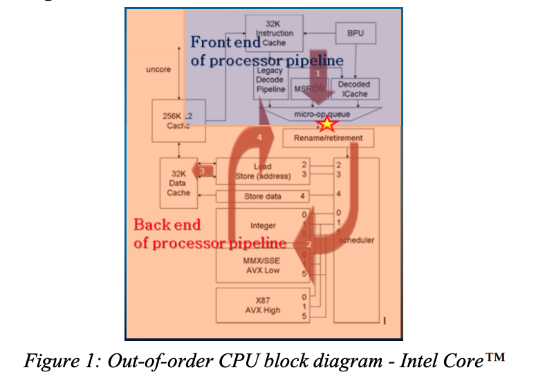

使用传统方法预估停顿（stalls），比如计算 cache misses 的公式 $StallCycles = \sum Penalty_i * MissEvent_i$  ，仅适用于顺序执行（in-order）的 CPU。这种方法不适用于现代 CPU 的原因有：

1. 停顿重叠（Stalls Overlap）：由于很多单元并行工作，比如当指令 cache 没有命中的时候，可能 data cache miss 被处理
   > Stalls overlap, where many units work in parallel. E.g. a data cache miss can be handled, while some future instruction is missing the instruction cache.
2. 预测执行（Speculative execution）：当 CPU 跑在错误的控制分支上时，相对于正确分支的事件，错误分支的事件应当淡化处理
   > Speculative execution, when CPU follows an incorrect control-path. Events from incorrect path are less critical than those from correct-path.
3. 基于工作负载的判罚（Penalties are workloaddependent）：传统算法假设每种工作负载判罚都是相同的，但是比如不同的分支在预测错误时，导致的判罚可能的不同的
   > Penalties are workloaddependent, while naïve-approach assumes a fixed penalty for all workloads. E.g. the distance between branches may add to a misprediction cost.
4. 预先设置好的事件（Restriction to a pre-defined set of miss-events）：现代复杂的微处理器架构，会出现多种可能的情况，预先设置好事件集合只能覆盖大多数情况
   > Restriction to a pre-defined set of miss-events, these sophisticated microarchitectures have so many possible hiccups and only the most common subset is covered by dedicated events.
5. 超标量统计不准确（Superscalar inaccuracy）：CPU 可以在一个周期内 issue、execute 和 retire 多个操作，在越来越多技术的加持下，应用被流水线带宽延迟限制的情况被缓和。
   > Superscalar inaccuracy, a CPU can issue, execute and retire multiple operations in a cycle. Some (e.g. client) applications become limited by the pipeline’s bandwidth as latency is mitigated with more and more techniques.

## 3. 自顶向下的分析（Top-Down Analysis）

自顶向下的分析方法旨在能快速准确的定位性能瓶颈点。该方法的执行过程为

1. 将 CPU 执行时间在较高结构层次上进行分类。这一步可以通过较高的数值标记（flagged）出性能较低的域（domain）
2. 层层下钻被标记的域（domain），最终可以确定性能出问题的一些具体的点，后面可以针对性的调查具体原因

### 3.1 层次结构（Hierarchy）

Top-Down Analysis 划定的层次结构如图 2 所示

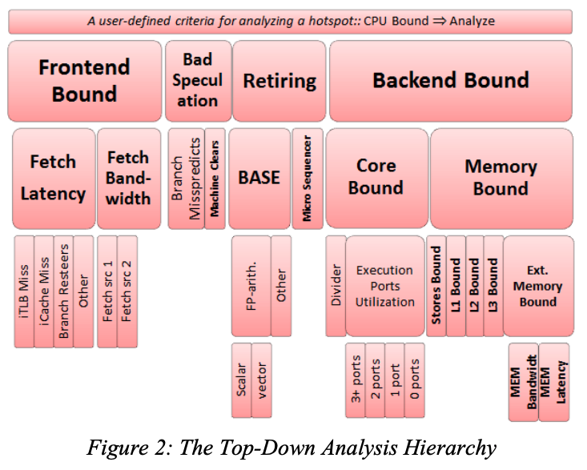

在 Top-Down Analysis 中，流水线被分解为四个基础的分类：Retiring、Bad Speculation、Frontend Bound 和 Backend Bound。

下面通过一个被 cache 性能限制的例子来介绍排查问题的流程，当使用 Top-Down Analysis 方法分析后：

1. 发现 Backend Bound 被标记，而 Frontend Bound 则不会被标记。此时应该下钻 Backend Bound 部分而忽略 Frontend Bound；

2. 下钻 Backend Bound 后，会发现 Memory Bound 分类被标记（假设程序是 cache 密集型）。此时应当继续下钻 Memory Bound，而忽略非 Memory Bound 部分；

3. 下钻 Memory Bound 后，会发现 L1 Bound 被标记；

4. 最终可以确定程序性能低可能是由于Load由于与之前的store指令地址冲突或跨Cacheline被阻塞。

**基于分层的结构为分析统计信息增加了一张自然的安全网**，除非从根节点到某个内部节点之间的所有节点都被标记了，否则这个内部节点应该被忽略。例如，一段计算除法的代码可能会导致 Memory Bound 和 Divider 节点都具有很高的值，但是 Divider 节点应该被忽略如果 Backend 和 CoreBound 节点没有被标记。我们将这个原则称为分层安全性（hierarchical-safety property）。只有兄弟节点的值才有比较意义，因为兄弟节点的值是基于相同的流水线阶段统计出来的。

### 3.2 顶层结构的分解（Top Level Breakdown）

对于一个复杂的微体系结构，顶层结构如何分类是一个很大的挑战。这里我们选择分类的边界是图 1 中被标记星号的指令发射点。基于这个边界，我们将流水线槽位（pipeline-slot）划分为四类：前端限制（Frontend Bound）、后端限制（Backend Bound）、错误预测（Bad Speculation）和退休（Retiring）。具体的分类标准如图 3 所示

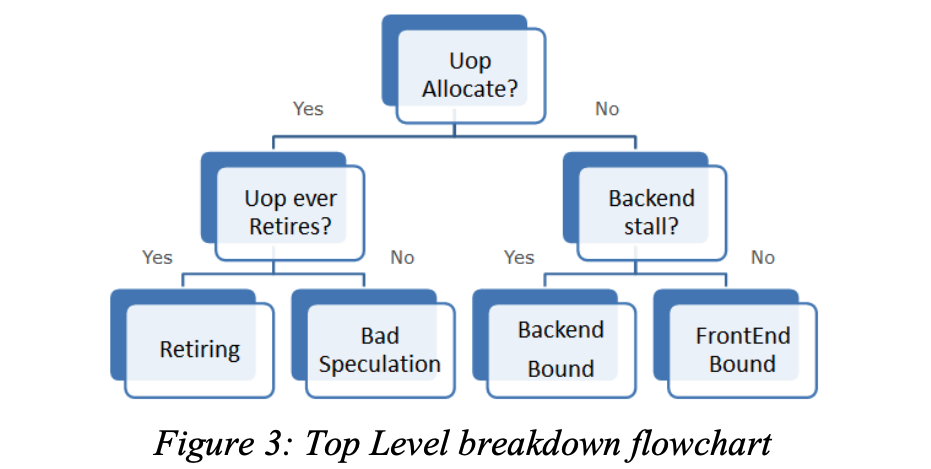

1. 在一个周期内，如果 μops 被发射（issued），则这个 μops 只会被退休（retired）或者取消（cancelled），所以它应当归属于退休或者错误预测的分类
2. 如果出现了 backend-stall （即由于后端资源不足而造成 μops 反压），导致 μops 没有被发射，则这次的停顿归属于后端
3. 如果没有出现 backend-stall 并且 μops 没有被发射，则停顿归属于前端

由于超标量处理器可以在每个周期发出多个 μops ，所以在流水线槽粒度上分类可以非常健壮和准确，这也是 Top-Down Analysis 与之前的性能分析方法的明显区别。

### 3.3 前端限制分类（Frontend Bound Category）

回忆一下前端的主要工作：

1. 分支预测，预测下一个要拉取的地址
2. 拉取 cache line 并解析成指令
3. 将指令解析成 micro-ops

Frontend Bound 进一步分为 Fetch Latency 和 Fetch Bandwidth 两类：

1. Fetch Latency 表示任何原因导致的指令拉取延迟。 icache miss 、 iTLB miss 和 Branch Resteers 都属于这个分类。
   > Branch Resteers 表示流水线刷新（pipeline flush）之后的指令提取延迟。pipeline flush 可能是由于一些清楚状态的事件引起，例如 branch misprediction 或者 memory nukes ，Branch Resteers 与 Bad Speculation 密切相关。
2. Fetch Bandwidth 表示指令解码低效的问题。比如高 IPC 程序往往会受到前端带宽(bandwith) 的影响。此时需要增加额外的硬件来维持带宽，减少延迟。Intel 使用 LSD(Loop Stream Detector) 和 DSB(Decoded-μop Stream Buffer) 来解决这个问题。
   > 环流侦测器LSD最初由Intel Core微架构引入（注：位于BPU中）。LSD侦测符合条件的小循环，将其锁定在微指令队列中。循环指令可以直接从微指令队列中获取，不再需要取指/译码或者从任何的缓存中读取微指令，直到分支预测失败结束循环。
   >
   > 符合如下特征的循环方可由LSD/微指令队列锁定：
   >
   > 最多由8个32字节指令块构成
   > 最多28条微指令（~28 x86指令）
   > 所有的微指令同时存在于微指令缓存中
   > 可以包括最多8个采纳分支，且这些分支不能是CALL或者RET指令
   > 不能有未匹配的栈操作。例如，PUSH指令比POP指令多。
   > 许多计算密集型的循环，查找，和软件字符串搬移操作都符合这些特征。
   >
   > 软件应该“机会主义式的”使用LSD功能。对于要求高性能的代码，循环展开通常比LSD循环锁定更受推荐，即便是循环展开可能导致无法做LSD锁定（例如代码长度过大）。
   >
   > 引用自 https://blog.csdn.net/qq_43401808/article/details/85997414


### 3.4 错误预测分类（Bad Speculation category）

Bad Speculation 反映了由于错误预测（incorrect speculations）导致的 pipeline slots 浪费，主要包括两部分：

1. 执行没有退休（retire）的 μops 的槽位（slots）

2. 从先前错误预测中恢复而导致流水线被阻塞的槽位
   > 由于错误预测还涉及到能否快速的将正确的指令拉取到，所以这边可能与 Frontend Bound 中的 Branch Resteers 重叠。

Top-Down Analysis 把 Bad Speculation 放在了顶层，这样可以方便的确认预测错误影响正常工作的比例，并反过来决定其他类别中值的准确性。

Bad Speculation 进一步分成了 Branch Mispredict 和 Machine Clears ，后者的情况导致的问题与 pipeline flush 类似：

1. Branch Mispredict 关注如何使程序控制流对分支预测更友好
2. Machine Clears 指出一些异常情况，例如清除内存排序机（Memory Ordering Nukes clears）、自修改代码（self modifying code）或者非法地址访问（certain loads to illegal address ranges）

### 3.5 退休分类（Retiring Category）

Retiring Category 反映了最终退休的 μops 占槽位的比例。理想情况下所有的槽位都应该被标记为退休状态，即 Retiring 比例为 100%。

并非有了很高的 Retiring 比例性能就没有提升空间了，依然可以看下下面几个指标

1. Microcode Sequences 中的 Floating Point assists 是一种对性能很不友好的伪指令，应当尽可能避免
2. 占比很高的非向量化（non-vectorized）代码可以优化成为向量化（vectorized）的代码。向量化代码本质上可以让单个指令（或者说 μop）完成更多的操作，从而提高性能。

### 3.6 后端限制分类（Backend Bound Category）

后端限制反映了由于后端没有足够的资源接收而导致没有 μops 被 issued 的情况。

后端限制根据是否因为执行单元（execution units）被占用而导致的停顿分为内存限制（Memory Bound）和核心限制（Core Bound）。通常情况下，为了达到最高的 IPC，必须要保持执行单元始终处于繁忙状态。例如在一个有 4 个 slot 的机器上，如果在某个状态下只有 3 个或者更少的 μops 被执行就意味着没有达到最佳状态（即 IPC 不为 4）。这些周期成为执行停顿（ExecutionStalls）。

#### 内存限制（Memory Bound）

内存限制反应了由于内存子系统导致的执行停顿，比如对于一个 load 操作所有的缓存都没有命中。

现代 CPU 实现了三个不同层次的缓存来解决主存的延迟问题。在 intel 的解决方案中，第一层级的 cache 是一个数据缓存，第二层级的 cache 是一个指令和数据共享的缓存，这两层缓存是每个核心一个。第三层级的 cahce 是所有核心共享的。

一个乱序（out-of-order）执行的调度器会通过先执行那些没有依赖的 μops 尽可能的保证执行单元始终处于忙碌状态来避免内存访问停顿。所以内存访问停顿的真正代价是调度器没有准备好的 μops 给执行模块，这些（delay）的 μops 要么在等待内存访问，要么依赖其他的 μops。

图4说明了如何区分是哪一层缓存导致的执行停顿

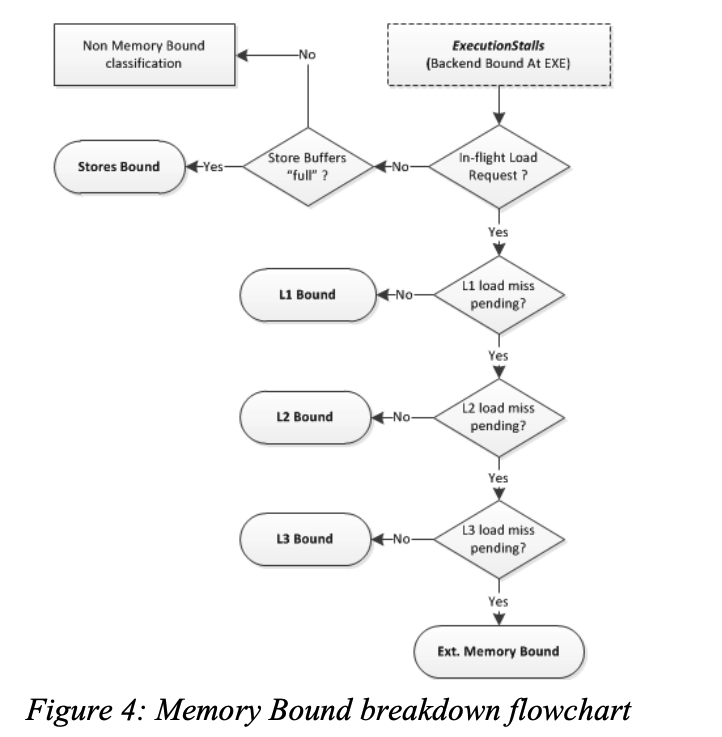

- L1D 通常具有与 ALU 停顿媲美的短暂延迟，但是在某些场景下，L1D 也会有较高的延迟。比如 load 操作被阻塞，无法将数据从早先的 store 转发到一个相同的地址（load blocked to forward data from earlier store to an overlapping address）。再比如 load 操作由于 4K 对齐而被阻塞。这些情况都属于 L1 Bound。
- 在乱序执行的 CPU 上，由于 X86 架构的内存顺序访问的要求，store 操作会被缓存（buffered）并在退休之后（post-retirement）执行。多数时候，store 操作对性能影响很小，但仍不能随意被忽视。在 Top-Donw Analysis 中，定义了 Store Bound 作为低执行端口利用率（low execution ports utilization）、高 store 缓冲数量（high number of stores are buffered）的周期。
- 在 Ext. Memory Bound 分类中，区分 Memory Bandwidth 和 Memory Latency 的方法是统计有多少请求依赖从内存中获取数据，如果这类请求的占比超过一个阈值（比如 70%），就将其划归到 Memory Bandwidth 中，否则划归到 Memory Latency 中。

#### 核心限制（Core Bound）

核心限制反映了短的执行饥饿周期或者执行端口利用率不佳，也就是说执行单元存在压力或者程序中缺少指令级别并行。例如一个长延迟的除法操作可能会序列化执行，导致一个周期内只有少量的执行端口被使用。

Core Bound 的问题一般可以通过更优秀的代码来解决。例如，一系列相关的算术运算被标记为 Core Bound，编译器可以通过更好的指令调度来缓解。同时，矢量化（Vectorization）也可以缓解 Core Bound 问题。

## 4. 计数架构（Counters Architecture）

这一章主要介绍 Top-Down Analysis 方法所需要的硬件支持。现代 CPU 中都含有一个元件 PMU，它提供了一组能够计算性能事件的通用计数器。

表1 中总结了基本的事件，表2 总结了 Top-Down Analysis 中指标的计算方法

Table 1: Definitions of Top-Down performance events

| Event             	| Definition                                                                             	|
|-------------------	|----------------------------------------------------------------------------------------	|
| TotalSlots        	| Total number of issue-pipeline slots.                                                  	|
| SlotsIssued       	| Utilized issue-pipeline slots to issue operations                                      	|
| SlotsRetired      	| Utilized issue-pipeline slots to retire (complete) operations                          	|
| FetchBubbles      	| Unutilized issue-pipeline slots while there is no backend-stall                        	|
| RecoveryBubbles   	| Unutilized issue-pipeline slots due to recovery from earlier miss-speculation          	|
| BrMispredRetired  	| Retired miss-predicted branch instructions                                             	|
| MachineClears     	| Machine clear events (pipeline is flushed)                                             	|
| MsSlotsRetired    	| Retired pipeline slots supplied by the microsequencer fetch-unit                       	|
| OpsExecuted       	| Number of operations executed in a cycle                                               	|
| MemStalls.AnyLoad 	| Cycles with no uops executed and at least 1 inflight load that is not completed yet    	|
| MemStalls.L1miss  	| Cycles with no uops executed and at least 1 inflight load that has missed the L1-cache 	|
| MemStalls.L2miss  	| Cycles with no uops executed and at least 1 inflight load that has missed the L2-cache 	|
| MemStalls.L3miss  	| Cycles with no uops executed and at least 1 inflight load that has missed the L3-cache 	|
| MemStalls.Stores  	| Cycles with few uops executed and no more stores can be issued                         	|
| ExtMemOutstanding 	| Number of outstanding requests to the memory controller every cycle                    	|

Table 2: Formulas for Top-Down Metrics

| Metric Name           	| Formula                                                     	|
|-----------------------	|-------------------------------------------------------------	|
| Frontend Bound        	| FetchBubbles / TotalSlots                                   	|
| Bad Speculation       	| (SlotsIssued – SlotsRetired + RecoveryBubbles) / TotalSlots 	|
| Retiring              	| SlotsRetired / TotalSlots                                   	|
| Backend Bound         	| 1 – (Frontend Bound + Bad Speculation + Retiring)           	|
| Fetch Latency Bound   	| FetchBubbles[≥ #MIW] / Clocks                               	|
| Fetch Bandwidth Bound 	| Frontend Bound – Fetch Latency Bound                        	|
| #BrMispredFraction    	| BrMispredRetired / (BrMispredRetired + MachineClears)       	|
| Branch Mispredicts    	| #BrMispredFraction * Bad Speculation                        	|
| Machine Clears        	| Bad Speculation – Branch Mispredicts                        	|
| MicroSequencer        	| MsSlotsRetired / TotalSlots                                 	|
| BASE                  	| Retiring – MicroSequencer                                   	|
| #ExecutionStalls      	| (ΣOpsExecuted[= FEW] ) / Clocks                             	|
| Memory Bound          	| (MemStalls.AnyLoad + MemStalls.Stores) / Clocks             	|
| Core Bound            	| #ExecutionStalls – Memory Bound                             	|
| L1 Bound              	| (MemStalls.AnyLoad – MemStalls.L1miss) / Clocks             	|
| L2 Bound              	| (MemStalls.L1miss – MemStalls.L2miss) / Clocks              	|
| L3 Bound              	| (MemStalls.L2miss – MemStalls.L3miss) / Clocks              	|
| Ext. Memory Bound     	| MemStalls.L3miss / Clocks                                   	|
| MEM Bandwidth         	| ExtMemOutstanding[≥ THRESHOLD] / ExtMemOutstanding[≥ 1]     	|
| MEM Latency           	| (ExtMemOutstanding[≥ 1] / Clocks) – MEM Bandwidth           	|

## 5. 使用效果

这里使用了业界通用的 CPU 测试方法 SPEC CPU2006 来进行测试，并使用 Top-Down Analysis 方法来收集和分析性能点。

测试分为两个场景，分别为 single-thread (1C) 和 multi-copy (4C)。具体的测试环境为

| 项目      	| 规格                                                                                                                    	|
|-----------	|-------------------------------------------------------------------------------------------------------------------------	|
| Processor 	| Intel® Core™ i7-3940XM (Ivy Bridge). 3 GHz fixed frequency. A quadcore with 8MB L3 cache. Hardware prefetchers enabled. 	|
| Memory    	| 8GB DDR3 @1600 MHz                                                                                                      	|
| OS        	| Windows 8 64-bit                                                                                                        	|
| Benchmark 	| SPEC CPU 2006 v1.2 (base/rate mode)                                                                                     	|
| Compiler  	| Intel Compiler 14 (SSE4.2 ISA)                                                                                          	|

**SPEC CPU2006**
图5、图 6 展示了 1C 和 2C 两个场景下的分析结果

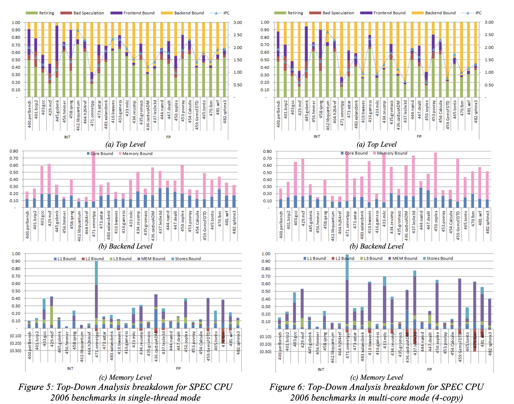

通过对比可以发现，相对于 1C 场景，在 4C 场景中， Memory Bound 的占比扩大。这是一个预期的结果，因为 L3 Cache 是多核共享的。

继续下钻 Ext. Memory Bound 这个分类

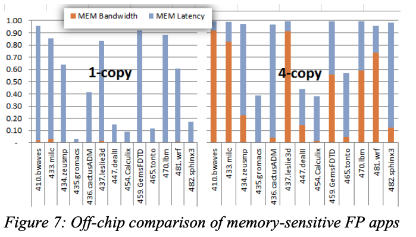

可以看到 ，在 1C 场景下，DRAM Bound 原因是 Latency 导致的，但是在 4C 场景下，DRAM Bandwidth 的比重在某些测试用例中成为主要的 DRAM Bound 原因，这是由于这些用例都有对 DRAM 进行大量的数据访问所导致的。

而对于不同处理器架构的对比

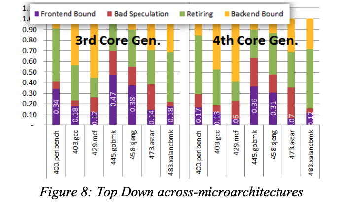

可以看到，4th 的处理器 Frontend Bound 的比例明显减少，这有由于Intel在4代的处理器上对 i-TLB 和 i-Cache 均进行了优化所导致的。从该结果可以佐证对特定模块优化后的性能提升，并且还可以进行不同系列/不同架构直接的处理器对比，来更好地理解不同处理器之间的差异。

## 6. 实验

本章将使用 java 语言以不同的方式实现矩阵乘法，并通过 vtune 监控运行信息，对比不同实现对于 CPU 的使用情况。

实验将首先初始化两个个  长度的 float 一维数组，并填充随机数值，然后使用不同的方法计算矩阵乘法 10 次。

**场景1**

最简单最朴素的一种实现

代码如下

```java {.line-numbers}
private static float[] multiply1(float[] matrix1, float[] matrix2, int size) {
  float[] res = new float[size * size];
  for (int i = 0; i < size; i++) {
    for (int j = 0; j < size; j++) {
      float sum = 0;
      for (int k = 0; k < size; k++) {
        sum += matrix1[i * size + k] * matrix2[k * size + j];
      }
      res[i * size + j] = sum;
    }
  }
  return res;
}
```

vtune 的监控信息如下

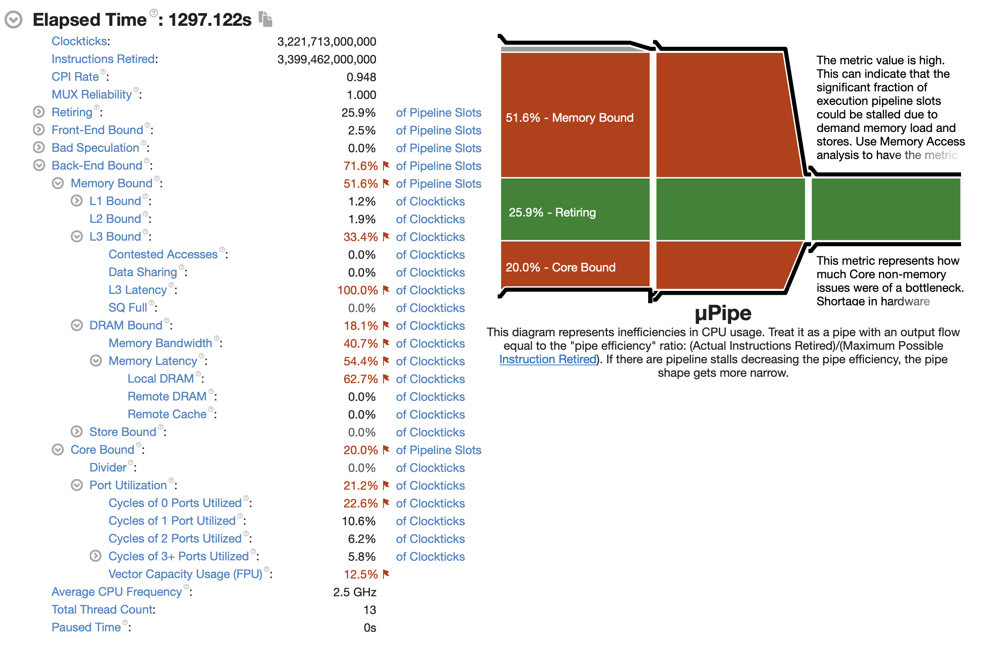

**场景2**

该版本为文章 CS:APP2e Web Aside MEM:BLOCKING: Using Blocking to Increase Temporal Locality 中介绍的一个方法。具体的原理是先将原始的矩阵分成多个子矩阵，然后利用数学原理，将子矩阵之间的运算变成标量运算。

下面这段代码实现了这种方法，基本思想是将A，C分成 $1*bsize$ 的行片段（row slivers），并把B分成 $bsize * bsize$ 的块。

1. 首先，最内部的 (j, k) 循环（就是最深和次深的两个循环），将A的行片段乘上B的块，然后将求和结果赋值给C的行片段。
2. i的循环，迭代了A和C的n个行片段，每次循环使用了B中相同的block（块大小是bsize * bsize）

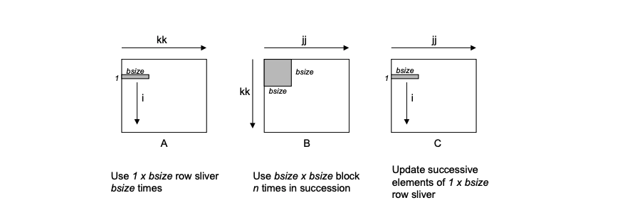

```java {.line-numbers}
private static float[] multiply2(float[] matrix1, float[] matrix2, int size) {
  int BLOCK_SIZE = 8;
  float[] res = new float[size * size];
  for (int kk = 0; kk < size; kk += BLOCK_SIZE) {
    for (int jj = 0; jj < size; jj += BLOCK_SIZE) {
      for (int i = 0; i < size; i++) {
        for (int j = jj; j < jj + BLOCK_SIZE; ++j) {
          float sum = res[i * size + j];
          for (int k = kk; k < kk + BLOCK_SIZE; ++k) {
            sum += matrix1[i * size + k] * matrix2[k * size + j];
          }
          res[i * size + j] = sum;
        }
      }
    }
  }
  return res;
}
```

Vtune 的监控信息如下

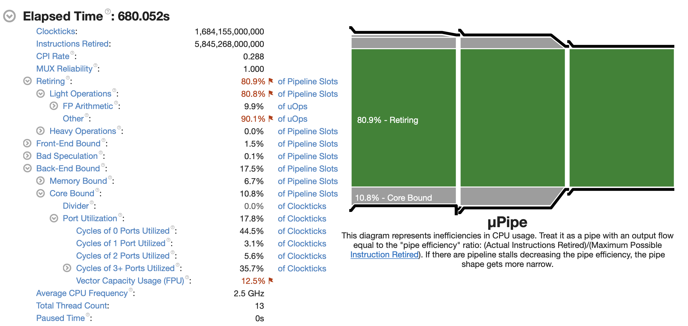

**场景3**

该版本为文章 Multiplying Matrices, Fast and Slow 中提到的一种方法。

代码如下

```java {.line-numbers}
private static float[] multiply3(float[] matrix1, float[] matrix2, int size) {
  float[] res = new float[size * size];
  int in = 0;
  for (int i = 0; i < size; ++i) {
    int kn = 0;
    for (int k = 0; k < size; ++k) {
      float aik = matrix1[in + k];
      for (int j = 0; j < size; ++j) {
        res[in + j] += aik * matrix2[kn + j];
      }
      kn += size;
    }
    in += size;
  }
  return res;
}
```

Vtune 监控信息如下

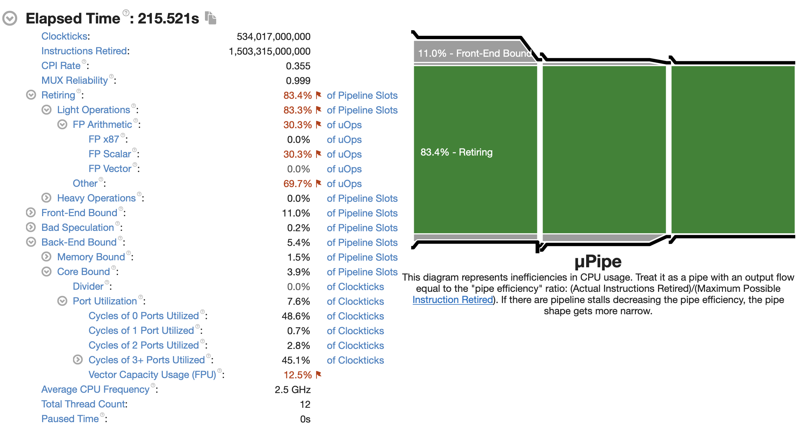

**场景4**

该版本为场景3版本的升级版

代码如下

```java {.line-numbers}
public static float[] multiply4(float[] matrix1, float[] matrix2, int size) {
  float[] res = new float[size * size];
  float[] bBuffer = new float[size];
  float[] cBuffer = new float[size];
  int in = 0;
  for (int i = 0; i < size; ++i) {
    int kn = 0;
    for (int k = 0; k < size; ++k) {
      float aik = matrix1[in + k];
      System.arraycopy(matrix2, kn, bBuffer, 0, size);
      saxpy(size, aik, bBuffer, cBuffer);
      kn += size;
    }
    System.arraycopy(cBuffer, 0, res, in, size);
    Arrays.fill(cBuffer, 0f);
    in += size;
  }
  return res;
}

private static void saxpy(int n, float aik, float[] b, float[] c) {
  for (int i = 0; i < n; ++i) {
    c[i] += aik * b[i];
  }
}
```

Vtune 监控信息如下

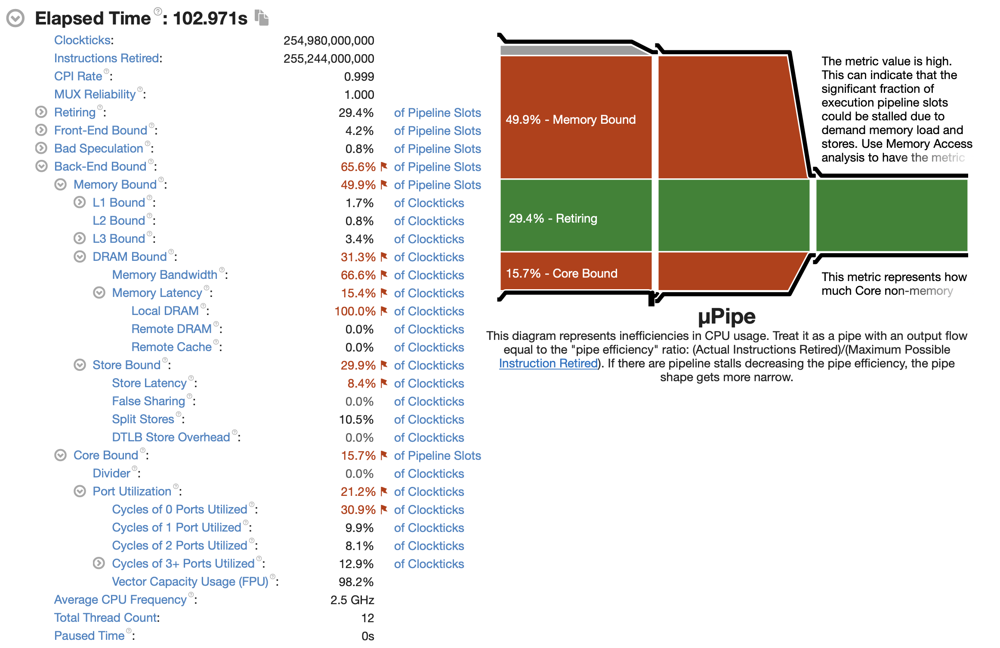

## 参考资料

- [A Top-Down method for performance analysis and counters architecture](https://ieeexplore.ieee.org/document/6844459/metrics#metrics)
- [Intel® VTune™ Profiler](https://software.intel.com/content/www/us/en/develop/documentation/vtune-help/top.html)
- [Top-down Microarchitecture Analysis Method](https://kernel.taobao.org/2019/03/Top-down-Microarchitecture-Analysis-Method/)
- [Multiplying Matrices, Fast and Slow](https://richardstartin.github.io/posts/multiplying-matrices-fast-and-slow)
- [CS:APP2e Web Aside MEM:BLOCKING: Using Blocking to Increase Temporal Locality](http://csapp.cs.cmu.edu/2e/waside/waside-blocking.pdf)


> 本文引用自：https://andrewei1316.github.io/2020/12/20/top-down-performance-analysis/