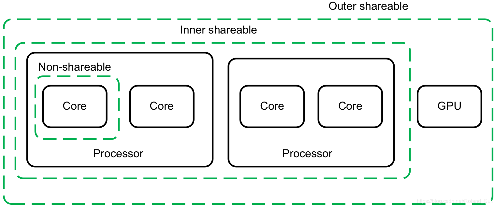
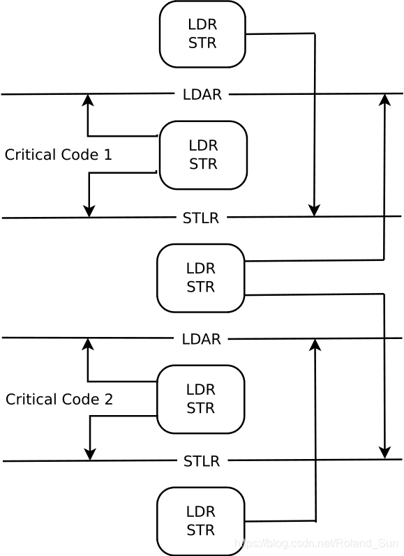

<!-- TOC -->

- [一、内存类型](#一内存类型)
	- [1）普通内存（Normal Memory）](#1普通内存normal-memory)
	- [2）设备内存（Device Memory）](#2设备内存device-memory)
- [二、共享域](#二共享域)
	- [1）非共享（Non-shareable）域](#1非共享non-shareable域)
	- [2）内部共享（Inner Shareable）域](#2内部共享inner-shareable域)
	- [3）外部共享（Outer Shareable）域](#3外部共享outer-shareable域)
	- [4）全系统共享（Full System）域](#4全系统共享full-system域)
- [三、屏障](#三屏障)
	- [1）指令同步屏障（ISB, Instruction Synchronization Barrier）](#1指令同步屏障isb-instruction-synchronization-barrier)
	- [2）数据内存屏障（DMB, Data Memory Barrier）](#2数据内存屏障dmb-data-memory-barrier)
	- [3）数据同步屏障（DSB, Data Synchronization Barrier）](#3数据同步屏障dsb-data-synchronization-barrier)
	- [4）单向屏障（Load-Acquire, Store-Release）](#4单向屏障load-acquire-store-release)
- [四、Linux内核中对内存屏障的定义](#四linux内核中对内存屏障的定义)
- [参考资料](#参考资料)

<!-- /TOC -->
## 一、内存类型

ARMv8架构将系统中所有的内存，按照它们的特性，划分成两种，即普通内存和设备内存。并且它们是互斥的，也就是说系统中的某段内存要么是普通内存，要么是设备内存，不能都是。

### 1）普通内存（Normal Memory）

普通内存的特性是，在没有别的写入的情况下，每次读取出来的值都是一样的。针对普通内存，Arm处理器会采用比较激进的优化方式，从而导致指令重排序的问题。

普通内存可以被指定为支持缓存（Cached）或不支持缓存（Non-Cached）。如果两个模块之间不支持数据一致性协议，那么它们之间的共享内存一定是不支持缓存的。

### 2）设备内存（Device Memory）

设备内存一般是对外部设备的一段内存映射，在没有写入的情况下，可能每次读取出来的值都不一样。也有可能写入这段内存会产生别的边际效应，如触发一个中断。

## 二、共享域

为了支持数据一致性协议，需要增加硬件很多开销，会降低系统的性能，同时也会增加系统的功耗。但是，很多时候并不需要系统中的所有模块之间都保持数据一致性，而只需要在系统中的某些模块之间保证数据一致性就行了。因此，需要对系统中的所有模块，根据数据一致性的要求，做出更细粒度的划分。

ARMv8架构将这种划分称作为域（Domain），并且一共划分成了四类：

### 1）非共享（Non-shareable）域

处于这个域中的内存只由当前CPU核访问，既然只能自己访问，那当然不用考虑跟系统中的其它模块，如其它CPU核或其它设备之间的数据同步问题。所以，如果一个内存区域是非共享的，系统中没有任何硬件会保证其缓存一致性。如果一不小心共享出去了，别的CPU核可以访问了，那必须由软件自己来保证其一致性。

### 2）内部共享（Inner Shareable）域

处于这个域中的内存可以由系统中的多个模块同时访问，并且系统硬件保证对于这段内存，对于处于同一个内部共享域中的所有模块，保证缓存一致性。

一个系统中可以同时存在多个内部共享域，对一个内部共享域做出的操作不会影响另外一个内部共享域。

### 3）外部共享（Outer Shareable）域

处于这个域中的内存也可以由系统中的多个模块同时访问，并且系统硬件保证对于这段内存，对于处于同一个外部共享域中的所有模块，保证缓存一致性。外部共享域可以包含一个或多个内部共享域，但是一个内部共享域只能属于一个外部共享域，不能被多个外部共享域共享。

对一个外部共享域做出的操作会影响到其包含的所有的内部共享域。

### 4）全系统共享（Full System）域

这个很好理解，表示对内存的修改可以被系统中的所有模块都感知到。

在一个具体的系统中，不同域的划分是由硬件平台设计者决定的，不由软件控制。并且，Arm的文档中也没有提及具体要怎么划分。但有一些指导原则，一般在一个操作系统中可以看到的所有CPU核要分配在一个内部域里面，如下图所示：



这些域的划分只是为了更细粒度的管理内存的缓存一致性，理论上所有内存都放到全系统共享域中，从功能上说也可以，但会影响性能。

可缓存性和共享性一定是对普通内存才有的概念。设备内存一定是不支持缓存的，且是外部共享的。

## 三、屏障

前面说的缓存一致性保证的是对同一段内存的操作，系统中的所有模块，在经过一定的时间后，大家读取到的值最终是一样的。比如说，CPU0对全局变量A写入1，而CPU1对全局变量A写入2，那么经过一定时间后，两颗CPU看到全局变量的值要么都是1要么都是2，不会一个是1一个是2。但是，缓存一致性并不能保证内存操作的顺序，这个需要[内存屏障](https://blog.csdn.net/Roland_Sun/article/details/106895899)来保证。

在ARMv8架构下，共有下面四种指令提供所谓的屏障的功能：

### 1）指令同步屏障（ISB, Instruction Synchronization Barrier）

Arm系统有两种类型的缓存，一种是指令缓存（I-Cache），还有一种是数据缓存（D-Cache）。因此，内存屏障指令还要区分是对指令的还是针对普通数据的。

指令同步屏障会<font color=red>清洗当前CPU核的流水线和指令预取缓冲</font>，以保证所有这条指令前面的指令都执行完毕之后，才执行这条指令后面的指令。

<font color=red>Q: 这样可以完全隔绝前后代码之间的依赖问题？</font>

### 2）数据内存屏障（DMB, Data Memory Barrier）

数据内存屏障保证，站在系统中其它同属一个域的模块来看，在这条指令之前的存储器访问操作（包括加载或存储）一定比在这条指令之后的存储器访问操作，先被感知到。也就是说，数据内存屏障指令阻止在这条指令之前的所有存储器访问操作被重排序到这条指令之后，同时也会阻止这条指令之后的所有存储器访问指令被重排序到这条指令之前。

### 3）数据同步屏障（DSB, Data Synchronization Barrier）

数据同步屏障在保证和前面的数据内存屏障相同的存储器访问操作顺序的同时，还会保证在这条指令之后的所有指令（不光是存储器操作指令）一定会在这条指令之后才会执行。因此，数据同步屏障比数据内存屏障更加严格。

DMB和DSB指令都需要带一个参数，这个参数指明了数据屏障指令的作用范围和针对的共享域。共享域前面说过了，一共有四种。作用范围表示数据屏障指令具体对哪些存储器访问操作起作用，ARMv8共定义了三种，分别是：

1. Load - Load, Load - Store：表示内存屏障保证其之前的所有加载操作一定在其之前完成，其之后的所有加载和存储操作一定在其之后才开始，但是其之前的存储操作有可能会在其之后才执行。
2. Store - Store：表示内存屏障保证其之前的所有存储操作一定在其之前完成，而其之后的存储操作一定在其之后才能开始，但是对于加载操作没有任何限制。
3. Any - Any：表示内存屏障保证其之前的所有加载和存储操作一定在其之前完成，而其后的所有加载和存储操作一定在其之后才能开始。
注意，ARMv8不提供所谓的Store-Load型的顺序保证，如果真的需要这种保证，只能使用Any-Any型的。关于DMB和DSB指令的参数，可以总结为如下表格：

| 参数  | 作用范围                  | 共享域       |
|-------|---------------------------|--------------|
| OSHLD | Load - Load, Load - Store | 外部共享域   |
| OSHST | Store - Store             | 外部共享域   |
| OSH   | Any - Any                 | 外部共享域   |
| NSHLD | Load - Load, Load - Store | 非共享域     |
| NSHST | Store - Store             | 非共享域     |
| NSH   | Any - Any                 | 非共享域     |
| ISHLD | Load - Load, Load - Store | 内部共享域   |
| ISHST | Store - Store             | 内部共享域   |
| ISH   | Any - Any                 | 内部共享域   |
| LD    | Load - Load, Load - Store | 全系统共享域 |
| ST    | Store - Store             | 全系统共享域 |
| SY    | Any - Any                 | 全系统共享域 |

### 4）单向屏障（Load-Acquire, Store-Release）

前面的所有屏障指令对于ARMv8之前所有的架构都有效，在ARMv8架构下，还加入了一类单向屏障指令，也就是所谓的Load-Acquire（LDAR指令）和Store-Release（STLR指令）。

普通的内存屏障一般是双向的，也就是可以控制内存屏障之前的某些存储操作要在内存屏障之前完成，并且内存屏障之后的某些存储操作要在内存屏障之后才能开始。但是Load-Acquire和Store-Release却只限定了单个方向的：

- Load-Acquire：这条指令之后的所有加载和存储操作一定不会被重排序到这条指令之前，但是没有要求这条指令之前的所有加载和存储操作一定不能被重排序到这条指令之后。所以，可以看出来，这条指令是个单向屏障，只挡住了后面出现的所有内存操作指令，但是没有挡住这条指令之前的所有内存操作指令。
- Store-Release：这条指令之前的所有加载和存储才做一定不会被重排序到这条指令之后，但是没有要求这条指令之后的所有加载和存储操作一定不能被重排序到这条指令之前。所以，这条指令也是一个单向屏障，只挡住了前面出现的所有内存操作指令，但是没有挡住这条指令之后的所有内存操作指令。

LDAR和STLR指令也有作用的共享域，只不过没有明确在指令中表示出来。这两条指令的共享域就是它们操作的内存的共享域。比如，如果LDAR指令读取内存的地址是属于内部共享域的，那么这条指令锁提供的屏障也只是作用于这个内部共享域。

还有一点，如果LDAR指令出现在STLR指令之后，处理器也会保证LDAR指令一定不会被重排序到STLR指令之前。

单向屏障的作用范围可以总结为下面这张图：



## 四、Linux内核中对内存屏障的定义

Linux将不同类型的内存屏障和ARMv8提供的屏障指令都做了映射（代码位于arch/arm64/include/asm/barrier.h中）：

```c
#define isb()		asm volatile("isb" : : : "memory")
#define dmb(opt)	asm volatile("dmb " #opt : : : "memory")
#define dsb(opt)	asm volatile("dsb " #opt : : : "memory")
......
#define spec_bar()	asm volatile(ALTERNATIVE("dsb nsh\nisb\n",		\
						 SB_BARRIER_INSN"nop\n",	\
						 ARM64_HAS_SB))

#define mb()		dsb(sy)
#define rmb()		dsb(ld)
#define wmb()		dsb(st)

#define dma_rmb()	dmb(oshld)
#define dma_wmb()	dmb(oshst)
......
#define __smp_mb()	dmb(ish)
#define __smp_rmb()	dmb(ishld)
#define __smp_wmb()	dmb(ishst)
```

没有带任何前缀的mb()、rmb()和wmb()都是映射到了DSB指令，并且针对的共享域是最大的全系统共享域。作用范围最大的是mb()屏障，它被映射成限制Any-Any类型的，rmb()被映射成限制Load-Load, Load-Store类型的，搞好完美匹配对读内存屏障的要求，wmb()被映射成限制Store-Store类型的。

DMA设备都是属于外部共享域，所以dma_rmb()的参数是oshld，而dma_wmb的参数是oshst。并且它们只是限制对内存的操作，不限制其它指令，所以使用的是DMB指令。

带__smp_前缀的，表示限制的是所有CPU核，前面提到过一般在一个操作系统中可以看到的所有CPU核要分配在一个内部域里面，因此这里使用的参数都以i打头，表示作用域是内部共享域。

spec_bar()宏比较特殊，表示禁止当前CPU核的预测机制，使用了DSB指令，作用域是非共享域，只对当前CPU核有效。


## 参考资料

- [ARMv8-A Memory systems](https://developer.arm.com/documentation/100941/0100)
- [Arm64内存屏障](https://f5.pm/go-32076.html)
- [https://diveintosystems.org/book/C14-SharedMemory/posix.html]
- [内存屏障简介](https://blog.csdn.net/Roland_Sun/article/details/106895899)