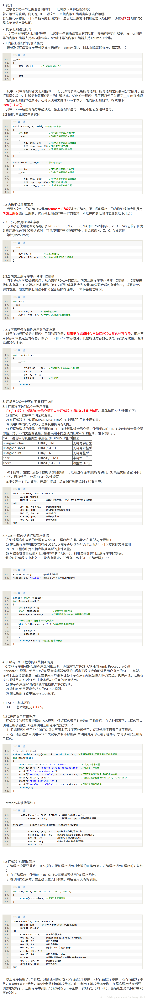

# ARM中C语言和汇编语言的混合编程

<!-- TOC -->

- [ARM中C语言和汇编语言的混合编程](#arm中c语言和汇编语言的混合编程)
  - [1.内联汇编](#1内联汇编)
    - [2.在汇编语言中使用C语言中定义的全局变量](#2在汇编语言中使用c语言中定义的全局变量)
  - [3.在C中调用汇编语言函数](#3在c中调用汇编语言函数)
  - [4.在汇编语言中调用C函数](#4在汇编语言中调用c函数)
  - [其余参考资料](#其余参考资料)

<!-- /TOC -->

## 1.内联汇编

在C语言中内嵌汇编注意事项：

- 不能直接向PC寄存器赋值，程序跳转要使用B或者BL指令
- 在使用物理寄存器时，不要使用过于复杂的C表达式，避免物理寄存器冲突
- R12和R13可能被编译器用来存放中间编译结果，计算表达式值时可能将R0到R3、R12及R14用于子程序调用，因此要避免直接使用这些物理寄存器
- 一般不要直接指定物理寄存器，而让编译器进行分配

```c
#include <stdio.h>
void my_strcpy(const char *src, char *dest)
{
       char ch;
       __asm
       {
              loop:
              ldrb       ch, [src], #1
              strb       ch, [dest], #1
              cmp        ch, #0
              bne         loop
       }
}
int main()
{
       char *a = "forget it and move on!";
       char b[64];
       my_strcpy(a, b);
       printf("original: %s", a);
       printf("copyed:   %s", b);  
       return 0;
}
```

### 2.在汇编语言中使用C语言中定义的全局变量

使用内联汇编不需要单独编译编译汇编文件使用起来非常方便，但是使用内联汇编有诸多的限制，当汇编文件较多的时候就需要使用专门的汇编文件编写汇编程序，在C语言和汇编语言进行数据传递的最简单的形式就是使用，全局变量。

```c
#include <stdio.h>
int gVar_1 = 12;
extern        asmDouble(void);

int main()

{
       printf("original value of gVar_1 is: %d", gVar_1);
       asmDouble();
       printf("       modified value of gVar_1 is: %d", gVar_1);
       return 0;
}
```

对应的汇编语言文件:

```armasm
;called by main(in C),to double an integer, a global var defined in C is used.
       AREA asmfile, CODE, READONLY
       EXPORT   asmDouble
       IMPORT   gVar_1

asmDouble
       ldr r0, =gVar_1
       ldr  r1, [r0]
       mov  r2, #2      
       mul  r3, r1, r2

       str  r3, [r0]
       mov  pc, lr


       END
```

## 3.在C中调用汇编语言函数

在C中调用汇编语言函数，需要做的工作主要有两个，一个就是在C语言中声明函数原型，并加extern 关键字，二是在汇编语言中使用EXPORT导出函数，并使用该函数名作为汇编段的标志，最后使用mov pc ,lr 返回，然后就可以在C语言中调用该函数了，从C的角度并不知道该函数实现是C还是汇编，因为C语言的函数名也起到标示函数起始地址这一点和汇编的作用是一样的。

```c
/*  cfile.c
 *  in C,call an asm function, asm_strcpy
 *       Sep 9, 2004
 */

#include <stdio.h>
extern void asm_strcpy(const char *src, char *dest);

int main()
{
       const        char *s = "seasons in the sun";
       char        d[32];

       asm_strcpy(s, d);
       printf("source: %s", s);
       printf("       destination: %s",d);
       return 0;
}


;asm function implementation
     AREA asmfile, CODE, READONLY
     EXPORT asm_strcpy      
asm_strcpy
loop
       ldrb          r4, [r0], #1       ;address increment after read
       cmp         r4, #0
       beq           over
       strb          r4, [r1], #1
       b               loop
over
       mov           pc, lr
       END
```

在这里，C和汇编之间的参数传递是通过ATPCS（ARM Thumb Procedure Call Standard）的规定来进行的。简单的说就是如果函数有不多于四个参数，对应的用R0-R3来进行传递，多于4个时借助栈，函数的返回值通过R0来返回。

## 4.在汇编语言中调用C函数

在汇编语言中调用C函数，需要在汇编语言中IMPORT对应的C语言函数名。

```c
;the details of parameters transfer comes from ATPCS
;if there are more than 4 args, stack will be used
       EXPORT asmfile
       AREA asmfile, CODE, READONLY
       IMPORT   cFun

       ENTRY
       mov        r0, #11
       mov        r1, #22
       mov        r2, #33
       BL       cFun
       END


/*C file,  called by asmfile */
int       cFun(int a, int b, int c)

{
       return a + b + c;
}
```




> 本文转载自：https://blog.csdn.net/andrewgithub/article/details/79164865

## 其余参考资料

- [ARM中C和汇编混合编程及示例](https://blog.csdn.net/zyboy2000/article/details/4250578?utm_medium=distribute.pc_relevant.none-task-blog-2~default~baidujs_baidulandingword~default-1.pc_relevant_default&spm=1001.2101.3001.4242.2&utm_relevant_index=3)
- [ARM中C和汇编混合编程及示例](https://www.cnblogs.com/sunnywh/p/3957524.html)
- [ARM中C和汇编混合编程及示例](https://shequ.stmicroelectronics.cn/forum.php?mod=viewthread&tid=612724)