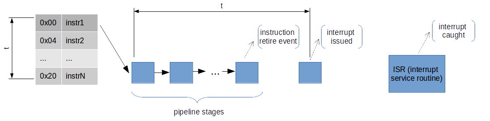
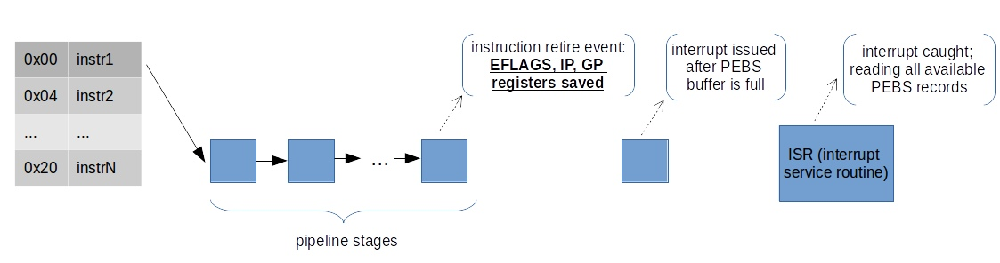
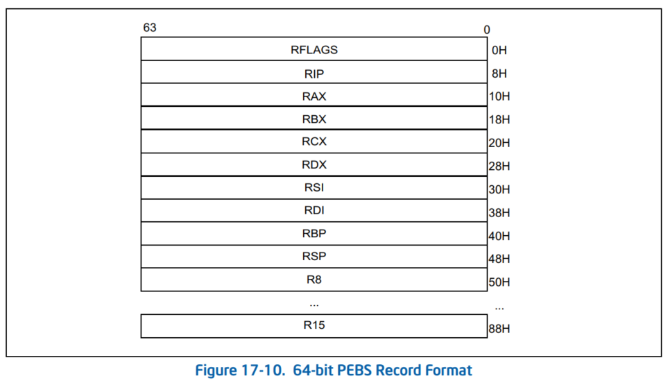
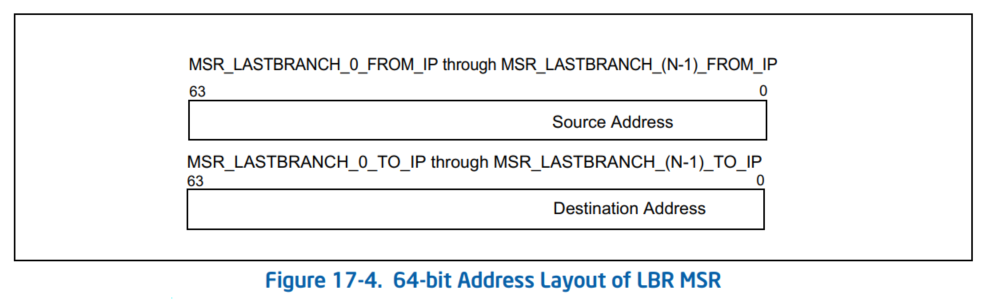

在我[之前的帖子](https://easyperf.net/blog/2018/06/01/PMU-counters-and-profiling-basics)中，我概述了什么是 PMU（性能监控单元）以及什么是 PMU 计数器（PMC）。 我们了解到，每个 PMU 内部都有固定和可编程的 PMC。 我们探索了计数和采样机制的基础知识，并没有讨论用于采样的先进技术和功能。

回顾一下，之前我展示了分析工具为收集应用程序的静态数据而执行的步骤数。 我们用一些数字初始化计数器并等待它溢出。 在计数器溢出时，内核记录有关程序执行的信息，即样本。 记录的内容取决于测量的类型，但所有样本中共有的关键信息是指令指针，即程序被中断时在哪里。

## 多路复用和缩放事件

这里很好地涵盖了运行时不同事件之间的多路复用主题，因此我决定从中获取大部分解释。

如果事件多于计数器，内核使用时间多路复用让每个事件有机会访问监控硬件。 使用多路复用，事件不会一直被测量。 在运行结束时，该工具会根据启用的总时间与运行时间来调整计数。 实际公式为：

$$final_count = raw_count * ( time_running / time_enabled )$$

例如，假设在分析期间，我们能够测量我们感兴趣的计数器 5 次，每个测量间隔持续 100 毫秒（time_enabled）。 程序执行时间为1s(time_running)。 此计数器的事件总数为 10000 (raw_count)。 因此，final_count 将等于 20000。

如果在整个运行期间测量事件，这将提供对计数的估计值。 了解这是一个估计值而不是实际计数非常重要。 根据工作负载，会有盲点在扩展过程中引入错误。

这几乎解释了英特尔 VTune Amplifier 中的“一般探索”分析如何能够在程序的一次执行中收集近 100 个不同的事件。 出于调用目的，分析工具通常具有不同计数器的阈值，以决定我们是否可以信任测量的事件数量，或者它太低而无法依赖（请参阅 [MUX 可靠性](https://easyperf.net/blog/2018/06/08/Advanced-profiling-topics-PEBS-and-LBR)）。

多路复用事件的最简单算法是以循环方式管理它。 因此，每个事件最终都会有机会运行。 如果有 N 个计数器，则循环列表上的前 N 个事件被编程到 PMU 中。 在某些情况下，它可能会小于该值，因为某些事件可能不会一起测量，或者它们竞争相同的计数器。

为了避免扩展，可以尝试将事件的数量减少到不大于可用的物理 PMC 的数量。

## 表征和分析的运行时开销

关于计数和采样模式中的运行时开销的主题，有一篇由 A. Nowak 和 G. Bitzes 撰写的[非常好的论文](https://openlab-archive-phases-iv-v.web.cern.ch/sites/openlab-archive-phases-iv-v.web.cern.ch/files/technical_documents/TheOverheadOfProfilingUsingPMUhardwareCounters.pdf)。 他们测量了基于 Xeon 的机器上的分析开销，该机器具有 48 个不同配置的逻辑内核：禁用/启用超线程，在所有/几个/一个内核上运行任务并收集 1/4/8/16 个不同的指标。

在我的解释中，计数模式几乎没有运行时开销（1-2%%）。 在采样模式下它很便宜，除非你不在不同的计数器之间多路复用（并且保持采样频率不要太高）。 但是，如果您尝试收集比可用的物理 PMU 计数器更多的计数器，您将获得大约 5-15% 的性能损失，具体取决于您要收集的计数器数量。 最后，采样频率越高，分析的开销就越大，因为需要处理更多的中断。

## 中断与基于事件的采样

基于中断的采样可以描述为一个简单的过程，当计数器溢出时，处理器触发性能中断。

基于中断的采样在现代处理器上引入了滑动。 这意味着存储在每个样本中的指令指针指定了程序被中断以处理 PMU 中断的位置，而不是计数器实际溢出的位置，即采样周期结束时的位置。 在某些情况下，如果有分支，这两个点之间的距离可能是几十条指令或更多。

让我们看一下这个例子：



UPD：阅读 Travis Down 的有关中断的精彩[文章](https://travisdowns.github.io/blog/2019/08/20/interrupts.html)中的更多详细信息。

让我们假设在 instr1 退出时，我们有一个对“指令退出”事件进行采样的计数器溢出。 由于在事件生成和溢出中断生成之间的微体系结构中存在延迟，因此有时难以生成接近导致它的事件的中断。 因此，在生成中断时，我们的 IP 已经执行了许多指令。 当我们在中断服务程序中重建寄存器状态时，我们的数据有些不准确。

## 基于处理器事件的采样 (PEBS)

通过让处理器本身将指令指针（以及其他信息）存储在内存中的指定缓冲区中，可以缓解[滑动](https://easyperf.net/blog/2018/08/29/Understanding-performance-events-skid)的问题–每个样本都不会发出中断，并且指令指针最多只由一条指令关闭。这需要硬件支持，并且通常仅适用于受支持事件的子集–此功能在英特尔处理器上称为基于处理器事件的采样（PEBS）。你们也可以看到人们称之为精确的基于事件的采样，但根据英特尔手册，第一个词是“处理器”而不是“精确”。但它基本上意味着相同的事情。



当启用计数器以捕获机器状态时，处理器会将机器状态信息写入由软件指定的内存缓冲区。 当计数器从最大计数溢出到零时，PEBS 硬件准备就绪。 在发生下一个 PEBS 事件时，PEBS 硬件触发辅助并导致将 PEBS 记录写入 PEBS 缓冲区。 该记录包含处理器的体系结构状态（通用寄存器、EIP 寄存器和 EFLAGS 寄存器的状态）。 对于 PEBS，样本的格式由处理器规定，因此了解它的最佳方式是查看[英特尔® 64 和 IA-32 架构软件开发人员手册第 3B 卷第 18 章](https://software.intel.com/sites/default/files/managed/7c/f1/253669-sdm-vol-3b.pdf)。

并非所有事件都支持 PEBS。 例如，在 Sandy Bridge 上支持 7 个 PEBS 事件：

- INST_RETIRED
- UOPS_RETIRED
- BR_INST_RETIRED
- BR_MISP_RETIRED
- MEM_UOPS_RETIRED
- MEM_LOAD_UOPS_RETIRED
- MEM_LOAD_UOPS_LLC_HIT_RETIRED

特定架构的 PEBS 事件可以在[英特尔® 64 和 IA-32 架构软件开发人员手册第 3B 卷第 18 章](https://software.intel.com/sites/default/files/managed/7c/f1/253669-sdm-vol-3b.pdf)中查看。

PEBS 缓冲区由记录组成。 每个样本都包含计数器溢出时处理器的机器状态。 以下是 PEBS 记录的示例（下图取自 Intel 手册）：



您可以在启动后立即执行 dmesg 检查是否启用了 PEBS：

```shell {.line-numbers}
$ dmesg | grep PEBS
[    0.061116] Performance Events: PEBS fmt1+, IvyBridge events, 16-deep LBR, full-width counters, Intel PMU driver.
```

您可以通过在事件说明符中添加 :p 和 :pp 后缀来使用 PEBS 和 perf：

```shell {.line-numbers}
perf record -e event:pp
```

使用 PEBS 的好处：

- 与常规中断指令指针相比，滑动被最小化。
- 减少开销，因为 Linux 内核仅在 PEBS 缓冲区填满时才参与，即在大量样本可用之前没有中断。

## Last Branch Record (LBR)

Andi Kleen 在 [lwm.net](https://lwn.net/Articles/680985/) 上有一个关于 LBR 主题的精彩系列及其应用程序：

> 英特尔 CPU 具有称为最后分支记录 (LBR) 的功能，其中 CPU 可以将分支连续记录到一组特定于模型的寄存器 (MSR)。 CPU 硬件可以在执行程序时并行执行此操作，而不会导致任何减速。 然而，读取这些寄存器会有一些性能损失。
> LBR 记录每个分支的“from”和“to”地址以及一些额外的元数据。 寄存器就像一个环形缓冲区，不断被覆盖，只提供最近的条目。 还有一个 TOS（栈顶）寄存器来提供指向最近分支的指针。 使用 LBR，我们可以对分支进行采样，但在每个示例中查看之前执行的 8-32 个分支。 这可以合理地覆盖热代码路径中的控制流，但不会因为太多信息而使我们不知所措，因为只检查了总分支中的一小部分。
> 一旦我们能够对 LBR 进行采样，就可以以不会过度减慢工作负载的频率设置分支事件的采样，并且仍然可以创建有用的热分支直方图。 重要的是要记住，这仍然是采样，所以不是每个执行的分支都可以检查。 CPU 通常执行速度太快以至于不可行。

最后一个分支记录机制不仅跟踪分支指令（如 JMP、Jcc、LOOP 和 CALL 指令），还跟踪导致指令指针变化的其他操作（如外部中断、陷阱和故障）。 分支记录机制通常采用一组 MSR（模型特定寄存器），称为最后分支记录 (LBR) 堆栈。 LBR 堆栈的大小和确切位置通常是特定于模型的。 下图取自[英特尔® 64 和 IA-32 架构优化参考手册，第 B.3.3.4 章](https://software.intel.com/en-us/articles/intel-sdm)：



最后分支记录 (LBR) 堆栈 — LBR 由 N 对 MSR 组成（N 同样是特定于模型的），它们存储最近分支的源地址和目标地址。 最后一个分支记录栈顶 (TOS) 指针 — 包含一个指向 LBR 堆栈中的 MSR 的指针，该 LBR 堆栈包含最近记录的分支、中断或异常。

如[英特尔® 64 和 IA-32 架构优化参考手册的 B.3.3.4 章](https://software.intel.com/en-us/articles/intel-sdm)所述，LBR 有两个重要用途：

1. **收集调用计数和函数参数：** 如果为 BR_INST_RETIRED.NEAR_CALL 事件触发的 PMI 捕获了 LBR，则可以通过简单地使用 LBR 中的最后一个条目来确定每个调用函数的调用计数。由于 PEBS IP 将等于 LBR 中的最后一个目标 IP，因此它是调用函数的入口点。 同样，LBR 缓冲区中的最后一个源是调用函数中的调用站点。 如果还捕获了完整的 PEBS 记录，那么对于 64 位操作系统上参数数量有限的函数，您可以对调用计数和函数参数进行采样。
2. **基本块执行计数：** 这解释起来相当复杂，所以我请读者阅读手册以了解更多相关信息。
3. **UPD：** [机器码的精确计时](https://easyperf.net/blog/2019/04/03/Precise-timing-of-machine-code-with-Linux-perf)。
4. **UPD：** [估计分支概率](https://easyperf.net/blog/2019/05/06/Estimating-branch-probability)。

从用户的角度来看，即使您在没有帧指针的情况下编译应用程序（由编译器选项“-fomit-frame-pointer”控制，默认为 ON），LBR 也可用于收集调用图信息：

```shell {.line-numbers}
$ perf record --call-graph lbr
```

在 perf 中使用 LBR 还可以让您查看最多分支的位置：

```shell {.line-numbers}
$ perf record -b
```

关于 LBR 的更多应用，包括调试支持和热路径分支历史，您可以查看 Andi Kleen 在 lwn.net 上的文章：[part1](https://lwn.net/Articles/680985/), [part2](https://lwn.net/Articles/680996/)。

## 其他资源

- Presentation on Black Hat 2015 conference by N. Herath and A. Fogh “These are Not Your Grand Daddy’s CPU Performance Counters”: [video](https://www.youtube.com/watch?v=dfIoKgw65I0&t=599s&list=WL&index=29), [slides](https://www.blackhat.com/docs/us-15/materials/us-15-Herath-These-Are-Not-Your-Grand-Daddys-CPU-Performance-Counters-CPU-Hardware-Performance-Counters-For-Security.pdf)
- Brendan Gregg’s article about [perf](http://www.brendangregg.com/perf.html)
- Linux kernel profiling with perf [tutorial](https://perf.wiki.kernel.org/index.php/Tutorial)
- Somewhat old, but still actual guide on how to program PMU: [Nehalem Performance Monitoring Unit Programming Guide](https://software.intel.com/sites/default/files/m/5/2/c/f/1/30320-Nehalem-PMU-Programming-Guide-Core.pdf)
- Description of instructions: RDPMC, RDTSC, RDTSCP, RDMSR, WRMSR in [Intel SDM v2, Instruction Set Reference](https://www.intel.com/content/dam/www/public/us/en/documents/manuals/64-ia-32-architectures-software-developer-instruction-set-reference-manual-325383.pdf)


> 本文翻译自：https://easyperf.net/blog/2018/06/08/Advanced-profiling-topics-PEBS-and-LBR