<!-- 文章标题 -->

<!-- TOC -->

- [Summary](#summary)
- [Research Objective](#research-objective)
- [Problem Statement](#problem-statement)
- [Method(s)](#methods)
  - [Detailed Design](#detailed-design)
    - [Ambit-AND-OR](#ambit-and-or)
    - [TRA能够工作需要解决的问题](#tra能够工作需要解决的问题)
    - [解决3~5的Ambit-AND-OR Flow](#解决35的ambit-and-or-flow)
    - [Ambit-NOT](#ambit-not)
  - [Ambit: Putting it  all together](#ambit-putting-it--all-together)
    - [Row address grouping](#row-address-grouping)
    - [Executing Bitwise Ops: The AAP Primitive](#executing-bitwise-ops-the-aap-primitive)
    - [Accelerating AAP with a Split Row Decoder](#accelerating-aap-with-a-split-row-decoder)
    - [Integrating Ambit with the System](#integrating-ambit-with-the-system)
- [Evaluation](#evaluation)
- [Conclusion](#conclusion)
  - [Circuit-level SPICE Simulation](#circuit-level-spice-simulation)
  - [Analysis of Throughput & Energy](#analysis-of-throughput--energy)
  - [Effect on Real-World Application](#effect-on-real-world-application)
- [Notes](#notes)
  - [Bulk bitwise operations的加速场景及意义](#bulk-bitwise-operations的加速场景及意义)
  - [Interleaved Memory System (交错存储系统)](#interleaved-memory-system-交错存储系统)

<!-- /TOC -->

HPCA-2020

## Summary

<!-- 写完笔记之后最后填，概述文章的内容，以后查阅笔记的时候先看这一段。 -->
这篇文章介绍了一种存内计算的方法Ambit，可以在DRAM中实现整行的AND/OR/NOT逻辑操作，将源数据复制到预留的操作数行，不破坏原始数据，同时降低操作数译码电路的复杂度。

## Research Objective

<!-- 作者的研究目标 -->

## Problem Statement

<!-- 问题陈述，要解决什么问题？ -->

In existing architectures, the throughput of bulk bitwise operations is limited by the memory bandwidth available to the processing unit (e.g., CPU, GPU, FPGA, processing-in-memory).

## Method(s)

<!-- 解决问题的方法/算法是什么？ -->

Ambit利用DRAM技术的模拟操作完全在DRAM内部执行按位运算，从而充分利用了内部DRAM的全部带宽。
With modest changes to the DRAM design, Ambit can exploit:

- the maximum internal bandwidth available inside each DRAM array;
- the memory-level parallelism across multiple DRAM arrays.

### Detailed Design

#### Ambit-AND-OR

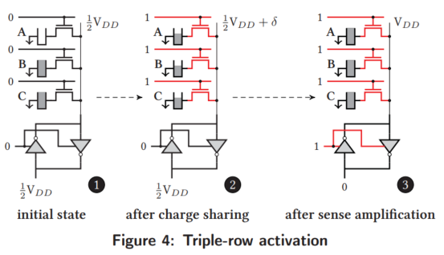

TRA (triple-row activation) 同时将一个读出放大器与同一位线上的三个DRAM单元相连，假设这三个单元的电容相同，都为$C_c$，bitline的寄生电容为$C_b$，基于电荷共享原则，在电荷共享结束之后，bitline上的电压偏差为：
$$\delta = \frac{k\cdot C_c \cdot V_{DD} + C_b \cdot \frac{1}{2} \cdot V_{DD}}{3C_c + C_b} - \frac{1}{2}V_{DD} = \frac{(2k-3)C_c}{6C_c + 2C_b}V_{DD}$$
从上面的公式可以看出，如果$k = 2, 3$，则bitline deviation为正，如果$k = 0, 1$，则bitline deviation为负。
分别使用A, B, C表示三个cell的逻辑值，则最终的输出可以表示为$C(A+B) + \overline{C}(AB)$，由此我们可以得到：通过控制C的逻辑值，我们可以使用TRA实现逻辑AND和OR。

#### TRA能够工作需要解决的问题

1. 当同时激活三个单元时，位线上的偏差可能小于仅激活一个单元时的偏差。 这可能会延长感测放大的时间或更糟，感测放大器可能会检测到错误的值。
2. 由于工艺的变化，所有电容相等的假设在实际设计中是不正确的。这会影响TRA的可靠性，从而影响其结果的正确性。
3. TRA会改写三个cell的原始数据。
4. 电容可能会没有充电到满电荷，或者由于漏电会导致电荷随时间减少，如果漏电明显会影响运算结果。
5. 同时激活DRAM子阵列中的三个任意行需要内存控制器和行解码器同时通信和解码三个行地址。这将在地址总线和行解码器上引入大量成本。

#### 解决3~5的Ambit-AND-OR Flow

Ambit reserves a set of designed rows in each subarray thar are used to perform TRAs. These designated rows are chosen statically at design time.

1. Copy data of row A to designated row T0
2. Copy data of row B to designated row T1
3. Initialize designated row T2 to 0
4. Activate designated rows T0, T1, and T2 simultaneously
5. Copy data of row T0 to row R

#### Ambit-NOT

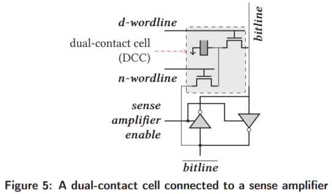

$\overline{\text{bitline}}$上的电压表示cell逻辑值的NOT逻辑，因此Ambit-NOT的方法是将$\overline{\text{bitline}}$上的数值连接到$bitline$，从而实现NOT逻辑，如上图所示。

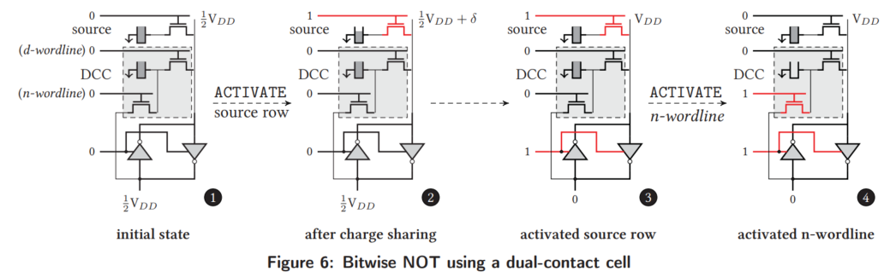

1. Activate the source row A;
2. Activate n-wordline of DCC (address B5);
3. Precharge the bank;
4. Copy data from d-wordline of DCC to row R (RowClone).

### Ambit: Putting it  all together

#### Row address grouping

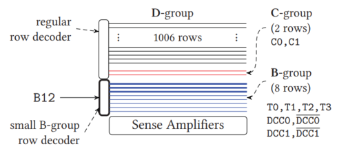

Ambit将每个subarray中的行地址分为三类：

- **B**itwise group
- **C**ontrol group
- **D**ata group

Bitwise group的地址译码如下表所示：

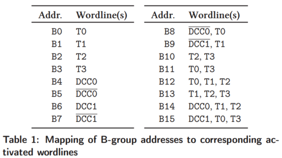

#### Executing Bitwise Ops: The AAP Primitive

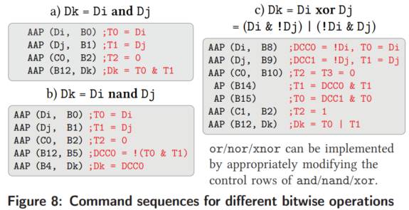

从上图可以看出逻辑操作基本上可以使用AAP操作和AP操作来实现。

#### Accelerating AAP with a Split Row Decoder

#### Integrating Ambit with the System

1. ISA Support
   $$bbop dst, src1, [src2], size$$
2. Ambit API/Driver Support

    - an API that enables applications to specify bitvectors that are likely to be involved in bitwise operations;
    - a driver that is aware of the internal mapping of DRAM rows to subarrays and maps the bitvectors involved in bulk bitwise operations to the same DRAM array.

3. Implementing the $bbop$ Instruction
    微架构需要检查：1)Ambit操作的源/目的地址是否行对齐；2)操作的长度是否是DRAM行长度的整数倍。如果检查通过，则CPU将操作发送到memory controller，否则CPU执行该操作。

4. Maintaining On-chip Cache Coherence

   - flush any dirty cache lines from the source rows;
   - invalidate any cache lines from the source rows;
   > Note: The above mechanism is already required by DMA. As Ambit operations are always row-wide, we can use structures like the Dirty-Block Index to speed up flushing dirty data.

5. Error Correction and Data Scrambling
   暂时不深入这一块

## Evaluation

<!-- 作者如何评估自己的方法，有没有问题或者可以借鉴的地方 -->

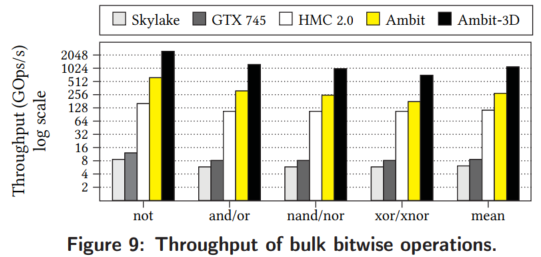

## Conclusion

<!-- 作者给了哪些strong conclusion, 又给了哪些weak conclusion? -->

### Circuit-level SPICE Simulation

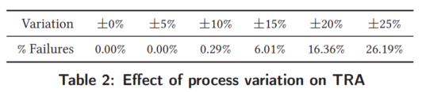

**Simulation tools:**
    HSPICE with the sense amplifier using 55nm DDR3 model parameters.
**Conclusion:**

- up to $\pm5\%$ variation, there are zero errors in TRA.
- even with $\pm10\%$ and $\pm15\%$ variation, the percentage of erroneous TRAs across 100,000 iterations each is just 0.29% and 6.01%.

### Analysis of Throughput & Energy

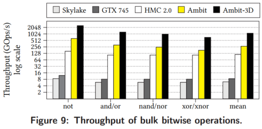

 Ambit (with 8 DRAM banks) outperform Skylake by 44.9%, GTX745 by 32.0x, and HMC 2.0 by 2.4X.

 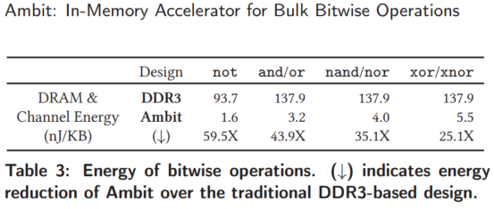

**Conclusion:** Ambit reduces energy consumption by 25.1X-59.5X compared to copying data with the memory controller using the DDR3 interface.

### Effect on Real-World Application

**Tools:** GEM5
**Benchmark:**
    - a database bitmap index
    - BitWeaving, a mechanism to accelerate database column scan operations
    - a bitvector-based implementation of the widely-used set data structure

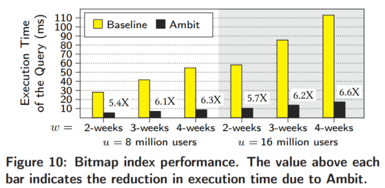

**Conclusion:** Ambit significantly reduces the query execution time compared to the baseline by 6X on average.

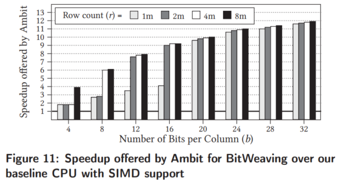

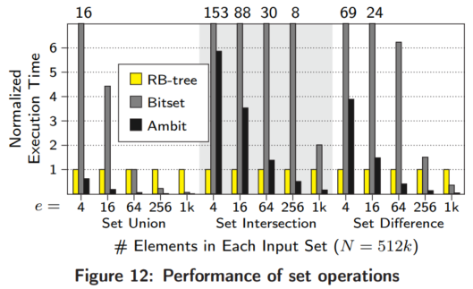

现有基于忆阻器的PIM能够加速的一大原因在于神经网络计算的高并行度，但是一旦并行度不高，这些慢的访存速度将强烈限制PIM的性能，因此在比cache访存速度慢的memory中实现非规则计算加速是不现实的，物理特性和容量升高都会导致访存变慢。但是有可能实现低功耗PIM。

## Notes

<!-- 在这些框架外额外需要记录的笔记。 -->

### Bulk bitwise operations的加速场景及意义

In fact, many real-world databases support bitmap indice. A recent work, WideTable, designs an entire database around a technique called BitWeaving, which accelerates scans completely using bulk bitwise operations. Microsoft recently open-sourced a technology called BitFunnel that accelerates the document filtering portion of web search. BitFunnel relies on fast bulk bitwise AND operations. Bulk bitwise operations are also prevalent in DNA sequence alignment, encrayption algorithms, graph processing, and networking. Thus, accelerating bulk bitwise operations can significantly boost the performance of various applications.

### Interleaved Memory System (交错存储系统)

> 参考链接：https://blog.csdn.net/wbcuc/article/details/8183369

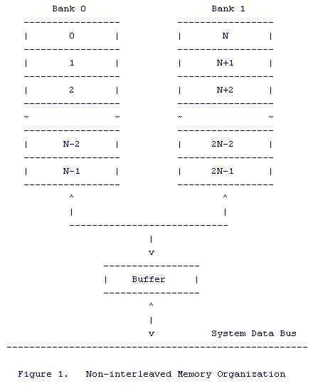

非交错存储系统如上图所示，单个bank内地址连续，因此访问连续内存需要串行访问，如下图所示。

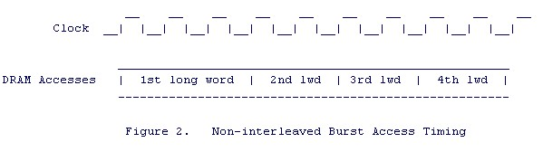

不难看出上面这种方式的访问延时比较高，为了降低访存的延时，交错存储系统将地址连续的分布在bank之间，如下图所示。

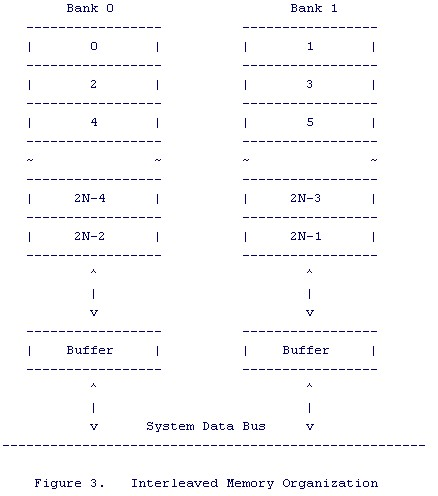

因此bank0和bank1的可以并行访问，从而将地址0和1并行读出，降低了访存的延时，如下图所示。

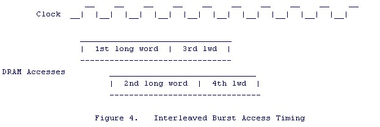

