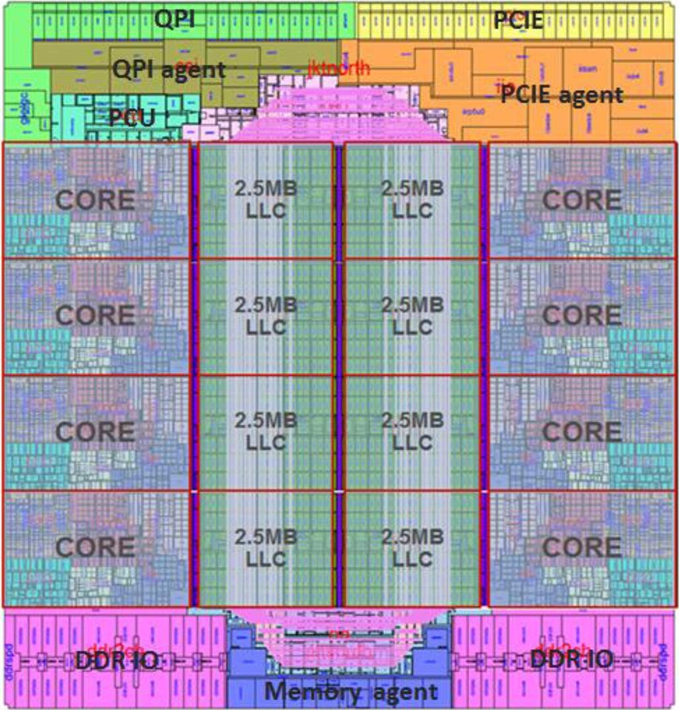
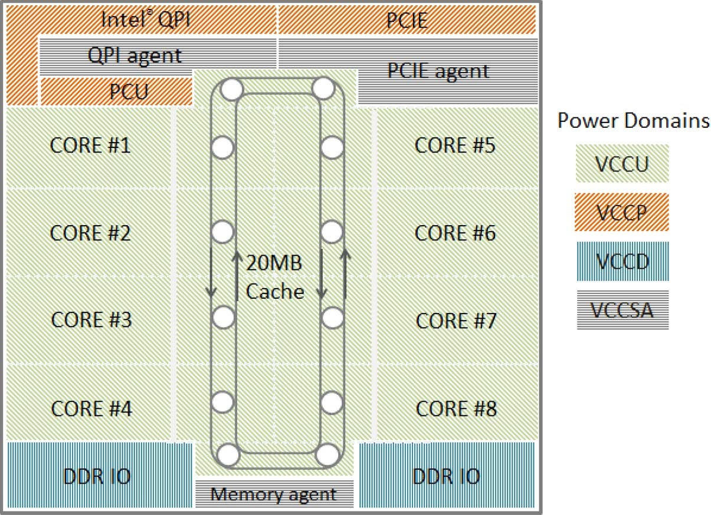
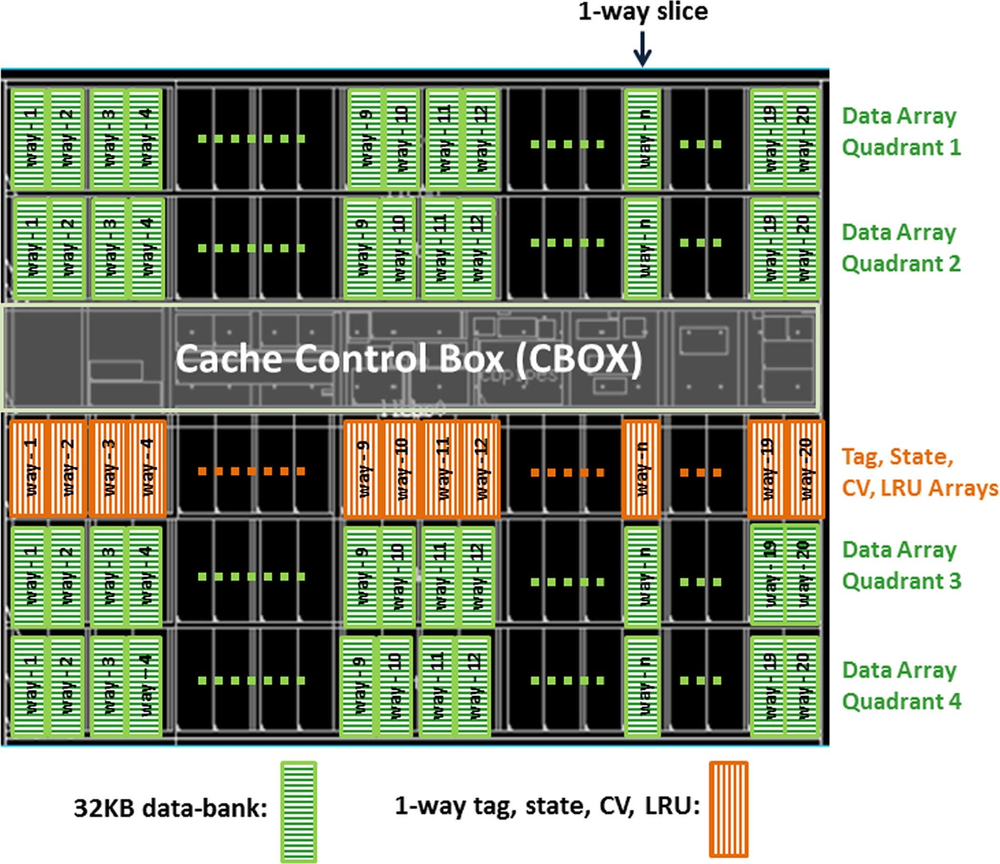
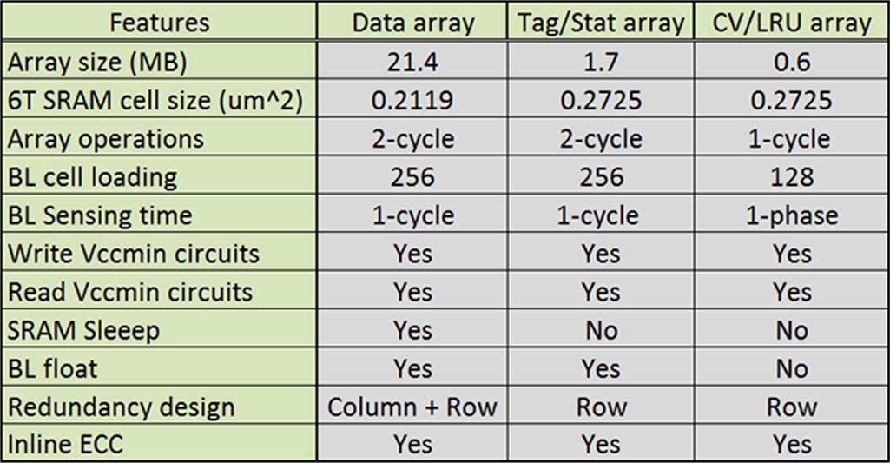
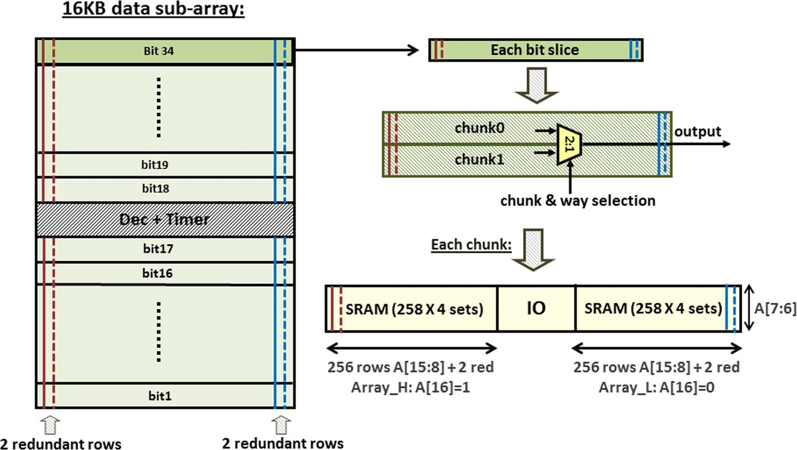

# An Energy Efficient 32-nm 20-MB Shared On-Die L3 Cache for Intel® Xeon® Processor E5 Family

## 摘要

这篇论文介绍了Intel Xeon 处理器E5家族中20-way组相联的20MB L3缓存设计，该设计基于Intel 32-nm 第二代HKMG工艺，包含9层铜布线层。
L3缓存高密度大阵列设计使用面积0.2117 um2的单元结构，低密度小阵列设计使用面积0.2725 um2的单元结构。0.7 V下工作频率1.2 GHz，1.0 V以上工作频率超过4.0 GHz。

Fig. 1. 8-core Xeon® processor E5 family floorplan.

图一所示为一个8核Xeon E5处理器的版图，可以看出该设计为NUCA结构，每个CORE附近有一个2.5 MB的LLC slice，一共20 MB。

Fig. 2. Fig. 2. 8-core Xeon® processor E5 family power domains.

图2进一步显示了该处理器不同的电压域，以及NUCA Cache以环状网络进行连接。

Fig. 3. 2.5 MB L3 cache floor-plan.

图3显示的是2.5 MB的L3 cache slice平面图，可以看出每个单独的2.5 MB LLC都是20-way 2048路组相联结构。
每路Cache容量为128 KB，由4个32KB的data array组成，此外每路还包含tag，state(Stat)，和core valid(CV)阵列。

L3的具体性能指标如表一所示，数据阵列使用高密度的0.2119单元结构，Tag/Stat array和CV/LRU array为了保证性能使用的是0.2725的单元结构。
数据阵列支持SRAM休眠。数据和标签/统计阵列都具有BL浮空省电功能。所有阵列都实现了冗余。

TABLE I: L3 ARRAY CONTENTS AND KEY DESIGN FEATURES

如图3所示，数据阵列被等分为4个象限，数据阵列中的每个Cache line的大小为64字节，其中包括其ECC和冗余位。每个数据阵列(data array)容量为32 KB，共同构成$32\ KB \times 4\ quadrants \times 20\ ways = 2.5\ MB$。
32 KB数据阵列又是由16 KB的子阵列(subarray)组成，如图4所示。
<!-- 每个子阵列包含34个比特切片和2048 sets。每个bit slice由两个信息块(chunk)组成。子阵列输出由块(chunk)和路(way)控制逻辑选择。每个本地位线连接到258个位单元（256个常规位加上2个行冗余位）。 -->
总共2048 sets由11位地址A[16:6]解码。

Fig. 4. Data subarray organization.

每个data subarray如图4所示，左侧显示的是阵列的整体结构，包含258x2行（宽度方向），34x4x2列（高度方向）。这边行列是猜测的，也可能是256x4x2，列方向是34x2，然后通过chunk&way selection进行2选1.但是此处猜测第一种格式的原因有二：（1）这种结构使得行列数接近，可以降低因WL或BL过长带来的IR Drop；（2）图4右下角A[7:6]是对4 sets进行译码，而且是沿着列方向。
基于以上介绍，data subarray的容量计算为：

$$258\times 4 \times 2\ sets \times 2\ chunks \times 34\ bit slices \approx 17.13\ KB$$

考虑到每258 sets中仅有256 sets为有效数据，其余为dummy，同时34 bit slice中应该也只有32 bit为有效数据，其余2 bits有可能是用于ECC，虽然文中没有提及其余2 bits的作用，因此实际有效数据容量为：

$$256 \times 4 \times 2\ sets \times 2\ trunks \times 32\ bit\ slice = 16\ KB$$

因此通过给定读写地址就可以同时访问34 bits，从每个bit slice中选取1 bit进行IO访问（4096选1）。