## 1. Memory System

M5 的新内存系统（在第一个 2.0 beta 版本中引入）的设计目标如下：

- 在timing mode中统一timing access和functional access操作。对于旧的内存系统，timing access没有数据，只考虑了执行操作所需的时间。然后一个单独的functional access实际上使该操作对系统可见。这种方法令人困惑，它允许模拟组件意外作弊，并阻止内存系统返回与时间相关的值，这对于执行中执行CPU模型是不合理的。
- 简化内存系统代码——删除大量模板和重复代码。
- 使更改更容易，特别是允许共享总线之外的其他内存互连。

有关在 2.0b4 中引入（以及大量缓存模型重写）的新一致性协议的详细信息，请参阅[一致性协议](https://www.gem5.org/documentation/general_docs/memory_system/classic-coherence-protocol)。

以下开始介绍Memory system中几个重要的概念：

- MemObjects
- Ports
- Connections
- Request
- Packet
- Access types
- Packet allocation protocal
- Timing Flow control
- Response and Snoop ranges

### 1.1 MemObjects

所有连接到内存系统的对象都继承自MemObject。该类添加了纯虚函数 getMasterPort(const std::string &name, PortID idx) 和 getSlavePort(const std::string &name, PortID idx)，它们返回与给定名称和索引对应的端口。 该接口用于在结构上将 MemObject 连接在一起。
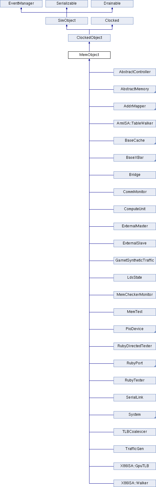


> 从上面这两张图我们可以进一步窥探gem5仿真的系统架构，从第一幅图中，我们可以看到继承自MemObject的class中有一项为System。我们点击进入这个类之后，可以看到第二幅图中，不同指令集架构的系统，如AlphaSystem、ArmSystem和X86System等，都继承自system。这些子系统的文件在src/arch路径下，其中的CPU模型会调用src/cpu中的文件，memory会调用src/mem中的文件。(个人猜测，需要后一步证实。)



在[doxygen](https://pages.cs.wisc.edu/~swilson/gem5-docs/classMemObject.html#details)中的描述对这个class进行了很好的概括：

> MemObject 类使用访问器函数扩展 ClockedObject 以获取其主端口和从端口。

在继承父类的基础上，MemObject自身增加了以下内容：

- 成员类型定义
  ```c
  typedef MemObjectParams MemObject::Params
  ```
- 构造函数和析构函数
  ```c
  MemObject::MemObject ( const Params * params )
  ```
- 成员函数
  ```c
  // 获取具有给定名称和索引的主端口。 这在绑定时使用并返回对与协议无关的基本主端口的引用。
  BaseMasterPort & MemObject::getMasterPort ( const std::string & if_name,
  PortID idx = InvalidPortID 
  )
  // 获取具有给定名称和索引的从端口。 这在绑定时使用并返回对与协议无关的基本主端口的引用。
  BaseSlavePort & MemObject::getSlavePort ( const std::string & if_name,
  PortID idx = InvalidPortID 
  )	
  const Params* MemObject::params () const
  ```


### 1.2 Ports

内存系统的下一个主要部分是端口(Port)的概念。端口用于将内存对象相互连接。它们总是成对出现，有一个 MasterPort 和一个 SlavePort，我们将另一个端口对象称为对等点。这些用于使设计更加模块化。 有了端口，就不必在每种类型的对象之间创建一个特定的接口。 每个内存对象都必须至少有一个端口才能使用。 一个主模块，如 CPU，有一个或多个 MasterPort 实例。 从模块，例如内存控制器，具有一个或多个 SlavePort。 一个互连组件，例如缓存、网桥或总线，同时具有 MasterPort 和 SlavePort 实例。


从上图可以看出EtherInt、IntSinkPinBase、IntSourcePinBase、RequestPort、ResponsePort等都继承自Port，从子类中我们可以看到各种互联组件。

例如我们可以在子类中找到gem5::o3::Fetch::IcacheCache和gem5::o3::LSQ::DcachePort，这就是o3 CPU用于访问ICache和DCache的端口。

端口对象中有两组函数。send* 函数被拥有该端口的对象在该端口上调用。例如，要在内存系统中发送数据包，CPU 会调用 myPort->sendTimingReq(pkt) 来发送数据包。每个 send 函数都有一个对应的 recv 函数，该函数在端口对等体上调用。所以上面的 sendTimingReq() 调用的实现只是触发从端口上的 peer->recvTimingReq(pkt)。<font color=red>使用这种方法，我们只有一个虚函数调用惩罚，但保留了可以将任何内存系统对象连接在一起的通用端口。</font>

主端口可以发送请求和接收响应，而从端口接收请求并发送响应。 由于一致性协议，从端口也可以发送监听请求和接收监听响应，主端口具有镜像接口。


- 构造函数和析构函数
  ```c
  gem5::Port::Port (const std::string & _name,
  PortID 	_id 
  )	
  gem5::Port::~Port ( )
  ```
- 成员函数
  ```c
  // 连接到对等端口
  virtual void gem5::Port::bind ( Port & peer)
  // 获取端口号
  PortID gem5::Port::getId( ) const
  // 返回对此端口的对等点的引用
  Port& gem5::Port::getPeer ( )
  // 此端口当前是否连接到对等点
  bool gem5::Port::isConnected ( ) const
  // 返回端口名称（用于 DPRINTF）
  const std::string gem5::Port::name ( ) const
  void gem5::Port::reportUnbound ( ) const
  // 一个实用功能，可以更轻松地换出端口
  void gem5::Port::takeOverFrom ( Port * old )	
  // 从对等端口分离
  virtual void gem5::Port::unbind ( )	
  ```
- 成员变量
  bool gem5::Port::_connected (此端口当前是否连接到对等端口)
  Port* gem5::Port::_peer (指向此端口对等点的指针)
  const PortID gem5::Port::id (用于区分向量中端口的数字标识符，如果此端口不是向量的一部分，则设置为 InvalidPortID)
  const std::string gem5::Port::portName (描述性名称（用于 DPRINTF 输出）)



### 1.3 Connections

在 Python 中，端口是模拟对象的一等属性，很像 Params。 两个对象可以指定应使用赋值运算符连接它们的端口。 与普通变量或参数分配不同，端口连接是对称的：A.port1 = B.port2 与 B.port2 = A.port1 具有相同的含义。 Python 对象中也存在主端口和从端口的概念，当端口连接在一起时会进行检查。

具有潜在无限数量端口的总线等对象使用“矢量端口”。对向量端口的分配会将对等方附加到连接列表中，而不是覆盖先前的连接。

在 C++ 中，所有对象都被实例化后，内存端口通过 python 代码连接在一起。

```python
# Hook the CPU ports up to the membus
system.cpu.icache_port = system.membus.cpu_side_ports
system.cpu.dcache_port = system.membus.cpu_side_ports
```

### 1.4 Request

请求对象封装了 CPU 或 I/O 设备发出的原始请求。 此请求的参数在整个事务中是持久的，因此对于给定的请求，请求对象的字段最多只能写入一次。 有一些构造函数和更新方法允许在不同时间（或根本不）写入对象字段的子集。 通过访问器方法提供对所有请求字段的读取访问权限，该访问器方法验证正在读取的字段中的数据是否有效。

请求对象中的字段通常不适用于真实系统中的设备，因此它们通常应该仅用于统计或调试，而不是作为架构值。<font color=red>这样仿真通信过程和真实架构差距有多大呢？</font>

请求对象字段包括：

- 虚拟地址。如果请求是直接在物理地址上发出的（例如，由 DMA I/O 设备），则该字段可能无效
- 物理地址
- 数据大小
- 创建请求的时间
- 导致此请求的 CPU/线程的 ID。如果请求不是由 CPU 发出的（例如，设备访问或缓存写回），则可能无效
- 引起此请求的 PC。如果请求不是由 CPU 发出的，也可能无效


- 构造函数和析构函数
  ```c
  // 最小的构造函数。 没有字段被初始化。 （注意 _flags 和 privateFlags 由 Flags 默认构造函数清除。）
  gem5::Request::Request ( )
  // 物理构造函数（例如 设备）请求。仅初始化物理地址、大小、标志和时间戳（到 curTick()）。这些字段足以执行请求。
  gem5::Request::Request ( Addr paddr,
  unsigned 	size,
  Flags 	flags,
  RequestorID 	id 
  )		
  gem5::Request::Request ( Addr vaddr,
  unsigned 	size,
  Flags 	flags,
  RequestorID 	id,
  Addr 	pc,
  ContextID 	cid,
  AtomicOpFunctorPtr atomic_op = nullptr 
  )	
  gem5::Request::Request ( const Request & other )	
  gem5::Request::~Request ( )	
  ```
- 成员函数
  ```c
  // 上下文 ID 的访问器函数
  ContextID gem5::Request::contextId ( ) const
  // 检查 sc 结果是否有效的访问器函数
  bool gem5::Request::extraDataValid ( ) const
  int gem5::Request::getAccessDepth ( ) const
  Tick gem5::Request::getAccessLatency ( ) const
  // 特定于体系结构的标志的访问器函数
  ArchFlagsType gem5::Request::getArchFlags ( ) const
  AtomicOpFunctor* gem5::Request::getAtomicOpFunctor ( )
  const std::vector<bool>& gem5::Request::getByteEnable ( ) const
  Flags gem5::Request::getDest ( ) const
  // 用于存储条件返回值的访问器函数
  uint64_t gem5::Request::getExtraData ( ) const
  // 标志访问器
  Flags gem5::Request::getFlags ( )
  HtmFailureFaultCause gem5::Request::getHtmAbortCause ( ) const
  Counter gem5::Request::getInstCount (  ) const
  Addr gem5::Request::getPaddr (  ) const
  Addr gem5::Request::getPC (  ) const
  InstSeqNum gem5::Request::getReqInstSeqNum (  ) const
  unsigned gem5::Request::getSize (  ) const
  Tick gem5::Request::getTranslateLatency (  ) const
  Addr gem5::Request::getVaddr (  ) const
  // 原子操作函子的访问器
  bool gem5::Request::hasAtomicOpFunctor (  ) 
  bool gem5::Request::hasContextId (  ) const
  // 硬件事务内存中止原因的访问器
  bool gem5::Request::hasHtmAbortCause (  ) const
  // 指令计数访问器
  bool gem5::Request::hasInstCount (  ) const
  // 创建请求的指令序列号的访问器
  bool gem5::Request::hasInstSeqNum (  ) const
  // paddr 的访问器
  bool gem5::Request::hasPaddr (  ) const
  bool gem5::Request::hasPC (  ) const
  // size的访问器，查看是否存在size信息
  bool gem5::Request::hasSize (  ) const
  bool gem5::Request::hasStreamId (  ) const
  bool gem5::Request::hasSubstreamId (  ) const
  bool gem5::Request::hasVaddr (  ) const
  void gem5::Request::incAccessDepth (  ) const
  bool gem5::Request::isAcquire (  ) const
  bool gem5::Request::isAtomic (  ) const
  bool gem5::Request::isAtomicNoReturn (  ) const
  bool gem5::Request::isAtomicReturn (  ) const
  // 访问器函数确定此请求是否是缓存维护操作的一部分。
  // 目前支持三种操作：1) 缓存清理操作将内存位置的所有副本更新到引用点，2) 缓存无效操作使内存中指定块的所有副本在引用点上方无效，3) 清理和无效操作是两种操作的结合。
  bool gem5::Request::isCacheClean (  ) const
  bool gem5::Request::isCacheInvalidate (  ) const
  bool gem5::Request::isCacheMaintenance (  ) const
  bool gem5::Request::isCondSwap (  ) const
  bool gem5::Request::isGL2CacheFlush (  ) const
  bool gem5::Request::isHTMAbort (  ) const
  bool gem5::Request::isHTMCancel (  ) const
  bool gem5::Request::isHTMCmd (  ) const
  bool gem5::Request::isHTMCommit (  ) const
  bool gem5::Request::isHTMStart (  ) const
  bool gem5::Request::isInstFetch (  ) const
  bool gem5::Request::isInvL1 (  ) const
  bool gem5::Request::isKernel (  ) const
  bool gem5::Request::isLLSC (  ) const
  bool gem5::Request::isLocalAccess (  ) 
  bool gem5::Request::isLockedRMW (  ) const
  bool gem5::Request::isMasked (  ) const
  bool gem5::Request::isPrefetch (  ) const
  bool gem5::Request::isPrefetchEx (  ) const
  bool gem5::Request::isPriv (  ) const
  bool gem5::Request::isPTWalk (  ) const
  bool gem5::Request::isReadModifyWrite (  ) const
  bool gem5::Request::isRelease (  ) const
  bool gem5::Request::isSecure (  ) const
  bool gem5::Request::isStrictlyOrdered (  ) const
  bool gem5::Request::isSwap (  ) const
  bool gem5::Request::isToPOC (  ) const
  // 内存请求目标的访问器函数
  bool gem5::Request::isToPOU (  ) const
  // 标志的访问器函数。 请注意，这些仅用于测试；设置标志应该通过 setFlags() 来完成
  bool gem5::Request::isUncacheable (  ) const
  // 执行已安装的本地访问
  Cycles gem5::Request::localAccessor ( ThreadContext *  tc,
  Packet *  pkt 
  ) 
  // 请求者 ID 的访问者
  RequestorID gem5::Request::requestorId (  ) const
  // 设置/获取完成该请求的访问所花费的时间，不包括成功翻译请求的时间
  void gem5::Request::setAccessLatency (  ) 
  void gem5::Request::setByteEnable ( const std::vector< bool > &  be ) 
  void gem5::Request::setCacheCoherenceFlags ( CacheCoherenceFlags  extraFlags ) 
  ```
  太长了，不写了:joy:
  [原文档链接](http://doxygen.gem5.org/release/v21-2-1-0/classgem5_1_1Request.html)


### 1.5 Packet

数据包用于封装内存系统中两个对象之间的传输（例如，L1 和 L2 缓存）。 这与单个请求从请求者一路传播到最终目的地并返回的请求形成对比，沿途可能由几个不同的数据包传送。

通过访问器方法提供对许多数据包字段的读取访问，该访问器方法验证正在读取的字段中的数据是否有效。

数据包包含以下所有内容，访问者可以访问这些内容以确保数据有效：

- 地址。 这是将用于将数据包路由到其目标（如果未明确设置目标）并在目标处处理数据包的地址。 它通常源自请求对象的物理地址，但在某些情况下可能源自虚拟地址（例如，在执行地址转换之前访问完全虚拟缓存）。 它可能与原始请求地址不同：例如，在缓存未命中时，数据包地址可能是要获取的块的地址，而不是请求地址。
- 规模。同样，这个大小可能与原始请求的大小不同，就像在缓存未命中场景中一样。
- 指向被操作数据的指针：
  - 由 dataStatic()、dataDynamic() 和 dataDynamicArray() 设置，它们分别控制当数据包使用、不使用 delete 和使用 delete [] 时是否释放与数据包关联的数据。
  - 如果上述方法之一 allocate() 未设置则分配，并且在数据包被销毁时释放数据。 （总是可以安全地调用）。
  - 可以通过调用 getPtr() 来检索指针
  - get() 和 set() 可用于操作数据包中的数据。 get() 方法执行客户机到主机的字节序转换，而 set 方法执行主机到客户机的字节序转换。
- 指示成功、错误地址、未确认和未知的状态
- 与数据包关联的命令属性列表
  - 注意：状态字段和命令属性中的数据有一些重叠。这在很大程度上是为了使数据包在 nack 时很容易重新初始化，或者很容易通过原子或功能访问重用。
- 一个 SenderState 指针，它是一个虚拟的基本不透明结构，用于保存与数据包相关的状态，但特定于发送设备（例如，MSHR）。 在数据包的响应中返回指向此状态的指针，以便发送方可以快速查找处理它所需的状态。 一个特定的子类将由此派生，以携带特定于特定发送设备的状态。
- 一个 CoherenceState 指针，它是一个虚拟基础不透明结构，用于保存与一致性相关的状态。一个特定的子类将由此派生，以携带特定于特定一致性协议的状态。
- 指向请求的指针


这边主要看一下这个packet中的保存的成员变量，即数据格式，涉及的成员函数主要是关于数据的操作，数量丰富，可以参考doxygen文档。

- 公有成员变量
  - MemCmd cmd: 数据包的命令字段
  - const PacketId 	id: 指向原始请求的指针
  - uint32_t 	headerDelay: 从看到数据包到发送标头的额外延迟
  - uint32_t 	snoopDelay: 在向内存系统发送请求之前，跟踪向上窥探所产生的额外延迟
  - uint32_t 	payloadDelay: 从看到数据包到有效负载结束的额外流水线延迟由提供它的组件（如果有）传输
  - SenderState * 	senderState: 此数据包的发送者状态
- 私有成员变量
  - Flags flags
  - PacketDataPtr 	data: 指向正在传输的数据的指针
  - Addr 	addr: 请求的地址
  - bool 	_isSecure: 如果请求以安全内存空间为目标，则为真
  - unsigned 	size: 请求或传输的大小
  - std::vector< bool > 	bytesValid: 跟踪找到的满足功能读取的字节
  - uint8_t 	_qosValue
  - HtmCacheFailure 	htmReturnReason: 保存交易的返回状态
  - uint64_t 	htmTransactionUid: 事务的全局唯一标识符


### 1.6 Access Types

- Timing: 最精确，不可与Atomic access共存
- Atomic: 用于快速转发和预热缓存，并返回完成请求的大致时间，而不会出现任何资源争用或排队延迟。
- Functional: 可以与Timing/Atomic access在内存系统中共存。功能访问用于诸如加载二进制文件、检查/更改模拟系统中的变量以及允许将远程调试器连接到模拟器之类的事情。 重要的注意事项是当设备接收到功能访问时，如果它包含数据包队列，则必须搜索所有数据包以查找功能访问正在影响的请求或响应，并且必须适当地更新它们。 Packet::intersect() 和 fixPacket() 方法可以帮助解决这个问题。

### 1.7 Packet allocation protocol

分配和释放数据包对象的协议因访问类型而异。 （我们在这里讨论的是低级 C++ 新/删除问题，而不是与一致性协议相关的任何内容。）

- 原子性和功能性：Packet 对象归请求者所有。 响应者必须用响应覆盖请求包（通常使用 Packet::makeResponse() 方法）。 没有规定对单个请求有多个响应者。 由于响应总是在 sendAtomic() 或 sendFunctional() 返回之前生成，因此请求者可以静态分配 Packet 对象，也可以在堆栈上分配。
- timing：timing事务由两个单向消息组成，一个请求和一个响应。在这两种情况下，Packet 对象都必须由发送方动态分配。重新分配是接收器的责任（或者，对于广播一致性数据包，目标设备，通常是内存）。在请求的接收者正在生成响应的情况下，它可以选择重用请求包作为其响应，以节省调用 delete 然后 new 的开销（并获得使用 makeResponse() 的便利）。但是，这种优化是可选的，请求者不能依赖于接收相同的 Packet 对象来响应请求。请注意，当响应者不是目标设备时（如在缓存到缓存的传输中），目标设备仍将删除请求数据包，因此响应缓存必须为其响应分配一个新的 Packet 对象。此外，由于目标设备可能会在传送时立即删除请求包，因此任何其他希望引用经过传送包的广播包的存储设备都必须复制该包，因为指向传送包的指针不能被依赖保持有效。

### 1.8 Timing Flow control

定时请求模拟真实的内存系统，因此与功能访问和原子访问不同，它们的响应不是即时的。因为定时请求不是瞬时的，所以需要流量控制。当通过 sendTiming() 发送定时数据包时，该数据包可能被接受，也可能不被接受，这通过返回 true 或 false 来表示。如果返回 false，则对象在收到 recvRetry() 调用之前不应再尝试发送数据包。在收到recvRetry()时它应该再次尝试调用 sendTiming()，但是该数据包可能会再次被拒绝。注意：不一定需要重新发送原始数据包，可以发送更高优先级的数据包。一旦 sendTiming() 返回 true，数据包可能仍然无法到达目的地。对于需要响应的数据包（即 pkt->needsResponse() 为真），任何内存对象都可以通过将其结果更改为 Nacked 并将其发送回其源来拒绝确认数据包。但是，如果是响应包，则不能这样做。true/false 返回旨在用于本地流控制，而 nacking 用于全局流控制。在这两种情况下，都无法做出回应。

### 1.9 Response and Snoop ranges

内存系统中的范围是通过让对地址范围敏感的设备在其从端口对象中提供 getAddrRanges 实现来处理的。 此方法返回它响应的地址的 AddrRangeList。 当这些范围发生变化时（例如，从 PCI 配置发生），设备应在其从端口上调用 sendRangeChange()，以便将新范围传播到整个层次结构。 这正是在 init(); 期间发生的事情。 所有内存对象都会调用 sendRangeChange()，并且会发生一系列范围更新，直到每个人的范围都传播到系统中的所有总线。

## 2. The gem5 Memory System

这一节描述了 gem5 中的内存子系统，重点是 CPU 的简单内存事务（读取或写入）期间的程序流程。

### 2.1 Model Hierarchy

本文档中使用的模型包含两个乱序 (O3) ARM v7 CPU，具有相应的 L1 数据缓存和简单内存。它是通过使用以下参数运行 gem5 创建的：

```shell
configs/example/fs.py –-caches –-cpu-type=arm_detailed –-num-cpus=2
```

Gem5 使用Simulation Objects派生对象作为构建内存系统的基本块。它们通过具有已建立的主/从层次结构的端口连接。数据流在主端口上启动，而响应消息和窥探查询出现在从端口上。

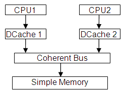

### 2.2 CPU

数据缓存对象实现了标准的缓存结构：

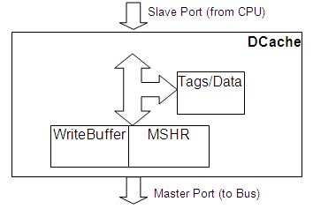

详细描述O3 CPU模型不在本文档的范围内，所以这里仅对模型进行一些相关说明：

- **Read access**通过向 DCache 对象的端口发送消息来启动。如果 DCache 拒绝消息（因为被阻塞或繁忙），CPU 将刷新管道，稍后将重新尝试访问。接收到来自 DCache 的回复消息（ReadRep）后，访问完成。
- **写访问**通过将请求存储到存储缓冲区中来启动，该存储缓冲区的上下文被清空并在每个滴答时发送到 DCache。 DCache 也可能拒绝该请求。当从 DCache 收到写回复 (WriteRep) 消息时，写访问完成。

Load & Store buffer（用于读取和写入访问）不会对活动内存访问的数量施加任何限制。因此，未完成的 CPU 内存访问请求的最大数量不受 CPU 模拟对象的限制，而是受底层内存系统模型的限制。

- 实现了**拆分内存访问**

CPU 发送的消息包含访问区域的内存类型（Normal、Device、Strongly Ordered 和 cachebility）。 但是，对内存类型采取更简化方法的模型的其余部分并未使用此方法。

### 2.3 Data Cache Object

数据缓存对象实现了标准的缓存结构:

**缓存读取：** 与特定cache tag（带有Valid和Read flags）匹配的缓存读取将在可配置的时间后完成（通过将 ReadResp 发送到 CPU）。否则，请求被转发到Miss Status and Handling Register (MSHR) 块。

**缓存写入：** 与特定cache tag（具有Valid、Read和Write标志）匹配的缓存写入将在相同的可配置时间后完成（通过发送 WriteResp到CPU）。否则，请求被转发到未命中状态和处理寄存器 (MSHR) 块。

**未缓存的内存读取**被转发到 MSHR 块

**未缓存的内存写入**被转发到 WriteBuffer 块

**被驱逐（和脏）的缓存行**被转发到 WriteBuffer 块

如果以下任一情况为真，则 CPU 对 Data Cache 的访问被阻止：

- MSHR 块已满。 （MSHR 的缓冲区大小是可配置的。）
- 写回块已满。 （块缓冲区的大小是可配置的。）
- 针对同一高速缓存行的未完成内存访问次数已达到可配置阈值 - 有关详细信息，请参阅 MSHR 和写入缓冲区。

处于块状态的数据缓存将拒绝来自从端口（来自 CPU）的任何请求，无论它是否会导致缓存命中或未命中。请注意，主端口上的传入消息（响应消息和窥探请求）永远不会被拒绝。

无法缓存的内存区域上的缓存命中（根据 ARM ARM 的意外行为）将使缓存行无效并从内存中获取数据。

### 2.4 Tags & Data Block

缓存行（在源代码中称为块）被组织成具有可配置关联性和大小的集合。它们具有以下状态标志：

- **Valid**: 数据/地址标签有效
- **Read**: 如果没有设置此标志，则不会接受任何读取请求。例如，缓存行在等待写标志完成写访问时是有效且不可读的。
- **Write**: 可以接受写入。带有写入标志的高速缓存行标识唯一状态——没有其他高速缓存存储器保存副本。
- **Dirty**: 驱逐时需要写回

如果地址标签匹配并且设置了有效和读取标志，则读取访问将命中高速缓存行。如果地址标签匹配并且设置了有效、读取和写入标志，则写入访问将命中高速缓存行。

### 2.5 MSHR and Write Buffer Queues

未命中状态和处理寄存器 (MSHR) 队列保存 CPU 未完成的内存请求列表，这些请求需要读取访问较低的内存级别。他们是：

- 缓存读取未命中
- 缓存写未命中
- 未缓存的读取

WriteBuffer 队列持有以下内存请求：

- 未缓存的写入
- 从被驱逐（和脏）缓存行写回

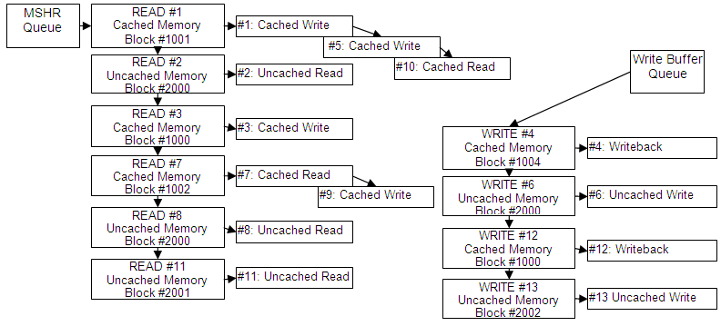

每个内存请求都分配给相应的 MSHR 对象（上图中的 READ 或 WRITE），该对象表示必须读取或写入才能完成命令的特定内存块（高速缓存行）。如上图所示，针对同一缓存行的缓存读/写具有共同的 MSHR 对象，并且将通过单个内存访问完成。

块的大小（以及因此对较低内存的读/写访问的大小）是：

- 用于缓存访问和回写的缓存行大小
- 如未缓存访问的 CPU 指令中所指定

通常，数据缓存模型仅区分两种内存类型：

- **Normal Cached memory**: 它通常被视为回写、读取和写入分配
- **Normal uncached, Device 和 Strongly Ordered types**: 被同等对待（作为未缓存的内存）

### 2.6 Memory Access Ordering

为每个 CPU 读/写请求分配一个唯一的order number（它们出现在从端口上）。MSHR 对象的order number从第一个分配的读/写复制。

这两个队列中的每一个队列的内存读/写都是按顺序执行的（根据分配的顺序号）。当两个队列都不为空时，模型将执行从 MSHR 块读取的内存，除非 WriteBuffer 已满。 但是，它将始终保留相同（或重叠）内存高速缓存行（块）上的读/写顺序。

总之：

- 除非它们针对相同的缓存行，否则不会保留对缓存内存的访问顺序。例如，访问#1、#5 和#10 将在同一滴答中同时完成（仍按顺序）。访问#5 将在#3 之前完成。
- 保留所有未缓存内存写入的顺序。 Write#6 总是在 Write#13 之前完成。
- 保留所有未缓存内存读取的顺序。 Read#2 总是在 Read#8 之前完成。
- 读取和写入未缓存访问的顺序不一定会保留，除非它们的访问区域重叠。因此，Write#6 总是在 Read#8 之前完成（它们针对相同的内存块）。但是，Write#13 可能在 Read#8 之前完成。

### 2.7 Coherent Bus Object

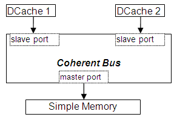

Coherent Bus 对象提供对 snoop 协议的基本支持：

从端口上的所有请求都转发到相应的主端口。缓存内存区域的请求也被转发到其他从端口（作为窥探请求）。

主端口回复被转发到适当的从端口。

主端口监听请求被转发到所有从端口。

从端口监听回复被转发到作为请求源的端口。 （注意窥探请求的来源可以是从端口或主端口。）

在以下任何事件发生后，总线声明自己阻塞一段可配置的时间：

- 数据包被发送（或发送失败）到从端口。
- 回复消息被发送到主端口。
- 来自一个从端口的侦听响应被发送到另一个从端口。

处于阻塞状态的总线拒绝以下传入消息：

- 从端口请求
- 主端口回复
- 主端口侦听请求

### 2.8 Simple Memory Object

它永远不会阻止从端口上的访问。

内存读/写立即生效。 （收到请求时执行读取或写入）。

回复消息在可配置的时间段后发送。

### 2.9 Message Flow

#### 2.9.1 Memory Access Ordering (Read)

下图显示了使用 Valid 和 Read 标志命中 Data Cache 行的读取访问：

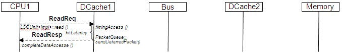

缓存未命中读取访问将生成以下消息序列：

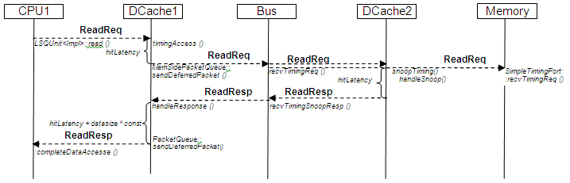

请注意，总线对象永远不会从 DCache2 和内存对象获得响应。 它将完全相同的 ReadReq 包（消息）对象发送到内存和数据缓存。 当数据缓存想要回复探听请求时，它会用 MEM_INHIBIT 标志标记消息，告诉内存对象不要处理消息。

#### 2.9.2 Memory Access Ordering (Write)

下图显示了使用 Valid & Write 标志命中 DCache1 缓存行的写访问：

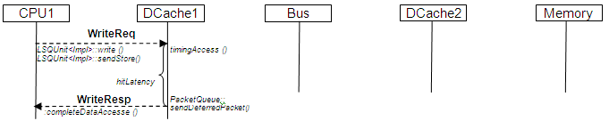

下图显示了命中 DCache1 高速缓存行的写入访问，带有有效但没有写入标志 - 这被视为写入未命中。 DCache1 发出 UpgradeReq 以获得写入权限。 DCache2::snoopTiming 将使已命中的缓存行无效。 请注意，UpgradeResp 消息不携带数据。

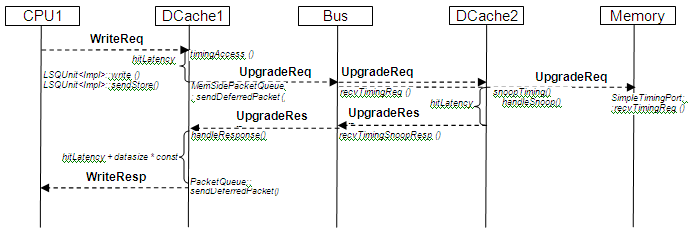

下图显示了 DCache 中的写入未命中。 ReadExReq 使 DCache2 中的缓存行无效。 ReadExResp 携带内存缓存行的内容。

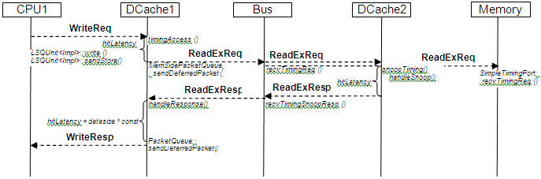

## 3. Replacement Policies

Gem5 实施了多项替换政策。每个都使用其特定的替换数据来确定驱逐的替换受害者。

所有替换策略都优先考虑破坏无效块。

替换策略由 reset()、touch()、invalidate() 和 getVictim() 方法组成。每个都以不同的方式处理替换数据。

- **reset()** 用于初始化替换数据（即验证）。它应该只在条目插入时调用，并且在失效之前不得再次调用。对条目的第一次操作必须始终是 reset()。
- **touch()** 用于访问替换数据，因此应该在条目访问时调用。它更新替换数据。
- **invalidate()** 每当条目无效时调用，可能是由于处理一致性。它使条目在下一次受害者搜索时尽可能被驱逐。在 reset() 完成之前，不需要使条目无效。 模拟开始时，所有条目均无效。
- **getVictim()** 会在未命中时调用，并且必须执行驱逐。它在所有替换候选中搜索具有最差替换数据的条目，通常优先驱逐无效条目。

我们简要描述了 Gem5 中实现的替换策略。如果需要更多信息，可以研究 Cache Replacement Policies Wikipedia 页面或相应的论文。

### 3.1 Random

最简单的更换政策；它不需要替换数据，因为它会在候选者中随机选择一个受害者。

### 3.2 Least Recently Used (LRU)

它的替换数据由最后一次访问时间戳组成，并根据它选择受害者：它是最旧的，它的相应条目更有可能成为受害者。

### 3.3 Tree Pseudo Least Recently Used (TreePLRU)

LRU 的一种变体，它使用二叉树通过 1 位指针跟踪条目的使用情况。

### 3.4 Bimodal Insertion Policy (BIP)

[双峰插入策略](https://dl.acm.org/citation.cfm?id=1250709)类似于 LRU，但是根据双峰节流参数 (btp)，块有可能作为 MRU 被插入。 最高的 btp 是，最高的是新块作为 MRU 插入的可能性。

### 3.5 LRU Insertion Policy (LIP)

[LRU 插入策略](https://dl.acm.org/citation.cfm?id=1250709)由 LRU 替换策略组成，该策略不是插入具有最近最后一次访问时间戳的块，而是将它们作为 LRU 条目插入。 在随后对块的访问中，它的时间戳被更新为 MRU，就像在 LRU 中一样。 它也可以看作是一个 BIP，其中插入最近使用的新块的可能性为 0%。

### 3.6 Most Recently Used (MRU)

最近使用的策略根据他们的新近选择替代受害者，但是，与 LRU 不同，最新的条目越有可能成为受害者。

### 3.7 Least Frequently Used (LFU)

使用参考频率选择受害者。选择最少被引用的条目被驱逐，无论它被访问了多少次，或者自上次访问以来已经过去了多长时间。

### 3.8 First-In, First-Out (FIFO)

使用插入时间戳选择受害者。如果不存在无效条目，则最旧的条目将成为受害者，无论它被访问了多少次。

### 3.9 Second-Chance

[Second-Chance](https://apps.dtic.mil/docs/citations/AD0687552)替换策略与 FIFO 类似，但条目在受害之前有第二次机会。 如果一个条目将成为下一个受害者，但它的第二次机会位被设置，则该位被清除，并且该条目被重新插入到 FIFO 的末尾。 在未命中之后，插入一个条目，其第二次机会位被清除。


### 3.10 Not Recently Used (NRU)

最近未使用 (NRU) 是 LRU 的近似值，它使用单个位来确定块是否将在近期或遥远的将来重新引用。 如果该位为 1，则很可能不会很快被引用，因此选择它作为替代牺牲品。 当一个块成为牺牲品时，它的所有共同替换候选者的重新引用位都会增加。

### 3.11 Re-Reference Interval Prediction (RRIP)

[重引用间隔预测](https://dl.acm.org/citation.cfm?id=1815971) (RRIP) 是 NRU 的扩展，它使用重引用预测值来确定块是否将在不久的将来被重用。 RRPV 的值越高，该块离其下一次访问越远。 从原始论文来看，这种 RRIP 实现也称为静态 RRIP (SRRIP)，因为它总是插入具有相同 RRPV 的块。

### 3.12 Bimodal Re-Reference Interval Prediction (BRRIP)

[双峰重参考区间预测](https://dl.acm.org/citation.cfm?id=1815971) (BRRIP) 是 RRIP 的扩展，它有可能不插入块作为 LRU，如在双峰插入策略中一样。 此概率由双峰节流参数 (btp) 控制。


## 4. Indexing Policies

索引策略根据块的地址确定块映射到的位置。

索引策略最重要的方法是 getPossibleEntries() 和 regenerateAddr()：

- getPossibleEntries() 确定给定地址可以映射到的条目列表。
- regenerateAddr() 使用存储在条目中的地址信息来确定其完整的原始地址。

有关缓存索引策略的更多信息，请参阅关于[放置策略](https://en.wikipedia.org/wiki/Cache_Placement_Policies)和[关联性](https://en.wikipedia.org/wiki/CPU_cache#Associativity%7C)的维基百科文章。

### 4.1 Set Associative

集合关联索引策略是类表结构的标准，可以进一步分为 Direct-Mapped（或 1-way set-associative）、Set-Associative 和 Full-Associative（N-way set-associative，其中 N 是表条目的数量）。

集合关联缓存可以看作是倾斜的关联缓存，其倾斜函数在每条路径上都映射到相同的值。


### 4.2 Skewed Associative

倾斜的关联索引策略具有基于散列函数的变量映射，因此可以根据使用的方式将值 x 映射到不同的集合。 Gem5 实现了倾斜缓存，如 [Seznec 等人的"Skewed Associative Cache"](https://www.researchgate.net/publication/220758754_Skewed-associative_Caches)中所述。

请注意，只有有限数量的已实现散列函数，因此如果路数高于该数量，则使用次优自动生成的散列函数。

## 5. Classic Memory System coherence

M5 2.0b4 引入了一个经过大量重写和简化的缓存模型，包括一个新的一致性协议。 （旧的 pre-2.0 缓存模型已被修补以与 2.0beta 中引入的新内存系统一起使用，但没有重写以利用新内存系统的功能。）

新的一致性协议的关键特性是它被设计为使用或多或少的任意缓存层次结构（多个缓存，每个缓存位于多个级别）。相比之下，旧协议将共享限制在单个总线上。

在现实世界中，系统架构会限制协议可以设计的缓存数量或配置。 设计一个完全现实且对任意配置有效的协议是不切实际的。 为了使我们的协议能够处理（几乎）任意配置，我们目前牺牲了一点真实性和一点可配置性。 我们的意图是，该协议足以让研究人员研究系统行为的其他方面，而不是连贯机制。 专门研究一致性的研究人员可能希望用正在研究的特定协议的实现来替换默认的一致性机制。

该协议是 MOESI 侦听协议。 不强制包含； 在 CMP 配置中，您有多个 L1，其总容量是它们共享的公共 L2 容量的很大一部分，包含可能非常低效。

来自上层缓存（更靠近 CPU）的请求以预期的方式向内存传播：在本地 L1/L2 总线上广播 L1 未命中，在该总线上被该总线上的其他 L1 侦听（如果没有响应） ) 由 L2 提供服务。 如果请求在 L2 中未命中，则在经过一定延迟（当前设置等于 L2 命中延迟）后，L2 将在其内存侧总线上发出请求，在那里它可能会被其他 L2 窥探，然后被发送到 L3 或内存。

不幸的是，以类似的方式传播窥探请求以增量方式备份层次结构是无数几乎难以处理的竞争条件的来源。 实际系统通常不会这样做。 通常，您希望 L2 总线上的单个监听操作来告诉您整个 L1/L2 层次结构中块的状态。 有几种方法可以做到这一点：

... ...

## 6. Classic Caches

默认缓存是一个非阻塞缓存，带有 MSHR（未命中状态保持寄存器）和 WB（写入缓冲区）用于读取和写入未命中。缓存也可以通过预取启用（通常在缓存的最后一级）。

gem5 中实现了多种可能的替换策略和索引策略。 它们分别定义了可以用于给定地址的块替换的可能块，以及如何使用地址信息来查找块的位置。 默认情况下，使用 LRU（最近最少使用）替换缓存行，并使用 Set Associative 策略进行索引。

### 6.1 Interconnects

#### 6.1.1 Crossbars

Crossbar中的两种类型的流量是内存映射数据包和侦听数据包。内存映射的请求沿着内存层次结构向下，响应沿着内存层次结构向上（相同的路由返回）。窥探请求水平向上并向上缓存层次结构，窥探响应水平向下传递层次结构（返回相同的路由）。普通窥探是水平的，而快速窥探会在缓存层次结构中上升。

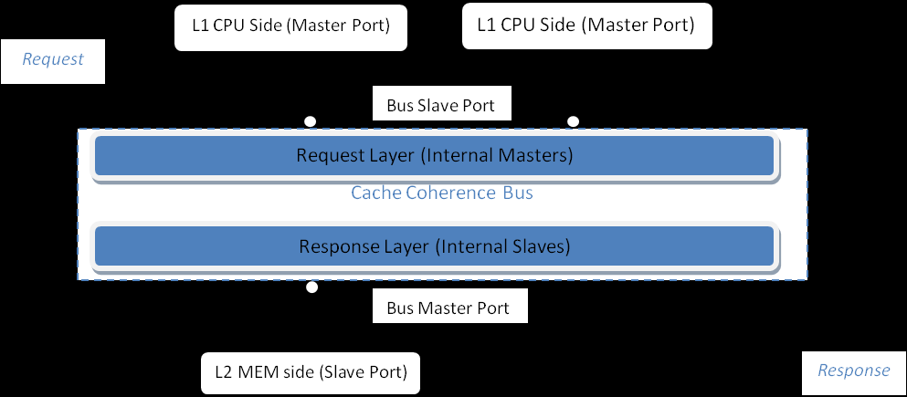

#### 6.1.2 Bridges

#### 6.1.3 Others...

### 6.2 Debugging

经典内存系统中有一个功能可以从调试器（例如 gdb）中显示特定块的一致性状态。 此功能建立在经典内存系统对功能访问的支持之上。 （请注意，此功能目前很少使用，可能存在错误。）

如果您使用设置为 PrintReq 的命令注入功能性请求，则数据包会遍历内存系统（如常规功能性请求），但在任何匹配的对象（其他排队的数据包、缓存块等）上，它只会打印出一些关于那个对象的信息。

Port 上有一个名为 printAddr() 的辅助方法，它获取地址并构建适当的 PrintReq 数据包并注入它。由于它使用与正常功能请求相同的机制进行传播，因此需要从一个端口注入，该端口将在整个内存系统中传播，例如在 CPU 中。在 MemTest、AtomicSimpleCPU 和 TimingSimpleCPU 对象上有帮助 printAddr() 方法，它们只是在各自的缓存端口上调用 printAddr()。（警告：后两者未经测试。）

把它们放在一起，你可以这样做：

```shell
(gdb) set print object
(gdb) call SimObject::find(" system.physmem.cache0.cache0.cpu")
$4 = (MemTest *) 0xf1ac60
(gdb) p (MemTest*)$4
$5 = (MemTest *) 0xf1ac60
(gdb) call $5->printAddr(0x107f40)

system.physmem.cache0.cache0
  MSHRs
    [107f40:107f7f] Fill   state:
      Targets:
        cpu: [107f40:107f40] ReadReq
system.physmem.cache1.cache1
  blk VEM
system.physmem
  0xd0
```

…这表示 cache0.cache0 有一个为该地址分配的 MSHR 以从 CPU 为目标 ReadReq 提供服务，但它还没有服务（否则它会被标记为这样）； 该块在cache1.cache1中是有效的、独占的和被修改的，并且该字节在物理内存中的值为0xd0。

显然，它不一定是您想要的所有信息，但它非常有用。随意扩展。还有一个当前未使用的详细参数可以被利用来产生不同级别的输出。

请注意，需要额外的“p (MemTest*)\$4”，因为尽管“set print object”显示派生类型，但在内部 gdb 仍将指针视为基类型，因此如果您尝试直接在 \$4 上调用 printAddr指针你得到这个：

```shell
(gdb) call $4->printAddr(0x400000)
Couldn't find method SimObject::printAddr
```

