# Arm Research Starter Kit: System Modeling using gem5

Ashkan Tousi and Chuan Zhu
July 2017 (updated October 2020)

## License

Copyright © 2017, 2020 Arm Limited or its affiliates. This work is licensed under a Creative Commons AttributionShareAlike 4.0 International License. Source code and configuration files are made available under the 3-clause BSD license, provided such license extends only to copyright in the software and shall not be construed as granting a license to any other intellectual property relating to a hardware implementation of the functionality of the software.

The Arm name and Arm logo are registered trademarks or trademarks of Arm Limited (or its subsidiaries) in the US and/or elsewhere. For further information, visit: http://www.arm.com/company/policies/trademarks


## Abstract

This document is part of the Arm Research Starter Kit on System Modeling. It is intended to guide you through Arm-based system modeling using the gem5 simulator. The gem5 simulator is a modular platform for system architecture research.

本文档是 Arm Research 系统建模入门套件的一部分。 它旨在指导您使用 gem5 模拟器完成基于 Arm 的系统建模。 gem5 模拟器是一个用于系统架构研究的模块化平台。

We first introduce the gem5 simulator and its basics. gem5 provides two main simulation modes: the System call Emulation (SE) mode, where system services are provided by the simulator, and the Full System (FS) mode, where a complete system with devices and an operating system can be simulated.

我们首先介绍 gem5 模拟器及其基础知识。 gem5 提供了两种主要的模拟模式：系统调用模拟（SE）模式，系统服务由模拟器提供；Full System（FS）模式，可以模拟具有设备和操作系统的完整系统。

We then introduce a High-Performance In-order (HPI) CPU model in gem5, which is tuned to be representative of a modern in-order Armv8-A implementation.

然后我们在 gem5 中引入了一个高性能有序 (HPI) CPU 模型，它被调整为代表现代有序 Armv8-A 实现。

We also use some benchmarks to test the performance of our HPI system. The Stanford SingleSource workloads from the LLVM test-suite are used for benchmarking in the gem5 SE mode. In the FS mode, we use the PARSEC Benchmark Suite to examine our model. We run the PARSEC benchmarks on both single-core and multi-core HPI systems and present the results.

我们还使用一些基准测试来测试我们的 HPI 系统的性能。 LLVM 测试套件中的 Stanford SingleSource 工作负载用于 gem5 SE 模式下的基准测试。 在 FS 模式下，我们使用 PARSEC Benchmark Suite 来检查我们的模型。 我们在单核和多核 HPI 系统上运行 PARSEC 基准测试并展示结果。

This document aims to help early-stage computer system researchers to get started with Arm-based system modeling using gem5. It can also be used by professional gem5 users who would like to use a modern Arm-based CPU model in their research.

本文档旨在帮助早期计算机系统研究人员开始使用 gem5 进行基于 Arm 的系统建模。 想要在研究中使用现代基于 Arm 的 CPU 模型的专业 gem5 用户也可以使用它。


## Starting with Arm System Modeling in gem5

### Introduction

System-on-chip (SoC) computing systems are complex and prototyping such systems is extremely expensive. Therefore, simulation is a cost-effective way to evaluate new ideas. Modern simulators are capable of modeling various system components, such as different CPU models, interconnection topologies, memory subsystems, etc. Simulators also model the interactions among system components.

片上系统 (SoC) 计算系统很复杂，并且对此类系统进行原型设计非常昂贵。 因此，模拟是评估新想法的一种经济有效的方式。 现代模拟器能够对各种系统组件进行建模，例如不同的 CPU 模型、互连拓扑、内存子系统等。模拟器还可以对系统组件之间的交互进行建模。

The gem5 simulator is a well-known sophisticated simulator used for computer system research at both architecture and micro-architecture levels. gem5 is capable of modeling several ISAs, including Arm and x86, and supporting both 32 and 64-bit kernels and applications. It does so with enough detail such that booting unmodified Linux distributions is possible. In the case of Arm, gem5 is able to boot latest versions of the Android operating system. This Research Starter Kit will guide you through Arm-based system modeling using the gem5 simulator and a 64-bit processor model based on Armv8-A.

gem5 模拟器是众所周知的复杂模拟器，用于计算机系统在体系结构和微体系结构级别的研究。 gem5 能够对多种 ISA 进行建模，包括 Arm 和 x86，并支持 32 位和 64 位内核和应用程序。 它提供了足够的细节，因此可以启动未经修改的 Linux 发行版。 在 Arm 的情况下，gem5 能够启动最新版本的 Android 操作系统。 该研究入门套件将指导您使用 gem5 模拟器和基于 Armv8-A 的 64 位处理器模型完成基于 Arm 的系统建模。

### Arm Cortex-A Processors

Arm Cortex-A processors are powerful and efficient application processors, which are widely deployed in mobile devices, networking infrastructure, IoT devices, and embedded designs. Along with their high performance and power efficiency, Cortex-A processors provide compatibility with many popular operating systems, such as various Linux distributions, Android, IOS and Windows Phone. A full memory management unit is employed in Cortex-A models, and multiple CPU cores can work together seamlessly.

Arm Cortex-A 处理器是功能强大且高效的应用处理器，广泛部署在移动设备、网络基础设施、物联网设备和嵌入式设计中。 除了高性能和高能效外，Cortex-A 处理器还兼容许多流行的操作系统，例如各种 Linux 发行版、Android、IOS 和 Windows Phone。 Cortex-A 型号采用完整的内存管理单元，多个 CPU 内核可以无缝协同工作。

Besides the 32-bit architecture used in Armv7-A, which is referred to as AArch32 state, the later Armv8-A represents a fundamental change to the Arm architecture by introducing an optional 64-bit architecture, named the AArch64 state.

除了在 Armv7-A 中使用的 32 位架构（称为 AArch32 状态）之外，后来的 Armv8-A 通过引入一个可选的 64 位架构，称为 AArch64 状态，代表了对 Arm 架构的根本性改变。

In order to enable researchers to evaluate their ideas on state-of-art Arm systems and carry out further studies and research, we provide guidance on how to simulate an Arm system in gem5.

为了使研究人员能够评估他们对最先进的 Arm 系统的想法并进行进一步的研究和研究，我们提供了有关如何在 gem5 中模拟 Arm 系统的指导。

### Using this Research Starter Kit

We show you how to get the materials required for this Research Starter Kit (RSK), and also how to build gem5 for Arm.

我们将向您展示如何获取此研究入门套件 (RSK) 所需的材料，以及如何为 Arm 构建 gem5。

#### Hardware and OS Requirements

In order to compile gem5 and get it working, we suggest some simple guidelines on choosing a suitable host platform.

为了编译 gem5 并使其工作，我们建议一些关于选择合适的主机平台的简单指南。

The simulation of a 64-bit Arm platform is memory-thirsty. A modern 64-bit host platform can utilize more memory and prevent further slowdowns. Also, gem5 can require up to 1GB memory per core to compile. We also suggest using the same endianness between the host platform and the simulated Arm ISA, as cross-endian simulation is not extensively tested on gem5. Finally, gem5 runs on the Unix-like OSs.

64 位 Arm 平台的模拟需要大量内存。 现代 64 位主机平台可以利用更多内存并防止进一步减速。 此外，gem5 每个内核最多需要 1GB 内存来编译。 我们还建议在主机平台和模拟的 Arm ISA 之间使用相同的字节序，因为跨字节序模拟没有在 gem5 上进行广泛测试。 最后，gem5 运行在类 Unix 操作系统上。

Our experiments are carried out on an 8-core x86_64, i7-4790 CPU @ 3.60GHz host machine running an Ubuntu 14.04.5 LTS (GNU/Linux 3.13.0-112-generic x86_64). The examples have also been tested more recently on an Ubuntu 18.04 LTS host.

我们的实验是在运行 Ubuntu 14.04.5 LTS (GNU/Linux 3.13.0-112-generic x86_64) 的 8 核 x86_64、i7-4790 CPU @ 3.60GHz 主机上进行的。 这些示例最近还在 Ubuntu 18.04 LTS 主机上进行了测试。

#### gem5 Dependencies

For the purpose of this work, the following dependencies are needed to build gem5 on the host platform:

出于这项工作的目的，在主机平台上构建 gem5 需要以下依赖项：

| Software              	| Version Requirement 	|
|-----------------------	|---------------------	|
| g++                   	| 4.8+                	|
| Python and Python-Dev 	| 2.7                 	|
| SCons                 	| 0.98.1+             	|
| zlib                  	| recent              	|
| m4                    	| recent              	|
| protobuf              	| 2.1+                	|
| pydot                 	| recent              	|

protobuf and pydot are not mandatory but are highly recommended for trace capture, playback support and graphical representations of the simulated system topology. Most of the software packages can be installed from the repositories of the popular Linux distributions.

protobuf 和 pydot 不是强制性的，但强烈建议用于跟踪捕获、回放支持和模拟系统拓扑的图形表示。 大多数软件包都可以从流行的 Linux 发行版的存储库中安装。

#### Getting the Research Starter Kit

The Arm Research Starter Kit (RSK) on System Modeling is comprised of two main parts:

Arm Research 系统建模入门套件 (RSK) 由两个主要部分组成：

- <font color=green>gem5</font>: the gem5 repository is located at: https://gem5.googlesource.com/public/gem5
- <font color=green>arm-gem5-rsk</font>: the scripts, patches and files required to run the examples and benchmarks listed in this document can be found at the Arm gem5 RSK repository: https://github.com/arm-university/arm-gem5-rsk.git

	- Document: this document is also part of the arm-gem5-rsk repository
	- Cheat Sheet: all code and examples provided in this document are listed in the Wiki section of the arm-gem5-rsk repository: https://github.com/arm-university/arm-gem5-rsk/wiki

You can clone the above repositories separately, or just download our clone.sh bash script and run it. It will clone the repositories into their corresponding gem5 and arm-gem5-rsk directories. The script itself can also be found in the arm-gem5-rsk repository.

您可以单独克隆上述存储库，也可以下载我们的 clone.sh bash 脚本并运行它。 它会将存储库克隆到相应的 gem5 和 arm-gem5-rsk 目录中。 脚本本身也可以在 arm-gem5-rsk 存储库中找到。

```shell
wget https://raw.githubusercontent.com/arm-university/arm-gem5-rsk/master/clone.sh
bash clone.sh
```

You can find more information about the structure of both repositories in their README files.

您可以在它们的 README 文件中找到有关两个存储库结构的更多信息。

#### Building gem5 binaries for Arm

In order to build the gem5 binaries for Arm, simply use scons with parameters in the <build_dir>/ARM/<target> format from the gem5 root directory, where ARM in the middle selects the simulator functionalities associated with the Arm architecture. You can also enable parallel builds by specifying the -jN option, where N is the number of concurrent build processes. Also, gem5.opt is the name of the gem5 binary to build, which balances between the simulation speed and the debugging functionality.

为了为 Arm 构建 gem5 二进制文件，只需在 gem5 根目录中使用带有 <build_dir>/ARM/<target> 格式的参数的 scons，其中中间的 ARM 选择与 Arm 架构相关的模拟器功能。 您还可以通过指定 -jN 选项来启用并行构建，其中 N 是并发构建进程的数量。 此外，gem5.opt 是要构建的 gem5 二进制文件的名称，它在模拟速度和调试功能之间取得平衡。

```shell
scons build/ARM/gem5.opt -jN
```

In total, five binary versions are supported, namely .debug, .opt, .fast, .prof and .perf, which specify the set of compiler flags used. Their differences can be found below:

总共支持五个二进制版本，即 .debug、.opt、.fast、.prof 和 .perf，它们指定使用的编译器标志集。 它们的区别如下：

| Build Name 	| Explanation                                                                                	|
|------------	|--------------------------------------------------------------------------------------------	|
| gem5.debug 	| supports run time debugging with no optimization.                                          	|
| gem5.opt   	| provides a fair balance between debugging support and optimization.                        	|
| gem5.fast  	| provides best performance with optimization turned on, but debugging is not supported.     	|
| gem5.prof  	| is similar to "gem5.fast" but also includes instrumentation to be used by profiling tools. 	|
| gem5.perf  	| is complementary to "gem5.prof", includes instrumentation, but uses Google perftools.      	|

### Simulating Arm in gem5

We are now ready to simulate an Arm system in gem5. First, we introduce the corresponding command line, before looking at some examples. The gem5 command line has the following format. This command calls the gem5 binary and its related options, as well as a simulation Python script and its corresponding options.

我们现在准备在 gem5 中模拟 Arm 系统。 在看一些例子之前，我们先介绍一下相应的命令行。 gem5 命令行具有以下格式。 该命令调用 gem5 二进制文件及其相关选项，以及一个模拟 Python 脚本及其相应选项。

```shell
<gem5_ARM_binary> [gem5_options] <simulation_script> [script_options]
```

In order to check the available options for the gem5 binary, you may use the command $ <gem5_ARM_binary> -h. Also, to list the script options, the following command may be used.

为了检查 gem5 二进制文件的可用选项，您可以使用命令 $ <gem5_ARM_binary> -h。 此外，要列出脚本选项，可以使用以下命令。

```shell
<gem5_ARM_binary> [gem5_options] <simulation_script> -h
```

The aforementioned Python script in the gem5 command line sets up and executes the simulation, by setting the SimObjects in the gem5 model, including CPUs, caches, memory controllers, buses, etc. A selection of example simulation scripts for Arm can be found in configs/example/arm/ within the gem5 directory.

前面提到的 gem5 命令行中的 Python 脚本通过设置 gem5 模型中的 SimObjects 来设置和执行仿真，包括 CPU、缓存、内存控制器、总线等。 可以选择 Arm 的示例仿真脚本 在 gem5 目录中的 configs/example/arm/ 中找到。

#### System Call Emulation (SE) Mode

The SE mode simulation focuses on the CPU and memory system, and does not emulate the entire system. We just need to specify a binary file to be executed. So, we can run a simple simulation using the following command, where starter_se.py is the simulation script and hello is the binary file passed as a positional argument.

SE 模式仿真侧重于 CPU 和内存系统，并不仿真整个系统。 我们只需要指定一个要执行的二进制文件。 因此，我们可以使用以下命令运行一个简单的模拟，其中 starter_se.py 是模拟脚本，hello 是作为位置参数传递的二进制文件。

```shell
./build/ARM/gem5.opt configs/example/arm/starter_se.py --cpu="minor" --num-cores=2 "tests/test-progs/hello/bin/arm/linux/hello" "tests/test-progs/hello/bin/arm/linux/hello"
```

We can then see the gem5 output in the terminal, including some basic information about the simulation and standard output of the test program, which is “Hello world!” in this case. If the specified memory in the configuration is smaller than the memory available, you might get the following warning: Warn: DRAM device capacity (x) does not match the address range assigned (y), which can be safely ignored.

然后我们就可以在终端看到gem5的输出了，包括测试程序的模拟和标准输出的一些基本信息，就是“Hello world!” 在这种情况下。 如果配置中指定的内存小于可用内存，您可能会收到以下警告：警告：DRAM 设备容量 (x) 与分配的地址范围 (y) 不匹配，可以安全地忽略。

You can also run a multi-core example in the SE mode, where you have to specify one program per core:

您还可以在 SE 模式下运行多核示例，您必须为每个核指定一个程序：

```shell
./build/ARM/gem5.opt configs/example/arm/starter_se.py --cpu="minor" --num-cores=2 "tests/test-progs/hello/bin/arm/linux/hello" "tests/test-progs/hello/bin/arm/linux/hello"
```

#### Full System (FS) Mode

In the FS mode, the complete system can be modeled in an OS-based simulation environment. In order to simulate using the FS mode, we have to take some extra steps by downloading the [Arm Full-System Files](https://www.gem5.org/documentation/general_docs/fullsystem/guest_binaries) from the gem5 Download page. After extracting, we let gem5 know the location of our disks and binaries directories using the M5_PATH environment variable, i.e. the path to the m5_binaries directory.

在 FS 模式下，可以在基于 OS 的仿真环境中对整个系统进行建模。 为了模拟使用 FS 模式，我们必须采取一些额外的步骤，从 gem5 下载页面下载 Arm 全系统文件。 解压后，我们使用 M5_PATH 环境变量让 gem5 知道我们的disks和binaries目录的位置，即 m5_binaries 目录的路径。

Please note that the URLs specified in the example below may change in the future as new binaries are released by the gem5 project. Please consult the downloads page for URLs for the latest releases.

请注意，随着 gem5 项目发布新的二进制文件，以下示例中指定的 URL 将来可能会更改。 请查阅下载页面以获取最新版本的 URL。

```shell
export M5_PATH="${PWD}/../m5_binaries"
mkdir -p "${M5_PATH}"
wget -P "${M5_PATH}" http://dist.gem5.org/dist/current/arm/aarch-system-201901106.tar.bz2
tar -xjf "${M5_PATH}/aarch-system-201901106.tar.bz2" -C "${M5_PATH}"
wget -P "${M5_PATH}/disks" http://dist.gem5.org/dist/current/arm/disks/linaro-minimal-aarch64.img.bz2
bunzip2 "${M5_PATH}/disks/linaro-minimal-aarch64.img.bz2"
echo "export M5_PATH=${M5_PATH}" >> ~/.bashrc
```

Before using the simulation script, it is good to check its options using the command below:

在使用模拟脚本之前，最好使用以下命令检查其选项：

```shell
./build/ARM/gem5.opt configs/example/arm/starter_fs.py --help
```

So, we can run the FS simulation using the following command, where starter_fs.py is the simulation script and --diskimage=$M5_PATH/disks/linaro-minimal-aarch64.img specifies the image file.

因此，我们可以使用以下命令运行FS模拟，其中starter_fs.py是模拟脚本，--diskimage=$M5_PATH/disks/linaro-minimal-aarch64.img指定镜像文件。

```shell
./build/ARM/gem5.opt configs/example/arm/starter_fs.py --cpu="minor" --num-cores=1 --disk-image=$M5_PATH/disks/linaro-minimal-aarch64.img
```

This should boot up Linux and start a shell on the system console associated with a TCP port. In order to reach the console, we can connect to the default port, 3456, by using the telnet command on another terminal:

这应该会启动 Linux 并在与 TCP 端口关联的系统控制台上启动一个 shell。 为了访问控制台，我们可以通过在另一个终端上使用 telnet 命令连接到默认端口 3456：

```shell
telnet localhost 3456
```

By doing so, we can interact with a simulated Arm system.

通过这样做，我们可以与模拟的 Arm 系统进行交互。

FS simulation usually takes a long time. One way to reduce the simulation time is to create a checkpoint, which is basically a snapshot of the simulation at a specific time, e.g. after the Linux has booted up. We can resume from the checkpoint at a later time, without having to wait for the booting process.

FS 模拟通常需要很长时间。 减少模拟时间的一种方法是创建一个检查点，它基本上是特定时间模拟的快照，例如 Linux 启动后。 我们可以稍后从检查点恢复，而无需等待启动过程。

The easiest way to create a checkpoint is to run the following command on the telnet console after booting. This will generate a cpt.TICKNUMBER directory under the gem5/m5out/ directory, where the TICKNUMBER refers to the tick value at which the checkpoint was created.

创建检查点的最简单方法是启动后在 telnet 控制台上运行以下命令。 这将在 gem5/m5out/ 目录下生成一个 cpt.TICKNUMBER 目录，其中 TICKNUMBER 是指创建检查点的刻度值。

```shell
m5 checkpoint
```

In order to restore from a checkpoint, one can specify the checkpoint by passing the --restore=m5out/cpt.TICKNUMBER/ option to the starter_fs.py script:

为了从检查点恢复，可以通过将 --restore=m5out/cpt.TICKNUMBER/ 选项传递给 starter_fs.py 脚本来指定检查点：

```shell
./build/ARM/gem5.opt configs/example/arm/starter_fs.py --restore=m5out/cpt.TICKNUMBER/ --cpu="minor" --num-cores=1 --disk-image=$M5_PATH/disks/linaro-minimal-aarch64.img
```

By doing so, you can quickly access the booted system and run commands on it.

通过这样做，您可以快速访问启动的系统并在其上运行命令。

When restoring the checkpoint, the --num-cores and --disk-image arguments should be the same, but the --cpu type may be changed.

恢复检查点时，--num-cores 和--disk-image 参数应该相同，但--cpu 类型可能会改变。

### gem5 Statistics

After running gem5, three files will be generated in the default output directory called m5out. This output directory can be changed by using the option -d.

运行 gem5 后，会在默认输出目录 m5out 中生成三个文件。 可以使用选项 -d 更改此输出目录。

- Simulation parameters: the files named config.ini and config.json contain a list of each system component called SimObject as well as their parameters.
- 模拟参数：名为 config.ini 和 config.json 的文件包含名为 SimObject 的每个系统组件及其参数的列表。
- Statistics: the file named stats.txt contains the statistics of each SimObject, which is detailed in the form of name, value, and description.
- 统计信息：名为stats.txt的文件中包含了每个SimObject的统计信息，以名称、数值、描述的形式进行了详细说明。

A typical example of the content of stats.txt is shown below:

stats.txt 内容的典型示例如下所示：

```shell
---------- Begin Simulation Statistics ----------
sim_seconds 0.000039 # Number of seconds simulated
sim_ticks 38574750 # Number of ticks simulated
sim_freq 1000000000000 # Frequency of simulated ticks
host_inst_rate 77421 # Simulator instruction rate (inst/s)
host_op_rate 89376 # Simulator op (including micro ops) rate (op/s)
host_tick_rate 583563834 # Simulator tick rate (ticks/s)
host_mem_usage 2245976 # Number of bytes of host memory used
host_seconds 0.07 # Real time elapsed on the host
sim_insts 5116 # Number of instructions simulated
sim_ops 5907 # Number of ops (including micro ops) simulated
system.voltage_domain.voltage 3.300000 # Voltage in Volts
system.clk_domain.clock 1000 # Clock period in ticks
```

The first column is the name of the parameter, with the corresponding value in the second column and a brief description in the third column. For example, sim_seconds is the total simulated seconds, host_inst_rate is the instruction rate of running gem5 on the host, and sim_insts is the number of instructions simulated. After the basic simulation parameters, the statistics related to each module of the simulated system are printed. For example, system.clk_domain.clock is the system clock period in ticks.

第一列是参数的名称，第二列是对应的值，第三列是简要说明。 比如sim_seconds是模拟的总秒数，host_inst_rate是主机上运行gem5的指令率，sim_insts是模拟的指令数。 在基本仿真参数之后，打印出与仿真系统各个模块相关的统计信息。 例如，system.clk_domain.clock 是以滴答为单位的系统时钟周期。


### Summary

In this chapter, we introduced the gem5 simulator as a powerful tool for modeling Arm-based systems. We also introduced our Research Starter Kit (RSK), and showed how to get all the required materials, build gem5 and run simple examples.

在本章中，我们介绍了 gem5 模拟器作为基于 Arm 的系统建模的强大工具。 我们还介绍了我们的 Research Starter Kit (RSK)，并展示了如何获取所有必需的材料、构建 gem5 和运行简单的示例。

gem5 supports two simulation modes: I) System call Emulation (SE), where it only simulates the program, traps system calls made to the host and emulates them, and II) Full System (FS), where gem5 simulates a complete system, which provides an operating system based simulation environment.

gem5 支持两种模拟模式：I）系统调用仿真（SE），它只模拟程序，捕获对主机的系统调用并模拟它们，以及 II）完整系统（FS），其中 gem5 模拟一个完整的系统，它提供基于操作系统的仿真环境。

So far, we have run basic SE and FS test examples. In the following chapters, we will cover more advanced topics, such as CPU types, memory accesses, and core configuration scripts. Moreover, we will introduce an Arm-based high performance in-order CPU, and build a system around it. We will then demonstrate how to run benchmarks on top of the simulated system and collect the results.

到目前为止，我们已经运行了基本的 SE 和 FS 测试示例。 在接下来的章节中，我们将涵盖更高级的主题，例如 CPU 类型、内存访问和核心配置脚本。 此外，我们将介绍一个基于 Arm 的高性能有序 CPU，并围绕它构建一个系统。 然后，我们将演示如何在模拟系统上运行基准测试并收集结果。


## A High-Performance In-order (HPI) Model

### Introduction

gem5 is such a powerful tool that it can be configured to model the latest CPU models of various architectures, namely Alpha, Arm, x86, etc. In this chapter, we focus on the modeling of a High-Performance In-order (HPI) CPU, which follows the Arm architecture using gem5.

gem5 是一个如此强大的工具，它可以配置为对各种架构的最新 CPU 模型进行建模，即 Alpha、Arm、x86 等。在本章中，我们将重点介绍高性能顺序 (HPI) 的建模 CPU，使用 gem5 遵循 Arm 架构。

Before prototyping a certain CPU model, let us get a better understanding of gem5. The gem5 simulator was briefly introduced in its original publication [4] with the focus on its overall goals, design features and simulation capabilities. The authors of the aforementioned paper also created tutorial slides [6] for an older release of gem5. The official documentation of gem5 [7] can be used for further details. Together with the University of Wisconsin-Madison, the gem5 community provide several courses on gem5 and computer architectures, as well as a tutorial for gem5 beginners [3, 8]. Finally, an introduction to a distributed version of gem5 can be found in [9], covering more advanced topics.

在对某个 CPU 模型进行原型设计之前，让我们更好地了解 gem5。 gem5 模拟器在其原始出版物 [4] 中进行了简要介绍，重点是其总体目标、设计特性和模拟能力。 上述论文的作者还为旧版本的 gem5 创建了教程幻灯片 [6]。 可以使用 gem5 [7] 的官方文档了解更多详细信息。 gem5 社区与威斯康星大学麦迪逊分校一起提供多门关于 gem5 和计算机架构的课程，以及针对 gem5 初学者的教程 [3, 8]。 最后，可以在 [9] 中找到关于 gem5 的分布式版本的介绍，涵盖更高级的主题。

gem5 is gaining popularity for prototyping novel ideas in computer architecture research. For instance, the authors of [5] elaborated on the micro-architectural simulation of in-order and out-of-order Arm microprocessors with gem5. The authors of [10] proposed a fast, accurate and modular DRAM controller model for gem5 full-system simulation, while some other works [11, 12, 13] focused on GPU modeling using gem5.

gem5 在计算机体系结构研究中对新颖想法进行原型设计方面越来越受欢迎。 例如，[5] 的作者详细阐述了使用 gem5 对有序和无序 Arm 微处理器的微架构模拟。 [10] 的作者提出了一种用于 gem5 全系统仿真的快速、准确和模块化的 DRAM 控制器模型，而其他一些工作 [11, 12, 13] 则专注于使用 gem5 进行 GPU 建模。

### In-order CPU Models in gem5

gem5 provides different CPU models which suit different requirements, namely simple CPUs, detailed in-order CPUs, detailed out-of-order CPUs, and KVM-based CPUs. In this section, we focus on the in-order CPU models provided in gem5. We start with the simplified CPU models and the MinorCPU, which is a more realistic in-order CPU model.

gem5提供了适合不同需求的不同CPU型号，分别是简单CPU、详细有序CPU、详细无序CPU和基于KVM的CPU。 在本节中，我们重点介绍 gem5 中提供的有序 CPU 模型。 我们从简化的 CPU 模型和 MinorCPU 开始，这是一个更现实的有序 CPU 模型。

The simplified CPU models are functional in-order models for fast simulation, while some of the details are ignored. These models can be used for simple tests, or for fast-forwarding to the regions of interest during a simulation. The base class for the simplified CPU models is named BaseSimpleCPU, which defines basic functions for handling interrupts, fetch requests, pre-execute setup and post-execute actions. Since it implements a simplified CPU model, it simply advances to the next instruction after executing the current one, with no instruction pipelining. In contrast, the detailed CPU models are more realistic and certainly more time-consuming to simulate.

简化的 CPU 模型是用于快速仿真的功能有序模型，而忽略了一些细节。 这些模型可用于简单的测试，或用于在模拟过程中快进到感兴趣的区域。 简化 CPU 模型的基类名为 BaseSimpleCPU，它定义了处理中断、获取请求、预执行设置和执行后操作的基本功能。 由于它实现了一个简化的 CPU 模型，它只是在执行当前指令后前进到下一条指令，没有指令流水线。 相比之下，详细的 CPU 模型更逼真，而且模拟起来肯定更耗时。

Here we introduce two models derived from BaseSimpleCPU, namely AtomicSimpleCPU and TimingSimpleCPU, with the inheritance structure shown in Fig 1. On top of that, we will focus on the more comprehensive MinorCPU model, and then introduce our approach to build a High-Performance In-order (HPI) CPU based on it.

这里我们介绍从 BaseSimpleCPU 派生的两个模型，分别是 AtomicSimpleCPU 和 TimingSimpleCPU，继承结构如图 1 所示。在此之上，我们将重点介绍更全面的 MinorCPU 模型，然后介绍我们构建高性能 In -order (HPI) CPU 基于它。

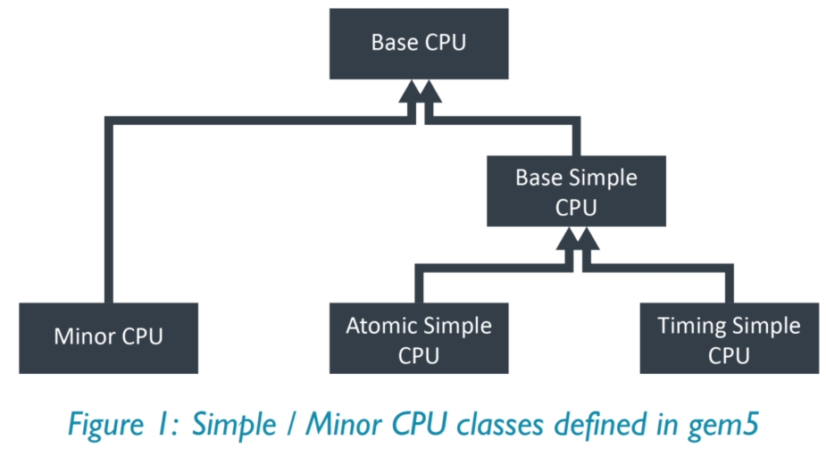

#### Memory Access

CPU models depend on memory access and there are three types of access supported in gem5, namely timing, atomic and functional methods.

CPU 模型依赖于内存访问，gem5 支持三种类型的访问，即时序方法、原子方法和函数方法。

- <font color=green>Atomic access</font> is the fastest of the three, and completes a transaction in a single function call. The function sendAtomic () is used for the atomic requests, and the requests complete before sendAtomic() returns. It models state changes (cache fills, coherence) and calculates the approximate latency without contention or queuing delay, making it suitable for loosely-timed simulation (fast-forwarding) or warming caches.
- 原子访问是三者中最快的，并且在单个函数调用中完成一个事务。 函数 sendAtomic() 用于原子请求，请求在 sendAtomic() 返回之前完成。 它对状态变化（缓存填充、一致性）进行建模，并在没有争用或排队延迟的情况下计算近似延迟，使其适用于松散定时模拟（快进）或预热缓存。
- <font color=green>Functional access</font> is similar to Atomic access in that it completes a transaction in a single function call and the access happens instantaneously. Additionally, functional accesses can coexist in the memory system with Atomic or Timing accesses [14]. Therefore, functional accesses are suitable for loading binaries and debugging.
- 功能访问类似于原子访问，因为它在单个函数调用中完成一个事务，并且访问是即时发生的。 此外，功能访问可以与原子访问或定时访问共存于内存系统中 [14]。 因此，函数访问适用于加载二进制文件和调试。
- <font color=green>Timing access</font> is the most realistic access method and is used for approximately-timed simulation, which considers the realistic timing, and models the queuing delay and resource contention [14]. Timing and Atomic accesses cannot coexist in the system.
- 定时访问是最现实的访问方式，用于近似定时模拟，它考虑了现实的定时，对排队延迟和资源争用进行建模[14]。 定时访问和原子访问不能在系统中共存。

#### Implementation of the gem5 In-order CPU Models

Based on the above memory access models, let us introduce a few in-order CPU models in gem5.

基于以上的内存访问模型，我们来介绍一下gem5中几个有序的CPU模型。

##### AtomicSimpleCPU

As shown in Fig 2, the AtomicSimpleCPU uses Atomic memory accesses. In gem5, the AtomicSimpleCPU performs all operations for an instruction on every CPU tick() and it can get a rough estimation of overall cache access time using the latency estimates from the atomic accesses [1]. Naturally, AtomicSimpleCPU provides the fastest functional simulation, and is used for fast-forwarding to get to a Region Of Interest (ROI) in gem5.

如图 2 所示，AtomicSimpleCPU 使用原子内存访问。 在 gem5 中，AtomicSimpleCPU 在每个 CPU 的 tick() 上执行一条指令的所有操作，它可以使用原子访问的延迟估计来粗略估计整个缓存访问时间 [1]。 自然地，AtomicSimpleCPU 提供了最快的功能模拟，并用于快速转发到 gem5 中的感兴趣区域 (ROI)。

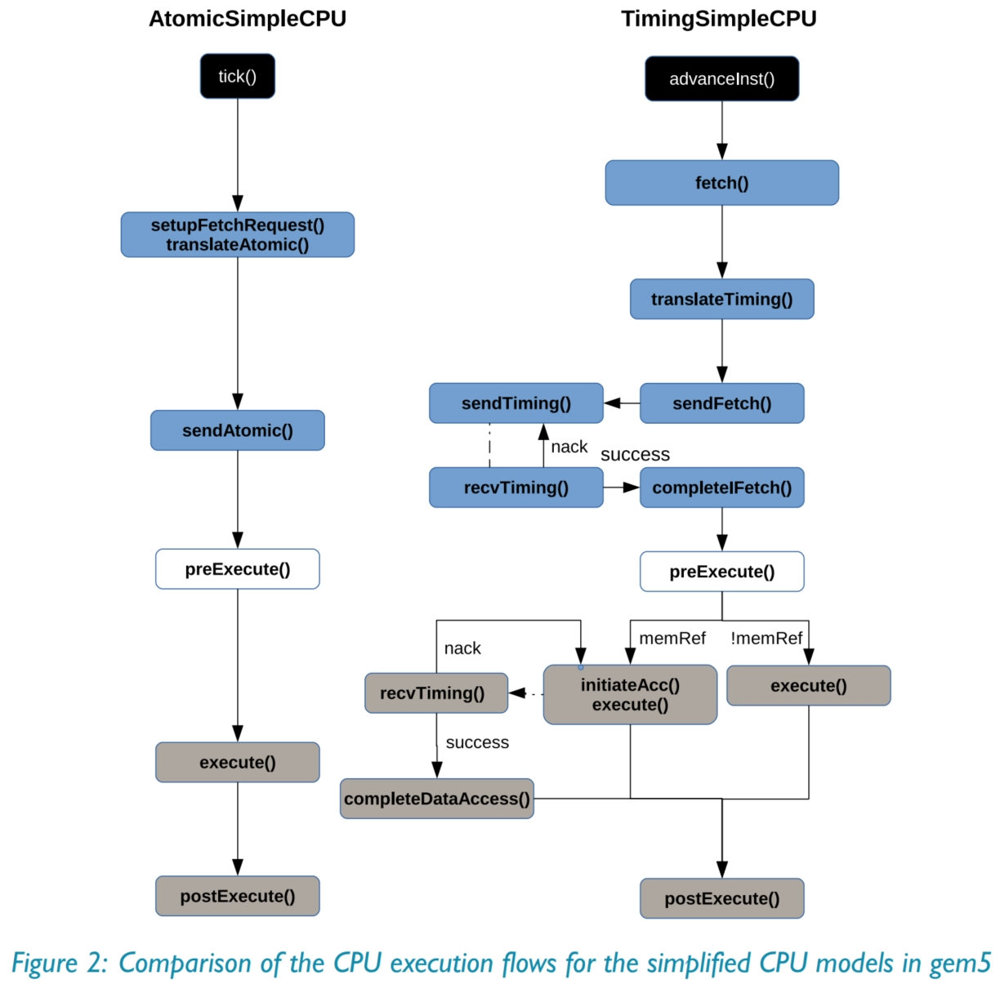

##### TimingSimpleCPU

The TimingSimpleCPU adopted Timing memory access instead of the simple Atomic one. This means that it waits until memory access returns before proceeding, therefore it provides some level of timing. TimingSimpleCPU is also a fast-to-run model, since it simplifies some aspects including pipelining, which means that only a single instruction is being processed at any time. Each arithmetic instruction is executed by TimingSimpleCPU in a single cycle, while memory accesses require multiple cycles [8, 3]. For instance, as shown in Fig 2, the TimingSimpleCPU calls sendTiming() and will only complete fetch after getting a successful return from recvTiming().

TimingSimpleCPU 采用了 Timing 内存访问，而不是简单的 Atomic 访问。 这意味着它在继续之前等待内存访问返回，因此它提供了一定程度的计时。 TimingSimpleCPU 也是一种快速运行模型，因为它简化了包括流水线在内的某些方面，这意味着在任何时候都只处理一条指令。 每条算术指令由 TimingSimpleCPU 在一个周期内执行，而内存访问需要多个周期 [8, 3]。 例如，如图 2 所示，TimingSimpleCPU 调用 sendTiming() 并且只有在从 recvTiming() 成功返回后才会完成 fetch。

##### MinorCPU

We need a more comprehensive and detailed CPU model in order to emulate realistic systems, therefore we should utilize the detailed in-order CPU models available in gem5. In older versions of gem5, a model named InOrder CPU was capable of doing the job for us, but now there is a new model called MinorCPU.

我们需要一个更全面、更详细的 CPU 模型来模拟现实系统，因此我们应该利用 gem5 中可用的详细有序 CPU 模型。 在旧版本的 gem5 中，一个名为 InOrder CPU 的模型能够为我们完成这项工作，但现在有一个名为 MinorCPU 的新模型。

The MinorCPU is a flexible in-order processor model which was originally developed to support the Arm ISA, and is applicable to other ISAs as well. As shown in Fig 3, MinorCPU has a fixed four-stage in-order execution pipeline, while having configurable data structures and execute behavior; therefore it can be configured at the micro-architecture level to model a specific processor.

MinorCPU 是一种灵活的有序处理器模型，最初是为了支持 Arm ISA 而开发的，也适用于其他 ISA。 如图3所示，MinorCPU具有固定的四级有序执行流水线，同时具有可配置的数据结构和执行行为； 因此，它可以在微架构级别进行配置，以对特定处理器进行建模。

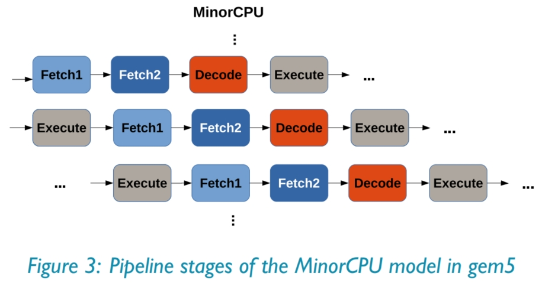

The four-stage pipeline implemented by MinorCPU includes fetching lines, decomposition into macro-ops, decomposition of macro-ops into micro-ops and execute. These stages are named Fetch1, Fetch2, Decode and Execute, respectively. The pipeline class controls the cyclic tick event and the idling (cycle skipping) [15]. We briefly introduce these pipeline stages.

MinorCPU 实现的四阶段流水线包括取cache行数据、分解为宏操作、将宏操作分解为微操作和执行。 这些阶段分别命名为 Fetch1、Fetch2、Decode 和 Execute。 pipeline类控制循环滴答事件和空闲（循环跳过）[15]。 我们简要介绍这些流水线阶段。

- <font color=green>Fetch1</font>: two pipeline stages are used for instruction fetch (and two cycles for access to the data cache) in order to give us time to convert a virtual address to a physical one, check for a hit in the cache, read the data back and do operations like branch prediction. If these all had to be done in a single cycle, rather than two, the maximum frequency of the processor would be much slower. Fetch1 fetches cache lines or partial cache lines from the ICache, and handles the stages of translating the address of a line fetch (via the TLB). Fetch1 then passes the fetched lines to Fetch2, and the latter will decompose them to instructions. Some configurations related to the Fetch1 stage are listed in Table 1 for the HPI core, which uses a similar pipeline. For example, the parameter fetch1LineSnapWidth sets the data snap size, which controls the size to be fetched from the ICache. fetch1LineWidth controls the fetch size of subsequent lines. Some other parameters sets the delays. For instance, fetch1ToFetch2BackwardDelay models the delay caused by branch predictions from Fetch2 to Fetch1.
- Fetch1：两个流水线阶段用于指令获取（以及两个用于访问数据缓存的周期），以便我们有时间将虚拟地址转换为物理地址，检查缓存中的命中，读回数据并进行分支预测等操作。如果这些都必须在一个周期内完成，而不是两个，那么处理器的最大频率会慢得多。 Fetch1 从 ICache 中获取缓存行或部分缓存行，并处理转换行获取地址的阶段（通过 TLB）。 Fetch1 然后将获取的行传递给 Fetch2，后者将它们分解为指令。表 1 中为 HPI 内核列出了与 Fetch1 阶段相关的一些配置，该内核使用类似的流水线。例如，参数 fetch1LineSnapWidth 设置数据快照大小，它控制从 ICache 获取的大小。 fetch1LineWidth 控制后续行的提取大小。其他一些参数设置延迟。例如，fetch1ToFetch2BackwardDelay 对由从 Fetch2 到 Fetch1 的分支预测引起的延迟进行建模。
- <font color=green>Fetch2</font>: firstly, puts the line from Fetch1 into the input buffer and divides the data in the buffer into individual instructions. These instructions are then packed into a vector of instructions and passed on to Decode stage. If any fault is found in the input line or a decomposed instruction, packing instructions can be aborted early. As shown in Table 1, the parameter decodeInputWidth sets the number of instructions, which can be packed into the output of Fetch2 stage per cycle. The parameter fetch2CycleInput controls whether Fetch2 can take more than one entry from the input buffer per cycle.
&nbsp;
  The branch predictor is included in the Fetch2 stage, which predicts branches for all the control instructions. The predicted branch instruction is then packed into the Fetch2’s output vector, the prediction sequence number is incremented, and the branch is communicated to Fetch1 [15]. Branches (and corresponding instructions) processed by Execute will generate branch outcome data, which is sent forward to Fetch1 and Fetch2. Fetch1 and Fetch2 will uses it for corresponding updates. In gem5, a two-level branch predictor can be implemented by inheriting the tournamentBP base class, with the parameters listed in Table 2. These parameters characterize the local and global predictor, including the number of counters, number of bits of those counters, the history table size, etc. The local and global predictors use their own history tables to index into their table of counters. A choice predictor chooses between the two. The global history register is speculatively updated, the rest are updated upon branches committing or misspeculating.
- Fetch2：首先，将Fetch1的行放入输入缓冲区，并将缓冲区中的数据分成单独的指令。 然后将这些指令打包成指令向量并传递到解码阶段。 如果在输入行或分解指令中发现任何故障，可以提前中止打包指令。 如表 1 所示，参数 decodeInputWidth 设置指令的数量，每个周期可以打包到 Fetch2 阶段的输出中。 参数 fetch2CycleInput 控制 Fetch2 是否可以在每个周期从输入缓冲区获取多个条目。
&nbsp;
  分支预测器包含在 Fetch2 阶段，它预测所有控制指令的分支。然后将预测的分支指令打包到 Fetch2 的输出向量中，增加预测序列号，并将分支传送到 Fetch1 [15]。 Execute 处理的分支（和相应指令）将生成分支结果数据，该数据被转发到 Fetch1 和 Fetch2。 Fetch1 和 Fetch2 将使用它进行相应的更新。在 gem5 中，可以通过继承tournamentBP 基类来实现两级分支预测器，其参数如表 2 所示。这些参数表征局部和全局预测器，包括计数器的数量、这些计数器的位数、历史表大小等。本地和全局预测器使用他们自己的历史表来索引到他们的计数器表中。选择预测器在两者之​​间进行选择。全局历史寄存器被推测更新，其余的在分支提交或错误推测时更新。
- <font color=green>Decode</font>: decomposes the instructions from Fetch2 into micro-ops and outputs them as an instruction vector for the execute stage. By setting the corresponding parameters executeInputWidth and decodeCycleInput, as shown in Table 1, we can set the number of instructions packed into the output per cycle, and whether to take more then one entry in the input buffer per cycle [15].
- 解码：将来自 Fetch2 的指令分解为微操作，并将它们作为指令向量输出到执行阶段。 通过设置相应的参数executeInputWidth和decodeCycleInput，如表1所示，我们可以设置每个周期打包到输出中的指令数量，以及每个周期是否在输入缓冲区中取多于一个条目[15]。
- <font color=green>Execute</font>: takes a vector of instructions from the Decode stage and provides the instruction execution and memory access functionalities. The Execute stage for an instruction can take multiple cycles and its precise timing can be modeled by a functional unit pipeline FIFO. Similarly, by setting the corresponding parameters executeInputWidth and executeCycleInput, as shown in Table 1, we can set the number of instructions in the input vector, and whether or not to examine more than one instruction vector. Additionally, executeInputBufferSize decides the depth of the input buffer. The Execute stage includes the Functional Units (FU), which model the computational core of the CPU. By configuring the executeFuncUnits, as shown in Table 3, we can define functional units associated with our core. Each functional unit models a number of instruction classes, the delay between instruction issues, and the delay from instruction issue to commit [15]. Since Execute utilizes a Load Store Queue (LSQ) for memory reference instructions, there are some parameters that configure LSQ, as shown in Table 1.
- 执行：从解码阶段获取指令向量，并提供指令执行和内存访问功能。指令的执行阶段可能需要多个周期，其精确时序可由功能单元流水线 FIFO 建模。同样，通过设置相应的参数executeInputWidth和executeCycleInput，如表1所示，我们可以设置输入向量中的指令数，以及是否检查多个指令向量。此外，executeInputBufferSize 决定输入缓冲区的深度。执行阶段包括功能单元 (FU)，它为 CPU 的计算核心建模。通过配置 executeFuncUnits，如表 3 所示，我们可以定义与我们的核心相关联的功能单元。每个功能单元对许多指令类、指令发布之间的延迟以及从指令发布到提交的延迟进行建模 [15]。由于 Execute 使用 Load Store Queue (LSQ) 进行内存引用指令，因此有一些参数可以配置 LSQ，如表 1 所示。

### High-Performance In-order (HPI) CPU

By introducing the basic CPU models in gem5, especially MinorCPU, we have paved our way to build a High-Performance In-order CPU based on the Arm architecture, and we name it HPI. The HPI CPU timing model is tuned to be representative of a modern in-order Armv8-A implementation. In Fig 4, we portrayed the major components included in our model. We introduce each of these components more in detail.

通过介绍gem5中基本的CPU模型，尤其是MinorCPU，我们为构建一个基于Arm架构的High-Performance In-order CPU铺平了道路，我们将其命名为HPI。 HPI CPU 时序模型已调整为代表现代有序 Armv8-A 实现。 在图 4 中，我们描绘了模型中包含的主要组件。 我们更详细地介绍了这些组件中的每一个。

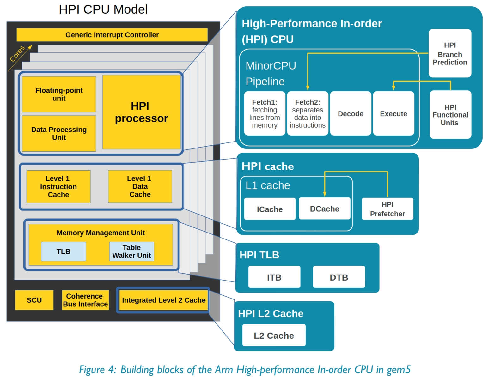

#### Processor Pipeline

The pipeline of our HPI CPU uses the same four-stage model as the MinorCPU described in Section “MinorCPU”. Specifically, the parameters of our HPI CPU can be found in Table 1, and the parameters for the HPI CPU branch predictor are listed in Table 2.

我们的 HPI CPU 的流水线使用与“MinorCPU”部分中描述的 MinorCPU 相同的四阶段模型。 具体来说，我们的HPI CPU的参数可以在表1中找到，HPI CPU分支预测器的参数在表2中列出。

#### Interrupt Controller

In the Arm architecture, a Generic Interrupt Controller (GIC) supports routing of software generated, private and shared peripheral interrupts between cores in a multi-core system. The GIC enables software to mask, enable and disable interrupts from individual sources, to prioritize (in hardware) individual sources and to generate software interrupts.

在 Arm 架构中，通用中断控制器 (GIC) 支持在多核系统中的内核之间路由软件生成的、私有的和共享的外设中断。 GIC 使软件能够屏蔽、启用和禁用来自各个源的中断，对（在硬件中）各个源进行优先级排序并生成软件中断。

Interrupts are identified in the software by a number, called an interrupt ID. An interrupt ID uniquely corresponds to an interrupt source. Software can use the interrupt ID to identify the source of interrupt and to invoke the corresponding handler to service the interrupt.

中断在软件中由一个数字标识，称为中断 ID。 一个中断ID唯一对应一个中断源。 软件可以使用中断 ID 来识别中断源并调用相应的处理程序来服务中断。

The interrupt controller is implemented in gem5 under the path src/arch/[ISA]/interrupts.hh. To include the interrupt controller in the system, we may use the derived CPU models of BaseCPU. The interrupt controller is initialized by BaseCPU ::createInterruptController() in the Python script src/cpu/BaseCPU.py.

中断控制器在 gem5 中的 src/arch/[ISA]/interrupts.hh 路径下实现。 为了在系统中包含中断控制器，我们可以使用BaseCPU的派生CPU模型。 中断控制器由 Python 脚本 src/cpu/BaseCPU.py 中的 BaseCPU ::createInterruptController() 初始化。

#### Floating-Point Unit and Data Processing Unit

The Data Processing Unit (DPU) shown in Fig 4 holds most of the program-visible state of the processor, such as generalpurpose registers and system registers. It provides configuration and control of the memory system and its associated functionality, and decodes and executes instructions.

图 4 所示的数据处理单元 (DPU) 保存着处理器的大部分程序可见状态，例如通用寄存器和系统寄存器。 它提供对存储系统及其相关功能的配置和控制，并对指令进行解码和执行。

The Floating-Point Unit (FPU) includes the floating-point register file and status registers. It performs floating-point operations on the data held in the floating-point register file.

浮点单元 (FPU) 包括浮点寄存器文件和状态寄存器。 它对保存在浮点寄存器文件中的数据执行浮点运算。

The DPU and FPU can be modeled by the Functional Units (FU) in the Execute stage of the MinorCPU pipeline (Section “MinorCPU”). Specifically, we can model them by configuring the executeFuncUnits, as shown in Table 3.

DPU 和 FPU 可以由功能单元 (FU) 在 MinorCPU 流水线的执行阶段（“MinorCPU”部分）建模。 具体来说，我们可以通过配置 executeFuncUnits 对它们进行建模，如表 3 所示。

#### Level 1 Caches

In the architecture used by our HPI core, we have separate instruction and data buses, hence an instruction cache (ICache) and a data cache (DCache). So, there are distinct instruction and data L1 caches backed by a unified L2 cache.

在我们的 HPI 内核使用的架构中，我们有单独的指令和数据总线，因此有一个指令缓存 (ICache) 和一个数据缓存 (DCache)。 因此，统一的 L2 缓存支持不同的指令和数据 L1 缓存。

Typically, the instruction and data caches are configured independently during implementation, to sizes of 8KB, 16KB, 32KB, or 64KB. In our case, the L1 instruction and data memory system has the key features listed in Table 4. For instance, we characterize the delay by hit latency and response latency. We also specify the number of Miss Status Holding Registers (MSHR). Additionally, we override the associativity and size of the L1 caches.

通常，指令和数据缓存在实现过程中是独立配置的，大小为 8KB、16KB、32KB 或 64KB。 在我们的例子中，L1 指令和数据存储器系统具有表 4 中列出的关键特性。例如，我们通过命中延迟和响应延迟来表征延迟。 我们还指定了未命中状态保持寄存器 (MSHR) 的数量。 此外，我们覆盖(重载)了 L1 缓存的关联性和大小。

Our data cache implements an automatic prefetcher that monitors cache misses in the core. When a data access pattern is detected, the automatic prefetcher starts linefills in the background. The prefetcher recognizes a sequence of data cache misses at a fixed stride pattern that lies in four cache lines, plus or minus. Any intervening stores or loads that hit in the data cache do not interfere with the recognition of the cache miss pattern. Our configurations for the prefetcher is listed in Table 5.

我们的数据缓存实现了一个自动预取器，用于监控内核中的缓存未命中。 当检测到数据访问模式时，自动预取器会在后台启动换行。 预取器以固定步长模式识别一系列数据缓存未命中，该模式位于四个缓存行中，正负。 命中数据缓存的任何中间存储或加载都不会干扰缓存未命中模式的识别。 我们的预取器配置列在表 5 中。

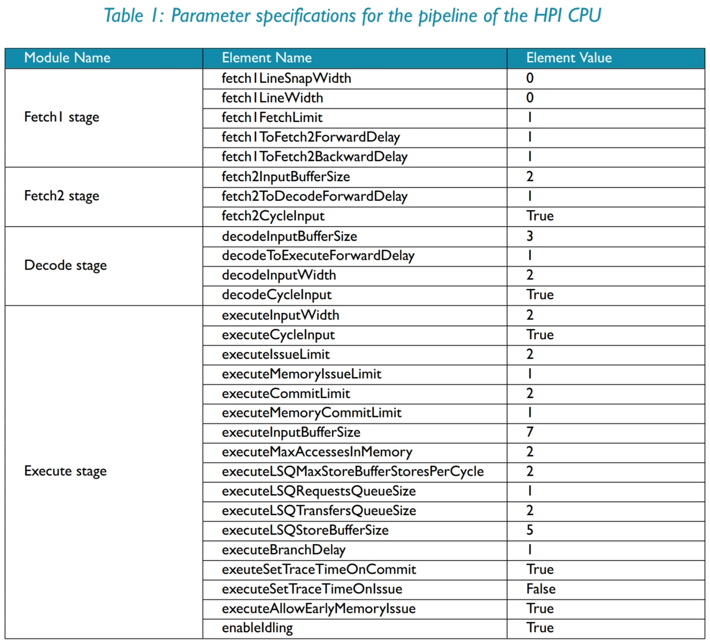

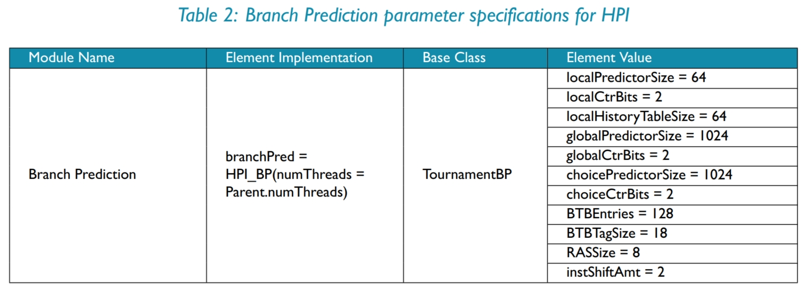

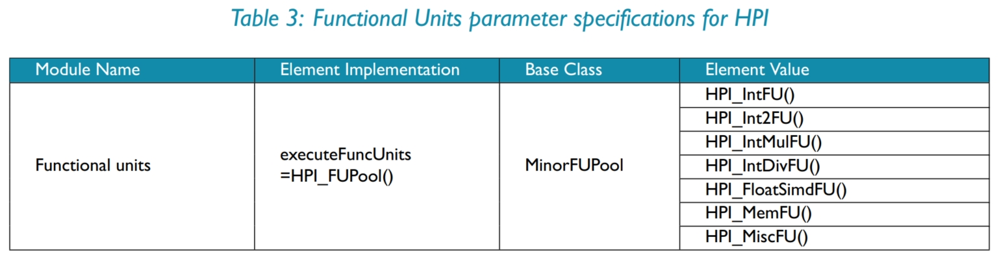

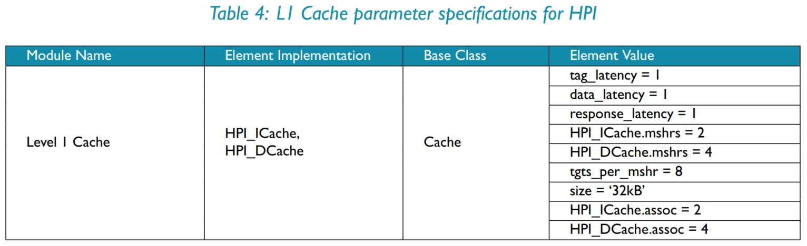

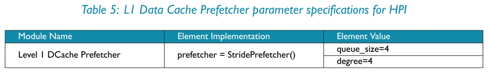

#### Memory Management Unit

An important function of the Memory Management Unit (MMU) in Fig 4 is to enable the system to run multiple tasks as independent programs running in their own private virtual memory space. They do not need any knowledge of the physical memory map of the system, that is, the addresses that are actually used by the hardware, or about other programs that might execute at the same time.

图 4 中的内存管理单元 (MMU) 的一个重要功能是使系统能够将多个任务作为在自己的私有虚拟内存空间中运行的独立程序运行。 他们不需要了解系统的物理内存映射，即硬件实际使用的地址，或者可能同时执行的其他程序。

The Translation Lookaside Buffer (TLB) is a cache of recently accessed page translations in the MMU. For each memory access performed by the processor, the MMU checks whether the translation is cached in the TLB. If the requested address translation causes a hit within the TLB, the translation of the address will be immediately available. Each TLB entry typically contains not just physical and virtual addresses, but also attributes such as memory type, cache policies, access permissions, the Address Space ID (ASID), and the Virtual Machine ID (VMID). If the TLB does not contain a valid translation for the virtual address issued by the processor, known as a TLB miss, an external translation Table Walk or lookup is performed. Dedicated hardware within the MMU enables it to read the translation tables in memory. The newly-loaded translation can then be cached in the TLB for possible reuse if the translation table walk does not result in a page fault. The exact structure of the TLB differs between implementations of the Arm processors. In our HPI core model, we used the ArmTLB base model in gem5, and used the parameters listed in Table 6 for our data and instruction TLBs.

转换后备缓冲区 (TLB) 是 MMU 中最近访问的页面转换的缓存。对于处理器执行的每次内存访问，MMU 检查翻译是否缓存在 TLB 中。如果请求的地址转换导致 TLB 内的命中，则地址的转换将立即可用。每个 TLB 条目通常不仅包含物理和虚拟地址，还包含诸如内存类型、缓存策略、访问权限、地址空间 ID (ASID) 和虚拟机 ID (VMID) 等属性。如果 TLB 不包含处理器发出的虚拟地址的有效转换（称为 TLB 未命中），则执行外部转换表遍历或查找。 MMU 内的专用硬件使其能够读取内存中的转换表。如果转换表遍历不会导致页面错误，则新加载的转换可以缓存在 TLB 中以供可能的重用。 TLB 的确切结构因 Arm 处理器的实现而异。在我们的 HPI 核心模型中，我们使用了 gem5 中的 ArmTLB 基础模型，并为我们的数据和指令 TLB 使用了表 6 中列出的参数。

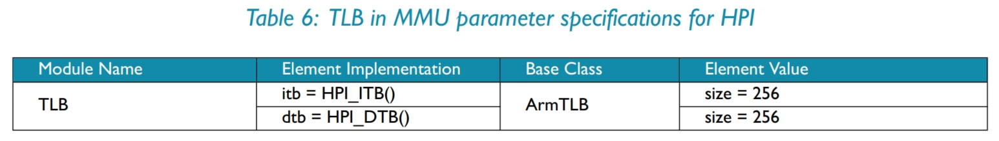

#### Level 2 memory system

The level 2 memory system consists of the Snoop Control Unit (SCU), the Coherence Bus Interface and the level 2 cache.

2 级内存系统由监听控制单元 (SCU)、Coherence 总线接口和 2 级缓存组成。

- <font color=green>Snoop Control Unit</font>: the SCU maintains coherency between the individual data caches in the processor, and it contains buffers that can handle direct cache-to-cache transfers between cores without having to read or write any data to the external memory system. Cache line migration enables dirty cache lines to be moved between cores, and there is no requirement to write back transferred cache line data to the external memory system. Each core has tag and dirty RAMs that contain the state of the cache line. Rather than sending a snoop request to each core, the SCU contains a set of duplicate tags that allow it to check the contents of each L1 data cache.
- Snoop 控制单元：SCU 维护处理器中各个数据缓存之间的一致性，它包含的缓冲区可以处理内核之间的直接缓存到缓存传输，而无需向外部存储器系统读取或写入任何数据。 缓存线迁移使脏缓存线可以在内核之间移动，并且不需要将传输的缓存线数据写回外部存储系统。 每个内核都有包含缓存行状态的标记 RAM 和脏 RAM。 SCU 不是向每个内核发送监听请求，而是包含一组重复标签，允许它检查每个 L1 数据缓存的内容。
- <font color=green>Level 2 Cache</font>: data is allocated to the L2 cache only when evicted from the L1 memory system. The only exceptions to this rule are for memory marked with the inner transient hint, or for non-temporal loads, that are only ever allocated to the L2 cache. The L2 cache is 16-way set associative. The L2 cache tags are looked up in parallel with the SCU duplicate tags. If both the L2 tag and SCU duplicate tag hit, a read accesses the L2 cache in preference to snooping one of the other cores. In our Python code for the HPI core model, the parameter specifications for the L2 cache are listed in Table 7. The delays are characterized by hit latency and response latency. We also specify the number of MSHRs and override the associativity and size of the L2 caches.
- 2 级缓存：数据仅在从 L1 内存系统驱逐时才分配到 L2 缓存。 此规则的唯一例外是标记有内部瞬态提示的内存或非临时加载，它们只分配给 L2 缓存。 L2 缓存是 16 路组关联的。 L2 缓存标签与 SCU 重复标签并行查找。 如果 L2 标签和 SCU 重复标签命中，读取访问 L2 缓存优先于窥探其他内核之一。 在我们用于 HPI 核心模型的 Python 代码中，L2 缓存的参数规格列于表 7 中。延迟的特征在于命中延迟和响应延迟。 我们还指定了 MSHR 的数量并覆盖 L2 缓存的关联性和大小。

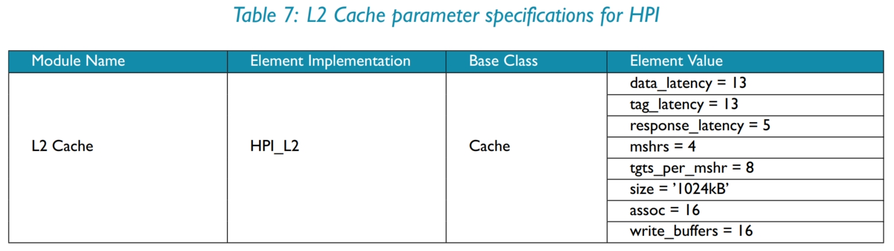

#### Python Configuration Script for the HPI Core

In order to create our HPI model, we need to add all the configurations (including the parameter specifications mentioned above) into a Python configuration script. The source code for the HPI core model, which is named HPI.py is located at gem5/configs/common/cores/arm/.

为了创建我们的 HPI 模型，我们需要将所有配置（包括上面提到的参数规范）添加到 Python 配置脚本中。 HPI 核心模型的源代码，名为 HPI.py，位于 gem5/configs/common/cores/arm/。

### System Modeling in the SE Mode

We introduced the configuration parameters for the HPI core. The MinorCPU models uses the parameters specified in the gem5/configs/example/arm/devices.py script, such as devices.L1I, devices.L1D, devices.WalkCache and devices.L2. In order to build a system in the gem5 SE mode, we need to set up the cache, memory and other modules which are associated with the CPU models, and properly connect them.

我们介绍了 HPI 内核的配置参数。 MinorCPU 模型使用 gem5/configs/example/arm/devices.py 脚本中指定的参数，例如 devices.L1I、devices.L1D、devices.WalkCache 和 devices.L2。 为了在gem5 SE模式下构建系统，我们需要设置与CPU型号相关的缓存，内存等模块，并正确连接它们。

In our starter_se.py simulation script, located in the gem5/configs/example/arm directory, we provide three different CPU types, namely AtomicSimpleCPU, MinorCPU and the HPI CPU:

在我们的 starter_se.py 模拟脚本中，位于 gem5/configs/example/arm 目录中，我们提供了三种不同的 CPU 类型，分别是 AtomicSimpleCPU、MinorCPU 和 HPI CPU：

```python
cpu_types = {
	"atomic" : ( AtomicSimpleCPU, None, None, None, None),
	"minor" : (MinorCPU,
			   devices.L1I, devices.L1D,
			   devices.WalkCache,
			   devices.L2),
	"hpi" : ( HPI.HPI,
			  HPI.HPI_ICache, HPI.HPI_DCache,
			  HPI.HPI_WalkCache,
			  HPI.HPI_L2)
}
```

Since gem5 does not simulate caches for the Atomic models, the cache-related options for the AtomicSimpleCPU are set to None.

由于 gem5 不模拟 Atomic 模型的缓存，因此 AtomicSimpleCPU 的缓存相关选项设置为 None。

We also add several arguments to the parser. When using the simulation script, you can use the command line arguments below to change the default values:

我们还向解析器添加了几个参数。 使用模拟脚本时，您可以使用下面的命令行参数来更改默认值：

```python
def addOptions(parser):
	parser.add_argument("commands_to_run", metavar="command(s)", nargs='*',
						help="Command(s) to run")
	parser.add_argument("--cpu", type=str, choices=cpu_types.keys(),
						default="atomic",
						help="CPU model to use")
	parser.add_argument("--cpu-freq", type=str, default="4GHz")
	parser.add_argument("--num-cores", type=int, default=1,
						help="Number of CPU cores")
	parser.add_argument("--mem-type", default="DDR3_1600_8x8",
						choices=MemConfig.mem_names(),
						help = "type of memory to use")
	parser.add_argument("--mem-channels", type=int, default=2,
						help = "number of memory channels")
	parser.add_argument("--mem-ranks", type=int, default=None,
						help = "number of memory ranks per channel")
	parser.add_argument("--mem-size", action="store", type=str,
						default="2GB",
						help="Specify the physical memory size")
return parser
```

#### Simulating the HPI Model in the SE mode

Considering that you have built the gem5 binaries for Arm using the command introduced in Section “Building gem5 binaries for Arm”, we can test-run our HPI model in the SE mode by running the command below, like before. We configure the CPU model using --cpu (hpi in this case) and the number of cores by setting the --num-cores argument.

考虑到您已经使用“为 Arm 构建 gem5 二进制文件”一节中介绍的命令为 Arm 构建了 gem5 二进制文件，我们可以像以前一样通过运行以下命令在 SE 模式下测试运行我们的 HPI 模型。 我们使用--cpu（本例中为hpi）配置CPU 模型，并通过设置--num-cores 参数来配置内核数。

```shell
./build/ARM/gem5.opt configs/example/arm/starter_se.py --cpu="hpi" --num-cores=1 \
"tests/test-progs/hello/bin/arm/linux/hello"
```

Like before, we will see the “Hello world!” output in the console.

像以前一样，我们将看到“Hello world!” 控制台中的输出。

#### System Structure for Different CPU Models

After running an SE simulation, the system structure diagram can be found in run_scripts/m5out/config.dot.svg (unless one specifies a different output directory). Using such diagrams, we show the differences between the three CPU types used for the SE simulation.

运行 SE 模拟后，可以在 run_scripts/m5out/config.dot.svg 中找到系统结构图（除非指定不同的输出目录）。 使用这些图表，我们展示了用于 SE 模拟的三种 CPU 类型之间的差异。

- <font color=green>AtomicSimpleCPU</font>: the system structure for the Atomic model in the gem5 SE simulation mode is depicted in Fig. 5, from which we can see that the simplified atomic memory accesses is used, and caches are ignored.
- <font color=green>AtomicSimpleCPU</font>：gem5 SE仿真模式下Atomic模型的系统结构如图5所示，从中可以看出使用了简化的原子内存访问，忽略了缓存。
- <font color=green>MinorCPU</font>: the system structure for the MinorCPU model in the SE mode is depicted in Fig. 6. In addition to the modules in the Atomic model, this system uses walk caches as well as L1 and L2 caches.
- MinorCPU：SE 模式下MinorCPU 模型的系统结构如图6 所示。除了Atomic 模型中的模块外，该系统还使用walk 缓存以及L1 和L2 缓存。
- HPI: the system structure for the HPI model in Fig. 7 is quite similar to the MinorCPU in the SE mode, although the parameter values are different.
- HPI：图7中HPI模型的系统结构与SE模式下的MinorCPU非常相似，尽管参数值不同。

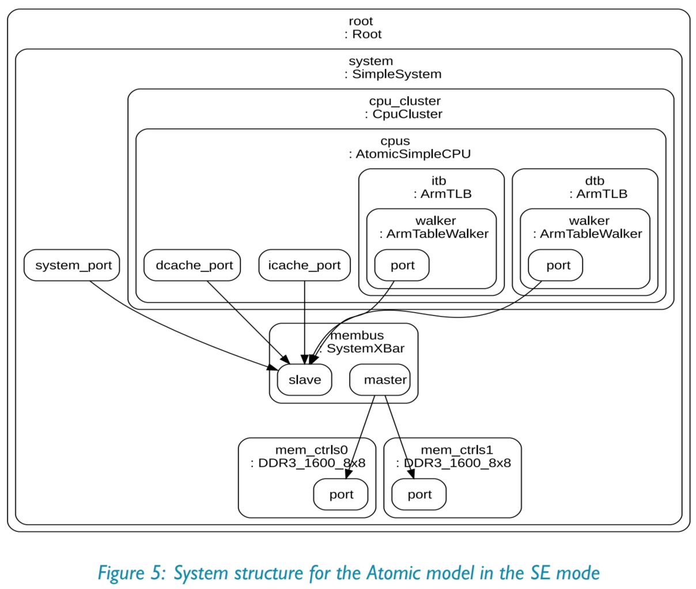

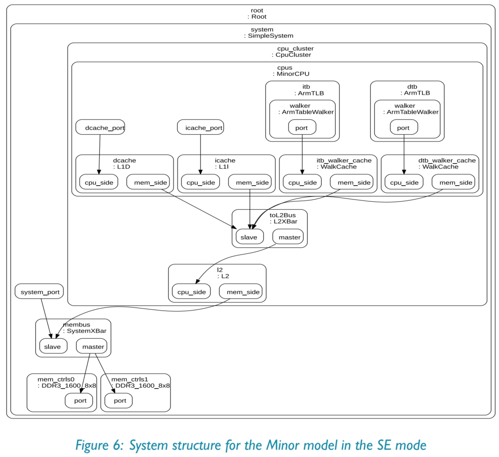

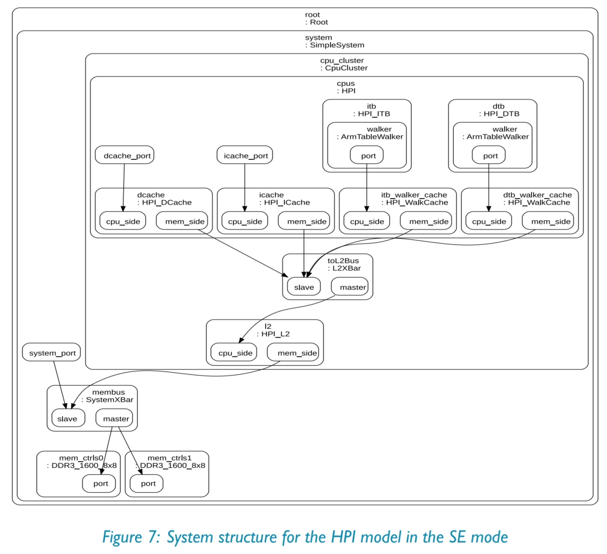

### System Modeling in the FS Mode

In the FS simulation, we can run unmodified OS binaries, simulate all devices and get more realistic results. We need a disk image, containing all the bytes and structure of a storage device, just as you would find on a real hardware device. Also, since gem5 skips the bootloader part of the boot and loads the kernel directly into the simulated memory, we can provide the kernel separately, without having to modify the disk image.

在 FS 模拟中，我们可以运行未修改的 OS 二进制文件，模拟所有设备并获得更逼真的结果。 我们需要一个磁盘映像，包含存储设备的所有字节和结构，就像您在真实硬件设备上看到的那样。 另外，由于gem5跳过了boot的bootloader部分，直接将内核加载到模拟内存中，我们可以单独提供内核，而无需修改磁盘映像。

In our starter_fs.py simulation script located in the gem5/configs/example/arm directory, we provide the following information. As described in Section “Full System (FS) Mode”, we first need to let gem5 know the location of our disk image and kernel binary (taken relative to ${M5_PATH}/disks and ${M5_PATH}/binaries respectively):

在位于 gem5/configs/example/arm 目录下的 starter_fs.py 模拟脚本中，我们提供以下信息。 如“完整系统 (FS) 模式”一节所述，我们首先需要让 gem5 知道我们的磁盘映像和内核二进制文件的位置（分别相对于 ${M5_PATH}/disks 和 ${M5_PATH}/binaries）：

```shell
default_kernel = 'vmlinux.arm64'
default_disk = 'linaro-minimal-aarch64.img'
```

We provide additional options to specify the disk image and kernel binary. Also, a runscript can be specified by using the --script option. Runscripts are bash scripts that are automatically executed after Linux boots.

我们提供了额外的选项来指定磁盘映像和内核二进制文件。 此外，可以使用 --script 选项指定运行脚本。 Runscripts 是在 Linux 启动后自动执行的 bash 脚本。

```python
def addOptions(parser):
	parser.add_argument("--dtb", type=str, default=None,
						help="DTB file to load")
	parser.add_argument("--kernel", type=str, default=default_kernel,
						help="Linux kernel")
	parser.add_argument("--disk-image", type=str,
						default=default_disk,
						help="Disk to instantiate")
	parser.add_argument("--script", type=str, default="",
						help = "Linux bootscript")
```

#### Simulating the HPI Model in the FS mode

If you have already built the gem5 binaries for Arm, downloaded the disk image, and set the M5_PATH variable, as described in “Full System (FS) Mode”, then you are ready to test-run the HPI model in the FS mode (you do not have to specify the disk image, as we are using the default one):

如果您已经为 Arm 构建了 gem5 二进制文件，下载了磁盘映像，并设置了 M5_PATH 变量，如“完整系统（FS）模式”中所述，那么您就可以在 FS 模式下测试运行 HPI 模型（ 您不必指定磁盘映像，因为我们使用的是默认映像）：

```shell
./build/ARM/gem5.opt configs/example/arm/starter_fs.py --cpu="hpi" --num-cores=1 --disk-image=$M5_PATH/disks/linaro-minimal-aarch64.img
```

We can then interact with the simulated system using telnet localhost 3456. You can also check the m5out/system. terminal to see the details of the booting process.

然后我们可以使用 telnet localhost 3456 与模拟系统交互。您还可以检查 m5out/system。 terminal以查看启动过程的详细信息。

#### System Structure for the HPI Model

As shown in Fig 8, the system structure for the HPI model in the FS mode contains additional details and components required to model the entire system.

如图 8 所示，FS 模式下 HPI 模型的系统结构包含对整个系统建模所需的附加细节和组件。

### Summary

In this chapter, we briefly introduced the in-order CPU models and different memory access types in gem5. We described the pipeline stages of the MinorCPU model, and then introduced our HPI CPU model and its major components. The HPI CPU timing model is tuned to be representative of a modern in-order Armv8-A implementation.

在本章中，我们简要介绍了 gem5 中的有序 CPU 模型和不同的内存访问类型。 我们描述了 MinorCPU 模型的流水线阶段，然后介绍了我们的 HPI CPU 模型及其主要组件。 HPI CPU 时序模型已调整为代表现代有序 Armv8-A 实现。

Finally, we used our SE and FS simulation scripts, namely starter_se.py and starter_fs.py to run test examples and compare the system structures of different CPUs. In the next chapter, we will run some benchmarks on our HPI model in both simulation modes.

最后，我们使用我们的 SE 和 FS 仿真脚本，即 starter_se.py 和 starter_fs.py 来运行测试示例并比较不同 CPU 的系统结构。 在下一章中，我们将在两种仿真模式下对我们的 HPI 模型运行一些基准测试。

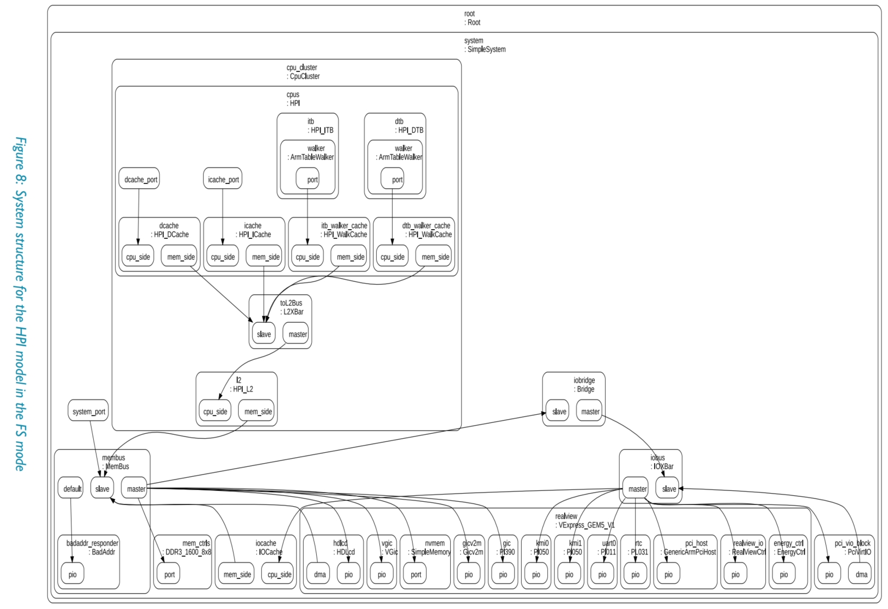

## Running Benchmarks on the HPI Model

### Introduction

Given the system model equipped with our HPI CPU, let us test out the system performance using some well-known benchmarks.

鉴于配备我们的 HPI CPU 的系统模型，让我们使用一些众所周知的基准测试系统性能。

System evaluation using gem5 has been the focus of many other related works. For example, the accuracy evaluation of gem5 simulator system is carried out in [16], the sources of error in full-system simulation using gem5 is discussed in [17] and the authors of [18] proposed a structured approach to the simulation, analysis and characterization of smartphone applications.

使用 gem5 进行系统评估一直是许多其他相关工作的重点。 例如，[16] 中进行了 gem5 模拟器系统的精度评估，[17] 中讨论了使用 gem5 进行全系统模拟的误差来源，[18] 的作者提出了一种结构化的模拟方法， 智能手机应用程序的分析和表征。

In this section, we give examples of benchmarking a single-core HPI CPU model in the gem5 SE mode. We also use the PARSEC benchmark suite on both single-core and multi-core HPI models in the gem5 FS mode, and present the results.

在本节中，我们给出了在 gem5 SE 模式下对单核 HPI CPU 模型进行基准测试的示例。 我们还在 gem5 FS 模式下的单核和多核 HPI 模型上使用 PARSEC 基准测试套件，并展示结果。

Note: it is important to mention that we have run our experiments with an older Arm disk image (aarch-system-2014-10) using the gem5 tree 109cc2caa6. You might get slightly different results with the new settings.

注意：值得一提的是，我们使用 gem5 树 109cc2caa6 对旧的 Arm 磁盘映像 (aarch-system-2014-10) 进行了实验。 使用新设置，您可能会得到略有不同的结果。

### Benchmarking in the SE Mode

We use the Stanford SingleSource workloads from the LLVM test-suite for benchmarking in the SE mode. The svn command below downloads the benchmarks to your local machine:

我们使用来自 LLVM 测试套件的 Stanford SingleSource 工作负载在 SE 模式下进行基准测试。 下面的 svn 命令将基准测试下载到您的本地机器：

```shell
svn export https://llvm.org/svn/llvm-project/test-suite/tags/RELEASE_390/final/SingleSource/Benchmarks/Stanford/ se-benchmarks
```

The source code files (.c files) can now be found in the se-benchmarks directory. Next, you need to install the Arm cross compiler toolchain:

源代码文件（.c 文件）现在可以在 se-benchmarks 目录中找到。 接下来，您需要安装 Arm 交叉编译器工具链：

```shell
sudo apt-get install gcc-aarch64-linux-gnu
```

The next step is to replace the se-benchmarks/Makefile’s content with the code below, and then run make to compile the benchmarks using the Arm cross compiler.

下一步是用下面的代码替换 se-benchmarks/Makefile 的内容，然后运行 make 使用 Arm 交叉编译器编译基准测试。

```shell
SRCS = $(wildcard *.c)
PROGS = $(patsubst %.c,%,$(SRCS))
all: $(PROGS)
%: %.c
      aarch64-linux-gnu-gcc --static $< -o $@
clean:
      rm -f $(PROGS)
```

#### Running the SE Benchmarks

Having compiled all the workloads, we can run them in the gem5 SE mode, using the command below. You need to set <benchmark> and /path_to_benchmark.

编译完所有工作负载后，我们可以使用以下命令在 gem5 SE 模式下运行它们。 您需要设置 <benchmark> 和 /path_to_benchmark。

```shell
./build/ARM/gem5.opt -d se_results/<benchmark> configs/example/arm/starter_se.py --cpu="hpi" /path_to_benchmark
```

For example, to run the Bubblesort benchmark, run the following command:

例如，要运行 Bubblesort 基准测试，请运行以下命令：

```shell
./build/ARM/gem5.opt -d se_results/Bubblesort configs/example/arm/starter_se.py --cpu="hpi" /path_to/se-benchmarks/Bubblesort
```

By doing so, the statistics will be recorded in stats.txt files in the gem5/se_results/<benchmark> directories. To compare the benchmarks, we first need to create a simple configuration file and specify a list of benchmarks to be compared, comparison parameters from their stats.txt statistics and an output file. Then, we just pass this configuration file to the read_results.sh bash script provided as part of the arm-gem5-rsk Research Starter Kit.

通过这样做，统计信息将记录在 gem5/se_results/<benchmark> 目录中的 stats.txt 文件中。 要比较基准，我们首先需要创建一个简单的配置文件并指定要比较的基准列表、来自它们的 stats.txt 统计信息和输出文件的比较参数。 然后，我们只需将此配置文件传递给作为 arm-gem5-rsk Research Starter Kit 的一部分提供的 read_results.sh bash 脚本。

An example configuration file exe_time.ini looks like this:

示例配置文件 exe_time.ini 如下所示：

```shell
[Benchmarks]
Bubblesort
IntMM
Oscar

[Parameters]
sim_seconds

[Output]
res_exe_time.txt
```

As the second step, we change the directory to se_results and run the read_results.sh bash script by passing the exe_time.ini file as a parameter:

作为第二步，我们将目录更改为 se_results 并通过将 exe_time.ini 文件作为参数传递来运行 read_results.sh bash 脚本：

```shell
cd se_results # where the results of SE runs are stored
bash ../../arm-gem5-rsk/read_results.sh exe_time.ini
cat res_exe_time.txt
```

The final result file res_exe_time.txt will look like this:

最终结果文件 res_exe_time.txt 将如下所示：

```shell
Benchmarks		sim_seconds
Bubblesort		0.092932
IntMM			0.006827
```

We compare the workloads running in the SE simulation mode in terms of the instructions/operations count, execution time and overall average cache-miss latency.

我们在指令/操作计数、执行时间和总体平均缓存未命中延迟方面比较了在 SE 模拟模式下运行的工作负载。

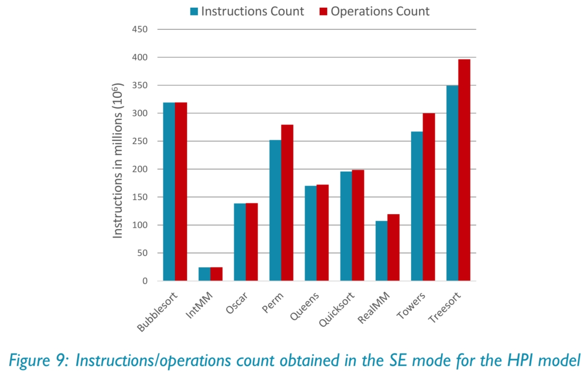

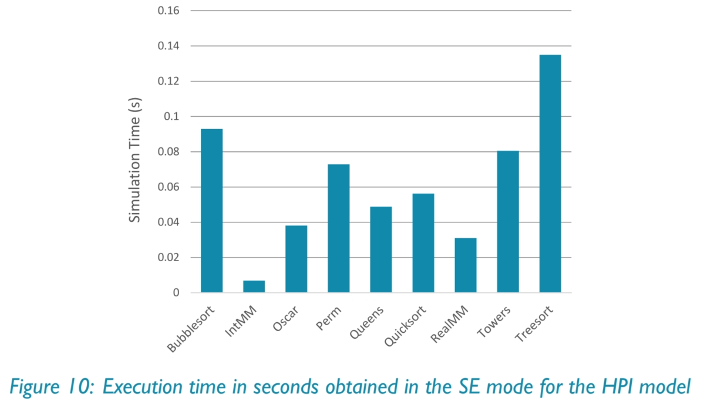

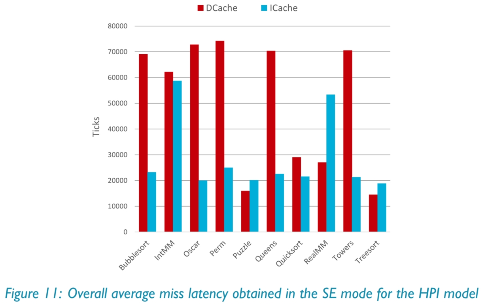

### Benchmarking in the FS Mode

In order to examine different aspects of our HPI system in the FS mode, the Princeton Application Repository for SharedMemory Computers (PARSEC) version 3.0 [19] is used. PARSEC contains multi-threaded applications covering a diverse range of domains including financial analysis, search, computer vision, animation, data mining and so on. Make sure to check the system requirements in [20].

为了在 FS 模式下检查我们的 HPI 系统的不同方面，使用了共享内存计算机的普林斯顿应用程序库 (PARSEC) 3.0 [19] 版。 PARSEC 包含多线程应用程序，涵盖各种领域，包括财务分析、搜索、计算机视觉、动画、数据挖掘等。 确保检查 [20] 中的系统要求。

#### Compiling the PARSEC Benchmarks

First, we need to download PARSEC 3.0:

首先，我们需要下载PARSEC 3.0：

```shell
$ wget http://parsec.cs.princeton.edu/download/3.0/parsec-3.0.tar.gz
$ tar -xvzf parsec-3.0.tar.gz
```

Considering that you may not have access to a local Arm machine, we describe two ways to compile PARSEC benchmarks for Arm:

考虑到您可能无法访问本地 Arm 机器，我们描述了两种为 Arm 编译 PARSEC 基准测试的方法：

- <font color=green>Cross-Compiling</font>: using a cross-compiler on an x86 machine
- <font color=green>Compiling on QEMU</font>: using QEMU to emulate an Arm machine on x86


We introduce a couple of common steps for both approaches. Then we show you how to compile your PARSEC benchmarks using either of these approaches.

我们为这两种方法介绍了几个常见步骤。 然后我们将向您展示如何使用这些方法之一编译您的 PARSEC 基准。

##### Common Steps

The distributed PARSEC package only supports the 32bit Armv7-A version of the Arm architecture, however, our HPI system focuses on the 64bit Armv8-A. Therefore, in our common steps, we have to make the following changes to PARSEC (note that all the patches are included in the parsec_patches directory of the arm-gem5-rsk):

分布式 PARSEC 包仅支持 32 位 Armv7-A 版本的 Arm 架构，但我们的 HPI 系统专注于 64 位 Armv8-A。 因此，在我们常用的步骤中，我们要对PARSEC进行如下修改（注意所有补丁都包含在arm-gem5-rsk的parsec_patches目录下）：

- Step1: from the parsec-3.0 directory, apply the static-patch.diff patch. This patch is used for generating static binaries. It also modifies the “canneal” benchmark, which does not support the AArch64 architecture by default. So, the patch adds the header file atomic.h from the FreeBSD project [21] to your PARSEC source tree.:
  ```shell
  $ patch -p1 < ../arm-gem5-rsk/parsec_patches/static-patch.diff
  ```
  &nbsp;
  Step1：从parsec-3.0目录，应用static-patch.diff补丁。 此补丁用于生成静态二进制文件。 它还修改了默认情况下不支持 AArch64 架构的“canneal”基准测试。 因此，该补丁将 FreeBSD 项目 [21] 中的头文件 atomic.h 添加到您的 PARSEC 源代码树中：
- Step2: to recognize the AArch64 architecture, replace the config.guess and config.sub files. Do not forget to set path to /parsec_dir/ and /absolute_path_to_tmp/
  ```shell
  $ mkdir tmp; cd tmp # make a tmp dir outside the parsec dir
  $ wget -O config.guess 'http://git.savannah.gnu.org/gitweb/?p=config.git;a=blob_plain;f=config.guess;hb=HEAD'
  $ wget -O config.sub 'http://git.savannah.gnu.org/gitweb/?p=config.git;a=blob_plain;f=config.sub;hb=HEAD'
  $ cd /parsec_dir/ # cd to the parsec dir
  $ find . -name "config.guess" -type f -print -execdir cp {} config.guess_old \;
  $ find . -name "config.guess" -type f -print -execdir cp /absolute_path_to_tmp/config.guess {} \;
  $ find . -name "config.sub" -type f -print -execdir cp {} config.sub_old \;
  $ find . -name "config.sub" -type f -print -execdir cp /absolute_path_to_tmp/config.sub {} \;
  ```
  &nbsp;
  Step2：识别AArch64架构，替换config.guess和config.sub文件。 不要忘记将路径设置为 /parsec_dir/ 和 /absolute_path_to_tmp/

PARSEC provides some hook functions, which are called at specific locations (beginning and end of a phase) by the benchmarks. A set of hook functions called __parsec_roi_begin() and __parsec_roi_end() are used to remove the impact of the initialization and cleanup phases, and define a Region of Interest (ROI) for each benchmark. ROI is a part of the benchmark that contains “interesting” computations, e.g. the parallel phase.

PARSEC 提供了一些钩子函数，它们在特定位置（阶段的开始和结束）被基准测试调用。 一组名为 __parsec_roi_begin() 和 __parsec_roi_end() 的钩子函数用于消除初始化和清理阶段的影响，并为每个基准定义一个感兴趣区域 (ROI)。 ROI 是包含“有趣”计算的基准的一部分，例如 并行阶段。

We can instruct gem5 to measure statistics only for the ROI, by using the m5-related functions, namely m5_checkpoint(), m5_reset_stats() and m5_dump_stats(). We have added these functions to both cross-compile and QEMU patches. So, when using either of these techniques, the PARSEC benchmarks will be annotated by the necessary gem5 functions to measure the statics only for the Region of Interest.

我们可以通过使用 m5 相关函数，即 m5_checkpoint()、m5_reset_stats() 和 m5_dump_stats() 来指示 gem5 仅测量 ROI 的统计信息。 我们已将这些函数添加到交叉编译和 QEMU 补丁中。 因此，当使用这些技术中的任何一种时，PARSEC 基准测试将通过必要的 gem5 函数进行注释，以仅测量感兴趣区域的静态。

##### Cross-Compiling on x86

In order to cross-compile the PARSEC benchmarks for AArch64, we have to configure the PARSEC package to use the correct Arm compiling toolchain. Furthermore, we have to specify the target build-platform for the PARSEC benchmarks. We need to download the aarch64-linux-gnu toolchain from Linaro:

为了交叉编译 AArch64 的 PARSEC 基准测试，我们必须配置 PARSEC 包以使用正确的 Arm 编译工具链。 此外，我们必须为 PARSEC 基准指定目标构建平台。 我们需要从 Linaro 下载 aarch64-linux-gnu 工具链：

```shell
$ wget https://releases.linaro.org/components/toolchain/binaries/latest-5/aarch64-linux-gnu/gcc-linaro-5.5.0-2017.10-x86_64_aarch64-linux-gnu.tar.xz
$ tar xvfJ gcc-linaro-5.5.0-2017.10-x86_64_aarch64-linux-gnu.tar.xz
```

Before applying the cross-compile patch, we need to change the CC_HOME and the BINUTIL_HOME in the xcompile-patch.diff to point to the downloaded <gcc-linaro directory> and <gcc-linaro directory>/aarch64-linux-gnu directories.

在应用交叉编译补丁之前，我们需要将 xcompile-patch.diff 中的 CC_HOME 和 BINUTIL_HOME 更改为指向下载的 <gcc-linaro directory> 和 <gcc-linaro directory>/aarch64-linux-gnu 目录。

We can then apply the patch from the parsec-3.0 directory using the command below:

然后我们可以使用以下命令从 parsec-3.0 目录应用补丁：

```shell
$ patch -p1 < ../arm-gem5-rsk/parsec_patches/xcompile-patch.diff
```

Finally, the parsecmgmt tool can be used to cross-compile the benchmarks. You need to set the <pkgname>:

最后， parsecmgmt 工具可用于交叉编译基准测试。 您需要设置 <pkgname>：

```shell
$ export PARSECPLAT="aarch64-linux" # set the platform 
$ source ./env.sh
$ parsecmgmt -a build -c gcc-hooks -p <pkgname>
```

##### Compiling on QEMU

A more comprehensive solution to compile the PARSEC benchmarks is to use an emulated AArch64 Linux system. We use the free and open-source QEMU (Quick Emulator) [22], which can be hosted on an x86-64 machine and provide an emulated Arm machine (System Emulation).

编译 PARSEC 基准的更全面的解决方案是使用模拟的 AArch64 Linux 系统。 我们使用免费和开源的 QEMU（快速仿真器）[22]，它可以托管在 x86-64 机器上并提供仿真的 Arm 机器（系统仿真）。

Firstly, we need to apply the qemu-patch.diff patch from the parsec-3.0 directory using the command below:

首先，我们需要使用以下命令从 parsec-3.0 目录应用 qemu-patch.diff 补丁：

```shell
$ patch -p1 < ../arm-gem5-rsk/parsec_patches/qemu-patch.diff
```

This patch will add the m5-related hooks, but will not modify the build options.

此补丁将添加与 m5 相关的钩子，但不会修改构建选项。

Before downloading QEMU, we need to resolve the dependencies:

在下载 QEMU 之前，我们需要解决依赖关系：

```shell
$ sudo apt-get install libglib2.0 libpixman-1-dev libfdt-dev libcap-dev libattr1-dev libcap-ng-dev
```

Then, we download and compile QEMU for the targeted AArch64 platform.

然后，我们为目标 AArch64 平台下载并编译 QEMU。

```shell
$ git clone git://git.qemu.org/qemu.git qemu
$ cd qemu
$ ./configure --target-list=aarch64-softmmu --enable-virtfs
$ make
```

Having the QEMU binaries ready, we can go back to our main working directory and download the kernel and disk image for AArch64 from Linaro, using:

准备好 QEMU 二进制文件后，我们可以返回到我们的主工作目录并使用以下命令从 Linaro 下载 AArch64 的内核和磁盘映像：

```shell
$ wget http://releases.linaro.org/archive/15.06/openembedded/aarch64/Image 
$ wget http://releases.linaro.org/archive/15.06/openembedded/aarch64/vexpress64-openembedded_lamp-armv8-gcc-4.9_20150620-722.img.gz 
$ gzip -dc vexpress64-openembedded_lamp-armv8-gcc-4.9_20150620-722.img.gz > vexpress_arm64.img
```

Let us boot up QEMU using the command below. In order to let the emulated system have access to the PARSEC source files, we need to share our PARSEC directory with QEMU, by setting the path to the /shared_directory/:

让我们使用以下命令启动 QEMU。 为了让模拟系统能够访问 PARSEC 源文件，我们需要通过设置 /shared_directory/ 的路径与 QEMU 共享我们的 PARSEC 目录：

```shell
$ ./qemu/aarch64-softmmu/qemu-system-aarch64 -m 1024 -cpu cortex-a53 -nographic -machine virt -kernel Image -append 'root=/dev/vda2 rw rootwait mem=1024M console=ttyAMA0,38400n8' -drive if=none,id=image,file=vexpress_arm64.img -netdev user,id=user0 -device virtio-net-device,netdev=user0 -device virtio-blk-device,drive=image -fsdev local,id=r,path=/shared_directory/,security_model=none -device virtio-9p-device,fsdev=r,mount_tag=r
```

After booting, you will be logged in to a fully working Linux system on AArch64 as root@genericarmv8, which allows you to run commands like on a local AArch64 machine. Use the following command to mount the shared directory.

启动后，您将以 root@genericarmv8 的身份登录到 AArch64 上完全运行的 Linux 系统，这允许您像在本地 AArch64 机器上一样运行命令。 使用以下命令挂载共享目录。

```shell
$ mount -t 9p -o trans=virtio r /mnt
```

Now that we have our working directory mounted under /mnt, we can access the PARSEC directory and compile the benchmarks (make sure that you are using the bash shell):

现在我们的工作目录安装在 /mnt 下，我们可以访问 PARSEC 目录并编译基准测试（确保您使用的是 bash shell）：

```shell
$ cd /mnt # cd to the mounted PARSEC directory
$ source ./env.sh
$ parsecmgmt -a build -c gcc-hooks -p <pkgname>
$ poweroff # quit QEMU
```

After compilation, we can quit the emulation environment by issuing poweroff.

编译完成后，我们可以通过发出poweroff退出仿真环境。

#### Running the PARSEC Benchmarks

The gem5 FS mode does not support shared directories with the host. Thus we need to copy the directory of compiled benchmarks parsec-3.0 to our FS disk image. However, the distributed FS images are usually quite small in size and do not have enough empty space for our binaries. Let us create a copy of the Linaro disk image (disks/linaro-minimal-aarch64.img), rename it to expanded-linaro-minimal-aarch64.img and expand it using the following commands:

gem5 FS 模式不支持与主机共享目录。 因此，我们需要将已编译的基准测试 parsec-3.0 的目录复制到我们的 FS 磁盘映像。 但是，分布式 FS 映像通常非常小，并且没有足够的空间用于我们的二进制文件。 让我们创建 Linaro 磁盘映像 (disks/linaro-minimal-aarch64.img) 的副本，将其重命名为 expand-linaro-minimal-aarch64.img 并使用以下命令扩展它：

```shell
$ cp linaro-minimal-aarch64.img expanded-linaro-minimal-aarch64.img
$ dd if=/dev/zero bs=1G count=20 >> ./expanded-linaro-minimal-aarch64.img # add 20G zeros
$ sudo parted expanded-linaro-minimal-aarch64.img resizepart 1 100% # grow partition 1
```

Now we have a disk image with enough space on it. Let us find its start sector and unit size, and then mount it to a new directory, e.g. disk_mnt.

现在我们有一个有足够空间的磁盘映像。 让我们找到它的起始扇区和单位大小，然后将其挂载到一个新目录，例如 disk_mnt。

To find the start sector and unit size, run fdisk -l on the expanded disk image, and note the Units (sector size) in bytes (in this case 512 bytes) and the Start sector of the partition (in this case 63 sectors). These values can then be multiplied together to find the start offset in bytes (in this case 32256 bytes).

要查找起始扇区和单位大小，请在扩展的磁盘映像上运行 fdisk -l，并注意以字节为单位的单位（扇区大小）（在本例中为 512 字节）和分区的起始扇区（在本例中为 63 个扇区） . 然后可以将这些值相乘以找到以字节为单位的起始偏移量（在本例中为 32256 字节）。

```shell
$ fdisk -l expanded-linaro-minimal-aarch64.img
Disk expanded-linaro-minimal-aarch64.img: 21 GiB, 22548316160 bytes, 44039680 sectors
Units: sectors of 1 * 512 = 512 bytes
Sector size (logical/physical): 512 bytes / 512 bytes
I/O size (minimum/optimal): 512 bytes / 512 bytes
Disklabel type: dos
Disk identifier: 0x3e7a980d

Device                               Boot Start      End  Sectors Size Id Type
expanded-linaro-minimal-aarch64.img1         63 44039679 44039617  21G 83 Linux
```

Using the start offset in bytes calculated above, mount the disk image:

使用上面计算的以字节为单位的起始偏移量，挂载磁盘映像：

```shell
$ mkdir disk_mnt
$ sudo mount -o loop,offset=32256 expanded-linaro-minimal-aarch64.img disk_mnt
```

By using df, we can find the corresponding loop device for the disk_mnt directory (/dev/loopX). We then use resize2fs to resize the file system to be able to use the available space on the disk image (if you have a graphical interface, you can also use GParted to resize your disk image), and finally we copy the compiled PARSEC benchmarks to the FS disk image.

通过使用df，我们可以找到disk_mnt目录（/dev/loopX）对应的loop设备。 然后我们使用 resize2fs 来调整文件系统的大小，以便能够使用磁盘映像上的可用空间（如果您有图形界面，您也可以使用 GParted 来调整您的磁盘映像的大小），最后我们将编译好的 PARSEC 基准测试复制到 FS 磁盘映像。

```shell
$ df # find /dev/loopX for disk_mnt
$ sudo resize2fs /dev/loopX # resize filesystem
$ df # check that the Available space for disk_mnt is increased
$ sudo cp -r /path_to_compiled_parsec-3.0_dir/ disk_mnt/home/root # copy the compiled parsec-3.0 to the image
$ ls disk_mnt/home/root # check the parsec-3.0 contents
$ sudo umount disk_mnt
```

At this point, we have an FS disk image containing the compiled PARSEC benchmarks. We then need to generate benchmark runscripts and pass them via the --script option to the simulation script starter_fs.py. The runscripts can be generated using the gen_rcs.sh bash script included in this Research Starter Kit, where -p <pkgname> sets the PARSEC package to use, -i <simsmall/simmedium/simlarge> sets the input size, and -n <nth> sets the minimum number of threads to use.

此时，我们有一个 FS 磁盘映像，其中包含已编译的 PARSEC 基准测试。 然后我们需要生成基准运行脚本并通过 --script 选项将它们传递给模拟脚本 starter_fs.py。 运行脚本可以使用包含在这个 Research Starter Kit 中的 gen_rcs.sh bash 脚本生成，其中 -p <pkgname> 设置要使用的 PARSEC 包，-i <simsmall/simmedium/simlarge> 设置输入大小，-n < nth> 设置要使用的最小线程数。

```shell
$ cd arm-gem5-rsk/parsec_rcs
$ bash gen_rcs.sh -p <pkgname> -i <simsmall/simmedium/simlarge> -n <nth>
```

After taking the above steps, we can run the benchmarks using the expanded image and the corresponding runscripts:

执行上述步骤后，我们可以使用扩展图像和相应的运行脚本运行基准测试：

```shell
$ ./build/ARM/gem5.opt -d fs_results/<benchmark> configs/example/arm/starter_fs.py --cpu="hpi" --num-cores=1 --disk-image=$M5_PATH/disks/expanded-linaro-minimal-aarch64.img --script=../arm-gem5-rsk/parsec_rcs/<benchmark>.rcS
# Example: canneal on 2 cores
$ ./build/ARM/gem5.opt -d fs_results/canneal_simsmall_2 configs/example/arm/starter_fs.py --cpu="hpi" --num-cores=2 --disk-image=$M5_PATH/disks/expanded-linaro-minimal-aarch64.img --script=../arm-gem5-rsk/parsec_rcs/canneal_simsmall_2.rcS
```

Similar to the SE mode, we compare the benchmarks running in the FS simulation mode in terms of the instructions/- operations count, execution time and overall average cache-miss latency. Additionally, we illustrate multi-core speedups in Fig. 15. You can use the read_results.sh bash script to collect the results from the gem5 statistics, as in Section .

与 SE 模式类似，我们在指令/操作数、执行时间和总体平均缓存未命中延迟方面比较了在 FS 模拟模式下运行的基准测试。 此外，我们在图 15 中说明了多核加速。您可以使用 read_results.sh bash 脚本从 gem5 统计信息中收集结果，如第 1 节所示。

Note: we have used the simsmall input sets for all the benchmarks except blackscholes. For blackscholes, the simmedium input set is used. The first three graphs below show the results of running the benchmarks on a dual-core HPI system. Also, as mentioned before, only the statistics inside the Regions of Interest are measured.

注意：我们已经将 simsmall 输入集用于除 blackscholes 之外的所有基准测试。 对于 blackscholes，使用 simmedium 输入集。 下面的前三张图显示了在双核 HPI 系统上运行基准测试的结果。 此外，如前所述，仅测量感兴趣区域内的统计数据。

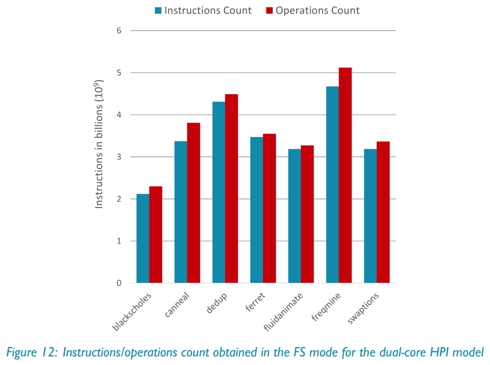

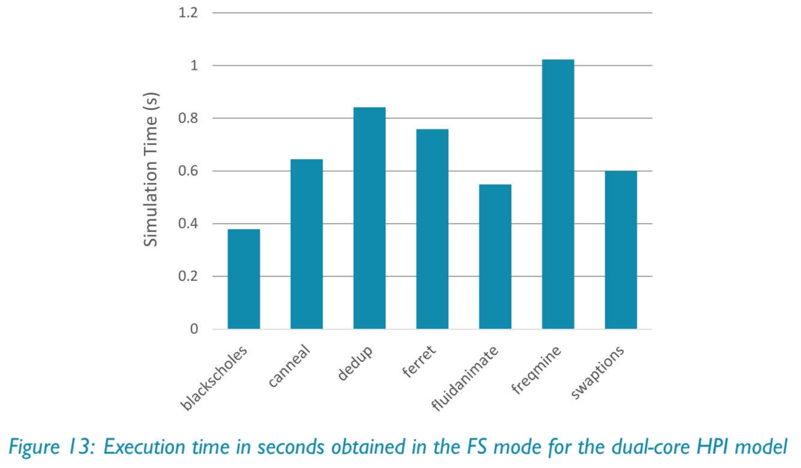

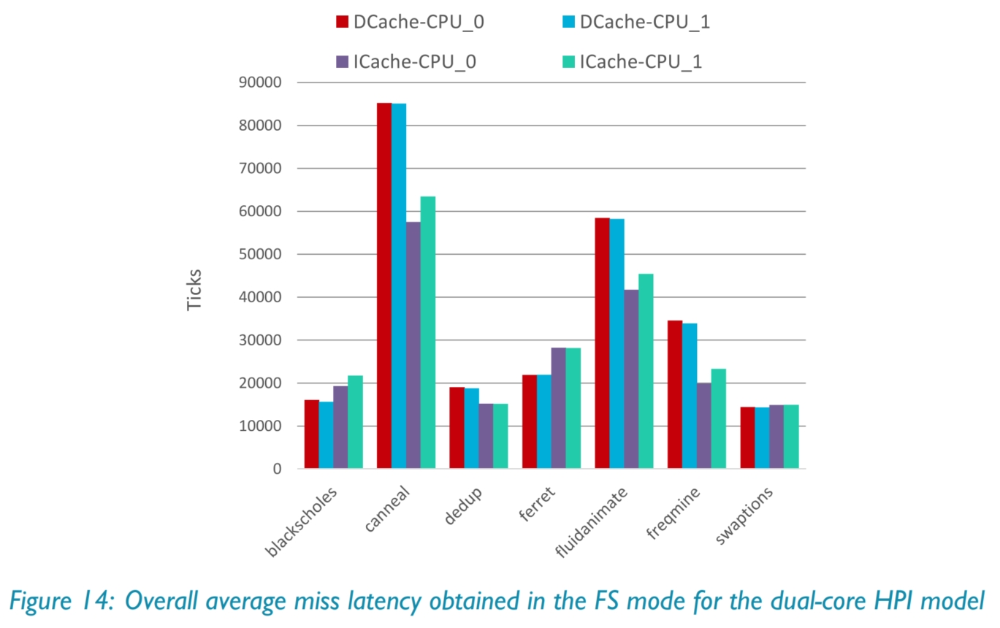

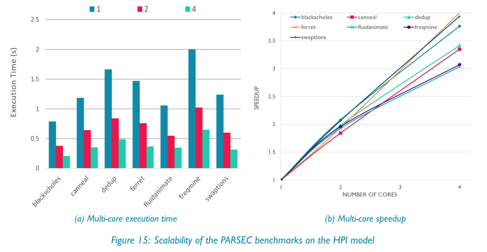

### Summary

In this chapter, we focused on running benchmarks on the HPI model in both SE and FS simulation modes. For benchmarking in the SE mode, Stanford SingleSource workloads from the LLVM test-suite were used. We showed how to compile these workloads for the Arm HPI model. We also showed how to collect the results in order to compare the benchmarks.

在本章中，我们专注于在 SE 和 FS 模拟模式下对 HPI 模型运行基准测试。 对于 SE 模式下的基准测试，使用了来自 LLVM 测试套件的 Stanford SingleSource 工作负载。 我们展示了如何为 Arm HPI 模型编译这些工作负载。 我们还展示了如何收集结果以比较基准。

For benchmarking in the FS mode, we used the PARSEC Benchmark Suite version 3.0. The FS simulation is more complicated and requires additional steps, such as downloading and modifying an FS disk image, creating runscripts, etc. We described two different ways to compile the PARSEC benchmarks for the Armv8 architecture: cross-compiling and compiling on QEMU. We then explained how to modify a disk image and copy the compiled benchmarks to it. Finally, we ran the PARSEC benchmarks on single-core and multi-core HPI models, and provided comparisons between them using the gem5 statistics.

对于 FS 模式下的基准测试，我们使用了 PARSEC Benchmark Suite 3.0 版。 FS 模拟比较复杂，需要额外的步骤，例如下载和修改 FS 磁盘映像，创建运行脚本等。 我们描述了两种不同的方式来编译 Armv8 架构的 PARSEC 基准测试：交叉编译和在 QEMU 上编译。 然后我们解释了如何修改磁盘映像并将编译的基准测试复制到它。 最后，我们在单核和多核 HPI 模型上运行了 PARSEC 基准测试，并使用 gem5 统计数据提供了它们之间的比较。


> 原文链接：https://github.com/arm-university/arm-gem5-rsk