# Armv8-A Instruction Set Architecture

<!-- TOC -->

- [Armv8-A Instruction Set Architecture](#armv8-a-instruction-set-architecture)
  - [1 Overview](#1-overview)
  - [2 Why you should care about the ISA](#2-why-you-should-care-about-the-isa)
  - [3 Instruction sets in the Armv8-A](#3-instruction-sets-in-the-armv8-a)
  - [4 Instruction set resources](#4-instruction-set-resources)
  - [5 Simple sequential execution](#5-simple-sequential-execution)
  - [6 Registers in AArch64](#6-registers-in-aarch64)
    - [6.1 General-purpose registers](#61-general-purpose-registers)
    - [6.2 Other registers](#62-other-registers)
    - [6.3 System registers](#63-system-registers)
  - [7 Data processing](#7-data-processing)
    - [7.1 Arithmetic and logic operations](#71-arithmetic-and-logic-operations)
    - [7.2 Floating point](#72-floating-point)
      - [7.2.1 Is floating point support optional?](#721-is-floating-point-support-optional)
    - [7.3 Bit manipulation](#73-bit-manipulation)
    - [7.4 Extension and saturation](#74-extension-and-saturation)
      - [7.4.1 Sub-register-sized integer data processing](#741-sub-register-sized-integer-data-processing)
    - [7.5 Format conversion](#75-format-conversion)
    - [7.6 Vector data](#76-vector-data)
  - [8 Loads and stores](#8-loads-and-stores)
    - [8.1 Size](#81-size)
    - [8.2 Zero and sign extension](#82-zero-and-sign-extension)
    - [8.3 Addressing](#83-addressing)
    - [8.4 Load pair and store pair](#84-load-pair-and-store-pair)
    - [8.5 Using floating point registers](#85-using-floating-point-registers)
  - [9 Program flow](#9-program-flow)
    - [9.1 Loops and decisions](#91-loops-and-decisions)
      - [9.1.2 Unconditional branch instructions](#912-unconditional-branch-instructions)
      - [9.1.3 Conditional branch instructions](#913-conditional-branch-instructions)
    - [9.2 Generating condition code](#92-generating-condition-code)
    - [9.3 Conditional select instructions](#93-conditional-select-instructions)
  - [10 Function calls](#10-function-calls)
  - [11 Procedure Call Standard](#11-procedure-call-standard)
  - [12 System calls](#12-system-calls)

<!-- /TOC -->

## 1 Overview

指令集架构 (ISA) 是计算机抽象模型的一部分。 它定义了软件如何控制处理器。

Arm ISA 允许您编写符合 Arm 规范的软件和固件。 这意味着，如果您的软件或固件符合规范，任何基于 Arm 的处理器都将以相同的方式执行它。

本指南介绍了 A64 指令集，用于 64 位 Armv8-A 架构，也称为 AArch64。

我们不会涵盖本指南中的每一条指令。 所有指令在 Arm 架构参考手册 (Arm ARM) 中都有详细说明。 相反，我们将介绍指令的格式、不同类型的指令以及用汇编程序编写的代码如何与编译器生成的代码进行交互。

在本指南的最后，您可以检查您的知识。 您将了解指令的主要类别、数据处理指令的语法以及 W 和 X 寄存器的使用如何影响指令。 我们希望您从本指南中学到的主要成果是能够解释在给定 C 程序及其编译器输出时生成的汇编代码如何映射到 C 语句。 最后，本指南将向您展示如何在汇编程序中编写可从 C 调用的函数。

## 2 Why you should care about the ISA

作为开发人员，您可能不需要在我们的日常角色中直接在汇编程序中进行编写。 但是，汇编程序在某些领域仍然很重要，例如第一阶段引导软件或一些低级内核活动。

即使您不直接编写汇编代码，了解指令集可以做什么，以及编译器如何使用这些指令，也可以帮助您编写更高效的代码。 它还可以帮助您理解编译器的输出。 这在调试时很有用。

## 3 Instruction sets in the Armv8-A

<font color=blue>Armv8-A 支持三种指令集：A32、T32 和 A64。</font>

在 AArch64 执行状态下执行时使用 A64 指令集。 它是一个固定长度的 32 位指令集。 名称中的“64”指的是 AArch64 执行状态使用该指令。 它不是指内存中指令的大小。<font color=red>此处容易存在一个误区，即AArch64的指令也是64 bits，其实只是寄存器位宽（数据位宽）为64 bits.</font>

A32 和 T32 指令集也分别称为“ARM”和“Thumb”。 这些指令集在 AArch32 执行状态下执行时使用。 在本指南中，我们不涉及 A32 和 T32 指令集。 要了解有关这些指令集的更多信息，请参阅本指南的相关信息部分。

## 4 Instruction set resources

每个版本的 Arm 架构都有自己的 Arm 架构参考手册 (Arm ARM)，可以在 [Arm 开发人员网站](https://developer.arm.com/)上找到。 Every Arm ARM 提供了每条指令的详细说明，包括：

- 编码 - 指令在内存中的表示。
- 参数 - 指令的输入。
- 伪代码 - 指令的作用，以 Arm 伪代码语言表示。
- 限制 - 当指令不能使用时，或者它可以触发的异常。

A64 的指令描述也有 XML 和 HTML 格式。 如果您需要经常参考说明，XML 和 HTML 格式非常有用。 XML 和 HTML 格式可以在 Arm 开发人员网站上找到。 您可以在本指南的相关信息部分找到链接。 XML 可以作为压缩档案下载，HTML 可以使用 Web 浏览器查看和搜索。

**注意：XML/HTML 和 Arm ARM 中的信息取自同一来源，但格式可能略有不同。**

## 5 Simple sequential execution

Arm 架构描述了遵循简单顺序执行 (SSE) 模型的指令。 这意味着处理器的行为就像处理器一次提取、解码和执行一条指令，并且按照指令在内存中出现的顺序。

实际上，现代处理器的流水线可以一次执行多条指令，并且可能会乱序执行。 此图显示了 Arm Cortex 处理器的示例管道：

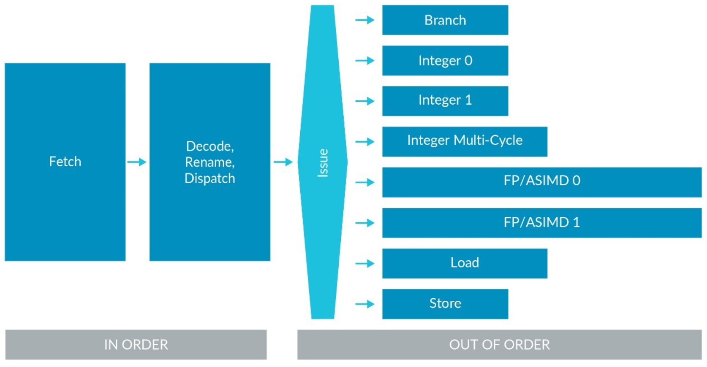

你会记得架构是一个功能描述。 这意味着它没有指定单个处理器的工作方式。 每个处理器的行为都必须与简单的顺序执行模型一致，即使它在内部对指令进行重新排序。

## 6 Registers in AArch64

### 6.1 General-purpose registers

大多数 A64 指令对寄存器进行操作。 <font color=blue>该架构提供了 31 个通用寄存器。 每个寄存器可用作 64 位 X 寄存器 (X0..X30)，或用作 32 位 W 寄存器 (W0..W30)。</font> 这是查看同一寄存器的两种不同方式。 例如，这个寄存器图显示W0是X0的低32位，W1是X1的低32位：

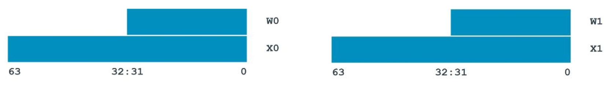

对于数据处理指令，X 或 W 的选择决定了操作的大小。 使用 X 寄存器将导致 64 位计算，使用 W 寄存器将导致 32 位计算。 此示例执行 32 位整数加法：

```asm
ADD W0, W1, W2
```

此示例执行 64 位整数加法：

```asm
ADD X0, X1, X2
```

当写入 W 寄存器时，如上例所示，64 位寄存器的前 32 位为零。

<font color=blue>有一组单独的 32 个寄存器用于浮点和向量运算。 这些寄存器是 128 位的，但与通用寄存器一样，可以通过多种方式访问。 Bx 为 8 位，Hx 为 16 位，依此类推，Qx 为 128 位。</font>

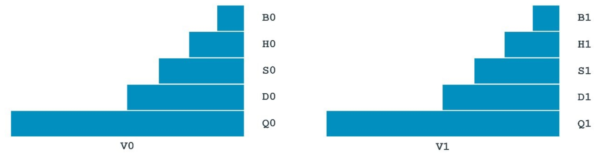

您用于寄存器的名称决定了计算的大小。 此示例执行 32 位浮点加法：

```asm
FADD S0, S1, S2
```

此示例执行 64 位浮点加法：

```asm
FADD D0, D1, D2
```

这些寄存器也可以称为 V 寄存器。 <font color=blue>当使用 V 形式时，寄存器被视为一个向量。 这意味着它被视为包含多个独立值，而不是单个值。</font> 此示例执行向量浮点加法：

```asm
FADD V0.2D, V1.2D, V2.2D
```

此示例执行向量整数加法：

```asm
ADD V0.2D, V1.2D, V2.2D
```

我们将在本指南的后面更详细地介绍向量指令。

### 6.2 Other registers

以下是您应该了解的 A64 中的其他一些寄存器：

<font color=blue>零寄存器 ZXR 和 WZR 始终读为 0 并忽略写入。</font>

您可以使用堆栈指针 (SP) 作为加载和存储的基地址。 您还可以将堆栈指针与一组有限的数据处理指令一起使用，但它不是常规的通用寄存器。

Armv8-A 有多个堆栈指针，每一个都与一个特定的异常级别相关联。 在指令中使用 SP 时，表示当前堆栈指针。 异常模型指南解释了如何选择堆栈指针。

X30 用作链接寄存器，可称为 LR。

**注意：单独的寄存器 ELR_ELx 用于从异常中返回。 这在异常模型指南中有更详细的讨论。**


程序计数器（PC）在 A64 中不是通用寄存器，不能与数据处理指令一起使用。 可以使用以下方法读取 PC：

```asm
ADR Xd, .
```

ADR instruction 返回标签的地址，根据当前位置计算。 点（‘.’）的意思是‘这里’，所以显示的指令是返回它自己的地址。 这相当于读取PC。 一些分支指令和一些加载/存储操作隐式使用 PC 的值。

**注意：在 A32 和 T32 指令集中，PC 和 SP 是通用寄存器。 在 A64 指令集中不是这种情况。**

### 6.3 System registers

除了通用寄存器外，该架构还定义了系统寄存器。 系统寄存器用于配置处理器和控制系统，如 MMU 和异常处理

<font color=blue>数据处理或加载/存储指令不能直接使用系统寄存器。 相反，需要将系统寄存器的内容读入 X 寄存器，对其进行操作，然后再写回系统寄存器。</font> 访问系统寄存器有两条专业指令：

```asm
MRS Xd, <system register>
```

将系统寄存器读入 Xd。

```asm
MSR <system register>, Xn
```

将 Xn 写入系统寄存器。

系统寄存器由名称指定，例如 SCTLR_EL1：

```asm
MRS X0, SCTLR_EL1
```

将 SCTLR_EL1 读入 X0。

系统寄存器名称以 _ELx 结尾。 _ELx 指定访问寄存器所需的最低权限。 例如：

```asm
SCTLR_EL1
```

需要 EL1 或更高权限。

```asm
SCTLR_EL2
```

需要 EL2 或更高权限。

```asm
SCTLR_EL3
```

需要EL3权限。

尝试访问权限不足的寄存器会导致异常。

**注意：有时您会看到 _EL12 或 _EL01。 这些用作虚拟化的一部分。 有关更多信息，请参阅虚拟化指南。**


## 7 Data processing

### 7.1 Arithmetic and logic operations

逻辑和整数算术指令的基本格式是：

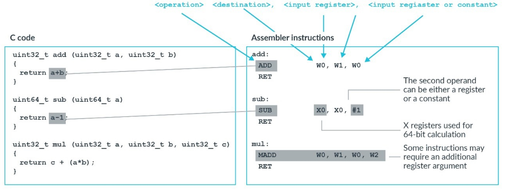

指令部分如下：

- 操作。 这定义了指令的作用。 例如，ADD 执行加法和 AND 执行逻辑 AND。
  可以将 S 添加到操作中以设置标志。 例如，ADD 变为 ADDS。 这 S 告诉处理器根据指令的结果更新 ALU 标志。 我们在生成条件代码的部分讨论 ALU 标志。
- 目标：指令的目标始终是一个寄存器，并指定操作结果的放置位置。 大多数指令都有一个目标寄存器。 一些指令有两个目标寄存器。 当目标为 W 寄存器时，相应 X 寄存器的高 32 位设置为 0。
- 操作数 1：这将始终是一个寄存器。 这是指令的第一个输入。
- 操作数 2：这将是一个寄存器或常量，并且是指令的第二个输入。 
  当操作数 2 是寄存器时，它可能包括一个可选的移位。
  当操作数 2 是一个常数时，它在指令本身内被编码。 这意味着可用的常数范围是有限的。

您应该注意一些特殊情况，例如 MOV 和 MVN 指令。 MOV 将常量或另一个寄存器的内容移动到指定为目标的寄存器中。 MOV 和 MVN 只需要一个输入操作数，它可以是寄存器或常量，如下所示：

```asm
MOV X0, #1
```

sets: X0 = 1

```asm
MVN W0, W1
```

sets: W0 = ~W1

### 7.2 Floating point

浮点运算遵循与整数数据处理指令相同的格式并使用浮点寄存器。 与整数数据处理指令一样，操作的大小决定了所使用的寄存器的大小。 浮点指令的运算部分总是以F开头。例如，这条指令以半精度设置H0 = H1 / H2：

```asm
FDIV H0, H1, H2
```

该指令以单精度设置 S0 = S1 + S2：

```asm
FADD S0, S1, S2
```

该指令以双精度设置 D0 = D1 - D2：

```asm
FSUB D0, D1, D2
```

Armv8.2-A 中添加了对半精度（16 位）的支持并且是可选的。 ID_AA64PFR0_EL1 报告了对半精度的支持。

可以捕获对浮点寄存器的访问。 这意味着任何使用浮点寄存器的尝试都会产生异常。 异常模型指南中更详细地讨论了捕获。

#### 7.2.1 Is floating point support optional?

不可以。Armv8-A 强制支持浮点数。 该体系结构指定每当使用丰富的操作系统（例如 Linux）时都需要它。

如果您运行的是完全专有的软件堆栈，则技术上允许您省略浮点支持。 大多数工具链，包括 GCC 和 Arm Compiler 6，将假定支持浮点。

### 7.3 Bit manipulation

有一组用于操作寄存器内位的指令。 此图显示了一些示例：

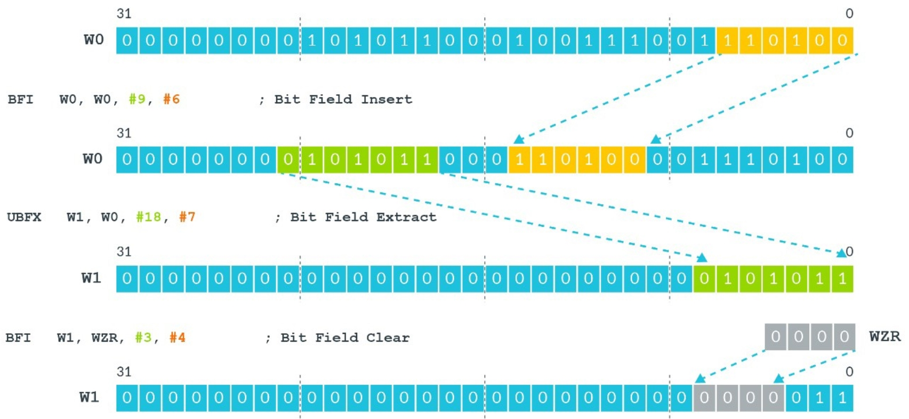

BFI 指令将位域插入寄存器。 在上图中，BFI 从源寄存器 (W0) 中取出 6 位字段并将其插入到目标寄存器的第 9 位。

UBFX 提取一个位域。 在上图中，UBFX 从源寄存器的第 18 位取一个 7 位字段，并将其放入目标寄存器。

**自我测试：在上图中，最后一个示例是什么意思？ 请记住，WZR 是零寄存器。**

上图中的最后一个示例取 WZR 的后 4 位，并将它们插入 W1 的第 3 位。 使用 WZR 意味着这实际上是一个有点清晰的操作。

其他指令可以反转字节或位顺序，如下图所示：

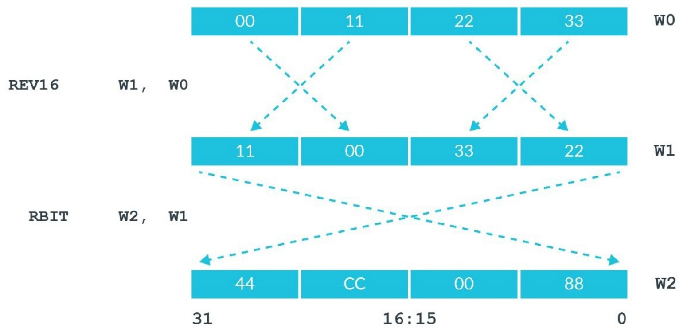

当您处理不同字节序的数据时，REV16 和 RBIT 尤其有用。

**自我测试：REV16 指令反转 W 寄存器中的两个半字（16 位）。 在上图中，有一条指令是对整个寄存器中的字节进行反转，还有一条是对X寄存器内的字进行字节反转的指令。 这两条指令叫什么？**

下载[指令集XML](https://developer.arm.com/architectures/instruction-sets)，看看你是否正确。


### 7.4 Extension and saturation

有时需要将数据从一种大小转换为另一种大小。 SXTx（符号扩展）和 UXTx（无符号扩展）指令可用于此转换。 在这个转换中，x 决定了被扩展数据的大小，如下图所示：

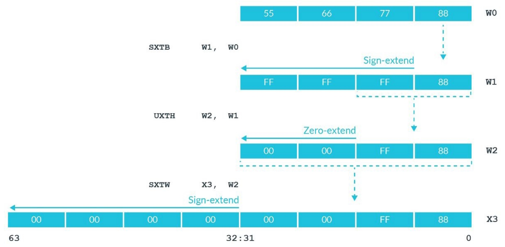

在第一条指令SXTB中，B表示字节。 它采用 W0 的底部字节并将其符号扩展为 32 位。

UXTH 是半字 (H) 的无符号扩展。 它需要 W1 的底部 16 位，零将其扩展到 32 位。

前两个示例将 Wregisters 作为目标，这意味着扩展为 32 位。 第三个示例有一个 Xregister，这意味着符号扩展为 64 位。

**自我测试：编写一条指令，将 W5 中的一个字节符号扩展为 64 位，并将结果放入 X7。**

SXTB X7, W5

#### 7.4.1 Sub-register-sized integer data processing

一些指令执行饱和算术。 这意味着如果结果大于或小于目标可以容纳的值，则结果将设置为目标整数范围的最大值或最小值。

数据处理指令可以有效地处理 32 位数据和 64 位数据。 在实践中，您经常会在处理子寄存器计算时看到饱和指令。 子寄存器计算是 16 位或 8 位的计算。 下表显示了 C 中子寄存器计算的一些示例和生成的汇编代码：

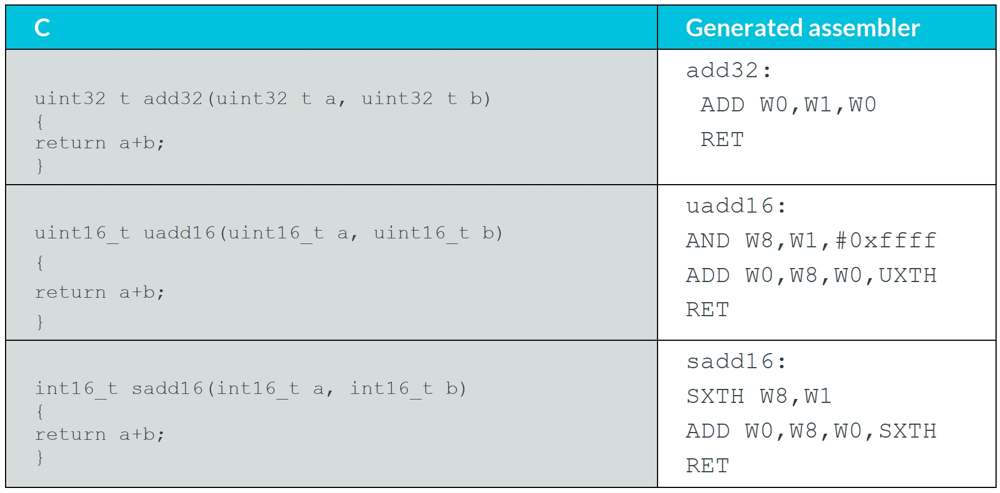

在表中的第一个示例中，32 位加法映射到 W 寄存器，因此可以轻松处理。

对于表中的 16 位示例，需要额外的指令。 表中的第三个示例采用 16 位输入，将它们扩展到 32 位，然后执行加法。 该序列使用以下方法将 16 位输入转换为 32 位：

```asm
SXTH W8,W1
```

然后，此指令执行加法并将结果饱和为有符号的 16 位：

```asm
ADD W0,W8,W0,SXTH
```

将 , SXTH 添加到 ADD 操作的操作数列表的末尾会导致结果使用饱和算术。 由于目标是 W 寄存器，因此 ADD 将饱和到 16 位整数范围。

### 7.5 Format conversion

我们已经看到 MOV 和 MVN 指令将值从一个寄存器复制到另一个寄存器。 类似地，FMOV 可用于在浮点寄存器和通用寄存器之间进行复制。

但是，使用 FMOV 会在寄存器之间复制文字位模式。 还有一些指令可以转换为最接近的表示，如下图所示：

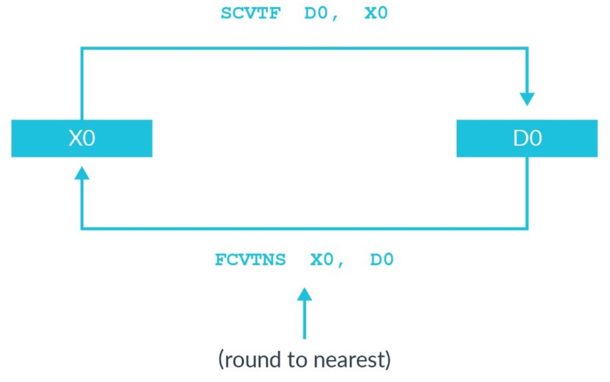

在此示例中，假设 X0 包含值 2（正整数 2）：

```asm
X0 = 0x0000_0000_0000_0002
```

然后，执行以下序列：

```asm
FMOV D0, X0 
SCVTF D1, X0
```

两条指令都将 X0“复制”到 D 寄存器中。 然而，结果却大不相同：

```asm
D0 = 0x0000_0000_0000_0002 = 9.88131e-324
D1 = 0x4000_0000_0000_0002 = 2.0
```

FMOV 复制了文字位模式，当解释为浮点值时，这是一个非常不同的值。 SCVTF 将 X0 中的值转换为最接近的浮点数。

类似地，FCTxx 可用于将浮点值转换为其最接近的整数表示。 在这种情况下，'xx' 的不同值控制所使用的舍入模式。

### 7.6 Vector data

A64 架构还提供对矢量数据处理的支持。 可用的两种矢量处理类型是：

- 高级 SIMD，也称为 Neon。
- 可缩放向量扩展 (Scalable Vector Extension)，简称SVE。


我们将在稍后的向量编程指南中介绍这两种类型的向量处理。

**注意：Advanced SIMD 的名称源自于在 Armv6 中对常规 32 位通用寄存器进行操作的 SIMD 指令的存在。 在 Armv7 中，高级 SIMD 一词用于表示可以对 128 位向量进行操作的指令。 A64 中不存在 Armv6 样式指令，但命名约定保留。**

## 8 Loads and stores

基本的加载和存储操作有：LDR（加载）和STR（存储）。 这些操作在存储器和通用寄存器之间传输单个值。 这些指令的语法是：

```asm
LDR<Sign><Size> <Destination>, [<address>]
STR<Size> <Destination>, [<address>]
```

### 8.1 Size

加载或存储的大小由寄存器类型 X 或 W 和 \<Size\> 字段决定。 X 用于 32 位，W 用于 64 位。 例如，这条指令从 \<address\> 加载 32 位到 W0：

```asm
LDR W0, [<address>]
```

该指令从 \<address\> 加载 64 位到 X0：

```asm
LDR X0, [<address>]
```

\<Size\> 字段允许您加载子寄存器大小的数据量。 例如，这条指令存储W0到\<address\>的底部字节（B）：

```asm
STRB W0, [<address>]
```

该指令将 W0 的底部半字 (H) 存储到 \<address\>：

```asm
STRH W0, [<address>]
```

最后，这条指令将 X0 的底部字（W）存储到 \<address\>：

```asm
STRW X0, [<address>]
```

### 8.2 Zero and sign extension

默认情况下，当加载子寄存器大小的数据量时，寄存器的其余部分为零，如下图所示：

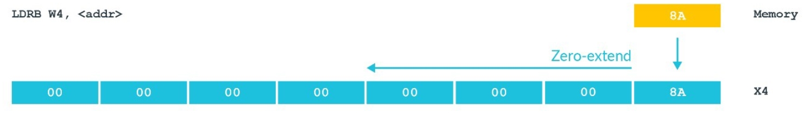


**注意：请记住，每当写入 W 寄存器时，X 寄存器的上半部分都会清零。**

将 S 添加到操作会导致值进行符号扩展。 大小扩展的程度取决于目标是否为W 或 X寄存器，如下图所示：

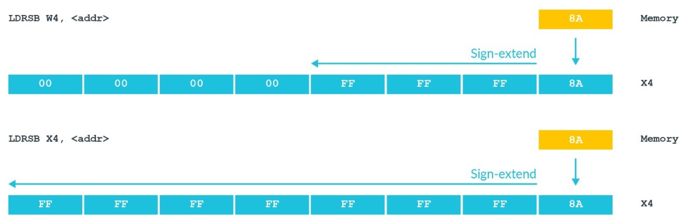

**任务：如果地址 0x8000 处的字节包含值 0x1F，LDRSB X4，<0x8000> 的结果是什么？**

LDRSB 正在执行字节加载，符号扩展为 64 位。 加载值的最高有效位将被复制以填充 64 位寄存器。 加载的值 0x1F 的最高位已清除。 因此，X4 中的值为 0x0000_0000_0000_001F。

### 8.3 Addressing

加载和存储指令的地址出现在方括号内，如下例所示：

```asm
LDR W0, [X1]
```

有几种寻址模式定义了地址的形成方式。

- 基址寄存器 - 最简单的寻址形式是单个寄存器。 基址寄存器是一个 X 寄存器，它包含被访问数据的完整或绝对虚拟地址，如下图所示：

  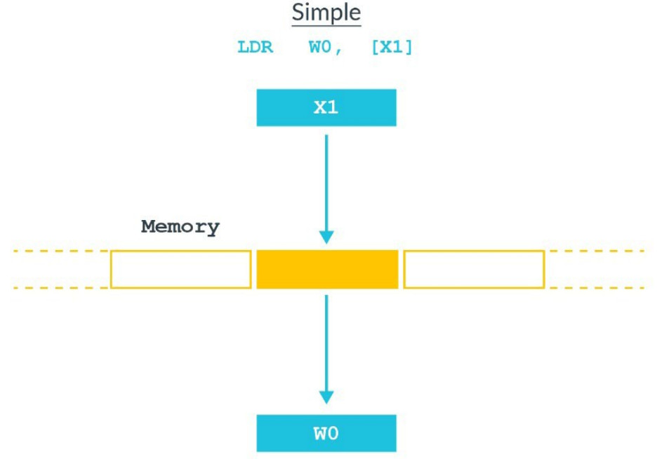

- 偏移寻址模式 - 可以选择性地将偏移应用于基地址，如下图所示：

  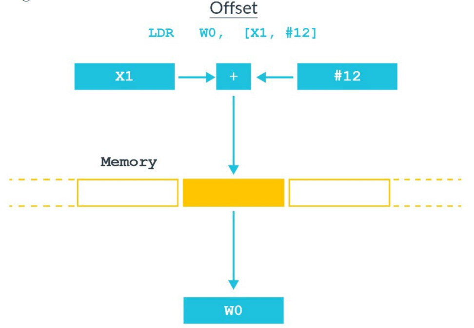

  在上图中，X1 包含基地址，#12 是该地址的字节偏移量。 这意味着访问的地址是 X1+12。 偏移量可以是常数或其他寄存器。 例如，这种类型的寻址可用于结构。 编译器维护一个指向结构基址的指针，使用偏移量来选择不同的成员。

- 预索引寻址模式 - 在指令语法中，预索引通过添加感叹号来表示！ 在方括号之后，如下图所示：
  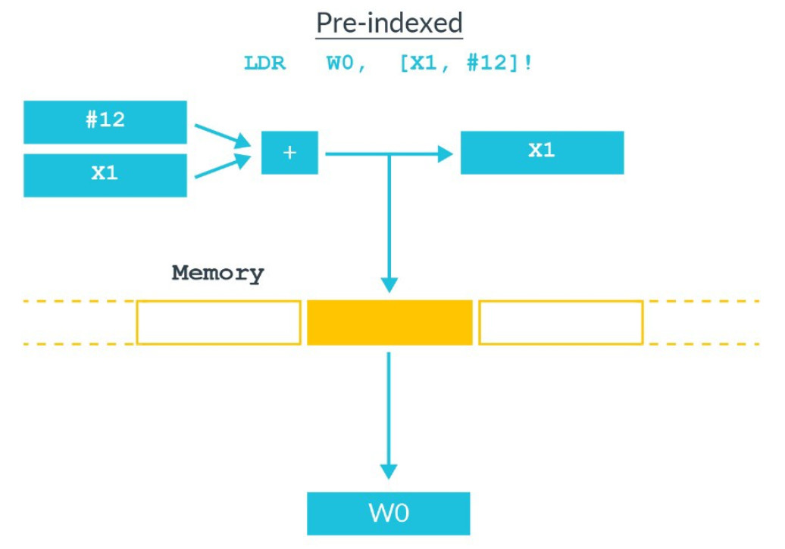

  预变址寻址类似于偏移寻址，除了基指针作为指令的结果更新。 在上图中，指令完成后 X1 的值为 X1+12。

- 后索引寻址模式 - 使用后索引寻址，从基指针中的地址加载值，然后更新指针，如下图所示：
  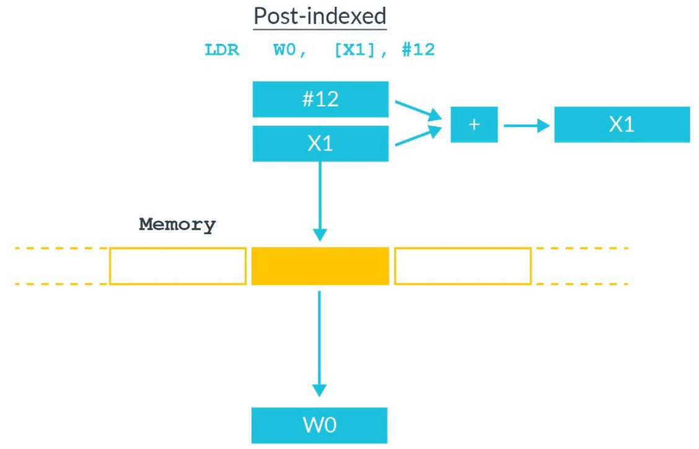

  后索引寻址对于弹出堆栈很有用。 该指令从堆栈指针指向的位置加载值，然后将堆栈指针移动到堆栈中的下一个完整位置。


### 8.4 Load pair and store pair

到目前为止，我们已经讨论了单个寄存器的加载和存储。 A64 还具有加载 (LDP) 和存储对 (STP) 指令。

这些对指令将两个寄存器传送到内存和从内存传送。 第一条指令将 [X0] 加载到 W3，并将 [X0 + 4] 加载到 W7：

```asm
LDP W3, W7, [X0]
```

第二条指令将 D0 存储到 [X4] 并将 D1 存储到 [X4 + 8]：

```asm
STP D0, D1, [X4]
```

加载和存储对指令通常用于推送和弹出堆栈。 第一条指令将 X0 和 X1 压入堆栈：

```asm
; SP <-- SP - 16
; X0 <-- [SP]
; X1 <-- [SP + 8]
STP X0, X1, [SP, #-16]!
```

第二条指令从堆栈中弹出 X0 和 X1：

```asm
; X0 <-- [SP]
; X1 <-- [SP + 8]
; SP <-- SP + 16
LDP X0, X1, [SP], #16
```

请记住，在 AArch64 中，堆栈指针必须是 128 位对齐的。

### 8.5 Using floating point registers

加载和存储也可以使用浮点寄存器来执行，我们将在这里看到。 第一条指令将 64 位从 [X0] 加载到 D1：

```asm
LDR D1, [X0]
```

第二条指令存储从 Q0 到 [X0 + X1] 的 128 位：

```asm
STR Q0, [X0, X1]
```

最后，该指令从 X5 加载一对 128 位值，然后将 X5 增加 256：

```asm
LDP Q1, Q3, [X5], #256
```

有一些限制：

- 大小仅由寄存器类型指定。
- 没有选项可以符号扩展负载。
- 地址必须仍然是 X 寄存器。

在意外情况下可以找到使用浮点寄存器的加载和存储。 memcpy() 类型的例程使用它们是很常见的。 这是因为更宽的寄存器意味着需要更少的迭代。 仅仅因为您的代码不使用浮点值，不要假设您不需要使用浮点寄存器。

## 9 Program flow

通常，处理器按程序顺序执行指令。 这意味着处理器执行指令的顺序与它们在内存中设置的顺序相同。 更改此顺序的一种方法是使用分支指令。 分支指令改变程序流程并用于循环、决策和函数调用。

A64 指令集也有一些条件分支指令。 这些是根据先前指令的结果改变它们执行方式的指令。

**注意：Armv8.3-A 和 Armv8.5-A 引入了防止面向返回编程和面向跳转编程的指令。**

### 9.1 Loops and decisions

在本节中，我们将研究循环和决策如何让您使用分支指令更改程序代码的流程。 有两种类型的分支指令：无条件和有条件。

#### 9.1.2 Unconditional branch instructions

无条件分支指令 B \<label\> 直接执行PC相关的分支到 \<label\> 。 从当前 PC 到目标的偏移量在指令中编码。 该范围受指令内用于记录偏移量的可用空间的限制，为 +/- 128MB。

当您使用 BR \<Xn\> 时，BR 执行到 Xn 中指定地址的间接或绝对分支。

#### 9.1.3 Conditional branch instructions

条件分支指令 B.\<cond\> \<label\> 是 B 指令的条件版本。 仅当条件 \<cond\> 为真时才会采用分支。 范围限制为 +/- 1MB。

该条件根据存储在 PSTATE 中的 ALU 标志进行测试，并且需要由前一条指令（例如比较 (CMP)）生成。

```asm
CBZ <Xn> <label> and CBNZ <Xn> <label>
```

如果 Xn 包含 0 (CBZ)，则此指令分支到 \<label\>，如果 Xn 不包含 0 (CBNZ)，则分支到 label。

```asm
TBZ <Xn>, #<imm>, <label> and TBNZ <Xn>, #<imm>, <label>
```

TBX 的工作方式与 CBZ/CBNZ 类似，但测试 <imm> 指定的位。

**注意：直接分支或 PC 相关分支存储指令中目标的偏移量。 条件分支的范围更小。 这是因为需要一些位来存储条件本身，这为偏移量留下了更少的位。**

将这些映射到您可能用 C 编写的内容，此表显示了使用分支进行循环和决策的示例：

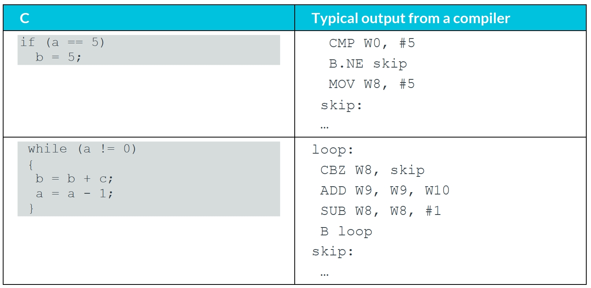

**注意：输出中显示的标签不会由编译器创建。 它们被包含在此处以提高可读性。**

**自我测试：A64 中没有条件间接分支指令。 如果 X5 包含 0，你怎么能构造一个指令序列来执行到 X1 中的地址的绝对分支？**

没有单一的正确答案，但这样的事情是可以接受的：

```asm
  CMP   X5, XZR     // Compare X5 with zero
  B.NE  skip        // If X5 != 0 branch past BR
  BR X1
skip:
  ...
```


### 9.2 Generating condition code

在程序流 - 循环和决策中，我们了解到 \<cond\> 是针对存储在 PSTATE 中的 ALU 标志进行测试的。

ALU 标志被设置为数据处理指令的副作用。 回顾一下，结束操作时的 S 会导致更新 ALU 标志。 这是不更新 ALU 标志的指令示例：

```asm
ADD X0, X1, X2
```

这是使用 S 更新 ALU 标志的指令示例：

```asm
ADDS X0, X1, X2
```

此方法允许软件控制何时更新或不更新标志。 这些标志可由后续条件指令使用。 我们以下面的代码为例：

```asm
SUBS X0, X5, #1
```

```asm
AND X1, X7, X9
```

```asm
B.EQ label
```

SUBS 指令执行减法并更新 ALU 标志。 然后 AND 指令执行与操作，并且不更新 ALU 标志。 最后，B.EQ 指令使用作为减法结果设置的标志执行条件分支。

The flags are:

- N - Negative
- C - Carry
- V - Overflow
- Z - Zero

我们以 Z 标志为例。 如果运算结果为零，则 Z 标志设置为 1。例如，这里如果 X5 为 1，Z 标志将被设置，否则将被清除：

```asm
SUBS X0, X5, #1
```

条件代码映射到这些标志并成对出现。 我们以EQ（等于）和NE（不等于）为例，看看它们是如何映射到Z标志的：

EQ 代码检查 Z==1。 NE 代码检查 Z==0。

以以下代码为例：

```asm
SUBS W0, W7, W9
```

W0 = W7 - W9, Z

```asm
B.EQ label
```

在第一行，我们有一个减法运算。 在第二行中，如果结果为零，则设置标志。 在最后一行中，如果 Z==1，则有一个要标记的分支。

如果 w7==w9，减法的结果将为零，并且 Z 标志将被设置。 因此，如果 w7 和 w9 相等，将采用标记的分支。

除了常规的数据处理指令外，还有其他仅更新 ALU 标志的指令：

CMP - Compare

TST - Test

这些指令是其他指令的别名。 例如：

```asm
CMP X0, X7      //an alias of SUBS XZR, X0, X7
TST W5, #1      //an alias of ANDS WZR, W5, #1
```

通过使用Zero寄存器作为目标，我们丢弃了操作的结果，只更新了 ALU 标志。


### 9.3 Conditional select instructions

到目前为止，我们已经看到了使用分支来处理决策的示例。 A64 指令集还提供条件选择指令。 在许多情况下，这些指令可以用作分支的替代方法。

有许多变体，但基本形式是：

```asm
CSEL Xd, Xn, Xm, cond
```

这意味着：

```asm
if cond then
  Xd = Xn
else
  Xd = Xm
```

您可以在此代码中看到一个示例：

```asm
CMP W1, #0
CSEL W5, W6, W7, EQ
```

这给出了相同的结果：

```asm
if (W1==0) then
  W5 = W6
else
  W5 = W7
```

有一些变体将另一个操作与条件选择相结合。 例如， CSINC 执行选择和添加：

```asm
CSINC Xd, Xn, Xm, cond
```

This means that:

```asm
if cond then
  Xd = Xn
else
  Xd = Xm + 1
```

要有条件地递增，您可以编写：

```asm
CSINC X0, X0, X0, cond
```

Which equates to:

```asm
if cond then
  X0 = X0
else
  X0 = X0 + 1
```

体系结构为此命令提供了别名 CINC。 但是请注意，CINC 反转了 CSINC 的逻辑：

- CSINC X0, X0, X0, cond
  - leaves X0 unchanged if cond is true
  - increments X0 if cond is false.
- CINC X0, X0, cond
  - increments X0 if cond is true
  - leaves X0 unchanged if cond is false


编译器会选择最有效的方法来实现程序中的功能。 对于执行简单操作的小型 if ... else 语句，编译器通常会使用条件选择，因为条件选择可能比分支更有效。

下面是一些简单的 if ... else 示例，将使用分支的实现与使用条件选择指令的等效实现进行比较：

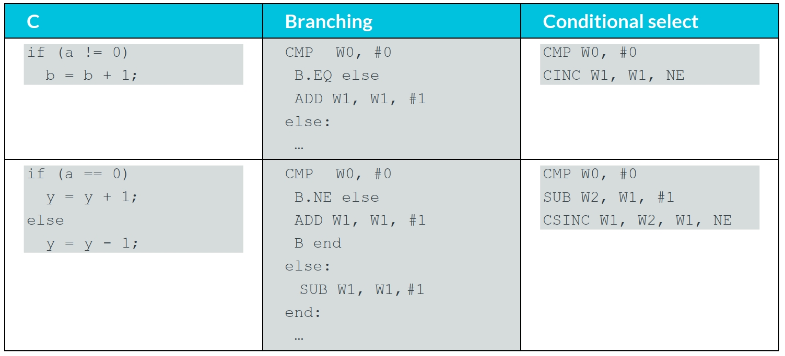


在这些类型的示例中，条件选择具有一些优势。 无论结果如何，序列都更短并采用相同数量的指令。

重要的是，条件选择还消除了分支的需要。 在现代处理器中，这种分支可能很难让分支预测逻辑正确预测。 错误预测的分支会对性能产生负面影响，最好尽可能删除分支。


## 10 Function calls

在调用函数或子例程时，我们需要一种在完成后返回调用者的方法。 向 B 或 BR 指令添加 L 会将它们变成带有链接的分支。 这意味着返回地址作为分支的一部分写入 LR (X30)。

注意：名称 LR 和 X30 可以互换。 一个汇编器，比如 GNU GAS 或 armclang，会接受这两者。

有一个专门的函数返回指令RET。 这对链接寄存器中的地址执行间接分支。 总之，这意味着我们得到：

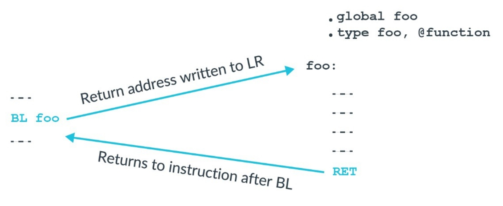

注：图中为用 GAS 语法汇编器编写的函数 foo()。 关键字 .global 导出符号，.type 表示导出的符号是一个函数。

为什么我们需要一个特殊的函数返回指令？ 从功能上讲，BR LR 将完成与 RET 相同的工作。 使用 RET 告诉处理器这是一个函数返回。 大多数现代处理器和所有 Cortex-A 处理器都支持分支预测。 知道这是一个函数返回允许处理器更准确地预测分支。

分支预测器猜测程序流将跨越分支的方向。 猜测用于决定将什么加载到具有等待处理的指令的管道中。 如果分支预测器猜测正确，则流水线具有正确的指令并且处理器不必等待指令从内存加载。

## 11 Procedure Call Standard

Arm 架构对通用寄存器的使用方式几乎没有限制。 回顾一下，整数寄存器和浮点寄存器是通用寄存器。 但是，如果您希望您的代码与其他人编写的代码或编译器生成的代码交互，那么您需要同意寄存器使用规则。 对于 Arm 架构，这些规则称为过程调用标准或 PCS。

PCS 规定：

- 哪些寄存器用于将参数传递给函数。
- 哪些寄存器用于向执行调用的函数（称为调用方）返回一个值。
- 哪个注册被调用的函数，它被称为被调用者，cancorrupt。
- 被调用者不能破坏哪个寄存器。


考虑从 main() 调用的函数 foo()：

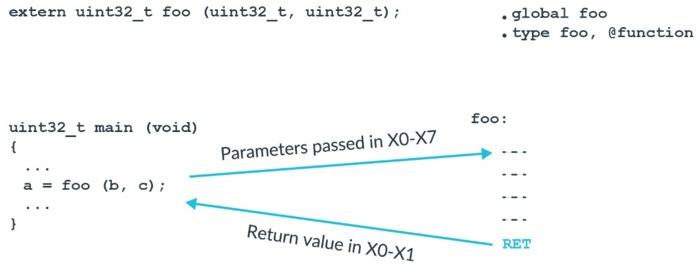

PCS 说第一个参数在 X0 中传递，第二个参数在 X1 中，依此类推，直到 X7。 任何进一步的参数都在堆栈上传递。 我们的函数 foo() 有两个参数：b 和 c。 因此，b 将在 W0 中，c 将在 W1 中。

**注意：在 C++ 中，X0 用于传递指向被调用函数的隐式 this 指针。**

接下来，PCS 定义了哪些寄存器可以被破坏，哪些寄存器不能被破坏。 如果一个寄存器可能被破坏，那么被调用的函数可以覆盖而不需要恢复，如这张 PCS 寄存器规则表所示：

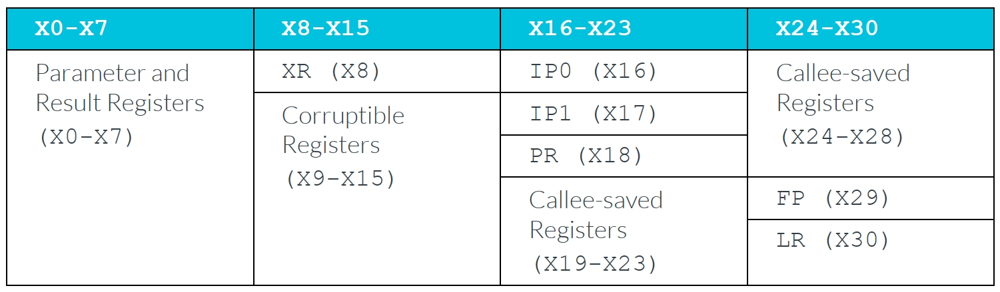

例如，函数 foo() 可以使用寄存器 X0 到 X15 而无需保留它们的值。 但是，如果 foo() 要使用 X19 到 X28，则必须先将它们保存到堆栈中，然后在返回之前从堆栈中恢复。

一些寄存器在 PCS 中具有特殊意义：

- XR - 这是一个间接结果寄存器。 如果 foo() 返回一个结构体，则结构体的内存将由调用者分配，即前面示例中的 main()。 XR 是指向调用者为返回结构而分配的内存的指针。
- IP0 和 IP1 - 这些寄存器是过程内调用可损坏的寄存器。 在调用函数和到达函数中的第一条指令之间，这些寄存器可能会损坏。 链接器使用这些寄存器在调用者和被调用者之间插入中间代码。 贴面是一小段代码。 最常见的例子是分支范围扩展。 A64 中的分支指令的范围是有限的。 如果目标超出该范围，则链接器需要生成中间代码以扩展分支的范围。
- FP - 帧指针。
- LR - X30 是函数调用的链接寄存器 (LR)。

**注意：我们之前介绍了 ALU 标志，用于条件分支和条件选择。 PCS 表示不需要在函数调用中保留 ALU 标志。**

浮点寄存器有一组类似的规则：

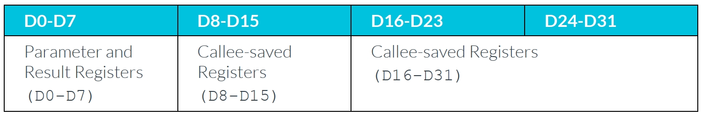


## 12 System calls

有时，软件有必要从更有特权的实体请求功能。 例如，当应用程序请求操作系统打开文件时，可能会发生这种情况。


在 A64 中，有进行此类系统调用的特殊指令。 这些指令导致异常，允许受控进入更特权的异常级别。

- SVC - 主管呼叫
  导致针对 EL1 的异常。
  由应用程序用来调用操作系统。

- HVC - 管理程序调用
  导致针对 EL2 的异常。
  由操作系统用于调用管理程序，在 EL0 中不可用。

- SMC - 安全监控呼叫
  导致针对 EL3 的异常。
  由操作系统或管理程序用于调用 EL3 固件，在 EL0 中不可用。

如果从高于目标异常级别的异常级别执行异常，则将异常带到当前的异常级别。 这意味着 EL2 处的 SVC 会导致进入 EL2 的异常。 类似地，EL3 处的 HVC 会导致异常进入 EL3。 这与异常永远不会导致处理器失去特权的规则是一致的。