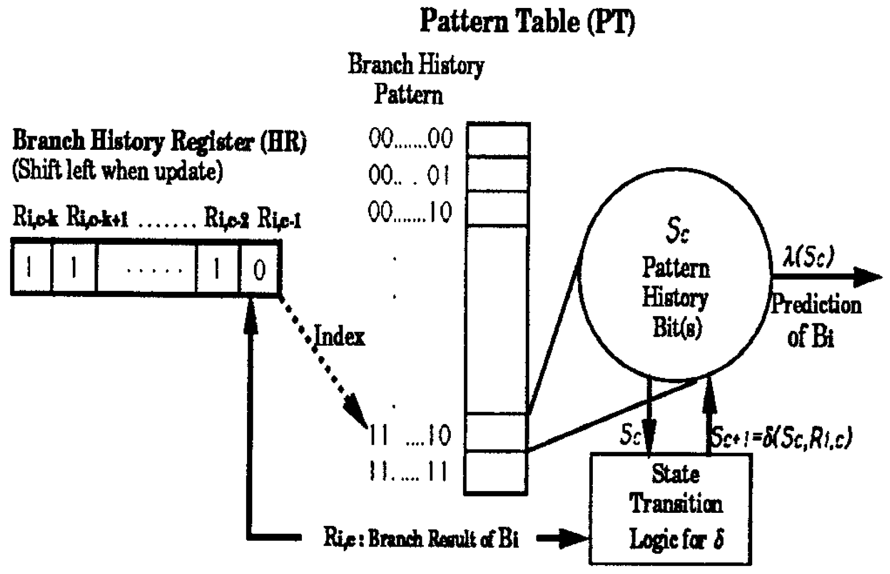
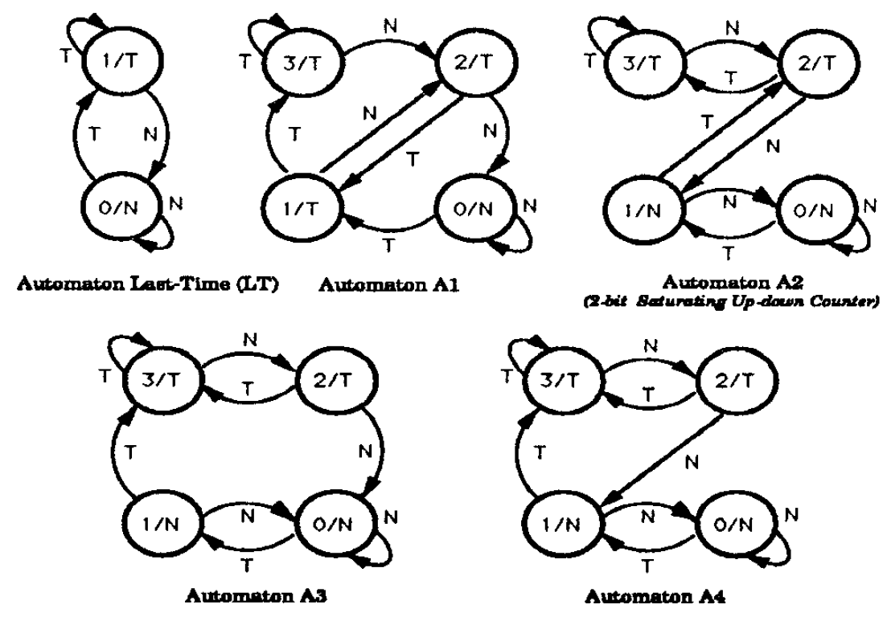

## Two-Level Adaptive Training Branch Prediction (MICRO 1991)

这篇工作为密西根大学Yale N. Patt团队发表在1991年的MICRO上，主要内容为两级动态分支预测，该方案不仅考虑当前分支的前s次的表现，而且还综合考虑从该分支最近n次的情况。一作为Tse-Yu Yeh，通信作者为Yale N. Patt。

如上图所示，该分支预测器分为两部分，左侧的Branch History Register和右侧的Pattern Table。

- 左侧的HR记录当前指令为止最近k次分支预测的结果，每个结果用1 bit来表示，"0"表示Not Taken，"1"表示Taken。从左到右代表时间从早到晚，分别为$R_{i,c-k}, R_{i,c-k+1}, ... , R_{i,c-2}, R_{i,c-1}$。每次执行到一个新的分支，该寄存器左移1位，并将新的结果（branch resolved之后的实际结果而非预测结果）填充HR的LSB。由于需要针对不同的分支记录不同的历史，因此后面我们会看到HR也是一个寄存器表(HRT)。
- 右侧的PT记录的是全局分支的判断，并且实时更新。比如可以使用1 bit来表示Taken和Not Taken，也可以用2 bits来表示Bimodal等。

具体的工作流程为：

- 当前分支指令的PC值用于索引HR，找到对应的分支历史。
- HR中分支历史寄存器值用于索引PT，找到当前分支的预测结果$z_c=\lambda(S_c)$。
- 分支结果得到之后，更新HR和PT。更新HR直接左移对应HR寄存器，并将新的结果写入LSB。而对于PT的更新则可以采用不同的策略，用公式表示为$S_{c+1}=\delta(S_c, R_{i,c})$

Trade-off:

- 存储容量，包括HR的长度k，这也决定了PT的entry数为$2^k$。HR Table的entry数。
- HRT的索引方式。由于容量限制，不可能在HRT中为workload中的分支指令分配一个entry。在本文中介绍了三种实现方式：
  - AHRT (Associative History Register Table)。该方案将HRT设置成一个组相联的Cache，并且采用LRU的更新策略。
  - HHRT (Hash History Register Table)。该方案使用PC值进行hash之后的结果寻址HRT。
  - IHRT (Ideal History Register Table)。假设理想的HRT用于无限的entry，用于评估该方案的准确率上限。
  - PT更新策略。PT的更新策略可以是如下所示的状态机。
	
	

实现中需要考虑的几个点：

- 每次需要一个新的分支，需要顺序对两个table进行查找，首先需要寻址HR，然后再根据查找到的地址索引PT。这两个步骤很难在一个时钟周期内完成。本文中提出的解决方案为：在更新PT时，即可预测下一次是否会命中，并将此预测结果保存为HR的1 bit。这样下次遇到该分支，直接访存HR就可以得到预测结果。
- 实验结果表明，大约60%的分支为Taken，因此HR初始化为全1。这在仿真的时候其实无所谓，因为有warmup。
- 当HR被替换时，不需要重新初始化该寄存器。

**Results:**

Two-Level Adaptive Training Branch Prediction achieves 97% accuracy on 9 of the ten SPC benchmarks.