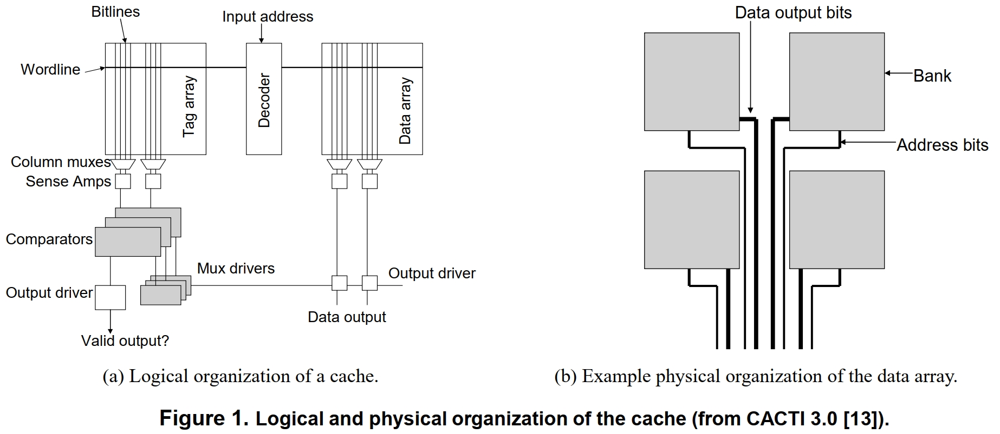
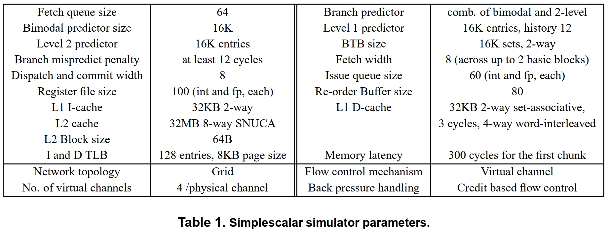
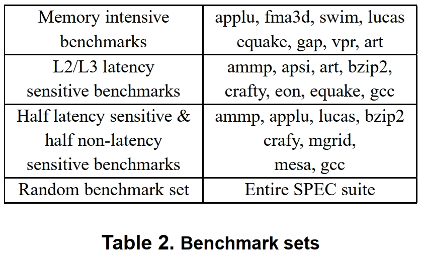
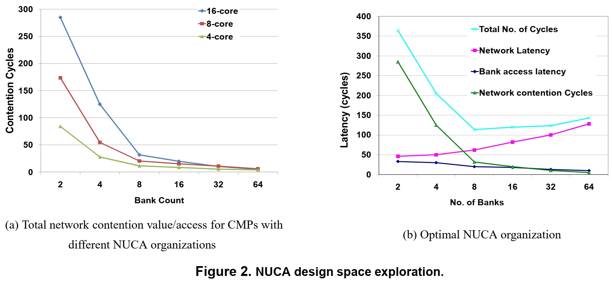
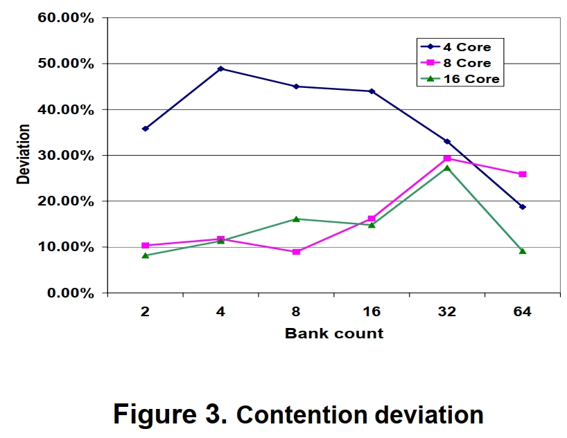
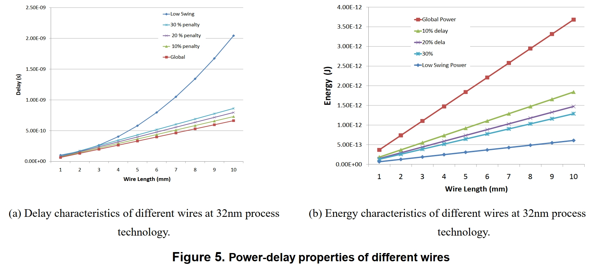
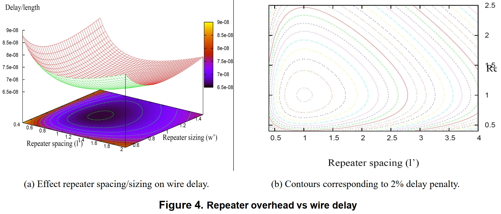
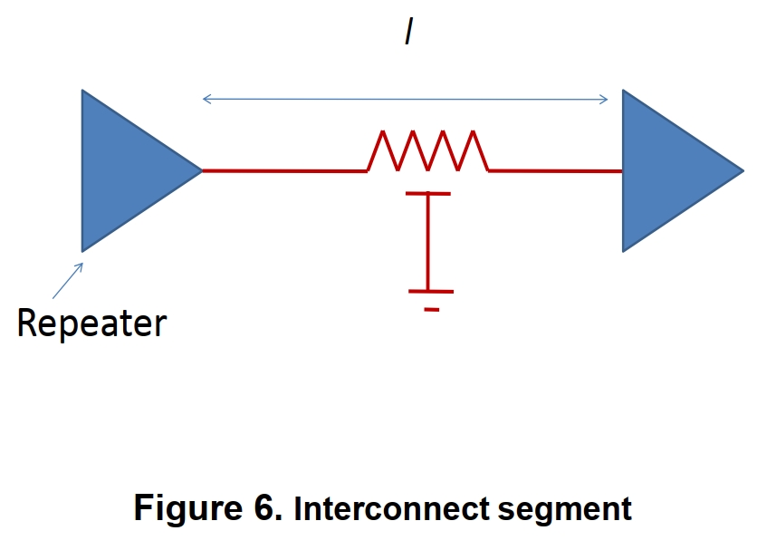
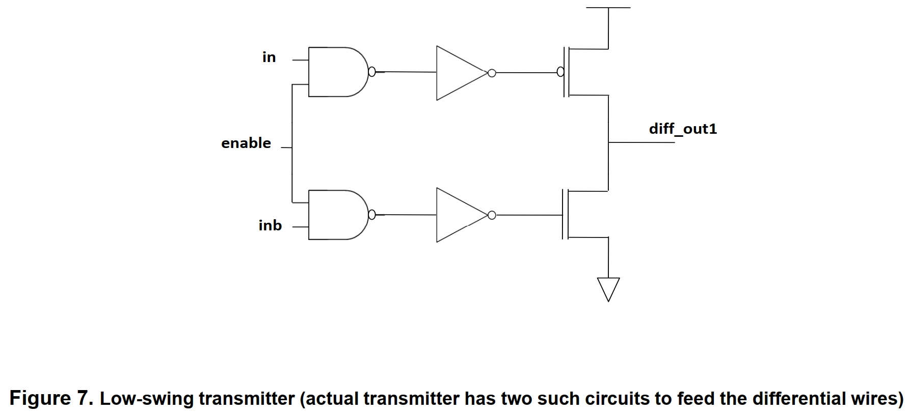
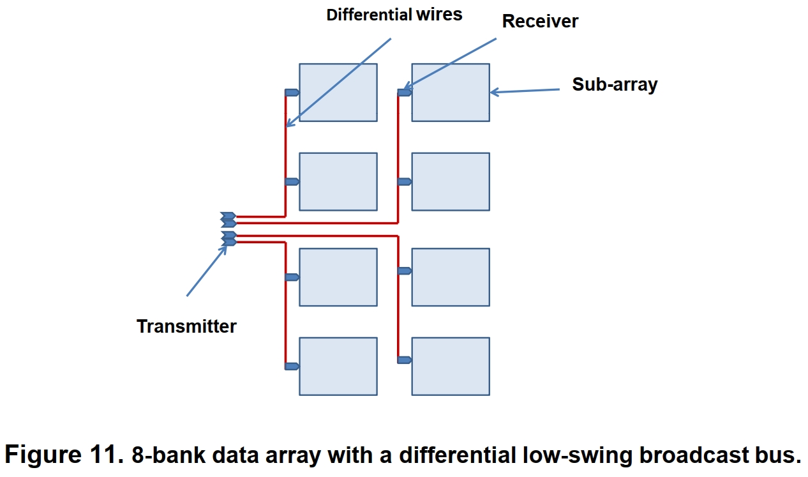

# CACTI 7.0介绍

## 1. CACTI发展
CACTI是HP公司推出的一款开源开源工具，广泛应用于对cache/DRAM的延时，功耗，cycle time[^1]和面积的评估。

[^1]: <font color=gray>(暂时不知道如何翻译比较好，感觉前面的延时指的是各个部分的延时信息，这边的cycle time应该指的是访问周期)</font>

CACTI最初由Dr. Jouppi和Dr. Wilton于1993年开发，此后经历了六次版本的迭代。

## 2. CACTI支持的特性

- 以下memory的功耗、延时、cycle time的建模
  - direct mapped caches
  - set-associative caches
  - fully associative caches
  - Embedded DRAM memories
  - Commodity DRAM memories
- 多端口UCA(uniform cache access)，多端口的NUCA(non-uniform cache access)的建模
- 工作温度对泄露功耗的影响
- 路由功耗模型
- 具有不同延迟、功耗和面积属性的互连模型，包括低摆幅线模型
- 用于执行功率、延迟、面积和带宽之间权衡分析的接口
- 该工具使用的所有工艺特定值均从 ITRS 获得，目前该工具支持 90nm、65nm、45nm 和 32nm 技术节点
- 用于计算DDR总线延迟和能量的芯片IO模型。用户可以模拟不同的负载（扇出）并评估对频率和能量的影响。该模型可用于研究LR-DIMM、R-DIMM等。
- Version 7.0在6.5版本的基础之上还融合了CACTI 3D

## 3. CACTI的使用方法

```bash
git clone https://github.com/HewlettPackard/cacti
cd cacti
# modify the xxx.cfg for self configuration
make
./cacti -infile xxx.cfg
```

## CACTI 6.0: A Tool to Model Large Caches

未来的处理器可能会拥有大型片上缓存，并有可能在 3D 堆叠设计中将整个芯片专用于片上存储。随着晶体管和线延迟之间的差距越来越大，这种大型缓存的特性将主要取决于连接缓存各个子模块的互连网络的特性。 CACTI 6.0 是该工具的显着增强版本，主要侧重于大型缓存的互连设计。除了加强现有的主要缓存组件分析模型之外，CACTI 6.0 还包括对早期版本的两个主要扩展：第一，对非统一缓存访问 (NUCA) 建模的能力，第二，对不同类型建模的能力线，例如具有不同功率、延迟和面积特性的基于 RC 的线以及差分低摆幅总线。该报告详细介绍了为新添加的模块假设的分析模型及其验证分析。

### 1. 背景



本节介绍 CACTI 缓存访问模型的一些基础知识。图 1(a) 显示了统一缓存访问 (UCA) 组织的基本逻辑结构。对缓存的地址请求首先作为输入提供给解码器，然后激活数据阵列和标签阵列中的字线。整行的内容被放置在位线上，然后被感测。这样从标签阵列中读出的多个标签与输入地址进行比较，以检测该组的其中一种方式是否确实包含所请求的数据。该比较器逻辑驱动多路复用器，该多路复用器最终将从数据阵列中读出的最多一种方式转发回请求处理器。本节介绍了 CACTI 缓存访问模型的一些基础知识。图 1(a) 显示了统一缓存访问 (UCA) 组织的基本逻辑结构。对缓存的地址请求首先作为输入提供给解码器，然后激活数据阵列和标签阵列中的字线。整行的内容被放置在位线上，然后被感测。这样从标签阵列中读出的多个标签与输入地址进行比较，以检测该组的其中一种方式是否确实包含所请求的数据。该比较器逻辑驱动多路复用器，该多路复用器最终最多将从数据阵列中读出的一种方式转发回请求处理器。

CACTI 缓存访问模型将以下主要参数作为输入：缓存容量、缓存块大小（也称为缓存行大小）、缓存关联性、工艺节点、端口数和独立bank数（不共享地址和数据线）。 作为输出，它产生最小化延迟（除了少数例外）的缓存配置，以及它的功率和面积特性。 CACTI 对八个主要缓存组件的延迟/功率/面积进行建模：解码器、字线、位线、检测放大器、比较器、多路复用器、输出驱动器和组间连线。 字线和位线延迟是访问时间的两个最重要的组成部分。 字线和位线延迟分别是每个阵列的宽度和高度的二次函数。

在实践中，标签和数据数组足够大，将它们实现为单个大型结构是低效的。 因此，CACTI 对每个存储阵列进行分区（在水平和垂直维度上）以产生更小的子阵列并减少字线和位线延迟。 位线被分割成Ndbl 不同的段，字线被分割成Ndwl 段，依此类推。 每个子阵列都有自己的解码器，现在需要一些中央预解码来将请求路由到正确的子阵列。 CACTI 对不同的子阵列计数（Ndbl、Ndwl 等的不同值）和子阵列纵横比进行详尽的搜索，以计算具有最佳总延迟的缓存组织。 一个缓存可以被组织成少数bank。 缓存的物理结构示例如图 1(b) 所示。

### 2. CACTI 术语

以下是CACTI各个版本引入的关键字列表。

- **Bank:** 由数据和标签数组组成的内存结构。 一个高速缓存可以分成多个组，CACTI 假设有足够的带宽，以便可以同时访问这些组。 互连这些 bank 的网络拓扑可能因缓存模型（UCA 或 NUCA）而异。
- **Sub-arrays:** 一个数据或标签阵列被分成多个子阵列以减少由于字线和位线引起的延迟。 与bank不同，在任何给定时间，这些子阵列仅支持一次访问。 缓存中Sub-array的总数等于 Ndwl 和 Ndbl 的乘积。
- **Mat:** 一组共享一个公共中央预解码器的四个子阵列 (2x2)。 CACTI 的详尽搜索从至少一个Mat开始。
- **Sub-bank:** 在典型的缓存中，缓存block分散在多个子阵列中以提高缓存的可靠性。 不考虑缓存组织，CACTI 假设缓存中的每个缓存block都分布在整个mat行中，并且特定block对应的行号是根据块地址确定的。 阵列中（Mat）的每一行称为sub-bank。
- **Ntwl/Ndwl (Number of tag/data wordline):** 标签或数据阵列中的水平分区数，即单个字线被分区成的段数。
- **Ntbl/Ndbl (number of tag/data bitline):** 标签或数据阵列中的垂直分区数，即单个位线被分割成的段数。
- **Ntspd/Nspd:** 存储在sub-array每一行中的set数。对于给定的 Ndwl 和 Ndbl 值，Nspd 决定sub-array的纵横比。
- **Ntcm/Ndcm:** 位线复用程度。
- **Ntsam/Ndsam:** 感测放大器多路复用的程度。

### 3. CACTI 6.0 中的新功能

CACTI 6.0 附带了许多新功能，其中大部分功能旨在提高该工具对大型缓存进行建模的能力。

- 为bank间网络整合了许多不同的线模型：本地/中间/全局布线、中继器尺寸/间距以获得最佳延迟或功率、低摆幅差分电线。
- 合并路由器组件（缓冲器、交叉开关、仲裁器）的模型。
- 介绍 NUCA 的网格拓扑结构和具有低摆幅线的 UCA 共享总线架构。
- 一种设计空间探索算法，可对不同的网格布局进行建模并估计平均bank和网络延迟。 设计空间探索还考虑了不同的布线和路由器类型。
- 引入经验网络争用模型来估计网络配置、bank周期时间和工作负载对平均缓存访问延迟的影响。
- 改进和更准确的字线和位线延迟模型。
- 对所有新电路模型的验证分析：低摆幅差分线、高速缓存组内字线和位线的分布式 RC 模型（路由器组件已在其他地方得到验证）。
- 一个改进的界面，可以对延迟、功率、周期时间和面积进行权衡分析。

### 4. NUCA建模

CACTI 的早期版本采用统一缓存访问 (UCA) 模型，其中缓存的访问时间由访问最远子阵列的延迟决定。 为了启用流水线，使用 H 树网络连接缓存的所有子阵列。 对于大型缓存，这种统一模型可能会遇到非常高的命中延迟。 对于未来的大型缓存，一种更具可扩展性的方法是用包交换片上网格网络替换 H 树总线。 存储体的延迟取决于在包含数据的存储体与缓存控制器之间路由请求和响应的延迟。 这种 NUCA 模型首先由 Kim 等人提出，并已成为许多架构评估的主题。CACTI 6.0 建立在该模型的基础上，并采用以下算法来识别最佳 NUCA 组织。

该工具首先迭代多个bank组织：将缓存划分为$2^N$个bank（其中N从1到12不等）；对于每个N，bank被组织在一个具有$2^M$行的网格中（其中M从0到N变化）。对于每个bank组织，CACTI 5.0用于确定每个bank内缓存的最佳子阵列分区。每个bank都与一个路由器相关联。缓存访问的平均延迟是通过估计到每个bank的网络跳数、每个跳上遇到的线路延迟以及每个bank内的缓存访问延迟来计算的。我们进一步假设通过路由器的每次遍历占用R个周期，其中R是用户指定的输入。路由管道可以通过多种方式设计：通常提倡四级流水线[4]，最近也有人提出了占用三、二和一个流水线级的推测流水线 [4, 8, 11]。虽然我们为用户提供了选择激进或保守路由器的选项，但该工具默认使用具有三个阶段的适度激进的路由器流水线。用户还可以灵活地指定网络的工作频率（默认为 5 GHz）。然而，基于工艺技术和路由器模型，该工具将计算最大可能的网络频率[11]。如果假定频率大于最大可能值，该工具会将网络频率降级到最大值。

在上面的 NUCA 模型中，更多的分区导致每个组内的延迟（和功率）更小，但网络上的延迟（和功率）更大（因为与每个路由器和解码器相关的恒定开销）。因此，需要上述设计空间探索来估计产生最佳延迟或功率的缓存分区。上述算法最近由 Muralimanohar 和 Balasubramonian [9] 提出。虽然该算法可以保证以尽可能低的延迟或功耗找到缓存结构，但对于多核处理器模型而言，缓存的带宽可能仍然不够。为了解决这个问题，CACTI 6.0 通过更详细地对网络中的竞争进行建模，进一步扩展了该算法。这种争用模型本身有两个主要组成部分。如果缓存被划分为许多组，网络上的路由器/链接就会更多，两个数据包在路由器上发生冲突的概率就会降低。因此，多组缓存更能满足多核系统的带宽需求。此外，存储体中高速缓存访​​问的某些方面不容易流水线化。缓存访问中最长的此类延迟（通常是位线和读出放大器延迟）代表存储体的循环时间——它是对该存储体的连续访问之间的最小延迟。多组缓存具有相对较小的组和相对较短的循环时间，因此一旦将请求传送到组，它就可以支持更高的吞吐量和更短的等待时间。这两个组件（路由器上的低争用和bank的低争用）都倾向于支持多bank系统。这方面也包括在估计给定缓存配置的平均访问时间中。

为了改进 NUCA 模型的搜索空间，CACTI 6.0 还针对相邻路由器之间的链路探索了不同的路由器类型和线路类型。 导线被建模为低摆幅差分导线以及具有不同中继器配置的全局导线，以在功率/延迟/面积谱中产生许多点。 路由器内缓冲区和虚拟通道的大小对路由器功耗以及重负载下的路由器竞争有重大影响。 通过改变每个物理通道的虚拟通道数量和每个虚拟通道的缓冲区数量，我们能够在路由器功率延迟权衡曲线上实现不同的点。





每个考虑的 NUCA 缓存组织的争用值是针对典型工作负载凭经验估计的，并作为查找表合并到 CACTI 6.0 中。对于所考虑的每个网格拓扑（对于 N 和 M 的不同值），我们模拟了源自单核、两核、四核、八核和十六核处理器的 L2 请求。每个内核都执行来自 SPEC 基准测试套件的混合程序。我们将基准集分为四类，如表 2 所述。对于每个 CMP 组织，我们运行四组模拟，对应于列表中的每个基准集。生成的缓存流量然后在支持虚拟通道流量控制的详细网络模拟器上建模。表 1 中列出了架构和网络模拟器的详细信息。路由器和bank的争用值（各种工作负载的平均值）是针对每个网络拓扑和银行周期时间估算的。根据用户指定的输入，在设计空间探索期间会考虑查找表中的适当争用值。

对于具有完全流水线链路和路由器的网络，这些争用值只是路由器拓扑和 bank 周期时间的函数，不会受到工艺技术或 L2 缓存大小的影响。如果使用 CACTI 来计算最佳 L3 缓存组织，则争用值可能会小得多，因为 L2 缓存过滤掉了许多请求。为了处理这种情况，我们还计算了假设有2 MB L1缓存的平均争用值，并且这也被合并到模型中。总之，网络争用值受以下参数影响：M、N、bank周期时间、核心数、路由器配置（VC、缓冲区）、先前缓存的大小。 我们计划继续使用其他相关工作负载集的经验争用值来增强该工具，例如具有来自缓存一致性的大量流量的商业、多线程和事务性基准测试。



图 2(b) 显示了 32 MB NUCA L2 缓存的示例设计空间探索，同时尝试将延迟降至最低。 X 轴显示了缓存被划分成的bank数。 对于 X 轴上的每个点，考虑了许多不同的bank组织，最终在图表上表示具有最佳延迟（所有bank的平均值）的组织。 Y 轴代表这个最佳延迟，它被进一步分解以代表影响因素：bank访问时间、链路和路由器延迟、路由器和bank争用。 我们观察到当缓存被组织为一个 2 × 4 的 8 个 bank 网格时，会遇到最佳延迟。



如前所述，图 2 中的争用值对应于表 2 中列出的不同基准集的平均值。根据基准集的选择，实际网络争用可能会偏离此平均值。 图 3 显示了不同内核数的争用值的百分比偏差。 再一次，争用值是通过从每个基准测试集运行“n”个不同的工作负载获得的，其中“n”等于 CMP 中的内核数。 对于 16 核和 8 核模型，竞争值的偏差对最佳 NUCA 配置的影响可以忽略不计。 但是，对于某些四个核心模型，最佳bank数量会随着基准的选择而变化。 根据bank周期时间，网络争用通常占 NUCA 访问时间的 25% 左右。 在最坏的情况下，使用平均网络争用值进行设计空间探索最多可能导致 NUCA 访问时间的 10% 错误。

#### 4.1 互连模型

随着工艺技术的缩小，互连在决定大型结构的功率和性能方面发挥着越来越重要的作用。 在深亚微米时代，大型缓存的特性受到互连模型选择的严重影响 [9, 10]。 该工具的另一项主要增强功能可显著改善搜索空间，其中包含具有不同功率和延迟特性的不同线路模型。导线的特性取决于许多因素，如尺寸、信号、工作电压、工作频率等。根据信号策略，RC 电线可分为两大类：1. 传统全摆幅导线，2. 差分、低摆幅、低功率导线。



RC线的延迟随其长度成二次方增加。为避免这种二次关系，一条长线通常以固定间隔与中继器交错。这使得延迟成为线长的线性函数。但是，定期使用中继器需要这些电线的电压电平在整个范围 (0-Vdd) 内摆动才能正常运行。鉴于电压和功率之间的二次关系，这些全摆幅导线伴随着非常高的功率开销。图 5 显示了不同工艺技术的全局线的延迟和功率值。



随着功率成为主要瓶颈，不可能只关注性能。或者，我们可以通过延迟惩罚来改善这些电线的功率特性。在典型的长全摆幅导线中，中继器是互连电源的主要贡献者之一。图4(a)显示了中继器尺寸和间距对线路延迟的影响。图4(b)显示了对应于不同中继器配置的2%延迟惩罚增量的轮廓。正如我们所见，通过容忍延迟惩罚，可以显着减少中继器开销。图5显示了采用不同工艺技术的10%、20%和30%延迟惩罚的不同导线的功率值。

全局布线高功耗的主要原因之一是中继器强加的全摆幅要求。虽然我们可以通过减小中继器尺寸和增加中继器间距来在一定程度上降低功率要求，但要求仍然相对较高。低电压摆幅替代方案代表了另一种改变导线功率/延迟/面积权衡的机制。降低全局电线上的电压摆幅可导致功率线性降低。此外，假设为低摆幅驱动器使用单独的电压源将导致功率的二次方节省。然而，这些有利可图的节电伴随着许多警告。由于我们不能再使用中继器或锁存器，低摆幅线的延迟随长度成二次方增加。由于这种线不能流水线化，因此它们的吞吐量也较低。低摆幅线需要特殊的发射器和接收器电路来生成和放大信号。这不仅增加了每比特的面积要求，而且在每个比特遍历的延迟和功率方面分配了固定成本。尽管存在这些问题，但通过低摆幅信号实现的节能使其成为一种有吸引力的设计选择。设计低摆幅导线及其开销的详细方法将在后面的部分中描述。一般来说，低摆幅线具有优越的功率特性，但会产生高面积和延迟开销。图 5 比较了低摆幅导线与全局导线的功率延迟特性。

### 5. 分析模型

以下部分讨论了不同线路的分析延迟和功率模型。计算晶体管和导线寄生所需的所有工艺特定参数均从ITRS中获得。

#### 5.1 线寄生

导线每单位长度的电阻和电容由以下等式给出：

$$R_{wire}=\frac{\rho}{d*(thinknesss - barrier)(width-2barrier)}  \tag{1}$$

其中，d (< 1) 是凹陷效应造成的横截面积损失，ρ 是金属的电阻率。

$$C_{wire}=\epsilon_0(2K\epsilon_{horiz}\frac{thickness}{spacing}+2\epsilon_{vert}\frac{width}{layerspacing})+fringe(\epsilon_{horiz},\epsilon_{vert})  \tag{2}$$

在上面的电容方程中，第一项对应于侧壁电容，第二项模拟由于相邻层中的导线引起的电容，最后一项对应于侧壁和基板之间的边缘电容。

#### 5.2 全局布线



对于长中继导线，图 6 所示互连片段的单极时间常数模型由下式给出，

$$\tau=(\frac{1}{l}r_s(c_0+c_p)+\frac{r_s}{s}C_{wire}+R_{wire}sc_0+0.5R_{wire}C_{wire}l \tag{3}$$

在上述等式中，$c_0$是最小尺寸中继器的电容，$c_p$是其输出寄生电容，$r_s$是其输出电阻，$l$是中继器之间互连段的长度，$s$是标准化为最小值的中继器尺寸。对于给定的工艺技术，$c_0$、$c_p$和$r_s$的值是恒定的。导线寄生参数$R_{wire}$和$C_{wire}$代表每单位长度的电阻和电容。最佳中继器尺寸和间距值可以通过将方程3相对于s和l微分并将其等于零来计算。

$$L_{optimal}=\sqrt{\frac{2r_s(c_0+c_p)}{R_{wire}C_{wire}}} \tag{4}$$

$$S_{optimal}=\sqrt{\frac{r_sC_{wire}}{R_{wire}c_0}}  \tag{5}$$

使用上述 Loptimal 和 Soptimal 计算的延迟值保证具有最小值。 总功耗是三个主要分量的总和（公式 6）。

$$P_{total}=P_{switching}+P_{short-circuit}+P_{leakage} \tag{6}$$

互连的动态和泄漏分量使用等式 7 和 8 计算。

$$P_{dynamic} = \alpha V_{DD}^2 f_{clock} (\frac{S_{optimal}}{L_{optimal}}(c_p + c_0) + c) \\+ (\alpha V_{DD} W_{min} I_{SC} f_{clock} log_e3) S_{optimal}\frac{\tau}{L_{optimal}}$$

$f_{clock}$是工作频率，$W_{min}$是晶体管的最小宽度，$I_{SC}$是短路电流，值 $(\tau/L)_{optimal}$ 可以从等式 7 计算出来。

$$(\frac{\tau}{L})_{optimal} = 2\sqrt{r_sc_0rc}(1+\sqrt{0.5*(1+\frac{c_p}{c_0})}) \tag{7}$$

$$P_{leakage}=\frac{3}{2} V_{DD} I_{leak} W_n S_{optimal} \tag{8}$$

$I_{leak}$是漏电流，$W_n$是nMOS晶体管的最小宽度。

使用上述等式，我们可以计算全局和半全局线路的延迟和功率。通过增加线宽和线之间的间距可以获得比全局线更快的线。中继器间距和尺寸与等式4和5不同的电线将导致延迟损失。对于给定的延迟损失，功率最佳中继器尺寸和间距可以从图4(b)所示的轮廓中获得。实际计算涉及求解一组微分方程。

#### 5.3 低摆线

低摆幅互连系统由三个主要组件组成：(1) 生成和驱动低摆幅信号的发送器，(2) 双绞差分线，以及 (3) 接收器放大器。

##### 5.3.1 发送器

对于具有时间常数$\tau$的 RC 树，具有有限上升时间的输入的电路延迟由等式 9 给出

$$delay_r = t_f \sqrt{[log \frac{\nu_{th}}{V_{dd}}]^2 + 2t_{rise}b(1-\frac{\nu_{th}}{V_{dd}})/t_f} \tag{9}$$

其中，$t_f$是树的时间常数，$\nu_{th}$是晶体管的阈值电压，$t_{rise}$是输入信号的上升时间，b是输出变化的输入摆幅的分数（我们假设b是0.5）。

对于下降输入，方程变为

$$delay_f = t_f \sqrt{[log (1-\frac{\nu_{th}}{V_{dd}})]^2 + \frac{2t_{fall}bV_{dd}}{t_f V_{dd}}} \tag{10}$$

其中，$t_{fall}$是输入的下降时间。 对于下降输入，我们对b使用 0.4 的值。

为了对初始输入信号上升/下降时间进行合理估计，我们考虑串联连接的两个反相器。令d为第二个反相器的延迟。初始输入的$t_{fall}$和$t_{rise}$值可以近似为

$$t_{fall}=\frac{d}{1-\nu_{th}}$$

$$t_{rise}=\frac{d}{\nu_{th}}$$



对于图 7 所示的发射器电路，我们采用了 Ho 等人提出的模型。

发射器的总延迟由下式给出，

$$t_{delay} = nand_{delay} + inverter_{delay} + driver_{delay}  \tag{11}$$

上述等式中的每个门（与非、反相器和驱动器）都可以简化为一个简单的 RC 树。 后来应用霍洛维茨近似来计算每个门的延迟。 不同栅极消耗的功率可以从晶体管的输入和输出寄生参数中推导出来。


**NAND gate:**

与非门的等效电阻和电容值由下式给出，

$$R_{eq}=2*R_{nmos}$$

$$C_{eq}=2*C_{Pdrain} + 1.5*C_{Ndrain} + C_L$$

其中$C_L$是与非门的负载电容，等于下一个门的输入电容。$C_L$的值等于$INV_{size}∗(C_{Pgate}+C_{Ngate})$，其中 INV_{size}是反向器的大小，其计算将在本节后面讨论。

注意：晶体管的漏极电容是高度非线性的。在上述$C_{eq}$等式中，两个串联nMOS晶体管的有效漏极电容约为单个nMOS晶体管漏极电容的1.5倍。

$$\tau_{nand}=R_{eq}*C_{eq}$$

使用公式 10 中的$\tau_{nand}$和$t_{rise}$值，可以计算出$nand_{delay}$。与非门消耗的功率由下式给出:

$$P_{nand}=C_{eq}* V_{dd}^2$$

输入信号到下一级（非门）的下降时间 (tfall) 由下式给出

$$t_{fall}=nand_{delay}(\frac{1}{1-\nu_{th}})$$

**Driver:**

为了提高低摆幅模型的节能效果，我们假设有一个单独的低电压源来驱动低摆幅差分线。 这些驱动器的大小取决于其负载电容，而负载电容又取决于导线的长度。 为了计算驱动器的尺寸，我们首先计算 nMOS 晶体管在固定的所需上升时间为 8 个 F04 时的驱动电阻。

$$R_{drive}=\frac{-Risetime}{C_L * ln(0.5)}$$

$$W_{dr} = \frac{R_m}{R_{drive}} * W_{min}$$

在上面的等式中，$C_L$是导线的电容和感测放大器的输入电容之和。$R_m$是最小尺寸nMOS晶体管的驱动电阻，$W_{min}$是最小尺寸晶体管的宽度。

从$R_{drive}$值可以计算出 pMOS 晶体管的实际宽度。

注意：仅当电源电压设置为全Vdd时，上面计算的驱动器电阻Rdrive才有效。由于低摆幅驱动器采用单独的低电压源，因此这些晶体管的实际驱动电阻将大于由全Vdd驱动的相同尺寸的pMOS晶体管。因此，Rdrive值乘以调整因子RES ADJ以解决pMOS晶体管的较差驱动能力。基于SPICE模拟，RES ADJ值计算为8.6。

**NOT gate:**

非门的大小是通过应用逻辑努力的方法来计算的。考虑连接到驱动CL负载的非门的与非门，其中，CL等于驱动器的输入电容。让p_ef和s_ef分别代表路径努力和阶段努力。

$$s\_ef = \sqrt{(4/3) * p\_ef}$$

$$C_{NOT\_in} = \frac{(4/3) * C_L}{s\_ef}$$

$$INV_{size} = \frac{C_{NOT_in}}{C_{Ngate} + C_{Pgate}}$$

使用上述反向器尺寸，可以计算出栅极的等效电阻和电容。

$$R_{eq} = R_{pmos}$$

$$C_{eq} = C_{Pdrain} + C_{Ndrain} + C_L$$

其中反向器的CL等于(CNgate)。

$$\tau_{not} = R_{eq} * C_{eq}$$

使用上面的$\tau_{not}$和$t_{fall}$值，可以计算出$not_{delay}$。这个非门消耗的能量由下式给出

$$E_{not} = C_{eq} * V_{dd}^2$$

下一级的上升时间由下式给出

$$t_{rise} = \frac{not_{delay}}{\nu_{th}}$$


##### 5.3.2 差分线

##### 5.3.3 感应放大器

#### 5.4 路由器模型

#### 5.5 分布式字线模型

#### 5.6 分布式位线模型


### 6. UCA 模型的扩展



传统的UCA模型采用H树网络进行地址和数据通信，原因如下：它为每个bank提供统一的访问时间，从而简化了跨网络的请求流水线。除了支持传统的全摆幅、中继连线之外，CACTI 6.0还可以选择使用低摆幅连线在UCA缓存中进行地址和数据传输。由于低摆幅线不能流水线化，并且由于它们可以更好地分摊长传输中的发送器/接收器开销，因此我们在使用低摆幅线时采用了不同的网络样式。我们采用了一组跨越多个bank的简单广播总线，而不是H树网络。每条总线由一列中的一半存储体共享 - 图11显示了一个具有八个存储体的示例。存储体继续具有统一的访问时间，这由最坏情况的延迟决定。


### 7. 权衡分析

新版工具采用以下默认成本函数来评估缓存组织（考虑延迟、泄漏功率、动态功率、循环时间和面积）：

$$cost = W_{access\_time} \frac{acc\_time}{min\_acc\_time}\\ + W_{dyn\_power} \frac{dyn\_power}{min\_dyn\_power} \\ + W_{leak_power} \frac{leak\_power}{min\_leak\_power} \\ + W_{cycle\_time} \frac{cycle\_time}{min\_cycle\_time} \\ + W_{area} \frac{area}{min\_area}$$

每个术语的权重（Wacc 时间、Wdyn 功率、Wleak 功率、Wcycle 时间、Warea）表示每个术语的相对重要性，这些由用户指定为配置文件中的输入参数：

```
-weight 100 20 20 10 10
```

该工具使用的上述默认权重反映了这些指标在典型现代设计中的优先级。 此外，输入参数中的以下默认行指定了用户偏离最佳指标集的意愿：

```
-deviate 1000 1000 1000 1000 1000
```

上面一行表明我们愿意考虑这样一种缓存组织，其中每个指标（例如访问时间）与可能的最低访问时间相差 1000%。 因此，这组默认输入参数指定了一个很大程度上不受约束的搜索空间。 以下输入行限制该工具识别产生最少功率同时最多放弃 10% 性能的缓存组织：

```
-weight 0 100 100 0 0
-deviate 10 1000 1000 1000 1000
```

CACTI 6.0 还将$ED$或$ED^2$值作为其成本函数的输入，以确定具有最佳能量延迟或能量延迟平方乘积的缓存组织。

### 8. 验证

<!-- 在这项工作中，我们主要关注验证添加到框架中的新模块。这包括低摆幅线、路由器组件以及改进的位线和字线模型。由于SPICE结果取决于晶体管的模型文件，我们首先讨论对CACTI最新版本（第5版）所做的技术建模更改，然后详细介绍我们验证CACTI 6.0新添加组件的方法。 -->

### 9. 用法

CACTI 的先前版本将缓存参数（例如缓存大小、块大小、关联性和技术）作为命令行参数。 除了支持命令行输入外，CACTI 6.0 还采用了一个配置文件（cache.cfg），使用户能够更详细地描述缓存参数。 以下是 CACTI 6.0 中有效的命令行参数：

```
C B A Tech NoBanks
and / or
-weight <delay> <dynamic> <leakage> <cycle> <area>
and / or
-deviate <delay> <dynamic> <leakage> <cycle> <area>
C - Cache size in bytes
B - Block size in bytes
A - Associativity
Tech - Process technology in microns or nano-meter
NoBanks - No. of UCA banks
```

CACTI 6.0 中的命令行参数是可选的，并且可以使用配置文件进行更全面的描述。 可以在 cache.cfg 文件中指定的其他非标准参数包括，

- 缓存中读端口、写端口、读写端口的数量
- H树总线宽度
- 工作温度（用于计算缓存泄漏值），
- 自定义标签大小（可用于对分支目标缓冲区、缓存目录等特殊结构进行建模）
- 缓存访问模式（快速 - 低访问时间但耗电；顺序 - 高访问时间但低功耗；正常 - 在功耗和延迟方面不太积极）
- 缓存类型（DRAM、SRAM 或简单的暂存 RAM，例如不需要标签阵列的寄存器文件）
- NUCA bank数目（默认情况下，CACTI 计算最佳bank数目。但是，用户可以强制该工具使用特定的 NUCA bank数目）
- 核心数
- 缓存级别 - L2 或 L3（核心计数和缓存级别用于计算 NUCA 模型的争用值）
- 设计目标（NUCA 和 UCA 的权重和偏差参数）

随发行版提供的默认 cache.cfg 文件中提供了有关每个参数的更多详细信息。

### 10. 结论

该报告详细介绍了 CACTI 缓存建模工具的主要修订以及新添加组件的分析模型的详细说明。互连在决定大型缓存的延迟和功率值方面发挥着重要作用，我们扩展了 CACTI 的设计空间探索，以仔细考虑互连组件的许多不同实现选择，包括不同的线路类型、路由器、信令策略和竞争建模。我们还为各种 NUCA 缓存添加了建模支持。 CACTI 6.0 在功率延迟面积曲线上确定了许多相关的设计选择。 CACTI 6.0 的估计值可能与 CACTI 5.0 的估计值有很大不同，尤其是在更充分地探索功率延迟权衡空间时。 CACTI 6.0 能够识别可以将功耗降低三倍的缓存配置，同时会导致 25% 的延迟损失。我们根据 SPICE 仿真验证了该工具的组件，并在分析模型和晶体管级模型之间显示出良好的一致性。