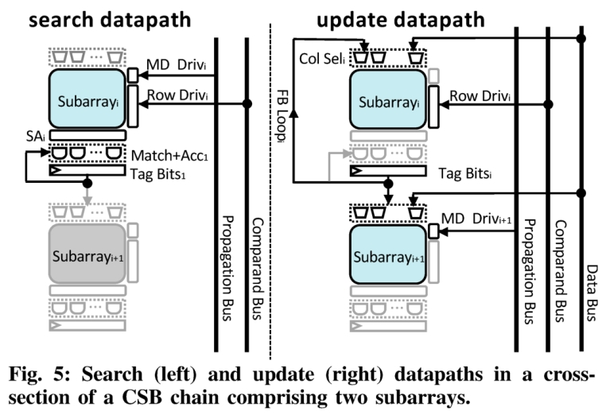

# CAPE: A Content-Addressable Processing Engine

<!-- TOC -->

- [CAPE: A Content-Addressable Processing Engine](#cape-a-content-addressable-processing-engine)
	- [Introduction](#introduction)
	- [关联计算（Associative Computing）](#关联计算associative-computing)
	- [Overview of CAPE](#overview-of-cape)
	- [CAPE的CSB](#cape的csb)
		- [Cell和Subarray](#cell和subarray)
		- [Data Layout](#data-layout)
		- [外围逻辑](#外围逻辑)
		- [传输链](#传输链)
	- [支持归约运算](#支持归约运算)
	- [CAPE架构](#cape架构)
		- [ISA](#isa)
		- [CAPE微架构](#cape微架构)
		- [异常处理](#异常处理)
		- [向量控制单元（Vector Control Unit）](#向量控制单元vector-control-unit)
		- [VMU](#vmu)
		- [可重构活动窗口](#可重构活动窗口)
		- [CAPE 的矢量化](#cape-的矢量化)
	- [Evaluation](#evaluation)
		- [微操作建模](#微操作建模)
		- [指令建模](#指令建模)
		- [系统建模](#系统建模)
	- [Reference](#reference)

<!-- /TOC -->

## Introduction

起源于上世纪七十年代的内容可寻址并行处理器(Content-addressable parallel processor, CAPP)设计扩展了CAM的功能，使其能够并行更新多行。通过对此类搜索/更新操作进行排序，CAPP 设计还可以以大规模并行和双串行方式执行各种算术和逻辑运算（称为关联算法）。
最近的一些研究也提倡在现代微架构中利用CAPP。但是现在提出的解决方案存在以下问题：

- 包含新兴存储技术；
- 使用昂贵的12T存储比特单元；
- 需要低级编程，或具有自定义编译流程的限制性编程语言。

本文的思路：探究经典CAPP背后的理念能否用于构建一个完全基于CMOS的通用架构的微处理器，能够达到多倍加速的同时保持高度可编程性。

本文的工作：对内容可寻址处理引擎 (Content-Addressable Processing Engine, CAPE) 进行了全栈设计，该引擎由密集的push rule 6T SRAM阵列构建而成。CAPE可使用带有标准向量扩展的RISC-V ISA进行编程。

本文的贡献：

1. 基于CMOS实现密集6T SRAM阵列的具有关联计算能力的引擎。
2. 这些 SRAM 阵列上的优化数据布局可最大化操作数局部性。
3. 可以对数以万计的向量元素执行数据并行计算的微架构组织。
4. 一个系统架构，能够执行有效的数据传输，以保持其固有的大规模并行计算能力的优势。
5. 标准 RISC-V ISA 到此微体系结构的映射，具有通用性、高度可编程性以及与现有编译流程的兼容性。

## 关联计算（Associative Computing）

关联计算引擎：1）以向量形式存储数据，2）可以并行（搜索）将键与所有向量元素进行比较，3）可以使用新值（更新）批量更新所有匹配元素。

以对一个向量所有元素进行增加1操作，如图1所示，关联计算引擎首先将所有向量元素的最低有效位加 1 并记住任何进位。 然后，对于每个元素，它会将相应的进位添加到下一位；继续这一过程。 当然，关联计算引擎本身不能“添加”位。相反，它通过一系列搜索-更新对实现按位加法，这些对基本上遵循半加法器的真值表，一次一个位组合：1) 搜索第 i 位为 0 的向量元素，并为其运行进位元素（存储的额外位）为1，然后将匹配元素的第 i 位批量更新为 1，并将其运行进位改为 0。 2）搜索第 i 位为 1 且该元素的运行进位也是 1 的向量元素 ，然后将匹配元素的第 i 位批量更新为 0，并将运行的进位更新为 1。
以图一为例，对向量a={0,1,2}中所有元素进行加1操作，得到a={1,2,3}。操作流程如下：

1. 操作数映射到计算引擎中，如左上角所示，数据按行进行存储，每一行存储的值为$[c_i, a_i]$，因此，每一列对应的数据的同一比特位。开始$c_0, c_1, c_2$都初始化为1，即将加1的操作数存放到进位中。
2. 第一次搜索-更新：更新最低位0->1翻转情况。从bit-wise加法的真值表可以看出$a_i$值只会在一种情况下($c_i=1, a_i=0$)发生0->1翻转，因此通过CAM搜索$1X0$，匹配的行对应的$a_0$翻转为1。同时根据真值表，对应的进位也需要更新为0，如图1最上面的第1行和第3行数据。
3. 第二次搜索-更新：更新最低位1->0翻转情况。从bit-wise加法的真值表可以看出$a_i$值只会在一种情况下($c_i=1, a_i=1$)发生1->0翻转，因此通过CAM搜索$1X1$，匹配的行对应的$a_0$翻转为0。同时根据真值表，对应的进位也保持为1，如图1中间图片的第2行数据。
4. 继续对高比特数据逐比特重复第2，3步操作，区别在于进位不需要初始化，直接利用低一比特的进位计算结果，如图1最下行图片所示，图中由于进位全为0，因此不需要继续计算下去，任务结束。

从上面介绍的实例来看，关联计算存在三个开销：

1. 每行需要维持2 bits数据，分别作为进位和匹配tag，但是可以被所有bit复用；
2. 每次只能搜索2 bits数据，进位$c$和当前计算比特位$a_i$，因此需要屏蔽其他比特位；(note: 通过一般的TCAM屏蔽需要改写CAM中存储的数据，这时候[1](#refer-anchor-1)的工作就特别合适了。)
3. 实现增量操作指令的操作序列需要存储在某个位置。

## Overview of CAPE

CAPE的结构如图2所示，由四部分组成：Control Processor，VMU，VCU和CSB。CP是一个小的RISC-V指令集顺序核，其执行标量指令，并将向量指令卸载到CSB执行。其中Load /Store向量指令通过VMU链接到CSB，其他的向量指令则通过VCU将产生微代码序列发送到CSB执行。

在向量指令执行时，接下来的标量指令可以继续发射核执行，但是不会提交指令，随后的向量指令则会等待向量指令提交。

## CAPE的CSB

### Cell和Subarray

Cell和Subarray以及读/写/搜索过程参考[1](#refer-anchor-1)。

### Data Layout

CSB的数据结构如图4所示，左上角是单个向量存储到寄存器里面的映射方式，每个32-bit数据占据寄存器的一行。CSB由一个个32x32的子阵列组成，每个子阵列保存向量元素的同一比特位。如图4左下角图片所示，$V0_i$表示向量$V0$的第i比特，向量中的所有元素的第ibite都存在标红的一行中，而进位c的第i比特则存在同一subarray的其他行。从右下脚的图中可以看的更清楚，多个矢量$V2$，$V3$的同一bit保存在同一行的subarray中，不同bit保存在不同行的subarray中。

### 外围逻辑

### 传输链

通常，位串行指令将信息从一个步骤传送到下一个步骤。 因为我们对向量元素进行位切片，所以我们需要支持跨连续子阵列垂直传输此类元数据，并且一列的子阵列因此形成传播链。 通常，一个链将具有与向量元素的位宽一样多的子数组。 为了支持这一点，我们添加了逻辑以选择性地允许子数组 i 的标记位选择子数组 i+1 中应该更新的列。 这就是在图 1 的增量示例中，搜索中生成的标记位可用于为子数组 i（更新 v0i）和子数组 i+1（更新 ci+1）选择要更新的向量元素 ) 的每个链。

## 支持归约运算

归约操作如图6所示，从最高比特位计算到最低比特位。首先搜索当前比特位为1的个数，然后对Match的tag进行pop count操作得到该比特位为1的个数，然后进行与之前得到的结果乘以2的结果累加。逻辑相当简单，就是shift-add求和。

## CAPE架构

### ISA

RISC-V 矢量名称通过 VCU 透明地映射到适当的 CAPE 位置； 程序员永远不会将 CAPE 的 CSB 视为可寻址存储器（尽管 CAPE 可以被配置为芯片仅用作存储器的块，我们将在第 VII 节中简要介绍）。
RISC-V 的 VLA 支持，其中矢量长度是可编程的，在 CAPE 中很容易支持，只需屏蔽未使用的 CSB 列或关闭整个链。 VLA 支持提供的灵活性实际上是 CAPE 能够适应具有不同数据级并行性的各种应用程序的关键。

表 I 显示了 CAPE 支持的 RISC-V 指令的说明性子集的相关指标。

### CAPE微架构

在之前介绍过，由四部分组成。

### 异常处理

向量指令仅在控制处理器流水线结束提交时才发布到 VCU/VMU，因此它们不会由于先前指令触发的异常而回滚。 至于由向量指令本身触发的异常，a) 加载/存储操作可以在发生页面错误的索引处重新启动 和 b) 算术/逻辑异常可能会被不精确地处理，与向量指令的 ISA 规范一致。

### 向量控制单元（Vector Control Unit）

矢量控制单元 (VCU) 将每条矢量指令分解为一系列命令。 命令包括四个 CAPE 微操作（读取、写入、搜索和更新），以及重新配置命令（例如，重新配置向量长度）。 我们实现了 VCU 的分布式设计，由多个链控制器构建，跨链组共享。如图7左图所示。

- 全局控制单元维护一个可编程真值表存储器和一组控制状态寄存器 (CSR)。 当 VCU 接收到向量指令时，它会将相应关联算法的真值表数据传播到每个链控制器，后者将其存储在一个小型专用 CAM（全局命令分布）中。
- 链控制器然后将命令分发到链中的适当子阵列（本地命令分发）。 链控制器（图 7，中间）由一个定序器、一个真值表存储器 (TTM) 和一个真值表解码器组成。 每个 TTM 条目对应一个 search-updatereduce 数据包，有效编码以仅存储操作中涉及的位的值。 TTM 中的条目使用标准格式来表示任何关联算法的真值表。 每个 TTM 条目的四个附加位（有效位和累加器启用）用于指示搜索（带/不带累加）或更新操作是否处于活动状态，以及是否将使用归约逻辑。
- 定序器实现了一个简单的 FSM，具有五个状态（图 7，顶部中心）：(1) 空闲，(2) 读取 TTM，(3) 为搜索生成比较和掩码，(4) 为更新生成数据和掩码，以及 ( 5）归约。 控制器默认处于空闲状态。 一旦控制处理器发送一个新请求，定序器就会转换到状态 (2)。 控制器跟踪一个计数器 µpc，它有助于导航 TTM 中的条目，另一个计数器位跟踪我们正在操作的位，并为链控制器生成适当的 idx 和子阵列选择信号。 计数器被适当地初始化：μpc=0 每个真值表 (TT) 循环，并且位被设置为 MSB 或 LSB，取决于操作，给定操作数大小。
- 真值表解码器（图 7，右上角）根据存储在 TTM 中的值生成搜索和更新数据以及掩码，方法是将它们移位适当的数量，然后对它们进行 OR 运算以生成供子阵列行使用的单个数字字 和列驱动程序。 这种方法类似于垂直微码方案。 在 32 位配置中，链控制器通过链命令总线分发 143 位命令，如图 7 所示。

### VMU

### 可重构活动窗口

### CAPE 的矢量化

## Evaluation

评估分为三个层次：微操作延迟/能耗评估，指令电路级延迟/能耗评估，系统评估

### 微操作建模

PDK: ASAP 7nm PDK (已经下载到EDA路径下)
综合工具：DC
自动布局布线工具：Innovus

### 指令建模

CAPE指令的延迟和能耗建模结果如表II所示。

### 系统建模

系统仿真器采用的是gem5，CAPE是基于RISC-V RV64G MinorCPU(双发射，顺序，五级流水线)改动。

面积评估是根据Skylake tile进行推算的，从14 nm到7 nm面积，缩放因子设置为1.8。同时删除AVX和浮点支持。

**Microbenchmarks**

作者使用8个microbenchmarks评估了CAPE的性能，每个benchmark加载一个或两个向量，每个向量包含524,288个32-bit数。如图9所示，展示了不同CSB容量（MAX_VL）对CAPE性能的影响。

**可扩展性研究**

对于访存密集的benchmarks，如vld和vst，CAPE通过高效的从DRAM中移动大块数据到CSB，实现6.6~10.5倍加速。

## Reference

1. Jeloka S, Akesh N B, Sylvester D, et al. A 28 nm configurable memory (TCAM/BCAM/SRAM) using push-rule 6T bit cell enabling logic-in-memory[J]. IEEE Journal of Solid-State Circuits, 2016, 51(4): 1009-1021.
