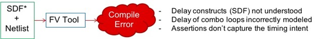

# CDNLive India: Asynchronous Design

<!-- TOC -->

- [CDNLive India: Asynchronous Design](#cdnlive-india-asynchronous-design)
	- [A Trip to Greece](#a-trip-to-greece)
	- [Texas Instruments](#texas-instruments)
	- [Summary](#summary)

<!-- /TOC -->

Every few years the idea of doing completely clockless design gets proposed again. This is also known as locally asynchronous design (no clocks at all), as opposed to simply having lots of clock domains and having asynchronous communication from one domain to the next.

每隔几年，就会再次提出完全无时钟设计的想法。 这也称为本地异步设计（根本没有时钟），而不是简单地拥有大量时钟域并从一个域到另一个域进行异步通信。

There are all sorts of issues with this:

这有各种各样的问题：

Engineers learn synchronous design in school and never work on anything else, so they are unfamiliar with the basis ideas.

工程师在学校学习同步设计，从不从事其他任何工作，因此他们对基础思想不熟悉。

Even in modern designs when asynchronous events happen, at the edge of clock-domain boundaries, it tends to be a major area of error, especially before clock-domain-crossing (CDC) tools existed.

即使在异步事件发生的现代设计中，在时钟域边界的边缘，它也往往是一个主要的错误区域，尤其是在时钟域交叉 (CDC) 工具存在之前。

The modern digital design flow is based around clocks, such as static timing analysis.
Even if you can get the system designed using whatever tool flow works, how is verification done?

现代数字设计流程基于时钟，例如静态时序分析。 即使您可以使用任何有效的工具流程设计系统，验证是如何完成的？

Despite these difficulties, there are a lot of attractive aspects to locally asynchronous design. First, about 30% of the power and a large amount of the interconnect is "spent' on clock distribution. Synchronous designs have their frequency set to the worst case silicon. But most silicon is "typical" by definition. So a lot of performance is being left on the table. Locally asynchronous design runs at the fastest speed possible given the actual silicon corner. Furthermore, when performance is data-dependent, synchronous design still runs worst case, whereas locally asynchronous design will run at the appropriate speed for the data values.

尽管存在这些困难，本地异步设计仍有许多吸引人的方面。 首先，大约 30% 的功率和大量互连被“消耗”在时钟分配上。同步设计将其频率设置为最坏情况的硅。但根据定义，大多数硅是“典型的”。所以很多性能被留在桌面上。考虑到实际的硅角，本地异步设计以可能的最快速度运行。此外，当性能依赖于数据时，同步设计仍然运行最坏的情况，而本地异步设计将以适当的速度运行数据值。

## A Trip to Greece

Several years ago I did some consulting for a company called Nanochronous, who supported locally asynchronous design. They provided silicon structures to handle the scheduling of operations, along with software which read a "normal" netlist and produced an equivalent design that realized the same RTL operation sequence but without requiring an explicit clock. Their engineering organization was on the Greek island of Crete. The company was running low on its seed funding, so they didn't have a lot of money. But I got offered the deal of having my expenses paid for a trip to Crete, and I would do 3 days consulting, doing what was effectively an operations review. If the company got funded, they would pay my consulting fee. Otherwise, I would just get an all-expenses vacation in Crete. Since I'd not been to Crete since I was 19 on Inter-rail, this was quite attractive. Plus Greek food is wonderful.

几年前，我为一家名为 Nanochronous 的公司做了一些咨询，该公司支持本地异步设计。 他们提供了用于处理操作调度的硅结构，以及读取“正常”网表的软件，并生成了实现相同 RTL 操作序列但不需要显式时钟的等效设计。 他们的工程组织位于希腊克里特岛。 该公司的种子资金不足，所以他们没有很多钱。 但是我得到了一个协议，让我支付去克里特岛旅行的费用，我会做 3 天的咨询，做有效的运营审查。 如果公司获得资金，他们将支付我的咨询费。 否则，我只会在克里特岛度过一个全费假期。 因为我从 19 岁开始乘坐 Inter-rail 就没有去过克里特岛，所以这很有吸引力。 另外希腊食物很棒。

It was a great trip, and certainly more pleasant to fly to Heraklion from Athens rather than sleeping outside on the deck of a ferry, which had been my previous mode of arrival. I arrived on a Sunday and got taken up to a little village up in the mountains where they roasted a couple of whole lambs each morning, and after church (Greek Orthodox, of course) everyone went to the local taverna for lamb, pita, greek salad, ouzo and wine. I reminded me of some of the places up in the foothills of the Alps near where I lived in the south of France.

这是一次很棒的旅行，从雅典飞往伊拉克利翁肯定比睡在外面的渡轮甲板上更愉快，这是我以前的抵达方式。 我在一个星期天到达，被带到山上的一个小村庄，他们每天早上在那里烤几只全羊，教堂（当然是希腊东正教）之后，每个人都去当地的小酒馆吃羊肉，皮塔饼，希腊 沙拉、茴香酒和葡萄酒。 我让我想起了我在法国南部居住的阿尔卑斯山脚下的一些地方。

One issue with the Nanocrhonous technology was, as always, verification. Their technology seemed to work well but it was hard to verify except using SPICE, which didn't scale. Despite significant interest from some large fabless semiconductor companies, eventually the company were unable to break through the verification wall. In the era when I went to Crete, Formal Verification was in its infancy, but it is not a promising technology since clocks are fundamental to (most of) the algorithms used.

与往常一样，Nanocrhonous technology的一个问题是验证。 他们的技术似乎运行良好，但很难验证，除非使用无法扩展的 SPICE。 尽管一些大型无晶圆厂半导体公司表现出浓厚的兴趣，但最终该公司未能突破验证墙。 在我去克里特岛的那个时代，形式验证还处于起步阶段，但它并不是一项有前途的技术，因为时钟是（大多数）使用的算法的基础。

## Texas Instruments

At CDNLive in India recently, Texas Instrument's Sudhakar Surendran, presented on Locally Asynchronous Design Verification. I don't think TI does any designs where the whole chip is locally asynchronous, but these techniques are widely used in delay-based speed optimization, power management circuits, and other applications. But these still require verification.

最近在印度的 CDNLive 上，Texas Instrument 的 Sudhakar Surendran 介绍了本地异步设计验证。 我认为 TI 不会做任何整个芯片本地异步的设计，但这些技术广泛用于基于延迟的速度优化、电源管理电路和其他应用。 但这些仍然需要验证。

In addition to problems that asynchronous FSM might have, an asynchronous one has some new things that might occur such as glitches. They can also have unstable states (for example, if, for a certain combination of inputs, state A goes to next state B, but next state for B is state A, then this will oscillate). TI used a trick with Xs as a ternary logic to model unstable states (which formal has no concept of an unstable state).

除了异步 FSM 可能存在的问题之外，异步 FSM 还可能会出现一些新问题，例如故障。 它们也可能有不稳定的状态（例如，如果对于某种输入组合，状态 A 进入下一个状态 B，但 B 的下一个状态是状态 A，那么这将振荡）。 TI 使用了一个技巧，将 Xs 作为三元逻辑来模拟不稳定状态（形式上没有不稳定状态的概念）。

The biggest challenge in using Jasper Gold for verifying a design like this is that the formal tools have no concept of delay (they don't do timing, they just do functionality). The design won't even compile. So TI created a delay element that emulated the delays for the formal tool. Then they modified the source file to instantiate these elements at all delay points.

使用 Jasper Gold 验证这样的设计的最大挑战是形式化工具没有延迟的概念（他们不做计时，他们只做功能）。 该设计甚至无法编译。 因此，TI 创建了一个延迟元素来模拟正式工具的延迟。 然后他们修改了源文件以在所有延迟点实例化这些元素。

The next issue was that combinational loops are not acceptable to formal tools. So any combinational loop was broken by adding a one-clock delay element (and adjusting all the other delay values appropriately). They could then use both formal verification and standard constrained random verification.

下一个问题是组合循环对于正式工具是不可接受的。 因此，通过添加一个时钟延迟元素（并适当调整所有其他延迟值）来破坏任何组合循环。 然后他们可以同时使用形式验证和标准约束随机验证。

In a bit more detail, TI would:

更详细地说，TI 将：

1. Discretize the timing delays
2. Model the discretized delays using FV tool crank or internal clock
3. Create TIMING_FV Model for each delay formats (SDF,…)
4. TIMING_FV model uses basic template for each construct
5. Create FV timing delay wrapper for each cell in the library
6. Create FV friendly design netlist for the design with timing delay
7. Uses original netlist, cell FV delay wrapper, timing/SDF and the TIMING_FV model

Sudhakar went into detail in each of these steps, but that is beyond the scope of this post. I think the important takeaway is that they have developed an approach that allows a formal verification tool like Jasper Gold to be faked out by using delay elements to generate a clock that doesn't really exist in reality. This approach allows formal verification to be used on asynchronous designs.

Sudhakar 详细介绍了每个步骤，但这超出了本文的范围。 我认为重要的一点是，他们开发了一种方法，可以通过使用延迟元素来生成实际上并不存在的时钟来伪造像 Jasper Gold 这样的形式验证工具。 这种方法允许在异步设计中使用形式验证。

## Summary

TI showed methods to use formal verification for asynchronous designs. A big advantage was to "shift left" by doing this very early in verification, once RTL was first available.

TI 展示了将形式验证用于异步设计的方法。 一个很大的优势是，一旦 RTL 首次可用，就可以在验证的早期进行“左移”。

- Model timing in Formal tools that enabled reading in asynchronous designs
- Detect hazards in asynchronous designs
- Enable ‘unstable’ states detection

The presentations are not yet available, but eventually all presentations will appear on the [CDNLive India page](https://www.cadence.com/content/cadence-www/global/en_US/home/cdnlive/india-2018.html).

原文链接：https://www.cadence.com/content/cadence-www/global/en_US/home/cdnlive/india-2018.html