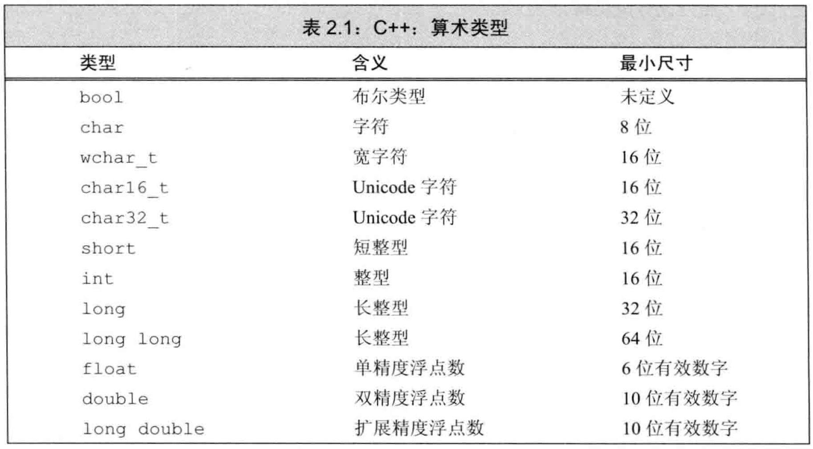

## 第1章 开始

### 1.1 实现一个简单的C++程序

```c++
int main()
{
	return 0;
}
```

main函数的返回类型必须为int，在大多数系统中，main的返回值被用来指示状态。返回值0表明成功，非0的返回值的含义由系统定义，通常用来指出错误类型。
在UNIX系统中，通过如下命令获得状态：
```shell
echo $?
```
在Windows系统中查看状态可键入：
```dos
echo %ERRORLEVEL%
```
标准库定义了4个IO对象 —— cin, cout, cerr和clog.

### 1.4.3 读取数量不定的输入数据

```c++
#include <iostream>
int main()
{
	int sum = 0, value = 0;
	// 读取数据直到遇到文件尾，计算所有读入的值的和
	while (std::cin >> value)
		sum += value;
	std::cout << "Sum is: " << sum << std::endl;
	return 0;
}
```
当我们使用一个istream对象作为条件时，其效果是检测流的状态。如果流是有效的，即流未遇到错误，那么检测成功。当遇到文件结束符（end of line），或遇到一个无效输入时（例如读入的值不是一个整数），istream对象的状态会变为无效。处于无效状态的istream对象会使条件变为假。
从键盘输入文件结束符：当从键盘向程序输入数据时，对于如何指出文件结束，不同操作系统有不同的约定。在Windows系统中，输入文件结束符的方法是“Ctrl+X”，然后按Enter或Return。在UNIX系统中，包括Mac OS X系统中，文件结束符输入是用“Ctrl+D”。

### 1.5 使用文件重定向

当你测试程序时，反复从键盘敲入数据作为程序输入是非常乏味的。大多数操作系统支持文件重定向，这种机制允许我们将标准输入和标准输出于命名文件关联起来：
```c++
addItems <infile >outfile
```

## 第2章 变量和基本类型

### 2.1 基本内置类型

C++定义了一套包括算术类型和空类型在内的基本数据类型。

- 算术类型
  