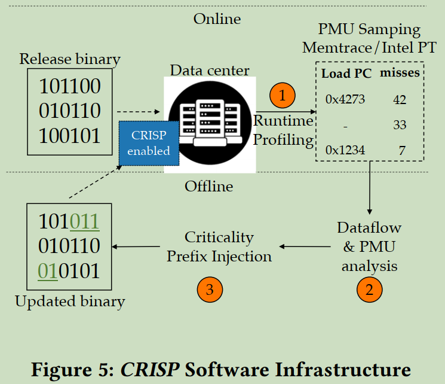
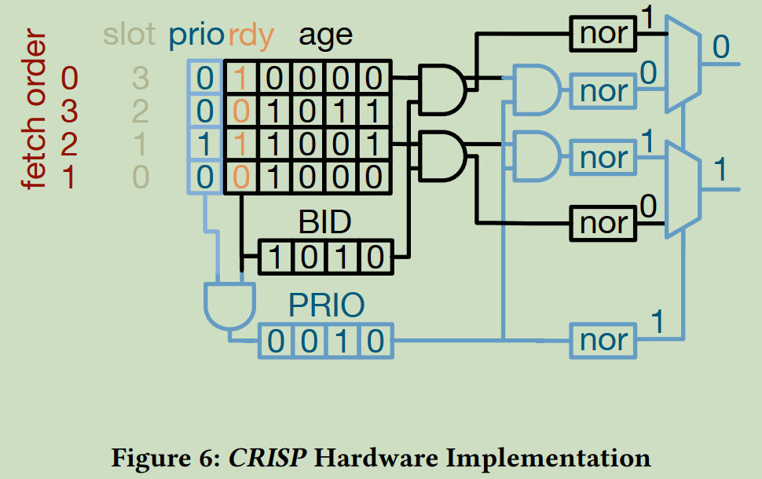
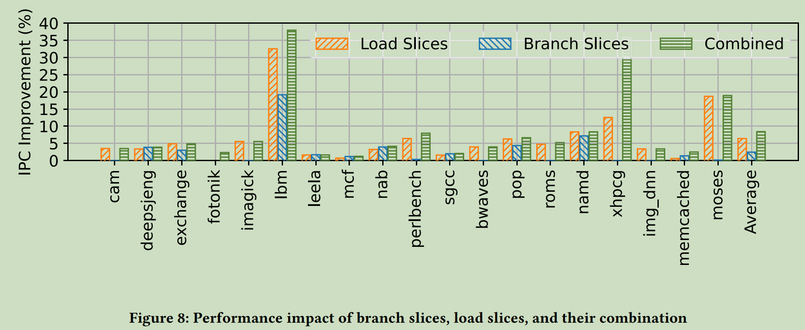

ASPLOS-2022

## 1. Key innovation

Recognizing and marking the critical instructions in compilation stage with runtime profiling, then schedule the critical instructions with higher priority. CRISP provides precise runahead with minor hardware cost.

## 2. Shortcoming

1. The runtiming profiling is needed during compilation;
2. The non-critical instructions is blocked, which may impact the committing rate compared with "in-order" schedule strategy, thus the advance window of stalling loads provided by CRISP is limited by the ROB entries. We can implement a simple experiment to verify it.

## 3. Software support

1. System-wide profiling
   Such as GWP, ODS and AsmDB
2. Load Slice Extraction
3. Reconstructing compiled assembly code
   In this step, CRISP adding the new instruction prefix to every critical instruction using post-link-time compilation, instead of this scheme, we generate help thread which will be executed in near cache core.

This first two steps above can be optimized, according to [^1], load slice pattern can be classified into several types, we can recognize the critical load by its access pattern directly. Besides, we may also use NLP to recognize the critical load.

## 4. Hardware support

1. Extending the instruction decoder to interpret the new latency-critical instruction prefix and tag all critical instructions as they progress through the CPU pipeline.
2. Extending the scheduler to prioritize these critical instructions.
   Observe the criticality of every instruction and select critical-tagged instructions over non-critical instructions.

## 5. Evaluation

### 5.1 Methodology
- Simulator: Scarab
- Simulation system: Skylake-like Intel processor 
- Benchmark
  - SPEC2017
  - Xhpcg
  - data center applications including Moses, Memcached, and Img-dnn from Tailbench

### 5.1 IPC Improvement

CRISP provides an average IPC speedup of **8.4%** and a maximum speedup of **38%** over the OOO baseline.

[^1]: Ayers, G., Litz, H., Kozyrakis, C., & Ranganathan, P. (2020). Classifying Memory Access Patterns for Prefetching. https://doi.org/10.1145/3373376.3378498
