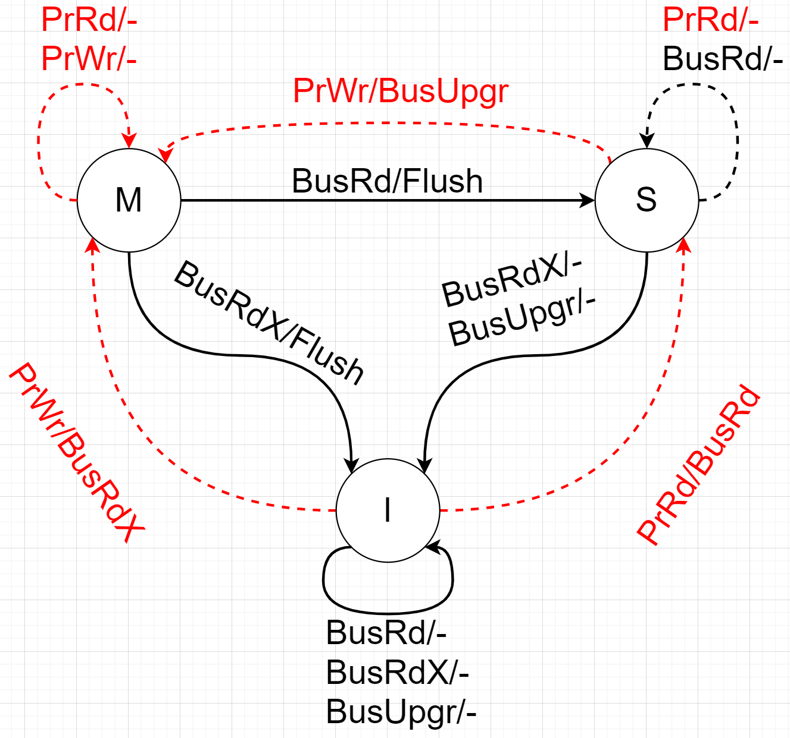

最近在研究gem5代码，发现维基百科对Cache Coherence协议介绍的很浅显易懂，在此做一些总结。

## 1. Cache Coherence定义

Cache Coherence一般翻译为缓存一致性，但是与Cache Consistency概念有冲突，因此在本文中直接使用英文表示。

Cache Coherence的定义可以参考相关书籍或[维基百科](https://en.wikipedia.org/wiki/Cache_coherence)，个人的理解是由于多核存在私有缓存，导致有可能同一地址的数据在多个核心的私有缓存中存在副本。这些核心对数据的读写之前必须确认自己拥有该数据的最新副本（有可能已经过时）。

Incoherent caches: The caches have different values of a single address location.

Coherent caches: The value in all the caches' copies is the same.

如以上[两幅动态图](https://en.wikipedia.org/wiki/Cache_coherence)所示，第一幅图两个核心的私有缓存之间数据没有同步，导致在旧数据上操作，因此需要一些额外的协议，保证数据是最新的，如第二幅动态图所示。

具体的协议有哪些呢？这边介绍三个基本的例子：

- MSI
- MESI
- MOESI

ARM还针对AMBA提出了：

- ACE (AMBA 4)
- CXI (AMBA 5)

但是在本文中不进行介绍。

此外，硬件如何实现这些协议，也有两种方式：

- [Snooping](https://en.wikipedia.org/wiki/Bus_snooping)
- [Directory-based](https://en.wikipedia.org/wiki/Directory-based_cache_coherence)

主要区别在于：Snooping更快，但是Directory-based扩展性好。

## 2. Cache Coherence Protocols

### 2.1 MSI

#### 2.1.1 Overview

MSI协议的名称来源于三种状态的首字母缩写，

- **M**(odified): The block has been modified in the cache. The data in the cache is then inconsistent with the backing store (e.g. memory). A cache with a block in the "M" state has the responsibility to write the block to the backing store when it is evicted.
- **S**(hared): This block is unmodified and exists in read-only state in at least one cache. The cache can evict the data without writing it to the backing store.
- **I**(valid): This block is either not present in the current cache or has been invalidated by a bus request, and must be fetched from memory or another cache if the block is to be stored in this cache.

任何存在于Cache中的block的状态必须为三者之一。

#### 2.1.2 Permitted States

上图展示的是针对同一地址的数据，在两个不同核心的私有Cache中允许存在的状态关系，✔️表示可以并存，❌表示无法并存。

理解起来也很容易，在此做一些简单的解释：

- 如果该数据在一个Cache中处于Modified状态，则表明该数据在DRAM中最新数据的基础上进行了修改，其他的Cache肯定没有最新的数据，因此只能处于Invalid状态。
- 如果该数据在一个Cache中处于Shared状态，则表明该数据是DRAM中最新数据的副本，没有任何修改，其他的Cache可以对该数据进行共享，但是肯定没有在其他Cache中被修改，否则当前Cache已经处于Invalid状态。
- 如果该数据在一个Cache中处于Invalid状态，则表明该数据在当前Cache中不存在有效副本，因此不影响其在其他Cache中的状态。

#### 2.1.3 State Machine

以上介绍了MSI协议中三种状态的定义，以及允许的状态关系。接下来将介绍如何实现以上介绍的允许的状态关系，使用的是状态机进行控制。

状态机的状态分别为M、S、I，控制状态的输入来源于两方面，一方面是CPU的读写请求，另一方面是其他memory的coherence请求。因此以下分别介绍，这在分析复杂Coherence协议时相当有用。

处理器对缓存的请求包括：

- PrRd: Processor request to read a cache block. (CPU读请求)
- PrWr: Processor request to write a cache block. (CPU写请求)

总线端请求包括：

- BusRd: When a read miss occurs in a processor’s cache, it sends a BusRd request on the bus and expects to receive the cache block in return. (Cache read miss时通过总线发送的读请求)
- BusRdX: When a write miss occurs in a processor’s cache, it sends a BusRdX request on the bus which returns the cache block and invalidates the block in the caches of other processors. (Cache write miss时通过总线发送的写请求)
- BusUpgr: When there's a write hit in a processor's cache, it sends a BusUpgr request on the bus to invalidate the block in the caches of other processors. (Cache需要对Shared状态的数据写操作时通过总线发送权限升级（到M状态）请求)
- Flush: Request that indicates that a whole cache block is being written back to the memory. (这个其实不算时一个请求，而是Cache侦听到请求时将修改的数据flush回DRAM或是其他Cache中的操作。虽然是接收到了其他的请求，但是对于M状态的Cache可能会等同于Flush请求，并将数据Flush会back-store。)

以上为状态机的状态转换图，通过以下的两个表格分别对CPU端请求和总线端请求响应进行介绍。

**CPU端请求的状态转换表**
| Initial State 	| Operation 	| Response                                         	|
|:-------------:	|-----------	|--------------------------------------------------	|
| Invalid(I)    	| PrRd      	| BusRd is issued and state changes to Shared.     	|
|               	| PrWr      	| BusRdX is issued and state changes to Modified.  	|
| Shared(S)     	| PrRd      	| The block remains in the Shared state.           	|
|               	| PrWr      	| BusUpgr is issued and state changes to Modified. 	|
| Modified(M)   	| PrRd      	| The block remains in the Modified state.         	|
|               	| PrWr      	| The block remains in the Modified state.         	|

**总线端请求的状态转换表**
| Initial State 	| Operation 	| Response                                                              	|
|:-------------:	|-----------	|-----------------------------------------------------------------------	|
| Invalid(I)    	| BusRd     	| The block remains Invalid.                                            	|
|               	| BusRdX    	| The block remains Invalid.                                            	|
|               	| BusUpgr   	| The block remains Invalid.                                            	|
| Shared(S)     	| BusRd     	| The block remains in the Shared state.                                	|
|               	| BusRdX    	| The block transitions to Invalid.                                     	|
|               	| BusUpgr   	| The block transitions to Invalid.                                     	|
| Modified(M)   	| BusRd     	| The cache block is flushed onto the bus and state changes to Shared.  	|
|               	| BusRdX    	| The cache block is flushed onto the bus and state changes to Invalid. 	|
|               	| BusUpgr   	| A BusUpgr is not possible.                                            	|

### 2.2 MESI

#### 2.2.1 Overview

维基百科对MESI协议也有非常不错的介绍，在此直接翻译过来：

> MESI 协议是一种基于 Invalidate 的缓存一致性协议，是最常见的支持回写缓存的协议之一。它也被称为伊利诺伊协议（由伊利诺伊大学厄巴纳-香槟分校开发）。回写高速缓存可以节省大量通常浪费在直写高速缓存上的带宽。回写缓存中始终存在脏状态，表明缓存中的数据与主内存中的数据不同。如果块驻留在另一个缓存中，伊利诺伊协议需要一个缓存来缓存未命中的传输。==该协议相对于MSI协议减少了主存储器事务的数量。 这标志着性能的显著提高。==

MESI同样来源于所包含的4中状态，在MSI的基础上增加了Exclusive (E)状态。

- Modified (M): The cache line is present only in the current cache, and is dirty - it has been modified (M state) from the value in main memory. The cache is required to write the data back to main memory at some time in the future, before permitting any other read of the (no longer valid) main memory state. The write-back changes the line to the Shared state(S).
- Exclusive (E): The cache line is present only in the current cache, but is clean - it matches main memory. It may be changed to the Shared state at any time, in response to a read request. Alternatively, it may be changed to the Modified state when writing to it.
- Shared (S): Indicates that this cache line may be stored in other caches of the machine and is clean - it matches the main memory. The line may be discarded (changed to the Invalid state) at any time.
- Invalid (I): Indicates that this cache line is invalid (unused).

MESI在MSI的基础之上增加了Exclusive状态，E状态与S状态类似，也是只读权限，但是保证了在其他Cache中没有共享副本，因此在升级到M状态不需要在总线上发送BusUpgr操作，减少了主存储器事务的数量。

#### 2.2.2 Permitted States

#### 2.2.3 State Machine

Image 1.1 State diagram for MESI protocol Red: Bus initiated transaction. Black: Processor initiated transactions.

上图有一个错误，而且还有些转换没有画全，下面的表格比较完整。

处理器对缓存的请求包括以下操作：

- PrRd: The processor requests to **read** a Cache block.
- PrWr: The processor requests to **write** a Cache block

总线端请求如下：

- BusRd: Snooped request that indicates there is a **read** request to a Cache block requested by another processor
- BusRdX: Snooped request that indicates there is a **write** request to a Cache block requested by another processor that **doesn't already have the block**.
- BusUpgr: Snooped request that indicates that there is a write request to a Cache block requested by another processor but that processor already has that **Cache block residing in its own Cache**.
- Flush: Snooped request that indicates that an entire cache block is written back to the main memory by another processor.
- FlushOpt: Snooped request that indicates that an entire cache block is posted on the bus in order to supply it to another processor(Cache to Cache transfers). (个人感觉这个作用是如果一个Cache请求的数据在另一个Cache中存在Shared副本，则直接从Cache中取数据比从DRAM中取数据要快，在维基百科上也有类似的解释如下。)

> (Such Cache to Cache transfers can reduce the read miss latency if the latency to bring the block from the main memory is more than from Cache to Cache transfers, which is generally the case in bus based systems. But in multicore architectures, where the coherence is maintained at the level of L2 caches, there is on chip L3 cache, it may be faster to fetch the missed block from the L3 cache rather than from another L2)

Table of State Transitions and response to various Processor Operations
| Initial State 	| Operation 	| Response                                                                                                                                                                                                                                                                                                                                                        	|
|:-------------:	|-----------	|-----------------------------------------------------------------------------------------------------------------------------------------------------------------------------------------------------------------------------------------------------------------------------------------------------------------------------------------------------------------	|
| Invalid(I)    	| PrRd      	| - Issue BusRd to the bus - Other Caches see BusRd and check if they have a valid copy, inform sending cache - State transition to (S)Shared, if other Caches have valid copy. - State transition to (E)Exclusive, if none (must ensure all others have reported). - If other Caches have copy, one of them sends value, else fetch from Main Memory 	|
|               	| PrWr      	| - Issue BusRdX signal on the bus - State transition to (M)Modified in the requestor Cache. - If other Caches have copy, they send value, otherwise fetch from Main Memory - If other Caches have copy, they see BusRdX signal and Invalidate their copies. - Write into Cache block modifies the value.                                             	|
| Exclusive(E)  	| PrRd      	| - No bus transactions generated State remains the same. - Read to the block is a Cache Hit                                                                                                                                                                                                                                                                   	|
|               	| PrWr      	| - No bus transaction generated - State transition from Exclusive to (M)Modified - Write to the block is a Cache Hit                                                                                                                                                                                                                                       	|
| Shared(S)     	| PrRd      	| - No bus transactions generated - State remains the same. - Read to the block is a Cache Hit.                                                                                                                                                                                                                                                             	|
|               	| PrWr      	| - Issues BusUpgr signal on the bus. - State transition to (M)Modified. - Other Caches see BusUpgr and mark their copies of the block as (I)Invalid.                                                                                                                                                                                                       	|
| Modified(M)   	| PrRd      	| - No bus transactions generated - State remains the same. - Read to the block is a Cache hit                                                                                                                                                                                                                                                              	|
|               	| PrWr      	| - No bus transactions generated - State remains the same. - Write to the block is a Cache hit.                                                                                                                                                                                                                                                            	|

Table of State Transitions and response to various Bus Operations
| Initial State 	| Operation 	| Response                                                                                                                                                                                              	|
|:-------------:	|-----------	|-------------------------------------------------------------------------------------------------------------------------------------------------------------------------------------------------------	|
| Invalid(I)    	| BusRd     	| No State change. Signal Ignored.                                                                                                                                                                      	|
|               	| BusRdX    	| No State change. Signal Ignored                                                                                                                                                                       	|
|               	| BusUpgr   	| No State change. Signal Ignored                                                                                                                                                                       	|
| Exclusive(E)  	| BusRd     	| - Transition to Shared (Since it implies a read taking place in other cache). - Put FlushOpt on bus together with contents of block.                                                               	|
|               	| BusRdX    	| - Transition to Invalid. - Put FlushOpt on Bus, together with the data from now-invalidated block.                                                                                                 	|
|               	| BusUpgr   	| - A BusUpgr is not possible.                                                                                                                                                                          	|
| Shared(S)     	| BusRd     	| - No State change (other cache performed read on this block, so still shared). - May put FlushOpt on bus together with contents of block (design choice, which cache with Shared state does this). 	|
|               	| BusRdX    	| - Transition to Invalid (cache that sent BusUpgr becomes Modified) - May put FlushOpt on bus together with contents of block (design choice, which cache with Shared state does this)              	|
|               	| BusUpgr   	| - Transition to Invalid (cache that sent BusUpgr becomes Modified) - May put FlushOpt on bus together with contents of block (design choice, which cache with Shared state does this)              	|
| Modified(M)   	| BusRd     	| - Transition to (S)Shared. Put FlushOpt on Bus with data. - Received by sender of BusRd and Memory Controller, which writes to Main memory.                                                        	|
|               	| BusRdX    	| - Transition to (I)Invalid. - Put FlushOpt on Bus with data. Received by sender of BusRdx and Memory Controller, which writes to Main memory.                                                      	|
|               	| BusUpgr   	| - A BusUpgr is not possible.                                                                                                                                                                          	|

#### 2.2.4 Supplementary Material

MESI in its naive, straightforward implementation exhibits two particular performance issues. First, when writing to an invalid cache line, there is a long delay while the line is fetched from another CPU. Second, moving cache lines to the invalid state is time-consuming. To mitigate these delays, CPUs implement store buffers and invalidate queues.

**Store Buffer**

A store buffer is used when writing to an invalid cache line. Since the write will proceed anyway, the CPU issues a read-invalid message (hence the cache line in question and all other CPUs' cache lines that store that memory address are invalidated) and then pushes the write into the store buffer, to be executed when the cache line finally arrives in the cache.

A direct consequence of the store buffer's existence is that when a CPU commits a write, that write is not immediately written in the cache. Therefore, whenever a CPU needs to read a cache line, it first has to scan its own store buffer for the existence of the same line, as there is a possibility that the same line was written by the same CPU before but hasn't yet been written in the cache (the preceding write is still waiting in the store buffer). Note that while a CPU can read its own previous writes in its store buffer, other CPUs cannot see those writes before they are flushed from the store buffer to the cache - a CPU cannot scan the store buffer of other CPUs.

**Invalidate Queues**

With regard to invalidation messages, CPUs implement invalidate queues, whereby incoming invalidate requests are instantly acknowledged but not in fact acted upon. Instead, invalidation messages simply enter an invalidation queue and their processing occurs as soon as possible (but not necessarily instantly). Consequently, a CPU can be oblivious to the fact that a cache line in its cache is actually invalid, as the invalidation queue contains invalidations that have been received but haven't yet been applied. Note that, unlike the store buffer, the CPU can't scan the invalidation queue, as that CPU and the invalidation queue are physically located on opposite sides of the cache.

As a result, memory barriers are required. A store barrier will flush the store buffer, ensuring all writes have been applied to that CPU's cache. A read barrier will flush the invalidation queue, thus ensuring that all writes by other CPUs become visible to the flushing CPU. Furthermore, memory management units do not scan the store buffer, causing similar problems. This effect is visible even in single threaded processors.

**Advantages of MESI over MSI**

The most striking difference between the two protocols is the extra "exclusive" state present in the MESI protocol. This extra state was added as it has many advantages. When a processor needs to read a block that none of the other processors have and then write to it, two bus transactions will take place in the case of MSI. First, a BusRd request is issued to read the block followed by a BusRdX request before writing to the block. The BusRdX request in this scenario is useless as none of the other caches have the same block, but there is no way for one cache to know about this. Thus, MESI protocol overcomes this limitation by adding an Exclusive state, which results in saving a bus request. This makes a huge difference when a sequential application is running. As only one processor will be working on it, all the accesses will be exclusive. MSI performs very badly in this case. Even in the case of a highly parallel application where there is minimal sharing of data, MESI is far faster. Adding the Exclusive state also comes at no cost as 3 states and 4 states are both encoded with 2 bits.

**Disadvantage of MESI**

In case continuous read and write operations are performed by various caches on a particular block, the data has to be flushed to the bus every time. Thus the main memory will pull this on every flush and remain in a clean state. But this is not a requirement and is just an additional overhead caused because of the implementation of MESI. This challenge was overcome by MOESI protocol. In case of S (Shared State), multiple snoopers may response with FlushOpt with the same data (see the example above). F state in MESIF addresses to eliminate this redundancy.

### 2.3 MOESI

MOESI

### 2.4 Cache Coherence Examples

参考 https://en.wikipedia.org/wiki/Cache_coherency_protocols_(examples)

## 3. Cache Coherence Mechanisms

### 3.1 Snooping

### 3.2 Directory-Based