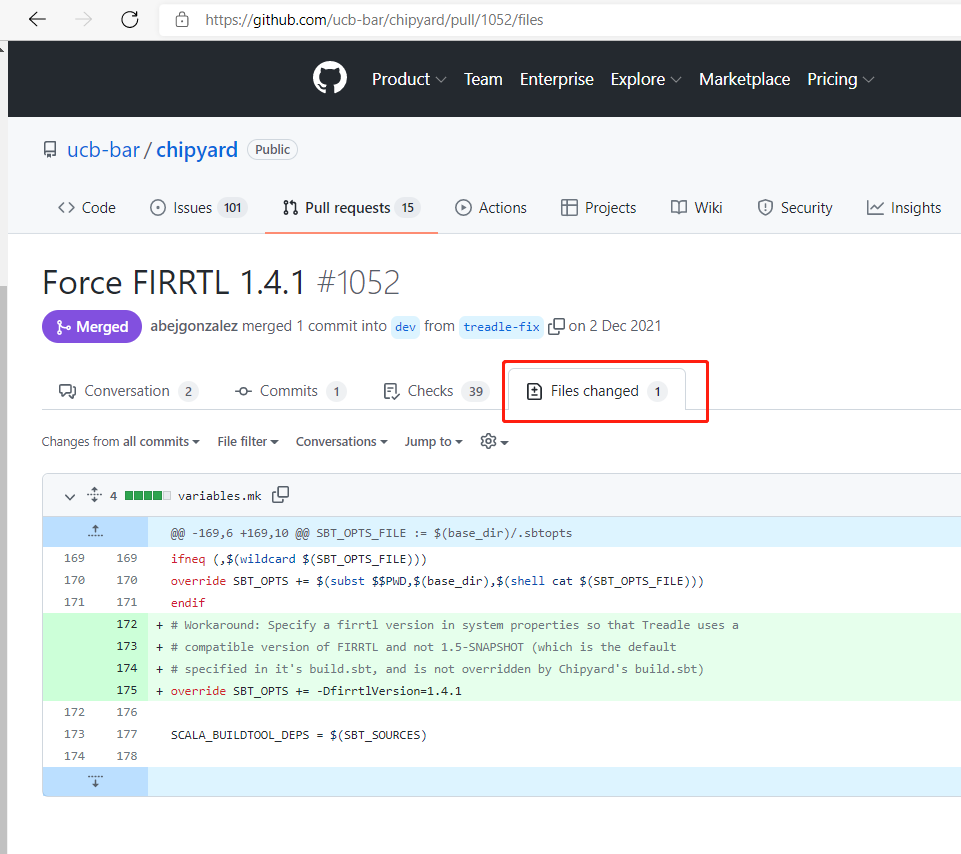
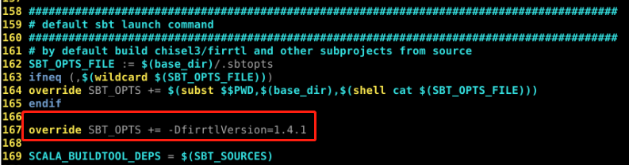

## 1. 环境配置

- 拉取docker镜像

```shell {.line-numbers}
docker pull ucbbar/chipyard-image:latest
```

- 运行docker容器

```shell {.line-numbers}
docker run -it ucbbar/chipyard-image bash
```

## 2. 仿真

### 2.1 软件/RTL仿真

支持两种仿真模式：
1. Verilator (open source)
2. Synopsys VCS (license required)

选择仿真器：

```shell {.line-numbers}
# for Verilator
cd sim/verilator
# for VCS
cd sim/vcs
```

仿真默认示例

默认docker环境有问题，在make编译之前需要修改主目录下variables.mk文件，就添加一行 override SBT_OPTS += -DfirrtlVersion=1.4.1，参考http://icfgblog.com/index.php/software/329.html





```shell {.line-numbers}
# compiling elaborates the RocketConfig in the example project, and produces an executable: simulator-chipyard-RocketConfig (for VCS, simulator named simv-chipyard-RocketConfig)
make
# use this executable (simulator) to run any compatible RV64 code
./simulator-chipyard-RocketConfig $RISCV/riscv64-unknown-elf/share/riscv-tests/isa/rv64ui-p-simple
# utilize the run-binary in makefile to simplify the simulation executable running
make run-binary BINARY=$RISCV/riscv64-unknown-elf/share/riscv-tests/isa/rv64ui-p-simple
# utilize the run-asm-tests or run-bmark-tests rule in makefile to run a pre-packaged suitd of RISC-V assembly or benchmark tests
make run-asm-tests
make run-bmark-tests
# get a list of useful Makefile variables and commands available
make help
```

TODO: 仿真自定义项目

TODO: Fast Memory Loading

生成波形

```shell {.line-numbers}
# make debug instead of make
make debug
# for Verilator simulation, this will generate a vcd file, a open-source vcd-capable waveform viewer is GTKWave
# for VCS, generate vpd file, can be opend with DVE
```

其他Verilator选项

```shell {.line-numbers}
make VERILATOR_THREADS=8 NUMACTL=1
```

### 2.2 FPGA-Accelerated Simulation

TODO:


## 10. 原型流程

实验室刚好有VCU118