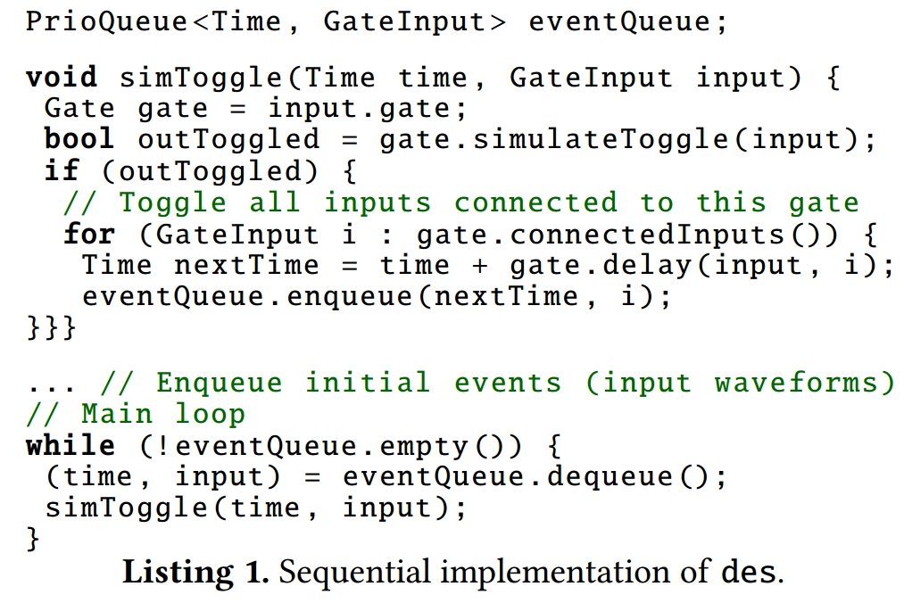
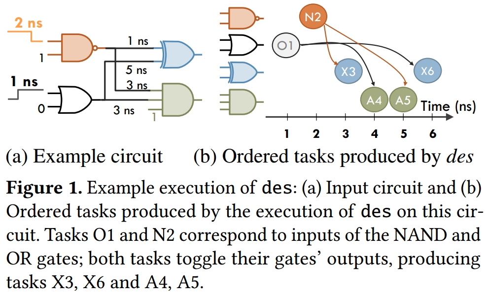
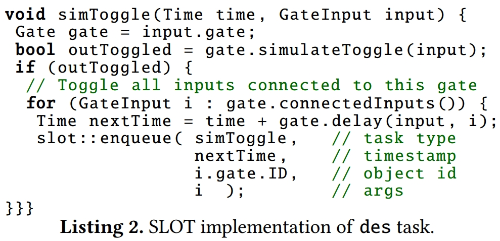
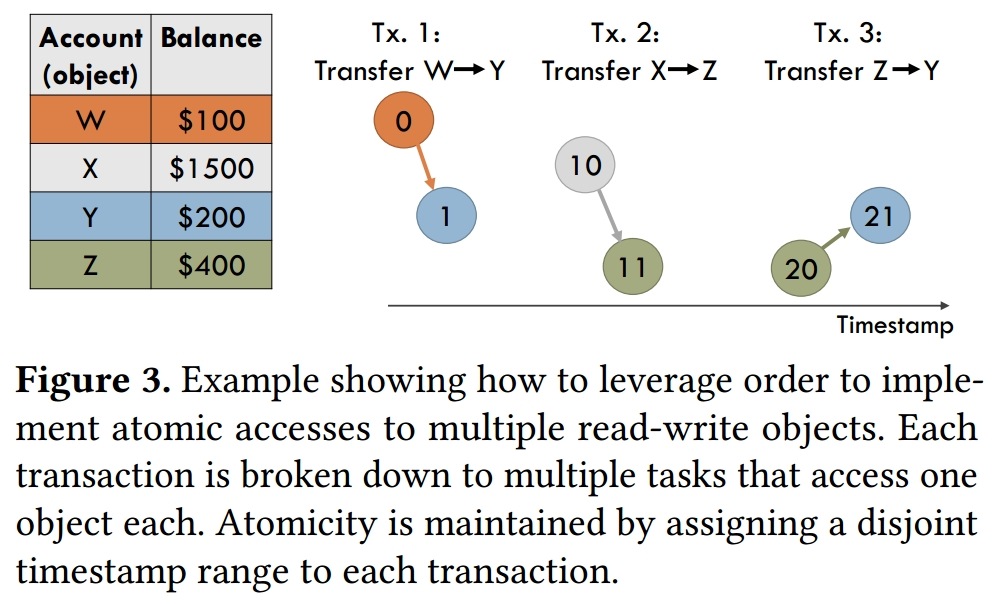
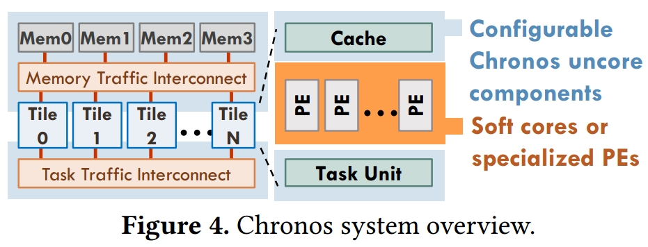
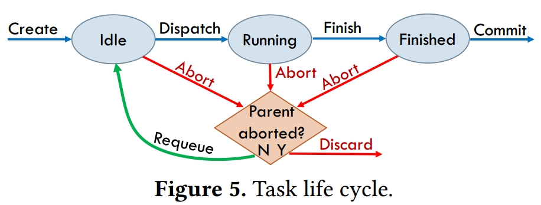
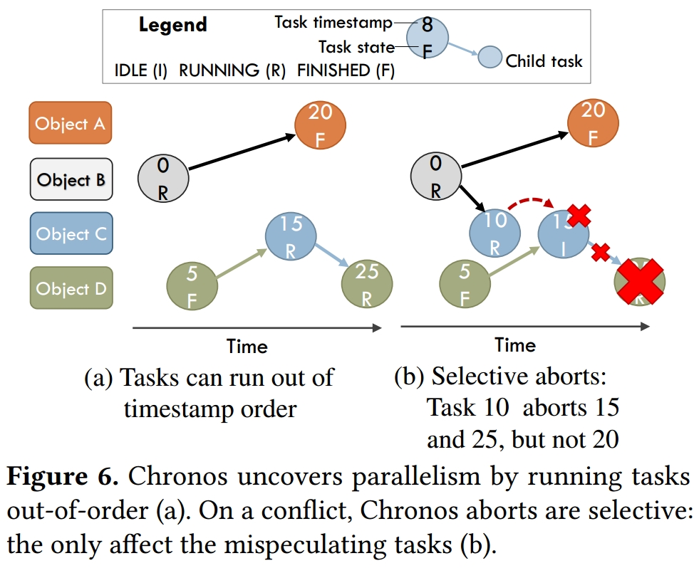
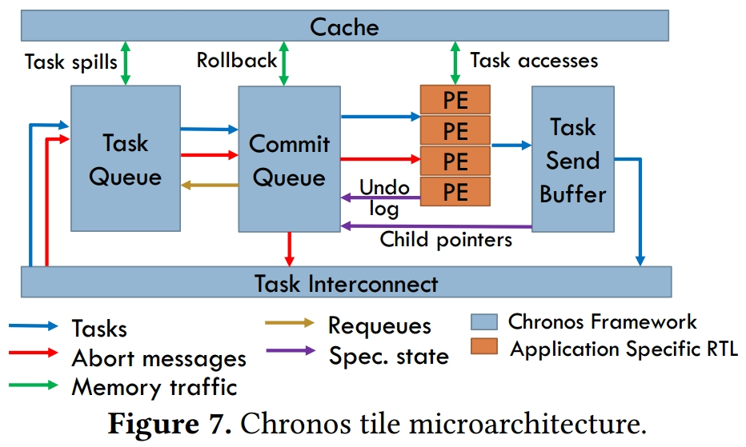

ASPLOS-2020 
Author: Maleen Abeydeera, Daniel Sanchez
Affiliations: MIT

<!-- TOC -->

- [Motivation](#motivation)
- [Target](#target)
- [Introduction](#introduction)
	- [先前加速器中的并行类型](#先前加速器中的并行类型)
	- [先前的推测架构依赖于缓存一致性](#先前的推测架构依赖于缓存一致性)
	- [投机执行的原因](#投机执行的原因)
- [SLOT执行模型](#slot执行模型)
	- [SLOT](#slot)
	- [将多对象计算映射到SLOT](#将多对象计算映射到slot)
	- [Discussion](#discussion)
- [Chronos系统](#chronos系统)
	- [设计要求和技术](#设计要求和技术)
	- [分布式有序推测](#分布式有序推测)
	- [任务单元设计](#任务单元设计)
		- [任务队列](#任务队列)
		- [提交队列](#提交队列)

<!-- /TOC -->

## Motivation

先前的加速器专注于易于利用并行性的领域，例如深度学习，并依赖于传统的并行化技术，如数据并行或数据流执行。

## Target

在本文中，作者专注于为需要推测执行来提取并行性的应用程序构建加速器。这些应用程序由动态创建并对共享数据进行操作的任务组成，其中对共享数据的操作必须按特定顺序发生才能正确执行。

## Introduction

之前支持推测的硬件包括TLS (Thread-Level Speculation)和HTM (Hardware Transactional Memory)，这些推测架构依赖于Cache一致性，通过修改一致性协议来检测任务之间的冲突，这在通用处理器中开销不算大，但是对于小型专用加速器来说是大的开销。

这篇论文的作者提出了一种新的硬件解决方案，不需要使用一致性，共享的数据映射到整个系统中，工作负载被划分成小的task，这些task有一个属性就是最多访存一个共享数据对象。此外，该架构是以数据为中心，task发送到需要操作的数据所在位置。最后，这些task通过时间戳顺序执行。==这一段对于工作的总结是对introduction的翻译，没法充分理解，在理解全文之后再进行凝练。==

例如，考虑离散事件模拟(des)，它在模拟数字电路、网络系统和物理过程方面具有广泛的适用性。离散事件模拟由动态创建的任务组成，这些任务可以在同一个模拟对象上运行，并且必须以正确的模拟时间顺序运行。非推测地运行这些任务需要过多的同步并限制并行性。推测性地运行任务更有利可图。

如Listing 1所示，每个des任务在特定时间处理一个门输入切换。如果此输入切换导致门的输出切换，则任务会在适当的时间将所有连接到该输出的输入的事件排入队列。顺序实现以模拟时间顺序一次处理一个任务，并在优先级队列中维护要处理的任务集。

以数字电路模拟为例，如Figure 1所示。Figure 1(a) 显示了具有输入波形和传播延迟的电路，Figure 1(b) 显示了在该电路上执行 des 的任务图。任务之间的箭头表示父子依赖关系（例如，任务O1创建任务A4和X6）。x轴显示任务顺序，y轴中任务的位置代表它操作的门。

在这个des中，我们可以发现一个很重要的现象：只有在同一门上操作的任务才具有数据依赖性；其他（例如，O1 和 N2）可能会在不违反正确性的情况下运行失序。但是任务和依赖项是未知的，因此乱序运行任务并不简单。虽然在des中，每个任务对单个对象（一个门）进行操作，并且这个对象是预先知道的。但这不足以确定哪些任务可以安全运行，因为一个任务可能与另一个在程序顺序中较早出现但尚不存在的任务相关。假设首先执行任务O1，产生任务X6。此时X6是系统中最早对XOR门进行操作的任务。但是执行X6会产生不正确的结果，因为X6必须遵循较早的依赖数据的任务X3，该任务尚不存在（因为N2尚未运行）。

### 先前加速器中的并行类型

本文通过两个因素对并行类型进行分类：（1）任务是预先知道的还是动态创建的？（2）如果任务对共享数据进行操作，它们应该如何同步以应对算法的数据依赖性并产生正确的结果？
按此标准可以分为四类：

- **Static parallelism:** 如果预先知道任务及其数据依赖性，则调度可以静态完成，不需要或需要非常简单的运行时机制。在对常规数据结构（例如密集矩阵）进行操作时会出现静态并行性。大多数先前的加速器都专注于静态并行性，如通过构建深度流水线和数据并行硬件，例如DaDianNao和Google的TPU。
- **Dynamic parallelism with independent tasks:** 某些算法，例如对树或图形进行操作的算法，必须动态创建任务，因为它们需要做更多的工作。在最简单的情况下，任务对不相交的数据进行操作，并且共享数据访问不需要同步。他们采用了由ESL和Cilk开创的fork-join模型。ParallelXL和TAPAS加速器针对这种动态并行性。它们的关键组成部分是对任务创建和负载平衡的硬件支持。
- **Non-speculative synchronization of dependent tasks:** 先前的工作已经展示了加速器，其中任务对共享数据进行操作，但大多数同步是通过停止而不是推测来实现的。
- **Speculative synchronization of dependent tasks:** 最后，Ma等人在FPGA上为图形分析应用程序构建加速器。它们支持原子任务，每个任务可以访问多个地址，冲突检测是使用全局共享的地址跟踪结构实现的，类似于一致性目录。因此，这种方法类似于基于一致性的冲突检测，并受到额外开销的影响。

### 先前的推测架构依赖于缓存一致性

先前的推测架构很难应用于加速器，因为它们都依赖于一致的缓存层次结构来执行推测执行，通过一致性协议检测任务之间的冲突。它需要实现一致的缓存和推测跟踪结构，虽然对于通用内核来说开销很小，但对于小型专用内核来说太昂贵了。(虽然依赖一致性对于多核来说是合理的，但对于加速器来说却是昂贵的。 一般的加速器和特别是可重新配置的硬件没有支持基于失效的冲突检测的一致缓存层次结构。实现一致性会增加复杂性、延迟和重要的片上 SRAM 以实现跟踪共享者的目录。除了一致性之外，对具有任意读写集的任务执行冲突检测会增加额外的开销，例如，每个核心价值几千字节的 Bloom 过滤器，这对于专门的处理核心来说太繁重了。)

### 投机执行的原因

通常，当任务具有未知的读写集或任务间顺序约束时，需要进行推测。
为了应对这一挑战，在本文中，我们提出了一个硬件系统，该系统在不使用一致性的情况下实现推测执行。 相反，该系统遵循以数据为中心的方法，其中共享数据映射到整个系统； 工作被分成小任务，每个任务最多访问一个共享对象； 并且任务总是被发送到它们的数据被映射的地方运行。 为了强制跨任务组或其他顺序约束的原子性，任务通过时间戳排序（这些是完全与物理时间分离的程序指定的逻辑时间戳）。

通过SLOT (Spatially Located Ordered Tasks) 执行模型将这些语义形式化。在 SLOT 中，所有工作都通过使用时间戳排序的任务进行。一个任务可以创建在它们之后排序的子任务，并且父任务直接将输入值传递给子任务。==每个任务必须对单个读写对象进行操作，该对象必须在创建任务时声明（除此限制外，任务可以访问任意数量的只读数据）==

而本文提出的架构就是针对SLOT执行模型的实现，这可以在没有缓存一致性协议的情况下实现完全分布式操作。

## SLOT执行模型

SLOT 限制每个任务访问单个读写对象，这在创建任务时必须知道。

### SLOT

SLOT 应用程序由有序的、动态创建的任务组成。 每个任务都可以用软件或硬件来实现。 我们独立于实现来描述执行模型，并使用软件 API 对其进行说明。

每个任务在创建时都有两个属性：时间戳和对象ID。时间戳指定顺序约束：系统保证任务似乎按时间戳顺序执行。 具有相同时间戳的任务可以以任何顺序运行，但都是原子的（即它们不交错）。
对象id是指定任务之间数据依赖性的整数：当且仅当两个任务具有相同的对象id时，它们才被视为数据相关。对象ID限制每个任务最多访问共享内存中的一个读写对象。请注意，此限制仅适用于读写数据。一个任务可以访问任意数量的只读数据。
SLOT任务可以通过指定子任务的类型、时间戳、对象ID和它可能需要的任何输入数据值，在发现更多工作时创建子任务。每个子任务可能有任何大于或等于其父任务的时间戳。

在SLOT中，父子关系是单向的：父任务可以创建值并将值传递给它的子任务，但父任务在子任务之前被排序，因此在子任务执行之前完成。子任务不能返回值或与其父母通信。这与像Cilk这样的fork-join执行模型不同，在这种模型中，父母等待他们的孩子完成。

- **API:** Listing 2通过显示des任务的实现来说明SLOT软件API。在软件中，每个任务都由一个函数实现。该实现与Listing 1中的顺序实现几乎相同：每个任务模拟特定门的输入切换。这段代码通过调用slot::enqueue创建新任务，而不是将任务排入优先级队列，它指定了子任务的类型（它的函数指针，因为它是一个软件任务）、时间戳、对象ID和任何附加参数（门在这种情况下输入）。
- **SLOT enables coherence-free conflict detection:** 通过限制每个任务最多访问一个读写对象，SLOT的实现可以在没有复杂跟踪结构的情况下执行分布式冲突检测。如果实现将对象id映射到核心或区块，并将每个任务发送到其对象id映射的位置，那么查找冲突就成为本地操作。
例如，如果Fig. 1在四核系统上运行，NAND、OR、XOR和AND门可以映射到内核1-4。然后，如果任务X3在X6已经运行后到达核心3，核心3可以通过将X3的对象ID与仍然推测的任务的对象ID进行比较，在本地确定X3的冲突（相同门和更高时间戳的任务，在本例中为{X6}）。

### 将多对象计算映射到SLOT

多对象事务也可以表示为SLOT任务，方法是将每个事务分解为多个单对象任务，每个任务访问一个对象，并为每个事务提供不相交的时间戳范围。这样，事务中的任务不会与其他事务中的任务重叠。

例如，考虑一个银行应用程序，其中交易在帐户之间转移资金。每笔交易都必须自动减少源帐户的余额并增加目标帐户的余额。每个帐户都应该是不同的对象，但由于账户余额是读写数据，单个任务不能访问两个账户。

Fig. 3显示了任务顺序如何使这成为可能。我们使用两个SLOT任务实现每笔交易，每个任务操作一个帐户：第一个减少源的余额并创建第二个任务来增加目的地的余额。每个事务都有一个不相交的时间戳范围，因此来自不同事务的任务不会交错。

这种技术推广到读写操作的任意组合。例如，我们的maxflow实现（第5节）使用它在图顶点的邻域上执行复杂的原子操作。

虽然将每个事务分解为许多小任务可能会给软件运行时增加大量开销，但小任务是加速器的自然匹配，因为硬件执行任务管理，小任务需要简单的处理元素。

### Discussion

- **SLOT细粒度任务的好处:** SLOT与先前工作相比的主要优势是实现无相干冲突检测。此外，先前的工作表明，即使在支持具有任意读/写集的任务的系统中，这种划分通常也是可取的，主要有以下三个原因：

1. 增加并行性：将长串行事务分解为短任务允许这些任务并行运行。
2. 减少中止的影响：在误推测时，只有冲突的任务被中止，而不是整个事务。
3. 增加数据重用：不是在事务运行的系统中共享数据，而是将任务发送到靠近它们的数据运行，避免缓存行乒乓。由于每个任务消息比缓存行小得多，这减少了流量；并且任务是异步发送和执行的，因此它们的延迟比同步内存访问更容易隐藏。

- **SLOT的局限:** 虽然将程序分成短的单对象任务通常是有益的，但在一种情况下，基于一致性的冲突检测会优于SLOT：如果应用程序由很少修改的读写数据主导，这些数据具有大量重用，则基于一致性的冲突检测将允许在整个系统中缓存这些数据，在本地的零星写入之间进行读取，而SLOT需要在单独的任务中隔离对这些数据的每次访问，并将它们发送到一个地方。
我们在目标应用程序中没有发现这种行为，因此我们没有针对这种情况优化SLOT。SLOT的一个简单扩展可以通过让任务写入其对象ID未涵盖的地址来解决此问题。然后，系统可以将很少修改的数据视为只读数据，并允许将它们私下缓存。在写入时（这种情况很少见），一个简单的实现可以刷新所有缓存并中止所有未来任务；更复杂的实现可能会执行更精确的刷新和冲突检测。我们将对这些实施选择的详细研究留给未来的工作。

## Chronos系统

Chronos是一个架构框架，可以轻松地为具有有序并行性的应用程序设计加速器。
Chronos通过提供有效实现SLOT执行模型的架构模板来实现这一点。然后加速器可以通过定义他们自己的任务处理引擎或配置Chronos的非核心组件来专门化这个模板。通过这种划分，创建Chronos加速器就像指定处理引擎一样简单；该框架负责处理有序任务管理和推测执行的复杂性。

Fig. 4显示了Chronos的组织架构。Chronos是一种平铺设计，具有完全分布式的任务管理和推测机制。每个tile都有多个执行任务的处理元素(PE)、一个本地（非一致性）缓存和一个用于排队、分派和提交有序任务的任务单元。

即使我们无法使用这个架构来完全处理无线项目的通用程序，但是这个架构解决了一类任务，可以放置适量的PE来处理带有这种特性的部分代码。

### 设计要求和技术

- **高吞吐量任务管理:** 短任务对系统提出了高吞吐量要求。例如，如果每个任务需要20个周期来执行，那么具有200个PE的Chronos系统每个周期必须创建、分派、冲突检查和提交10个任务以保持PE忙碌。这迫使设计没有集中组件：所有任务管理和推测机制必须完全分布式。Chronos的平铺设计实现了这一点。此外，每个tile的任务单元也需要保持高吞吐量。
- **大投机窗口:** 为了防止顺序限制并行性，系统必须能够在最早的未完成任务之前进行推测。更具体地说，由于顺序限制，任务在提交之前可能会在很长一段时间内处于推测状态——远远超过它们执行所需的时间。因此，系统应该能够跟踪比运行任务更多的推测任务。例如，正如我们将在Sec.6中看到的那样，有些应用程序每个运行任务需要大约10个推测任务

这些要求强制完全分布式、深度无序执行。

### 分布式有序推测

Chronos使用推测执行来消除顺序约束。
Chronos可以在创建后立即运行任何任务，即使它的祖先仍然是推测性的。图5显示了每个任务的执行流程。顶部水平箭头表示正确的推测。当一个任务被创建时，它被发送到一个tile，它在那里保持空闲，排队直到它准备好分派。tile按时间戳顺序将空闲任务分派给PE。正在运行的任务完成执行后，它会保持推测（处于完成状态），直到系统确定可以安全提交。

Fig. 5显示任务可以在提交之前的任何时候中止。由于任务可能会在其祖先仍处于推测状态时运行，因此中止任务需要中止并丢弃其所有后代。这些级联中止是发现并行性所必需的，并且是有选择性的：中止会撤消中止任务、其后代以及按程序顺序稍后出现的任何数据相关任务的影响。如图5所示，如果一个任务因为它的父任务被中止而被中止，那么它就被丢弃；否则，中止是由于数据依赖性，然后任务重新排队执行。

Fig. 6显示了Chronos中的推测执行示例。
任务被创建并无序运行：在Fig. 6a中，任务20已经运行并完成，即使较早的任务仍在运行；特别是任务0，即20的父任务，仍在运行。在Fig. 6b中，任务0创建了一个时间戳为10的子任务，它与任务15发生冲突。这导致任务15及其子任务25被中止。虽然中止可能影响多个任务，但它们是有选择性的：独立任务，例如20不会中止。

- **任务映射和冲突检测:** 为了廉价地执行推测执行，Chronos使用了第3节中概述的任务映射和冲突检测策略。Chronos将对象id映射到tile，然后将每个创建的任务发送到映射其对象id的tile。我们当前的Chronos实现使用静态对象到图块映射：对象id被简单地散列以生成图块id。我们发现这在我们的工作负载中实现了良好的负载平衡；Chronos还可以基于tile之间对象的动态重新映射采用更复杂的负载平衡。
- **任务调度:** 任务单元按时间戳顺序将任务分派给PE，以优先处理较早的任务。为了避免冲突，任务单元将具有相同对象ID的任务的执行序列化。因此，运行任务之间的冲突永远不会出现；只有无序到达tile的任务才能产生冲突。
- **投机价值管理:** Chronos采用Eager版本管理：推测性写入更新内存，旧值写入单独的撤消日志。提交很快，因为撤消日志被简单地丢弃；中止需要从撤消日志中恢复旧值。
Eager版本管理有助于运行依赖数据的任务链，而无需等待它们提交：如果任务A写入的值稍后由（相同对象）任务B读取，即使A尚未提交，B也会自然地使用A的值.这个过程被称为推测转发，对于有序推测很重要，但是对于懒惰的版本管理来说很难做到。
- **高吞吐量提交:** 为了确定任务何时可以提交，Chronos从之前的工作中借用了全局虚拟时间 (GVT) 协议。Tiles定期（例如，每32个周期）通信以找到最早未完成任务的时间戳，然后提交所有较早的任务。此过程利用大型提交队列一次提交多个任务，以很少的通信实现每个周期多个任务的提交吞吐量。

### 任务单元设计

Chronos的任务单元由两个主要结构组成：一个任务队列(TQ)保存tile中的所有任务并将空闲任务分派到PE，以及一个提交队列(CQ)，保存正在运行或完成的任务的推测状态，并提交或中止他们根据需要。此外，一个小任务发送缓冲区(TSB)从PE接收新创建的任务并将它们发送到正确的tile。
Fig. 7详细说明了每个tile的微架构，并显示了这些结构，它们一起类似于任务级重新排序缓冲区。

#### 任务队列

任务队列由两个主要结构组成：任务数组和顺序队列。任务数组是一个简单的内存，用于存储tile中每个任务的任务描述符。每个任务描述符包含运行任务所需的所有数据：其类型、时间戳、对象ID和参数。订单队列持有空闲任务并按时间戳顺序将它们分派给PE。
当任务到达tile时，任务会在任务数组和排序队列中分配条目。它们保留他们的订单队列条目，直到他们被分派到PE，但在他们的整个生命周期（即，直到他们提交或被丢弃）都保留他们的任务数组条目。这样，如果任务被中止，任务数组就有重新执行它所需的信息。当一个任务需要重新执行时，它被重新插入到订单队列中。
**任务溢出:** 任务队列的容量有限，但SLOT程序可能会创建无限数量的任务。当任务队列快满时，Chronos通过将任务溢出到主内存来提供无限任务队列的假象。

#### 提交队列

提交队列保存所有正在运行或已完成的任务的推测状态。在Chronos中，这种推测状态由任务的撤消日志（允许回滚任务的内存写入）和子指针（允许中止任务的后代）组成。
每个子指针跟踪子任务的tile和任务数组条目id。当一个孩子被创建时，它被发送到由其对象 id 指定的图块。 当接收 tile 将其排队时，它会回复子任务的指针。