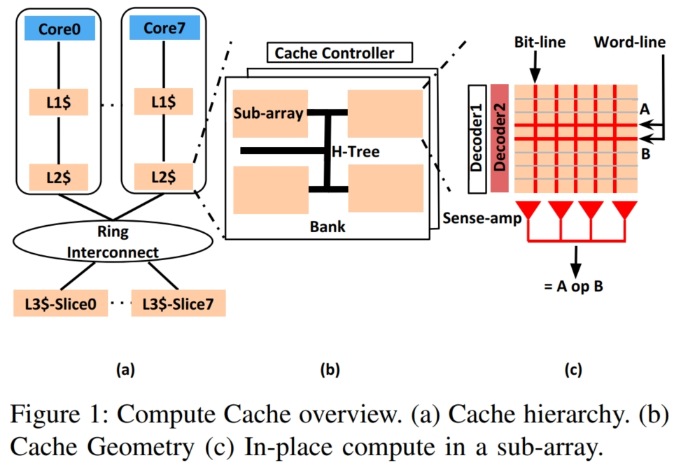
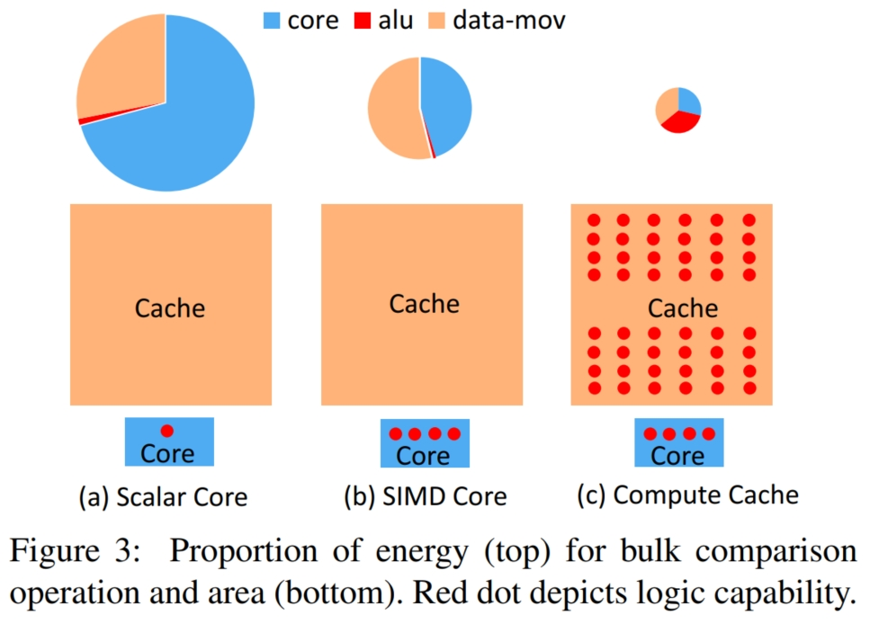
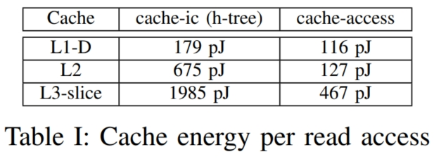
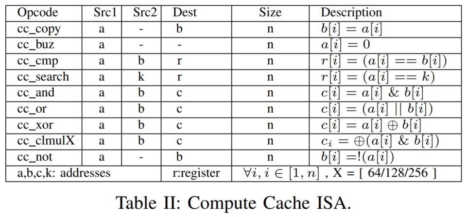
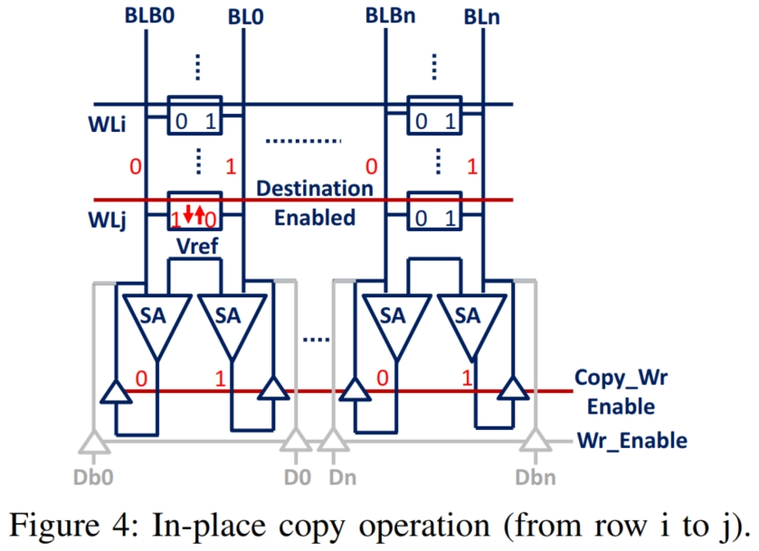
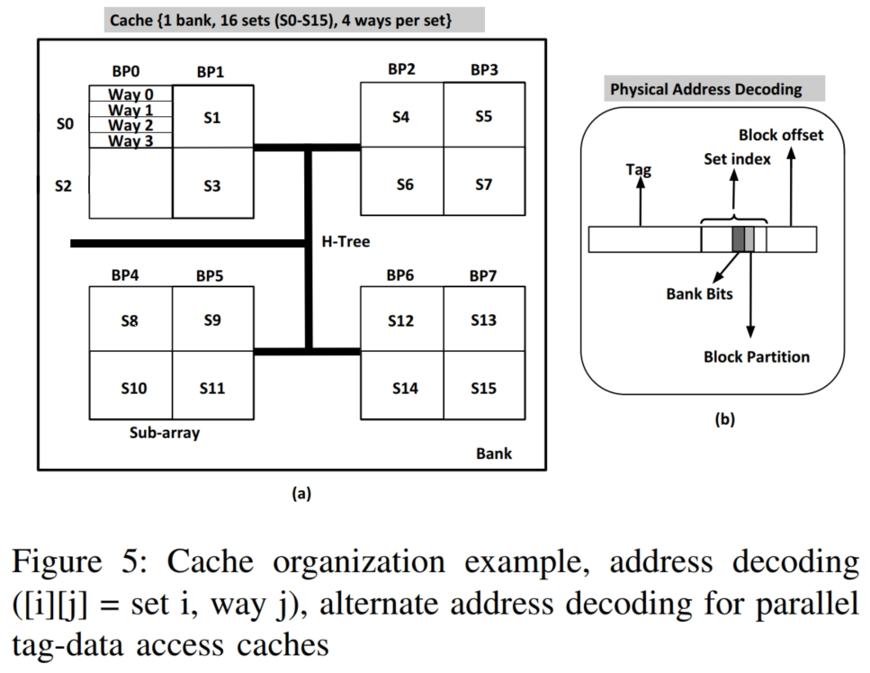
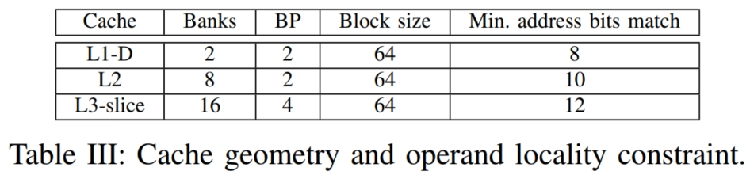

# Compute Caches

这是密西根大学Reetuparna Das团队的基于SRAM的存内计算三部曲的第一篇，提出了基于Cache的简单逻辑操作接口。

## Introduction

由于当今的计算由以数据为中心的应用程序主导，因此对这一重要领域的专业化有着强大的推动力。 传统处理器的窄向量单元无法利用这些应用程序中的高度数据并行性。 此外，与实际计算相比，它们在缓存层次结构上移动数据和指令处理上花费了不成比例的大部分时间和精力。

我们提出了计算缓存架构，通过缓存中的就地（原位）处理显着减少这些低效率。 现代处理器将大部分 (40-60%) 的硅片区域用于缓存，用于存储和检索数据。 我们的主要思想是重新利用缓存中使用的元素并将其转换为活动计算单元。 这可以在缓存子阵列内进行就地计算，而无需将数据传入或传出。 这种转换可以释放海量数据并行计算能力，显着减少数据在缓存层次结构上的移动所消耗的能量，从而直接满足以数据为中心的应用程序的需求。

我们提出的架构使用了一种新兴的 SRAM 电路技术，我们将其称为位线计算。通过同时激活多个字线，并感测共享位线上产生的电压，可以在不损坏数据的情况下完成对存储在激活位单元中的数据的几个重要操作。 最近制造的芯片证明了位线计算的可行性。 它们还显示了超过 6 sigma 的 Monte Carlo 模拟的稳定性，这被认为是针对工艺变化的稳健性的行业标准。

过去的内存处理 (PIM) 解决方案建议将处理逻辑移动到缓存或主存储器附近。 3D 堆叠可以使这成为可能。 计算缓存通过使用现有缓存元素启用就地处理，显着推动了极限。 对于以数据为中心的应用程序来说，这是一种有效的优化，其中计算中使用的至少一个操作数（例如 WordCount 中的字典）具有缓存局部性。

Compute Caches的效率来自两个主要来源：大规模并行和减少数据移动。缓存通常被组织为一组子数组；多达数百个子阵列，具体取决于缓存级别。这些子阵列可以潜在地对存储在其中的数据（KB 数据）进行并发计算，而对现有缓存结构几乎没有扩展（缓存区域开销的 8%）。因此，缓存可以有效地用作大型向量计算单元，其操作数大小比传统 SIMD 单元（KBs vs 字节）大几个数量级。为了实现类似的功能，传统 PIM 解决方案中接近存储器的逻辑需要提供一百多个额外的矢量功能单元。计算缓存的第二个好处是，它们不仅避免了在内核和不同级别的缓存层次结构之间传输数据（通过片上网络），而且甚至在缓存的子阵列与其控制器之间（通过缓存内互连）。

本文解决了实现计算缓存架构的几个问题，讨论了 ISA 和系统软件扩展，并重新设计了几个以数据为中心的应用程序以利用新的处理能力。

使用Compute Caches的一个重要问题是满足操作数局部性约束。 位线计算要求数据操作数存储在共享同一组位线的行中。 我们构建了一个缓存几何结构，其中一组中的路被明智地映射到一个子数组，以便软件可以轻松满足操作数局部性。 我们的设计允许编译器通过将操作数放置在页面对齐的地址（相同的页面偏移量）来确保操作数的局部性。 它避免将缓存的内部结构（例如其大小或几何形状）暴露给软件。

当由于缺乏操作数局部性而无法对操作进行就地处理时，我们建议使用近地计算缓存。 在近地设计中，源操作数从缓存子阵列中读出，操作在靠近缓存控制器的逻辑单元中执行，结果可以写回缓存。

除了操作数局部性，Compute Caches 还提出了几个有趣的问题。 如何协调跨多个缓存子阵列的操作数的并发计算？ 如何确保启用计算的缓存之间的一致性？ 当计算分布在核心和缓存之间时，如何确保一致性模型约束？ 软错误是现代处理器中的一个重要问题， ECC 可以用于Compute Caches吗？ 如果不可能，有哪些替代解决方案？ 我们讨论了解决这些问题的相对简单的解决方案。

Compute Caches支持多种就地向量操作：复制、搜索、比较和逻辑操作（和、或、异或和非），它们可以加速各种应用程序。 我们研究了两个文本处理应用程序（字数统计、字符串匹配）、使用位图索引的数据库查询处理、操作系统中的写时复制检查点和位矩阵乘法（BMM）； 用于密码学、生物信息学和图像处理的关键原语。 我们重新设计了这些应用程序，以根据计算缓存支持的向量操作有效地表示它们的计算。 第 V 部分确定了许多可以从计算缓存中受益的其他领域：数据分析、搜索、网络处理等。

我们评估了以英特尔 SandyBridge 处理器为模型的多核处理器的Compute Caches的优点，该处理器具有八个内核、三级缓存和一个环形互连。 对于我们研究的应用程序，与具有 32 字节宽向量单元的传统处理器相比，Compute Caches平均可将性能提高 1.9 倍，并将能耗降低 2.4 倍。 具有更高比例的Compute Caches操作的应用程序可以受益更多。 通过操作 4KB 操作数的微基准测试，我们表明Compute Caches在使用 32 字节 SIMD 单元的基线上提供 9 倍的动态节能，同时提供 54 倍的平均吞吐量。

总之，本文做出了以下贡献：

- 我们为可以计算的缓存提供了一个案例。 使用位线计算，我们的Compute Caches自然支持对大型数据操作数（几个 KB）的矢量处理。 由于缓存和内核之间的数据移动，这大大减少了开销。 此外，就地计算甚至避免了缓存子阵列与其控制器之间的数据传输。
- 我们提出了解决各种架构问题的Compute Caches架构：操作数局部性、跨不同缓存级别和组管理并行性、一致性、一致性和可靠性。
- 为了支持没有操作数局部性的计算缓存操作，我们研究了缓存中的近地处理。
- 我们重新设计了几个重要的应用程序（文本处理、数据库、检查点）来利用计算缓存操作。 与具有传统 SIMD 单元的处理器相比，我们展示了显著的加速（1.9 倍）和节能（2.4 倍）。 虽然我们为应用程序节省的成本受到可以使用 Compute Caches（阿姆达尔定律）加速的计算部分的限制，但我们的微基准测试表明，具有较大部分 Compute Cache 操作的应用程序可以受益更多（54 倍吞吐量，9 倍 动态节能）。

## Background

本节简要介绍了 SRAM 中的缓存层次结构、缓存几何结构和位线计算。

A. 缓存层次结构和几何形状

图 1 (a) 展示了一个多核处理器，该处理器基于英特尔的 Sandybridge 建模。 它有一个三级缓存层次结构，包括私有 L1 和 L2，以及一个共享 L3。 共享的 L3 缓存分布在通过共享环互连连接到内核的切片中。 一个缓存由一个缓存控制器和几个bank组成（（图1（b））。每个bank有几个子阵列，通过H-Tree互连连接。例如，一个2MB的L3缓存片总共有64个子阵列。 阵列分布在 16 个存储体中。缓存存储体中的子阵列被组织成多行数据存储位单元。同一行中的位单元连接到一条字线。沿列的位单元 共享同一位线。通常，在任何周期中，一条字线被激活，通过列位线从中读取或写入数据块。

B. 位线计算

计算高速缓存在 SRAM 中使用新兴的位线计算技术（图 2），该技术观察到，当多条字线同时被激活时，可以感测共享位线以产生存储在两个激活的行中的数据的and和nor结果。通过降低字线电压以偏置 SRAM 阵列的写入，可以防止由于多行访问而导致的数据损坏。杰洛卡等人对 20 个制造的测试芯片的测量表明，即使在这种就地计算过程中同时激活 64 条字线时，也不会发生数据损坏。它们对 Monte Carlo 模拟显示出超过 6 sigma 稳健性的稳定性，这被认为是针对工艺误差的稳健性的行业标准。另外，请注意，通过进一步降低字线电压，可以以延迟增加为代价来提高鲁棒性。即使有了它，鉴于其潜力（第 VI 部分，54 倍吞吐量，9 倍动态节能），计算缓存仍将提供显着的节省。

第 IV-B 节讨论了我们对启用位线计算的 SRAM 的扩展，以支持其他操作：复制、异或、相等比较、搜索和无进位乘法 (clmul)。

## 计算缓存的案例

就地计算缓存具有提供大量数据并行性的潜力，同时也显著减少指令处理和片上数据移动开销。 图 3 通过比较标量内核、具有矢量处理支持的 SIMD 内核和计算缓存，以图形方式描述了这些优势。

图3的下半部分描绘了三种架构的面积比例和处理能力。 传统处理器中的很大一部分芯片面积用于高速缓存。 计算缓存将这个大区域中使用的元素重新用于计算单元，以实现小区域开销（缓存区域的 8%）。 典型的最后一级缓存由分布在不同组中的数百个子阵列组成，这些子阵列可以潜在地对存储在其中的缓存块进行并发计算。 这使我们能够利用大规模数据级并行性（例如，16MB L3 具有 512 个子阵列并且可以支持 8 KB 操作数），甚至使 SIMD 内核相形见绌。

图 3 的顶行显示了在几个 4KB 操作数块上进行比较操作的相对能耗（第 VI-D 部分）。 在标量内核中，不到 1% 的能量消耗在 ALU 操作上，而将近四分之三的能量花费在内核中处理指令上，四分之一花费在数据移动上。 虽然通用和数据并行加速器中的矢量处理 (SIMD) 支持（图 3 (b)）在一定程度上减少了指令处理开销，但它无助于解决数据移动开销。 Compute Cache 架构（图 3 (c)）通过支持对大型操作数（数十 KB）的 SIMD 操作，可以将指令处理开销减少一个数量级。 此外，它还避免了由于数据移动而导致的能源和性能成本。从这边可以看出，在标量内核中能耗最高的部分还是内核处理指令，数据搬运约占1/4。而随着向量处理架构的出现，并行处理导致指令处理开销可以均摊，功耗下降，从而数据搬运能耗占主要部分。存内计算只是进一步提高计算并行度，并且数据搬运的能耗也同步降低，达到指令处理/ALU/数据搬运能耗三足鼎立。

就地计算缓存减少了片上数据移动开销，它由两个组件组成。 首先，是数据传输所消耗的能量。 这不仅包括在处理器互连线路和路由器上花费的大量能源，还包括用于缓存内数据传输的 H 树互连。 就地计算缓存解决方案可以解决前者，但不能解决后者。 如表 I 所示，H-Tree 消耗了近 80% 的缓存能量，用于读取 2MB 的 L3 缓存切片。

其次，是在更高级别的缓存中读写时消耗的能量。 在传统处理器中，数据块在可以对其进行操作之前，从 L3 到 L1 高速缓存一直沿高速缓存层次结构向上传递，并进入内核的寄存器。 L3 Compute Cache 可以消除所有这些开销。 共享 L3 计算缓存还可以降低在两个内核之间共享数据的成本，因为它可以避免从源内核的 L1 写回共享 L3，然后传输回目标内核的 L1。

## 计算缓存架构

图 1 说明了计算缓存 (CC) 架构。 我们通过就地计算能力增强了缓存层次结构中的所有级别。 计算是在应用程序表现出显着局部性的最高级别完成的。 就地计算基于我们在第 II 节中讨论的位线计算技术。 我们增强了这些基本的就地计算能力，以支持异或和多种就地操作（复制、搜索、比较和无进位乘法）。

只有当操作数被映射到子数组，以便它们共享相同的位线时，就地计算才是可能的。 我们将此要求称为操作数局部性。 我们讨论了一种缓存几何结构，它允许编译器通过确保操作数页面对齐来满足操作数局部性。

每个缓存控制器都被扩展为管理跨多个存储体的 CC 指令的并行执行。 它还决定执行计算的缓存级别并将操作数提取到该级别。 鉴于 Compute Cache 可以修改数据，我们将讨论其在确保一致性和一致性属性方面的含义。 最后，我们讨论了在计算缓存中支持 ECC 的设计替代方案。

在没有操作数局部性的情况下，我们建议在缓存中计算近位。 为此，我们在缓存控制器中添加了一个逻辑单元。 虽然近地缓存计算需要额外的功能单元，并且无法节省缓存内部的 HTree 互连能量，但它成功地帮助减少了在更高级别缓存中传输和存储数据所花费的能量。

A. 指令集架构 (ISA)

计算缓存 (CC) ISA 扩展列在表 II 中。 它支持多种向量指令，其操作数是使用寄存器间接寻址指定的。 操作数大小通过立即数指定，可以大到 16K。 它支持向量复制、归零和逻辑运算。 它还支持单/双/四字粒度的向量少乘法指令 (cc clmul)。

它还支持相等比较和搜索。 我们将这些指令的操作数大小 (n) 限制为 64 个字（512 字节），以便结果可以作为 64 位值返回到处理器内核的寄存器。 对于搜索指令，密钥大小设置为 64 字节。 对于较小的键，程序员可以从键的地址开始多次复制键（如果其大小是一个字的倍数），或者将键和源数据操作数填充为 64 字节。

B. 使用就地计算缓存子阵列

我们的 SRAM 子阵列设计使计算缓存成为可能，该设计有助于就地计算。 我们从 Jeloka 等人提出的基本电路框架开始。它支持逻辑和和非操作。 对于传统缓存的子阵列，我们添加了一个额外的解码器，以允许激活两条字线，每个字线对应一个操作数。 分别感测连接到位单元的两条位线所需的两个单端感测放大器是通过重新配置原始差分感测放大器获得的。

除了和和非操作之外，我们还扩展了电路以通过对位线和位线补码进行 NOR 运算来支持异或运算。 我们利用按位异或的结果来实现比较和搜索等复合操作。 为了比较两个字，单独的按位异或结果使用有线 NOR 组合。 比较用于对存储在子阵列中的缓存块进行迭代搜索。

通过将读出放大器的结果反馈回位线，可以将一条字线复制到另一条字线，而无需锁存源操作数。 我们利用最后一个读取值与下一个周期要写入的数据相同的事实，并合并读写操作以启用更节能的复制操作，如图 4 所示。通过在 a 之前重置输入数据锁存器 写入我们可以启用缓存块的就地归零。

最后，无进位乘法 (clmul) 操作使用逻辑和在两个子阵列行上完成，然后对所有结果位进行异或归约。 这是通过向每个子数组添加异或归约树来支持的。

我们的扩展对基线读/写访问的影响可以忽略不计，因为它们使用与基线相同的电路，包括差分传感。 就地操作比单个读取或写入子阵列访问需要更长的时间，因为它需要更长的字线脉冲来激活和感测两行以补偿较低的字线电压。 与差分感测相反，由于使用单端感测放大器，感测时间也会增加。 但是，请注意，这仍然小于完成等效就地操作所需的延迟基线，因为它需要多次读取访问和/或写入访问。 第 VI-C 部分提供了具有计算能力的高速缓存子阵列的详细延迟、能量和面积参数。

C. 操作数位置

对于就地操作，操作数需要物理存储在子阵列中，以便它们共享同一组位线。 我们将此要求称为操作数局部性。 在本节中，我们将讨论可以共同满足此属性的缓存组织和软件约束。 幸运的是，我们发现只要操作数是页面对齐的，即具有相同的页面偏移量，软件就可以确保操作数的局部性。 除此之外，程序员或编译器不需要知道缓存几何的任何其他细节。

**操作数位置感知缓存组织：** 图 5 说明了一个简单的缓存，其中一个存储体有四个子阵列。 子阵列中的行共享同一组位线。

我们定义了一个新术语，块分区（BP）。 子阵列的块分区是该子阵列中共享相同位线的高速缓存块组。 块分区内存储的任何两个缓存块之间都可以进行就地操作。 在我们的示例中，由于子阵列中的每一行都有两个缓存块，因此每个子阵列有两个块分区。 总共有八个块分区（BP0-BP7）。 可以在映射到同一块分区的任何块之间进行就地计算（例如集合 S0 和 S2 中的块）。

我们为缓存组织做出了两种设计选择，以简化操作数局部性约束。 首先，一组中的所有路都映射到同一个块分区，如图 5(a) 所示。 这确保操作数局部性不会因为缓存块选择的方式而受到影响。

其次，我们使用一部分 set-index 位来选择块的 bank 和块分区，如图 5(b) 所示。 只要两个操作数的这些相同，就可以保证将它们映射到同一个块分区。

**软件要求：** 必须与操作数位置匹配的地址位数因缓存大小而异。 如表 III 所示，即使我们模型中最大的缓存 (L3) 要求两个操作数只有至少 12 位相同（我们假设页面被映射到最靠近主动访问它们的核心的 NUCA 切片）。 鉴于我们的页面大小为 4KB，我们观察到只要操作数是页面对齐的，即具有相同的页面偏移量，那么它们将被放置在地址空间中，使得最低有效位（4KB 页面为 12 ) 在它们的地址（虚拟和物理）中匹配。 这将很容易满足我们研究的所有缓存级别和大小的操作数位置要求。 注意，我们只需要将操作数放置在 4KB 内存区域的相同偏移量处，而不必将它们放置在单独的页面中。 对于大于 4KB 的超级页面，操作数可以放在一个页面内，同时确保 12 位地址对齐。

我们预计，对于操作大量数据的数据密集型常规应用程序，有可能满足此属性。 许多涉及从一页复制到另一页的操作系统操作都保证为我们的系统展示操作数局部性。 将来可以扩展编译器和动态内存分配器以优化此属性。

最后，根据给定的地址位对齐要求（我们的工作中为 12 位）编译的二进制文件可以在各种缓存架构中移植，只要要对齐的地址位数量等于或小于它们编译的数量 . 如果缓存几何结构发生变化以致需要更大的对齐，则必须重新编译程序以满足该更严格的约束。

**列多路复用：** 通过列多路复用，多条相邻的位线被多路复用为一位数据输出，然后使用一个读出放大器进行观察。 这可以控制外围设备的区域开销并提高对粒子撞击的弹性。 幸运的是，在列多路复用子阵列中，高速缓存块中的相邻位在不同的子阵列中交错，这样它们的位线就不会被多路复用。 在这种情况下，我们定义的逻辑块分区将在子阵列中交错。 因此，可以并行访问整个缓存块。 鉴于此，即使使用列多路复用，也可以对缓存块中的所有位进行就地并发操作。

我们在块分区内放置集合的方式的设计选择不会影响列多路复用的程度，因为我们交错不同集合的缓存块。

**路映射与并行标记数据访问：** ==我们选择将集合的所有路放置在块分区中，以便操作数局部性不依赖于在运行时为块选择的路径。 然而，这阻止了我们支持并行标签数据访问，其中一组中的所有缓存块都与标签匹配并行地被主动读取。==这是为什么？ 这种优化通常用于 L1，因为它可以通过将标签匹配与读取重叠来减少读取延迟。 但是为了适度的性能提升（SPLASH-2为 2.5%），它会产生很高的读取能量开销（L1 缓存每次访问的能量高出 4.7 倍）。 鉴于 L1 Compute Cache 的显着优势，我们认为放弃这种针对 L1 的优化是值得的。

D. 管理并行性

缓存控制器被扩展为提供协调 CC 指令执行的 CC 控制器。 CC 控制器将 CC 指令分解为多个简单的向量操作，其操作数最多跨越一个缓存块，并将它们发布到子阵列。 由于典型的缓存层次结构可以有数百个子阵列（16MB L3 缓存有 512 个子阵列），我们可能会发出数百个并发操作。 这仅受两个因素的限制。 首先，用于传输地址/命令的共享互连的带宽。 请注意，我们没有在 H 树互连中复制地址总线。 其次，可以限制同时激活的子阵列数量以限制消耗的峰值功率。

L1 缓存中的控制器使用指令表来跟踪待处理的 CC 指令。 简单的向量操作在操作表中被跟踪。 指令表跟踪在指令级别关联的元数据（即结果、已完成的简单向量操作的计数、要生成的下一个简单向量操作）。 另一方面，操作表跟踪与操作关联的每个操作数的状态，并在缓存中不存在操作数时发出请求以获取操作数（第 IV-E 节）。 当所有操作数都在缓存中时，我们向缓存子数组发出操作。 当操作完成时，它们更新指令表，当指令完成时，L1 缓存控制器通知内核。