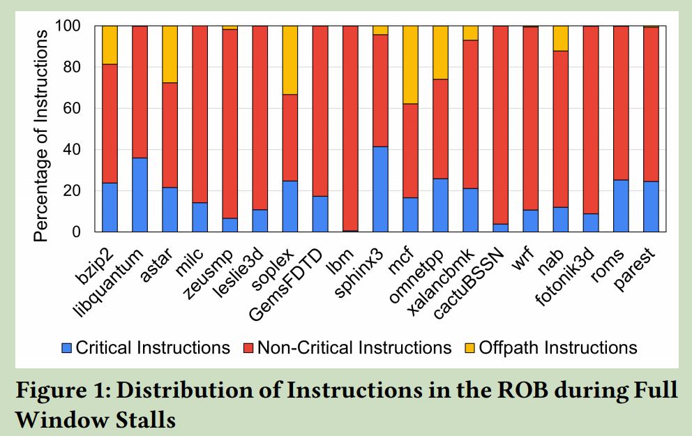
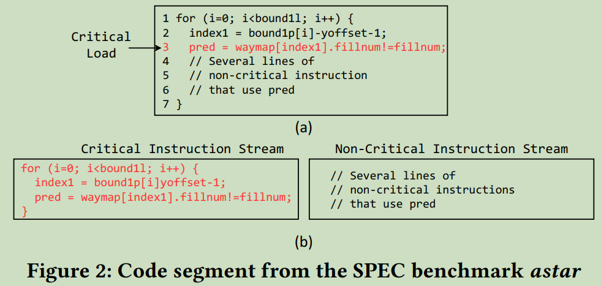
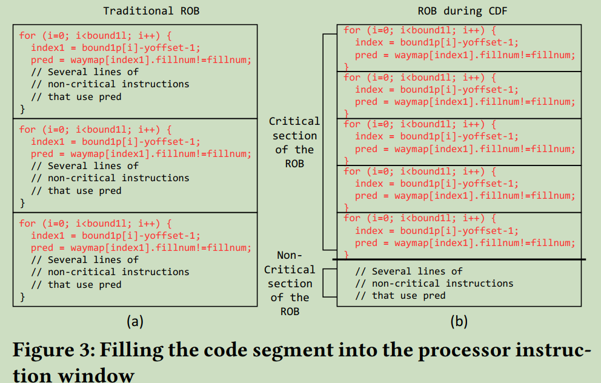
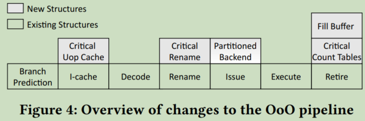
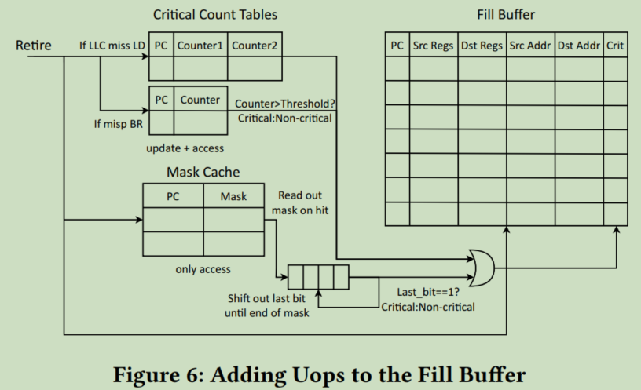
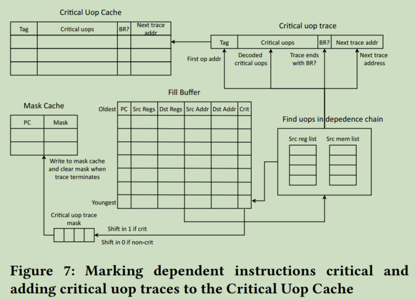
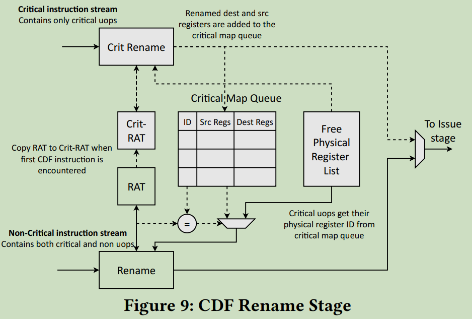
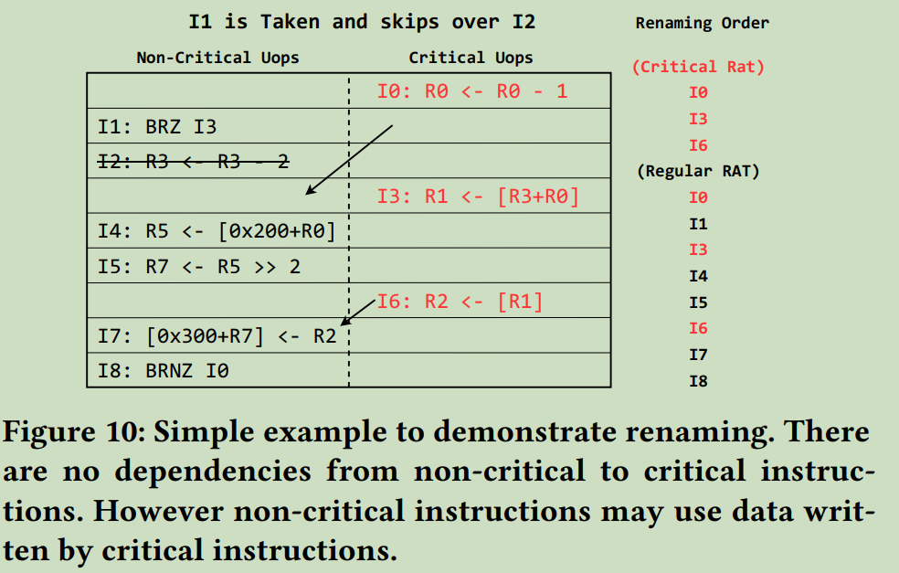

## Introduction

在论文开头，作者介绍了现有的两个问题：
（1）现有乱序核使用大的指令窗口资源（ROB，保留站，load and store queues和物理寄存器）以提取ILP和MLP。然而，这么做导致面积和功耗随着指令窗口大小成指数增长。
（2）程序性能瓶颈在于程序执行的关键路径，如LLC miss，分支预测错误以及导致这些的指令依赖链。据统计，这类指令占比10%~40%，因此当发生full-window stall时，流水线包含更多的非关键指令。如Fig. 1所示。

这篇论文聚焦于关键路径上的指令，关键指令优先取指，从而导致这些指令更早的译码、重命名、执行以及分配更多的指令窗口资源。

同时作者认为在编译阶段实现一个理想的fetch和调度顺序是很困难的，因为runtime事件如cache miss和分支预测错误这些都依赖于输入数据，并且影响那些指令为关键指令。

因此，本文作者提出了Criticality Driven Fetch，runtime识别关键指令和构造其依赖链。关键指令优先于非关键指令进行取指，由于非关键路径最初被跳过，乱序核被更多的关键指令所填充，从而实现顺序指令窗口跨度大于ROB容量，这提升了关键指令的性能。（这其实是针对关键指令提前执行，但是感觉提前的窗口有限，这跟我之前想的在issue阶段加权调度比较像，但是issue属于后端，提前的窗口更加有限，但是更容易的保证语义正确性。而这篇论文则是直接提前到fetch阶段，实现加权fetch。）作者认为如果关键指令被合适的选取，乱序核在不增加开销的情况下能够实现于更大乱序窗口同等的性能。(这边性能收益其实是隐式的提升了指令窗口大小，但是如果不能超过Cache miss的周期，很难有很大性能的提升吧。假设处理器为4发射，LLC cache miss为100周期，则ROB超过400时，基本上不会导致ROB填满。不过提前一个周期issue stalling load就会减少一个周期的stall。)

CDF技术能够加速所有关键指令，本文作者聚焦于LLC miss的load关键路径，同时将hard-to-predict分支标记为关键指令，实现更快的分支恢复。接下来，我们可以看作者是如何实现的。

## Criticality Driven Fetch

### Improving MLP

CDF提升性能的重要因素之一为提升MLP。

下面以一个例子解释CDF的核心思想及应用场景。

图2(a)展示了SPEC benchmark astar的一个代码片段，第三行包含一个数组的访问，访问的索引是一个内存中数据的函数，因此索引是比较随机的。此外，这个数组比较大，无法放置在LLC中。因此第三行的Load会导致LLC miss，从而引发多次的full window stall。图3(a)显示了第三行Load导致full window stall时处理器指令窗口的情况，由于后续循环迭代中的关键Load只需要循环计数器和一个缓存命中的数组访问来计算它们的地址，因此这些负载可以并行访问内存。由于第三行Load在语义上的提前于后续的非关键指令，即使后续指令不会导致长延迟，也无法提前进行commit而占据大量的ROB entry。

图2(b)将相同的代码片段分割成关键和非关键指令两部分，load指令和其依赖链上的指令被划分成关键指令。如果这些关键指令能够优先的取指和分配进ROB，如图3(b)所示，处理器额能够同时执行更多的关键Load，这能够显著提升MLP。

这边需要关注的是前端如何保证语义的正确性，尤其是跨分支。在一个basic block内，也需要保证非关键指令不依赖于关键指令，不然还需要解决寄存器重命名的问题。

### Fetching Critical Loads past Hard-to-Predict Branches

分支预测错误会限制可以提前Fetch的正确路径关键指令数，关键load指令的地址不正确，从而消除了CDF的MLP优势。CDF的解决思路是将hard-to-predict分支也标记为关键指令，提前解决分支错误问题，CDF可以继续取正确路径上的关键指令执行。

### Initiating Critical Loads Earlier

这边作者提出当取指关键指令时，会跳过非关键指令，从而提升了有效前端宽度。

这边有一个疑问：Fetch不是通过PC控制的吗？如何控制每一条指令的PC跳转呢？毕竟不像PRE这样取所有指令，在译码之后放弃执行非关键指令。

Ans: 从原文"If no branch is encountered (or the branch is predicted not-taken), the next fetch address is obtained from the critical uop trace that was previously read out."中可以推测出，Critical uop Cache中记录critical instruction slice时，每一条uop entry不仅保存当前指令信息，而且会保存下一条关键uop的地址。从Fig. 7中也可以直接看出这一点。

### Comparison Against Runahead and Compiler Based Techniques

与Runahead execution相比：

- Runahead execution受限于full window stall的间隔，当runahead interval较短时，收益降低。
- 如果Runahead遇到分支预测错误，随后的偏离路径加载可能会错误地执行，将难以预测的分支标记为关键允许CDF通过及早解决这些分支来获取这些分支之外的正确路径关键负载。
- 具有间隔很远的全窗口停顿的应用程序不会从Runahead中受益，因为它无法在全窗口停顿期间获取足够远的指令以达到下一个关键Load。虽然CDF无法从这些Load中提取并行性，但它会更快地启动下一个关键Load，从而提高性能。
- Runahead链可能不正确并产生大量额外的内存访问。此外，Runahead指令是在核心上执行两次的重复指令。CDF没有这种开销，因为关键指令是主指令流的一部分。

与编译器的优势主要是可以获取动态runtime信息，此外，通过编译器调整指令顺序窗口受限于架构寄存器的个数，而CDF则是受限于物理寄存器个数，后者相对更有优势。

## Implementation

### Overview

流水线概览如图4所示，当指令retire，retired loads和分支通过Critical Count Table判断其关键性。Fill Buffer记录最近的1024条retired uops，当Fill Buffer填充满，从最年轻的uop开始回溯，所有判定为关键的load和分支指令依赖链上的uops都标记为关键。回溯过程将标记关键uop加入Critical Uop cache中。

处理器有两种工作模式：CDF mode和regular mode，当hit Critical Uop Cache，处理器进入CDF mode。在CDF模式下，当从关键Uop缓存中获取关键微指令时，计算所有fetch地址并预测分支，这就形成了关键指令流。关键指令流中的伪指令在Critical Rename阶段进行重命名，这使用一个独立的Register Alias Table。

在关键指令填充流水线的同时，使用关键指令产生的分支预测目标从ICache中读取指令流，这样就能够保证正常指令和关键指令的控制流路径相同。正常指令流在前端包含关键指令和非关键指令，在译码之后送入到普通的重命名阶段。非关键指令按照正常进行命名，关键指令则需要replay，即与Critical RAT中同步，以保证非关键指令能够正确引用关键指令的寄存器。正常指令流中关键指令在replay重命名之后就会被剔除，关键指令流和正常指令流中的非关键指令动态的分配后端资源。

### Identifying and Storing Critical Instructions

**识别关键Load**

为了追踪关键Load，作者使用一个64通道的Critical Count Table，记录Load指令的LLC缺失率，如果超过阈值则判定为Critical Load。

如何在CPU中获取Load指令是否发生了LLC miss?

**将指令填充到Fill Buffer**

指令在retire时更新Critical Count Table，并且根据Critical Count Table的值决定是否标记为Critical。然后retire的指令被填充到一个FIFO（Fill Buffer）中。每个Fill Buffer entry包含：（1）译码之后的uop；（1）bit向量表示的源寄存器和目的寄存器；（3）读/写内存地址的tag；（4）1 bit指示该指令是否为Critical。

当Fill Buffer已满时，我们将Fill Buffer从最年轻的指令遍历到最旧的指令，为关键Load构建依赖链，类似于Filtered Runahead中使用的方案。

**将关键指令填充到Critical Uop Cache**

当执行Fill Buffer指令遍历时，将分支当作边界进行考虑。一个BB中的关键指令当作一个集合，保存到Critical Uop Cache中，并以第一条指令作为tag进行索引。当一个BB中关键指令超过8条uops，将会拆分成两个entry进行保存。当保存一个BB时，前一个BB的tag也会保存，这样在指令正向执行时，处理器前端就可以通过该信息或分支去判断接下来要取的指令。
回溯1024 entries Fill Buffer一共需要1200个周期。

**Mask Cache**

同一个BB中的不同指令可能会被不同的Load依赖链所包含，但是Critical Uop Cache中是以BB为粒度来保存指令的，因此需要对两个路径中的uop进行合并。
Mask Cache则是用于这个合并，实现的过程是每个BB对应Mask Cache中的一个entry，使用一个比特向量中的每一比特表示是否已经被选为关键指令。因此在回溯的时候在关键路径上的指令和Mask Cache中为1的指令都标记为关键指令，合并写入Critical Uop Cache中。

### Fetching Critical Instructions OoO

该部分涉及两个模块：(1)增加新的PC寄存器，复制next-PC逻辑; (2)256-entry FIFO的Delayed Branch Queue.

**Entering CDF mode**

当指令在Critical Uop Cache中命中时，处理器赋值PC到critical next-PC逻辑中，并开始CDF模式。
CDF模式从Critical Uop Cache中读取关键指令，并根据分值计算结果和保存的下一个BB关键指令地址计算取指地址，并且将分支情况和分支目标保存到Delayed Branch Queue中。由于Critical Uop Cache中保存的时译码结果，因此在取值之后直接进入重命名阶段。

**Fetching Non-Critical Instruction**

从ICache中Fetch非关键指令现有CPU方案中相同，流水线前端存在两点不同：
（1）分支预测来源于Delayed Branch Queue
（2）关键指令在Rename repaly之后丢弃

**Assigning Timestamps**

本文通过timestamp指示关键指令和非关键指令之间的relative ordering，这一点如何实现呢？感觉开销会很大。

### Renaming Instruction OoO

如图9所示，在第一条关键指令重命名之前，会将RAT中内容复制到Crit-RAT中。随后，关键指令按照常规模式在Crit-RAT中进行重命名，并且将重命名的结果记录到Critical Map Queue中，后续的normal instruction stream重命名时，Critical instruction直接从Critical Map Queue head中读取Rename结果，非关键指令从Free Physical Register List中取出空闲寄存器进行重命名。此处，Critical Map Queue需要保证不会溢出，本文设计为256-entry FIFO。

### Allocating Instructions and Partitioning Window Resources