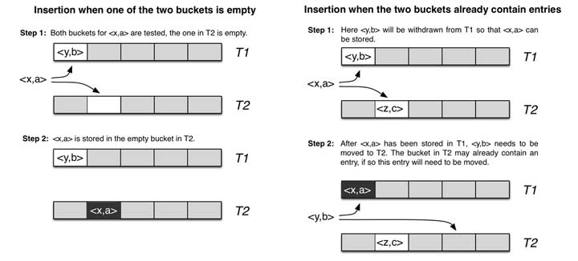
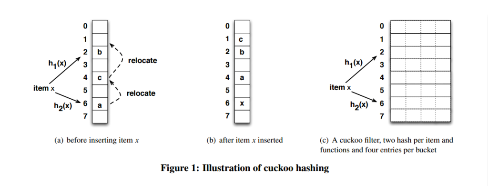

# Cuckoo Hash布谷鸟哈希

## 1. 定义

一种解决hash冲突的方法，其目的是使用简单的hash 函数来提高hash table的利用率，同时保证$O(1)$的查询时间。基本思想是使用2个hash函数来处理碰撞，从而每个key都对应到2个位置。

## 2. 操作

- 对key值hash，生成两个hash key值，hashk1和 hashk2, 如果对应的两个位置上有一个为空，那么直接把key插入即可。
- 否则，任选一个位置，把key值插入，把已经在那个位置的key值踢出来。
- 被踢出来的key值，需要重新插入，直到没有key被踢出为止。

## 3. 衍生背景

Cuckoo中文名叫布谷鸟，这种鸟有一种即狡猾又贪婪的习性，它不肯自己筑巢， 而是把蛋下到别的鸟巢里，而且它的幼鸟又会比别的鸟早出生，布谷幼鸟天生有一种残忍的动作，幼鸟会拼命把未出生的其它鸟蛋挤出窝巢，今后以便独享“养父 母”的食物。借助生物学上这一典故，cuckoo hashing处理碰撞的方法，就是把原来占用位置的这个元素踢走，不过被踢出去的元素还要比鸟蛋幸运，因为它还有一个备用位置可以安置，如果备用位置上 还有人，再把它踢走，如此往复。直到被踢的次数达到一个上限，才确认哈希表已满，并执行rehash操作。

## 5. 哈希碰撞之前的空间利用率

1维和一般hash一样为50%， 二维情况看下面例子。一个改进的哈希表如下图所示，每个桶（bucket）有4路槽位（slot）。当哈希函数映射到同一个bucket中，在其它三路slot未被填满 之前，是不会有元素被踢的，这大大缓冲了碰撞的几率。笔者自己的简单实现上测过，采用二维哈希表（4路slot）大约80%的占用率（CMU论文数据据说 达到90%以上，应该是扩大了slot关联数目所致）

> 原文转载自：[Cuckoo Hash 布谷鸟哈希](https://blog.csdn.net/nannanxiami/article/details/109568254)

## 相关资料

[布谷鸟过滤器（Cuckoo Filter）](https://www.cnblogs.com/zhaodongge/p/15067657.html)