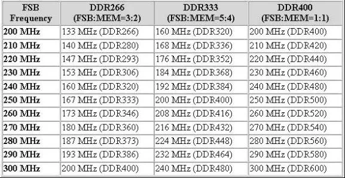

> 本文转载自：https://zhuanlan.zhihu.com/p/595782439

DDR内存 既然叫做双倍速率SDRAM（Dual date rate SDRSM），就是说是SDRAM的升级换代产品。从技术上分析，DDR SDRAM最重要的改变是在界面数据传输上，其在时钟信号上升缘与下降缘时各传输一次数据，这使得DDR的数据传输速率为传统SDRAM的两倍。那么大家就应该知道了，我们所说的DDR400，DDR333，DDR266，他们的工作频率其实仅为那些数值的一半，也就是说DDR400工作频率为200MHz。

## FSB与内存频率的关系

首先请大家看看表一：FSB(Front Side Bus：前端总线)和内存比率与内存实际运行频率的关系。

| FSB/内存比率 | 内存实际运行频率 |
| ---- | ------ |
| 1/01 | 200MHz |
| 1/02 | 100MHz |
| 2/03 | 133MHz |
| 3/04 | 150MHz |
| 3/05 | 120MHz |
| 5/06 | 166MHz |
| 7/10 | 140MHz |
| 9/10 | 180MHz |

对于大多数玩家来说，FSB和内存同步，即1:1(DFI 用1/01表示)是使性能最佳的选择。而其他的设置都是异步的。同步后，内存的实际运行频率是FSBx2，所以，DDR400的内存和200MHz的FSB正好同步。如果你的FSB为240MHz，则同步后，内存的实际运行频率为240MHz x 2 = 480MHz。

表2更详尽列出了FSB和内存比率与内存实际运行频率的关系

强烈建议采用1：1的FSB与内存同步的设置，这样可以完全发挥内存带宽的优势。

## Command Per Clock(CPC)

    可选的设置：Auto，Enable(1T)，Disable(2T)。

　　Command Per Clock(CPC：指令比率，也有翻译为： 首命令延迟 )，一般还被描述为DRAM Command Rate、CMD Rate等。由于目前的DDR内存的寻址，先要进行P-Bank的选择（通过DIMM上CS片选信号进行），然后才是L-Bank/行激活与列地址的选择。这个参数的含义就是指在P-Bank选择完之后多少时间可以发出具体的寻址的L-Bank/行激活命令，单位是时钟周期。

　　显然，也是越短越好。但当随着主板上内存模组的增多，控制芯片组的负载也随之增加，过短的命令间隔可能会影响稳定性。因此当你的内存插得很多而出现不太稳定的时间，才需要将此参数调长。目前的大部分主板都会自动设置这个参数。

　　该参数的默认值为Disable(2T)，如果玩家的内存质量很好，则可以将其设置为Enable(1T)。

TODO:

