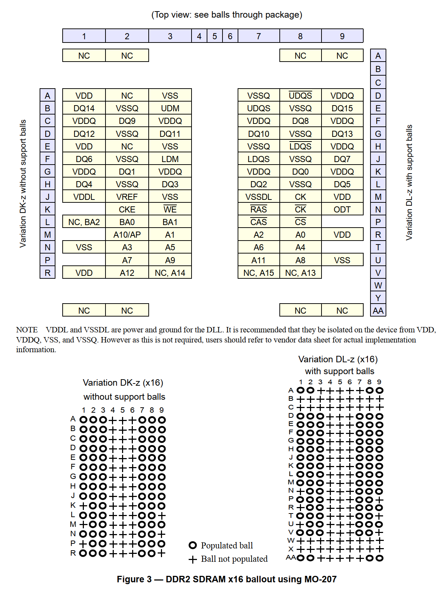

## 一、DDR2

### 1.1 DDR2 Scope

DDR2标准支持256Mb~4Gb的DDR2 SDRAM器件，分别对应IO为x4, x8和x16。

### 1.2 DDR2封装布局和寻址

#### 1.2.1 DDR2 SDRAM封装布局

#### 1.2.2 Quad-stacked/quad-die DDR2 SDRAM internal rank associations

从以上图可以看出，Quad-stacked/quad-die是通过CKE0/CKE1/$\overline{CS}0$/$\overline{CS}1$来区分的，因此可以通过这些信号和其他地址信号来确定寻址。

#### 1.2.3 IO功能描述

> 注：Data strobe信号的作用是帮助内存控制器和DDR SDRAM之间实现同步，确保数据在传输过程中被正确地读取或写入。它的主要作用是在数据时钟边沿之前或之后，提供一个时序参考信号，以便内存控制器正确读取或写入数据。
> DDR SDRAM是双倍数据率的存储器，它可以在每个时钟周期内传输两次数据。因此，Data strobe信号的频率是数据时钟频率的一半。在数据传输过程中，Data strobe信号与数据同时传输，确保数据在传输过程中被正确地读取或写入。

#### 1.2.4 DDR2 SDRAM寻址

Page size is the number of bytes of data delivered from the array to the internel sense amplifiers when an `ACTIVATE` is registered. Page size is per bank, calculated as follows:

$$page\ size\ =\ 2^{COLBITS} \times ORG \div 8$$

其中，$COLBITS$是列地址位数，$ORG$是IO比特数，如x4, x8, x16。

### 1.3 功能描述

#### 1.3.1 简化版状态机

#### 1.3.2 基本功能

对 DDR2 SDRAM 的读写访问是面向突发的；访问从选定的位置开始，并按编程序列持续 4 个或 8 个突发长度。访问以`Active`命令的注册开始，然后是`Read`或`Write`命令。与`Activate`命令同时注册的地址位用于选择要访问的bank和row（BA0-BA2 选择bank；A0-A15 选择row）。与`Read`或`Write`命令同时注册的地址位用于选择突发访问的起始列位置，并确定是否要发出`auto precharge`命令。

在正常操作之前，必须初始化 DDR2 SDRAM。以下部分提供了包括设备初始化、寄存器定义、命令描述和设备操作的详细信息。

#### 1.3.3 上电和初始化

DDR2 SDRAM 必须以预定义的方式加电和初始化。未指定的操作程序可能会导致未定义的操作。

对于 DDR2 SDRAM，BA0和BA1位都必须针对模式/扩展模式寄存器设置 (MRS/EMRS) 命令进行解码。用户必须初始化所有四个模式寄存器，寄存器可以按任何顺序初始化。

##### 1.3.3.1 上电和初始化顺序

#### 1.3.4 编程模式和扩展模式寄存器

对于应用灵活性、burst length、burst type、$\overline{CAS}$ latency、DLL reset function、write recovery time (WR) 是用户定义的变量，必须使用模式寄存器设置 (MRS) 命令进行编程。 此外，DLL disable function、driver impedance、additive CAS latency、ODT (On Die Termination)、single-ended strobe和OCD (off chip driver impedance adjustment)也都是用户定义的变量，必须使用扩展模式寄存器设置 (EMRS) 命令进行编程。模式寄存器和扩展模式寄存器的内容可以通过重新执行MRS和EMRS命令来更改。即使用户选择修改某一部分MR/EMR寄存器的内容，也必须重新编程所有的寄存器。

MRS、EMRS 和 Reset DLL 不影响数组内容，这意味着包括那些在内的重新初始化可以在上电后随时执行而不影响数组内容。

##### 1.3.4.1 DDR2 SDRAM 模式寄存器 (MR)

##### 1.3.4.2 DDR2 SDRAM 扩展模式寄存器 (EMR(#))

##### 1.3.4.3 Off-chip driver (OCD) impedance adjustment

##### 1.3.4.4 ODT (On Die Termination)

##### 1.3.4.5 ODT related timings

#### 1.3.5 Bank Activate Command

通过在时钟的上升沿将 $\overline{CAS}$ 和 $\overline{WE}$ 保持为高电平，同时将 $\overline{CS}$ 和 $\overline{RAS}$ 保持为低电平来发出 `Bank Activate` 命令。bank地址`BA0-BA2`用于选择所需的bank。行地址`A0-A15`用于确定在所选存储体中激活哪一行。在执行任何读取或写入操作之前，必须应用`Bank Activate`命令。在`bank active`命令之后，DDR2 SDRAM可以在接下来的时钟周期接受读取或写入命令。如果向不满足`tRCDmin`规范的存储区发出读/写命令，则必须将附加延迟编程到器件中，以便在内部向器件发出读/写命令时延迟。必须选择附加延迟值以确保满足`tRCDmin`。支持 0、1、2、3、4 和可选的 5 的附加延迟。 一旦一个bank被激活，它必须在另一个bank激活命令可以应用于同一bank之前进行预充电 (即需要激活同一个bank的另一行之前，需要先完成预充电，否则SA无法正常工作)。bank激活和预充电时间分别定义为`tRAS`和`tRP`。对同一bank的连续`Bank Activate`命令之间的最小时间间隔由器件的`RAS`周期时间 ($t_{RC}$) 决定。`Bank Activate`命令之间的最小时间间隔为$t_{RRD}$。

为了保证8 bank器件不超过4 bank器件的瞬时供电能力，8 bank器件的操作必须遵守一定的限制条件。有两条规则，一种用于限制可以发出的连续`ACT`命令的数量，另一种用于允许$\overline{RAS}$预充电的`Precharge All`命令有更长的执行时间。规则如下：

- 8 bank设备顺序`Bank Activation`限制：在滚动`tFAW`窗口中不能激活超过 4 个 bank。转换为时钟是通过将`tFAW[ns]`除以`tCK[ns]`或`tCK(avg)[ns]`来完成的，具体取决于speed bin，然后四舍五入到下一个整数值。作为滚动窗口的示例，如果`RU{ (tFAW / tCK) }`或`RU{ (tFAW / tCK(avg) }`是 10 个时钟，并且在时钟 N 发出激活命令，则不超过三个进一步的激活命令可能在时钟 N+1 和 N+9 或之间发出。
- 8 bank 器件`Precharge All`Allowance：8 Bank 器件的`Precharge All`命令的`tRP`将等于`tRP + 1 x tCK`或`tnRP + 1 x nCK`，具体取决于speed bin，其中`tnRP = RU{ tRP / tCK(avg) }` ，`tRP`是单个bank预充电的延迟。

#### 1.3.6 Read and Write Access Modes

激活bank后，可以执行读或写周期。这是通过在时钟的上升沿将$\overline{RAS}$设置为高电平、$\overline{CS}$和$\overline{CAS}$为低电平来实现的。此时还必须定义$\overline{WE}$，判断访问周期是读操作（$\overline{WE}$ HIGH）还是写操作（$\overline{WE}$ LOW）。

DDR2 SDRAM 提供快速的列访问操作。单个读取或写入命令将在连续的时钟周期上启动串行读取或写入操作。突发周期的边界严格限制在页面长度的特定段内。例如，32 Mbit x 4 I/O x 4 Bank 芯片的页面长度为 2048 位（由 CA0-CA9、CA11 定义）。2048的页面长度根据突发长度分为512或256个唯一可寻址边界段，4位突发为512，8位突发为256。4位或8位突发操作将完全发生在512或256组之一中，从读取或写入命令（CA0-CA9，CA11）期间提供给设备的列地址开始。第二次、第三次和第四次访问也将发生在该组段内，但是，突发顺序是起始地址和突发序列的函数。

在BL = 4设置的情况下，新的突发访问不得中断先前的4位突发操作。但是，在BL = 8设置的情况下，允许有两种情况被新的突发访问中断，一种是读取被读取中断，另一种是写入被具有4位突发边界的写入中断。最小$\overline{CAS}$到$\overline{CAS}延迟由tCCD定义，读取或写入周期至少为2个时钟。

##### 1.3.6.1 Posted $\overline{CAS}$

支持post $\overline{CAS}$操作，使命令和数据总线高效，以实现DDR2 SDRAM中的可持续带宽。在此操作中，DDR2 SDRAM允许在$\overline{RAS}$ bank激活命令之后立即发出$\overline{RAS}$读取或写入命令（或在$\overline{RAS}$-$\overline{CAS}$ 延迟时间tRCD期间的任何时间）。该命令在设备内部发出之前会保留附加延迟 (AL) 的时间。读取延迟 (RL) 由 AL 和 $\overline{CAS}$ 延迟 (CL) 的总和控制。因此，如果用户选择在 tRCDmin 之前发出读/写命令，则必须将 AL（大于 0）写入 EMR(1)。写入延迟 (WL) 始终定义为 RL - 1（读取延迟 -1），其中读取延迟定义为附加延迟与 $\overline{CAS}$ 延迟之和 (RL=AL+CL)。
使用 AL 的读取或写入操作允许无缝突发（请参阅读取突发和写入突发部分中的无缝操作时序图示例）。

###### 1.3.6.1.1 Examples of posted CAS operation

Examples of a read followed by a write to the same bank where AL = 2 and where AL = 0 are shown in Figure 30 and 31, respectively.

##### 1.3.6.2 Burst Mode Operation

突发模式操作用于向存储器位置（写周期）或从存储器位置（读周期）提供恒定的数据流。定义突发模式如何运行的参数是突发序列和突发长度。DDR2 SDRAM仅支持 4 位突发和 8 位突发模式。对于 8 位突发模式，支持完全交错地址排序，但是，为了便于实施，顺序地址排序是基于半字节的。突发类型（顺序或交错）是可编程的，由 MR[A3] 定义，这类似于DDR SDRAM操作。支持无缝突发读取或写入操作。与DDR设备不同，在BL = 4模式操作期间禁止中断突发读取或写入周期。然而，在BL = 8模式的情况下，突发读取或写入操作的中断仅限于两种情况，读取被读取中断，或写入被写入中断。因此，DDR2 SDRAM设备不支持Burst Stop命令。

##### 1.3.6.3 Burst Read Command

