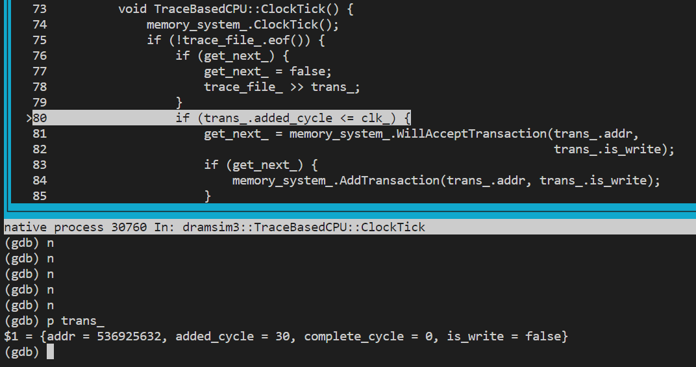

<!-- TOC -->

- [项目构建](#项目构建)
- [代码解读](#代码解读)

<!-- /TOC -->

## 项目构建

DRAMsim3的[github链接](https://github.com/umd-memsys/DRAMsim3)，里面有关于DRAMsim3的构建和使用。

为了进行源码调试，可以对CMake进行以下修改：

The DRAMsim3 is build for release by default, which is setted by CMakeLists.txt

```cmake
set(default_build_type "Release")
if(NOT CMAKE_BUILD_TYPE AND NOT CMAKE_CONFIGURATION_TYPES)
  message(STATUS "Setting build type to '${default_build_type}' as none was specified.")
  set(CMAKE_BUILD_TYPE "${default_build_type}" CACHE
      STRING "Choose the type of build." FORCE)
  # Set the possible values of build type for cmake-gui
  set_property(CACHE CMAKE_BUILD_TYPE PROPERTY STRINGS
    "Debug" "Release" "MinSizeRel" "RelWithDebInfo")
endif()
```

For gdb debug with source code displayed, we need to generate the debug version. To generate executable with debug information, you need to do the following:

- Configure the CXX_FLAGS, add the following configuration in CMakeLists.txt
  ```cmake
  SET(CMAKE_CXX_FLAGS_DEBUG "$ENV{CXXFLAGS} -O0 -Wall -g2 -ggdb")
  SET(CMAKE_CXX_FLAGS_RELEASE "$ENV{CXXFLAGS} -O3 -Wall")
  ```
- Build with Debug Defined
  ```shell
  cd build
  cmake .. -DCMAKE_BUILD_TYPE=Debug
  make
  make -nB |& vim - # for checking
  ```

## 代码解读

以下对DRAMsim3的代码进行简单的解读。

```c++ {.line-numbers}
CPU *cpu;
if (!trace_file.empty()) {
    cpu = new TraceBasedCPU(config_file, output_dir, trace_file);
} else {
    if (stream_type == "stream" || stream_type == "s") {
        cpu = new StreamCPU(config_file, output_dir);
    } else {
        cpu = new RandomCPU(config_file, output_dir);
    }
}
```

从上可以看出，DRAMsim3支持三种仿真模式：trace_based，stream_based和Random_stream_based。

当DRAMsim3与其他CPU仿真器联合仿真时，如gem5、zsim等，都是基于trace_based模式。CPU仿真器产生访存trace，DRAMsim3对接收访存trace，并给出反馈。

在DRAMsim3单独运行模式中，trace则是从文件中读取。

在TraceBaseCPU构造时，对trace file进行读取。

```c++ {.line-numbers}
TraceBasedCPU::TraceBasedCPU(const std::string& config_file,
                             const std::string& output_dir,
                             const std::string& trace_file)
    : CPU(config_file, output_dir) {
    trace_file_.open(trace_file);
    if (trace_file_.fail()) {
        std::cerr << "Trace file does not exist" << std::endl;
        AbruptExit(__FILE__, __LINE__);
    }
}
```

随后，在for循环中基于trace进行仿真。

```c++ {.line-numbers}
for (uint64_t clk = 0; clk < cycles; clk++) {
    cpu->ClockTick();
}
```
接下来，对ClockTick()进行分析。

```c++ {.line-numbers}
void TraceBasedCPU::ClockTick() {
    memory_system_.ClockTick();
    if (!trace_file_.eof()) {
        if (get_next_) {
            get_next_ = false;
            trace_file_ >> trans_;
        }
        if (trans_.added_cycle <= clk_) {
            get_next_ = memory_system_.WillAcceptTransaction(trans_.addr,
                                                             trans_.is_write);
            if (get_next_) {
                memory_system_.AddTransaction(trans_.addr, trans_.is_write);
            }
        }
    }
    clk_++;
    return;
}
```

首先，在每个周期开始，执行memory_system_.ClockTick()，即Memory内部执行访存请求（消耗Transaction）。

当get_next_为真时，从trace_file中读取一条trace，并赋值给trans_。
在trans_中保存着访存请求的tick（added_cycle），如下图所示。



每个周期，clk_加1，当前时刻clk_达到请求到达时刻（trans_.added_cycle）之后，DRAMsim3开始对该请求进行处理。如果可以处理该请求，memory_system_.WillAcceptTransaction()返回True，如果可以处理该请求，则将Transaction增加到memory_system的处理队列中，等待memory_system_.ClockTick()进行处理。此外，将get_next_赋值为True，下一个时刻可以从trace中继续读取下一条访存请求。

```c++ {.line-numbers}
bool Controller::WillAcceptTransaction(uint64_t hex_addr, bool is_write) const {
    if (is_unified_queue_) {
        return unified_queue_.size() < unified_queue_.capacity();
    } else if (!is_write) {
        return read_queue_.size() < read_queue_.capacity();
    } else {
        return write_buffer_.size() < write_buffer_.capacity();
    }
}
```

从以上代码可以看出，能否接收该访存请求的限制为read queue或write queue是否已满。

```c++ {.line-numbers}
bool JedecDRAMSystem::AddTransaction(uint64_t hex_addr, bool is_write) {
// Record trace - Record address trace for debugging or other purposes
#ifdef ADDR_TRACE
    address_trace_ << std::hex << hex_addr << std::dec << " "
                   << (is_write ? "WRITE " : "READ ") << clk_ << std::endl;
#endif

    int channel = GetChannel(hex_addr);
    bool ok = ctrls_[channel]->WillAcceptTransaction(hex_addr, is_write);

    assert(ok);
    if (ok) {
        Transaction trans = Transaction(hex_addr, is_write);
        ctrls_[channel]->AddTransaction(trans);
    }
    last_req_clk_ = clk_;
    return ok;
}
```

继续调用Controller::AddTransaction()

```c++ {.line-numbers}
bool Controller::AddTransaction(Transaction trans) {
    trans.added_cycle = clk_;
    simple_stats_.AddValue("interarrival_latency", clk_ - last_trans_clk_);
    last_trans_clk_ = clk_;

    if (trans.is_write) {
        if (pending_wr_q_.count(trans.addr) == 0) {  // can not merge writes
            pending_wr_q_.insert(std::make_pair(trans.addr, trans));
            if (is_unified_queue_) {
                unified_queue_.push_back(trans);
            } else {
                write_buffer_.push_back(trans);
            }
        }
        trans.complete_cycle = clk_ + 1;
        return_queue_.push_back(trans);
        return true;
    } else {  // read
        // if in write buffer, use the write buffer value
        if (pending_wr_q_.count(trans.addr) > 0) {
            trans.complete_cycle = clk_ + 1;
            return_queue_.push_back(trans);
            return true;
        }
        pending_rd_q_.insert(std::make_pair(trans.addr, trans));
        if (pending_rd_q_.count(trans.addr) == 1) {
            if (is_unified_queue_) {
                unified_queue_.push_back(trans);
            } else {
                read_queue_.push_back(trans);
            }
        }
        return true;
    }
}
```

Controller::AddTransaction()的逻辑如下：

- 如果为写访存:
  - 将当前transaction插入到return queue中
  - 此外，如果write地址不与之前的pending write merge，则同时将该transaction插入到pending write queue和write buffer中
- 如果为读访存:
  - 地址与pending write queue中的transaction地址冲突，则从write buffer中读取数据，并将transaction插入到return queue中
  - 否则，将该transaction插入到pending read queue和read queue中

注：在与gem5的联合仿真中，DRAMsim3接收访存请求，调用memory_system_.WillAcceptTransaction()和memory_system_.AddTransaction()将请求加入处理队列，同时调用memory_system_.ClockTick()实现对访存请求的处理，在处理完成之后返回Response到CPU。

接下来，对memory_system_.ClockTick()实现DRAM transaction处理过程进行分析。

```c++ {.line-numbers}
void JedecDRAMSystem::ClockTick() {
    for (size_t i = 0; i < ctrls_.size(); i++) {
        // look ahead and return earlier
        while (true) {
            auto pair = ctrls_[i]->ReturnDoneTrans(clk_);
            if (pair.second == 1) {
                write_callback_(pair.first);
            } else if (pair.second == 0) {
                read_callback_(pair.first);
            } else {
                break;
            }
        }
    }
    for (size_t i = 0; i < ctrls_.size(); i++) {
        ctrls_[i]->ClockTick();
    }
    clk_++;

    if (clk_ % config_.epoch_period == 0) {
        PrintEpochStats();
    }
    return;
}
```

首先代码第2行~第14行，检查return queue中所有已完成的transaction（complete_cycle < clk），并执行相应的callback。

第15~17行，对每个channel的controller执行一个周期的forward。


```c++ {.line-numbers}
void Controller::ClockTick() {
    // update refresh counter
    refresh_.ClockTick();

    bool cmd_issued = false;
    Command cmd;
    if (channel_state_.IsRefreshWaiting()) {
        cmd = cmd_queue_.FinishRefresh();
    }

    // cannot find a refresh related command or there's no refresh
    if (!cmd.IsValid()) {
        cmd = cmd_queue_.GetCommandToIssue();
    }

    if (cmd.IsValid()) {
        IssueCommand(cmd);
        cmd_issued = true;

        if (config_.enable_hbm_dual_cmd) {
            auto second_cmd = cmd_queue_.GetCommandToIssue();
            if (second_cmd.IsValid()) {
                if (second_cmd.IsReadWrite() != cmd.IsReadWrite()) {
                    IssueCommand(second_cmd);
                    simple_stats_.Increment("hbm_dual_cmds");
                }
            }
        }
    }

    // ... 省略power建模

    ScheduleTransaction();
    clk_++;
    cmd_queue_.ClockTick();
    simple_stats_.Increment("num_cycles");
    return;
}
```


<!-- TODO: -->
代码第3行，Refresh::ClockTick()判断是否需要refresh，如果需要则通过InsertRefresh()处理刷新过程，在后文会进行进一步解读。

如果需要刷新，则发射刷新的命令，否则从指令队列中取出指令进行发射。（第7~29行）
<!-- TODO: -->
其中IssueCommand()也会在后续展开。

随后，还有ScheduleTransaction()和cmd_queue_.ClockTick()，接下来将对以上的几个函数依次进行解读。

**Refresh::ClockTick()**

```c++ {.line-numbers}
void Refresh::ClockTick() {
    if (clk_ % refresh_interval_ == 0 && clk_ > 0) {
        InsertRefresh();
    }
    clk_++;
    return;
}
```

如果当前时刻到达刷新的间隔，则需要对DRAM进行刷新，通过InsertRefresh()实现了多种刷新策略，在此不继续展开，里面实现的操作是根据不同的刷新策略对不过DRAM存储范围（如以Channel粒度）内设置需要刷新状态，并在对应的refresh queue中加入刷新指令。

**ChannelState::IsRefreshWaiting()**

检查当前Channel的refresh queue是否为空。

```c++ {.line-numbers}
bool IsRefreshWaiting() const { return !refresh_q_.empty(); }
```

**CommandQueue::FinishRefresh()**

从channel_state中读取预充或刷新指令，并清除refresh queue中对应项。

```c++ {.line-numbers}
Command CommandQueue::FinishRefresh() {
    // we can do something fancy here like clearing the R/Ws
    // that already had ACT on the way but by doing that we
    // significantly pushes back the timing for a refresh
    // so we simply implement an ASAP approach
    auto ref = channel_state_.PendingRefCommand();
    if (!is_in_ref_) {
        GetRefQIndices(ref);
        is_in_ref_ = true;
    }

    // either precharge or refresh
    auto cmd = channel_state_.GetReadyCommand(ref, clk_);

    if (cmd.IsRefresh()) {
        ref_q_indices_.clear();
        is_in_ref_ = false;
    }
    return cmd;
}
```

**CommandQueue::GetCommandToIssue()**

从指令队列中读取指令，不从当前刷新的channel对应的queue中读取指令，因为正在刷新。如果没有准备好的指令，则通过Command()构建一条无效指令返回。

```c++ {.line-numbers}
Command CommandQueue::GetCommandToIssue() {
    for (int i = 0; i < num_queues_; i++) {
        auto& queue = GetNextQueue();
        // if we're refresing, skip the command queues that are involved
        if (is_in_ref_) {
            if (ref_q_indices_.find(queue_idx_) != ref_q_indices_.end()) {
                continue;
            }
        }
        auto cmd = GetFirstReadyInQueue(queue);
        if (cmd.IsValid()) {
            if (cmd.IsReadWrite()) {
                EraseRWCommand(cmd);
            }
            return cmd;
        }
    }
    return Command();
}
```

**Controller::IssueCommand()**


