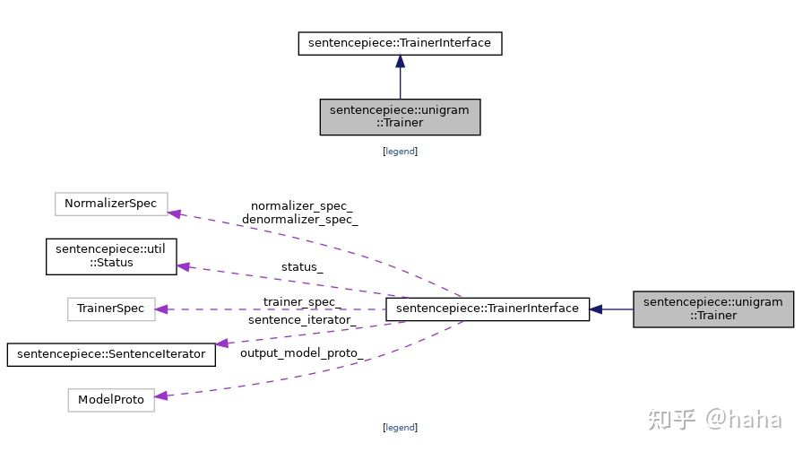

# Doxygen代码文档生成

安装

```shell
sudo apt install graphviz  # 用于生成代码关系图 
sudo apt install doxygen
```
使用
```shell
$ cd CODE_DIR
$ doxygen -g Doxygen.config  # 生成配置文件 
$ vi Doxygen.config          # 修改配置文件
RECURSIVE              = YES 
$ doxygen Doxygen.config     # 根据代码生成文档
```

生成的文档在html目录下，生成的类继承图如下：

