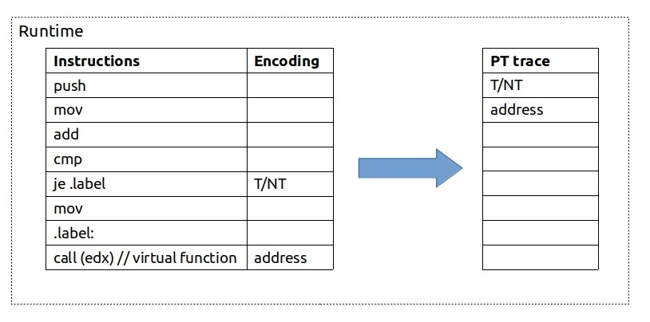
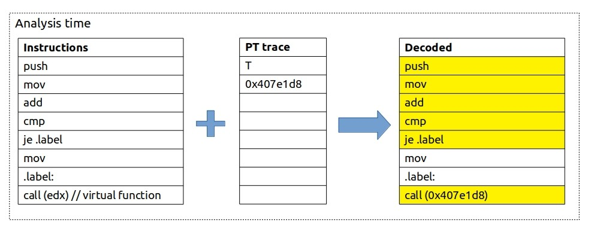
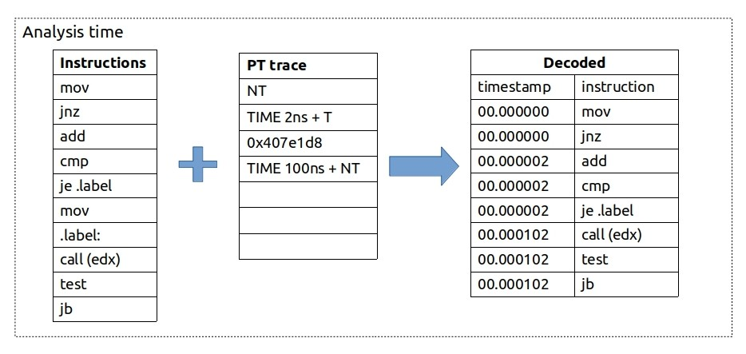

This is the series of articles that consists of multiple parts. See [below](#usages) for links to other parts.

The oldest method for doing performance analysis is the code instrumentation. We all did it many times. Remember when you insert some ==printf== statement in the beginning of the function just to count the number of times the function was called? Ha, me too. This is the easiest and likely the most precise and verbose technique to analyze performance application. Yet code instrumentation has serious disadvantages. In particular, large overhead and need to recompile the app every time we want to count something different. People do not use manual code instrumentation this days very often. However, automated code instrumentation is still used, for example in PGO [^1].

During the years new methods for doing performance analysis have been developed. One of them is based on interrupts (PMI[^2]). The easiest way to look at it is the following. If you use a debugger and will stop the program every second and record the place where you stop, you will get a collection of the samples which will tell you where your program spends time the most. This is the over simplified description of what profiling tools are doing. Read more about the underlying mechanics here: [PMU counters and profiling basics](https://easyperf.net/blog/2018/06/01/PMU-counters-and-profiling-basics), [Basics of profiling with perf](https://easyperf.net/blog/2018/08/26/Basics-of-profiling-with-perf).

But that’s not all the methods we have. In this article I want to show a revolutionary technology that allows doing performance analysis without interrupting the program execution. ==This technology is called Intel Processor Trace (PT). It has tracing nature and in some sense is similar to Linux tracing facilities like ftrace/strace and so on.==

==So what is Intel PT? **It is a CPU tracing feature which records the program execution by encoding packets in a very compressed format.**== **It has extensive coverage and relatively small ~5% overhead[^3]. It’s main usages are postmortem analysis and root causing performance glitches.**

## Workflow

Similar to sampling techniques it does not require any modifications to the source code. All you need to collect traces is just to run the program under PT enabled tool. Once PT are enabled SW tools start writing packets to DRAM. Similar to [LBR](https://easyperf.net/blog/2018/06/08/Advanced-profiling-topics-PEBS-and-LBR#last-branch-record-lbr), Intel PT works by recording branches.

At runtime, whenever CPU encounters any branch instruction (je, call, ret) it will record what happened with this branch. For simple conditional jump instruction CPU will record whether it was taken (T) or not (NT) using just 1 bit. For indirect call, for example, it will record the target address. Note that unconditional branches are ignored, since we know statically where they go. Example:



CPU then stores this highly compressed PT trace in a binary form to DRAM.

At the time of analysis, we bring together the application binary and the PT trace collected. SW decoder needs the application binary file, in order to reconstruct the execution flow of the program. It starts from an entry point of the program and then uses collected traces as a lookup reference to determine the control flow:



Note that this is exact reconstruction of instruction flow.

Even taking into account compressed format of the traces, it’s still a lot of data. Typically it’s less than 1 byte per instruction. Be prepared to have at least 100 MB/s of encoded data. When decoded it might easily be 10 times more (~1GB/s). This makes it not usable for long running workloads. But you can run it for a small periods of time even on the big workload. So typical use case might not be similar to profiling. But rather attaching to the process just for the period of time when the glitch happened. Or using a circular buffer, where new traces will overwrite old ones, i.e. always having traces for the last 10 seconds or so.[^4]

If that sounds like too much data to handle, you can limit collection in several ways (see below of links section for more details). You can limit collecting traces only on user/kernel space code. Also you can filter address ranges, so there are things we can opt-in and opt-out of tracing to limit the bandwidth. This allows to trace just a single function or even a single loop.

Also please keep in mind that decoding itself takes some time. Just to give you some real numbers… On my Intel Core i5-8259U machine, for workload that runs for 7 milliseconds encoded PT trace takes around 1MB. Decoding this trace using _perf script_ (see examples in my future articles) takes ~20 seconds. Decoded output from _perf script -F time,ip,sym,symoff,insn_ takes ~1.3GB of disk space.

## Timings

Not only flow of execution can be traced but also timing information.



I know, I know, this one needs an explanation. We first see that ==jnz== was not taken, so we update it and all the instructions above with timestamp 0ns. Then we see a timing update of 2ns and ==je== being taken, so we update it and all the instructions above ==je== (and below ==jnz==) with timestamp 2ns. Then there is an indirect call but no timing packet attached to it, so we do not update timestamps. Then we see that 100ns elapsed and ==jb== was not taken, so we update all the instructions above it with the timestamp of 102ns.

From this example you can see that instruction data (control flow) is perfectly accurate but timing information is less accurate. Obviously, ==call (edx)==, ==test== and ==jb== instructions were not happening at the same time, yet we do not have any better timing information for them.

Having timestamp information is important as it allows to align the time interval of our program with some other event in the system and it’s easy to compare to wall clock time.

In reality (since Skylake) timing packet has cycle count elapsed from the previous packet. And all timings are sent in a separate packets.

Intel PT traces can be easily collected with Linux perf tool:

```shell {.line-numbers}
$ perf record -e intel_pt/cyc=1/u ./a.out
```

In this example I asked it to update timings every cycle. But likely it will not increase our accuracy greatly, since timing packets will be send only when paired with some other control flow packet.

After that the raw encoding of PT can be obtained like this:

```shell {.line-numbers}
$ perf report -D > trace.dump
```

If we then look into the trace.dump we might see something like:

```shell {.line-numbers}
.  000073b3:  2d 98 8c   TIP 0x8c98      // target address
.  000073b6:  13         CYC 0x2         // timing update
.  000073b7:  c0         TNT TNNNNN (6)  // 6 conditional branches
.  000073b8:  43         CYC 0x8
.  000073b9:  b6         TNT NTTNTT (6)
```

As you can see PT will bundle up to 6 conditional branches before it will emit a timing packet.

## Usages

Here are some of the cases when PT can be a great use:

1. **Postmortem analysis.** PT provides the call stack information which is always valid even if the stack is corrupted. See [part2](https://easyperf.net/blog/2019/08/30/Intel-PT-part2): “Enhance debugging experience” for more details.
2. **Analyze performance glitches** which are not statistically significant[^5]. See [part3](https://easyperf.net/blog/2019/09/06/Intel-PT-part3): “Analyzing performance glitches” for more details.
3. **Having better accuracy when profiling.** PT can be a data provider for profiling tools. See [part4](https://easyperf.net/blog/2019/09/13/Intel-PT-part4): “Better profiling experience” for more details.
4. **Introspect execution of the program.** For example:
   - We can immediately tell if some code path was never executed. Sort of prove theory quickly.
   - How much time we spent waiting while spinning on a lock attempt.

## Comparison with Intel LBR

1. Intel PT does not trace program on a BB basis like LBR does. If PT mechanism was to trace every branch, this would increase overhead much.
2. LBR can only get timing (see [Precise timing of machine code with LBR](https://easyperf.net/blog/2019/04/03/Precise-timing-of-machine-code-with-Linux-perf)) for taken branches while PT encodes conditional branches regardless.
3. LBR stack is limited to 32 last taken branches, while Intel PT can collect call stacks of unlimited depth[^6].
4. Intel PT produces much more data than LBR and decoding it might take a while.
5. Intel PT does not depend on the PMI interrupts2 which other PerfMon features like PEBS and LBR do. This makes Intel PT much more useful for real-time systems, because you don’t need to interrupt the CPU to get out the data. This is definitely a shift from using PMI tracing into something new.

## References and links

- Intel publication [“Processor Tracing”](https://software.intel.com/en-us/blogs/2013/09/18/processor-tracing).
- Andi Kleen article on [LWN](https://lwn.net/Articles/648154/).
- Intel PT Micro [Tutorial](https://sites.google.com/site/intelptmicrotutorial/).
- [simple_pt](https://github.com/andikleen/simple-pt/): Simple Intel CPU processor tracing on Linux.
- Intel PT [documentation](https://github.com/torvalds/linux/blob/master/tools/perf/Documentation/intel-pt.txt) in the kernel.
- [Cheat sheet](http://halobates.de/blog/p/410) for Intel Processor Trace.

> 本文转载自：https://easyperf.net/blog/2019/08/23/Intel-Processor-Trace

[^1]: [Profile Guided optimizations](https://easyperf.net/blog/2019/03/27/Machine-code-layout-optimizatoins#profile-guided-optimizations-pgo)
[^2]: Performance monitoring interrupt. Read more about interrupts in this [article](https://travisdowns.github.io/blog/2019/08/20/interrupts.html) by Travis Down.
[^3]: Overhead for compute-bound application might come from lots of branches -> more data to log. Overhead for memory-bound application might come from the fact that PT pushes a lot of data to DRAM.
[^4]: Bruce Dawson has a lot of interesting articles on his [blog](https://randomascii.wordpress.com/). He has Windows ETW traces turned on 24/7 on his machines which allows him to capture what was going on in the last minute or so. By analyzing those postmortem traces he was able to root cause many interesting bugs including [this](https://randomascii.wordpress.com/2012/09/04/windows-slowdown-investigated-and-identified/), [this](https://randomascii.wordpress.com/2016/03/08/power-wastage-on-an-idle-laptop/) or [this](https://randomascii.wordpress.com/2018/08/16/24-core-cpu-and-i-cant-type-an-email-part-one/).
[^5]: It is also great for exploring cold paths. 
[^6]: Everything has a limit including PT mechanism. Here it can be limited by the disk space available.