# FReaC Cache: Folded-logic Reconfigurable Computing in the Last Level Cache

## Introduction

不断提出的加速器工作会面临一些问题：在哪里放置这些加速器？如何向它们提供数据？

本文中举了两个例子：

1. PCIe连接的加速器以有限的带宽访问系统内存中的数据，例如PCIe 3.0 x16中的带宽为16GB/s，但是PCIe系统驱动程序会在每个加速器事务中产生数万条指令，从而导致更长的延迟和带宽损失。因此，每次DMA传输的成本在1μs到160μs之间。此外，连接PCIe的卡会消耗额外的功率，最近的一项研究指出，连接PCIe的FPGA在空闲时消耗12W。
2. 片上和片下memory性能存在很大差距，从片下DRAM中取数需要56ns，消耗28-45pJ/bit (40nm)的能量。相比之下，从片上32K-word的SRAM阵列中读取16 bits只需要消耗11pJ。

在边缘计算场景中，工作集的大小可能足够小，以至于来回穿梭数据所花费的时间和精力使得许多应用不希望使用off-chip和off-die加速器。

为了应对这些挑战，我们寻求在能效、成本和性能之间提供一个中间地带，以对现有系统、处理器和内存架构进行有限更改的方式。

因此本文提出了RReaC架构，该架构利用现有的LLC来构建加速器，大概思路是使用LLC的SRAM构建查找表，从而可以实现基于查找表的可重构加速器。此外，该论文还使用了logic folding技术，但是这也是以时间换空间的方法。

该论文的目标是卸载小而重要的内核，这些内核将从定制的加速器逻辑以及FReaC Cache的高吞吐量和高带宽中受益。

## 背景介绍

### LLC设计

该段介绍的LLC设计参考自原文中参考文献[36]，并且从[36][38][39][40]可以看出Intel LLC从UCA到NUCA的发展，有空可以总结一下。

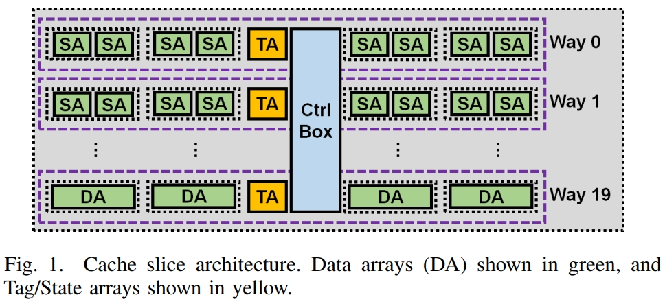

图1说明了20路组相联的2.5MB缓存切片组织，每个切片(slice)有多个数据阵列(data array, DA)组成，以平铺方式组织在四个象限中。每一路由来自每个象限的单个数据阵列组成，即每路由四个数据阵列以及一个Tag/State和CV(valid)/LRU数组。Control box单元位于缓存的中间，负责所有控制操作、一致性和互连接口。

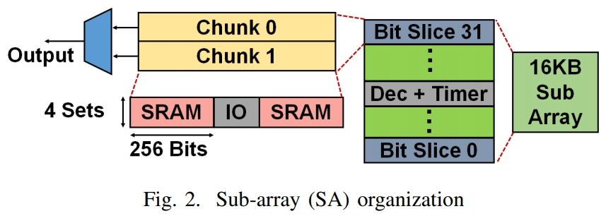

每个 32KB 数据阵列由两个 16KB 子阵列组成，每个子阵列都有一个 32 位端口。图 2 展示了子阵列（SA）的微架构。子阵列由32个bit-slice组成，每个slice为子阵列输出贡献1 bit，并由两个块组成。

从图2中我们可以得到以下计算公式：

$$16KB = 32\ bit\ slices = 32 \times 2\ Chunks\\ = 32 \times 2 \times 4\ sets = 32 \times 2 \times 4 \times 512\ bits$$

在本文中，系统LLC的总容量为1.25MB，因此每个SA为8KB。

考虑到这种架构，我们提出了四个观察结果：

1. SA的组织，使得在缓存数据数组中引入任何新逻辑都非常昂贵。
2. 子阵列以lock-step方式按way运行，并行访问它们的单元。
3. 由于缓存线在多路数据阵列之间不交错，因此可以独立访问、修改甚至关闭各个路。
4. 虽然高速缓存访问可能需要几个周期，但单个数据阵列操作只有1到2个周期，而位线感测是1个周期长。数据数组以某种方式共享数据总线，从而串行化缓存线读取和写入。

### 可重构架构

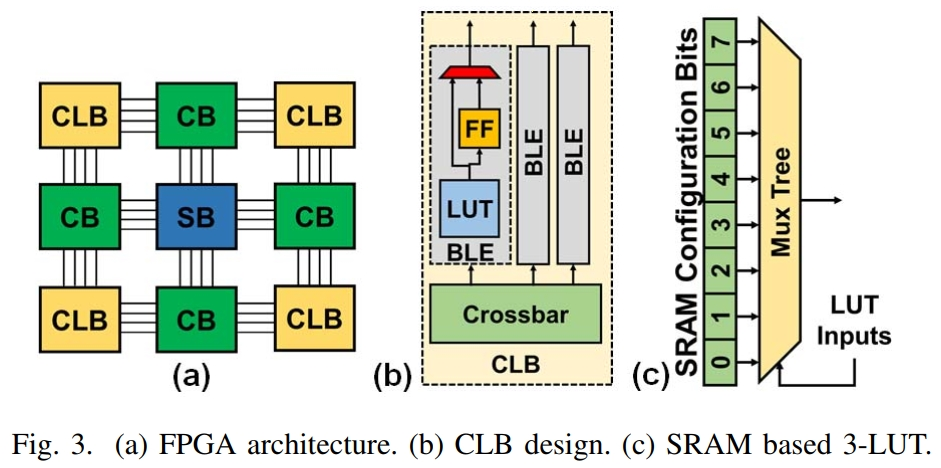

现场可编程门阵列 (FPGA) 实际上是可重构计算的同义词，可以通过多种方式实现。通常，FPGA 由一系列逻辑块组成，即可配置逻辑块 (CLB)，以岛状布局组织，具有可编程布线结构，例如开关盒 (SB) 和连接盒 (CB)，提供每个模块之间的互连。如图3所示。CLB由几个基本逻辑元件 (BLE) 组成，每个基本逻辑元件包括一个查找表 (LUT) 和一个触发器。现代 FPGA 还包括特殊 IO（输入/输出）、DSP 和内存块。FPGA LUT 由多路复用器树或复用树和 SRAM 配置存储器组成，SRAM 配置存储器存储 LUT 实现的布尔函数的配置位。因此，K 输入 LUT 或 K-LUT 将需要 2K SRAM 单元来存储其功能。图3(c) 展示了一个 3-LUT。连接 CLB 的全局布线结构，例如开关盒和互连线，是 FPGA 中延迟的主要来源，并且可以占据近 80% 的面积。

### 逻辑折叠(Logic Folding)

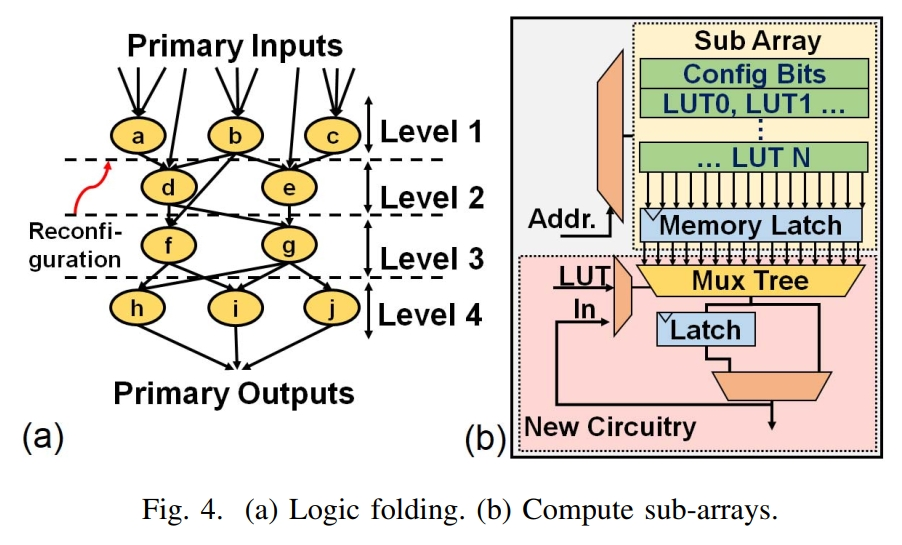

逻辑折叠利用动态重新配置，通过随时间折叠电路并跨时间共享可用逻辑资源，即时间流水线，允许使用有限的逻辑资源实现大型电路。因此，可以在较小的区域内实现相对较大的电路，尽管延迟较长。在图 4(a)中，图中的每个节点都是组合电路中的查找表 (LUT)。通过将图划分为四个级别，我们现在可以将每个级别实现为时间流水线的状态，从而只需要三个 LUT 而不是十个，但将延迟增加到四个时间步长。在每个时间步长，必须重新配置三个 LUT 以实现下一级别的操作。因此，如果我们可以重新配置每个周期，则可以在 4 个周期内实现该电路。 级别之间的相关性由锁存输出处理。

## FReaC Cache

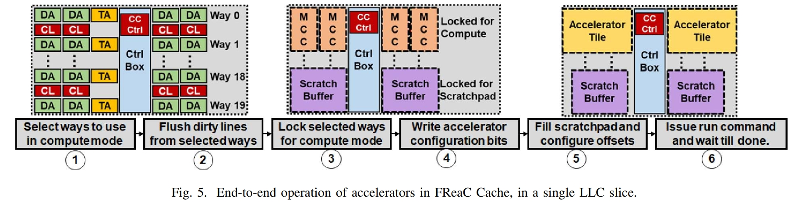

FReC Cache 建立在两个关键思想之上：

1. 通过将 LLC 的 SRAM 用于 LUT 配置存储器，并通过最小化复杂的全局布线，可以实现密集的可重配置逻辑。
2. 逻辑折叠允许我们用延迟（时钟周期）来减少每个周期的资源需求，以便映射电路。 高频抵消了折叠过程中产生的延迟损失。

图 5 对单个LLC切片的FReaC Cache端到端操作进行了六个步骤的高层次概述。

1. 为了利用FReac Cache作为加速器，必须选择LLC的一部分作为加速器运行。
2. 由于整个路都用于形成计算逻辑，因此必须刷新所选路中的脏行。
3. 选定的方式被锁定为计算模式。请注意，为了刷新和锁定缓存方式，我们通过在现有的缓存控制框架中引入我们自己的计算集群控制器(CC Ctrl)。主机仅通过本机加载和存储(LD/ST)指令与CC Ctrl单元交互。
4. 为计算模式准备SRAM way后，我们写入(加载)加速器配置比特。
5. 如果需要，主机可以在开始计算之前填充暂存器并配置任何偏移量。
6. 最后，主机通过LD/ST向CC Ctrl单元发出运行命令，并等待操作完成。一旦加速器完成，就可以通过重复步骤4和5对一组新的加速器进行编程或将新数据提供给现有的一组加速器。

### Dense Compute Sub-Arrays

从图3(c)可以看出LUT由SRAM配置比特位和mux-tree组成，LLC的sub-array能够通过每一次访问读取固定比特的数据，因此sub-array的每一行可以存储一个或多个LUT的配置信息，通过逐行读取sub-array的值，可以实现不同的LUTs。因此每次访问可以实现不同的逻辑操作。也就是说，子阵列的每一行都可以在逻辑折叠中实现一个时间流水线阶段。

为了实现这一点，子阵列通过存储器锁存器与多路复用树配对，如图4(b)所示。缓存锁存器与复用树一起形成了一个单一的查找表。请注意，复用树的输入是LUT输入。在读取新行时，LUT被重新配置以执行新操作。由于子阵列比较小，每次访问都可以在一个周期内进行。

因此，我们可以在每个周期动态重新配置 LUT。 由于单个 LUT 可能不足以实现布尔电路，因此可以将 LUT 的输出存储在状态锁存器中，以便在稍后的时间步长反馈到另一个 LUT 的输入中。 至关重要的是，复用树、锁存器和其他额外逻辑位于子阵列的外部，不会干扰现有的存储器设计。

从图4(b)可以看出，由于每一行存储32 bits，因此可以配置一个5输入LUT，或2个4输入LUT，或4个3输入LUT。

### 微计算集群

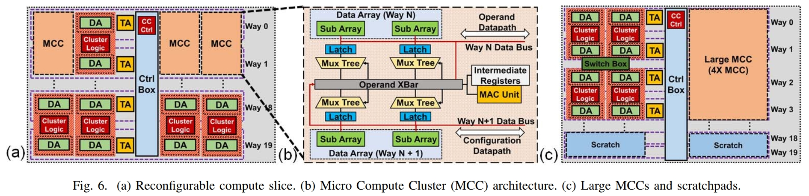

单个计算子阵列可能需要大量折叠周期才能实现逻辑折叠电路。因此，我们建议通过将每两个相邻数据阵列分组，将计算子阵列组织成微计算集群(MCC)。即四个子阵列，组成一个微计算集群，如图6(b)所示。在微计算集群内，每个子阵列借助锁存器和放置在子阵列外部的多路复用树，在每个周期激活一个或多个LUT。为了让每个计算子阵列实现的LUT一起运行，我们还在集群中添加了一个操作数交叉开关，类似于FPGA的CLB中的那种。接下来，我们提供一小部分寄存器来存储来自折叠电路的中间状态并在原始设计中实现时序逻辑。最后，由于使用LUT实现乘法等算术运算的成本很高，因此我们还添加了专用的整数乘法累加(MAC)单元。引入的附加逻辑结构放置在子阵列之外，并在两个数据阵列之间间隔开。因此，我们不会影响记忆的区域或时间。

#### 操作

现在可以通过从每个子阵列加载新配置，逐个周期地实现电路的每一级，在微计算集群内实现逻辑折叠电路。为了简化这一点，我们将每个级别的配置位存储在子阵列中的顺序地址中，并重用现有的地址总线来遍历地址。步数（折叠级别）由逻辑折叠计划决定。调度由我们添加到缓存控制箱的微型计算集群控制器 (CC Ctrl) 单元执行和管理。接下来，在每个时间步长，操作数可以缓存在寄存器或 LUT 中或从总线中提取。操作数交叉开关促进了这种移动，它必须为每个时间步长配置，由调度决定。因此，交叉开关也需要配置位，这些配置位存储在路的标记/状态数组中，在路用于计算时不使用。因此，我们不需要额外的配置内存。

#### 物理设计注意事项

### 可重构计算切片的操作

图 6a说明了具有微计算集群的LLC切片。出于说明目的，我们展示了8个CC tiles，其中显示了五个tiles及其所有逻辑组件——两个数据阵列和集群逻辑 (CL)。集群逻辑包括锁存器、复用树、MAC 单元、寄存器和交叉开关，如图 6b所示。请注意，由于微计算集群是通过两路方式使用DA构建的，因此一次完全消耗两路Cache，因此在它们的位置形成四个计算集群(MCC)切片。为了获得最大的灵活性，我们将集群逻辑添加到所有DA对中。这允许我们按需使用整个缓存切片或仅使用切片的一小部分，有效地对切片进行动态分区和重新配置，以启用计算逻辑。(怎么理解？)我们还在切片的控制盒中引入了一个计算集群控制器（CC Ctrl）单元，以协助锁定和刷新方式，以及集群的控制和协调。 CC Ctrl 利用缓存控制器的现有功能和机制来完成其任务。来自内核的传入请求由 LLC 控制器提供服务，即使缓存的一部分用于计算，CC Ctrl 单元也不会干扰。如果整个 LLC 都用于计算，那么核心请求将被视为未命中，并转发到内存。

#### 主机接口

FReC Cache不需要自定义指令。主机通过加载和存储(LD/ST)操作与加速器和CC Ctrl单元交互。每个切片的地址范围是为FReaC缓存操作保留的，以便CC Ctrl单元的控制寄存器暴露给主机内核。主机通过写入CC Ctrl单元中的控制寄存器来设置LLC切片以进行计算。此设置包括选择、刷新和锁定计算方式（图5中的步骤1、2和3）。为了配置加速器，主机将微计算集群配置数据写入CC Ctrl Unit中的指定地址，然后将配置数据写入集群子阵列（步骤4）。然后，主机可以填充暂存缓冲区（稍后讨论），并通过写入另一个地址范围来设置加速器地址偏移量（步骤5）。同样，CC Ctrl单元负责将数据转发到相应的子阵列中。最后，还分配了一个运行寄存器（步骤6）。这些控制和数据寄存器对于缓存片是唯一的，并且每个片必须执行一次设置和配置。地址空间和控制寄存器可以通过有限的操作系统支持暴露给用户代码。在内核驱动程序的帮助下，可以为物理地址范围分配虚拟地址（ioremap()操作），然后通过字符设备驱动程序暴露给用户空间，用户程序可以通过mmap()操作访问该驱动程序.

#### 设置和配置

图5中的步骤1、2和3概述了如何为计算设置LLC切片。首先，必须选择和刷新方式，然后锁定计算模式。启用此功能的机制已在现代LLC中可用，并由CC Ctrl单元利用。缓存中的路是相互独立的，因此可以指示缓存控制逻辑忽略一组路。LLC已经包含睡眠逻辑以节省功率，以及熔断位以在良率低或制造缺陷的情况下关闭。现有的LLC还可以专门为单个内核分配缓存方式，从而修改其他内核看到的有效LLC。但是，在将路配置为计算之前，必须清除脏缓存行中的路。清除路径的开销取决于几个因素，包括：包含策略、缓存层次结构、内存带宽以及有多少行是脏的。在最坏的情况下，如果必须刷新LLC中的所有行，则刷新速度会受到片外存储器带宽的限制。对于10MB的LLC，这可能是数百微秒的数量级。一旦通道被刷新并锁定到计算模式，它们就不会参与缓存。其余方式继续作为LLC的一部分运作。然后，主机可以通过切片中的CC Ctrl单元将配置位（图5中的步骤4）写入微计算集群。一旦加载了加速器的配置位，除非配置被驱逐或覆盖，否则不需要再次获取它们。

### 加速器操作

### Large Micro Compute Clusters and Multi-Cores

FReaC Cache是一种分块架构，其中每个微计算集群(CC)可以通过将加速器电路映射到其上来操作自己的独立计算单元（加速器分块），如图5所示。为此，加速器电路被折叠和调度，每个时间步都被映射到LUT、MAC和触发器（第四节）。在每个时间步上，集群最多可以访问四个5-LUT或八个4-LUT、一个MAC和一个总线操作。微计算集群以某种方式共享地址总线，从而以锁步方式运行。为了进一步简化设计，并尽可能多地重用结构，我们将所有簇的地址线连接起来。由于所有集群都运行相同的加速器并具有相同的调度，因此所有加速器块都以锁步方式运行。如前所述，CC Ctrl单元负责逐步执行调度并在地址总线上广播集群的下一个地址。

#### 操作数移动

为了提供对外部操作数的访问，我们建议使用数据总线之一作为操作数数据路径（图6b）。集群首先将操作数的地址放在总线上，总线将地址传送到CC Ctrl单元。CC Ctrl单元处理地址，在需要时应用任何偏移量，并将其移交给要服务的缓存控制器。如果缓存切片在本地命中，则操作数将通过相同的数据总线转发回集群。写入请求遵循类似的过程。由于集群以锁步方式运行，因此可能一次接收多个请求，并且集群将停止直到所有请求都得到服务。与CPU内核不同，集群等待写回完成。在读取和写入两种情况下，缓存负责合并请求（如果有能力的话）。由于数据数组共享一条总线，请求和响应可能需要跨多个周期进行序列化。

#### FReC 缓存暂存器

为了充分利用FReaC Cache的功能，我们引入了对暂存器的支持。通过锁定缓存中的路径，我们允许 CC Ctrl以为暂存器保留的方式将加速器加载和存储路由到子阵列。使用现有的缓存线映射，每次可以从每路加载总共32个字节。然而，由于子阵列之间的共享数据总线和缓存控制盒中的窄数据路径，字的传递是串行化的。我们使用处理器内核来填充暂存器，从而使内核能够将数据直接初始化到暂存器中。这样做，我们避免了从上层缓存中刷新数据的需要，以及将数据复制到暂存器的开销（图5中的步骤5）。FReaC Cache不需要暂存器，但大多数加速器使用本地暂存器来提高性能和功耗。此外，暂存器有助于解决LLC无法访问TLB的问题，这会增加开销。如果没有暂存器或访问TLB，FReaC Cache将需要：(1) 工作集从上层缓存中清除，(2) 加速器运行时内核不接触数据，(3) 内核提供物理地址，(4) 数据是连续的，页面被固定在主机内存中。

### 大型微计算集群和多核

#### 启用更大的计算集群

通过将加速器限制为单个微计算集群，我们将它们限制为每个周期4到8个LUT（假设有5输入或4输入LUT）。对于控制或逻辑繁重的应用程序，可能具有基于LUT的大型电路，这可能会导致大量折叠步骤并损害性能。因此，我们建议添加轻量级FPGA风格的开关盒，其中每个开关盒执行静态路由，段连接相邻的微计算集群。我们现在可以将4、8、16或最多32个计算集群分组以形成一个大型加速器tile，每个周期有更多可用的LUT。图6c显示了最终切片概览，并说明了一个示例，其中使用四个MCC形成加速器tile，并使用两种方式形成暂存器。
由于计算集群的密度、每个集群的LUT数量有限以及集群之间的距离较短，因此支持这种全局路由结构并不像传统FPGA那样昂贵。此外，单个缓存切片比FPGA小得多，这使得在单个时钟周期内将位从一端路由到另一端成为可能。

#### 多核系统中的 FReC 缓存

在FReC Cache中，每个切片中实现的加速器彼此独立运行。加速器之间的通信是通过全局地址空间执行的，就像在GPU等其他数据并行架构中一样。在大型计算需求的情况下，问题可以分解为较小的独立问题，由每个切片的加速器处理。因此，FReaC Cache非常适合解决数据并行问题。请注意，互连计算集群的交换基础设施也仅限于单个切片。因此，加速器块的大小受LLC切片的大小和关联性限制。在某些情况下，整体性能取决于关联性、LLC切片的数量和MAC单元的总数。

## 映射加速器

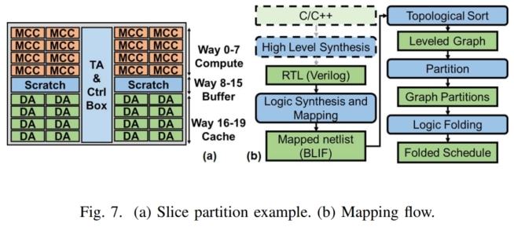

FReaC Cache是一个灵活的架构，一部分LLC slice可以用于计算，其余的部分则可以用于缓存数据，如图7(a)所示。
图7(b)则描述了映射的流程，具体可以参考文中列出的文献。

## 评估

我们的评估使用了gem5模拟器。我们在gem5中实现了一个周期精确的时序模型，通过考虑以下因素来模拟FReaC Cache的性能：每个基准加速器的综合电路的折叠时间表、将操作数从暂存器移动到集群时缓存总线上的争用、集群IO带宽以及将操作数加载到加速器tile。对于每个基准加速器，我们执行RTL模拟以生成所用内存访问的跟踪，以及它运行的确切周期数。我们模拟的系统是一个8核ARM微架构，类似于Exynos-5 SoC中的A15s，在表I中进行了描述。我们使用McPat和Cacti 6.5来生成尺寸、功率，以及存储器阵列的延迟（表II）。对于我们的模拟，我们考虑从子阵列读取一个字的延迟和功率，而不是从L3获取整个缓存行的延迟。因此，我们看到从子阵列读取单个字的延迟允许我们每个周期执行一次读取，从而允许我们在每个周期重新配置我们的子阵列。类似地，将数据以一种方式从子阵列移动到另一种方式需要沿高速缓存控制盒内的共享数据总线移动并且也是串行化的。我们通过McPat估计LLC的总泄漏功率为1.125W。
对于我们的评估，我们选择了MachSuite中的基准测试和一些手写的基准，它们非常适合FReaC Cache的预期用例，并代表计算、内存和逻辑(LUT)绑定应用程序。我们排除了n体分子动力学（KNN、GRID）和DNN训练（反向传播）等基准，因为我们在本文中针对边缘处理。==FReaC Cache 能够加速小型但重要的内核，这些内核将从 FReaC Cache 的低延迟、高吞吐量和高带宽数据访问中受益。== 因此，我们专注于内核，而不是大型多相应用程序。由于原始基准数据集非常小，我们以批处理方式将问题扩大了256倍。工作以数据并行的方式在所有可用的加速器tile/CPU 线程之间平均分配。

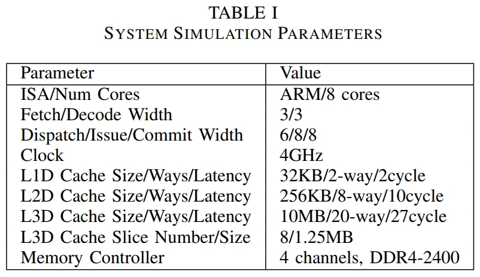

### 时间和面积开销

为了评估FReaC Cache中涉及的开销，我们使用Cacti、McPat、DSENT和RTL综合以及一个45nm库缩放到32nm。FreaC Cache添加了以下组件以形成微计算集群(MCC)：Mux Trees、Operand XBars、Intermediate Registers和MACs。MCC的组织和功能远没有处理器复杂，我们特别考虑以尽量减少对缓存时序的影响：(1) 通过添加缓冲区，我们避免加载现有总线。(2) 我们不修改内存阵列本身。(3) 大多数关键组件布线繁重，但集中在一个集群中，现代工艺节点具有高布线密度。(4) 正如我们将要证明的，新元件的面积可以忽略不计，因此它们的添加不会显着影响关键的导线路径。
我们对我们的面积和延迟建模采取保守的方法，并考虑最坏的情况。由于我们在短段中添加了新的布线，我们可以通过Cacti和DSENT合理地估计这些，如[55]中所示。特别是，Cacti 6+被开发用于识别大型缓存中的线路延迟。首先，我们考虑微计算集群。添加了四个组件：操作数xbar、复用树、中间寄存器和MAC单元。我们使用RTL模型来估计32位MAC单元和256个中间值保持触发器的成本分别为1011μm2和1086μm2。接下来，我们使用DSENT估计32X1 Mux树的成本为45μm2，操作数交叉开关为1239μm2。因此，每个簇增加的总面积为0.0034 mm2。如果我们在切片中启用32个集群，使用 16 路，总开销为0.109 mm2，仅占表II中描述的LLC切片总面积的3.5%。这将启用每个切片32个独立加速器切片的基本FReaC缓存模式。
然而，启用更大的集群有潜在的好处。为此，我们考虑了图3所示的FPGA式孤岛路由。为此，我们在四个微计算集群的组之间放置了一个开关盒，以及一个额外的开关盒来跨越标签阵列和控制盒，以启用X-Y路由。因此，我们总共有28个(7X4)开关盒，放置在16路缓存中，在8X4微计算集群块之间创建互连结构。请注意，FPGA路由结构和互连可以设计为放置在缓冲区和逻辑之上。因此，一旦我们确定了逻辑块的面积，我们就可以确定导线和互连的长度。然后，我们使用DSent和CACTI扫描模型的频率，直到在最坏的情况下不违反时序，因此为大型计算集群确定为3GHz，为小型计算集群确定为4GHz。可能的最长路径是切片对角的两个交换机之间的曼哈顿距离。我们发现这是2.864 毫米，基于高速缓存切片和子阵列的几何形状，必须在交换机之间的10条链路上完成，并且必须满足0.3 ns的延迟才能在一个周期内完成。我们考虑32位链路，并计算全局路由和链路的总面积为3469 μm2。最后，开关盒也需要配置，我们为每四个微计算集群添加一个宽输出8KB内存。这增加了0.35 mm2的总开销。请注意，这仅在我们需要以3GHz运行非常大的加速器块时才需要。因此，我们总共向切片添加了0.48 mm2或15.3%的开销。这是一个保守的估计，因为我们选择了短链接和更多的开关盒，因此为交换机增加了更多的配置内存。

**Summary: 运行3GHz大型计算集群时，面积开销为0.48 mm2，占LLC总面积的15.3%。**

### 加速器设计空间

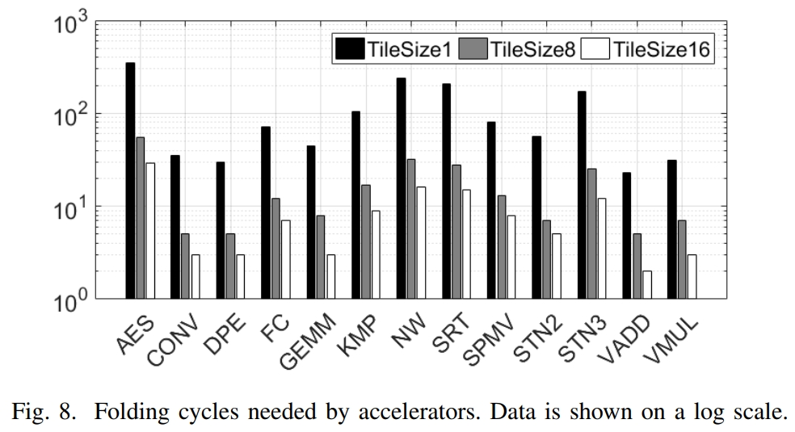

<!-- 图8显示的时计算集群tile数对折叠周期的影响，MCC数越多，每次折叠步骤可以实现的逻辑越多，完成操作所需的折叠周期越少。因此，存在一个加速器延迟和网络吞吐率的平衡，以最大化性能和能效。 -->

我们首先探索映射到FReC Cache的加速器的设计空间。我们使用Xilinx Vivado HLS综合了基准测试。首先，我们探讨了对用于实现加速器tile的计算集群tile数量的影响。每个加速器可用的MCC越多，每个折叠步骤可以分配的资源就越多，因此折叠周期就越少。我们展示了图8中每个基准在不同tile尺寸下的折叠周期数。虽然为每个加速器tile分配更多MCC减少了折叠次数，但每个切片的并发加速器tile数量存在权衡。

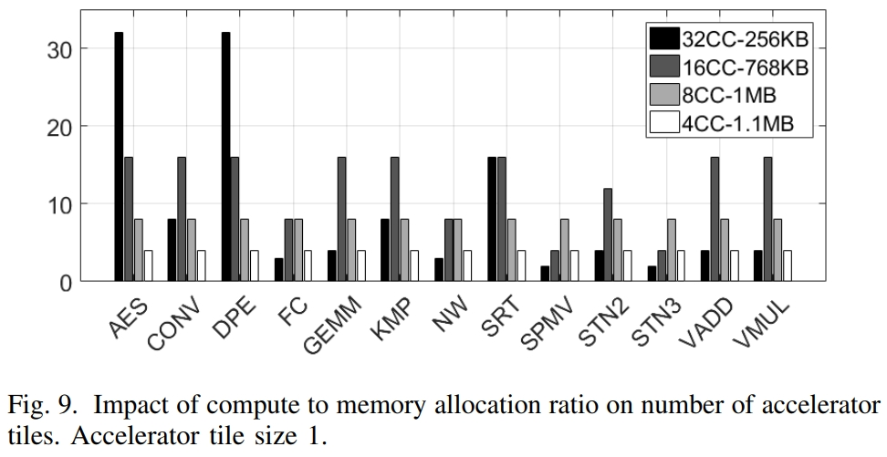

因此，加速器块的延迟和净吞吐量之间存在权衡。这种权衡还需要考虑工作集邻近度的影响。为了最大限度地提高性能和效率，工作集必须在缓存中可用。因此，并发加速器tile的数量也受到每个加速器tile的工作集 ==(数据量？)== 的限制。为了说明这一点，我们考虑了被分配到计算和缓存的LLC的不同比率。我们从16个Cache way用于计算和4个Cache way用于缓存开始，创建32个MCC和一个256KB缓存器，然后扫描到2个Cache way用于计算和18个Cache way用于缓存，创建4个MCC和一个1.1MB缓存器。图9显示了可以放入单个切片的最大加速器切片数量，切片大小为1（每个切片1 MCC）。具有较小工作集的加速器，例如AES和点积引擎，能够用加速器填充所有32个MCC块。然而，GEMM、KMP、Sorting 和 Stencil 等计算内核和存储绑定内核都通过将更多的LLC分配给缓存来达到最大的切片数量（以及吞吐量）。请注意，这是加速器工作集和可用切片数量的函数。总体而言，我们观察到由32个MCC和256KB缓存以及16个具有768KB暂存器的MCC组成的组织允许在单个切片中实例化大多数加速器块。

### FReC 缓存性能和效率

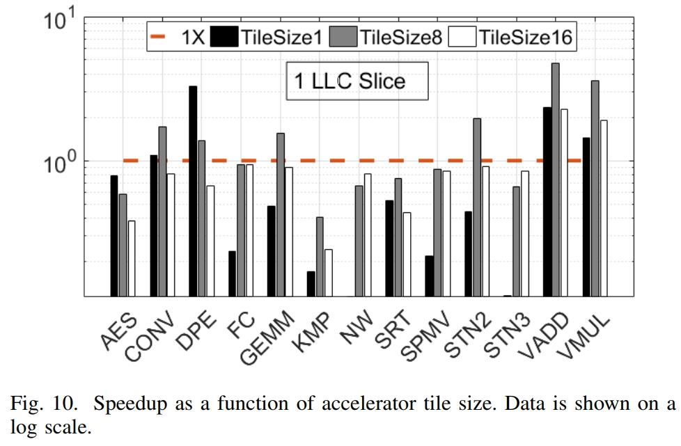

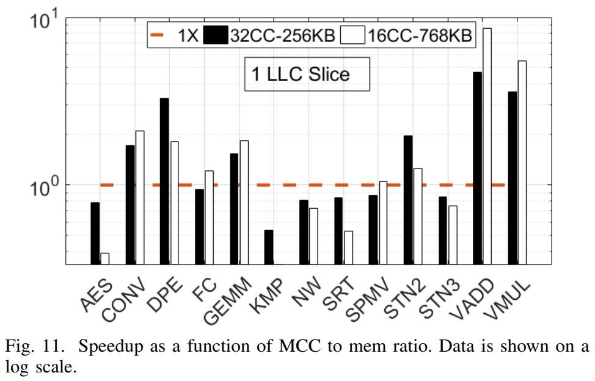

我们将FreaC Cache与其基础系统的8个ARM内核、一个大型PCIe连接的FPGA(Xilinx ZCU102 FPGA) 和一个独立的Ultra 96​​ SoC FPGA系统进行了比较。我们使用OpenMP以数据并行的方式跨所有可用的物理内核并行化基线基准测试。我们通过McPat使用32nm低功耗库对ARM内核的功率进行建模。为了评估FPGA，我们综合了启用所有优化指令的基准电路。接下来，我们尝试实例化基准IP的256个副本，以反映最大的数据并行性。如果所有副本都不适合，那么我们对工作负载进行批处理，并相应地缩放延迟。我们包括160 μs的DMA延迟和配置开销，还包括通过PCIe3.0 x16为ZCU102传输数据到FPGA的成本，以及在Ultra 96​​ (U96)中通过AXI总线传输的成本。然后，我们使用Xilinx功率估计器(XPE)来估计功率，并将电路板空闲和泄漏功率计为12W的ZCU102。FReaC Cache上的基准测试延迟由我们的Gem5模拟器提供。为了提供最佳性能并与我们的FPGA比较保持一致，我们将数据移入暂存器缓冲区。我们测量内核在FReaC Cache加速器中操作的延迟，以及将数据集传输到暂存缓冲区的延迟。在将数据加载到缓冲区时，我们并行加载LLC切片，从而充分利用LLC的带宽。内核延迟还包括写入配置数据的时间。我们通过考虑来自计算集群和暂存器的读取次数来估计FReaC Cache的能力。我们还假设开关盒之间的链路在100%负载下运行，每条链路消耗约9 mW，并添加泄漏功率。我们展示了与A15主机的单个线程相关的所有数据。
为了更好地理解FReaC Cache，我们首先检查单个缓存切片和加速器切片大小的影响。我们考虑一个具有32MCC-256KB分区的切片，因此消耗了切片的所有20路。然后，我们扫描加速器tile大小，为每个加速器分配1、8和16个MCC，并测量内核在单个主机内核(A15)上的执行速度。我们还使用每个切片的最大加速器数量来限制我们的探索，如图9所示。在图10中，除了AES，我们看到增加切片大小可以提高性能。然而，我们看到tile大小为16时性能有所下降，因为16个或更多MCC的tile需要降低时钟速度。正如我们在图8和图9中看到的，AES具有非常高的折叠开销，但可以在单个切片中容纳多个副本。因此，它更适合每个切片有多个切片，每个切片的MCC很少。正如我们之前提到的，将LLC分配到内存与计算之间存在权衡。我们在图11中更仔细地检查了这一点。我们展示了单个切片中两个不同的计算到内存分区在所有加速器切片大小中可能的最佳性能。再一次，我们发现AES比缓冲存储器更喜欢更多的计算集群，以及其他计算内核，如点积引擎、全连接层和GEMM。但是请注意，这里我们仅限于单个切片。最佳的计算到内存权衡也是切片总数的函数，我们观察到，随着参与加速的切片数量的增加，16MCC-768KB拆分被证明更有用。
接下来，我们将在我们的评估系统中考虑FReaC Cache的端到端性能。在实践中，消耗整个LLC可能是不可行的，因此我们保留了两种方式，每个切片128KB作为缓存。这留下了10%或1MB的LLC，同时将剩余的18路分配给计算和暂存器。我们考虑每个切片16MCC-640KB计算暂存器拆分，并扫描所有可能的加速器切片大小和缓存切片。为简洁起见，我们报告了给定切片数量的最佳性能（加速），并报告了相应的每瓦性能（每瓦吞吐量）和功率。我们在图12中以对数刻度呈现我们的数据。加速是通过应用程序的端到端延迟来衡量的，我们使用单个A15线程作为基准。端到端延迟包括初始化阵列、将它们移动到暂存器缓冲区以及返回核心的成本。为了进行比较，我们包括完全并行的八线程A15实现，以及ZCU102和Ultra96 (U96) FPGA。对于FGPA，我们还包括将数据移动到其缓冲区的成本。
正如我们所见，随着缓存切片数量的增加，FReaC Cache的端到端性能也随之提高。在各项基准测试中，FReaC Cache的性能比ARM内核低一小部分。平均而言，当使用所有八个切片时，FReaC Cache分别比单线程和多线程实现快8.2倍和3倍。此外，FReaC Cache的效率（Perf/Watt）平均比多核CPU高6.1倍。事实证明，FReaC Cache尤其适用于内存受限和计算内核，例如卷积、点积、向量加/乘、全连接层和GEMM，与单线程实现相比，速度提高了14.5倍。由于折叠，诸如AES和排序(SRT)之类的逻辑繁重的应用程序会受到更高的惩罚。因此，虽然它们比单个CPU线程快，但多线程实现超过它们，但功率几乎是其两倍。然而，在大多数基准测试中，大型ZCU102 FPGA的性能优于FReaC Cache、A15和U96。这是以功耗大幅增加为代价的，我们注意到ZCU102芯片比LLC以及整个A15芯片大得多。以边缘为中心的低功耗Ultra 96​​在计算和内存敏感基准测试中均被FReaC Cache击败。事实证明，FReaC Cache也比两种FPGA解决方案更节能。因此，FReaC Cache在各种基准测试和领域证明了自己的高性能、灵活和高效。

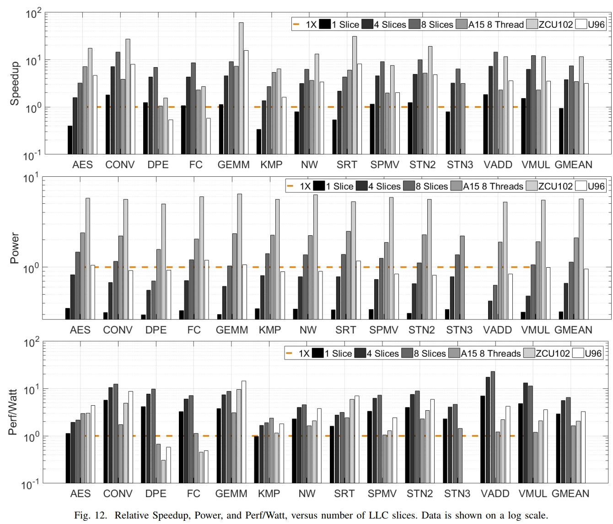

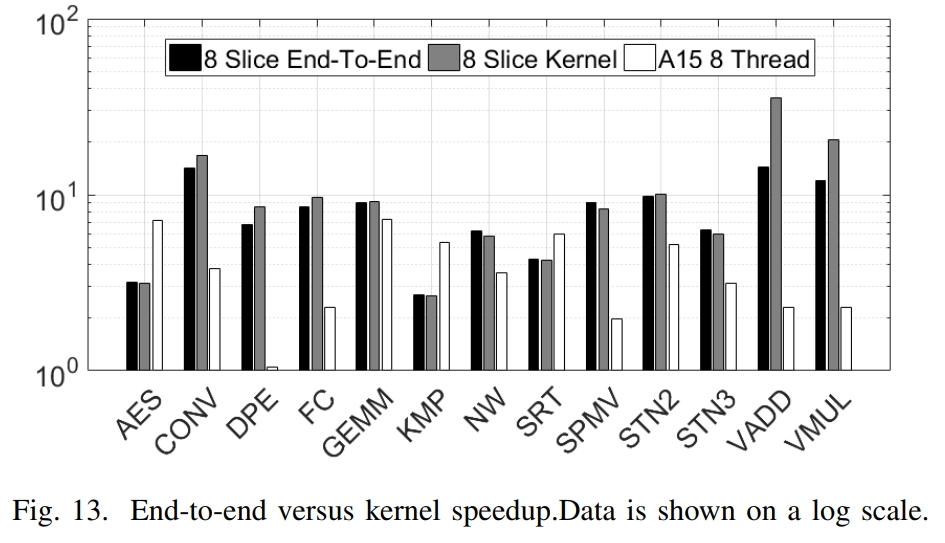

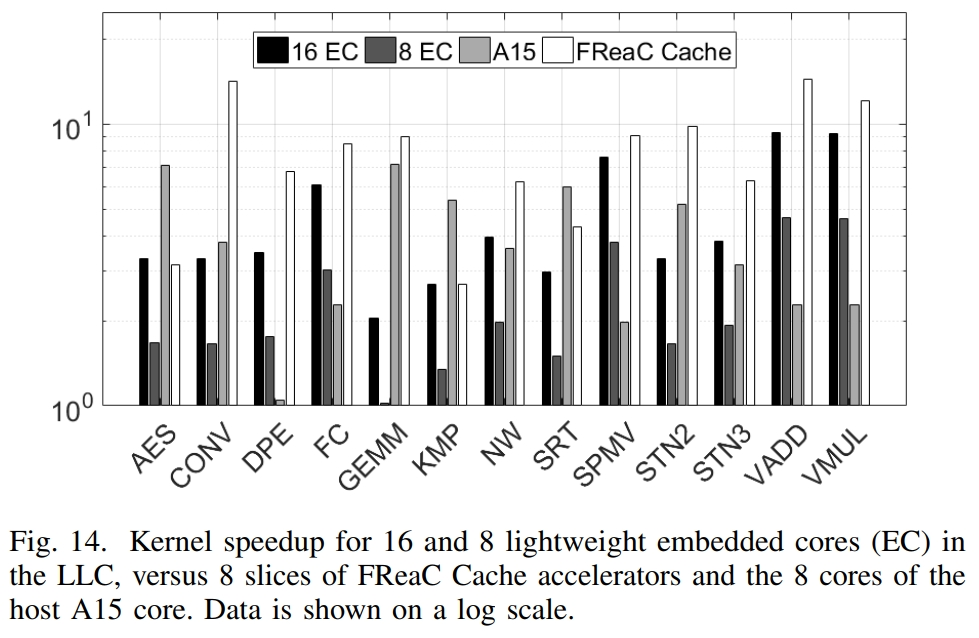

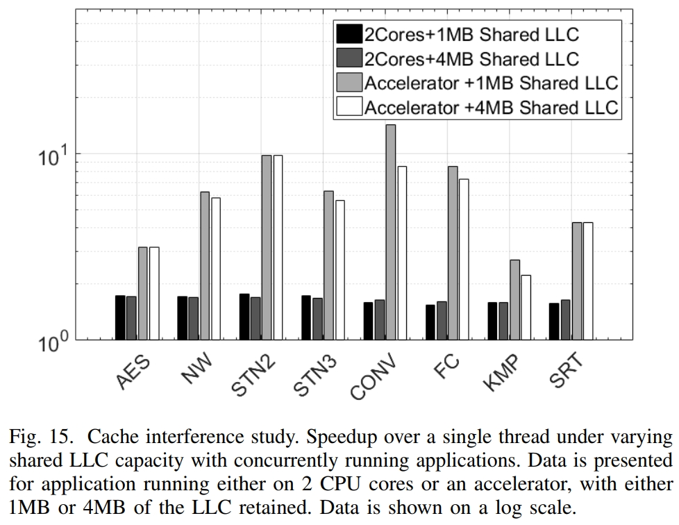

最后，将数据移入和移出加速器可能会花费时间和精力。在NMA和PIM的情况下，这可能还需要核心和主机操作系统中的其他机制。为了降低将数据复制到缓冲区和从缓冲区复制数据的成本、提高性能并避免将页面固定到物理地址，FReaC Cache使用内核将数据直接初始化到暂存器缓冲区中。这有效地消除了复制操作，但这样做仍然需要时间。在我们对图12的评估中，我们考虑了应用程序的端到端延迟，包括初始化和复制数据的成本。在图13中，我们在对数尺度上展示了端到端加速与仅内核加速的对比。作为参考，我们还提供了多线程实现。我们观察到，根据基准测试，复制和初始化的开销可以忽略不计到60%。因此，在某些情况下，我们的端到端加速比峰值内核加速的一小部分。这部分是由于工作集的大小，甚至CPU也会因此而降低端到端性能。FReaC Cache的性能仍然优于CPU甚至FPGA。请注意，尽管LLC具有巨大的带宽并直接在缓冲区中初始化数据，但我们仍会受到内存初始化延迟的影响。然而，像ZCU102和U96这样的片外加速器需要在更慢的通道上进行完整复制，初始化完成后，会增加更多的开销。因此，FReaC Cache提供经济高效、节能且灵活的加速，以及通往用户工作集的高带宽和低延迟路径，这使FReaC Cache处于非常独特的位置。

## DISCUSSION

在本节中，我们将进行讨论以阐明 FReaC Cache 的动机、定位和潜在限制。

### 可移植性

在这项工作中，我们通过将FreaC Cache合并到现有架构中来说明FreaC Cache的思想和原则。虽然我们使用Huang等人提供的Intel Xeon LLC的详细描述作为示例FReac Cache设计的基础，FReaC Cache不限于英特尔LLC架构，也不依赖于任何特殊的英特尔企业功能。相反，在这项工作中，我们的重点是用于边缘计算的处理器。改变底层缓存切片架构可能会影响每个周期的有效LUT数量、微计算集群的大小、集群数量和跨路分组的集群数量等。 例如，如果一个缓存路由两倍作为许多子阵列，我们可以拥有两倍多的微计算集群，或相同数量的集群，每个周期可用的 LUT 数量增加一倍。为了一致性，我们使用了 Huang 等人描述的架构贯穿本文。总内存容量仅限制暂存器大小和我们可以存储的配置数量，但不限制性能。

### 基于 FPGA 的架构

FReC Cache不是一种新的FPGA架构。相反，它是一种适用于边缘场景的极具成本效益和能效的解决方案，在这些场景中，小吞吐量或内存带宽密集型内核可以偶尔卸载。我们的重点不是重新设计可重新配置的计算逻辑，而是专注于重新配置LLC并将其转换为可以利用近内存计算的定制加速器的最佳方式。它不是为处理通用可重配置计算或提供一般FPGA设备通常针对的胶合逻辑而设计的。虽然我们确实使用LUT，就像FPGA，但我们的设计和组织与FPGA有很大不同，我们没有考虑通用FPGA的许多特性，包括嵌入式BRAM、丰富的基于FF的控制逻辑、高I/O能力、多-clock域等。因此，FReaC Cache不是每个应用程序的完美解决方案。如果应用程序易于理解且任务关键，则FPGA可能是更好的选择。例如，具有大型复杂控制电路的电路将更适合FPGA，在这种情况下，对数千个LUT的即时访问更为关键。但是，FReaC Cache比FPGA具有显着的面积优势，因为：（1）LLC子阵列占据了大部分面积，并且附加逻辑具有面积分数开销，以及（2）80%的FPGA面积用于布线结构及其配置位，FReaC缓存避免了这个问题。此外，FPGA的配置带宽有限，仅为400MB/s。FReaC缓存配置受LLC-DRAM带宽和LLC内部带宽（10到100GB/s）的限制。

### 替代的 Near 和 In-Cache计算方法

我们首先考虑Compute Caches，其中作者提出利用位线计算来实现向量计算。由于计算的性质，这种方法受到子阵列间距的限制，因此作者仅限于一组简单的位运算——AND、OR、XOR、复制和比较——它们对以下情况有效作者针对的数据操作域，例如字符串匹配、位图索引等。至关重要的是，这种方法需要对缓存和子阵列进行大量重新设计，并添加新的ISA指令，这会增加大量的设计和验证成本。此外，operands must be placed for sufficient locality in order to perform in-situ processing。 Compute Cache 中计算、ISA、基准测试和模拟基础设施的深奥性质使得很难与FReaC Cache进行一对一的比较。但是，我们注意到FReaC Cache的侵入性要小得多。所有新逻辑都放置在子阵列之外，重新使用现有总线，并且不使用自定义ISA。因此，我们最大限度地减少了对LLC和内核的面积、时序、能量和设计的影响。最重要的是，我们不限于位级操作或受限的应用领域。虽然FReaC Cache是通用的，但它最适合主机需要加速内存绑定计算内核的情况。Compute Cache在数据操作工作负载上提供了1.9倍的平均加速，而FReaC Cache在不同的工作负载上展示了3倍的平均加速。
接下来，我们考虑近缓存计算，例如BSSync，它将计算放置在缓存附近，而不是在数组内部。我们考虑在LLC中放置轻量级嵌入式内核(EC)，例如ARM A7，而不是在LLC中放置ALU并添加新的ISA指令。与FReaC Cache一样，它提供了类似的通用功能，独立于主机内核运行，加速器内核和主机内核之间的通信仍然可以通过LD/ST完成。每个A7内核的面积约为0.49 mm2，与FReaC Cache的per-slice开销类似。因此，我们考虑两种情况：（1）iso-area，每个切片放置一个EC，以及（2）每个切片放置两个EC。这些分别在LLC中提供总共八个和十六个内核。为了公平比较，我们分配了LLC的16 way作为暂存器供内核使用。正如我们在图14中看到的，基于FReaC Cache的加速器的定制电路和有效的内存带宽利用率使其显着优于iso-area 8 EC解决方案的平均4倍，以及16 EC设置的平均2倍。因此，与这种近缓存解决方案相比，FReaC Cache的面积和计算效率要高得多。请注意，图14中的加速是相对于单个A15线程显示的，该图包括所有八个A15内核的性能。

### 干扰主机性能

由于LLC的一部分专用于计算，因此在CPU和FReaC Cache中的加速器性能之间存在潜在的权衡。解决方案取决于应用程序，以及CPU和加速器是否协同工作。然而，这个问题类似于在芯片多处理器和多租户云场景中看到的缓存干扰和性能隔离问题。特别是，先前的工作表明，在这种混合工作负载和多应用场景中，对LLC进行分区是一种有效的解决方案。将LLC的一部分专用于进程的加速器会对其他正在运行的进程的性能产生影响，这与将LLC的分区专用于该进程的效果类似。更好地理解为计算分配多少缓存需要详细研究以明确定义多租户级别和并发进程之间的交互，而先前关于缓存QoS和干扰的工作为此提供了良好的基础。
作为一阶分析，我们考虑两组应用程序：{AES、NW、STN2和STN3}和{CONV、FC、KMP和SRT}。每个组都包含混合了计算和内存绑定内核的应用程序，以及逻辑/分支繁重的特征。然后我们考虑两种情况 - 保留1MB和4MB的LLC用于缓存，而其余部分用于加速组中的应用程序之一。其余三个应用程序分别分配了两个CPU线程。图15展示了我们的分析，所有数据都标准化为单线程基线，如前几张图所示。由于四个应用程序中的三个应用程序在CPU复合体上运行，因此每个应用程序总共将运行3次。因此，我们考虑每个LLC容量的三个运行时间的平均值。我们的研究揭示了两个关键点：首先，我们注意到基准测试对LLC的总容量不敏感。这主要是因为内核的L1和L2缓存能够保存每个线程的工作集。我们的基准测试以批处理和数据并行的方式运行。因此，虽然总应用程序工作集可以高达32MB，这大于LLC容量，但每线程工作集（批处理的一个元素）不会超过128KB。其次，我们看到为加速分配更多LLC资源可以提高加速器的性能。这是预期的行为。但是，我们注意到这在很大程度上与可以分配多少方式作为暂存空间有关，以便加速器发挥作用。因此，我们观察到，对于我们给定的一组基准测试，将最多90%的LLC(9MB)分配给计算/暂存器以加速一个应用程序不会损害其余三个应用程序的性能，因为剩余的1MB足以支持L1和L2缓存中的每线程工作集。在这里，我们看到基于FReaC Cache的加速器可以提供1.8倍到9倍的CPU运行速度。请注意，虽然在图12、13和14中我们考虑了每个应用程序最多八个主机CPU的线程，但这里每个应用程序仅限于两个线程，而加速器利用LLC的所有八个切片。
因此，在这种情况下，将计算或内存受限的应用程序卸载到LLC将提供最佳的整体性能，并且对CPU内核的影响有限。如果一个或多个应用程序对LLC容量敏感，那么用户将需要缩减用于计算的LLC分配和/或考虑将LLC分区和分配给特定应用程序。正如我们的结果所示，FReaC Cache仍然能够以60%的LLC(6MB)提供加速。减少分配给计算的LLC数量将按比例减少加速度。因此，在可能的情况下，FReaC Cache将多余的LLC容量转换为计算，从而提供节能、定制且廉价的加速。

## CONCLUSION

在这项工作中，我们提出了一种新颖的架构，FReaC Cache，它利用了LLC的现有子阵列，并且在不改变子阵列的情况下，能够创建密集的可重构计算集群。FReaC Cache可以以3.5%到15.3%的最小面积开销实现，并且当消耗90%的LLC时，与边缘级多核处理器相比，平均加速提高了3倍，Perf/W平均提高了6.1倍加速。我们还展示了FReaC Cache相对于现代FPGA的竞争优势，在现代FPGA中，FReaC Cache的面积和功率效率更高。最后，我们承认使用LLC进行计算会降低缓存性能，但某些应用程序不会用完整个LLC。通过转换LLC进行计算，我们实现了两个目标：（1）避免浪费LLC容量，以及（2）近数据计算。因此，FReaC Cache为边缘设备的加速提供了一种经济高效的解决方案。