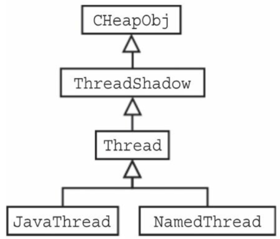
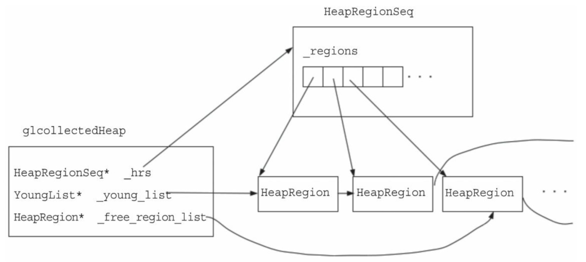
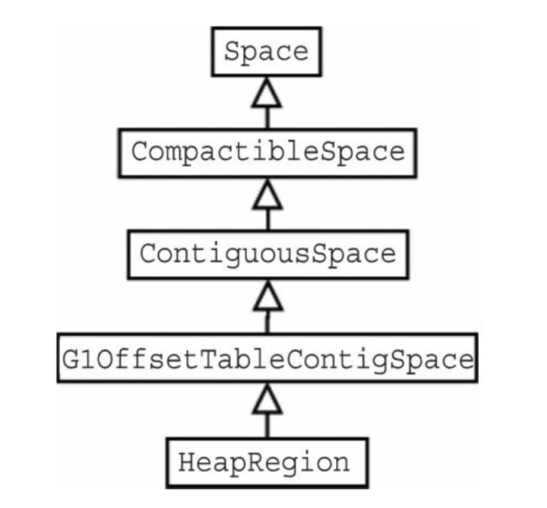

jvm源码实现了多种OS下的内存、线程管理等，本博客仅以Linux为例。

## 1. 线程管理

### 1.1 线程创建

jvm中线程创建的实现在os::create_thread中，如下所示。核心代码在第28-29行，调用pthread_create创建线程。

jvm中创建线程时存在两个特别的地方：

- pthread_create的线程初始化函数都为java_start
- 父线程在创建子线程之后进入等待状态，等待子线程创建完成之后通过条件变量唤醒父线程


```c++ {.line-numbers}
// hotspot/src/os/linux/vm/os_linux.cpp
bool os::create_thread(Thread *thread, ThreadType thr_type, size_t stack_size) {
  ... ...
  {
    ... ...
    pthread_t tid;
    int ret =
        pthread_create(&tid, &attr, (void *(*)(void *))java_start, thread);
    ... ...
    // Wait until child thread is either initialized or aborted
    {
      Monitor *sync_with_child = osthread->startThread_lock();
      MutexLockerEx ml(sync_with_child, Mutex::_no_safepoint_check_flag);
      while ((state = osthread->get_state()) == ALLOCATED) {
        sync_with_child->wait(Mutex::_no_safepoint_check_flag);
      }
    }
    ... ...
  }
  ... ...
}
```


### 1.2 java_start方法

java_start方法为jvm所有（？）线程创建时的初始化方法。
以下代码片段显示了java_start函数的主要功能。

- 作为新线程的初始化函数，首先会创建一个Monitor(*sync*)，在最后进入等待状态，等待其他线程唤醒。
- 在代码段的第17-18行线程创建成功之后，将该线程的状态设置为INITIALIZED，并唤醒父线程，与上面的os::create_thread中的父线程进入等待状态呼应。
- 在第27行，该子线程被唤醒之后，会执行thread->run()函数，这也正是创建不同线程类对象之后执行相同的初始话函数java_start，但是最终能够执行不同的操作的原因所在。如下图所示，jvm中所有的线程类都继承自Thread类，在Thread类中存在一个虚函数run()，所有的子类都需要重写该函数，因此可以针对不同的子线程类实现不同的操作。


Thread 类的继承关系


```c++ {.line-numbers}
// hotspot/src/os/linux/vm/os_linux.cpp
// Thread start routine for all newly created threads
static void *java_start(Thread *thread) {

  ... ...

  OSThread *osthread = thread->osthread();
  Monitor *sync = osthread->startThread_lock();

  ... ...

  // handshaking with parent thread
  {
    MutexLockerEx ml(sync, Mutex::_no_safepoint_check_flag);

    // notify parent thread 唤醒父线程
    osthread->set_state(INITIALIZED);
    sync->notify_all();

    // wait until os::start_thread()  
    while (osthread->get_state() == INITIALIZED) {
      sync->wait(Mutex::_no_safepoint_check_flag);
    }
  }

  // call one more level start routine
  thread->run();

  return 0;
}
```


### 1.3 线程暂停和重新启动

在每个线程中都存在ParkEvent对象，通过该对象可以实现对该线程的暂停和重新启动。
线程的暂停和重新启动在os::PlatformEvent::park()和os::PlatformEvent::unpark()这两个函数中实现，只是对通过条件变量对线程暂停和唤醒机制进行了包装，见19和64行。


```c++ {.line-numbers}
void os::PlatformEvent::park() { // AKA "down()"
  // Invariant: Only the thread associated with the Event/PlatformEvent
  // may call park().
  // TODO: assert that _Assoc != NULL or _Assoc == Self
  int v;
  for (;;) {
    v = _Event;
    if (Atomic::cmpxchg(v - 1, &_Event, v) == v)
      break;
  }
  guarantee(v >= 0, "invariant");
  if (v == 0) {
    // Do this the hard way by blocking ...
    int status = pthread_mutex_lock(_mutex);
    assert_status(status == 0, status, "mutex_lock");
    guarantee(_nParked == 0, "invariant");
    ++_nParked;
    while (_Event < 0) {
      status = pthread_cond_wait(_cond, _mutex);
      // for some reason, under 2.7 lwp_cond_wait() may return ETIME ...
      // Treat this the same as if the wait was interrupted
      if (status == ETIME) {
        status = EINTR;
      }
      assert_status(status == 0 || status == EINTR, status, "cond_wait");
    }
    --_nParked;

    _Event = 0;
    status = pthread_mutex_unlock(_mutex);
    assert_status(status == 0, status, "mutex_unlock");
    // Paranoia to ensure our locked and lock-free paths interact
    // correctly with each other.
    OrderAccess::fence();
  }
  guarantee(_Event >= 0, "invariant");
}
void os::PlatformEvent::unpark() {
  // Transitions for _Event:
  //    0 :=> 1
  //    1 :=> 1
  //   -1 :=> either 0 or 1; must signal target thread
  //          That is, we can safely transition _Event from -1 to either
  //          0 or 1. Forcing 1 is slightly more efficient for back-to-back
  //          unpark() calls.
  // See also: "Semaphores in Plan 9" by Mullender & Cox
  //
  // Note: Forcing a transition from "-1" to "1" on an unpark() means
  // that it will take two back-to-back park() calls for the owning
  // thread to block. This has the benefit of forcing a spurious return
  // from the first park() call after an unpark() call which will help
  // shake out uses of park() and unpark() without condition variables.

  if (Atomic::xchg(1, &_Event) >= 0)
    return;

  // Wait for the thread associated with the event to vacate
  int status = pthread_mutex_lock(_mutex);
  assert_status(status == 0, status, "mutex_lock");
  int AnyWaiters = _nParked;
  assert(AnyWaiters == 0 || AnyWaiters == 1, "invariant");
  if (AnyWaiters != 0 && WorkAroundNPTLTimedWaitHang) {
    AnyWaiters = 0;
    pthread_cond_signal(_cond);
  }
  status = pthread_mutex_unlock(_mutex);
  assert_status(status == 0, status, "mutex_unlock");
  if (AnyWaiters != 0) {
    status = pthread_cond_signal(_cond);
    assert_status(status == 0, status, "cond_signal");
  }

  // Note that we signal() _after dropping the lock for "immortal" Events.
  // This is safe and avoids a common class of  futile wakeups.  In rare
  // circumstances this can cause a thread to return prematurely from
  // cond_{timed}wait() but the spurious wakeup is benign and the victim will
  // simply re-test the condition and re-park itself.
}
```


### 1.4 GC线程并行

#### 1.4.x GangWorker线程运行过程

GangWorker线程在创建之后，会运行run函数，最终在loop中等待其他线程唤醒。

任务发布者通过notify_all讲GangWorker从loop函数从32行唤醒
然后GangWorker将任务信息复制到本地data中并释放monitor
通过调用task.work(part)对不同的task进行不同的处理
任务完成后，工人会再次获取锁，并将任务完成的信息写入到GangWorker中。接下来，工人会调用notify_all()，将完成的任务的编号复制到previous_sequence_number中，然后返回到for循环的开始处。


```c++ {.line-numbers}
void GangWorker::loop() {
  int previous_sequence_number = 0;
  Monitor* gang_monitor = gang()->monitor();
  for ( ; /* !terminate() */; ) {
    WorkData data;
    int part;  // Initialized below.
    {
      // Grab the gang mutex.
      MutexLocker ml(gang_monitor);
      // Wait for something to do.
      // Polling outside the while { wait } avoids missed notifies
      // in the outer loop.
      gang()->internal_worker_poll(&data);
      for ( ; /* break or return */; ) {
        // Terminate if requested.
        if (data.terminate()) {
          gang()->internal_note_finish();
          gang_monitor->notify_all();
          return;
        }
        // Check for new work.
        if ((data.task() != NULL) &&
            (data.sequence_number() != previous_sequence_number)) {
          if (gang()->needs_more_workers()) {
            gang()->internal_note_start();
            gang_monitor->notify_all();
            part = gang()->started_workers() - 1;
            break;
          }
        }
        // Nothing to do.
        gang_monitor->wait(/* no_safepoint_check */ true);
        gang()->internal_worker_poll(&data);
      }
      // Drop gang mutex.
    }
    data.task()->work(part);
    {
      // Grab the gang mutex.
      MutexLocker ml(gang_monitor);
      gang()->internal_note_finish();
      // Tell the gang you are done.
      gang_monitor->notify_all();
      // Drop the gang mutex.
    }
    previous_sequence_number = data.sequence_number();
  }
}
```


### 1.5 GC线程并发

## 2. 内存管理

### 2.1 VM堆

HotSpotVM 的 VM 堆大体上分为以下两个部分：

- 程序员选择的 GC 算法所使用的内存空间
- 常驻（permanent） 内存空间，不是G1GC的回收对象，而是标记—压缩GC（markcompact GC）的回收对象

所有的VM堆类都继承自 CollectedHeap 类

在本博客中仅讨论第一类堆：G1GC堆。

#### 2.1.1 G1GC堆

> G1GC堆的实现为G1CollectedHeap类，该类中有3个主要的成员变量：
> 
> - _hrs： 通过数组维护所有HeapRegion
> - _young_list： 新生代HeapRegion的链表
> - _free_region_list： 空闲HeapRegion的链表
> G1GC堆主要由这三个对象进行管理，三者的关系可以由下图表示： 
> 
> 以上引用自《深入java虚拟机：jvm g1gc的算法与实现》—— 中村成洋的第9.2.1节，但是在jdk8中存在一些变化


以jdk8u-dev为例，可以关注以下变量：

- _hrm: 跟踪实际堆内存、辅助数据及其元数据（即 HeapRegion 实例）和空闲区域列表
  - _regions: 以数组的形式、以地址顺序维护所有的HeapRegions
  - _free_list: 以链表的形式维护空闲HeapRegions
  - _available_map: 此位图中的每一位表示相应的区域可用于分配（感觉与_free_list功能重叠）
  - 
- _young_list: 以链表的形式维护年轻代HeapRegions
- _g1_rem_set: 堆的remembered set
- _dirty_card_queue_set: A set of cards that cover the objects for which the Rsets should be updated concurrently after the collection
- into_cset_dirty_card_queue_set: A DirtyCardQueueSet that is used to hold cards that contain  references into the current collection set. This is used to update the remembered sets of the regions in the collection set in the event of an evacuation failure
- _cm: The concurrentMarker
- _cmThread: The concurrentMarker thread it runs in
- _cg1r: The concurrent refiner
- _task_queue: The parallel task queue

#### 2.1.2 HeapRegion类

HeapRegion类描述了G1GC中的每个堆分区，主要关注以下几个成员变量：

- _rem_set: 指向当前HeapRegion的remembered set
- _hrm_index: 当前HeapRegion在整个Heap region sequence中的索引
- _type: 指示当前分区为Young, Eden, Survivor, Free, Humongous Mask, Survivor Starts或Survivor Continues
- _humongous_start_region: 如果为humongous分区，则该指针指向该humongous的起始分区
- _in_collection_set: 该分区是否在回收集合中
- _next_in_special_set: 该分区可能为某一个特殊的子集合中的一员，这个指针指向这个子集合中下一个HeapRegion。在当前实现中，仅存在一中特殊集合：回收集合
- _next_young_region: 指向下一个年轻代HeapRegion
- _next_dirty_cards_region: 下一个卡表脏了的HeapRegion
- _next/_prev: 用于实现基于HeapRegion的链表的指针
- _prev_marked_bytes/_next_marked_bytes: 每个分区中用于统计存活对象的计数器
- _gc_efficiency: 双精度浮点类型，用于统计回收效率
- _yong_index_in_cset: 没有注释，猜测应该为回收集合中年轻代HeapRegion的索引
- _age_index: 猜测为当前HeapRegion的年龄
- _prev_top_at_mark_start/_next_top_at_mark_start: 指示未标记区域的起始地址，与SATB快照有关


此外，从上图HeapRegion的继承关系可以看出HeapRegion继承自Space类，它从父类继承了三个重要的成员变量：

- _bottom: 从Space类继承，当前区域的起始地址
- _end: 从Space类继承，当前区域的结束地址
- _top: 从ContiguousSpace继承，当前区域内空闲内存地址的起始地址

### 2.2 内存分配流程

1. 按照G1GC最大VM堆（G1GC堆与常驻内存空间）的大小来申请内存空间，此阶段只是申请内存空间，并没有实际地分配物理内存（类似OS中的lazy allocate）
2. 为之前申请的VM堆分配最小限度的内存空间，这里会实际分配物理内存。此时G1GC堆内的内存会以区域为单位进行分配，后续如果为对象分配空间时，如果空闲空间不够，也会进行堆的扩展，其实也是以HeapRegion为单位从第1步中申请的堆内存空间中继续分配物理内存
3. 对象的分配
4. 空闲空间不够，以HeapRegion为单位进行G1GC堆的扩展，即HeapRegion为单位从第1步中申请的堆内存空间中继续分配物理内存

接下来分别介绍这些代码

#### 2.2.1 VM堆的申请

各VM堆初始化的处理编写在继承自CollectedHeap类的各子类的initialize()方法中。对G1GC而言，就是在G1CollectedHeap的initialize()方法中。
堆内存申请的代码如下，实际执行申请代码在第22行。以下将initialize()关键代码都列于此，其中设计RS、card table、heap region mananger等的创建和设置等。



```c++ {.line-numbers}
jint G1CollectedHeap::initialize() {
  // Do common initializations that must follow instance construction, for example, those needing virtual calls.
  CollectedHeap::pre_initialize();

  ... ...

  size_t init_byte_size = collector_policy()->initial_heap_byte_size();
  size_t max_byte_size = collector_policy()->max_heap_byte_size();
  size_t heap_alignment = collector_policy()->heap_alignment();

  // Ensure that the sizes are properly aligned.
  Universe::check_alignment(init_byte_size, HeapRegion::GrainBytes, "g1 heap");
  Universe::check_alignment(max_byte_size, HeapRegion::GrainBytes, "g1 heap");
  Universe::check_alignment(max_byte_size, heap_alignment, "g1 heap");

  _refine_cte_cl = new RefineCardTableEntryClosure();

  _cg1r = new ConcurrentG1Refine(this, _refine_cte_cl);

  // Reserve the maximum.

  ReservedSpace heap_rs = Universe::reserve_heap(max_byte_size, heap_alignment);

  // It is important to do this in a way such that concurrent readers can't
  // temporarily think something is in the heap.  (I've actually seen this
  // happen in asserts: DLD.)
  _reserved.set_word_size(0);
  _reserved.set_start((HeapWord *)heap_rs.base());
  _reserved.set_end((HeapWord *)(heap_rs.base() + heap_rs.size()));

  // Create the gen rem set (and barrier set) for the entire reserved region.
  _rem_set = collector_policy()->create_rem_set(_reserved, 2);
  set_barrier_set(rem_set()->bs());
  if (!barrier_set()->is_a(BarrierSet::G1SATBCTLogging)) {
    vm_exit_during_initialization(
        "G1 requires a G1SATBLoggingCardTableModRefBS");
    return JNI_ENOMEM;
  }

  // Also create a G1 rem set.
  _g1_rem_set = new G1RemSet(this, g1_barrier_set());

  // Carve out the G1 part of the heap.

  ReservedSpace g1_rs = heap_rs.first_part(max_byte_size);
  G1RegionToSpaceMapper *heap_storage = G1RegionToSpaceMapper::create_mapper(
      g1_rs, g1_rs.size(),
      UseLargePages ? os::large_page_size() : os::vm_page_size(),
      HeapRegion::GrainBytes, 1, mtJavaHeap);
  heap_storage->set_mapping_changed_listener(&_listener);

  // Create storage for the BOT, card table, card counts table (hot card cache)
  // and the bitmaps.
  G1RegionToSpaceMapper *bot_storage = create_aux_memory_mapper(
      "Block offset table",
      G1BlockOffsetSharedArray::compute_size(g1_rs.size() / HeapWordSize),
      G1BlockOffsetSharedArray::N_bytes);

  ReservedSpace cardtable_rs(G1SATBCardTableLoggingModRefBS::compute_size(
      g1_rs.size() / HeapWordSize));
  G1RegionToSpaceMapper *cardtable_storage = create_aux_memory_mapper(
      "Card table",
      G1SATBCardTableLoggingModRefBS::compute_size(g1_rs.size() / HeapWordSize),
      G1BlockOffsetSharedArray::N_bytes);

  G1RegionToSpaceMapper *card_counts_storage = create_aux_memory_mapper(
      "Card counts table",
      G1BlockOffsetSharedArray::compute_size(g1_rs.size() / HeapWordSize),
      G1BlockOffsetSharedArray::N_bytes);

  size_t bitmap_size = CMBitMap::compute_size(g1_rs.size());
  G1RegionToSpaceMapper *prev_bitmap_storage = create_aux_memory_mapper(
      "Prev Bitmap", bitmap_size, CMBitMap::mark_distance());
  G1RegionToSpaceMapper *next_bitmap_storage = create_aux_memory_mapper(
      "Next Bitmap", bitmap_size, CMBitMap::mark_distance());

  _hrm.initialize(heap_storage, prev_bitmap_storage, next_bitmap_storage,
                  bot_storage, cardtable_storage, card_counts_storage);
  g1_barrier_set()->initialize(cardtable_storage);
  // Do later initialization work for concurrent refinement.
  _cg1r->init(card_counts_storage);

  // 6843694 - ensure that the maximum region index can fit
  // in the remembered set structures.
  const uint max_region_idx =
      (1U << (sizeof(RegionIdx_t) * BitsPerByte - 1)) - 1;
  guarantee((max_regions() - 1) <= max_region_idx, "too many regions");

  size_t max_cards_per_region =
      ((size_t)1 << (sizeof(CardIdx_t) * BitsPerByte - 1)) - 1;
  guarantee(HeapRegion::CardsPerRegion > 0, "make sure it's initialized");
  guarantee(HeapRegion::CardsPerRegion < max_cards_per_region,
            "too many cards per region");

  FreeRegionList::set_unrealistically_long_length(max_regions() + 1);

  _bot_shared = new G1BlockOffsetSharedArray(_reserved, bot_storage);

  _g1h = this;

  {
    HeapWord *start = _hrm.reserved().start();
    HeapWord *end = _hrm.reserved().end();
    size_t granularity = HeapRegion::GrainBytes;

    _in_cset_fast_test.initialize(start, end, granularity);
    _humongous_reclaim_candidates.initialize(start, end, granularity);
  }

  // Create the ConcurrentMark data structure and thread.
  // (Must do this late, so that "max_regions" is defined.)
  _cm = new ConcurrentMark(this, prev_bitmap_storage, next_bitmap_storage);
  if (_cm == NULL || !_cm->completed_initialization()) {
    vm_shutdown_during_initialization(
        "Could not create/initialize ConcurrentMark");
    return JNI_ENOMEM;
  }
  _cmThread = _cm->cmThread();

  // Initialize the from_card cache structure of HeapRegionRemSet.
  HeapRegionRemSet::init_heap(max_regions());

  // Now expand into the initial heap size.
  if (!expand(init_byte_size)) {
    vm_shutdown_during_initialization("Failed to allocate initial heap.");
    return JNI_ENOMEM;
  }

  // Perform any initialization actions delegated to the policy.
  g1_policy()->init();

  JavaThread::satb_mark_queue_set().initialize(SATB_Q_CBL_mon, SATB_Q_FL_lock,
                                               G1SATBProcessCompletedThreshold,
                                               Shared_SATB_Q_lock);

  JavaThread::dirty_card_queue_set().initialize(
      _refine_cte_cl, DirtyCardQ_CBL_mon, DirtyCardQ_FL_lock,
      concurrent_g1_refine()->yellow_zone(), concurrent_g1_refine()->red_zone(),
      Shared_DirtyCardQ_lock);

  dirty_card_queue_set().initialize(
      NULL, // Should never be called by the Java code
      DirtyCardQ_CBL_mon, DirtyCardQ_FL_lock,
      -1, // never trigger processing
      -1, // no limit on length
      Shared_DirtyCardQ_lock, &JavaThread::dirty_card_queue_set());

  // Initialize the card queue set used to hold cards containing
  // references into the collection set.
  _into_cset_dirty_card_queue_set.initialize(
      NULL, // Should never be called by the Java code
      DirtyCardQ_CBL_mon, DirtyCardQ_FL_lock,
      -1, // never trigger processing
      -1, // no limit on length
      Shared_DirtyCardQ_lock, &JavaThread::dirty_card_queue_set());

  // In case we're keeping closure specialization stats, initialize those
  // counts and that mechanism.
  SpecializationStats::clear();

  // Here we allocate the dummy HeapRegion that is required by the
  // G1AllocRegion class.
  HeapRegion *dummy_region = _hrm.get_dummy_region();

  // We'll re-use the same region whether the alloc region will
  // require BOT updates or not and, if it doesn't, then a non-young
  // region will complain that it cannot support allocations without
  // BOT updates. So we'll tag the dummy region as eden to avoid that.
  dummy_region->set_eden();
  // Make sure it's full.
  dummy_region->set_top(dummy_region->end());
  G1AllocRegion::setup(this, dummy_region);

  _allocator->init_mutator_alloc_region();

  // Do create of the monitoring and management support so that
  // values in the heap have been properly initialized.
  _g1mm = new G1MonitoringSupport(this);

  G1StringDedup::initialize();

  return JNI_OK;
}
```


具体22行代码比较复杂，最终会调用Linux中的mmap进行内存的映射，在此展示调用栈，如果感兴趣可以进行逐步调试。
```c++ {.line-numbers}
libjvm.so!anon_mmap(char * requested_addr, size_t bytes, bool fixed) (\share\jdk8u-dev\hotspot\src\os\linux\vm\os_linux.cpp:3335)
libjvm.so!os::pd_attempt_reserve_memory_at(size_t bytes, char * requested_addr) (\share\jdk8u-dev\hotspot\src\os\linux\vm\os_linux.cpp:4087)
libjvm.so!os::attempt_reserve_memory_at(size_t bytes, char * addr) (\share\jdk8u-dev\hotspot\src\share\vm\runtime\os.cpp:1476)
libjvm.so!ReservedSpace::initialize(ReservedSpace * const this, size_t size, size_t alignment, bool large, char * requested_address, const size_t noaccess_prefix, bool executable) (\share\jdk8u-dev\hotspot\src\share\vm\runtime\virtualspace.cpp:192)
libjvm.so!ReservedSpace::ReservedSpace(ReservedSpace * const this, size_t size, size_t alignment, bool large, char * requested_address, const size_t noaccess_prefix) (\share\jdk8u-dev\hotspot\src\share\vm\runtime\virtualspace.cpp:79)
libjvm.so!ReservedHeapSpace::ReservedHeapSpace(ReservedHeapSpace * const this, size_t size, size_t alignment, bool large, char * requested_address) (\share\jdk8u-dev\hotspot\src\share\vm\runtime\virtualspace.cpp:344)
libjvm.so!Universe::reserve_heap(size_t heap_size, size_t alignment) (\share\jdk8u-dev\hotspot\src\share\vm\memory\universe.cpp:940)
libjvm.so!G1CollectedHeap::initialize(G1CollectedHeap * const this) (\share\jdk8u-dev\hotspot\src\share\vm\gc_implementation\g1\g1CollectedHeap.cpp:1959)
libjvm.so!Universe::initialize_heap() (\share\jdk8u-dev\hotspot\src\share\vm\memory\universe.cpp:843)
libjvm.so!universe_init() (\share\jdk8u-dev\hotspot\src\share\vm\memory\universe.cpp:652)
libjvm.so!init_globals() (\share\jdk8u-dev\hotspot\src\share\vm\runtime\init.cpp:104)
libjvm.so!Threads::create_vm(JavaVMInitArgs * args, bool * canTryAgain) (\share\jdk8u-dev\hotspot\src\share\vm\runtime\thread.cpp:3436)
libjvm.so!JNI_CreateJavaVM(JavaVM ** vm, void ** penv, void * args) (\share\jdk8u-dev\hotspot\src\share\vm\prims\jni.cpp:5250)
libjli.so!InitializeJVM(JavaVM ** pvm, JNIEnv ** penv, InvocationFunctions * ifn) (\share\jdk8u-dev\jdk\src\share\bin\java.c:1240)
libjli.so!JavaMain(void * _args) (\share\jdk8u-dev\jdk\src\share\bin\java.c:376)
libpthread.so.0!start_thread(void * arg) (\build\glibc-SzIz7B\glibc-2.31\nptl\pthread_create.c:477)
libc.so.6!clone() (\build\glibc-SzIz7B\glibc-2.31\sysdeps\unix\sysv\linux\x86_64\clone.S:95)
```

#### 2.2.2 VM堆的分配

同样还是上面这一段代码，在G1CollectedHeap::initialize()的124行，通过expand初始堆大小（默认64MB，因为运行时指定"-Xms64m -Xmx64m"，因此生成64个1MB的HeapRegion）。

同样在此展示调用栈如下：

```c++ {.line-numbers}
libjvm.so!G1Allocator::new_heap_region(G1Allocator * const this, uint hrs_index, G1BlockOffsetSharedArray * sharedOffsetArray, MemRegion mr) (\share\jdk8u-dev\hotspot\src\share\vm\gc_implementation\g1\g1Allocator.hpp:88)
libjvm.so!HeapRegionManager::new_heap_region(HeapRegionManager * const this, uint hrm_index) (\share\jdk8u-dev\hotspot\src\share\vm\gc_implementation\g1\heapRegionManager.cpp:73)
libjvm.so!HeapRegionManager::make_regions_available(HeapRegionManager * const this, uint start, uint num_regions) (\share\jdk8u-dev\hotspot\src\share\vm\gc_implementation\g1\heapRegionManager.cpp:126)
libjvm.so!HeapRegionManager::expand_at(HeapRegionManager * const this, uint start, uint num_regions) (\share\jdk8u-dev\hotspot\src\share\vm\gc_implementation\g1\heapRegionManager.cpp:184)
libjvm.so!HeapRegionManager::expand_by(HeapRegionManager * const this, uint num_regions) (\share\jdk8u-dev\hotspot\src\share\vm\gc_implementation\g1\heapRegionManager.cpp:167)
libjvm.so!G1CollectedHeap::expand(G1CollectedHeap * const this, size_t expand_bytes) (\share\jdk8u-dev\hotspot\src\share\vm\gc_implementation\g1\g1CollectedHeap.cpp:1767)
libjvm.so!G1CollectedHeap::initialize(G1CollectedHeap * const this) (\share\jdk8u-dev\hotspot\src\share\vm\gc_implementation\g1\g1CollectedHeap.cpp:2061)
libjvm.so!Universe::initialize_heap() (\share\jdk8u-dev\hotspot\src\share\vm\memory\universe.cpp:843)
libjvm.so!universe_init() (\share\jdk8u-dev\hotspot\src\share\vm\memory\universe.cpp:652)
libjvm.so!init_globals() (\share\jdk8u-dev\hotspot\src\share\vm\runtime\init.cpp:104)
libjvm.so!Threads::create_vm(JavaVMInitArgs * args, bool * canTryAgain) (\share\jdk8u-dev\hotspot\src\share\vm\runtime\thread.cpp:3436)
libjvm.so!JNI_CreateJavaVM(JavaVM ** vm, void ** penv, void * args) (\share\jdk8u-dev\hotspot\src\share\vm\prims\jni.cpp:5250)
libjli.so!InitializeJVM(JavaVM ** pvm, JNIEnv ** penv, InvocationFunctions * ifn) (\share\jdk8u-dev\jdk\src\share\bin\java.c:1240)
libjli.so!JavaMain(void * _args) (\share\jdk8u-dev\jdk\src\share\bin\java.c:376)
libpthread.so.0!start_thread(void * arg) (\build\glibc-SzIz7B\glibc-2.31\nptl\pthread_create.c:477)
libc.so.6!clone() (\build\glibc-SzIz7B\glibc-2.31\sysdeps\unix\sysv\linux\x86_64\clone.S:95)
```

我们展开make_regions_available方法的源码如下，关键为第6行。至此，我们知道VM堆的申请就是通过mmap分配（映射）虚拟内存空间，而VM堆的分配就是在这一段虚拟内存空间内创建heap region对象，分配实际的物理内存。最后，在第23行和24行分别对分配的空间进行初始化并将其插入到free_list中。


```c++ {.line-numbers}
void HeapRegionManager::make_regions_available(uint start, uint num_regions) {
  guarantee(num_regions > 0, "No point in calling this for zero regions");
  commit_regions(start, num_regions);
  for (uint i = start; i < start + num_regions; i++) {
    if (_regions.get_by_index(i) == NULL) {
      HeapRegion* new_hr = new_heap_region(i);
      _regions.set_by_index(i, new_hr);
      _allocated_heapregions_length = MAX2(_allocated_heapregions_length, i + 1);
    }
  }

  _available_map.par_set_range(start, start + num_regions, BitMap::unknown_range);

  for (uint i = start; i < start + num_regions; i++) {
    assert(is_available(i), err_msg("Just made region %u available but is apparently not.", i));
    HeapRegion* hr = at(i);
    if (G1CollectedHeap::heap()->hr_printer()->is_active()) {
      G1CollectedHeap::heap()->hr_printer()->commit(hr->bottom(), hr->end());
    }
    HeapWord* bottom = G1CollectedHeap::heap()->bottom_addr_for_region(i);
    MemRegion mr(bottom, bottom + HeapRegion::GrainWords);

    hr->initialize(mr);
    insert_into_free_list(at(i));
  }
}
```


#### 2.2.3 对象的分配

对象内存分配的调用栈如下所示：

```c++ {.line-numbers}
libjvm.so!G1OffsetTableContigSpace::par_allocate_impl(G1OffsetTableContigSpace * const this, size_t size, HeapWord * const end_value) (\share\jdk8u-dev\hotspot\src\share\vm\gc_implementation\g1\heapRegion.inline.hpp:53)
libjvm.so!HeapRegion::par_allocate_no_bot_updates(HeapRegion * const this, size_t word_size) (\share\jdk8u-dev\hotspot\src\share\vm\gc_implementation\g1\heapRegion.inline.hpp:132)
libjvm.so!G1AllocRegion::par_allocate(HeapRegion * alloc_region, size_t word_size, bool bot_updates) (\share\jdk8u-dev\hotspot\src\share\vm\gc_implementation\g1\g1AllocRegion.inline.hpp:50)
libjvm.so!G1AllocRegion::attempt_allocation(G1AllocRegion * const this, size_t word_size, bool bot_updates) (\share\jdk8u-dev\hotspot\src\share\vm\gc_implementation\g1\g1AllocRegion.inline.hpp:63)
libjvm.so!G1CollectedHeap::attempt_allocation(G1CollectedHeap * const this, size_t word_size, uint * gc_count_before_ret, uint * gclocker_retry_count_ret) (\share\jdk8u-dev\hotspot\src\share\vm\gc_implementation\g1\g1CollectedHeap.inline.hpp:142)
libjvm.so!G1CollectedHeap::mem_allocate(G1CollectedHeap * const this, size_t word_size, bool * gc_overhead_limit_was_exceeded) (\share\jdk8u-dev\hotspot\src\share\vm\gc_implementation\g1\g1CollectedHeap.cpp:844)
libjvm.so!CollectedHeap::common_mem_allocate_noinit(KlassHandle klass, size_t size, Thread * __the_thread__) (\share\jdk8u-dev\hotspot\src\share\vm\gc_interface\collectedHeap.inline.hpp:146)
libjvm.so!CollectedHeap::common_mem_allocate_init(KlassHandle klass, size_t size, Thread * __the_thread__) (\share\jdk8u-dev\hotspot\src\share\vm\gc_interface\collectedHeap.inline.hpp:184)
libjvm.so!CollectedHeap::array_allocate(KlassHandle klass, int size, int length, Thread * __the_thread__) (\share\jdk8u-dev\hotspot\src\share\vm\gc_interface\collectedHeap.inline.hpp:225)
libjvm.so!TypeArrayKlass::allocate_common(TypeArrayKlass * const this, int length, bool do_zero, Thread * __the_thread__) (\share\jdk8u-dev\hotspot\src\share\vm\oops\typeArrayKlass.cpp:107)
libjvm.so!TypeArrayKlass::allocate(TypeArrayKlass * const this, int length, Thread * __the_thread__) (\share\jdk8u-dev\hotspot\src\share\vm\oops\typeArrayKlass.hpp:67)
libjvm.so!oopFactory::new_typeArray(BasicType type, int length, Thread * __the_thread__) (\share\jdk8u-dev\hotspot\src\share\vm\memory\oopFactory.cpp:56)
libjvm.so!InterpreterRuntime::newarray(JavaThread * thread, BasicType type, jint size) (\share\jdk8u-dev\hotspot\src\share\vm\interpreter\interpreterRuntime.cpp:183)
[Unknown/Just-In-Time compiled code] (未知源:0)
TemplateInterpreter::_active_table (未知源:0)
[Unknown/Just-In-Time compiled code] (未知源:0)
```

最终在G1OffsetTableContigSpace::par_allocate_impl函数中实现内存的分配，具体代码如下：


```c++ {.line-numbers}
// This version is lock-free.
inline HeapWord* G1OffsetTableContigSpace::par_allocate_impl(size_t size,
                                                    HeapWord* const end_value) {
  do {
    HeapWord* obj = top();
    if (pointer_delta(end_value, obj) >= size) {
      HeapWord* new_top = obj + size;
      HeapWord* result = (HeapWord*)Atomic::cmpxchg_ptr(new_top, top_addr(), obj);
      // result can be one of two:
      //  the old top value: the exchange succeeded
      //  otherwise: the new value of the top is returned.
      if (result == obj) {
        assert(is_aligned(obj) && is_aligned(new_top), "checking alignment");
        return obj;
      }
    } else {
      return NULL;
    }
  } while (true);
}
```


这边展示的一个无锁并行内存分配的版本，第4-19行使用一个do...while循环实现分配，当内存空间足够时，使用一个原子指令设置新的top地址，如果设置成功则说明当前分配成功，否则继续循环分配过程直到成功或者当前HeapRegion空闲空间不够。

在G1CollectedHeap::attempt_allocation中，如果通过G1AllocRegion::attempt_allocation分配内存失败，则会继续调用G1CollectedHeap::attempt_allocation_slow进行分配，如下代码所示。

attempt_allocation_slow()会在G1AllocRegion中设置一个新的区域，并按照需要的大小为这个区域分配空间。


```c++ {.line-numbers}
inline HeapWord* G1CollectedHeap::attempt_allocation(size_t word_size,
                                                     uint* gc_count_before_ret,
                                                     uint* gclocker_retry_count_ret) {
  assert_heap_not_locked_and_not_at_safepoint();
  assert(!isHumongous(word_size), "attempt_allocation() should not "
         "be called for humongous allocation requests");

  AllocationContext_t context = AllocationContext::current();
  HeapWord* result = _allocator->mutator_alloc_region(context)->attempt_allocation(word_size,
                                                                                   false /* bot_updates */);
  if (result == NULL) {
    result = attempt_allocation_slow(word_size,
                                     context,
                                     gc_count_before_ret,
                                     gclocker_retry_count_ret);
  }
  assert_heap_not_locked();
  if (result != NULL) {
    dirty_young_block(result, word_size);
  }
  return result;
}
```


我们进一步将attempt_allocation_slow展开，会发现不仅仅是完成VM堆的分配、对象空间的分配，还会选择触发young GC。
更进一步，在young GC之后如果空间仍不够，还会触发mixed-GC，这将在后续章节介绍。

最后，在mem_allocate()中还可能会执行FullGC。


```c++ {.line-numbers}
HeapWord *G1CollectedHeap::attempt_allocation_slow(
    size_t word_size, AllocationContext_t context, uint *gc_count_before_ret,
    uint *gclocker_retry_count_ret) {
  // Make sure you read the note in attempt_allocation_humongous().

  assert_heap_not_locked_and_not_at_safepoint();
  assert(!isHumongous(word_size),
         "attempt_allocation_slow() should not "
         "be called for humongous allocation requests");

  // We should only get here after the first-level allocation attempt
  // (attempt_allocation()) failed to allocate.

  // We will loop until a) we manage to successfully perform the
  // allocation or b) we successfully schedule a collection which
  // fails to perform the allocation. b) is the only case when we'll
  // return NULL.
  HeapWord *result = NULL;
  for (int try_count = 1; /* we'll return */; try_count += 1) {
    bool should_try_gc;
    uint gc_count_before;

    {
      MutexLockerEx x(Heap_lock);
      result =
          _allocator->mutator_alloc_region(context)->attempt_allocation_locked(
              word_size, false /* bot_updates */);
      if (result != NULL) {
        return result;
      }

      // If we reach here, attempt_allocation_locked() above failed to
      // allocate a new region. So the mutator alloc region should be NULL.
      assert(_allocator->mutator_alloc_region(context)->get() == NULL,
             "only way to get here");

      if (GC_locker::is_active_and_needs_gc()) {
        if (g1_policy()->can_expand_young_list()) {
          // No need for an ergo verbose message here,
          // can_expand_young_list() does this when it returns true.
          result = _allocator->mutator_alloc_region(context)
                       ->attempt_allocation_force(word_size,
                                                  false /* bot_updates */);
          if (result != NULL) {
            return result;
          }
        }
        should_try_gc = false;
      } else {
        // The GCLocker may not be active but the GCLocker initiated
        // GC may not yet have been performed (GCLocker::needs_gc()
        // returns true). In this case we do not try this GC and
        // wait until the GCLocker initiated GC is performed, and
        // then retry the allocation.
        if (GC_locker::needs_gc()) {
          should_try_gc = false;
        } else {
          // Read the GC count while still holding the Heap_lock.
          gc_count_before = total_collections();
          should_try_gc = true;
        }
      }
    }

    if (should_try_gc) {
      bool succeeded;
      result = do_collection_pause(word_size, gc_count_before, &succeeded,
                                   GCCause::_g1_inc_collection_pause);
      if (result != NULL) {
        assert(succeeded, "only way to get back a non-NULL result");
        return result;
      }

      if (succeeded) {
        // If we get here we successfully scheduled a collection which
        // failed to allocate. No point in trying to allocate
        // further. We'll just return NULL.
        MutexLockerEx x(Heap_lock);
        *gc_count_before_ret = total_collections();
        return NULL;
      }
    } else {
      if (*gclocker_retry_count_ret > GCLockerRetryAllocationCount) {
        MutexLockerEx x(Heap_lock);
        *gc_count_before_ret = total_collections();
        return NULL;
      }

    // We can reach here if we were unsuccessful in scheduling a
    // collection (because another thread beat us to it) or if we were
    // stalled due to the GC locker. In either can we should retry the
    // allocation attempt in case another thread successfully
    // performed a collection and reclaimed enough space. We do the
    // first attempt (without holding the Heap_lock) here and the
    // follow-on attempt will be at the start of the next loop
    // iteration (after taking the Heap_lock).
    result = _allocator->mutator_alloc_region(context)->attempt_allocation(
        word_size, false /* bot_updates */);
    if (result != NULL) {
      return result;
    }
    ... ...
  }

  ShouldNotReachHere();
  return NULL;
}
```


## 3. young GC

### 3.1 young GC执行过程分析

年轻代GC通过do_collection_pause触发，我们将其展开如下：


```c++ {.line-numbers}
HeapWord *G1CollectedHeap::do_collection_pause(size_t word_size,
                                               uint gc_count_before,
                                               bool *succeeded,
                                               GCCause::Cause gc_cause) {
  assert_heap_not_locked_and_not_at_safepoint();
  g1_policy()->record_stop_world_start();
  VM_G1IncCollectionPause op(gc_count_before, word_size,
                             false, /* should_initiate_conc_mark */
                             g1_policy()->max_pause_time_ms(), gc_cause);

  op.set_allocation_context(AllocationContext::current());
  VMThread::execute(&op);

  HeapWord *result = op.result();
  bool ret_succeeded = op.prologue_succeeded() && op.pause_succeeded();
  assert(result == NULL || ret_succeeded,
         "the result should be NULL if the VM did not succeed");
  *succeeded = ret_succeeded;

  assert_heap_not_locked();
  return result;
}
```


young GC启动的流程在第7-12行，首先创建VM_G1IncCollectionPause类的对象op，然后将该op传递给VMThread，该操作主要就是VMThread去调用VM_G1IncCollectionPause的doit()方法。

需要注意的两点：

- execute方法是通过加锁的方式将op加入vm queue中（line 17-21）
- 对于多个线程向vm queue中添加op，如何保证自己添加的线程已经完成则是通过在第10行增加ticket，然后在第34行用ticket来做比较

加入vm queue中之后，VMThread线程应该是会去从queue中读取op然后执行相应的doit()函数，大概的调用栈应该为：

```c++ {.line-numbers}
VMThread::loop()
  -> VMThread::evaluate_operation(VM_Operation* op)
    -> VM_Operation::evaluate()
      -> doit()
```

后续如果有问题可以进一步调试验证。


```c++ {.line-numbers}
void VMThread::execute(VM_Operation* op) {
  Thread* t = Thread::current();

  if (!t->is_VM_thread()) {
    ... ...

    // Get ticket number for non-concurrent VM operations
    int ticket = 0;
    if (!concurrent) {
      ticket = t->vm_operation_ticket();
    }

    // Add VM operation to list of waiting threads. We are guaranteed not to block while holding the
    // VMOperationQueue_lock, so we can block without a safepoint check. This allows vm operation requests
    // to be queued up during a safepoint synchronization.
    {
      VMOperationQueue_lock->lock_without_safepoint_check();
      bool ok = _vm_queue->add(op);
    op->set_timestamp(os::javaTimeMillis());
      VMOperationQueue_lock->notify();
      VMOperationQueue_lock->unlock();
      // VM_Operation got skipped
      if (!ok) {
        assert(concurrent, "can only skip concurrent tasks");
        if (op->is_cheap_allocated()) delete op;
        return;
      }
    }

    if (!concurrent) {
      // Wait for completion of request (non-concurrent)
      // Note: only a JavaThread triggers the safepoint check when locking
      MutexLocker mu(VMOperationRequest_lock);
      while(t->vm_operation_completed_count() < ticket) {
        VMOperationRequest_lock->wait(!t->is_Java_thread());
      }
    }
    ... ...
  } else {
    ... ...
  }
}
```


我们回到VM_G1IncCollectionPause::doit()函数，探究具体的回收过程是如何进行的。


```c++ {.line-numbers}
void VM_G1IncCollectionPause::doit() {
  G1CollectedHeap* g1h = G1CollectedHeap::heap();
  assert(!_should_initiate_conc_mark || g1h->should_do_concurrent_full_gc(_gc_cause),
      "only a GC locker, a System.gc(), stats update, whitebox, or a hum allocation induced GC should start a cycle");

  if (_word_size > 0) {
    // An allocation has been requested. So, try to do that first.
    _result = g1h->attempt_allocation_at_safepoint(_word_size, allocation_context(),
                                     false /* expect_null_cur_alloc_region */);
    if (_result != NULL) {
      // If we can successfully allocate before we actually do the
      // pause then we will consider this pause successful.
      _pause_succeeded = true;
      return;
    }
  }

  GCCauseSetter x(g1h, _gc_cause);
  if (_should_initiate_conc_mark) {
    // It's safer to read old_marking_cycles_completed() here, given
    // that noone else will be updating it concurrently. Since we'll
    // only need it if we're initiating a marking cycle, no point in
    // setting it earlier.
    _old_marking_cycles_completed_before = g1h->old_marking_cycles_completed();

    // At this point we are supposed to start a concurrent cycle. We
    // will do so if one is not already in progress.
    bool res = g1h->g1_policy()->force_initial_mark_if_outside_cycle(_gc_cause);

    // The above routine returns true if we were able to force the
    // next GC pause to be an initial mark; it returns false if a
    // marking cycle is already in progress.
    //
    // If a marking cycle is already in progress just return and skip the
    // pause below - if the reason for requesting this initial mark pause
    // was due to a System.gc() then the requesting thread should block in
    // doit_epilogue() until the marking cycle is complete.
    //
    // If this initial mark pause was requested as part of a humongous
    // allocation then we know that the marking cycle must just have
    // been started by another thread (possibly also allocating a humongous
    // object) as there was no active marking cycle when the requesting
    // thread checked before calling collect() in
    // attempt_allocation_humongous(). Retrying the GC, in this case,
    // will cause the requesting thread to spin inside collect() until the
    // just started marking cycle is complete - which may be a while. So
    // we do NOT retry the GC.
    if (!res) {
      assert(_word_size == 0, "Concurrent Full GC/Humongous Object IM shouldn't be allocating");
      if (_gc_cause != GCCause::_g1_humongous_allocation) {
        _should_retry_gc = true;
      }
      return;
    }
  }

  _pause_succeeded =
    g1h->do_collection_pause_at_safepoint(_target_pause_time_ms);
  if (_pause_succeeded && _word_size > 0) {
    // An allocation had been requested.
    _result = g1h->attempt_allocation_at_safepoint(_word_size, allocation_context(),
                                      true /* expect_null_cur_alloc_region */);
  } else {
    assert(_result == NULL, "invariant");
    if (!_pause_succeeded) {
      // Another possible reason reason for the pause to not be successful
      // is that, again, the GC locker is active (and has become active
      // since the prologue was executed). In this case we should retry
      // the pause after waiting for the GC locker to become inactive.
      _should_retry_gc = true;
    }
  }
}
```


TODO: *_should_initiate_conc_mark*什么情况下为True？

重点在于第58行do_collection_pause_at_safepoint方法，进一步展开如下：


```c++ {.line-numbers}
bool G1CollectedHeap::do_collection_pause_at_safepoint(
    double target_pause_time_ms) {

    ... ...

    g1_policy()->finalize_cset(target_pause_time_ms, evacuation_info);

    // Make sure the remembered sets are up to date. This needs to be
    // done before register_humongous_regions_with_cset(), because the
    // remembered sets are used there to choose eager reclaim candidates.
    // If the remembered sets are not up to date we might miss some
    // entries that need to be handled.
    g1_rem_set()->cleanupHRRS();

    register_humongous_regions_with_in_cset_fast_test();

    _cm->note_start_of_gc();
    // We call this after finalize_cset() to
    // ensure that the CSet has been finalized.
    _cm->verify_no_cset_oops();

    setup_surviving_young_words();

    // Initialize the GC alloc regions.
    _allocator->init_gc_alloc_regions(evacuation_info);

    // Actually do the work...
    evacuate_collection_set(evacuation_info);

    ... ...

  return true;
}
```


从以上代码片段可以看出do_collection_pause_at_safepoint涉及两个主要操作：

- 第6-22行选择回收集合（主要在finalize_cset中）
- 第28行执行回收操作

evacuate_collection_set中的主要操作显示在以下代码片段中：

- 设置task
- 调用workers()->run_task(&task)来执行任务


```c++ {.line-numbers}
void G1CollectedHeap::evacuate_collection_set(EvacuationInfo &evacuation_info) {
  set_par_threads(n_workers);
  
  ... ...

  {
    G1RootProcessor root_processor(this);
    G1ParTask g1_par_task(this, _task_queues, &root_processor);

    if (G1CollectedHeap::use_parallel_gc_threads()) {
      // The individual threads will set their evac-failure closures.
      if (ParallelGCVerbose)
        G1ParScanThreadState::print_termination_stats_hdr();
      // These tasks use ShareHeap::_process_strong_tasks
      assert(UseDynamicNumberOfGCThreads ||
                 workers()->active_workers() == workers()->total_workers(),
             "If not dynamic should be using all the  workers");
      workers()->run_task(&g1_par_task);
    } else {
      g1_par_task.set_for_termination(n_workers);
      g1_par_task.work(0);
    }
  }
  
  ... ...

}
```


最终调用WorkGang::run_task，其实就是设置任务信息，然后通过notify_all唤醒worker线程执行该task。notify的过程可以参考[	GangWorker线程运行过程](#1.4.x-GangWorker线程运行过程)

因此这边会激活task.work(part)函数，即G1ParTask::work(uint worker_id)函数


```c++ {.line-numbers}
void WorkGang::run_task(AbstractGangTask* task, uint no_of_parallel_workers) {
  task->set_for_termination(no_of_parallel_workers);

  // This thread is executed by the VM thread which does not block
  // on ordinary MutexLocker's.
  MutexLockerEx ml(monitor(), Mutex::_no_safepoint_check_flag);
  if (TraceWorkGang) {
    tty->print_cr("Running work gang %s task %s", name(), task->name());
  }
  // Tell all the workers to run a task.
  assert(task != NULL, "Running a null task");
  // Initialize.
  _task = task;
  _sequence_number += 1;
  _started_workers = 0;
  _finished_workers = 0;
  // Tell the workers to get to work.
  monitor()->notify_all();
  // Wait for them to be finished
  while (finished_workers() < no_of_parallel_workers) {
    if (TraceWorkGang) {
      tty->print_cr("Waiting in work gang %s: %d/%d finished sequence %d",
                    name(), finished_workers(), no_of_parallel_workers,
                    _sequence_number);
    }
    monitor()->wait(/* no_safepoint_check */ true);
  }
  _task = NULL;
  if (TraceWorkGang) {
    tty->print_cr("\nFinished work gang %s: %d/%d sequence %d",
                  name(), finished_workers(), no_of_parallel_workers,
                  _sequence_number);
    Thread* me = Thread::current();
    tty->print_cr("  T: 0x%x  VM_thread: %d", me, me->is_VM_thread());
  }
}
```


因此，evacuation过程是由GangWorker线程执行G1ParTask::work(uint worker_id)函数实现。
下面代码展示了evacuation的主要过程：

- 第16行转移root对象回收
- 第21行扫描记忆集
- 第28行执行回收集合对象的回收

其中后两部分占绝大部分时间。


```c++ {.line-numbers}
void work(uint worker_id) {
  if (worker_id >= _n_workers)
    return; // no work needed this round

  {
    ResourceMark rm;
    HandleMark hm;

    OopClosure *strong_root_cl;
    OopClosure *weak_root_cl;
    CLDClosure *strong_cld_cl;
    CLDClosure *weak_cld_cl;

    pss.start_strong_roots();

    _root_processor->evacuate_roots(strong_root_cl, weak_root_cl,
                                    strong_cld_cl, weak_cld_cl,
                                    trace_metadata, worker_id);

    G1ParPushHeapRSClosure push_heap_rs_cl(_g1h, &pss);
    _root_processor->scan_remembered_sets(&push_heap_rs_cl, weak_root_cl,
                                          worker_id);
    pss.end_strong_roots();

    {
      double start = os::elapsedTime();
      G1ParEvacuateFollowersClosure evac(_g1h, &pss, _queues, &_terminator);
      evac.do_void();
      double elapsed_sec = os::elapsedTime() - start;
    }
    _g1h->g1_policy()->record_thread_age_table(pss.age_table());
    _g1h->update_surviving_young_words(pss.surviving_young_words() + 1);

  }
}
```


### 3.2 young GC中最耗时的操作

#### 3.2.1 scan_remembered_sets


#### 3.2.2 G1ParEvacuateFollowersClosure.do_void



```c++ {.line-numbers}
void G1ParEvacuateFollowersClosure::do_void() {
  G1ParScanThreadState *const pss = par_scan_state();   // 存放着转移队列的实例
  pss->trim_queue();    // 一直转移对象，直到转移队列为空
  do {
    pss->steal_and_trim_queue(queues());  // 如果其他线程的转移目标太多， 那么转移目标少的线程会通过“工作窃取”来平衡工作量
  } while (!offer_termination());
}
```


在G1ParScanThreadState实例pss内部，存在RefToScanQueue类型的对象_refs，RefToScanQueue类为OverflowTaskQueue模板类的别名。下面是jdk源码中对OverflowTaskQueue的解释：

> OverflowTaskQueue is a TaskQueue that also includes an overflow stack for elements that do not fit in the TaskQueue.

下面也顺便展示了OverflowTaskQueue类的部分细节，该类本身继承自GenericTaskQueue，因此本身存在一个队列保存task，此外，自己还扩展了一个私有成员变量overflow stack。

因此，可以理解这是一个每个工作线程私有的待转移对象的队列，但是其他线程可以从其中窃取工作量。

接下来，G1ParEvacuateFollowersClosure::do_void()的工作流程就比较容易理解，首先每个工作线程都会先转移自己队列中的对象（第3行的trim_queue），在自身队列转移空之后，会通过第4-6行的do...while循环不断从其他线程队列中获取任务，称为“工作窃取”。


```c++ {.line-numbers}
template<class E, MEMFLAGS F, unsigned int N = TASKQUEUE_SIZE>
class OverflowTaskQueue: public GenericTaskQueue<E, F, N>
{
public:
  typedef Stack<E, F>               overflow_t;
  typedef GenericTaskQueue<E, F, N> taskqueue_t;

  ... ...

private:
  overflow_t _overflow_stack;
};
// -------------------------------------------------------- //
void G1ParScanThreadState::trim_queue() {
  assert(_evac_failure_cl != NULL, "not set");

  StarTask ref;
  do {
    // Drain the overflow stack first, so other threads can steal.
    while (_refs->pop_overflow(ref)) {
      if (!_refs->try_push_to_taskqueue(ref)) {
        dispatch_reference(ref);
      }
    }

    while (_refs->pop_local(ref)) {
      dispatch_reference(ref);
    }
  } while (!_refs->is_empty());
}
```
