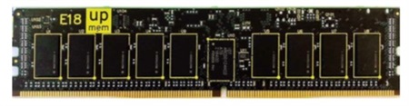
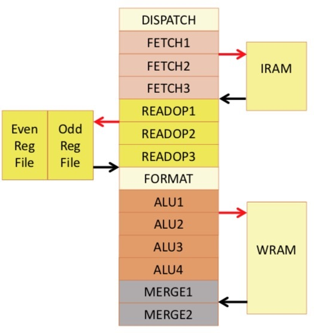
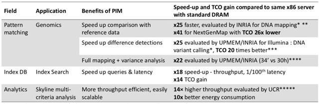

# HOT CHIPS: In-DRAM Compute

<!-- TOC -->

- [HOT CHIPS: In-DRAM Compute](#hot-chips-in-dram-compute)
	- [Building a Logic Flow on a DRAM Process](#building-a-logic-flow-on-a-dram-process)
	- [Results](#results)
	- [Availability](#availability)

<!-- /TOC -->

Something that has been discussed for years is the fact that we could add processors to DRAM memory pretty cheaply if we could work out what to do with them. Usually, when people suggest this, they don't really think it through. They are assuming that they would get something close to a state-of-the-art microprocessor on the same die as the DRAM. Then they look at the specs for a DRAM process and realize you can't easily build a useful microprocessor in a DRAM process.

多年来一直在讨论的一个事实是，如果我们能够弄清楚如何处理它们，我们可以非常便宜地将处理器添加到 DRAM 内存中。 通常，当人们提出这个建议时，他们并没有真正考虑清楚。 他们假设他们会在与 DRAM 相同的芯片上获得接近于最先进微处理器的东西。 然后他们查看 DRAM 工艺的规格，并意识到您无法在 DRAM 工艺中轻松构建有用的微处理器。

At HOT CHIPS last month, Fabrice Devaux of Upmem detailed how they had done it successfully in a presentation titled The True Processing in Memory Accelerator.

在上个月的 HOT CHIPS 上，Upmem 的 Fabrice Devaux 在题为“内存加速器中的真实处理”的演讲中详细介绍了他们是如何成功做到这一点的。

Unless you are a DRAM designer, you probably don't know all that much about DRAM processes. By logic standards they are horrible:

除非您是 DRAM 设计师，否则您可能不太了解 DRAM 工艺。 按照逻辑标准，它们是可怕的：

- 3X slower transistors than the same node for a digital logic process
- 对于数字逻辑过程，晶体管比相同节点慢 3 倍
- Logic is 10 times less dense than a logic process
- 逻辑的密度比逻辑过程低 10 倍
- Routing density dramatically lower, with just three layers of metal and a pitch four times as large
- 布线密度显着降低，只有三层金属和四倍大的间距
- Fabrice didn't mention it, but I know from talking to other people, that the current-carrying capacity of the interconnect metal is low since DRAM doesn't need high power and it needs interconnect to be cheap. So electromigration can be an issue.
- 法布里斯没有提到，但我通过与其他人交谈知道，互连金属的载流能力很低，因为DRAM不需要高功率，并且需要互连便宜。 所以电迁移可能是一个问题。

Upmem has developed a processor-in-memory (PIM) architecture and chip, embedded eight processors on a die, and is delivering them as standard DDR4 2400 DIMM modules with 16 chips. This means that a server CPU has the potential to be helped by thousands of additional cores. They see boosts of 20+X for data-intensive applications, with power efficiency 10X better by removing the need to move the data between the DIMMs and the CPU. The cost increment is small. They have done this on a modern (2x nm) unmodified DRAM process.

Upmem 已开发出一种内存处理器 (PIM) 架构和芯片，在一个芯片上嵌入了 8 个处理器，并将它们作为具有 16 个芯片的标准 DDR4 2400 DIMM 模块提供。 这意味着服务器 CPU 有可能得到数千个额外内核的帮助。 他们看到数据密集型应用程序的性能提高了 20 倍以上，通过消除在 DIMM 和 CPU 之间移动数据的需要，电源效率提高了 10 倍。 成本增量小。 他们在现代 (2x nm) 未修改的 DRAM 工艺上完成了这项工作。

## Building a Logic Flow on a DRAM Process

The first problem is that most of the basic foundation IP required is unavailable. There are no digital standard cells, no SRAMs. So the first thing that they did is to create a digital library and four different SRAMs from 320 bits up to 16KB, single and dual port. The focus of Fabrice's presentation was on the processor itself, but I'm sure building a good SRAM in a DRAM process has an interesting set of challenges. Of course, there is plenty of DRAM memory on the chip already but it was never designed to be modified, so it was necessary to minimize changes to the DRAM IP.

第一个问题是所需的大部分基础IP都不可用。 没有数字标准单元，没有 SRAM。 所以他们做的第一件事就是创建一个数字库和四个不同的 SRAM，从 320 bits到 16KB，单端口和双端口。  Fabrice 演讲的重点是处理器本身，但我确信在 DRAM 工艺中构建良好的 SRAM 面临一系列有趣的挑战。 当然，芯片上已经有大量 DRAM 内存，但它从来没有被设计为可以修改，因此有必要尽量减少对 DRAM IP 的更改。

Building a fast processor using slow transistors is obviously a challenge. It takes a 14-stage pipeline to reach 500 MHz. The approach they took was to allow up to 24 hardware threads. But the pipeline is interleaved so that each stage in the pipeline is running a different thread, so there is no operand bypass, no stalls, no need for branch prediction. However, it does require a minimum of 11 threads to hit 100% performance. This pipeline runs one instruction per cycle, just not from the same thread. There is 1GB/s transfer from DRAM with transfers from 8B to 2KB. It is roughly equivalent to 1/6th of a Xeon core on PIM applications (branchy, integer-only code).

使用慢速晶体管构建快速处理器显然是一个挑战。 达到 500 MHz 需要 14 级流水线。 他们采用的方法是允许最多 24 个硬件线程。 但是流水线是交错的，因此流水线中的每个阶段都运行不同的线程，因此没有操作数旁路，没有停顿，不需要分支预测。 但是，它确实需要至少 11 个线程才能达到 100% 的性能。 这个流水线每个周期运行一条指令，只是不是来自同一个线程。 从 8B 到 2KB 的 DRAM 传输速度为 1GB/s。 它大约相当于 PIM 应用程序（分支、仅整数代码）上 Xeon 内核的 1/6。

The heavy multi-threading also implies an implicit memory hierarchy. There is no data cache because there is too much threading for it to be effective. Instead, there is a 64KB SRAM called WRAM. There is no instruction cache, instructions run out of a 24KB SRAM called IRAM. DMA instructions move data between the DRAM and the WRAM and IRAM. The DMA is executed by a separate DMA engine with minimal impact on pipeline performance. This diagram shows the pipeline and memories.

繁重的多线程也意味着隐含的内存层次结构。 没有数据缓存，因为有太多的线程无法有效。 相反，有一个称为 WRAM 的 64KB SRAM。 没有指令缓存，指令用完称为 IRAM 的 24KB SRAM。  DMA 指令在 DRAM 和 WRAM 和 IRAM 之间移动数据。  DMA 由单独的 DMA 引擎执行，对流水线性能的影响最小。 该图显示了管道和存储器。

The instruction set architecture (ISA) for the processor is proprietary, after they examined and rejected both Arm and RISC-V. It is a clean target for the LLVM/CLANG compiler system. It is only scalar, in-order, and multi-threaded. Some interesting things about the ISA:

在他们检查并拒绝了 Arm 和 RISC-V 之后，处理器的指令集架构 (ISA) 是专有的。 它是 LLVM/CLANG 编译器系统的干净目标。 它只是标量、有序和多线程的。 关于ISA的一些有趣的事情：

- It only supports 8x8 single cycle multiplies but otherwise is more powerful than other 32-bit ISAs
- 它仅支持 8x8 单周期乘法，但在其他方面比其他 32 位 ISA 更强大
- 0 cycle conditional jump on result properties (due to the interlaced pipeline)
- 结果属性上的 0 周期条件跳转（由于隔行流水线）
- SHIFT+ADD/SUB instructions
- SHIFT+ADD/SUB 指令
- Rich set of logic instructions including NAND, NOR, ORN, ANDN, NXOR
- 丰富的逻辑指令集，包括NAND、NOR、ORN、ANDN、NXOR
- Rich set of shift/rotate instructions
- 丰富的移位/旋转指令集
- Large immediate values supported
- 支持大的立即数

There is no OS since there is no DPU sharing, which also is a dramatic security simplification. There are simply so many DPUs that there is never a need to share one.

没有操作系统，因为没有 DPU 共享，这也是一个戏剧性的安全简化。  DPU 实在是太多了，根本就没有必要共享一个。

One problem with doing PIM is that the data has to be stored in a special way. Normally words are stored "horizontally" with eight bits from each 64-bit word stored in each memory chip. But that makes it impossible for the processor to do much. Instead, data needs to be rotated to be "vertical" so that all the bits of each 64-bit word are completely contained within a single DRAM chip and so is all accessible to the processors on that chip. So eight 64-bit horizontal words spread across all the memory chips are turned into eight vertical words, one in each memory chip. This rotation, an 8x8 matrix transposition, is done by the library inside a 64-byte cache line, thus very efficiently.

使用 PIM 的一个问题是数据必须以一种特殊的方式存储。 通常字是“水平”存储的，每个存储芯片中存储的每个 64 位字有 8 位。 但这使得处理器无法做太多事情。 相反，数据需要旋转为“垂直”，以便每个 64 位字的所有位都完全包含在单个 DRAM 芯片中，因此该芯片上的处理器都可以访问。 因此，分布在所有内存芯片上的 8 个 64 位水平字变成了 8 个垂直字，每个内存芯片中一个。 这种旋转，一个 8x8 矩阵转置，由 64 字节缓存线内的库完成，因此非常有效。

The DPUs can be programmed in C and can take on the performance-critical part of the application code, with libraries doing a lot of the heavy lifting. The main server processor (x86, Arm64, Power9) acts as the orchestrator and still executes most of the application code since it is not performance critical.

DPU 可以用 C 语言编程，并且可以承担应用程序代码的性能关键部分，库可以完成很多繁重的工作。 主服务器处理器（x86、Arm64、Power9）充当协调器，并且仍然执行大部分应用程序代码，因为它不是性能关键。

## Results

The table below shows the speed up from a few algorithms from using DPUs versus just running the same algorithm on the host x86 server with standard DRAM. It looks like a 20-40X speedup for those algorithms that are a good match for this sort PIM architecture.

下表显示了使用 DPU 的几种算法与仅在具有标准 DRAM 的主机 x86 服务器上运行相同算法的速度提升。 对于那些非常适合这种 PIM 架构的算法来说，它看起来像是 20-40 倍的加速。

## Availability

Production started in Q3 2018, with samples available about now. Mass production is scheduled for Q1 2020.

生产于 2018 年第三季度开始，现在可以提供样品。 批量生产定于 2020 年第一季度。

> 本文转载自：https://community.cadence.com/cadence_blogs_8/b/breakfast-bytes/posts/hot-chips-in-dram-compute