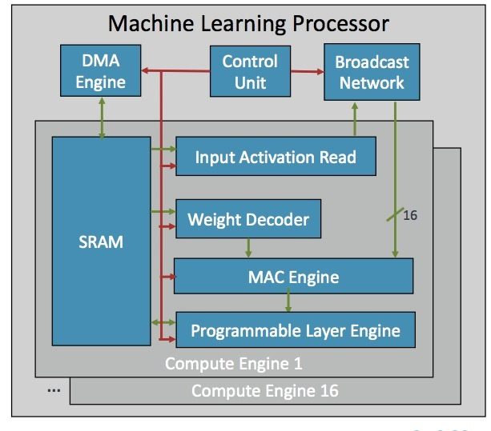
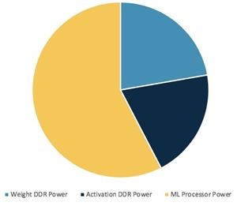
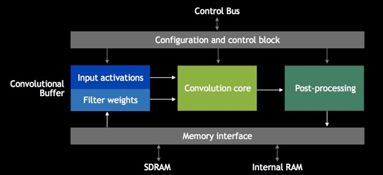
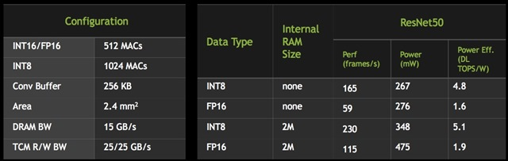

# HOT CHIPS: Some HOT Deep Learning Processors

<!-- TOC -->

- [HOT CHIPS: Some HOT Deep Learning Processors](#hot-chips-some-hot-deep-learning-processors)
	- [Arm](#arm)
	- [NVIDIA](#nvidia)

<!-- /TOC -->

If there was a theme running through the recent HOT CHIPS conference in Cupertino then it was deep learning. There were two sessions on machine learning, but also every processor described in the server processor session had something to handle deep learning training. I'm not going to attempt to write about all of them, but because of their ubiquity, I'll discuss the presentations by Arm and NVIDIA on their deep learning processors.

如果最近在库比蒂诺举行的 HOT CHIPS 会议上有一个主题，那就是深度学习。 有两个关于机器学习的会议，但服务器处理器会议中描述的每个处理器都有处理深度学习训练的东西。 我不会尝试写所有这些，但由于它们无处不在，我将讨论 Arm 和 NVIDIA 关于他们的深度学习处理器的演示。

On the subject of deep learning, I covered the Sunday tutorial in [HOT CHIPS Tutorial: On-Device Inference](https://community.cadence.com/cadence_blogs_8/b/breakfast-bytes/posts/ai-processing). The Arm and NVIDIA chips are focused on this area, and also take into account a lot of the specific compression techniques discussed in the tutorial.

关于深度学习的主题，我在 HOT CHIPS 教程：设备上推理中介绍了周日教程。 Arm 和 NVIDIA 芯片专注于这一领域，并且还考虑了教程中讨论的许多特定压缩技术。

## Arm

Ian Bratt presented Arm's First-Generation Machine Learning Processor. This is a brand new processor optimized for machine learning. Like any specialized processor in this area, it is a big efficiency uplift from CPUs, GPUs, and DSPs. For now, at least, it seems to be called simply the Arm ML processor, although I expect it will get a Armish name when it is officially released later this year (TechCon is in October, so if I were a betting man I'd go for Mike Muller's keynote).

Ian Bratt 展示了 Arm 的第一代机器学习处理器。 这是一款针对机器学习优化的全新处理器。 与该领域的任何专用处理器一样，它是 CPU、GPU 和 DSP 的巨大效率提升。 至少现在，它似乎被简单地称为 Arm ML 处理器，尽管我预计它会在今年晚些时候正式发布时获得一个 Armish 名称（TechCon 是在 10 月，所以如果我是一个赌徒，我会 去看看 Mike Muller 的主题演讲）。

Ian gave the four key ingredients for a machine learning processor as: static scheduling, efficient convolutions, bandwidth reduction mechanisms, and programmability.

Ian 给出了机器学习处理器的四个关键要素：静态调度、高效卷积、带宽减少机制和可编程性。

The static scheduling is implemented by a mixture of compilation, which analyzes the NN (neural network) and produces a command stream, and a control unit that executes the command stream. There are no caches or memory and DMA is managed directly by the compiler/processor.

静态调度由编译器和执行命令流的控制单元混合实现，编译器分析NN（神经网络）并产生命令流。 没有缓存或内存，DMA 由编译器/处理器直接管理。

Convolutions are done efficiently, mapping different parts of the input and output feature maps among the 16 processors in the system. The MAC engine itself (on each processor) is capable of eight 16x16 8-bit dot products, so with 16 MAC engines, you get 4096 ops/cycle, making 4.1 TOPS at a 1GHz clock. There is full datapath gating for zeros, giving a 50% power reduction. See tutorial post linked above for much more about handling zeros. There are also mechanisms for activations from one compute engine to another, which are broadcast on the network that links them all. The processor has a POP optimization kit for the MAC engines, tuned for 16nm and 7nm. This provides an impressive 40% area reduction and 10-20% power reduction versus just using the normal cells.

卷积高效完成，在系统中的 16 个处理器之间映射输入和输出特征图的不同部分。 MAC 引擎本身（在每个处理器上）能够处理 8 个 16x16 8 位点积，因此使用 16 个 MAC 引擎，您可以获得 4096 次操作/周期，在 1GHz 时钟下产生 4.1 TOPS。 有针对零的完整数据路径门控，可降低 50% 的功耗。 有关处理零的更多信息，请参阅上面链接的教程帖子。 还有从一个计算引擎到另一个计算引擎的激活机制，这些机制在连接它们的网络上广播。 该处理器具有针对 MAC 引擎的 POP 优化套件，针对 16nm 和 7nm 进行了调整。 与仅使用普通单元相比，这提供了令人印象深刻的 40% 的面积减少和 10-20% 的功率减少。

DRAM power can be nearly as high as the processor itself (yellow in the pie chart is the ML power, the rest is memory, blue for the weights, black for the activation), so compression to reduce this is important. The ML processor supports weight compression, activation compression, and tiling. This results in a saving of about 3X with no loss in accuracy (since it is lossless compression).

DRAM 功率几乎与处理器本身一样高（饼图中的黄色是 ML 功率，其余是内存，蓝色代表权重，黑色代表激活），因此压缩以减少这一点很重要。 ML 处理器支持权重压缩、激活压缩和平铺。 这导致大约 3 倍的节省，而不会降低准确性（因为它是无损压缩）。

As discussed in the tutorial linked above, pruning during the training phase increases the number of zeros, and clustering can snap the remaining non-zero weights to a small collection of possible non-zero values (easy to compress). The models are compressed offline during compilation. The weights, which dominate later layers of networks, remain compressed until read out of internal SRAM. Compiler-based scheduling is tuned to keep the working set in SRAM, and tiled or wide scheduling minimizes trips to DRAM. Multiple outputs can be calculated in parallel from the same input. This is all possible due to the static scheduling, which is set up at compile time, and executed in the processor.

正如上面链接的教程中所讨论的，在训练阶段修剪会增加零的数量，并且聚类可以将剩余的非零权重捕捉到可能的非零值的小集合（易于压缩）。 模型在编译期间被离线压缩。 在网络的后几层中占主导地位的权重保持压缩状态，直到从内部 SRAM 中读出。 基于编译器的调度经过调整以将工作集保持在 SRAM 中，而平铺或宽调度可最大限度地减少对 DRAM 的访问。 可以从同一输入并行计算多个输出。 由于在编译时设置并在处理器中执行的静态调度，这一切都是可能的。

At the bottom of the block diagram above is the programmable layer engine. This is largely to future-proof the processor since the state-of-the-art in neural networks is evolving on almost a daily basis. Ian was deliberately vague about exactly what this processor is, but it "extends ARM CPU technology with vector and NN extensions targeted for non-convolutional operators". It handles the results of the MAC computations, and most of this is handled by a 16-lane vector engine.

上面框图的底部是可编程层引擎。 这主要是为了让处理器面向未来，因为神经网络的最新技术几乎每天都在发展。 Ian 故意对这款处理器的确切含义含糊其辞，但它“通过针对非卷积运算符的向量和 NN 扩展扩展了 ARM CPU 技术”。 它处理 MAC 计算的结果，其中大部分由 16 通道矢量引擎处理。

The basic design is very scalable, in the number of compute engines (16 in this implementation), MAC engine throughput (add more MACs), and in the overall number of ML processors.

基本设计在计算引擎的数量（在此实现中为 16 个）、MAC 引擎吞吐量（添加更多 MAC）以及 ML 处理器的总数方面具有很高的可扩展性。

The summary of the new Arm ML processor is:

新的 Arm ML 处理器的总结是：

- 16 compute engines
- ~ 4 TOP/s of convolution throughput (at 1 GHz)
- Targeting > 3 TOP/W in 7nm and ~2.5mm^2
- 8-bit quantized integer support
- 1MB of SRAM
- Support for Android NNAPI and ARMNN
- To be released 2018

## NVIDIA

Frans Sijstermans of NVIDIA presented the NVIDIA Deep Learning Accelerator, NVDLA. It was originally developed as part of Xavier, NVIDIA's SoC for autonomous driving. It is optimized for convolutional neural networks (CNNs) and computer vision. NVIDIA decided to open source the architecture and the RTL. You can simply download it and use it without needing any special permission from NVIDIA. They have taken the view that they cannot cover all applications of deep learning. As Frans put it:

NVIDIA 的 Frans Sijstermans 展示了 NVIDIA 深度学习加速器 NVDLA。 它最初是作为 NVIDIA 用于自动驾驶的 SoC 的 Xavier 的一部分开发的。 它针对卷积神经网络 (CNN) 和计算机视觉进行了优化。 NVIDIA 决定开源架构和 RTL。 您只需下载并使用它，无需 NVIDIA 的任何特别许可。 他们认为他们无法涵盖深度学习的所有应用。 正如弗兰斯所说：

> The more people who do deep learning, the better it is for us.
> 做深度学习的人越多，对我们越好。

Obviously, for now anyway, the more people do inference at the edge, the more people need to do training in the cloud, and that means the more NVIDIA GPUs will be needed to do it. Of course, there are the usual advantages of open source in contributions from others in the community, and there is nothing but upside for NVIDIA if NVDLA becomes a de facto standard.

显然，就目前而言，在边缘进行推理的人越多，需要在云中进行训练的人就越多，这意味着需要更多的 NVIDIA GPU 来完成。 当然，开源在社区其他人的贡献中具有通常的优势，如果 NVDLA 成为事实上的标准，对 NVIDIA 来说只有好处。

The high-level architecture is shown in the above block diagram. The processor is scalable. Frans talked about two particular configurations. "Small" has an 8-bit datapath, 1 RAM interface, and none of the advanced features. The "large" configuration had 8-bit- 16-bit and 16-bit floating point datapaths, 2 RAM interfaces, an integrated controller, weight compression, and more. Below is some performance data for the large configurations.

上面的框图显示了高级架构。 处理器是可扩展的。 Frans 谈到了两个特定的配置。 “小”具有 8 位数据路径、1 个 RAM 接口，并且没有任何高级功能。 “大型”配置具有 8 位-16 位和 16 位浮点数据通路、2 个 RAM 接口、一个集成控制器、重量压缩等。 以下是大型配置的一些性能数据。

The processor is available at nvdla.org. Their summary paragraph there says:

该处理器可在 nvdla.org 上获得。 他们的摘要段落说：

> The NVIDIA Deep Learning Accelerator (NVDLA) is a free and open architecture that promotes a standard way to design deep learning inference accelerators. With its modular architecture, NVDLA is scalable, highly configurable, and designed to simplify integration and portability. The hardware supports a wide range of IoT devices. Delivered as an open source project under the NVIDIA Open NVDLA License, all of the software, hardware, and documentation will be available on GitHub. Contributions are welcome.
> NVIDIA 深度学习加速器 (NVDLA) 是一种免费且开放的架构，可促进设计深度学习推理加速器的标准方法。 凭借其模块化架构，NVDLA 具有可扩展性、高度可配置性，旨在简化集成和可移植性。 硬件支持广泛的物联网设备。 在 NVIDIA Open NVDLA 许可下作为开源项目交付，所有软件、硬件和文档都将在 GitHub 上提供。 欢迎投稿。

原文地址：https://community.cadence.com/cadence_blogs_8/b/breakfast-bytes/posts/hot-chips-some-hot-deep-learning-processors