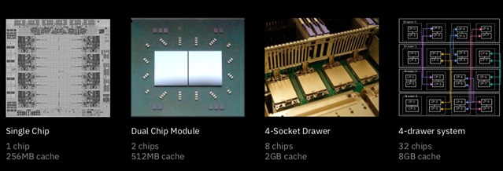
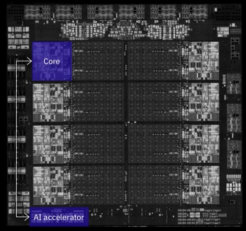
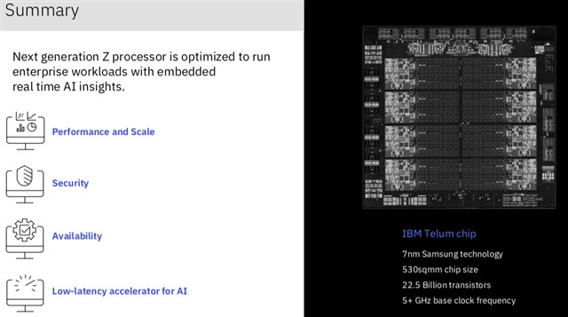

# HOT CHIPS: The Next-Generation of General-Purpose Compute

<!-- TOC -->

- [HOT CHIPS: The Next-Generation of General-Purpose Compute](#hot-chips-the-next-generation-of-general-purpose-compute)
	- [Intel Alder Lake CPU Architecture (Laptop and Desktop)](#intel-alder-lake-cpu-architecture-laptop-and-desktop)
	- [AMD Next-Generation Zen 3 Core (Server and Gaming)](#amd-next-generation-zen-3-core-server-and-gaming)
	- [The >5GHz Next-Generation Z Processor Chip (Mainframe)](#the-5ghz-next-generation-z-processor-chip-mainframe)
	- [Intel Sapphire Rapids (Server)](#intel-sapphire-rapids-server)
	- [Commonalities (共性)](#commonalities-共性)

<!-- /TOC -->

At the recent HOT CHIPS, the first day opened with the chips that you first think of when you hear the word processor. These are the next generation of chips from the likes of Intel, AMD, and IBM. There were lots of other chips too, such as Arm's Neoverse N2, and NVIDIA's new data-processing unit (DPU), or AMD's next-generation graphics architecture. But for this post, anyway, I'm going to focus on these general-purpose processors from the big guys in the industry that power most of the laptops, servers, and gaming consoles.

在最近的 HOT CHIPS 上，第一天开场就是大家听到文字处理器首先想到的芯片。这些是来自英特尔、AMD 和 IBM 等公司的下一代芯片。 还有很多其他芯片，比如 Arm 的 Neoverse N2，以及 NVIDIA 的新数据处理单元 (DPU)，或者 AMD 的下一代图形架构。 但是对于这篇文章，无论如何，我将重点介绍这些来自业内大公司的通用处理器，这些处理器为大多数笔记本电脑、服务器和游戏机提供动力。

I am not going to try and go into detail on all these architectures, just point out the things that leaped out to me during the presentations. For all the Intel processors, quite a lot of the same ground was covered during Intel's Technology Day that was held the week before. You can freely watch it on YouTube (you don't need to have been registered for HOT CHIPS). Warning, it's over two hours long.

我不打算尝试详细介绍所有这些架构，只是指出在演示过程中突然想到的事情。 对于所有英特尔处理器，在前一周举行的英特尔技术日期间，涵盖了很多相同的领域。 您可以在 YouTube 上自由观看（您无需注册 HOT CHIPS）。 警告，时间超过两个小时。

<iframe width="314" height="188" src="https://www.youtube.com/embed/3jU_YhZ1NQA" title="YouTube video player" frameborder="0" allow="accelerometer; autoplay; clipboard-write; encrypted-media; gyroscope; picture-in-picture" allowfullscreen></iframe>

## Intel Alder Lake CPU Architecture (Laptop and Desktop)

Alder Lake is an all-new CPU core designed to be scalable from 9W to 125W. It is built on the Intel 7 process (remember 7 is the new 10). It has two types of core, P-core for best single-thread performance (P is for performance) and E-core for throughput (E is for efficiency). They both have a deeper front-end (instruction processing before the execution units) and a deeper back-end (pipeline stages, etc).

Alder Lake 是一款全新的 CPU 内核，可从 9W 扩展到 125W。 它建立在 Intel 7 工艺上（记住 7 是新的 10）。 它有两种类型的内核，用于最佳单线程性能的 P 内核（P 表示性能）和用于吞吐量的 E 内核（E 表示效率）。 它们都有更深的前端（执行单元之前的指令处理）和更深的后端（流水线阶段等）。

Of course, like all designs with two different core sizes, the idea is that a heterogeneous workload can be processed faster and more efficiently by running the time-critical stuff on the big cores and using smaller cores for things that don't need to burn that much power or area to get the job done. More about what Intel is doing in this space below. The diagram above shows that P-cores run over 50% faster than E-cores, but that 2 P-cores and 8 E-cores has over 50% higher throughput than using four P-cores.

当然，就像所有具有两种不同内核大小的设计一样，其想法是通过在大内核上运行时间关键的任务并使用较小的内核来处理不需要消耗过多功耗或面积就可以完成的任务，从而可以更快、更有效地处理异构工作负载。 更多关于英特尔所做的事情将在接下来进行介绍。 上图显示 P 核的运行速度比 E 核快 50% 以上，但 2 个 P 核和 8 个 E 核的吞吐量比使用四个 P 核高 50% 以上。

The diagram above shows the scalability. Note that in the processor world "mobile" means laptop not smartphone. In terms of interfaces, everything is up to date with support for PCIe 5.0, DDR5, and LP5. With, of course, support for older protocols like PCIe 4.0 or DDR4.

上图显示了可扩展性。 请注意，在处理器世界中，“Mobile”是指笔记本电脑而不是智能手机。 在接口方面，一切都是最新的，支持 PCIe 5.0、DDR5 和 LP5。 当然，支持旧协议，如 PCIe 4.0 或 DDR4。

The different chips are built out of different building blocks mixed and matched, as you can see above. The same binary image for the operating system (and any other software) runs unchanged on all the cores.

如上图所示，不同的芯片由混合和匹配的不同构建块构建而成。 操作系统（和任何其他软件）的相同二进制映像在所有内核上运行不变。

The biggest new thing is Intel Thread Director. This provides hardware support for keeping track of which threads should run on P-cores, and which on E-cores, and which should be moved from one core to another. It monitors the runtime instruction mix of each thread as well as the state of each core (including thermal) with nanosecond precision. It doesn't do the thread scheduling in hardware, but the runtime feedback is used by the OS to make scheduling decisions. Over half the presentation was on details of how Thread Director is implemented, and what tables it maintains.

最大的新事物是英特尔线程导向器。 这为跟踪哪些线程应该在 P 核上运行，哪些在 E 核上运行以及哪些应该从一个核移动到另一个核提供了硬件支持。 它以纳秒级精度监控每个线程的运行时指令组合以及每个内核的状态（包括热）。 它不在硬件中进行线程调度，但操作系统使用运行时反馈来做出调度决策。 超过一半的演示文稿是关于如何实现 Thread Director 以及它维护哪些表的细节。

You can see a video demo of Thread Director on YouTube:

您可以在 YouTube 上看到 Thread Director 的视频演示：

<iframe width="312" height="188" src="https://www.youtube.com/embed/h4ENatPLsro" title="YouTube video player" frameborder="0" allow="accelerometer; autoplay; clipboard-write; encrypted-media; gyroscope; picture-in-picture" allowfullscreen></iframe>

## AMD Next-Generation Zen 3 Core (Server and Gaming)

AMD discussed the new Zen 3 core. This is the latest progression in their Zen roadmap (I'm starting to sound like a guru). The original Zen and Zen+ were in 14/12nm. Then Zen 2 was in 7nm. Zen 3 (the one being announced at HOT CHIPS) is still in 7nm, but Zen 4 will be in 5nm.

AMD 讨论了新的 Zen 3 核心。 这是他们 Zen 路线图的最新进展。 最初的 Zen 和 Zen+ 是 14/12nm。 然后 Zen 2 是 7nm。  Zen 3（在 HOT CHIPS 上宣布的那个）仍然是 7nm，但 Zen 4 将是 5nm。

Above are the specs.

以上是规格。

I continue to be amazed at how big of an increase in instructions-per-cycle (IPC) is still possible. It would seem nothing would make that much difference anymore. But Zen 3 has a 19% IPC uplift over Zen 2. The presentation went into detail about what factors caused this increase, as you can see in the above bar graph.

我仍然对每周期指令 (IPC) 仍有可能增加多少感到惊讶。 似乎没有什么会产生如此大的不同了。 但 Zen 3 的 IPC 比 Zen 2 提高了 19%。演示详细介绍了导致这种增加的因素，如上图所示。

Here are the major changes between Zen 2 and Zen 3.

以下是 Zen 2 和 Zen 3 之间的主要变化。

They discussed a future V-cache technology with TSVs and direct copper-to-copper bonding.

他们讨论了具有 TSV 和直接铜对铜键合的未来 V-cache 技术。

So that was the core. It is actually used to deliver a range of products, some using 3D packaging technology.

所以这就是核心。 它实际上用于交付一系列产品，其中一些使用 3D 包装技术。

## The >5GHz Next-Generation Z Processor Chip (Mainframe)

The IBM Z processors are the descendants of the original IBM 360 family. I've read that code from the 1960s will run unchanged on them, probably through some form of virtualization. Certainly, a lot of code that is run on Z mainframes is written in Cobol, a language that dates back to the 1950s. The new processor being announced at HOT CHIPS is called the IBM Telum.

IBM Z 处理器是原始 IBM 360 系列的后代。 我读过 1960 年代的代码将在它们上保持不变，可能是通过某种形式的虚拟化。 当然，在 Z 大型机上运行的许多代码都是用 Cobol 编写的，这种语言可以追溯到 1950 年代。 在 HOT CHIPS 上宣布的新处理器称为 IBM Telum。

You have to have a die-shot at HOT CHIPS, and so here is IBM's. The primary differences from its predecessor are down the left-hand side. I don't have space to go into all the details that were elaborated. The chip is built in Samsung 7nm technology, it is 530 mm2, with 22.5B transistors, and an over 5GHz clock rate.

你必须在 HOT CHIPS 展示一个die-shot，这就是 IBM 的。 与其前身的主要区别在于左侧。 我没有足够的空间来讨论详细说明的所有细节。 该芯片采用三星 7nm 工艺制造，面积为 530 mm2，具有 22.5B 晶体管，时钟频率超过 5GHz。

One of the things that IBM has always excelled at is finding innovative ways to deliver their processors so that they are reliable, serviceable, and very high performance. So a single chip can also be a multi-chip module with two chips, or a drawer with four chips, or a bigger system with four of those drawers.

IBM 一直擅长的事情之一是找到创新的方法来提供他们的处理器，以便它们可靠、可维护且性能非常高。 因此，单个芯片也可以是带有两个芯片的多芯片模块，或者带有四个芯片的抽屉，或者带有四个抽屉的更大系统。

Another new feature is an integrated AI accelerator. At HOT CHIPS, IBM went into quite a lot of detail on this...but increasingly hearing about AI accelerators, they all seem much the same—lots of TOPS, lots of bandwidth, handle sparsity.

另一个新功能是集成的 AI 加速器。 在 HOT CHIPS 上，IBM 对此进行了大量详细介绍……但越来越多地听说 AI 加速器，它们看起来都差不多——很多 TOPS，很多带宽，处理稀疏性。

## Intel Sapphire Rapids (Server)

Sapphire Rapids is the next-generation Intel data center chip (Xeon Scalable Processor in Intel-speak).

Sapphire Rapids 是下一代英特尔数据中心芯片（英特尔称至强可扩展处理器）。

The first big thing about it is that it is a multi-tile design (tile is what other people call die or chiplets). However, it is monolithic at the architecture level and each tile has access to the resources of all the other tiles.

关于它的第一件大事是它是一种多tile设计（tile是其他人所说的芯片或小芯片）。 但是，它在体系结构级别是整体的，每个 tile 都可以访问所有其他 tile 的资源。

Here's the block diagram. Of course like all processors it is built for AI, too. Instead of having some sort of co-processor, Intel says that this has full Intel architecture programmability.

这是框图。 当然，与所有处理器一样，它也是为 AI 构建的。 英特尔表示，它没有某种协处理器，而是具有完整的英特尔架构可编程性。

## Commonalities (共性)

Later in the week, I'll give my opinion on what trends we can discern from these presentations, and others at HOT CHIPS (including the tutorials on the Sunday).

> 本文转载自：https://community.cadence.com/cadence_blogs_8/b/breakfast-bytes/posts/hc2021-gp-processors
