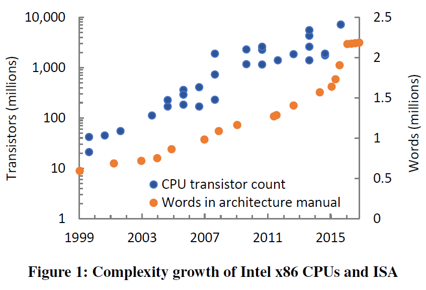
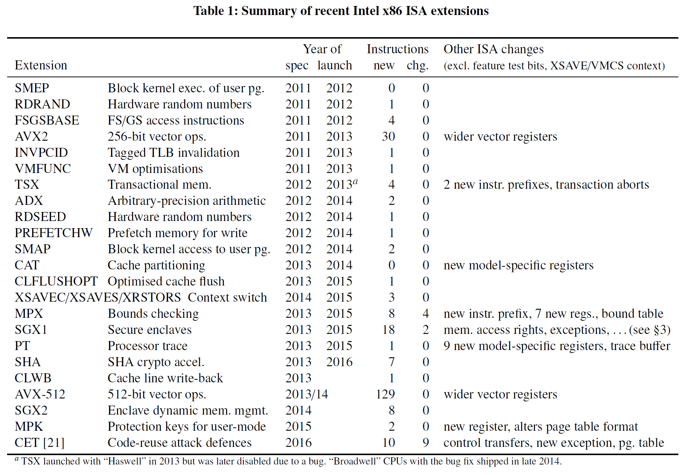

# Hardware is the new Software

<!-- TOC -->

- [Hardware is the new Software](#hardware-is-the-new-software)
	- [Abstract](#abstract)
	- [1. Introduction](#1-introduction)
	- [2. BACKGROUND: X86 EXTENSIONS](#2-background-x86-extensions)
	- [3. CASE STUDY: SGX](#3-case-study-sgx)
	- [4. CASE STUDY: CET](#4-case-study-cet)
	- [5. IMPLICATIONS](#5-implications)
	- [6. CONCLUDING REMARKS](#6-concluding-remarks)

<!-- /TOC -->

## Abstract

摩尔定律可能正在放缓，但也许因此，处理器复杂性的其他衡量标准成为仅剩的加速机会。近年来，英特尔的架构师已经转向使用 MPX、SGX、MPK 和 CET 等指令集扩展的alphabet soup，将新的安全功能作为销售CPU的一种方式。与之前主要关注加速用户模式数据处理的扩展不同，这些新功能展示了复杂的交互，并为系统设计人员提供了充足的思考空间。

这需要重新思考我们如何处理指令集。在本文中，我们强调了最近以安全为中心的扩展所带来的一些挑战，并推测了长期影响。

## 1. Introduction

指令集架构 (ISA) 是最底层软件和 CPU 之间的关键接口。x86 ISA是一组复杂但持久的指令、寄存器、内存和核心设备语义，CPU、仿真器和虚拟机以及在其上运行的所有软件都必须遵守这些语义。成功的ISA会随着时间的推移而增长，鉴于x86的年龄和受欢迎程度，x86对增长并不陌生。然而，在过去的两年里，它的复杂性急剧而迅速地增加（例如，从图 1 中的体系结构手册的大小中可以看出），而且还有更多的扩展。

在本文中，我们研究了这种快速增长的原因，并推测了推动它的潜在趋势。我们将重点放在英特尔x86架构及其最近的扩展上，使我们的案例具体化。作为市场领导者，英特尔通常最先添加新功能，但我们怀疑这些趋势是英特尔独有的。正如我们在§2中所描述的，最近的Intel CPU引入了广泛的ISA扩展。过去的扩展主要集中在通过新的数据处理指令（例如向量扩展）来提高性能，而最近的扩展主要是出于安全考虑，例如保护不安全的C/C++代码免受已知攻击。 这些扩展引入了新的系统级功能，经常改变现有指令的语义，并表现出与其他扩展和先前架构特性的复杂交互。

我们详细研究了最近最复杂的两个扩展：software guard extensions（SGX，§3）和control-flow enforcement technology（CET，§4），然后得出对系统开发人员和研究人员的一些影响（§5）。我们认为，这些扩展现在正在接近类似于软件的复杂程度，但仍带有硬件实现的所有伴随缺点以及这意味着缓慢的部署周期。我们怀疑当前的路径可能是不可持续的，并设想了一个替代未来，其最终目标是将新的 ISA 功能与底层硬件分离。(David Patterson 在设计RISC-V时就提及了这一点，而且进行了体现。)

## 2. BACKGROUND: X86 EXTENSIONS

x86长期以来一直是一个复杂的架构。386参考手册列出了96条指令。（密切相关的指令组，例如不同的操作数宽度，在记录时被计算在内：通常，作为一条指令。）它描述了一种架构，包括分段和分页、16 位模式、多任务支持、异常、协同处理和调试功能。它的现代后代已经获得了诸如浮点、向量扩展的多次迭代、加密加速器、64位模式和硬件虚拟机扩展等特性。

虽然新指令增加了CPU实现的复杂性，但过去的系统设计人员在很大程度上可以忽略这些变化。矢量扩展（MMX、SSE 和 AVX）添加了数据处理指令，有时还扩大了矢量寄存器，但并没有显着改变系统接口。除了64位模式和虚拟化扩展之外，x86上的操作系统开发人员偶尔会被调整以提高性能（例如，快速系统调用）或纠正明显的缺点（例如，用户模式访问FS/GS寄存器和TLB非VM地址空间的标签），但在其他方面被忽略。即使是64位模式也没有显着增加体系结构的复杂性——增加和扩大了寄存器，改变了页表格式，但只有少数新指令。事实上，一些特性被有效地删除了：分段、任务切换和 16 位模式。

但这已经改变了。图1绘制了Intel x86 CPU实现的晶体管数量（以对数尺度），以及Intel架构软件开发人员手册中的字数（以线性尺度）。晶体管数量来自维基百科；使用pdftotext|wc对来自不同来源的手册进行计数。这两个数据集没有可比性，但一些趋势是显而易见的。首先，我们看到摩尔定律；最近宣布的英特尔节奏放缓尚未出现，除了最近的22核Xeon之外，英特尔已停止公布晶体管数量。其次是稳定增长，最近2015-2016年x86的总体复杂性有所提高。这一跳跃是由于“Skylake”微架构引入的扩展，甚至使64位模式和虚拟机扩展（均在2007年添加）相形见绌。

表1总结了英特尔自2012年推出“Ivy Bridge” CPU 以来指定和实施的x86 ISA扩展。对于每个扩展，我们报告第一个公开规范的年份、第一个CPU实现的年份、新指令的数量、行为发生重大变化的指令数量以及任何其他重大的ISA变化。在2015年之前，最复杂的添加是AVX2向量扩展和TSX事务内存，两者都是在2013年的“Haswell”微架构中引入的。TSX显然是一个复杂的功能实现——第一个实现被证明是错误的，后来通过微码补丁被禁用——但ISA级别的复杂性相对较低，只有4条新指令。Skylake之前的其他扩展很小，添加了单个指令或调整保护（例如，SMEP/SMAP功能）。

然而，Skylake引入了相当大的复杂性，包括MPX边界检查指令和寄存器、处理器跟踪(PT)功能和SGX enclave。总的来说，它增加了31条指令和大量相关更改：新寄存器、新指令前缀、许多新的处理器级数据结构、页面访问权限的更改和异常传递。英特尔已指定但尚未实现的其他扩展包括更广泛的向量（AVX-512和相关指令）、额外的SGX功能、“内存保护密钥”功能和控制流执行技术（CET，§4）防御代码重用攻击。除了CET之外，所有这些都包含在最新的架构手册中，它有自己的136页的草案规范。

是什么变化导致了这种快速增长？ 扩展的爆炸式增长很可能是一种深思熟虑的策略。

自2007年以来，英特尔的处理器一直遵循“Tick-Tock”开发模式。大约每两年，就会引入一种具有更小晶体管的新制造工艺（“tick”或芯片缩小），一年后在现有工艺上采用新的微架构（“tock”）。然而，由于新14nm工艺的制造问题，2014年“Broadwell” CPU的推出被推迟，并且在2016年初，2017年第四代14nm架构宣布之前，英特尔确定了14nm及以后的新三阶段开发模型。

摩尔定律的放缓将使CPU的销售变得更加困难：在微架构没有改进的情况下，它们不会变得更快，也不会显着提高能效，并且它们将在与之前相同的价格点拥有大约相同数量的内核CPU。为什么会有人购买新的CPU？英特尔似乎转向的一个原因是功能：如果新CPU实现了重要的ISA扩展——例如，软件要求的扩展，因为它对安全至关重要——消费者将有充分的理由进行升级。

## 3. CASE STUDY: SGX

软件保护扩展(SGX)引入的新指令支持软件飞地的强隔离和远程证明。enclave是虚拟地址空间的一个隔离区域，其内容受到保护，不被enclave外部的代码访问。与之前的可信执行硬件相比，SGX支持安全多路复用：任意数量的不信任飞地可以同时运行，仅受资源约束的限制，而不依赖于可信内核或管理程序。尽管如此，SGX支持用户模式代码的大部分向后兼容的环境。这种引人注目的功能组合以及强大的物理安全性（内存加密）使SGX对研究人员和从业者都具有吸引力；自支持SGX的CPU出现以来的短时间内，已经设计了广泛的应用程序，其他供应商正在竞相开发类似的功能。

然而，SGX引入了相当大的复杂性：近200页英文/伪代码规范描述了26条指令。这在很大程度上源于雄心勃勃的设计目标：保护飞地免受恶意特权软件的侵害，同时使用传统机制（例如页表）保留操作系统级别的物理资源管理以最小化操作系统更改，同时避免对受信任软件的需求。SGX由内存加密硬件、用于证明的信任根（密钥材料）、操作和执行飞地的新指令以及页面访问和异常语义的更改（即TLB未命中和异常处理程序的更改）的组合实现。SGX指令用作特权操作的参考监视器，例如加密页面的映射/使用的更改。内存加密在称为enclave页面缓存(EPC)的固定物理区域上运行，TLB未命中处理程序通过查询EPC映射(EPCM)（元数据表）确保每个EPC页面只能由拥有它的enclave访问对于每个EPC页面（本质上是一个反向映射）。软件无权访问EPCM；相反，它由诸如EADD之类的指令更新，它初始化一个新页面并将其添加到enclave或EMODPR/EMODPE，它更改现有页面的权限。这些指令执行检查以保持EPCM一致性和飞地隔离，例如防止EPC双重映射。

在SGX指令中实现内存管理的优点是无需信任任何软件。与页表等更简单的原语相比，其缺点是灵活性：每个可能的操作都需要一条新指令（或一组指令）来支持它。SGX的第一个版本仅支持虚拟地址布局和权限在创建时固定的飞地。这简化了EPC管理，但实际上排除了动态加载，并使动态内存分配不切实际（必须预先分配程序的最大占用空间）。SGX版本2将添加8条指令用于基本的动态内存管理，但仍然缺乏执行看似简单的操作（如移动页面或共享映射）的能力。

在ISA中内存管理的SGX嵌入进一步增加了其复杂性。在x86上，软件负责在更改页面映射时通过刷新相关内核上的TLB来维护TLB一致性。为了实现这一点，操作系统可以使用锁定的数据结构和处理器间中断在内核之间进行同步。这两个选项在ISA级别都不可用：指令不能循环等待锁定，也不能向其他内核发出信号。相反，SGX使用更复杂的方案，软件执行适当的操作（通常是强制线程退出enclave）并向硬件“证明”它在重用EPC页面之前使用更多指令完成了此操作。

SGX参考文献用近20页来记录其与先前架构特性的交互，包括虚拟化、系统管理模式、处理器间中断、可信执行技术、机器检查和性能监控。除了增加的复杂性之外，其中一些交互会导致有问题的设计结果。例如，CPUID指令在飞地内总是非法的，仅仅是因为虚拟机监视器可能已将其配置为陷阱。相反，写入FS和GS寄存器的用户模式指令在飞地内是合法的，但前提是主机操作系统已通过控制寄存器位启用它们。

虽然SGX努力避免使用受信任的软件，但这一目标与与现有操作系统兼容的愿望发生冲突：EPC资源管理使用正常的分页机制。因此，飞地很容易受到新的“受控通道”攻击，这些攻击源于操作系统诱导和观察飞地页面错误的能力。这些攻击可能会泄漏enclave数据，其严重程度足以使恶意操作系统的SGX威胁模型受到质疑。也许具有讽刺意味的是，已知的最佳缓解措施利用了与事务内存扩展的看似无意的交互：事务中止而不是页面错误，因此操作系统无法观察事务飞地内存访问。

## 4. CASE STUDY: CET

控制流强制技术可防御代码重用攻击，例如面向返回的编程(ROP)。这些攻击利用缓冲区溢出等不安全代码中的漏洞，而不是直接注入可执行代码，而是操纵程序的控制流以在非预期上下文中执行合法指令。CET由两种机制组成：影子堆栈和间接分支跟踪。

在其核心，影子堆栈是一种简单的机制：在函数调用时，处理器将返回地址保存在常规堆栈和影子堆栈上。影子堆栈只存储返回地址，普通代码无法访问。返回时，弹出并比较两个堆栈中的地址，如果它们不同，则引发异常，从而破坏ROP。与影子堆栈的软件实现相比，CET的优势在于性能、兼容性和安全性：通过修改CALL和RET指令的语义，无需修改程序，通过使用一个新的页表属性，影子堆栈可以被软件轻松且廉价地访问，该属性保护影子堆栈不被常规加载和存储访问。

CET还包括间接分支跟踪，以防止函数指针的错误方向：在间接JMP或调用之后，会引发异常，除非下一条指令是有效的程序化分支目标，如新形式的NOP指令所示。虽然这不是完全控制流完整性，但它限制了可用的小工具。

CET承诺为不安全的C/C++代码添加强大的防御，但代价是相当大的架构复杂性。除了新的异常向量、页表属性和特定于模型的寄存器之外，主要的复杂性来自特性交互。x86中的控制转移已经非常复杂，包括多种形式的调用和返回，例如对不同段或特权级别的近调用和远调用。CET总共修改了9条指令（其中一些具有许多变体，例如JMP）。在32位模式下，任务功能意味着对特定段的跳转或调用也可以切换堆栈；CET必须考虑到这一点。在64位模式下，中断可以通过中断堆栈表触发切换到七个数据堆栈之一。因此，CET添加了一个特定于模型的寄存器，指向一个包含七个对应影子堆栈的表。除了修改所有间接控制传输的语义外，CET的间接分支跟踪还必须处理在分支之后但在下一条指令之前发生异常的情况，以确保在任何返回用户模式或上下文切换后可以在需要时引发异常.

## 5. IMPLICATIONS

**可持续性** 虽然我们可能不同意某些设计选择，但这些功能单独而言显然是可取的。令人担忧的是变化的速度，以及具有复杂交互的系统级特征的复杂性的快速增长。作为当今商品技术堆栈中最稳定的“瘦腰”接口，x86 ISA处于许多系统的关键点。x86语义的忠实实现对于无数计算技术至关重要，包括与x86兼容的处理器、虚拟机、仿真器、JIT编译器、动态翻译器、反汇编器、调试器、分析器等。当然，并不是x86的每个实现都必须立即实现每个新特性，但随着时间的推移，架构特性会稳定下来，软件通常会假设它们的存在。例如，考虑一下，如果没有浮点单元或MMX指令，当今的软件很少能在CPU上运行。鉴于此，特别是考虑到最近功能之间的复杂交互，我们不得不质疑x86核心承诺在许多实现之间无限期向后兼容是否可持续。

**时间表** 由于它们依赖于部署新的CPU，因此采用ISA功能的速度很慢。最初的SGX规范于2013年发布，但实现它的第一批CPU直到2015年底才发布，并且在撰写本文时（2017年初）支持SGX的服务器级CPU尚未出现。SGX第2版规范于2014年发布，但尚未实施。如果我们延迟充分部署支持SGX的CPU（以实现例如公共云中的广泛可用性），SGX的端到端部署时间可能接近十年。这对软件开发人员来说是一个艰难的权衡；以前的ISA扩展也需要很长时间才能部署，但它们通常只用于加速现有功能；对于像SGX这样的功能，开发人员面临着一个严峻的选择：无限期地等待安全性，或者在没有它的情况下立即部署。

**硬件是新的软件** 通过仔细阅读英特尔专利，Costan和Devadas得出结论，SGX指令完全以微码实现。从工程的角度来看，这是合乎逻辑的：EPCM更新偏离了关键路径，而且太复杂而无法在芯片中实现（它们涉及多字更新和原子内存访问）。此外，SGX的微码实现允许通过更新更正勘误表。我们没有任何理由相信SGX在这方面是独一无二的——越来越多的新ISA功能意味着新的微码。那么，为什么我们必须等待这么长时间才能让它们与新CPU打包在一起呢？

英特尔及其同行一直对微码和芯片之间的界限以及微码更新的能力保密。我们认为，是时候放松这种保密了，并努力将ISA功能的实现与底层芯片尽可能地分离。这可以采取两种（非排他性的）形式。

首先，CPU供应商可以发布微码更新，为以前的CPU实现一些新的ISA功能。虽然我们不应该期望所有功能都可以以这种方式实现（有些可能从根本上需要芯片），也不能期望它们会执行相同的功能，但这可能是更快部署功能的可行途径，特别是对于像SGX这样的复杂扩展。此类更新的许可和收入模式仍然是一个悬而未决的问题。一方面，我们习惯于免费获得微码更新，但新功能更新的可用性可能会抑制新CPU的市场。就像大型机世界的按需升级一样，我们可能应该期望为新功能付费，就像我们为新硬件付费一样。另一方面，供应商可能希望通过在现有CPU上免费提供某个功能来鼓励采用该功能。
无论是安全相关扩展还是微码实现，首先考虑的还是如何盈利。。。

其次，我们可以扩展架构以允许操作系统或虚拟机管理程序以下的软件实现安全功能。这将需要类似于Alpha PALcode或RISC-V机器模式的特权级别，但不需要新级别的地址转换。这种软件本质上是可信计算库的一部分，但与微码不同的是，它是在用户控制之下的，并且可以独立于 CPU 进行检查和更换。

**安全** 许多最近的安全功能（尤其是SGX）的一个关键卖点是没有软件是可信的。这些功能在微码中的实现是否会改变这一点？我们认为微码比当前的软件更可靠，但并不像我们想象的那样天生安全。首先，其更新经过加密和签名的微代码比攻击者修改的软件要困难得多。其次，CPU供应商拥有良好的测试记录。英特尔对他们的验证过程保密，失败的成本可能比软件错误高得多，但已知表明存在广泛（但肯定不是详尽的）测试。对于SGX，英特尔还发布了使用SMT求解器对高级模型进行形式验证，并验证了并发SGX操作的（不同）模型的线性化。这些都是重要的保证，但没有已知的实现正确性证明，这仍然是秘密。

最终，微码和底层硬件仍然是不透明的，并且随着复杂性的不断增加，我们有必要寻找方法来提高我们对其安全性的信心。软件可以通过一种方式超过正确性的微码标准：高级安全属性的形式验证。最近，Sanctum展示了如何在RISC-V软件中实现类似SGX的功能；这解决了SGX的一些实施复杂性和侧通道问题，但留下了信任问题，我们目前正在通过形式验证来解决这个问题。

## 6. CONCLUDING REMARKS

ISA功能的增长率令人担忧，但对系统研究有潜在的好处。一方面，新功能（例如，TSX、MPX、SGX和PT）传统上预示着大量出版物探索它们的可能性，我们认为没有理由停止。就像使用事务来减轻SGX控制通道一样，ISA功能之间的意外交互将导致新技术的发现。另一方面，英特尔及其同行可能更容易接受来自研究界的想法。最后，不断增加的复杂性会导致许多熟悉的系统问题：管理复杂性和功能交互，在支持架构演进的同时保持遗留兼容性，适应（在软件中，可能是在运行中）异构硬件功能集，以及将开发人员与优化交易隔离开来。关闭；系统研究人员将在这里找到新的应用。我们还应该重新努力设计硬件原语，软件可以使用这些硬件原语来实现今天成为ISA扩展的功能。