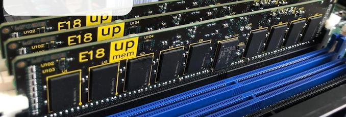
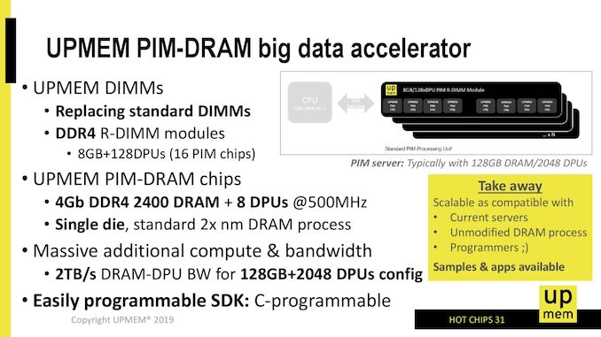
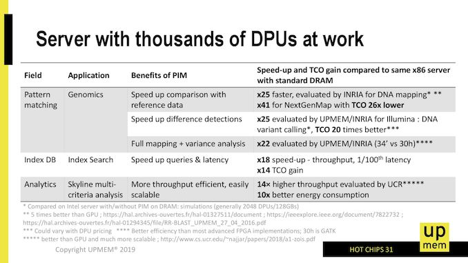
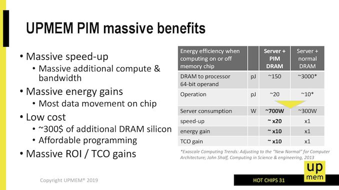
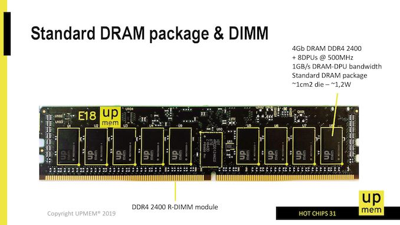
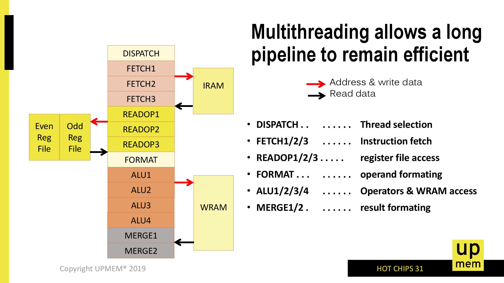
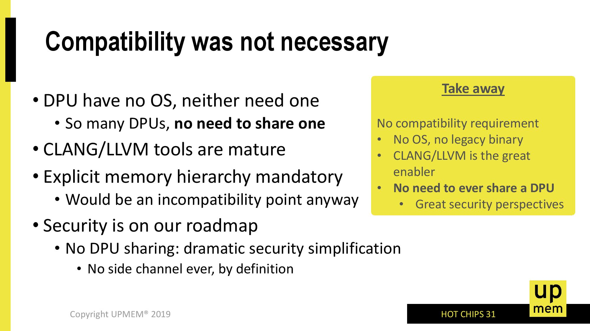
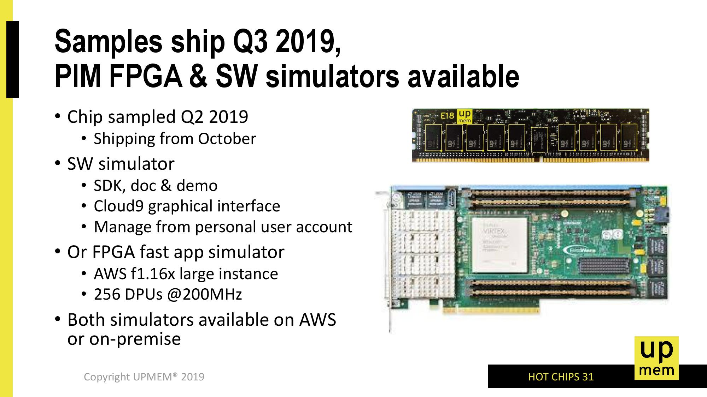

# Hot Chips 31 Analysis: In-Memory Processing by UPMEM

<!-- TOC -->

- [Hot Chips 31 Analysis: In-Memory Processing by UPMEM](#hot-chips-31-analysis-in-memory-processing-by-upmem)
	- [IN-MEMORY PROCESSING BY UPMEM](#in-memory-processing-by-upmem)
		- [Processing In-Memory DRAM, or PIM-DRAM](#processing-in-memory-dram-or-pim-dram)
	- [Inside the PIM-DRAM and DPU](#inside-the-pim-dram-and-dpu)
		- [The Goal](#the-goal)

<!-- /TOC -->

## IN-MEMORY PROCESSING BY UPMEM

One of the key critical future elements about this world of compute is moving data about. Moving data requires power, to the point where calling data from memory can consume more power than actually doing ‘compute’ work on it. This is why we have caches, but even these require extensive management built in to the CPU. For simple operations, like bit-shifts or AND operations, the goal is to move the ability to do that compute onto the main DRAM itself, so it doesn’t have to shuttle back and forth. This year at Hot Chips, UPMEM is one of the first companies to showcase their new technology.

关于这个计算世界的关键未来要素之一是移动数据。移动数据需要电力，以至于从内存中调用数据可能比实际对其进行“计算”工作消耗更多的电力。这就是为什么我们有缓存，但即使是这些也需要 CPU 内置的大量管理。对于简单的操作，如位移或 AND 操作，目标是将计算能力转移到主 DRAM 本身，因此它不必来回穿梭。今年在 Hot Chips 上，UPMEM 是首批展示其新技术的公司之一。

For anyone that has done any form of general purpose compute, pushing a bunch of inputs through an algorithm to get a result, and for those that have written the code, there are typically two high-level mental stages to conquer: first is getting it to work, and second is optimizing it. The algorithm needs to produce the correct result, and the faster the better – a slow correct result often isn’t useful, and a fast incorrect result is useless. If it can be done in less power, than that also decreases overhead.

对于任何做过任何形式的通用计算、通过算法推送一堆输入以获得结果的人，以及对于那些编写代码的人来说，通常有两个高级心理阶段需要征服：首先是得到它工作，其次是优化它。算法需要产生正确的结果，越快越好——一个缓慢的正确结果通常是没有用的，而一个快速的错误结果是无用的。如果它可以以更少的功率完成，那么也会减少开销。

The idea behind In-Memory Processing, or ‘Processing In-Memory’, is that a number of those simple integer or floating point operations should be done while the memory is still in DRAM – no need to cart it over to the CPU, do the operation, and then send it back. If the data can stay there and be updated, this saves time and power without affecting the result. Alternatively, perhaps compute on the CPU can be reduced if results are sent back out to main memory and a final XOR is applied to the data in memory. That frees up the main CPU core to do other compute related things, or reduces the effective memory bandwidth should it be a limiting factor.

In-Memory Processing 或“Processing In-Memory”背后的想法是，当内存仍在 DRAM 中时，应该完成一些简单的整数或浮点运算——无需将其转移到 CPU，执行操作，然后将其发回。如果数据可以保留在那里并进行更新，则可以节省时间和电力，而不会影响结果。或者，如果将结果发送回主内存并对内存中的数据应用最终的异或，也许可以减少 CPU 上的计算。这可以释放主 CPU 内核来做其他与计算相关的事情，或者减少有效内存带宽（如果它是一个限制因素）。

What UPMEM has done is develop a data processing unit (DPU) that is built into the DRAM chip itself, on the DRAM process node. Each DPU has access to 64 MB of DRAM, and has the equivalent of 1 GB/s bandwidth to that memory. The DPU is built on a clean 32-bit ISA with a raft of optimizations, such 0-cycle conditional jumps, combined SHIFT+X instructions (such as SHIFT+ADD or SHIFT+SUB), basic logic instructions, shift and rotate instructions. The programming model is such that C-based libraries are in play taking care of all the common issues, and UPMEM expects for most apps for it to require a few hundred lines of code and a team of a handful of people need only take 2-4 weeks to update the software.

UPMEM 所做的是在 DRAM 工艺节点上开发一个内置于 DRAM 芯片本身的数据处理单元 (DPU)。每个 DPU 都可以访问 64 MB 的 DRAM，并且该内存的带宽相当于 1 GB/s。 DPU 建立在干净的 32 位 ISA 上，并进行了大量优化，例如 0 周期条件 jump、组合 SHIFT+X 指令（例如 SHIFT+ADD 或 SHIFT+SUB）、基本逻辑指令、移位和旋转指令。编程模型使得基于 C 的库可以处理所有常见问题，UPMEM 预计大多数应用程序需要几百行代码，而一个由少数人组成的团队只需要 2- 4 周更新软件。

The big numbers that UPMEM are quoting involve better TCO, better ROI, and a potential target market of $10B. We’ll go through these in due course.

UPMEM 引用的大数字涉及更好的 TCO、更好的投资回报率和 $10B 的潜在目标市场。我们将在适当的时候完成这些。

### Processing In-Memory DRAM, or PIM-DRAM

(Personally I prefer the name PIM-DIMM, but oh well)

What UPMEM is proposing is a standard DDR4 RDIMM like product for which each 64 MB of memory has access to one of its DPUs. The DPU is built into the DRAM itself, using the manufacturing node that the memory is made in. For example, UPMEM is promoting that it is making a 4 Gb DDR4-2400 chip to be used in modules that embeds 8 DPUs in 512 MB, with the DPUs running at 500 MHz. UPMEM plans to put 16 of these 4 Gb chips onto a single DDR4 RDIMM module, providing an 8 GB module with 128 DPUs inside.

UPMEM 提议的是一种标准的 DDR4 RDIMM 之类的产品，其中每 64 MB 的内存都可以访问其一个 DPU。 DPU 内置于 DRAM 本身，使用制造内存的制造节点。 例如，UPMEM 正在宣传它正在制造 4 Gb DDR4-2400 芯片，用于在 512 MB 中嵌入 8 个 DPU 的模块， DPU 以 500 MHz 运行。 UPMEM 计划将这些 4 Gb 芯片中的 16 个放在单个 DDR4 RDIMM 模块上，从而提供一个内部具有 128 个 DPU 的 8 GB 模块。

The goal is to eventually produce 128 GB modules with 2048 DPUs in total. At an effective 1 GB/s bandwidth between a DPU and its 64 MB of memory, this would imply an effective 2 TB/s bandwidth between the DPUs and memory. This is needed due to the way the DPU works, which is explained below.  

目标是最终生产 128 GB 的模块，总共有 2048 个 DPU。在 DPU 与其 64 MB 内存之间的有效带宽为 1 GB/s 时，这意味着 DPU 与内存之间的有效带宽为 2 TB/s。由于 DPU 的工作方式，这是必需的，这将在下面解释。

The processor and technology are patented, but UPMEM has stated that they are working with a memory vendor on a 20-nm class process. Adding in the DPU cores adds a very negligible amount of die area, and can be enabled within 2-3 metal layers, as the logic is a magnitude less dense than a leading edge logic implementation. The idea is to achieve a total energy efficiency of 10x combined with scalability, compared to the leading CPU implementations.

处理器和技术已获得专利，但 UPMEM 表示他们正在与内存供应商合作开发 20 纳米级工艺。添加 DPU 内核增加的芯片面积可以忽略不计，并且可以在 2-3 层金属层内启用，因为逻辑的密度比前沿逻辑实现低得多。与领先的 CPU 实现相比，这个想法是实现 10 倍的总能效和可扩展性。

Currently UPMEM has software simulations and hardware FPGA verification simulators for customers – in fact, interested parties can emulate the UPMEM platform on an AWS f1.16x large instance. Actual PIM-DRAM module samples are shipping to high profile customers in Q3, with a plan to ramp through the next year as more parties are interested and get on-board. Citing performance examples, UPMEM has stated that they have seen speedups of 22x—25x on Genomics pattern matching, an 18x speed up in throughput for database index searching at 1/100th the latency, and an 14x TCO gain for index search applications.

目前UPMEM有软件模拟和硬件FPGA验证模拟器供客户使用——其实有兴趣的可以在AWS f1.16x大实例上模拟UPMEM平台。实际的 PIM-DRAM 模块样品将在第三季度向知名客户发货，并计划在明年推出，因为更多的人对此感兴趣并加入进来。 UPMEM 引用性能示例表示，他们已经看到基因组模式匹配的速度提高了 22 到 25 倍，数据库索引搜索的吞吐量提高了 18 倍，延迟降低了 1/100，索引搜索应用程序的 TCO 提高了 14 倍。

On the side of cost, UPMEM hasn’t stated how much it plans to sell its technology for, but promise to be a marginal cost compared to alternative solutions. In one presentation, the company stated that their solution can replace a potential $40000 server with a $400 enhanced memory solution, noting that using PIM has knock-on effects for software licensing, datacenter space, and power consumption/efficiency.

在成本方面，UPMEM 没有说明它计划以多少价格出售其技术，但与替代解决方案相比，它有望成为边际成本。在一次演示中，该公司表示，他们的解决方案可以用 400 美元的增强型内存解决方案替换潜在的 40000 美元服务器，并指出使用 PIM 会对软件许可、数据中心空间和功耗/效率产生连锁反应。

UPMEM puts some data on that power consumption. In this slide, the company compares two servers, one with PIM-DRAM and one without. In this case, a ‘DRAM to processor 64-bit operand’ recall requires 3000 pJ on a regular server, pulling the data out of DRAM and through to the caches, whereas the same operation on PIM-DRAM where it only has to move the data onto a DPU takes only 150 pJ of energy. The operation itself on the DPU actually requires 2x the power (20 pJ compared to 10 pJ), but the overall gain in power efficiency is 170 pJ vs 3010 pJ, or just under 20x.

UPMEM 会提供有关该功耗的一些数据。在这张幻灯片中，该公司比较了两台服务器，一台配备 PIM-DRAM，另一台不配备。在这种情况下，“DRAM 到处理器 64 位操作数”的调用在常规服务器上需要 3000 pJ，将数据从 DRAM 中拉出并通过缓存，而在 PIM-DRAM 上的相同操作只需要移动DPU 上的数据仅需要 150 pJ 的能量。 DPU 上的操作本身实际上需要 2 倍的功率（20 pJ 与 10 pJ 相比），但功率效率的总体增益是 170 pJ 与 3010 pJ，或略低于 20 倍。

One thing that this slide states that might be confusing is the server power consumption – the regular server is listed as only 300W, but the PIM solution is up to 700W. This is because the power-per-DRAM module would increase under UPMEM’s solution.

这张幻灯片指出的可能令人困惑的一件事是服务器功耗 - 常规服务器仅列为 300W，但 PIM 解决方案高达 700W。这是因为在 UPMEM 的解决方案下，每个 DRAM 模块的功率会增加。

The module that UPMEM is proposing as its first product is that 8 GB DDR4-2400 module mentioned previously, with 128 DPUs each covering 64 MB of memory and running at 500 MHz. For a single 4 Gb die (there are 16 of them in an 8 GB module, 18 for RDIMM ECC), we are still at a regular 1 cm2 die size but the power required per chip is ~1.2 watts.

UPMEM 提议作为其第一个产品的模块是前面提到的 8 GB DDR4-2400 模块，具有 128 个 DPU，每个 DPU 覆盖 64 MB 内存并以 500 MHz 运行。对于单个 4 Gb 裸片（8 GB 模块中有 16 个，RDIMM ECC 有 18 个），我们仍然使用常规的 1 cm2 裸片尺寸，但每个芯片所需的功率约为 1.2 瓦。

If we go into all 16/18 chips, we can see that each 8GB module is going to be in the 19.2-21.6 watts. That’s a lot of power for DRAM, and actually pushes up against the limit of what a DDR4 slot is often rated for. To put some perspective here, Intel’s 512 GB Optane module has an 18 W running mode for servers that can cool that much, but can run as low as 12 W. UPMEM hasn’t stated if it offers the ability for its customers to scale down the power per module by reducing the DPU frequency.

如果我们查看所有 16/18 芯片，我们可以看到每个 8GB 模块的功率将在 19.2-21.6 瓦之间。这对 DRAM 来说是很大的功率，实际上已经突破了 DDR4 插槽通常额定的极限。从某些角度来看，英特尔的 512 GB Optane 模块具有 18 W 运行模式，用于服务器可以冷却这么多，但可以低至 12 W。 UPMEM 没有说明它是否为客户提供缩减规模的能力通过降低 DPU 频率来降低​​每个模块的功率。

UPMEM’s goal is to replace DRAM modules in servers with PIM-DRAM modules as drop-in replacements. The company states that the DDR4 interface isn’t the best for this sort of thing, but they have worked around it. In one presentation, the company notes that at present there needs to be non-PIM-DRAM installed at a minimum for an OS.

UPMEM 的目标是用 PIM-DRAM 模块替换服务器中的 DRAM 模块作为直接替代品。该公司表示 DDR4 接口不是最适合这类事情，但他们已经解决了这个问题。在一次演示中，该公司指出，目前至少需要为操作系统安装非 PIM-DRAM。

## Inside the PIM-DRAM and DPU

So as mentioned, each data processing unit (DPU) is put in control of 64 MB of DRAM, leading to 128 DPUs in an 8 GB module. These are built into the DRAM at the same time as manufacturing, but the logic is not as physically dense as regular ASIC logic, making it a high-yielding solution. Ultimately a DRAM die is still mostly DRAM, and the UPMEM states that the DPU size is negligible by comparison. In order to do this, UPMEM created an ASIC-like framework of logic cells, SRAM IPs, and implementation flow. Ultimately the goal was to add these DPUs to an otherwise unmodified DRAM design, and the company states they have succeeded.

如前所述，每个数据处理单元 (DPU) 都被置于 64 MB DRAM 的控制之下，从而导致 8 GB 模块中的 128 个 DPU。这些是在制造的同时内置到 DRAM 中的，但逻辑在物理上不如常规 ASIC 逻辑密集，使其成为高产量的解决方案。最终，DRAM 芯片仍然主要是 DRAM，并且 UPMEM 表示，相比之下，DPU 大小可以忽略不计。为了做到这一点，UPMEM 创建了一个类似于 ASIC 的逻辑单元、SRAM IP 和实现流程的框架。最终目标是将这些 DPU 添加到未经修改的 DRAM 设计中，该公司表示他们已经成功。

The DPU is a 14-stage interleaved pipeline processor, that uses 24 hardware threads to achieve better scaling (apparently only 11 are needed for 100% utilization). On multithreaded code, this creates a 1 instruction/cycle throughput, and the 1 GB/s latency per DPU to its local memory helps hide the threading. There is no operand bypass, and no stall signals.

DPU 是一个 14 级交错流水线处理器，它使用 24 个硬件线程来实现更好的扩展（显然只需要 11 个就可以达到 100% 的利用率）。在多线程代码上，这会创建 1 个指令/周期的吞吐量，每个 DPU 到其本地内存的 1 GB/s 延迟有助于隐藏线程。没有操作数旁路，也没有停顿信号。

Each DPU has 88 KB of SRAMs inside, split into 64 KB of WRAM (a data cache equivalent) and 24 KB of IRAM (instruction cache equivalent), with DMA instructions to move data between the DRAM and the WRAM/IRAM. These DMA engine is autonomous, which UPMEM states has little-no-effect on pipeline for performance. There is no actual ‘cache’ here, with the company stating that there are too many threads for actual caches, so instead they rely on the efficient DRAM engine and a tightly coupled bank of SRAM to do that job.

每个 DPU 内部有 88 KB SRAM，分为 64 KB WRAM（相当于数据缓存）和 24 KB IRAM（相当于指令缓存），DMA 指令用于在 DRAM 和 WRAM/IRAM 之间移动数据。这些 DMA 引擎是自主的，UPMEM 声明这些引擎对性能的流水线几乎没有影响。这里没有实际的“缓存”，该公司表示实际缓存有太多线程，因此他们依靠高效的 DRAM 引擎和紧密耦合的 SRAM 库来完成这项工作。

The 14-stage pipeline us a basic in-order threaded CPU with dispatch/fetch/read/format/ALU/merge stages with access to the local SRAMs. The DPU has a 64-bit wide access port to its 64 MB array of main DRAM for loads and stores through an immediate addressing mode, and ultimately control of the DPU is still through the main CPU. No DPU can talk to each other, and the DPUs can only work on their 64 MB of main memory, allowing security separation between the hardware.

14 级流水线使用一个基本的有序线程 CPU，具有分派/获取/读取/格式化/ALU/合并阶段，可访问本地 SRAM。 DPU 有一个 64 位宽的访问端口，可通过立即寻址模式访问其 64 MB 主 DRAM 阵列，用于加载和存储，最终 DPU 的控制仍通过主 CPU。没有 DPU 可以相互通信，并且 DPU 只能在其 64 MB 的主内存上工作，从而允许硬件之间的安全隔离。

The main server CPU has full control over the DPU units through the APIs provided by UPMEM, such that the DPUs can be done on an allocate/free bases or managed through group execution or one-by-one. The DPU doesn’t actually run an OS according to UPMEM, and is controlled just through the device driver.

主服务器 CPU 通过 UPMEM 提供的 API 可以完全控制 DPU 单元，因此 DPU 可以在分配/空闲基础上完成或通过组执行或一对一管理。 DPU 实际上并不根据 UPMEM 运行操作系统，而只是通过设备驱动程序进行控制。

UPMEM states that Clang and LLVM tools are mature to manage DPU use through the compiler and provided APIs. Technically the DPUs have orchestration overhead as a result, and part of this is down to using DDR4 rather than a proprietary interface. UPMEM states that this orchestration management, such as bus width mismatches, address interleaving, the lack of cache coherent and the lack of hardware arbitration, is negligible compared to the work the DPU actually does. The APIs for managing this are available for x86, POWER 9, and ARM64.

UPMEM 表示 Clang 和 LLVM 工具已经成熟，可以通过编译器和提供的 API 来管理 DPU 的使用。从技术上讲，DPU 会因此产生编排开销，部分原因在于使用 DDR4 而不是专有接口。 UPMEM 指出，与 DPU 实际所做的工作相比，这种编排管理（例如总线宽度不匹配、地址交错、缺乏缓存一致性和缺乏硬件仲裁）可以忽略不计。用于管理这些的 API 可用于 x86、POWER 9 和 ARM64。

Internally the DPU uses an optimized 32-bit ISA with triadic instructions, with non-destructive operand compute. As mentioned, the optimized ISA contains a range of typical instructions that can easily be farmed out to in-memory compute, such as SHIFT+ADD/SHIFT+SUB, basic logic (NAND, NOR, ORN, ANDN, NXOR), shift and rotate instructions, and even compute that requires intermediate values. The DPU supports bi-endianess, and is host OS agnostic.

在内部，DPU 使用优化的 32 位 ISA 和三元指令，具有非破坏性操作数计算。如前所述，优化后的 ISA 包含一系列典型指令，可以轻松地将其分配给内存计算，例如 SHIFT+ADD/SHIFT+SUB、基本逻辑（NAND、NOR、ORN、ANDN、NXOR）、移位和旋转指令，甚至计算需要中间值。 DPU 支持双字节顺序，并且与主机操作系统无关。

### The Goal

UPMEM is presenting its technology at Hot Chips as an attempt to attract potential customers, and is looking at mass production of its 8 GB memory modules in Q1, although early customers are already being sampled. The company is set to launch a sales office in the Bay Area during the second half of 2019.

UPMEM 正在 Hot Chips 上展示其技术以试图吸引潜在客户，并且正在考虑在第一季度量产其 8 GB 内存模块，尽管早期客户已经在接受样品测试。该公司将于 2019 年下半年在湾区设立销售办事处。

The company is putting up impressive numbers for specific workloads, and to be honest, the question of in-memory compute is not really a question of if, but when. Even on the consumer side, there are some good examples where in-memory compute could help. I enjoyed going through UPMEM’s slide decks and looking at what they have to offer. It will be interesting to see other competing solutions come to the market, and how they approach the problem.

该公司为特定工作负载提供了令人印象深刻的数字，老实说，内存计算的问题实际上不是是否存在，而是何时存在的问题。即使在消费者方面，也有一些很好的例子说明内存计算可以提供帮助。我喜欢浏览 UPMEM 的幻灯片并查看它们提供的内容。看到市场上出现其他竞争解决方案以及它们如何解决问题将会很有趣。

I will finish this article on one important note, however. Going up to 20W per 8 GB memory module is not a long-term solution. One of the disadvantages of moving compute away from the CPU is that you have to spend that compute power elsewhere, and a DRAM module isn’t usually the most ideal solution for that based on historic design (especially if doing the calculation is half as efficient). If a CPU socket can hold 150W, and a memory socket can do 20W, then you want most of the power consumed on the compute in the socket. In-memory compute is a good problem to solve, but ultimately it needs to be combined with on-CPU DRAM.

然而，我将在一个重要的注释上完成这篇文章。将每个 8 GB 内存模块提高到 20W 并不是一个长期的解决方案。将计算从 CPU 移走的缺点之一是您必须将计算能力花在其他地方，而 DRAM 模块通常不是基于历史设计的最理想解决方案（特别是如果计算效率只有一半）。如果 CPU 插槽可以承受 150W 的功率，而内存插槽可以承受 20W 的功率，那么您希望插槽中的计算消耗的大部分功率。内存计算是一个很好解决的问题，但最终它需要与 CPU 上的 DRAM 相结合。

原文链接：https://www.anandtech.com/show/14750/hot-chips-31-analysis-inmemory-processing-by-upmem