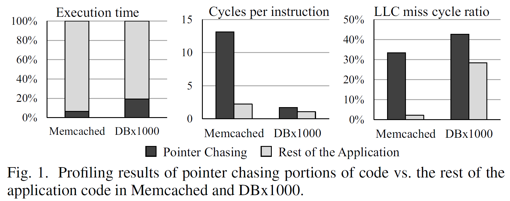
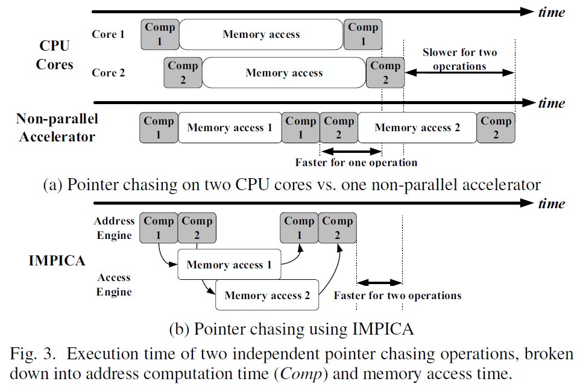

# Accelerating Pointer Chasing in 3D-Stacked Memory: Challenges, Mechanisms, Evaluation

## 论文介绍

这篇工作为ETH/CMU Onur Mutlu团队发表在2016年的ICCD上，主要内容为在内存中加速pointer chasing，一作为Kevin Hsieh(CMU)，通信作者为Onur Mutlu，开源代码链接：https://github.com/CMU-SAFARI/IMPICA

## Introduction

Linked data structures，such as trees, hash tables, and linked list are commonly used in many important applications.

**Examples:**

- Many databases use B/B+-tree to efficiently index large data sets
- Key-value stores use linked lists to handle collisions in hash tables
- Graph processing workloads use pointers to represent graph edges

**Feature:**

- These structures link nodes using pointers, where each node points to at least one other node by storing its address.
- Traversing the link requires serially accessing consecutive nodes by  retrieving the address(es) of the next node(s) from the pointer(s) stored in the current node.

**Observations:**

- Both Memcached and DBx1000 spend a significant fraction of their total execution time (7% and 19%, respectively) on pointer chasing;
- Pointer chasing is significantly more inefficient than the rest of the application, as it requires much higher cycles per instruction (6× in Memcached, and 1.6× in DBx1000);
- Pointer chasing is largely memory-bound, as it exhibits much higher cache miss rates than the rest of the application and as a result spends a much larger fraction of cycles waiting for LLC misses (16× in Memcached, and 1.5× in DBx1000).

**Inefficience factors of pointer chasing:**

- Dependencies exist between memory requests to the linked nodes, resulting in serialized memory accesses and limiting the available instruction-level and memory-level parallelism;
- Irregular allocation or rearrangement of the connected nodes leads to access pattern irregularity, causing frequent cache and TLB misses;
- Link traversals in data structures that diverge at each node frequently go down different paths during different iterations, resulting in little reuse, further limiting cache effectiveness.

**Ineffectiveness of prefetchers for linked data structures:**

- Data structures diverge at each node, leads to low prefetcher accuracy and low miss coverage;
- Aggressive prefetchers can consume too much of the limited off-chip memory bandwidth, thus slow down the system;
- Low generalization: A prefetcher that works well for some pointer-based data structure(s) and access patterns usually does not work efficiently for different data structures and/or access pattern.

**Goal of this paper:**

Perform pointer chasing inside main memory by leveraging PIM mechanisms, avoiding the need to move data to the CPU.

Advantages of PIM:

- Greatly reduces the latency of the operation, as an address does not need to be brought all the way into the CPU before it can be deferenced;
- Greatly reduces the reliance on caching and prefetching in the CPU.

**Remaining Challenges:**

**1. Parallelism**
  
  **Definition:** How to achieve high parallelism in the accelerator.
  The serialization problem can be exacerbated when the accelerator traverses multiple streams of links: while traditional O3 or multicore CPUs can service memory requests from multiple streams in parallel due to their ability to exploit high levels of ILP and memory-level parallelism, simple accelerators are unable to exploit such parallelism unless they are carefully designed.
  **Solution: address-access decoupling**
  The address generation computation for link traversal takes only a small fraction of the total traversal time, leaving the accelerator idle for a majority of the traversal time. IMPICA exploits the idle time by decoupling link address generation from the issuing and servicing of a memory request, which allows the accelerator to generate addresses for one link traversal stream while waiting on the request associated with a different link traversal stream to return from memory.
**2. Address translation**
   **Definition:** How to effectively perform virtual-to-physical address translation on the memory side without performing costly accesses to the CPU's memory management unit.
   **Solution 1: Duplicate the TLB and page walker within memory**
   Unrealistic for 3 reasons:

   - Coherence would have to be maintained between the CPU and memory-side TLBs, introducing extra complexity and off-chip requests;
   - The duplication is very costly in terms of hardware;
   - A memory module can be used in conjunction with many different processor architectures, which use different page table implementations and formats, and ensuring compatibility between the in-memory TLB/page walker and all of these designs is difficult.

   **Solution 2:**
   Allocating data structures accessed by IMPICA into contiguous regions within the virtual memory space, and designing a new translation mechanism, the region-based page table, which is optimized for in-memory acceleration.

## Details Solutions of Design Challenges

### Challenge 1: Parallelism in the Accelerator

### Challenge 2: Virtual Address Translation

## Interface Design

### 1. CPU Interface and Programming Model

**CPU Interface**

- Step 1: The CPU sends to memory a packet comprising the function call and parameters.
  
  - 这边先需要将所需信息，如operation(opcode)，operands(location)等，以包的形式写入到DRAM中，但是CPU的数据总线宽度只有64，因此CPU需要使用多条Store指令将包信息保存到连续的内存空间中，然后通过Cache和DRAM的接口将包通过Burst的形式发送到DRAM中。这边有个问题是：如何启动这个packet transfer?
  
- Step 2: This packet is written to a specific location in memory, which is memory mapped to the data RAM in IMPICA and triggers IMPICA execution.
  
  - 这边的意思是将包发送到DRAM接口，但是映射到了DRAM中的data RAM，而不是实际物理内存中。因此这个data RAM也应该是一段物理地址空间，跟外设一样在操作系统中需要定义，这个定义的具体实现为怎样？
  - IMPICA的Address Engine会持续检测data RAM，如果不为空则进行存内处理。
  
- Step 3: IMPICA loads the specific function into the inst RAM with approprite parameters, by reading the values from predefined memory location.
  
  从data RAM中提取opcode和operands，将其写入到inst RAM中，这其实就形成了指令队列，但是为什么不直接将data RAM当作指令队列呢？
  
- Step 4: Once IMPICA finishes the function execution, it writes the return value back to the memory-mapped locations and receives the IMPICA output. The CPU periodically polls these locations and receives the IMPICA output.

**Programming Model**

- An IMPICA program can be written as a function in the application code with a compiler directive.
- The compiler compiles these functions into IMPICA instructions and wraps the function calls with communication codes that utilize the CPU–IMPICA interface.

IMPICA 的编程模型类似于 CPU 编程模型。 可以使用编译器指令将 IMPICA 程序编写为应用程序代码中的函数。 编译器将这些函数编译为 IMPICA 指令，并使用利用 CPU-IMPICA 接口的通信代码包装函数调用。