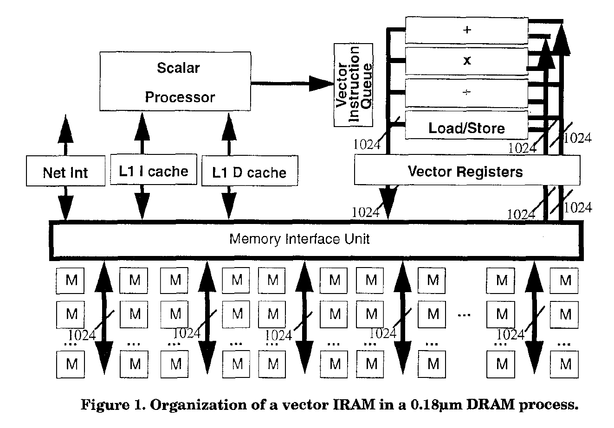

# Intelligent RAM (IRAM): Chips that Remember and Compute

这篇工作为UC Berkeley Kathy Yelick团队发表在1997年的ISSCC上，主要内容为提出基于DRAM的存算存算一体（unifying logic and memory），一作为David Patterson	，通信作者为Kathy Yelick，开源代码链接：无

将半导体行业划分为微处理器和内存阵营提供了许多优势：

- 生产线可以根据设备进行定制
- 封装可以根据设备的引脚和功率进行定制
- 计算机中的存储芯片数量与处理器的数量无关

同时存在劣势：

> While microprocessors have been improving performance by 60% per year, DRAM access time has been improving by 7% per year. This processor-memory performance gap limits many applications. For example, one microprocessor spends 75% of its time in the memory hierarchy for data base and matrix computations. There delays occur despite tremendous resources being spent trying to bridge this gap. Tabel 1 shows that up to 60% of the area and 90% of the transistors of recent microprocessors are dedicated to the growing "memory gap penalty": on-chip memory latency-hiding hardware such as caches.

这边作者还提出了一个观点：最小内存容量的增长率是DRAM增长率的一半，从1986年到1997年，最小内存的DRAM数量从32个1Mb变为今天的2个64Mb。大容量的DRAM会带来难以忍受的延迟，因此客户不会主动去接收大容量内存。

接下来，作者认为可以统一logic和memory，称为IRAM。这样做可能有以下优势：

- Lower memory latency (0.1x)
- Higher memory bandwidth (100x)
- Low system power
- Adjustable memory width and size
- Less board space

个人认为主要还是将逻辑电路做到了memory附近，降低了访存延迟和功耗，因此memory的尺寸限制就没有那么严重。

同时存在以下挑战：

- 给定处理器的高芯片良率无法通过冗余修复
- 给定处理器的高retention rate通常需要比DRAM更高的功率 <fotn color=red>暂时无法理解
- 在DRAM工艺中逻辑处理器速度较慢

这篇论文基于Alpha 21164的数据做了一个性能的评估，没有阐述评估细节，在此不赘述。

最后，这篇论文还提出了另一种加速模式，无Cache的向量加速，如Figure 1所示。