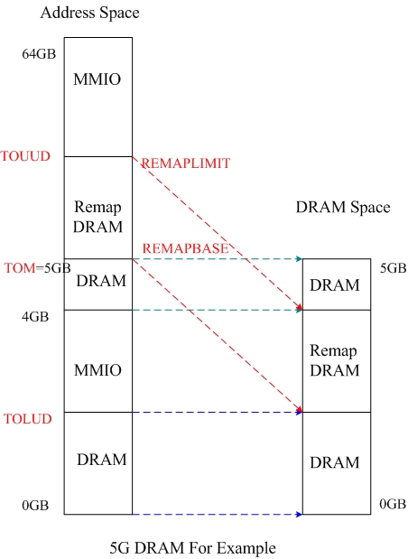
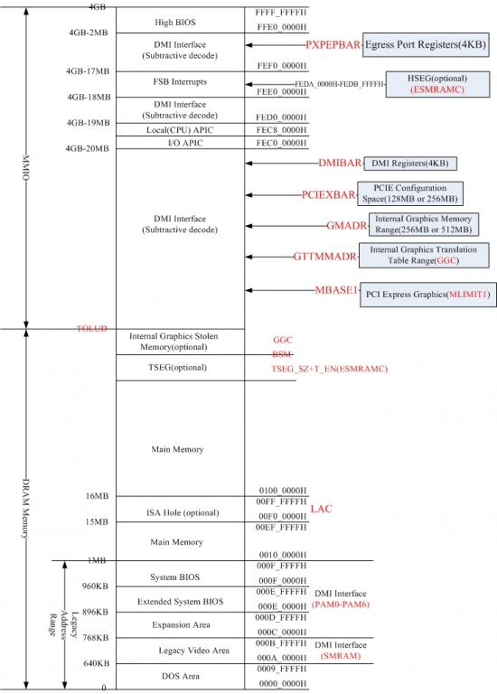
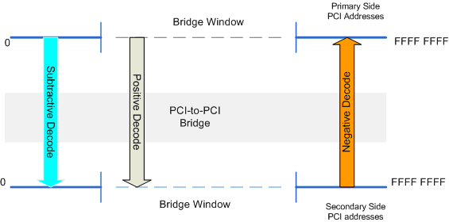

# Intel CPU 地址空间总结

## 一、地址空间映射

这里要说的是Intel构架下的CPU地址空间布局，注意这里没有说是内存地址空间布局。

我们说的内存通常是指DRAM，DRAM相对于CPU也可以算是外部设备，CPU地址空间是CPU访问外部设备过程中的一个概念，CPU除了访问DRAM外还会访问许多其他的设备。可以粗略的认为CPU地址空间包含DRAM地址空间，但两者却是不同的概念。而且DRAM地址空间是<font color=red>由内存控制器直接访问的，由CPU间接访问的。</font>

过去很长一段时间Intel CPU是32位的，也就是可以访问到4GB的地址空间，但是当时的DRAM通常也就是512MB到2GB之间，现在假设DRAM是1GB，那么就是3GB的地址空间是空的。在计算机里面，地址也是资源。这空的地址空间就用来访问外部设备IO所用，这部分被称为MMIO（Memory Mapped I/O)。MMIO的空间是很大的，它包含了PCI的配置空间(256MB或者更大)，内置集成显存(256MB,或者更大)，还有其他很多东西 。所以这部分的大小是不容忽视的。

现在的Intel CPU一般都是36位的，也就是可以访问到64GB。而DRAM也是越来越大，以至于DRAM加上MMIO的空间超出了4GB，而MMIO的空间是不能随意变更的。所以现在的做法就是将DRAM的一部分重映射到4GB以上的空间，下面就以DRAM有5GB为情况，做一个例子。请看下图



上图中左边是地址空间，右边是DRAM空间，其中红色的字体表示寄存器，可以在spec中找到该寄存器的说明，这几个寄存器决定了整个地址空间的大的格局。这里就简要说明一下。

<font color=red>TOLUD</font>，指向32位地址，也就是4GB以内。它是一个分界线，在0-TOLUD之间为DRAM，TOLUD-4GB之间为MMIO空间。该值由BIOS指定。为了方便说明，假设TOLUD被指定为2GB。

<font color=red>TOM</font>，目前还不明确，我猜想应该是指实际物理内存的大小，“the total amount of populated physical memory”，比如上图TOM为5GB。可在本机的BDFR(0,0,0,A0)验证。

<font color=red>REMAPBASE和REMAPLIMIT</font>，也是36位，分别表示基址和上限地址。用于重映射DRAM中被MMIO遮住的一部分空间，有2GB。该图中将DRAM中遮住的部分重映射到TOM的上方，所以REMAPBASE为5GB，REMAPLIMIT为7GB-1。
<font color=red>TOUUD</font>，36位地址，大小为REMAPLIMIT+1的位置，比如上图TOUUD应该在7GB的位置，可以和TOLUD做对比理解，TOLUD是4GB以内DRAM与MMIO的分界线，TOUUD可以理解为4GB-64GB之间DRAM与MMIO的分界线。

以上是假设DRAM超出4GB的情况，假如DRAM只有3GB，而TOLUD指定为2GB呢？也就是2GB-3GB的DRAM被遮住。这时也是通过REMAPBASE和REMAPLIMIT将之重定向到4GB的上方。再假设DRAM只有2GB，TOLUD为2GB呢？这时就不存在重映射。 REMAPLIMIT小于REMAPBASE时(通常REMAPLIMIT为0)，表示不使用重映射。

关于4GB以上的空间是如何访问的，请查看该网页说明：http://en.wikipedia.org/wiki/Physical_Address_Extension

## 二、地址空间布局

这里着重说明4GB以下的地址空间的布局情况。下面是我用visio画的布局图，其实也就是将spec里说明的布局情况全部综合到一张图上，这也是前段时间总结出来的核心部分。



同样的图中红色字体部分为寄存器，这些寄存器与地址空间布局有着密切的关系。这些寄存器的详细说明可以参考spec。比如说“Egress Port Registers”这个4KB的窗口，会根据EPBAR的设置被放置到MMIO的任意一个DMI Interface的位置，但让该窗口不能与其他任何窗口重叠。

另外我也将我所了解的情况说明一下。

1.先看TOLUD-4GB的位置，可以看到有几处都是DMI Interface(Subtractive Decode)。DMI是南桥与北桥的接口，访问DMI，也就是访问南桥。

另外要解释的是Substactive decode，在计算机中地址译码有三种形式，当主设备通过指定地址访问总线上的从设备，一个是Positive decode，有从设备解码后发现是访问自己的，于是它就会响应，否则就没有从设备响应；一个是Negative decode，从设备收到该地址经解码后发现不属于自己的地址范围，从设备就转发出去；一个是Subtractive decode，在4个时钟周期内没有从设备响应，该地址就会发送到扩展的总线上面解码。


引自：http://www.microsoft.com/whdc/system/bus/pci/default.mspx

DMI Interface(Subtractive Decode)的意思就是CPU发送一地址先到北桥上解码，如果该地址没有北桥上的设备占用，那么就用该地址就会被传送到南桥上解码，，也就是访问南桥上的设备。可以假想为一开始4GB空间都是DMI Interface（Subtractive Decode），然后0-TOLUD被DRAM声明占用，TOLUD-4GB也纷纷被各种设备占用，于是就剩下了支离破碎的几个DMI Interface。(目前看上去这样理解是通顺的，但我希望它也是正确的)。

2.再来说明一下High BIOS。BIOS固件地址分三段，这里的High BIOS，后面的System BIOS，还有后面的Extended System BIOS。spec中已经说明，计算机启动后一开始执行的指令就在High BIOS中。然而High BIOS在4GB的位置，计算机reset后进入的是实模式。Intel构架下一开始段地址隐藏的高位部分全部为1，所以尽管第一条指令的逻辑地址是F000:FFF0，但访问的物理地址是FFFF_FFF0，这个地址比4G少16字节，因此，BIOS一般在此处只放置一条跳转指令，远跳转或近跳转，在EFI BIOS中，正是通过一条近跳转让BIOS不用进入实模式，直接建立描述符表，最终进入Flat Mode（属于保护模式）。关键的地方在于地址空间中640KB-1MB（PAM0-PAM6）之间是可编程的，可以指定为只读、只写、读写、禁用，这些都是针对DRAM的。开机之后这段空间是被禁用的，而DRAM是北桥的设备，禁用DRAM，那么这段地址空间就是发送到南桥去解码（对照上面关于DMI Interface的说明来解释），结果就解码到了High BIOS对应的固件上面。所以终究还是在High BIOS中执行指令。

可以用RW验证将PAM0(PCI 0/0/0 90H)的bit[5:4]设置为00，那么就发现， 0F0000-0FFFFF之间的数据与FFFF_0000-FFFF_FFFF之间的数据竟然是一样的。也证明在DRAM禁用的情况下，两部分地址是被解码到同一个地方的。

假如PAM0被设为只读或者读写，则读取的是DRAM上的信息，数据内容是System Bios。为什么System Bios明明在固件中却跑到DRAM中来呢？shadow的时候，只是北桥在负责地址decode，把这段地址指向了rom而不是把rom里面的数据copy到了DRAM里面。这是概念上的问题。实际上，BIOS在做的时候一般都是先把rom里面的数据copy到低端内存，（0~640K）中的某一个或者两个段里面，然后再解压缩出来的数据分别放到对应的segment里面去。比如E000,F000等。然后再把整个map关掉。让地址decode的时候对应的是实际的DRAM而不是ROM了。

 

3.接着说一下PCI配置空间。可以看到它的基址是由PCIEXBAR决定的，用RW软件验证PCI数据可以用Memory的方式看到。各个PCI的地址空间可以用这个式子计算：PCI Express Base Address + Bus Number x 1 MB +Device Number x 32 kB + Function Number x4 kB。打一个比方，我的电脑的PCIEXBAR中看到基址为F400_0000，当我要访问bus(0)device(1F)function(3)时，通过计算可以得到地址为F40F_B000，于是从PCI 0/1F/3中看到的数据与从Memory的F40F_B000位置看到的数据是一样的。注意查看的时候要将PCIEXBAR的bit0置1。

```
PCIEXBAR—PCI Express Register Range Base Address
B/D/F/Type: 0/0/0/PCI
Address Offset: 60-67h
Default Value: 00000000E0000000h
Access: RO, R/W/L, R/W/L/K
Size: 64 bits
```
 

4.要说明的大概就这些，其他的各种地址窗口的作用、地址空间的位置，都可以在spec中很轻易地找到。而且图中也标注了各个区间有关的寄存器。

> 文章转载自：http://www.biosren.com/viewthread.php?tid=3200&extra=&ordertype=1&page=1