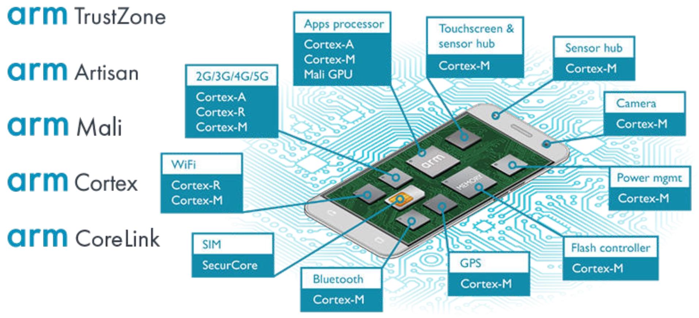
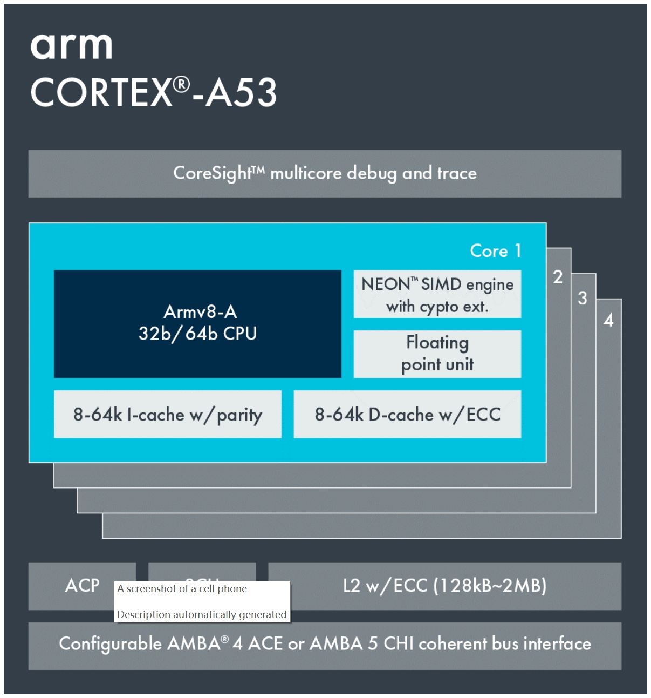
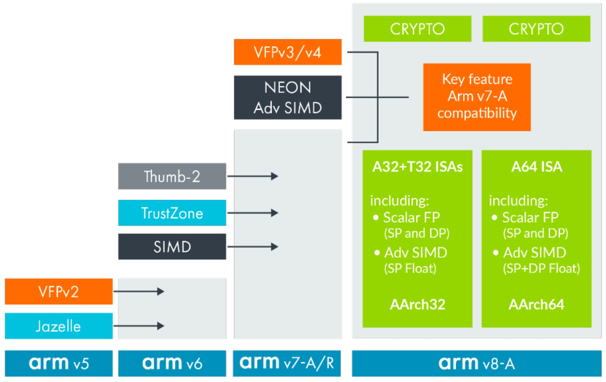
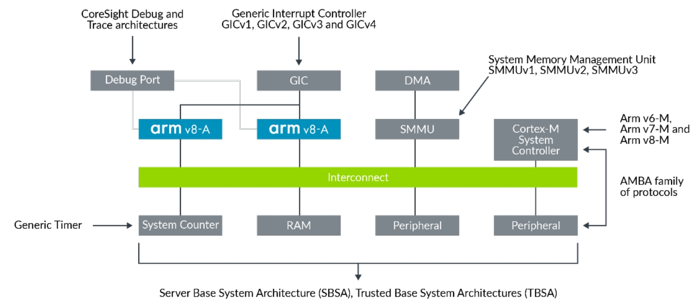
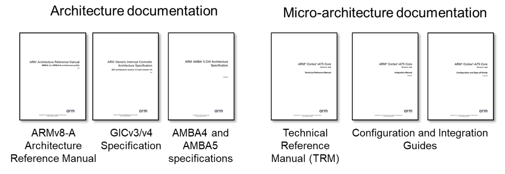
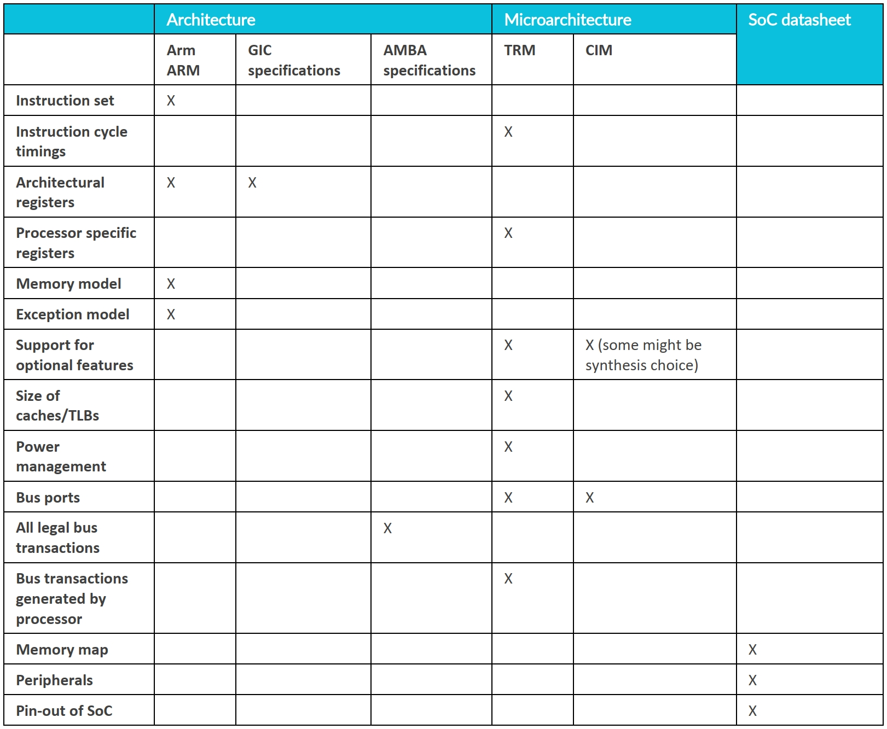

# Introducing the Arm architecture [翻译]

<!-- TOC -->

- [Introducing the Arm architecture [翻译]](#introducing-the-arm-architecture-翻译)
	- [1. Overview](#1-overview)
	- [2. About the Arm architecture](#2-about-the-arm-architecture)
	- [3. What do we mean by architecture?](#3-what-do-we-mean-by-architecture)
	- [4. Architecture and micro-architecture](#4-architecture-and-micro-architecture)
	- [5. Arm架构的开发](#5-arm架构的开发)
	- [6. Other Arm architectures](#6-other-arm-architectures)
	- [7. Understanding Arm documentation](#7-understanding-arm-documentation)
		- [7.1 Where is the documentation?](#71-where-is-the-documentation)
		- [7.2. Which document describes what?](#72-which-document-describes-what)
		- [7.3. So, what does this mean for me?](#73-so-what-does-this-mean-for-me)
		- [7.4. What information will I find in each document?](#74-what-information-will-i-find-in-each-document)
		- [7.5. Differences between reference manuals and user guides](#75-differences-between-reference-manuals-and-user-guides)
	- [8. Common architecture terms](#8-common-architecture-terms)

<!-- /TOC -->

## 1. Overview

Arm 架构为处理器或内核的设计提供了基础，我们将其称为处理元素 (PE)。

Arm 架构用于一系列技术，集成到片上系统 (SoC) 设备中，例如智能手机、微型计算机、嵌入式设备，甚至服务器。

该架构为软件开发人员公开了通用指令集和工作流程，也称为程序员模型。 这有助于确保架构不同实现之间的互操作性，以便软件可以在不同的 Arm 设备上运行。

本指南为对它感兴趣的任何人介绍了 Arm 架构。 不需要 Arm 架构的先验知识，但假设对处理器和编程及其术语有一般的熟悉。

在本指南的最后，您可以检查您的知识。 您将了解 Arm 架构的不同配置文件，以及某些功能是特定于架构还是特定于微架构。 文档包含 Cortex-A55 微架构指南，旨在帮助优化软件。

## 2. About the Arm architecture

Arm 架构是当今世界上最受欢迎的处理器架构之一，每年有数十亿基于 Arm 的设备出货。

共有三种架构配置文件：A、R 和 M。

| A-profile (Applications)                                              	| R-profile (Real-time)                                                  	| M-profile (Microcontroller)                                    	|
|-----------------------------------------------------------------------	|------------------------------------------------------------------------	|----------------------------------------------------------------	|
| High performanc                                                       	| Targeted at systems with real-time requirements.                       	| Smallest/lowest power. Small, high power efficient devices. 	|
| Designed to run a complex operating system, such as Linux or Windows. 	| Commmonly found in networking equipment, and embedded control systems. 	| Found at the heart of many IoT devices.                        	|

这三个配置文件允许 Arm 架构根据不同用例的需求进行定制，同时仍然共享几个基本功能。

注意：Arm Cortex 是用于 Arm 处理器 IP 产品的品牌名称。 我们的合作伙伴提供使用 Arm 架构的其他处理器品牌。

## 3. What do we mean by architecture?

当我们使用术语架构时，我们指的是功能规范。 在 Arm 架构的情况下，我们指的是处理器的功能规范。 体系结构指定了处理器的行为方式，例如它具有哪些指令以及指令的作用。

您可以将架构视为硬件和软件之间的契约。 该架构描述了软件可以依赖硬件提供的功能。 有些功能是可选的，我们将在稍后的微架构部分讨论。

该架构规定：

|                             	|                                                                                                                                   	|
|-----------------------------	|-----------------------------------------------------------------------------------------------------------------------------------	|
| Instruction set             	| 1. The function of each instruction 2. How that instruction is represented in memory (its encoding).                           	|
| Register set                	| 1. How many registers there are. 2. The size of the registers. 3. The function of the registers. 4. Their initial state. 	|
| Exception model             	| 1. The different levels of privilege. 2. The types of exceptions. 3. What happens on taking or returning from an exception. 	|
| Memory model                	| 1. How memory accesses are ordered. 2. How the caches behave, when and how software must perform explicit maintenance.         	|
| Debug, trace, and profiling 	| 1. How breakpoints are set and triggered. 2. What informantion can be captured by trace tools and in what format.              	|

## 4. Architecture and micro-architecture

架构不会告诉您处理器是如何构建和工作的。 处理器的构建和设计被称为微架构。 微体系结构告诉您处理器的工作原理。

微架构包括以下内容：

- Pipeline length and layout.
- Number and sizes of caches.
- Cycle counts for individual instructions.
- Which optional features are implemented.

例如，Cortex-A53 和 Cortex-A72 都是 Armv8-A 架构的实现。 这意味着它们具有相同的架构，但它们具有非常不同的微架构，如下图所示：

| Target   	| Optimized for power efficiency                                                    	| Optimized for performance                                                          	|
|----------	|-----------------------------------------------------------------------------------	|------------------------------------------------------------------------------------	|
| Pipeline 	| 8 stages In-order                                                              	| 15+ stages Out-of-order                                                         	|
| Caches   	| L1 I cache: 8KB - 64KB L1 D cache: 8KB - 64KB L2 cache: optional, up to 2MB 	| L1 I cache: 48KB fixed L1 D cache: 48KB fixed L2 cache: mandatory, up to 2MB 	|

符合架构的软件无需修改即可在 Cortex-A53 或 Cortex-A72 上运行，因为它们都实现了相同的架构。

## 5. Arm架构的开发

Arm 架构是随着时间的推移而开发的，每个版本都建立在之前的基础上。

您通常会看到这种架构被称为：

> Armv8-A

这意味着架构的第 8 版，适用于 A-Profile。

或者，简而言之：

> V8-A

这张图展示了从版本 5 到版本 8 的 Arm 架构的发展，以及每次添加的新功能。 在本指南中，我们将只关注 Armv8-A。

Armv8-A 是 Arm 的一个重要里程碑。 直到并包括 Armv7-A/R，Arm 架构都是 32 位架构。 Armv8-A 是 64 位架构，尽管它仍然支持 32 位执行以提供对旧软件（例如 v7、v6 和 v5）的向后兼容性。

我们不会在这里讨论图中列出的所有功能，但我们将在后面的主题中介绍它们。

## 6. Other Arm architectures

Arm 架构是最著名的 Arm 规范，但它并不是唯一的规范。 Arm 对构成现代片上系统 (SoC) 的许多组件具有类似的规范。 此图提供了一些示例：

- Generic Interrupt Controller

通用中断控制器 (GIC) 规范是用于 Armv7-A/R 和 Armv8-A/R 的标准化中断控制器。

- System Memory Management Unit

系统内存管理单元（SMMU 或有时是 IOMMU）为非处理器主机提供翻译服务。

- Generic Timer

通用定时器为系统中的所有处理器提供了一个公共参考系统计数。 它们提供计时器功能，用于诸如操作系统的调度程序滴答之类的事情。 通用定时器是 Arm 架构的一部分，但系统计数器是一个系统组件。

- Server Base System Architecture and Trusted Base System Architecture

服务器基础系统架构 (SBSA) 和可信基础系统架构 (TBSA) 为 SoC 开发人员提供系统设计指南。

- Advanced Microcontroller Bus Architecture

高级微控制器总线架构 (AMBA) 总线协议系列控制基于 Arm 的系统中组件的连接方式以及这些连接上的协议。

## 7. Understanding Arm documentation

Arm 为开发人员提供了大量文档。 我们将解释在哪里可以找到用于在 Arm 上进行开发的文档和其他信息。

### 7.1 Where is the documentation?

[Arm 开发人员网站](https://developer.arm.com/) - 您可以在此处下载 Arm 架构和处理器手册。

在 [Arm 社区](https://community.arm.com/)，您可以提出开发问题，并从 Arm 专家那里找到有关特定主题的文章和博客。

### 7.2. Which document describes what?

- 每个 Arm 架构参考手册 (Arm ARM) 都描述了一个架构规范。 Arm ARM 与该架构的任何实现相关。
- 每个 Arm Cortex 处理器都有一份技术参考手册 (TRM)。 TRM 描述了特定于该处理器的功能。 通常，TRM 不会重复 Arm ARM 中给出的任何信息。
- 每个 Arm Cortex 处理器还有一个配置或集成手册 (CIM)。 CIM 描述了如何将处理器集成到系统中。 通常，此信息仅与 SoC 设计人员相关。

注意：CIM 仅对 IP 被许可人可用。 TRM 无需许可即可从 developer.arm.com 下载。

### 7.3. So, what does this mean for me?

如果您正在寻找有关特定处理器的信息，您可能需要参考多个不同的文档。 在这里，我们可以看到您可能需要与 Cortex-A75 处理器一起使用的不同文档。

Cortex-A75 实现了 ARMv8.2-A、GICv4 CPU 接口和 AMBA 总线接口，因此您需要为每个元素参考单独的文档。 另外，您需要参考详细介绍微架构的文档。

如果您正在使用现有的 SoC，您还将使用 SoC 制造商提供的文档。 该文档通常称为数据表。 数据表提供了特定于该 SoC 的信息。

### 7.4. What information will I find in each document?

### 7.5. Differences between reference manuals and user guides

到目前为止，我们查看的文档 Arm ARM、TRM 和 CIM 是参考手册。 这意味着它们不提供有关如何使用处理器的指导。 例如，Arm ARM 没有关于如何打开 MMU 的部分。

这种结构是经过深思熟虑的，旨在在架构要求的技术细节（可在参考手册中找到）与提供更一般指导的文档（例如本指南）之间保持清晰的界限。 一些通用指导文件将介绍概念，而另一些则为您提供可遵循的说明。

## 8. Common architecture terms

该体系结构使用了许多术语，通常在文档中用小写字母书写，它们具有非常具体的含义。 虽然 Arm 架构参考手册 (Arm ARM) 提供了每个术语的完整定义，但在这里我们将了解最常见的术语及其对程序员的意义。

**PE Processing Element**

处理元件 (PE) 是 Arm 架构实现的通用术语。 您可以将 PE 视为具有自己的程序计数器并可以执行程序的任何东西。 例如，Arm ARM 声明：

决定 PE 运行方式的状态，包括当前的异常级别和安全状态，以及在 AArch32 状态下的 PE 模式。

手册使用通用术语 PE，因为有许多不同的潜在微架构。 例如，Arm Cortex-A 处理器中可以使用以下微架构：

- Cortex-A8 is a single core, single-thread processor. The entire processor is a PE.
- Cortex-A53 is a multi-core processor, each core is a single thread. Each core is a PE.
- Cortex-A65AE is a multi-core processor, each core has two threads. Each thread is a PE.

通过使用术语 PE，体系结构与在不同处理器中做出的特定设计决策是分开的。

**IMPLEMENTATION DEFINED**

IMPLEMENTATION DEFINED（简称IMP DEF）的特性是由特定的微架构定义的。 实现必须呈现一致的行为/价值。

例如，缓存的大小是 IMP DEF。 该架构为软件提供了一种定义的机制来查询缓存大小，但缓存的大小取决于处理器设计者。

同样，对加密指令的支持是 IMP DEF。 同样，有寄存器允许软件确定指令是否存在。

在这两个示例中，选择都是静态的。 也就是说，给定的处理器要么支持，要么不支持这些特性和指令。 该功能的存在不能在运行时改变。

对于 Cortex-A 处理器，一些 IMP DEF 选择将是固定的，而一些将是综合选项。 例如，在 Cortex-A57 上，L1 缓存的大小是固定的，而 L2 缓存的大小是一个综合选项。 但是，关于 L2 缓存大小的决定是在设计时做出的。 它在运行时仍然是静态的。

IMP DEF 选项的完整详细信息将记录在 TRM 中。

**UNPREDICTABLE and CONSTRAINED UNPREDICTABLE**

UNPREDICTABLE 和 CONSTRAINED UNPREDICTABLE 用于描述软件不应该做的事情。

当某些事情不可预测或受约束不可预测时，软件不能依赖处理器的行为。 如果软件多次执行错误操作，处理器也可能表现出不同的行为。

例如，提供未对齐的转换表是受约束的不可预测的。 这代表不良软件。 坏软件是违反转换表应遵守的架构规则的软件。

与 IMP DEF 行为不同，TRM 通常不会描述所有不可预测的行为。

**DEPRECATED**

有时，我们会从架构中删除一个功能。 可能发生的原因有多种，例如性能或因为该功能不再常用且没有必要。 但是，可能仍然存在一些依赖该功能的遗留软件。 因此，在完全删除功能之前，我们首先将其标记为 DEPRECATED。 例如，Arm ARM 声明：

出于性能原因，不推荐使用 IT 指令以及使用 CP15DMB、CP15DSB 和 CP151SB 屏障指令。

DEPRECATED 是对开发人员的警告，即某个功能将在将来被删除，并且他们应该开始从他们的代码中删除它。

通常，同时将一个控件添加到架构中，从而允许禁用该功能。 此控件允许开发人员测试该功能在遗留代码中的使用。

**RES0/RES1 Reserved, should be Zero/Reserved, should be One**

Reserved, should be Zero/Reserved, should be One (RES0/RES1) 用于描述一个未使用且对处理器没有功能影响的字段。

保留字段可能会在架构的某个未来版本中使用。 在这种情况下，RES0/RES1 字段值为 1 将提供新行为。

RES0 字段不会总是读为 0，而 RES1 字段可能不会总是读为 1。RES0/1 只会告诉您该字段未使用。

有时 RES0/RES1 字段必须是有状态的。 有状态意味着字段读回最后写入的值。