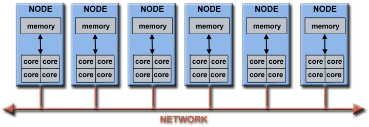

# Introduction to Parallel Computing Tutorial

## Abstract

This is the first tutorial in the "Livermore Computing Getting Started" workshop. It is intended to provide only a brief overview of the extensive and broad topic of Parallel Computing, as a lead-in for the tutorials that follow it. As such, it covers just the very basics of parallel computing, and is intended for someone who is just becoming acquainted with the subject and who is planning to attend one or more of the other tutorials in this workshop. It is not intended to cover Parallel Programming in depth, as this would require significantly more time. The tutorial begins with a discussion on parallel computing - what it is and how it's used, followed by a discussion on concepts and terminology associated with parallel computing. The topics of parallel memory architectures and programming models are then explored. These topics are followed by a series of practical discussions on a number of the complex issues related to designing and running parallel programs. The tutorial concludes with several examples of how to parallelize several simple problems. References are included for further self-study. 

## Overview

### What is Parallel Computing?

**Serial Computing**

Traditionally, software has been written for **serial** computation:

- A problem is broken into a discrete series of instructions
- Instructions are executed sequentially one after another
- Executed on a single processor
- Only one instruction may execute at any moment in time

For example:

**Parallel Computing**

In the simplest sense, parallel computing is the simultaneous use of multiple compute resources to solve a computational problem:

- A problem is broken into discrete parts that can be solved concurrently
- Each part is further broken down to a series of instructions
- Instructions from each part execute simultaneously on different processors
- An overall control/coordination mechanism is employed

For example:

- The computational problem should be able to:
  - Be broken apart into discrete pieces of work that can be solved simultaneously;
  - Execute multiple program instructions at any moment in time;
  - Be solved in less time with multiple compute resources than with a single compute resource.
- The compute resources are typically:
  - A single computer with multiple processors/cores
  - An arbitrary number of such computers connected by a network

**Parallel Computers**

- Virtually all stand-alone computers today are parallel from a hardware perspective:
  - Multiple functional units (L1 cache, L2 cache, branch, prefetch, decode, floating-point, graphics processing (GPU), integer, etc.)
  - Multiple execution units/cores
  - Multiple hardware threads

IBM BG/Q Compute Chip with 18 cores (PU) and 16 L2 Cache units (L2)

- Networks connect multiple stand-alone computers (nodes) to make larger parallel computer clusters.

- For example, the schematic below shows a typical LLNL parallel computer cluster:
  - Each compute node is a multi-processor parallel computer in itself
  - Multiple compute nodes are networked together with an Infiniband network
  - Special purpose nodes, also multi-processor, are used for other purposes

- The majority of the world's large parallel computers (supercomputers) are clusters of hardware produced by a handful of (mostly) well known vendors.

### Why Use Parallel Computing?

**The Real World is Massively Complex**

- In the natural world, many complex, interrelated events are happening at the same time, yet within a temporal sequence.
- Compared to serial computing, parallel computing is much better suited for modeling, simulating and understanding complex, real world phenomena.
- For example, imagine modeling these serially:

**Main Reasons for Using Parallel Programming**

- SAVE TIME AND/OR MONEY
  - In theory, throwing more resources at a task will shorten its time to completion, with potential cost savings.
  - Parallel computers can be built from cheap, commodity components.
- SOLVE LARGER / MORE COMPLEX PROBLEMS
  - Many problems are so large and/or complex that it is impractical or impossible to solve them using a serial program, especially given limited computer memory.
  - Example: "Grand Challenge Problems" (en.wikipedia.org/wiki/Grand_Challenge) requiring petaflops and petabytes of computing resources.
  - Example: Web search engines/databases processing millions of transactions every second

- PROVIDE CONCURRENCY
  - A single compute resource can only do one thing at a time. Multiple compute resources can do many things simultaneously.
  - Example: Collaborative Networks provide a global venue where people from around the world can meet and conduct work "virtually".

- TAKE ADVANTAGE OF NON-LOCAL RESOURCES
  - Using compute resources on a wide area network, or even the Internet when local compute resources are scarce or insufficient.
  - Example: SETI@home (setiathome.berkeley.edu) has over 1.7 million users in nearly every country in the world. (May, 2018).

- MAKE BETTER USE OF UNDERLYING PARALLEL HARDWARE
  - Modern computers, even laptops, are parallel in architecture with multiple processors/cores.
  - Parallel software is specifically intended for parallel hardware with multiple cores, threads, etc.
  - In most cases, serial programs run on modern computers "waste" potential computing power.

**The Future**

- During the past 20+ years, the trends indicated by ever faster networks, distributed systems, and multi-processor computer architectures (even at the desktop level) clearly show that **parallelism is the future of computing**.
- In this same time period, there has been a greater than 500,000x increase in supercomputer performance, with no end currently in sight.
- **The race is already on for Exascale Computing - we are entering Exascale era**
  - Exaflop = 1018 calculations per second
  - US DOE Exascale Computing Project: https://www.exascaleproject.org

Source: [Top500.org](https://www.top500.org/)

### Who is Using Parallel Computing?

**Science and Engineering**

