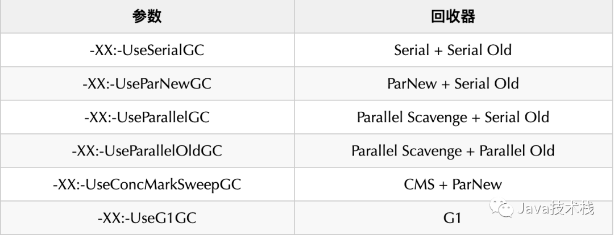

查询JDK8默认使用的垃圾收集器命令：

```shell {.line-numbers}
java -XX:+PrintCommandLineFlags -version

-XX:InitialHeapSize=266390080 -XX:MaxHeapSize=4262241280 -XX:+PrintCommandLineFlags 
-XX:+UseCompressedClassPointers -XX:+UseCompressedOops 
-XX:-UseLargePagesIndividualAllocation -XX:+UseParallelGC
java version "1.8.0_191"
Java(TM) SE Runtime Environment (build 1.8.0_191-b12)
Java HotSpot(TM) 64-Bit Server VM (build 25.191-b12, mixed mode)
```

UseParallelGC 即 Parallel Scavenge + Parallel Old,再查看详细信息

```shell {.line-numbers}
java -XX:+PrintGCDetails -version

java version "1.8.0_191"
Java(TM) SE Runtime Environment (build 1.8.0_191-b12)
Java HotSpot(TM) 64-Bit Server VM (build 25.191-b12, mixed mode)
Heap
 	PSYoungGen      total 76288K, used 2621K [0x000000076b500000, 0x0000000770a00000, 0x00000007c0000000)
  					eden space 65536K, 4% used [0x000000076b500000,0x000000076b78f748,0x000000076f500000)
  					from space 10752K, 0% used [0x000000076ff80000,0x000000076ff80000,0x0000000770a00000)
  					to   space 10752K, 0% used [0x000000076f500000,0x000000076f500000,0x000000076ff80000)
	ParOldGen       total 175104K, used 0K [0x00000006c1e00000, 0x00000006cc900000, 0x000000076b500000)
  					object space 175104K, 0% used [0x00000006c1e00000,0x00000006c1e00000,0x00000006cc900000)
 	Metaspace       used 2291K, capacity 4480K, committed 4480K, reserved 1056768K
  					class space    used 254K, capacity 384K, committed 384K, reserved 1048576K
```

那么这里再详细科普一下，下面是每个参数对应的回收器的类型：



可以使用ManagementFactory.getGarbageCollectorMXBeans()把具体的回收器打印出来，详细代码如下：

```java {.line-numbers}
import java.lang.management.GarbageCollectorMXBean;
import java.lang.management.ManagementFactory;
import java.util.List;
public class GcCollectorPrinter {
    public static void main(String[] args) {
        List<GarbageCollectorMXBean> beans = ManagementFactory.getGarbageCollectorMXBeans();
        for (GarbageCollectorMXBean bean : beans) {
            System.out.println(bean.getName());
        }
    }
}
```

直接运行输出内容如下：

```shell {.line-numbers}
PS Scavenge
PS MarkSweep
```

上图中有点问题，结论如下，详细探究可查看[研究了 2 天，终于知道 JDK 8 默认 GC 收集器了！](https://blog.csdn.net/youanyyou/article/details/106464291)

- PS MarkSweep只是回收器的别名，他可以指代Serial Old和Parallel Old
- -XX:+UseParallelGC和-XX:+UseParallelOldGC结果一样，都是用的Parallel Old

## References

- https://blog.csdn.net/huanxianglove/article/details/90247994
- https://blog.csdn.net/youanyyou/article/details/106464291