伴随 Java 版本的更新，垃圾收集器（GC，Garbage Collection）也在不断迭代优化。从经典的 Serial，到划时代的并发收集器 CMS、再到全新思路设计的 G1、以及最新的低延迟收集器 Shenandoah、ZGC。虽然垃圾收集器的技术在不断进步，但没有最好的收集器，只有更合适的收集器。

## 垃圾收集器图谱

HotSpot 虚拟机的垃圾收集器图谱
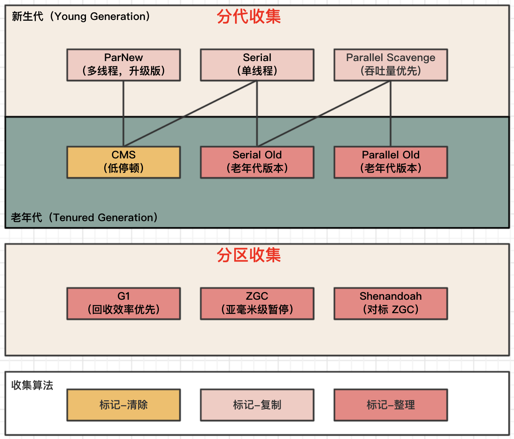

## 并行和并发

并行和并发都是并发编程中的专业名词，在谈论垃圾收集器的语境中，它们可以理解为：

- 并行（Parallel）
  并行描述的是 多条垃圾收集器线程 之间的关系。说明同一时间有多条垃圾收集器线程在工作，此时用户线程默认是处于等待状态。
- 并发（Concurrent）
  并发描述的是 垃圾收集器线程与用户线程 之间的关系。说明同一时间垃圾收集器线程与用户线程都在运行。

## 分代收集

### Serial

Serial 收集器是最基础、历史最悠久的收集器，曾经是 HotSpot 虚拟机新生代收集器的唯一选择（JDK 1.3.1 之前）。**当它进行垃圾收集时，必须暂停其他所有工作线程，直到它收集结束。**

> 它是 HotSpot 虚拟机 客户端模式 下的默认新生代收集器。优点就是简单而高效（与其他收集器的单线程相比），适用于内存资源受限的环境。

64 位操作系统默认是 Server 模式。

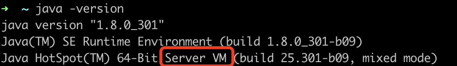

### Serial Old

Serial Old 是 Serial 收集器的老年代版本，同样是一个单线程收集器。

> 它是客户端模式下的老年代收集器。在服务端模式下有两种用途：一种是在 JDK 5 及之前的版本中与 Parallel Scavenge 收集器配合使用；另一种就是在 CMS 收集器发生 Concurrent Mode Failure 时使用（处理浮动垃圾和内存碎片）。

Stop The World 这个词听起来很酷，它是由虚拟机在后台自动发起的，**是在用户不可知、不可控的情况下把用户正常工作的线程全部停掉**，这对很多应用来说都是不能接受的。

### ParNew

ParNew **实质上是 Serial 收集器的多线程并行版本**。除了同时使用多条线程进行垃圾收集之外，其余行为都与 Serial 收集器完全一致。

> ParNew 与 Serial 相比并没有太多创新之处，但它却是许多运行在服务端模式下的 HotSpot 虚拟机（尤其是 JDK 7 之前）首选的新生代收集器。其中一个很重要的原因是：除了 Serial 收集器之外，只有它能与 CMS 收集器配合工作。

### CMS

CMS（Concurrent Mark Sweep）是一种 **以获取最短回收停顿时间为目标** 的收集器。

> 在 JDK 5 发布时，HotSpot 虚拟机推出了一款在强交互应用中具有划时代意义的垃圾收集器——CMS 收集器。这款收集器是 HotSpot 中第一款真正意义上支持并发的垃圾收集器，它首次实现了让垃圾收集线程与用户线程（基本上）同时工作。

### Parallel Scavenge

Parallel Scavenge 也是一款新生代收集器，同样支持并行收集。与另一个并行收集器 ParNew 相比，**Parallel Scavenge 关注的是吞吐量（Throughput）**。

$$吞吐量=\frac{运行用户代码时间}{运行用户代码时间+运行垃圾收集时间}$$

控制吞吐量的参数：

- -XX:MaxGCPauseMillis 控制最大垃圾收集停顿时间。
- -XX:GCTimeRatio 设置吞吐量大小，大于 0 小于 100 的整数。

### Parallel Old

Parallel Old 是 Parallel Scavenge 收集器的老年代版本，**支持多线程并发收集**。

> 这个收集器是直到 JDK 6 时才提供的，在此之前，新生代的 Parallel Scavenge 收集器一直处于相当尴尬的地位。原因是如果新生代选择了 Parallel Scavenge 收集器，老年代除了 Serial Old 收集器以外别无选择，表现良好的老年代收集器 CMS 无法与它配合工作。又由于老年代 Serial Old 收集器在服务端应用性能上的拖累，使用 Parallel Scavenge 收集器未必能在整体上获得吞吐量最大化的效果。

## 分区收集

### Garbage First

Garbage First（简称 G1）收集器是垃圾收集器技术发展历史上的里程碑式的成果，它开创了收集器 **面向局部收集的设计思路** 和 **基于 Region 的内存布局形式**。

> G1 不再坚持固定大小以及固定数量的分代区域划分，而是把连续的 Java 堆划分为多个大小相等的独立区域（Region），每一个 Region 都可以根据需要，扮演新生代的 Eden 空间、Survivor 空间，或者老年代空间。Region 中还有一类特殊的 Humongous 区域，专门用来存储大对象。

控制 Region 大小的参数：

- -XX:G1HeapRegionSize 取值范围为 1MB～32MB，且应为 2 的 N 次幂。

G1 收集器 Regin 分区示意图
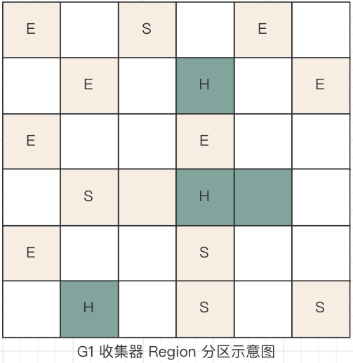

> 在 G1 收集器出现之前的所有收集器（包括 CMS 在内），垃圾收集的目标范围要么是整个新生代（Minor GC），要么是整个老年代（Major GC），再要么就是整个 Java 堆（Full GC）。而 G1 跳出了这个樊笼，它可以面向堆内存任何部分来组成回收集（Collection Set），衡量标准不再是它属于哪个分代，而是哪块内存中存放的垃圾数量最多，回收收益最大，**优先处理回收收益最大的那些 Region，这也就是 Garbage First 名字的由来**。

### Shenandoah

Shenandoah 是一款只有 OpenJDK 才会包含，而 OracleJDK 里反而不存在的收集器。Shenandoah 收集器的目标之一是 暂停时间与堆大小无关，并且经过优化，中断时间不会超过几毫秒。

> 最初 Shenandoah 是由 RedHat 公司独立发展的新型收集器项目，在 2014 年 RedHat 把 Shenandoah 贡献给了 OpenJDK。Shenandoah 作为第一款不由 Oracle（包括以前的 Sun）公司的虚拟机团队领导开发的 HotSpot 垃圾收集器，不可避免地会受到一些来自官方的排挤。

### ZGC

ZGC 和 Shenandoah 的目标是高度相似的。ZGC 希望在 对吞吐量影响不太大的前提下（与使用 G1 相比，应用程序吞吐量减少不超过 15%），实现 **任意堆内存大小下都可以把垃圾收集的停顿时间限制在十毫秒以内**。

> ZGC 是一款在 JDK 11 中加入的具有实验性质的低延迟垃圾收集器。如果说 RedHat 公司开发的 Shenandoah 像是 G1 收集器的实际继承者的话，那 Oracle 公司开发的 ZGC 就更像是 Azul System 公司独步天下的 PGC（Pauseless GC）和 C4（Concurrent Continuously Compacting Collector）收集器的同胞兄弟。

开启 ZGC 收集器：

- -XX:+UseZGC JDK 17 的默认收集器为 G1，需要手动开启 ZGC。

## 默认垃圾收集器

**各 JDK 版本默认 GC**

- JDK 7，默认是 Parallel Scavenge + Serial Old。
- JDK 8 及 JDK 7u40 之后的版本，默认是 Parallel Scavenge + Parallel Old。
- JDK 9 到 JDK 17，默认是 G1。

用 Java -XX:+PrintCommandLineFlags -version 命令可以查看默认收集器。
jdk7_25
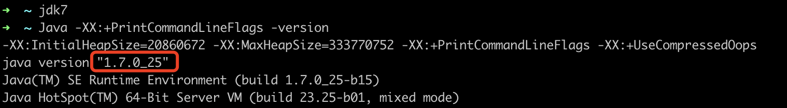

jdk7_40
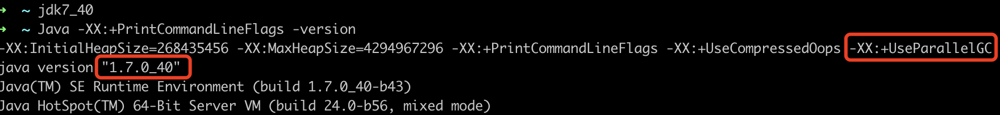

jdk8
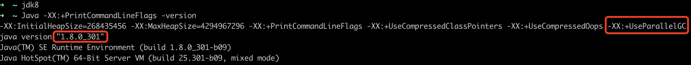

jdk9
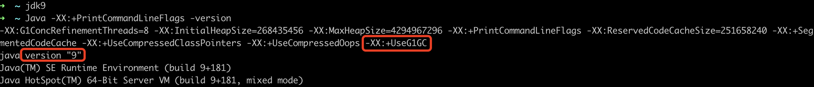

jdk17
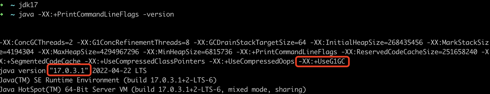

## 为什么 CMS 从来没有成为默认收集器

因为 CMS 并不是一个非常成功的 GC 策略：

- CMS 在垃圾清除阶段是使用并发清除的，如果处理器核数不高的情况下，垃圾回收会造成很高的负载。
- CMS 仅针对老年代，还需要一个年轻代的收集器。CMS 又和 Parallel Scavenge 不兼容，只能和 ParNew 凑合，然而 ParNew 又不如 Parallel Scavenge 先进。
- CMS 需要调整的参数太多，比 G1 要多一倍。
- Mark-Sweep 算法对内存碎片无能为力，当内存碎片太多，触发了 Concurrent Mode Failure 还得去请 Serial Old 来收拾烂摊子。

以上的种种，造成的结果就是 ParNew + CMS + Serial Old 的组合工作起来其实并不稳定。为了得到 CMS 那一点好处，需要付出很多的代价（包括 JVM 调参）。

> CMS 比 G1 早不了多少。CMS 从 JDK 5 开始加入，6 成熟；而 G1 是 7 加入，8 成熟，9 正式成为默认 GC 策略。此时 CMS 就被标记为 Deprecated，随后在 JDK 14 中被移除。

CMS 的杯具之处在于，**它相比前辈们，没有带来革命性的改变；而它的后辈们比它强太多。**它自身的实现又很复杂，兼容性又差，调参也很麻烦，所以无法成为默认 GC 方案了。

## Java 17 的 GC 改进

**自 Java 8 以来，Java 17 中所有的收集器都有所改进。**为了更好地显示进度，下面的比较使用了归一化分数，而不是查看原始分数（基于 16GB 内存测试）。

吞吐量
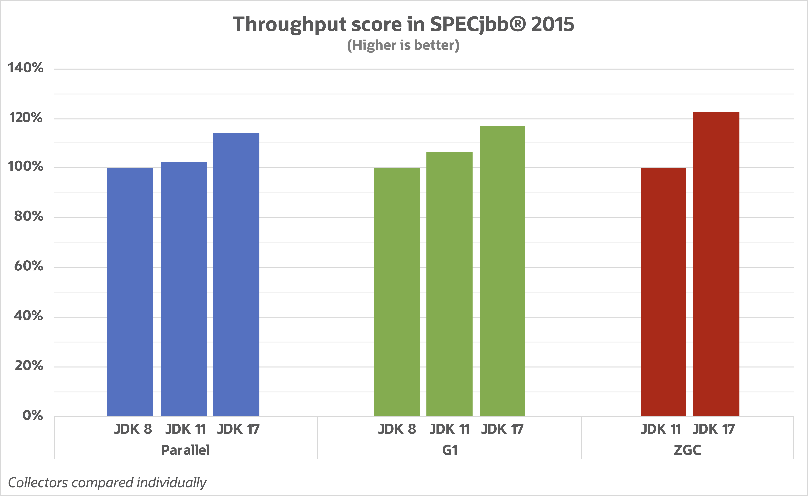

所有收集器的吞吐量指标与旧版本相比都有显著改善，其中 ZGC 进步最大。

延迟
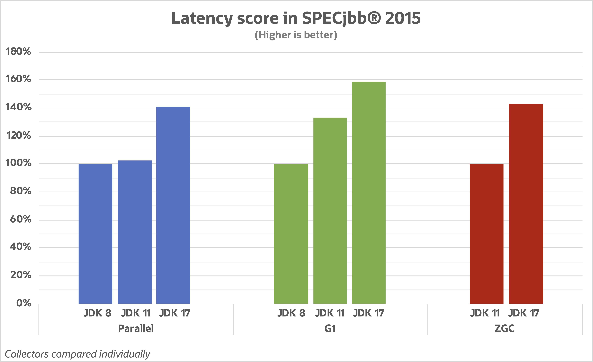

所有收集器的延迟指标改善的更多，其中 G1 进步最大。

p99 暂停时间
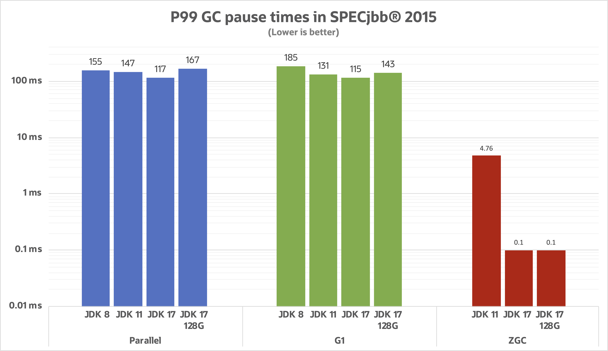

- JDK 17 中的 ZGC 远低于其亚毫秒（<1ms）暂停时间的目标。
  - ZGC 被设计为具有不随堆大小缩放的暂停时间，图中清楚地看到当堆扩大到 128 GB 时就是这种情况。
- G1 的目标是在延迟和吞吐量之间保持平衡，保持远低于 200 毫秒的默认暂停时间目标。
  - 从暂停时间的角度来看，G1 比 Parallel 更好地处理更大的堆。

峰值内存开销
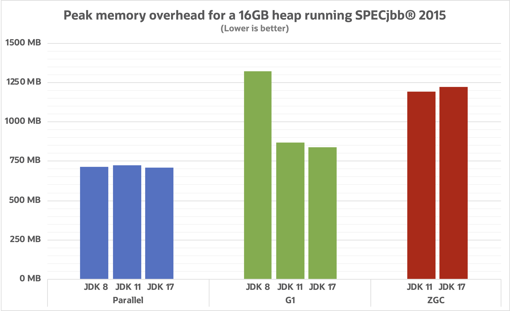

- Parallel 和 ZGC 的峰值内存开销都非常稳定。
- G1 在这方面进步很大，主要原因是减少了 记忆集的内存消耗。

## 小结

**相比旧版本 JDK 中的收集器，JDK 17 的整体性能明显更好。** 如果你正在使用 JDK 8 并计划升级，现在是重新评估要使用哪个 GC 的好时机。在 JDK 8 中，Parallel 是默认收集器，但在 JDK 9 中改为 G1。从那时起，G1 的改进速度快于 Parallel，但仍有一些场景 Parallel 才是最佳选择。而随着 ZGC（JDK 15 正式发布）的成熟，我们可以考虑第三种高性能替代方案。

## 引用

- [《深入理解 Java 虚拟机第三版》](https://gitlab.com/ronglexie/java-books-collections/-/blob/master/%E6%B7%B1%E5%85%A5%E7%90%86%E8%A7%A3Java%E8%99%9A%E6%8B%9F%E6%9C%BA%EF%BC%9AJVM%E9%AB%98%E7%BA%A7%E7%89%B9%E6%80%A7%E4%B8%8E%E6%9C%80%E4%BD%B3%E5%AE%9E%E8%B7%B5%EF%BC%88%E7%AC%AC3%E7%89%88%EF%BC%89%E5%91%A8%E5%BF%97%E6%98%8E.pdf)
- [GC progress from JDK 8 to JDK 17](https://kstefanj.github.io/2021/11/24/gc-progress-8-17.html)
- [盘点Java中的那些常用的Garbage Collector](https://ost.51cto.com/posts/3824)
