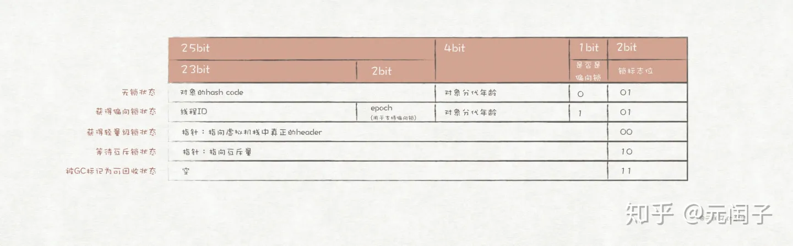

## 前言

谈起Java对象，笔者的第一反应是在：**Java中的每一个对象（不包括基础类型）都继承于Object对象。** 相信这也是大多数程序员对Java对象的初次印象，Object可以表示所有的Java对象。但是，这种理解仅仅是停留在语言层面，至于更深的JVM层面，对象还是用Object来表示吗？显然不是。JVM通常使用非Java语言实现，是用来解析并运行Java程序的，它有自己的模型来表示Java语言的各种特性，包括Object。下面我们以HotSpot为例，一起来探讨Java对象在JVM层面的Java对象模型。

> HotSpot采用C++语言实现，下文中的JVM如无特殊说明，指的都是HotSpot。

Java程序通过`new`操作符来创建一个对象，在深入探讨HotSpot的Java对象模型前，我们先看下`new`操作符的具体实现。

```c++ {.line-numbers}
// hotspot/src/share/vm/interpreter/interpreterRuntime.cpp
...
// HotSpot中new操作符的实现函数
IRT_ENTRY(void, InterpreterRuntime::_new(JavaThread* thread, ConstantPool* pool, int index))
  Klass* k_oop = pool->klass_at(index, CHECK);
  instanceKlassHandle klass (THREAD, k_oop);
  // Make sure we are not instantiating an abstract klass
  klass->check_valid_for_instantiation(true, CHECK);
  // Make sure klass is initialized
  klass->initialize(CHECK);
  // At this point the class may not be fully initialized
  // ...
  oop obj = klass->allocate_instance(CHECK);
  thread->set_vm_result(obj);
IRT_END
...
```

上述代码片段来自HotSpot源码中`new`操作符的实现函数，先不深入分析每一行的具体含义，这段代码给我们最直观的功能就是：**先对klass对象进行初始化工作，然后再用它来创建出oop对象。** 到这里我们大致就能猜出，oop表示的就是一个Java对象。而这里的klass和Java中的Class之间似乎有着紧密的联系，一是两者的名字非常类似，另外也可通过第16行代码得到进一步的肯定。对Java的反射机制稍微有所了解的人，看着第16行代码一定很熟悉，因为它与使用Class.newInstance()方法来创建Object对象很类似。

实际正如上述所猜测，HotSpot使用Oop-Klass模型来表示Java的对象。

## Oop的继承体系

这里的`Oop`并非是Object-oriented programming，而是**Ordinary object pointer（普通对象指针）**，是HotSpot用来表示Java对象的实例信息的一个体系。其中oop是Oop体系中的最高父类，整个继承体系如下所示：

```c++ {.line-numbers}
// hotspot/src/share/vm/oops/oopsHierarchy.hpp
...
// Oop的继承体系
typedef class oopDesc*                            oop;
typedef class   instanceOopDesc*            instanceOop;
typedef class   arrayOopDesc*                    arraysOop;
typedef class     objArrayOopDesc*            objArrayOop;
typedef class     typeArrayOopDesc*            typeArrayOop;
...
```


每个Java对象都有它独有的生命周期，我们使用`new`操作符将它创建出来，然后对它执行各式各样的操作（如获取成员属性、调用成员函数、加锁等），最后被GC回收掉。那么Java对象的这一系列经历，JVM又是怎么实现的呢？JVM使用Oop来表示一个Java对象，自然地，这些经历都会跟`oop`有关。

`oop`的子类有两个，分别是`instanceOop`和`arrayOop`。前者表示Java中普通的对象，后者则表示数组对象。`arrayOop`也有两个子类，`objArrayOop`表示普通对象类型的数组，而`typeArrayOopDesc`则表示基础类型的数组。如下图所示，`oop`的存储结构主要由对象头和对象体组成。


## oop对象头

`oop`主要有两个成员属性：

```c++ {.line-numbers}
// hotspot/src/share/vm/oops/oop.hpp
class oopDesc {
 ...
 private:
  // 用于存储对象的运行时记录信息，如哈希值、GC分代年龄、锁状态等
  volatile markOop  _mark;
  // Klass指针的联合体，指向当前对象所属的Klass对象
  union _metadata {
    // 未采用指针压缩技术时使用
    Klass*      _klass;
    // 采用指针压缩技术时使用
    narrowKlass _compressed_klass;
  } _metadata;
 ...
}
```

`_mark`和`_metadata`被称为对象头，其中前者存储对象的运行时记录信息；后者是一个指针，指向当前对象所属的Klass对象。

> 因为某些历史原因，HotSpot把markOop放到Oop体系里，但是它并继承oop，因此前文所描述的Oop体系并没有包含它。

`markOop`的存储结构在32位和64位系统中有所差异，但是具体存储的信息是一样的，本节只介绍它在32位系统中的存储结构。在32位系统中，`markOop`一共占32位，存储结构如图下所示：



从图中可知，诸如对象hash值、线程ID、分代年龄等信息都是存储在`markOop`中，而且在不同的状态下，其结构也是略有不同。**无锁**指一个对象没有被加锁时的状态；**偏向锁**，顾名思义会偏向于第一个访问锁的线程，当同步锁只有一个线程访问时，JVM会将其优化为偏向锁，此时就相当于没有同步语义；当发生多线程竞争时，偏向锁就会膨胀为**轻量级锁**，后者采用CAS（Compare And Swap）实现，避免了用户态和内核态之间的切换；如果某个线程获取轻量级锁失败，该锁就会继续膨胀为**重量级锁**，此时JVM会向操作系统申请互斥量，因此性能消耗也是最高的。

`oop`提供4个方法来判断当前对象处于何种状态下：

```c++ {.line-numbers}
// hotspot/src/share/vm/oops/oop.hpp
class oopDesc {
 ...   
  bool is_locked()   const;
  bool is_unlocked() const;
  bool has_bias_pattern() const;
 ...
  bool is_gc_marked() const;
}
// hotspot/src/share/vm/oops/oop.inline.hpp
...
inline bool oopDesc::is_gc_marked() const {
  return mark()->is_marked();
}
inline bool oopDesc::is_locked() const {
  return mark()->is_locked();
}
inline bool oopDesc::is_unlocked() const {
  return mark()->is_unlocked();
}
inline bool oopDesc::has_bias_pattern() const {
  return mark()->has_bias_pattern();
}
...
```

从上述代码可知，`oop`调用`markOop`的方法来判断当前对象是否已经加锁、是否是偏向锁，`markOop`则通过判断其存储结构中的标志位来实现，如下列代码所示：

```c++ {.line-numbers}
// hotspot/src/share/vm/oops/markOop.hpp
...
class markOopDesc: public oopDesc {
  ...
  // unlocked_value = 1
  // lock_mask_in_place = right_n_bits(2)，is_locked()利用存储结构的最右边两位
  // 来判断当前对象是否是加锁状态。值得注意的是，偏向锁并不属于加锁状态。
  bool is_locked()   const {
    return (mask_bits(value(), lock_mask_in_place) != unlocked_value);
  }
  // lock_mask_in_place = right_n_bits(3)，is_unlocked()并不是简单地对is_locked()
  // 的结果取反，而是使用存储结构的最右边三位来判断。值得注意的是，偏向锁也并不属于无锁状态。
  bool is_unlocked() const {
    return (mask_bits(value(), biased_lock_mask_in_place) == unlocked_value);
  }
  // marked_value = 3
  // lock_mask_in_place = right_n_bits(2)，当锁标志位的值为3（二进制为11）时返回true。
  bool is_marked()   const {
    return (mask_bits(value(), lock_mask_in_place) == marked_value);
  }
  // biased_lock_pattern = 5
  // biased_lock_mask_in_place = right_n_bits(3)，当存储结构的最后三位的值为5（二进制
  // 为101）时返回true
  bool has_bias_pattern() const {
    return (mask_bits(value(), biased_lock_mask_in_place) == biased_lock_pattern);
  }
  ...
}
```

## oop对象体

JVM将Java对象的field存储在`oop`的**对象体**中，`oop`提供了一系列的方法来获取和设置field，并且针对每种基础类型都提供了特有的实现。

```c++ {.line-numbers}
// hotspot/src/share/vm/oops/oop.hpp
class oopDesc {
 ... 
  // 返回成员属性的地址
  void*     field_base(int offset)        const;
  // 如果成员是基础类型，则用特有的方法
  jbyte*    byte_field_addr(int offset)   const;
  jchar*    char_field_addr(int offset)   const;
  jboolean* bool_field_addr(int offset)   const;
  jint*     int_field_addr(int offset)    const;
  jshort*   short_field_addr(int offset)  const;
  jlong*    long_field_addr(int offset)   const;
  jfloat*   float_field_addr(int offset)  const;
  jdouble*  double_field_addr(int offset) const;
  Metadata** metadata_field_addr(int offset) const;
  // 同样是成员的地址获取方法，在GC时使用
  template <class T> T* obj_field_addr(int offset) const;   
 ...
  // instanceOop获取和设置其成员属性的方法
  oop obj_field(int offset) const;
  volatile oop obj_field_volatile(int offset) const;
  void obj_field_put(int offset, oop value);
  void obj_field_put_raw(int offset, oop value);
  void obj_field_put_volatile(int offset, oop value);
  // 如果成员时基础类型，则使用其特有的方法，这里只列出针对byte类型的方法
  jbyte byte_field(int offset) const;
  void byte_field_put(int offset, jbyte contents);
 ...
}
```

具体实现如下列代码所示：

```c++ {.line-numbers}
// hotspot/src/share/vm/oops/oop.inline.hpp
...
// 获取对象中field的地址
inline void* oopDesc::field_base(int offset) const { 
  return (void*)&((char*)this)[offset];
}
// 获取普通对象field的地址，对调用field_base的结果进行转型得到
template <class T> inline T* oopDesc::obj_field_addr(int offset) const {
  return (T*)field_base(offset); 
}
// 基础类型特有的实现与obj_field_addr类似，只是转型成特有的基础类型指针
inline jbyte* oopDesc::byte_field_addr(int offset) const {
  return (jbyte*)   field_base(offset); 
}
...
// 获取field前需要先判断是否采用了指针压缩技术，先根据offset调用obj_field_addr
// 得到field的地址，然后调用load_decode_heap_oop得到实例
inline oop oopDesc::obj_field(int offset) const {
  return UseCompressedOops ?
    load_decode_heap_oop(obj_field_addr<narrowOop>(offset)) :
    load_decode_heap_oop(obj_field_addr<oop>(offset));
}
// 直接对指针解引用得到field
inline oop oopDesc::load_decode_heap_oop(oop* p) { 
  return *p; 
}
...
// 设置field前需要先判断是否采用了指针压缩技术，同样也是先根据offset得到地址，
// 然后在设置field的值
inline void oopDesc::obj_field_put(int offset, oop value) {
  UseCompressedOops ? 
    oop_store(obj_field_addr<narrowOop>(offset), value) :
    oop_store(obj_field_addr<oop>(offset),       value);
}
// 设置field前先更新barrier
template <class T> inline void oop_store(T* p, oop v) {
  if (always_do_update_barrier) {
    oop_store((volatile T*)p, v);
  } else {
    update_barrier_set_pre(p, v);
    oopDesc::encode_store_heap_oop(p, v);
    update_barrier_set((void*)p, v);  
  }
}
// 设置field时直接更新指针指向的值
inline void oopDesc::encode_store_heap_oop(oop* p, oop v) {
  *p = v; 
}
```

由上述代码片段可知，每个field在oop中都有一个对应的偏移量（offset），oop通过该偏移量得到该field的地址，再根据地址得到具体数据。因此，Java对象中的field存储的并不是对象本身，而是对象的地址。


## 总结

HotSpot采用Oop-Klass模型来表示Java对象，其中Klass对应着Java对象的类型（Class），而Oop则对应着Java对象的实例（Instance）。Oop是一个继承体系，其中oop是体系中的最高父类，它的存储结构可以分成对象头和对象体。对象头存储的是对象的一些元数据，对象体存储的是具体的成员属性。值得注意的是，**如果成员属性属于普通对象类型，则oop只存储它的地址。**

我们都知道Java中的普通方法（没有static和final修饰）是动态绑定的，在C++中，动态绑定通过**虚函数**来实现，代价是每个C++对象都必须维护一张**虚函数表**。Java的特点就是一切皆是对象，如果每个对象都维护一张虚函数表，内存开销将会非常大。JVM对此做了优化，虚函数表不再由每个对象维护，改成由Class类型维护，所有属于该类型的对象共用一张虚函数表。因此我们并没有在oop上找到方法调用的相关逻辑，这部分的代码被放在了klass里面。

Klass相关的内容将会在下一篇文章《Java的对象模型——Oop-Klass（二）》中介绍。

> 本文转载自：https://zhuanlan.zhihu.com/p/104494807