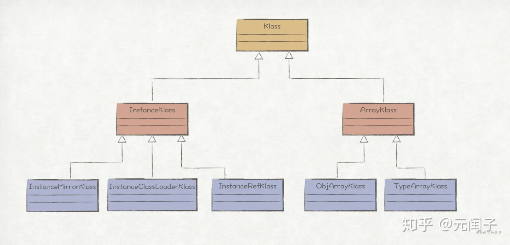
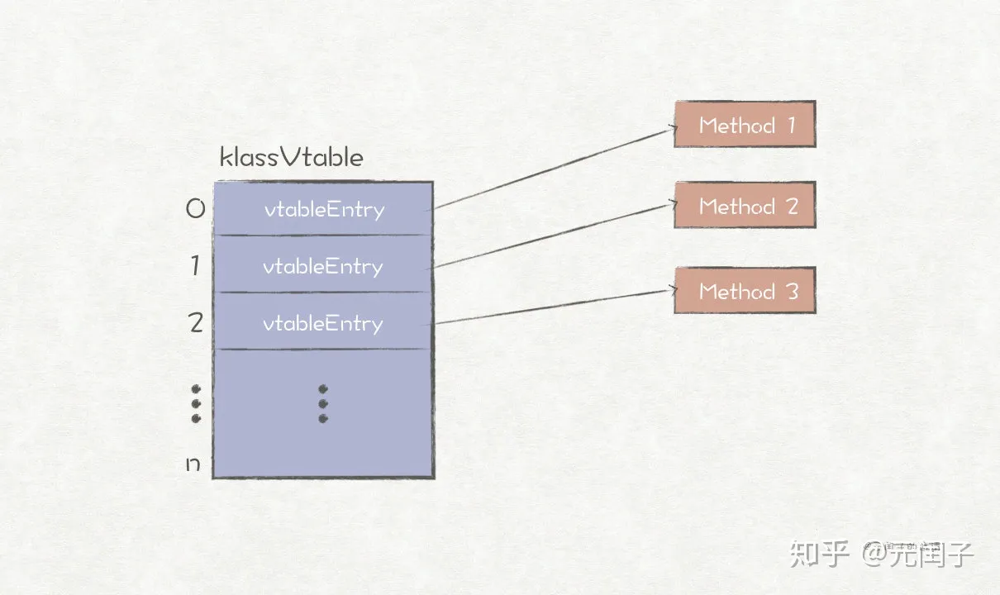
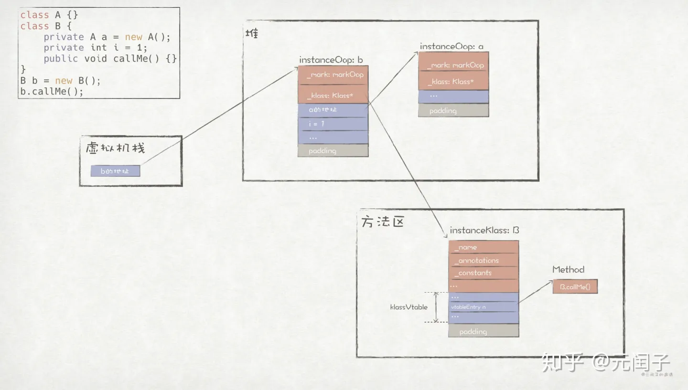

## 前言

在[《Java对象表示——Oop-Klass模型（一）》](https://zhuanlan.zhihu.com/p/104494807)一文的最后讲到，为了实现Java方法调用的动态绑定，HotSpot使用了与C++虚函数类似的机制，同时为了避免每个对象都维护一个虚函数表，于是就设计了**Klass**类。

如下为HotSpot源码中对Klass的功能介绍：

> A Klass provides:
> ​ 1: language level class object (method dictionary etc.)
> ​ 2: provide vm dispatch behavior for the object
> Both functions are combined into one C++ class.

可见，Klass主要提供了两个功能：

（1）**用于表示Java类**。Klass中保存了一个Java对象的类型信息，包括类名、限定符、常量池、方法字典等。一个class文件被JVM加载之后，就会被解析成一个Klass对象存储在内存中。

（2）**实现对象的虚分派**（virtual dispatch）。所谓的虚分派，是JVM用来实现多态的一种机制。

```c++ {.line-numbers}
class A {
    void callMe() {
      System.out.println("This is A.");
    }
}
class B extends A {
    @Override
    public void callMe() {
        System.out.println("This is B.");
    }
}
class C extends A {
    @Override
    public void callMe() {
        System.out.println("This is C.");
    }
}
public class VmDispatch {
    public static void main(String[] args) {
        A b = new B();
        A c = new C();
        // b和c的静态类型为A，那么JVM是如何将它们动态绑定到正确的实现上的呢？
        b.callMe();
        c.callMe();
    }
}
/* Output：
This is B.
This is C.
*/
```

考虑上述例子，基类A有两个子类，分别为B和C。在main函数中，b和c的静态类型都是A，但是在调用callMe()方法时，JVM会将它们绑定到正确的实现上。这其中奥秘就是JVM的虚分派机制，而该机制的实现用到了Klass中的**虚函数表**。

## Klass的继承体系

跟Oop一样，Klass也有一个继承体系，如下图所示：



```c++ {.line-numbers}
// hotspot/src/share/vm/oops/oopsHierarchy.hpp
...
class Klass;  // Klass继承体系的最高父类
class   InstanceKlass;  // 表示一个Java普通类，包含了一个类运行时的所有信息
class     InstanceMirrorKlass;  // 表示java.lang.Class
class     InstanceClassLoaderKlass; // 主要用于遍历ClassLoader继承体系
class     InstanceRefKlass;  // 表示java.lang.ref.Reference及其子类
class   ArrayKlass;  // 表示一个Java数组类
class     ObjArrayKlass;  // 普通对象的数组类
class     TypeArrayKlass;  // 基础类型的数组类
...
```

不同于Oop，Klass在`InstanceKlass`下又设计了3个子类，其中`InstanceMirrorKlass`用于表示`java.lang.Class`类型，该类型对应的oop特别之处在于其包含了`static field`，因此计算`oop`大小时需要把`static field`也考虑进来；`InstanceClassLoaderKlass`主要提供了遍历当前`ClassLoader`的继承体系；`InstanceRefKlass`用于表示`java.lang.ref.Reference`及其子类。

## 对象的类型信息

`Klass`的主要用途之一就是保存一个Java对象的类型信息，如下选出其中一些比较重要的field：

```c++ {.line-numbers}
// hotspot/src/share/vm/oops/klass.hpp
class Klass : public Metadata {
...
  // 类名，其中普通类名和数组类名略有不同
  // 普通类名如：java/lang/String，数组类名如：[Ljava/lang/String;
  Symbol*     _name;
  // 最后一个secondary supertype
  Klass*      _secondary_super_cache;
  // 保存所有secondary supertypes
  Array<Klass*>* _secondary_supers;
  // 保存所有primary supertypes的有序列表
  Klass*      _primary_supers[_primary_super_limit];
  // 当前类所属的java/lang/Class对象对应的oop
  oop       _java_mirror;
  // 当前类的直接父类
  Klass*      _super;
  // 第一个子类 (NULL if none); _subklass->next_sibling() 为下一个
  Klass*      _subklass;
  // 串联起当前类所有的子类
  Klass*      _next_sibling;
  // 串联起被同一个ClassLoader加载的所有类（包括当前类）
  Klass*      _next_link;
  // 对应用于加载当前类的java.lang.ClassLoader对象
  ClassLoaderData* _class_loader_data;
  // 提供访问当前类的限定符途径, 主要用于Class.getModifiers()方法.
  jint        _modifier_flags;
  // 访问限定符
  AccessFlags _access_flags;    
...
}
```

如上述代码片段所示，Klass继承了Metadata，后者为[《深入解析Java的运行时数据区》](https://zhuanlan.zhihu.com/p/102431019)一文中提到的“**元空间**”（Metaspace）的实现，这也意味着**Java对象的类型信息存储在方法区，而不是在堆中。**

primary supertype和secondary supertype主要用于快速类型检查（比如在调用instanceOf时能够快速得到结果），其中primary type和secondary type的定义出现在[《Fast subtype checking in the HotSpot JVM》](https://www.researchgate.net/publication/221552851_Fast_subtype_checking_in_the_HotSpot_JVM)一文中：

> A klass T is a primary type iff T is a proper class, or an array of a primary type, or an array of primitive values. Interfaces and arrays of interfaces are excluded.
> A klass T is a secondary type iff T is a interface or an array of a secondary type. Every type is either a primary type or a secondary type but not both.

接着，我们继续看下表示普通对象类型的InstanceKlass所包含的信息，它继承自Klass，在父类的基础上增加了不少信息，如下列出较为重要的一些：

```c++ {.line-numbers}
// hotspot/src/share/vm/oops/instanceKlass.hpp
class InstanceKlass: public Klass {
...
  // 当前类的状态
  enum ClassState {
    allocated,  // 已分配
    loaded,  // 已加载，并添加到类的继承体系中
    linked,  // 链接/验证完成
    being_initialized,  // 正在初始化
    fully_initialized,  // 初始化完成
    initialization_error  // 初始化失败
  };
  // 当前类的注解
  Annotations*    _annotations;
  // 当前类数组中持有的类型
  Klass*          _array_klasses;
  // 当前类的常量池
  ConstantPool* _constants;
  // 当前类的内部类信息
  Array<jushort>* _inner_classes;
  // 保存当前类的所有方法.
  Array<Method*>* _methods;
  // 如果当前类实现了接口，则保存该接口的default方法
  Array<Method*>* _default_methods;
  // 保存当前类所有方法的位置信息
  Array<int>*     _method_ordering;
  // 保存当前类所有default方法在虚函数表中的位置信息
  Array<int>*     _default_vtable_indices;
  // 保存当前类的field信息（包括static field），数组结构为：
  // f1: [access, name index, sig index, initial value index, low_offset, high_offset]
  // f2: [access, name index, sig index, initial value index, low_offset, high_offset]
  //      ...
  // fn: [access, name index, sig index, initial value index, low_offset, high_offset]
  //     [generic signature index]
  //     [generic signature index]
  //     ...
  Array<u2>*      _fields;
...
}
```

注意到，_fields中的每个元素都包含了当前field都偏移量信息，如前文《Java对象表示——Oop-Klass模型（一）》所提到，这些偏移量用于在oop中找到对应field的地址。

## 虚函数表（vtable）

**虚函数表**（vtable）主要是为了实现Java中的虚分派功能而存在。HotSpot把Java中的方法都抽象成了Method对象，InstanceKlass中的成员属性_methods就保存了当前类所有方法对应的Method实例。HotSpot并没有显式地把虚函数表设计为Klass的field，而是提供了一个虚函数表视图，并在类初始化时创建出来。


```c++ {.line-numbers}
// hotspot/src/share/vm/oops/instanceKlass.hpp
class InstanceKlass: public Klass {
...  
  // 返回一个新的vtable，在类初始化时创建
  klassVtable* vtable() const;
  inline Method* method_at_vtable(int index);
..
}
// 以下为方法对应实现
// hotspot/src/share/vm/oops/instanceKlass.cpp
...
// vtable()的实现
klassVtable* InstanceKlass::vtable() const {
  return new klassVtable(this, start_of_vtable(), vtable_length() / vtableEntry::size());
}
// method_at_vtable()的实现
inline Method* InstanceKlass::method_at_vtable(int index)  {
  ... // 校验逻辑
  vtableEntry* ve = (vtableEntry*)start_of_vtable();
  return ve[index].method();
}
```

一个klassVtable可看成是由多个vtableEntry组成的数组，其中每个元素vtableEntry里面都包含了一个方法的地址。在进行虚分派时，JVM会根据方法在klassVtable中的索引，找到对应的vtableEntry，进而得到方法的实际地址，最后根据该地址找到方法的字节码并执行。



## 总结

这两篇文章我们探讨了HotSpot的Oop-Klass对象模型，其中**Oop表示对象的实例，存储在堆中；Klass表示对象的类型，存储在方法区中。** 但这也只是讲述了Oop-Klass对象模型中最基础的部分，该模型所包含的内容还远不止这些，如果想要更加全面而深入地了解Oop-Klass对象模型，最好的方法是阅读HotSpot的源码。

最后，我们通过一张图来总结这两篇文章所讲述的内容：




> 本文转载自：https://zhuanlan.zhihu.com/p/104725313