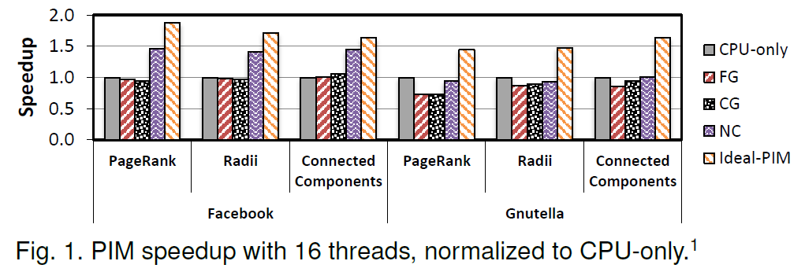
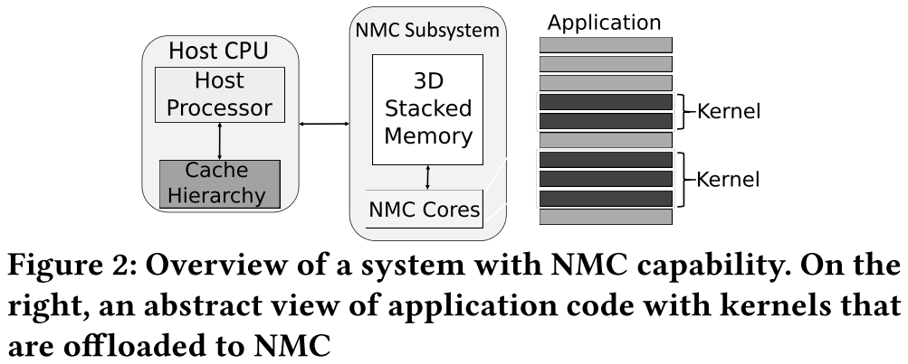
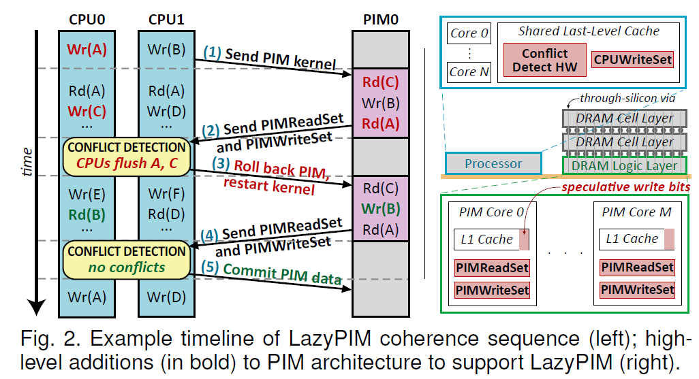

# LazyPIM: An Efficient Cache Coherence Mechanism for Processing-in-Memory

**Author List:**

- Amirali Boroumand1
- Saugata Ghose1
- Minesh Patel1
- Hasan Hassan1,3
- Brandon Lucia1
- Kevin Hsieh1
- Krishna T. Malladi2
- Hongzhong Zheng2
- Onur Mutlu1,4

> <1>: CMU
> <2>: Samsung
> <3>: TOBB ETU(TOBB经济技术大学，土耳其)
> <4>: ETH

**Publish Information**

IEEE COMPUTER ARCHITECTURE LETTERS, 2017

## 1. 问题定义

Cache coherence是PIM架构的主要系统挑战。如果PIM内核与处理器一致，则PIM编程模型仍然类似于传统的多线程编程，从而促进PIM的广泛采用。然而，PIM执行传统的coherence协议是不切实际的，因为这会迫使大量的coherence message穿过狭窄的片外总线，可能会抵消高带宽PIM执行的好处。

## 2. 研究现状

大多数先前的工作都假设PIM内核和应用程序的处理器线程之间的数据共享量有限：

- 限制PIM在不可缓存数据上执行 [1,9,35]
- 强制处理器内核刷新或不访问任何可能被PIM使用的数据 [2,9,10,11,26,27]

## 3. 关键问题/动机/目标

**Key observations**

- 应用程序的某些部分更适合在处理器线程中执行，并且这些部分通常与PIM内核并发访问相同的数据区域，从而导致重要的数据共享；
- Coherence处理不当会消除PIM的很大一部分性能优势。

**Motivation**

如果PIM内核参与传统的coherence，它必须在每次缓存未命中时通过窄总线向处理器发送消息（我们称之为PIM coherence traffic）。

具有细粒度coherence(FG)的PIM的性能总是比仅CPU执行差。

需要一个良好的一致性机制来确保程序的正确执行，同时保持PIM的优势。

> **Coarse-Grained Coherence:** Processor flush all of the dirty cache lines within the PIM data region every  time the PIM core acquires permissions, even if the PIM kernel may not access most of the data.
> **Coarse-Grained Locks:** Avoid ping-ponging between the processor and the PIM cores in coarse-grained coherence by having the PIM cores acquire exclusive access to a region for the duration of the PIM kernel. (Drawback: Causing unnecessary thread serialization between the processor and the PIM cores.)
> **Non-Cacheable PIM Data:** Making the PIM data region as non-cacheable in the processor, so that DRAM always contains up-to-date data.

**Goal**

为PIM架构提出一种cache coherence机制，其逻辑行为类似于传统coherence，但保留了PIM的所有优点。

## 4. 基线PIM架构

每个PIM内核都有私有的L1 I/D缓存，这些缓存使用DRAM逻辑层内的MESI目录保持一致。处理器中的第二个目录作为系统的主要一致性点，与处理器缓存和PIM一致性目录接口。

## 5. LazyPIM 机制

让PIM内核推测性地假设它们具有Coherence协议所需的权限，而无需在执行期间实际将片外消息发送到主（处理器）Coherence目录。相反，Coherence状态仅在PIM内核完成后更新，此时PIM内核将单个批处理Coherence消息（即，包含 PIM 内核读取或写入的所有地址的压缩签名）发送回处理器Coherence目录.该目录会检查是否发生了任何冲突。如果存在冲突，PIM内核会回滚其更改，冲刷的缓存行由处理器写回DRAM，然后内核重新执行。如果不存在冲突，则提交PIM内核中的推测数据，并更新处理器Coherence目录以反映PIM内核保存的数据。请注意，在LazyPIM中，处理器始终以非推测方式执行，从而确保对处理器设计的更改最小，从而更容易采纳PIM。

### 5.1 冲突

### 5.2 LazyPIM 架构支持

#### 5.2.1

首先，程序员使用两个宏（PIM_begin和PIM_end）选择要在PIM内核上执行的代码部分。编译器将宏转换为我们添加到ISA的指令，这些指令触发和结束PIM内核执行。其次，我们假设程序员或编译器可以标注所有PIM数据。该信息使用每页标志位保存在页表中。