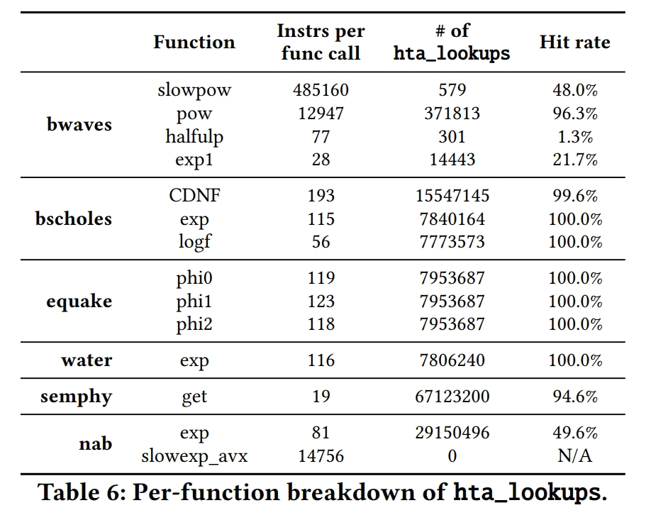

# Leveraging Caches to Accelerate Hash Tables and Memoization

## Introduction

哈希表在传统架构中存在两个关键的低效率问题：

1. 核心利用率低：每个哈希表操作都由一长串指令组成，用于计算哈希值、对键和值的内存访问以及比较。这些指令包括难以预测的、依赖于数据的分支，这些分支会增加浪费的周期，并导致限制指令级并行性的长延迟缓存未命中。
2. 空间局部性低：为了减少映射冲突，散列将键值对均匀地分布在散列表的分配内存中。当键值对混合重用时，这会导致空间局部性较差，因为经常访问的对的同一行邻居很少被访问。这浪费了很大一部分缓存容量。

本文思路：使用简单的 HTA 功能单元，这些指令比传统的哈希表操作消耗更少的流水线资源，从而可以利用更多的指令级和内存级并行性。 HTA 加速了大多数哈希表操作，将极少数情况留给了允许溢出到传统软件哈希表的软件路径。

## 背景介绍

哈希表是无序的关联容器。它们保存键值对并支持三种操作：查找以检索与特定键关联的数据，以及插入和删除以添加或删除键值对。哈希表以分摊的常数时间复杂度执行这些操作。它们在许多领域被大量使用，如数据库、键值存储、网络、基因组学和memoization。

哈希表通常使用数组来实现，以保存键值对，键值对由键的哈希索引。当多个键值对映射到同一个数组索引时，就会发生冲突。随着阵列利用率的增加，冲突变得越来越普遍。为了支持高利用率，哈希表包括冲突解决策略，例如探测额外的位置，并在其利用率达到某个阈值时调整表的大小。

实现在几个方面有所不同，例如散列函数选择、冲突解决和调整大小机制。简单的散列函数，如XOR折叠和位选择速度快，但容易出现热点，而更复杂的散列函数，如通用散列更均匀地分布键值对，但会产生更多的开销。基本的冲突解决策略包括链接和开放寻址。发生冲突时，链接会将新的键值对附加到现有键值对，形成一个链表，而开放寻址会探测哈希表中的其他位置。调整大小可以一次性或逐步执行。

有多种具有不同算法权衡的哈希表实现，例如，为了查找效率而交易空间效率。例如，Cuckoo哈希以增加平均情况查找复杂性为代价提高了空间效率和最坏情况查找性能。它的变体进一步侧重于减少每次查找的内存访问或提高局部性。

### 哈希表性能分析

1. 低核心利用率
   
	

	图1展示了基于三种不同技术：libstdc++'s C++11 unordered_map，Google's dense_hash_map以及FLAT-HTA实现哈希表的搜索，更新和插入操作的性能评估。对于搜索和更新，哈希表初始化为一百万条随机生成的键值对，容量为64MB。对于插入操作，哈希表初始化为空，然后插入随机生成的一百万条键值对。
	图1使用了一种非常有意思的分析方法，将执行时间划分成核心执行不同活动的周期数。这几部分分别为：

	- 发射提交指令；
	- 执行错误路径指令（分支预测错误）；
	- 前端（取指或译码）导致的流水线暂停；
	- 后端事件（功能单元，L1缓存，L2缓存或主存）导致的流水线暂停。

	<!-- 从图1中可以看出，哈希表存在两大资源开销：难以预测的分支和未充分利用的后端并行性。 -->
	<!-- 第一点难以预测的分支很容易理解，哈希表操作需要执行很多分支来处理hash碰撞。对于第二点，每个哈希表操作都采用一系列指令，包括哈希计算、内存访问、比较和分支。这些指令占用数十到数百个微操作(µop)插槽，与重新排序缓冲区大小相当。如图1所示，这显着限制了内存级并行性：大多数后端停顿都用于等待主内存响应，并且重新排序缓冲区没有足够的资源来重叠多次未命中。 -->
	从图一可以看出两点：

	- 哈希表探测中难以预测的分支会增加许多周期，高达74%的周期花费在错误的路径执行上[^1]；
	- 哈希表操作没有充分利用指令级并行和存储级并行[^2]。

Flat-HTA有效地减少了这些开销，并将性能提高了2.5倍。首先，它的设计避免了难以预测的分支，减少甚至消除了错误路径的执行。其次，每个哈希表操作占用更少的微操作槽，提高了内存级并行性并将后端停顿减少了多达5.6倍。

2. 空间局部性低
   
   

   图2人为的将hash表存储空间分配从64MB增加到256MB，这样hash碰撞的几率大大降低，基本上可以认为每次只需要访问一次就可以获取key对应的value，因此不在存在低核心利用率的问题。从图2中我们可以看出，消除了分支预测的问题，FLAT-HTA只比最好的软件实现性能提升1%，其花费80%的时间用于等待LLC相应。而HIERARCHICAL-HTA将频繁访问的键值对密集地打包在较低级别的缓存中，从而减少未命中，性能相比于FLAT-HTA提升84%。

## HTA软硬件接口

HTA技术使用硬件处理大多数的Hash表访问，而将很少出现的状况，如表溢出和table resizing，留给软件进行处理。

1. HTA 采用了一种哈希表格式，利用缓存的特性来快速查找和更新。 HTA 将哈希表存储在可缓存内存中。 这避免了现有硬件技术使用的专用硬件高速缓存的大量成本。==(其实是对每一个hash entry进行了连续内存空间的存储，而hash碰撞的问题则是利用软件来解决，如果某一entry对应的键值对超出了分配的连续空间，则用基于软件的非规律访存数据结构(链表)来解决。)==

2. HTA 为查找和更新引入了哈希表指令，这些指令适合快速简单的实现。 软件哈希表查找使用多条指令和难以预测的分支，而 HTA 哈希表查找是通过具有分支语义的单个指令完成的。 内核现有的分支预测器可以准确预测查找的结果（已解决或未解决），从而避免大多数控制流停顿。

两种实现方式FLAT-HTA和HIERARCHICAL-HTA如图3所示。

Flat-HTA跨HTA表和软件哈希表存储键值对。HTA表存储在可缓存内存中，并且可能分布在多个缓存或主内存中。HTA表的大小可以容纳大多数键值对，软件哈希表用作受害者缓存，以保存溢出HTA表的对。

Hierarchical-HTA通过让缓存级别保留单独的键值对而不是Cache line，来扩展Flat-HTA。具体来说，它们将HTA表的键值对缓存在称为HTA存储的小型、特定于缓存级别的区域中。溢出HTA存储的对由下一个级别处理。这提高了中间缓存级别的空间局部性，因为它们的行充满了经常访问的对。然而，Hierarchical-HTA并没有改善最后一级缓存的空间局部性（这样做会使与主内存的接口复杂化），因此它相对于Flat-HTA的优势不大。图3b显示了一个Hierarchical-HTA的例子，其中一个HTA stash固定到L1。==(FLAT-HTA只是将非规律访存转换成规律性访存，而Hierarchical-HTA则是进一步缓存频繁访问的键值对，这样连规律性访存和对比都减少了。但是从图1可以看出，影响hash操作性能的瓶颈在于前端分支导致的stall，低空间局部性占总体时间很低，只有在第一个问题解决之后，第二个问题带来的影响才会显现出来，成为限制hash操作性能的瓶颈。因此第一种方案对现有加速效果比较明显，以现有方案为参考，则第二种方案于第一种方案相差不大。但是第二种方案相比于第一种方案的相对收益还是很高的。)==

### HTA哈希表格式

HTA的哈希表存储格式如图4所示，每一个entry对应的key-value pairs存储到同一行cache line中，溢出的部分通过软件维护。首先对key进行hash操作得到cache line的地址，然后对比cache line中保存的key，来获取value。如图4所示，key为128b，value为64b，一个cache line能够保存两个键值对。同时，因为hash表是动态开辟cache空间，而不是采取的静态保留策略，因此需要考虑valid bit。该论文中采用的策略是HTA会初始化每一个cache entry为无效的key值，即对该key进行hash得到的cache line不可能对应到该cache line。
由于Cache line容量显示，单条entry超出cache line容量的键值对通过软件hash表进行处理。

## HTA ISA扩展

HTA会在架构寄存器中存储HTA表的描述，同时支持4条HTA表的描述信息。HTA支持4条指令：

- *hta_lookup*
- *hta_update*
- *hta_swap*
- *hta_delete*

1. hta_lookup

hta_lookup的指令格式如图5所示，执行哈希表的查找，对应的哈希表描述信息由*table_id*指定。hta_lookup支持高达四个整数或浮点数字长的key和一个整形或浮点型value，这些都保存在寄存器中。
如果查找已解决，即找到了键或行未满，则hta_lookup将充当已采取的分支。它跳转到指令中编码的目标PC（PC-relative格式），设置溢出标志以指示查找是否成功，并用相应的值更新结果寄存器。如果查找未解决，即未找到键且行已满，则hta_lookup充当未采用的分支，并继续执行下一条指令，见图5中的*call swLookup*，继续查找软件维护的溢出部分。

2. hta_update

与hta_lookup一样，hta_update对键和值寄存器以及表id进行编码。如果找到key或line未满，hta_update更新缓存line中的对并跳转到目标PC。否则，如果没有找到key，行已经满了，hta_update不做任何修改，继续执行下一条指令(继续执行软件维护的部分)。

3. hta_swap

hta_swap的功能比hta_updata的功能更强一些。在hta cache line中如果找到了对应的key或者行未满(即未溢出，不需要继续使用软件维护)，hta_swap执行的过程于hta_update相同，要么更新找到的key-value，要么增加新的key-value。如果key没有找到，且cache line已满，则可能溢出。hta_swap会随机选择一个key-value的位置更新为该条指令对应的key-value，而踢出的key-value将保存到寄存器中，然后hta_swap会使用软件路径维护受害的key-value（见图6中的*call swHandleInsert*)。（note：这个思路可以保证cache line中保存的都为高频访问的key-value pairs）

4. hta_delete

hta_delete也是首先在hta table中查找对应的key-value pair，如果找到则将对应的key替换成特殊的*deleted key*，跳出分支。否则，hta_delete继续执行软件维护的路径。

note: Deleted key需要不同于invalid key，因为hta_lookup需要区分invalid key和deleted key，不能将删除的key-value pair当作空，否则就不会继续查找软件维护的部分。而hta_update和hta_swap则需要将其当作空，以插入新的键值对。

### ISA设计方案

本文中ISA指令格式采用的是X86处理器指令格式，CISC指令在执行时译码成多条$\mu ops$。

## FLAT-HTA实现

如图3a所示，Flat-HTA使用存储在可缓存内存中的单级HTA表。Flat-HTA大大减少了软件哈希表的开销，但仍然存在空间局部性差的问题。

### 核心流水线改变

HTA对处理器的改动比较简单，其实就是增加了一个功能单元，处理HTA的四条指令。

### 硬件开销

作者使用RTL语言实现了HTA功能单元，使用yosys基于45 nm FreePDK45标准库进行综合，频率为3GHz，最终硬件开销如表1所示。

### 软件路径

软件路径主要处理溢出的情况，这是很少出现的。其次，还需要维护resizing算法，这个算法具体可以参考原文。

### 并行哈希表实现

图5和图6展示了简单的哈希表操作，需要一些细化来保证线程安全。主要实现方式是HTA指令的原子性，如图8和图9所示。

## Hierarchical-HTA实现

HTA表限制：为简单起见，我们对后备HTA表引入一些限制：它必须在物理内存的连续区域中，必须是2的幂大小，并且必须是大小对齐的。（Flat-HTA表存在于可分页的虚拟内存中，因此它们没有这些限制。）这些限制让我们可以对物理地址进行操作，避免在缓存上使用TLB，并简化寻址。

HTA 存储格式：

如图10所示，假设HTA Stash占据$2^K$行Cache line，后背HTA Table占据$2^M$行Cache line。key首先被hash成M-bit HTA Table地址，然后将高M-K为地址置0，则转换成HTA Stash的地址，cache line对应的byte offset保持不变。如图10中HTA Table中0000b，0100b，1100b行的键值对都被映射到HTA Stash的00b位置。
缓存控制器存储有关每个HTA存储的一些信息：其对应HTA表的起始地址和大小，以及键值对格式。这限制了每个缓存可以保存的分层HTA哈希表的数量（在我们的实现中为四个哈希表）。
每对管理：缓存控制器被扩展为操作和通信每个级别内的单个键值对：它们在键值对上执行共享fetch(GETS)、独占fetch(GETX) 和脏写回 (PUTX)，类似于常规缓存中的行获取和驱逐的常见请求。每个HTA操作都会依次检查哈希表的HTA stashes，只有当当前stash无法解析操作时，才会访问下一级HTA存储（以及最终的HTA表）。

图11显示了Hierarchical-HTA的lookup和Eviction操作。

溢出：HTA存储中的溢出对软件是透明的：缓存将随机选择的一对驱逐到下一级，为新的键值对腾出空间。HTA表中的溢出的处理方式与Flat-HTA中的相同，通过调用软件回退路径进行更新。请注意，由于HTA表包含HTA stash，因此HTA stash中的溢出或驱逐永远不会导致HTA表溢出。

一致性：最后，我们保守地保持一致性。对于HTA表中的每一行，在共享的最后一级缓存中跟踪一致性。当HTA表中的LLC行被逐出时，或者当该线路被共享并接收到独占请求时，该线路的所有共享者都会被发送无效信息。在包含HTA存储的较小缓存中，落在具有共享权限（由于查找）的HTA stash行上的独占请求（由于更新）导致行中的对被丢弃。这些策略让我们可以重用行级一致性元数据，尽管它们不如我们执行成对一致性的精确。

## HTA 加速备忘

Memoization通过缓存和重用重复计算的输出来提高性能并节省能源。先前的软件和硬件备忘技术有明显的缺点。软件备忘受到高运行时开销的影响，因此仅限于长计算。先前的硬件技术实现了低开销并且可以备忘短函数，但它们依赖于浪费大量面积和能量的大型专用备忘缓存。
我们利用HTA以低成本加速备忘，在没有专用片上存储的情况下匹配先前硬件备忘技术的性能。

备忘表是为备忘功能分配的。每个备忘表都是一个哈希表，将参数存储为键，返回值作为值。由于备忘表很小，我们使用Flat-HTA来实现它们。这些Flat-HTA表没有操作软件哈希表的传统软件路径。相反，在HTA表上错过了软件路径，只需调用memoizable函数。这是一个很好的权衡：执行短函数比软件哈希表查找便宜。

图12显示了使用hta指令加速备忘的代码。

探索可备忘区域：我们开发了一个pintool来识别可备忘（即纯）函数(这边也有一篇该作者的工作可以参考)。如果一个函数满足两个条件，它就被定义为可备忘的。首先，它的内存读取要么是只读数据，要么是它的堆栈。其次，它的内存写入仅限于它自己的堆栈。然后，我们手动将hta_lookup和hta_swap指令添加到这些函数的调用点。由于其低开销，HTA不需要像在软件技术中那样基于成本效益分析来执行选择性备忘。因此，我们记住了我们的工具识别为可备忘的每个功能。我们记住应用程序和标准库函数。

## 实验方法学

该工作使用的仿真器是zsim，系统参数设置见表2。

### 哈希表工作负载

该论文使用的工作负载为四个深度使用hash表的应用：

1. bfcounter是一种内存高效的软件，用于计算DNA序列数据中的kmers，这对于生物信息学中的许多方法（包括基因组和转录组组装）至关重要。bfcounter使用大量更新的哈希表来保存k-mers。我们使用来自ENCODE的DNA序列作为输入。
2. lzw是基于LZW算法的文本压缩基准，这是一种广泛使用的无损数据压缩技术。哈希表用于保存字典。我们使用圣经作为输入文本文件。
3. hashjoin是散列连接算法的单线程实现。hashjoin连接两个合成表。程序有两个阶段：第一阶段，扫描内表，构建哈希表；然后在第二阶段，扫描外部表，同时探测哈希表以产生输出元组。
4. ycsb是雅虎的一个实现！在DBx1000上运行的云服务基准测试。哈希表用于哈希索引。我们使用两种配置评估ycsb：100%读取查询和100%写入查询。
表 3 详细说明了这些应用程序及其特性。
我们修改每个应用程序以支持多个哈希表实现（使用模板元编程来实现，没有运行时开销）。我们比较了以下实现：

- Baselin：因为没有一个哈希表设计适合所有应用程序，所以我们使用最好的 libstdc++ 的 C++11 unordered_map 和谷歌的dense_hash_map 作为Baseline实现。 两者中最好的要么匹配要么优于应用程序现有的哈希表。
- Flat-HTA and Hierarchical-HTA: 为了评估 HTA，我们使用哈希表实现，其中 HTA 哈希表通过 hta_lookup/update/swap/delete 指令访问。 HTA 哈希表开始时为空，并在插入元素时调整大小。 具体来说，如果软件路径调用占 HTA 访问总数的比例超过 1%，则 HTA 表的大小将增加一倍。 这涉及分配一个两倍大的新 HTA 表，然后将先前 HTA 表和软件哈希表中的所有对插入到新 HTA 表中。 对于每个应用程序，HTA 使用相同的软件哈希表作为baseline。 由于HTA很少使用软件哈希表，其性能对软件哈希表的选择不敏感。
- HTA-SW: 为了进一步分析 HTA 并说明性能差异的来源，我们实现了一个软件方案 HTA-SW，它实现了与 HTA 相同的算法，但没有任何硬件支持。 HTA-SW 使用相同的表格式、相同的软件哈希表和相同的大小调整算法。 HTA-SW 不依赖任何硬件支持：哈希表操作中的所有步骤，包括散列、密钥比较、内存访问和分支，都是纯软件实现的。 HTA-SW 以连续格式将密钥存储在缓存行中，以便可以使用 SIMD 加载和比较指令进行比较。 具体来说，我们使用英特尔 AVX 矢量加载、比较和屏蔽指令来利用关键查找中的并行性。

### 备忘工作负载

如表4所示。

## 评估

### Flat-HTA在单线程应用的表现

- FLAT-HTA outperforms the baseline by 24% on bfcounter, 70% on lzw, 2.0x on hashjoin, 23% on ycsb-read, and 69% on ycsb-write
- FLAT-HTA outperforms HTA-SW substantially, by 6.3% on bfcounter, 7.4% on lzw, 2.1x on hashjoin, 28% on ycsb-read, and 73% on ycsb-write.

- bfcounter and lzw benefit mainly from reduced mispredidcted branches
- hashjoin and ycsb gain mostly from better backend parallelism.
- Fig. 14 shows these benefits stem from reduced wrong-path execution and backend stalls. Specifically, though FLAT-HTA incurs the same cache misses as HTA-SW, applications with abundant operation-level parallism, like hash join and ycsb, benefit from HTA significantly by using the reorder buffer better: since each hash table operation uses far fewer $\mu ops$, more operations are overlapped, reducing backend stalls.

表5报告了不同实现的内存消耗，我们可以看到存储分配存在很多的2倍关系，论文作者认为由于HTA表的分配是按幂指数分配的，很小的resizing阈值波动就会导致呈2倍关系。

### Flat-HTA在多线程应用上的表现

图15显示了FLAT-HTA多线程对ycsb-read和ycsb-write的加速效果，可以看出多线程性能会比单线程好，因为大多数HTA操作执行不需要锁。

### 具有层次感知布局的 HTA

图16比较了两种方案的性能。在ycsbread和ycsb-write上，键值对混合重用，Hierarchical-HTA分别将L2未命中减少了4.1倍和3.9倍。发生这种情况是因为Hierarchical-HTA让L1和L2保持密集的对。这种未命中减少意味着ycsb读取的性能提高了35%。然而，ycsb-write获得了相同的性能，因为Flat-HTA通过利用内存级并行性完全隐藏了更新延迟。最后，其他三个应用程序没有表现出混合重用，因此Hierarchical-HTA没有比Flat-HTA显着提高性能。

### 多道程序工作负载上的HTA

[^1]: 这是因为，在 unordered_map 和dense_hash_map 中，这样的分支将控制流定向到操作结束(key match)或另一次哈希表探测(key mismatch)。这些分支依赖于从内存加载的数据(如使用链表解决碰撞，则需要从内存中得到下一个访存的地址），因此它们需要很长时间来解析并且对分支预测器具有挑战性。
[^2]: 每个哈希表操作都采用一系列指令，包括哈希计算、内存访问、比较和分支。 这些指令占用数十到数百个微操作 (µop) slot，与ROB大小相当。 如图 1 所示，这显着限制了内存级并行性：大多数后端停顿都用于等待主内存响应，并且重新排序缓冲区没有足够的资源来重叠多次未命中。