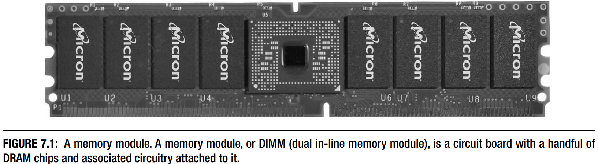
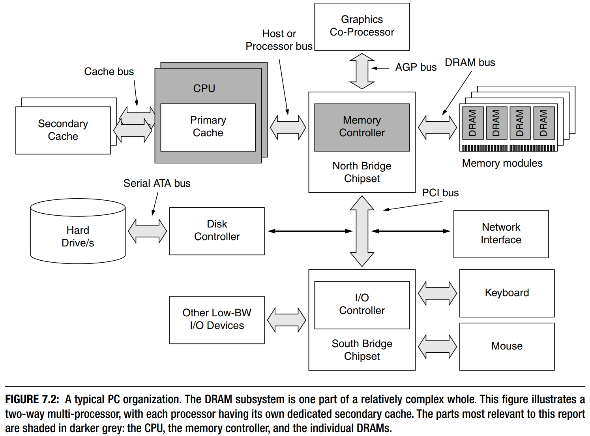

## Chapter 7: Overview of DRAMs

DRAM是您通过邮件订购或在商店购买的“计算机内存”。 这是您将更多内容放入计算机中的升级，以提高计算机的性能。它以图 7.1所示的形式出现在大多数计算机中——无处不在的内存模块，一个小型计算机板（印刷电路板，或 PCB），上面附有少量芯片。图中模块上的八个黑色矩形是DRAM芯片：塑料封装，每个封装都包含一个DRAM芯片（非常薄、易碎的硅片）。

图 7.2说明了DRAM在典型PC中的位置。单个DRAM设备通常通过内存控制器间接连接到CPU（即微处理器）。在PC系统中，内存控制器是北桥芯片组的一部分，它可能处理多个微处理器、图形协处理器、与南桥芯片组的通信（反过来，南桥芯片组处理系统的所有I/O功能），以及与DRAM系统的接口。尽管现在仍然经常被称为“芯片组”，但南北桥芯片组不再是芯片组。它们通常被实现为单个芯片，并且在某些系统中，两者的功能被合并到单个芯片中。

由于DRAM通常根据定义是外部设备，因此其使用、设计和分析必须考虑在片上存储器（如 SRAM 高速缓存和暂存器）的使用、设计和分析中经常被忽略的实施效果。设计师必须考虑的问题包括：

- 引脚（例如，它们的电容和电感）
- 信号
- 信号完整性
- 封装
- 时钟和同步
- 时序约定

在设计DRAM系统时如果不考虑这些问题，肯定会导致设计欠佳，而且很可能无法正常工作。因此，本书这一部分的大部分内容都处理了前面关于缓存的部分中没有涉及的低级实现问题。

### 7.1 DRAM Basics: Internals, Operation

对每个位使用单个晶体管-电容器对的随机存取存储器 (RAM) 称为动态随机存取存储器或 DRAM。 图 7.3 在右下角显示了 DRAM 中存储单元的电路。 该电路是动态的，因为存储电子的电容器不是完美的设备，它们最终会泄漏。为了保留存储在那里的信息，要求DRAM 中的每个电容器都必须定期刷新（即读取和重写）。

