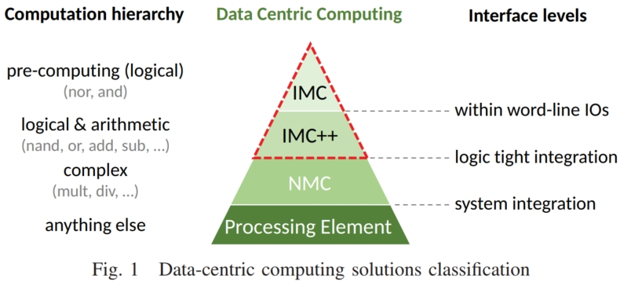
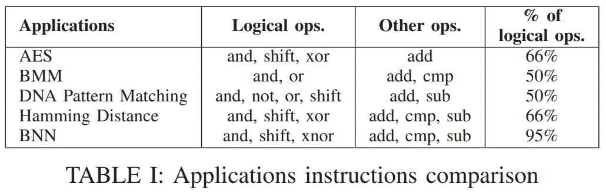

# Memory sizing of a scalable SRAM in-memory computing tile based architecture

## Motivation and Key Ideas of This Work

本文作者根据给定的缓存大小研究了一组应用程序，结果表明单个缓存实例不足以包含大型数据集，并且需要多个具有线互连的缓存实例。

本文提出了一种根据支持IMC的应用程序集来评估以数据为中心的架构的互连成本的方法，目的是创建一个连线模型。与完整的布局布线设计流程相比，该模型的新颖性为存储器设计人员提供了更精确的尺寸和更快的估计。

**Achievements:** 通过将缓存拆分为多个子块，与单个大型 IMC 内存实例相比，我们可以实现更低的能量（高达 78% 的增益）和更快（高达 49% 的增益）的 IMC 块。

## Related Works

这边相关的工作就不过多介绍了，都是一些比较经典的相关论文。但是这边的图1比较有意思。可以看出作者将数据中心计算的解决方案分为了四类，分别是：IMC，IMC++，NMC和PE，分别对应着不同的加速粒度/复杂度。

## IMC的应用探索

本文选取的应用以及操作占比如表1所示。这边结果的提取方式比较有意义，应用的是基于LLVM的一个框架[1](#refer-anchor-1),[2](#refer-anchor-2)，有空可以学习一下。

## 参考文献

- [1]	 M. Kooli, H. Charles, C. Touzet, B. Giraud, and J. Noël, "Software Platform Dedicated for In-Memory Computing Circuit Evaluation," in 2017 International Symposium on Rapid System Prototyping (RSP), 19-20 Oct. 2017 2017, pp. 43-49. 

- [2]	 M. Kooli, H. Charles, C. Touzet, B. Giraud, and J. Noel, "Smart instruction codes for in-memory computing architectures compatible with standard SRAM interfaces," in 2018 Design, Automation & Test in Europe Conference & Exhibition (DATE), 19-23 March 2018 2018, pp. 1634-1639, doi: 10.23919/DATE.2018.8342276. 
